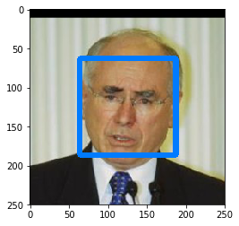
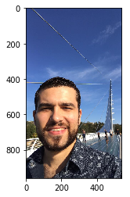

# Artificial Intelligence Nanodegree

## Convolutional Neural Networks

## Project: Write an Algorithm for a Dog Identification App 

---

In this notebook, some template code has already been provided for you, and you will need to implement additional functionality to successfully complete this project. You will not need to modify the included code beyond what is requested. Sections that begin with **'(IMPLEMENTATION)'** in the header indicate that the following block of code will require additional functionality which you must provide. Instructions will be provided for each section, and the specifics of the implementation are marked in the code block with a 'TODO' statement. Please be sure to read the instructions carefully! 

> **Note**: Once you have completed all of the code implementations, you need to finalize your work by exporting the iPython Notebook as an HTML document. Before exporting the notebook to html, all of the code cells need to have been run so that reviewers can see the final implementation and output. You can then export the notebook by using the menu above and navigating to  \n",
    "**File -> Download as -> HTML (.html)**. Include the finished document along with this notebook as your submission.

In addition to implementing code, there will be questions that you must answer which relate to the project and your implementation. Each section where you will answer a question is preceded by a **'Question X'** header. Carefully read each question and provide thorough answers in the following text boxes that begin with **'Answer:'**. Your project submission will be evaluated based on your answers to each of the questions and the implementation you provide.

>**Note:** Code and Markdown cells can be executed using the **Shift + Enter** keyboard shortcut.  Markdown cells can be edited by double-clicking the cell to enter edit mode.

The rubric contains _optional_ "Stand Out Suggestions" for enhancing the project beyond the minimum requirements. If you decide to pursue the "Stand Out Suggestions", you should include the code in this IPython notebook.


---
### Why We're Here 

In this notebook, you will make the first steps towards developing an algorithm that could be used as part of a mobile or web app.  At the end of this project, your code will accept any user-supplied image as input.  If a dog is detected in the image, it will provide an estimate of the dog's breed.  If a human is detected, it will provide an estimate of the dog breed that is most resembling.  The image below displays potential sample output of your finished project (... but we expect that each student's algorithm will behave differently!). 


In this real-world setting, you will need to piece together a series of models to perform different tasks; for instance, the algorithm that detects humans in an image will be different from the CNN that infers dog breed.  There are many points of possible failure, and no perfect algorithm exists.  Your imperfect solution will nonetheless create a fun user experience!

### The Road Ahead

We break the notebook into separate steps.  Feel free to use the links below to navigate the notebook.

* [Step 0](#step0): Import Datasets
* [Step 1](#step1): Detect Humans
* [Step 2](#step2): Detect Dogs
* [Step 3](#step3): Create a CNN to Classify Dog Breeds (from Scratch)
* [Step 4](#step4): Use a CNN to Classify Dog Breeds (using Transfer Learning)
* [Step 5](#step5): Create a CNN to Classify Dog Breeds (using Transfer Learning)
* [Step 6](#step6): Write your Algorithm
* [Step 7](#step7): Test Your Algorithm

---
<a id='step0'></a>
## Step 0: Import Datasets

### Import Dog Dataset

In the code cell below, we import a dataset of dog images.  We populate a few variables through the use of the `load_files` function from the scikit-learn library:
- `train_files`, `valid_files`, `test_files` - numpy arrays containing file paths to images
- `train_targets`, `valid_targets`, `test_targets` - numpy arrays containing onehot-encoded classification labels 
- `dog_names` - list of string-valued dog breed names for translating labels


```python
from sklearn.datasets import load_files       
from keras.utils import np_utils
import numpy as np
from glob import glob

# define function to load train, test, and validation datasets
def load_dataset(path):
    data = load_files(path)
    dog_files = np.array(data['filenames'])
    dog_targets = np_utils.to_categorical(np.array(data['target']), 133)
    return dog_files, dog_targets

# load train, test, and validation datasets
train_files, train_targets = load_dataset('dogImages/train')
valid_files, valid_targets = load_dataset('dogImages/valid')
test_files, test_targets = load_dataset('dogImages/test')

# load list of dog names
dog_names = [item[20:-1] for item in sorted(glob("dogImages/train/*/"))]

# print statistics about the dataset
print('There are %d total dog categories.' % len(dog_names))
print('There are %s total dog images.\n' % len(np.hstack([train_files, valid_files, test_files])))
print('There are %d training dog images.' % len(train_files))
print('There are %d validation dog images.' % len(valid_files))
print('There are %d test dog images.'% len(test_files))
```

    Using TensorFlow backend.
    

    There are 133 total dog categories.
    There are 8351 total dog images.
    
    There are 6680 training dog images.
    There are 835 validation dog images.
    There are 836 test dog images.
    

### Import Human Dataset

In the code cell below, we import a dataset of human images, where the file paths are stored in the numpy array `human_files`.


```python
import random
random.seed(8675309)

# load filenames in shuffled human dataset
human_files = np.array(glob("lfw/*/*"))
random.shuffle(human_files)

# print statistics about the dataset
print('There are %d total human images.' % len(human_files))
```

    There are 13234 total human images.
    

---
<a id='step1'></a>
## Step 1: Detect Humans

We use OpenCV's implementation of [Haar feature-based cascade classifiers](http://docs.opencv.org/trunk/d7/d8b/tutorial_py_face_detection.html) to detect human faces in images.  OpenCV provides many pre-trained face detectors, stored as XML files on [github](https://github.com/opencv/opencv/tree/master/data/haarcascades).  We have downloaded one of these detectors and stored it in the `haarcascades` directory.

In the next code cell, we demonstrate how to use this detector to find human faces in a sample image.


```python
import cv2                
import matplotlib.pyplot as plt                        
%matplotlib inline                               

# extract pre-trained face detector
face_cascade = cv2.CascadeClassifier('haarcascades/haarcascade_frontalface_alt.xml')

# load color (BGR) image
img = cv2.imread(human_files[110])
print(human_files[110])
# convert BGR image to grayscale
gray = cv2.cvtColor(img, cv2.COLOR_BGR2GRAY)

# find faces in image
faces = face_cascade.detectMultiScale(gray)

# print number of faces detected in the image
print('Number of faces detected:', len(faces))

# get bounding box for each detected face
for (x,y,w,h) in faces:
    # add bounding box to color image
    cv2.rectangle(img,(x,y),(x+w,y+h),(255,123,0),5)
    
# convert BGR image to RGB for plotting
cv_rgb = cv2.cvtColor(img, cv2.COLOR_BGR2RGB)

# display the image, along with bounding box
plt.imshow(cv_rgb)
plt.show()
```

    lfw\John_Howard\John_Howard_0016.jpg
    Number of faces detected: 1
    





Before using any of the face detectors, it is standard procedure to convert the images to grayscale.  The `detectMultiScale` function executes the classifier stored in `face_cascade` and takes the grayscale image as a parameter.  

In the above code, `faces` is a numpy array of detected faces, where each row corresponds to a detected face.  Each detected face is a 1D array with four entries that specifies the bounding box of the detected face.  The first two entries in the array (extracted in the above code as `x` and `y`) specify the horizontal and vertical positions of the top left corner of the bounding box.  The last two entries in the array (extracted here as `w` and `h`) specify the width and height of the box.

### Write a Human Face Detector

We can use this procedure to write a function that returns `True` if a human face is detected in an image and `False` otherwise.  This function, aptly named `face_detector`, takes a string-valued file path to an image as input and appears in the code block below.


```python
# returns "True" if face is detected in image stored at img_path
def face_detector(img_path):
    img = cv2.imread(img_path)
    gray = cv2.cvtColor(img, cv2.COLOR_BGR2GRAY)
    faces = face_cascade.detectMultiScale(gray)
    return len(faces) > 0
```

### (IMPLEMENTATION) Assess the Human Face Detector

__Question 1:__ Use the code cell below to test the performance of the `face_detector` function.  
- What percentage of the first 100 images in `human_files` have a detected human face?  
- What percentage of the first 100 images in `dog_files` have a detected human face? 

Ideally, we would like 100% of human images with a detected face and 0% of dog images with a detected face.  You will see that our algorithm falls short of this goal, but still gives acceptable performance.  We extract the file paths for the first 100 images from each of the datasets and store them in the numpy arrays `human_files_short` and `dog_files_short`.

__Answer:__ 


```python
human_files_short = human_files[:100]
dog_files_short = train_files[:100]
per = 0
# Do NOT modify the code above this line.
def human_faces(array):
    total = 0
    perc = 0
    for x in range (len(array)):
        result = face_detector(array[x])
        if(result==True):
            perc = perc+1
        total = total+1
    return((perc/total)*100)
per = human_faces(human_files_short)
print('There are %s total human faces detected in human images.' % "{0:.0f}%".format(per))
per = human_faces(dog_files_short)
print('There are %s total human faces detected in dog images.' % "{0:.0f}%".format(per))
## TODO: Test the performance of the face_detector algorithm 
## on the images in human_files_short and dog_files_short.
```

    There are 100% total human faces detected in human images.
    There are 12% total human faces detected in dog images.
    

__Question 2:__ This algorithmic choice necessitates that we communicate to the user that we accept human images only when they provide a clear view of a face (otherwise, we risk having unneccessarily frustrated users!). In your opinion, is this a reasonable expectation to pose on the user? If not, can you think of a way to detect humans in images that does not necessitate an image with a clearly presented face?

__Answer:__ The solution is to train a Deep Convolutional Neural Network. But instead of training the network to recognize pictures objects, we are going to train it to generate 128 measurements for each face.
Geitgey, Alan. "Machine Learning is Fun! Part 4: Modern Face Recognition with Deep Learning" Medium. 24 Jul. 2016.

We suggest the face detector from OpenCV as a potential way to detect human images in your algorithm, but you are free to explore other approaches, especially approaches that make use of deep learning :).  Please use the code cell below to design and test your own face detection algorithm.  If you decide to pursue this _optional_ task, report performance on each of the datasets.


```python
## (Optional) TODO: Report the performance of another  
## face detection algorithm on the LFW dataset
### Feel free to use as many code cells as needed.
```

---
<a id='step2'></a>
## Step 2: Detect Dogs

In this section, we use a pre-trained [ResNet-50](http://ethereon.github.io/netscope/#/gist/db945b393d40bfa26006) model to detect dogs in images.  Our first line of code downloads the ResNet-50 model, along with weights that have been trained on [ImageNet](http://www.image-net.org/), a very large, very popular dataset used for image classification and other vision tasks.  ImageNet contains over 10 million URLs, each linking to an image containing an object from one of [1000 categories](https://gist.github.com/yrevar/942d3a0ac09ec9e5eb3a).  Given an image, this pre-trained ResNet-50 model returns a prediction (derived from the available categories in ImageNet) for the object that is contained in the image.


```python
from keras.applications.resnet50 import ResNet50

# define ResNet50 model
ResNet50_model = ResNet50(weights='imagenet')
```

### Pre-process the Data

When using TensorFlow as backend, Keras CNNs require a 4D array (which we'll also refer to as a 4D tensor) as input, with shape

$$
(\text{nb_samples}, \text{rows}, \text{columns}, \text{channels}),
$$

where `nb_samples` corresponds to the total number of images (or samples), and `rows`, `columns`, and `channels` correspond to the number of rows, columns, and channels for each image, respectively.  

The `path_to_tensor` function below takes a string-valued file path to a color image as input and returns a 4D tensor suitable for supplying to a Keras CNN.  The function first loads the image and resizes it to a square image that is $224 \times 224$ pixels.  Next, the image is converted to an array, which is then resized to a 4D tensor.  In this case, since we are working with color images, each image has three channels.  Likewise, since we are processing a single image (or sample), the returned tensor will always have shape

$$
(1, 224, 224, 3).
$$

The `paths_to_tensor` function takes a numpy array of string-valued image paths as input and returns a 4D tensor with shape 

$$
(\text{nb_samples}, 224, 224, 3).
$$

Here, `nb_samples` is the number of samples, or number of images, in the supplied array of image paths.  It is best to think of `nb_samples` as the number of 3D tensors (where each 3D tensor corresponds to a different image) in your dataset!


```python
from keras.preprocessing import image                  
from tqdm import tqdm

def path_to_tensor(img_path):
    # loads RGB image as PIL.Image.Image type
    img = image.load_img(img_path, target_size=(224, 224))
    # convert PIL.Image.Image type to 3D tensor with shape (224, 224, 3)
    x = image.img_to_array(img)
    # convert 3D tensor to 4D tensor with shape (1, 224, 224, 3) and return 4D tensor
    return np.expand_dims(x, axis=0)

def paths_to_tensor(img_paths):
    list_of_tensors = [path_to_tensor(img_path) for img_path in tqdm(img_paths)]
    return np.vstack(list_of_tensors)
```

### Making Predictions with ResNet-50

Getting the 4D tensor ready for ResNet-50, and for any other pre-trained model in Keras, requires some additional processing.  First, the RGB image is converted to BGR by reordering the channels.  All pre-trained models have the additional normalization step that the mean pixel (expressed in RGB as $[103.939, 116.779, 123.68]$ and calculated from all pixels in all images in ImageNet) must be subtracted from every pixel in each image.  This is implemented in the imported function `preprocess_input`.  If you're curious, you can check the code for `preprocess_input` [here](https://github.com/fchollet/keras/blob/master/keras/applications/imagenet_utils.py).

Now that we have a way to format our image for supplying to ResNet-50, we are now ready to use the model to extract the predictions.  This is accomplished with the `predict` method, which returns an array whose $i$-th entry is the model's predicted probability that the image belongs to the $i$-th ImageNet category.  This is implemented in the `ResNet50_predict_labels` function below.

By taking the argmax of the predicted probability vector, we obtain an integer corresponding to the model's predicted object class, which we can identify with an object category through the use of this [dictionary](https://gist.github.com/yrevar/942d3a0ac09ec9e5eb3a). 


```python
from keras.applications.resnet50 import preprocess_input, decode_predictions

def ResNet50_predict_labels(img_path):
    # returns prediction vector for image located at img_path
    img = preprocess_input(path_to_tensor(img_path))
    return np.argmax(ResNet50_model.predict(img))
```

### Write a Dog Detector

While looking at the [dictionary](https://gist.github.com/yrevar/942d3a0ac09ec9e5eb3a), you will notice that the categories corresponding to dogs appear in an uninterrupted sequence and correspond to dictionary keys 151-268, inclusive, to include all categories from `'Chihuahua'` to `'Mexican hairless'`.  Thus, in order to check to see if an image is predicted to contain a dog by the pre-trained ResNet-50 model, we need only check if the `ResNet50_predict_labels` function above returns a value between 151 and 268 (inclusive).

We use these ideas to complete the `dog_detector` function below, which returns `True` if a dog is detected in an image (and `False` if not).


```python
### returns "True" if a dog is detected in the image stored at img_path
def dog_detector(img_path):
    prediction = ResNet50_predict_labels(img_path)
    return ((prediction <= 268) & (prediction >= 151)) 
```

### (IMPLEMENTATION) Assess the Dog Detector

__Question 3:__ Use the code cell below to test the performance of your `dog_detector` function.  
- What percentage of the images in `human_files_short` have a detected dog?  
- What percentage of the images in `dog_files_short` have a detected dog?

__Answer:__ 


```python
percent = 0
def dog_det(array):
    total = 0
    perc = 0
    for x in range (len(array)):
        result = dog_detector(array[x])
        #print(result)
        if(result==True):
            perc = perc+1
        total = total+1
    return((perc/total)*100)
percent = dog_det(human_files_short)
print('There are %s total dogs detected in human images.' % "{0:.0f}%".format(percent))
percent = dog_det(dog_files_short)
print('There are %s total dogs detected in dog images.' % "{0:.0f}%".format(percent))
### TODO: Test the performance of the dog_detector function
### on the images in human_files_short and dog_files_short.
```

    There are 1% total dogs detected in human images.
    There are 100% total dogs detected in dog images.
    

---
<a id='step3'></a>
## Step 3: Create a CNN to Classify Dog Breeds (from Scratch)

Now that we have functions for detecting humans and dogs in images, we need a way to predict breed from images.  In this step, you will create a CNN that classifies dog breeds.  You must create your CNN _from scratch_ (so, you can't use transfer learning _yet_!), and you must attain a test accuracy of at least 1%.  In Step 5 of this notebook, you will have the opportunity to use transfer learning to create a CNN that attains greatly improved accuracy.

Be careful with adding too many trainable layers!  More parameters means longer training, which means you are more likely to need a GPU to accelerate the training process.  Thankfully, Keras provides a handy estimate of the time that each epoch is likely to take; you can extrapolate this estimate to figure out how long it will take for your algorithm to train. 

We mention that the task of assigning breed to dogs from images is considered exceptionally challenging.  To see why, consider that *even a human* would have great difficulty in distinguishing between a Brittany and a Welsh Springer Spaniel.  

Brittany | Welsh Springer Spaniel
- | - 
 | 

It is not difficult to find other dog breed pairs with minimal inter-class variation (for instance, Curly-Coated Retrievers and American Water Spaniels).  

Curly-Coated Retriever | American Water Spaniel
- | -
 | 


Likewise, recall that labradors come in yellow, chocolate, and black.  Your vision-based algorithm will have to conquer this high intra-class variation to determine how to classify all of these different shades as the same breed.  

Yellow Labrador | Chocolate Labrador | Black Labrador
- | -
 |  | 

We also mention that random chance presents an exceptionally low bar: setting aside the fact that the classes are slightly imabalanced, a random guess will provide a correct answer roughly 1 in 133 times, which corresponds to an accuracy of less than 1%.  

Remember that the practice is far ahead of the theory in deep learning.  Experiment with many different architectures, and trust your intuition.  And, of course, have fun! 

### Pre-process the Data

We rescale the images by dividing every pixel in every image by 255.


```python
from PIL import ImageFile                            
ImageFile.LOAD_TRUNCATED_IMAGES = True                 

# pre-process the data for Keras
train_tensors = paths_to_tensor(train_files).astype('float32')/255
valid_tensors = paths_to_tensor(valid_files).astype('float32')/255
test_tensors = paths_to_tensor(test_files).astype('float32')/255
```

    100%|██████████████████████████████████████████████████████████████████████████████| 6680/6680 [03:09<00:00, 35.25it/s]
    100%|████████████████████████████████████████████████████████████████████████████████| 835/835 [00:21<00:00, 39.23it/s]
    100%|████████████████████████████████████████████████████████████████████████████████| 836/836 [00:31<00:00, 26.17it/s]
    

### (IMPLEMENTATION) Model Architecture

Create a CNN to classify dog breed.  At the end of your code cell block, summarize the layers of your model by executing the line:
    
        model.summary()

We have imported some Python modules to get you started, but feel free to import as many modules as you need.  If you end up getting stuck, here's a hint that specifies a model that trains relatively fast on CPU and attains >1% test accuracy in 5 epochs:


           
__Question 4:__ Outline the steps you took to get to your final CNN architecture and your reasoning at each step.  If you chose to use the hinted architecture above, describe why you think that CNN architecture should work well for the image classification task.

__Answer:__ I think this architecture will work good because it has 3 sets of convolutional with max pooling layers. The first layer detects lines and blobs, the second layer detects circles, stripes and rectangles, the third layer detects grids, honeycombs and faces. I could add more convolutional and max pooling layers but I will have more parameters and the training will be slower. I understand that if I add more layers it will detect more complex features, but I feel this will work for the required greater than 1%.


```python
from keras.layers import Conv2D, MaxPooling2D, GlobalAveragePooling2D
from keras.layers import Dropout, Flatten, Dense
from keras.models import Sequential

model = Sequential()

model.add(Conv2D(filters=16, kernel_size=2, padding='valid', activation='relu', 
                        input_shape=(224, 224, 3))) # I implemented a convolutional layer with 16 filters and padding to valid
                                                    # to obtain a layer of filters with size 223x223 with a depth of 16
model.add(MaxPooling2D(pool_size=2)) # I implemented a max pooling layer of size 2 to reduce the pixels in the filters by half
model.add(Conv2D(filters=32, kernel_size=2, padding='valid', activation='relu')) # I implemented a convolutional layer with 32 filters
                                    # and padding to valid to obtain a layer of filters with size 110x110 with a depth of 32            
model.add(MaxPooling2D(pool_size=2)) # I implemented another max pooling layer to reduce the pixels in the filters again by half
model.add(Conv2D(filters=64, kernel_size=2, padding='same', activation='relu')) # I implemented a convolutional layer with 64 filters and padding to same
                                                    # to obtain a layer of filters with size 55x55 with a depth of 64
model.add(GlobalAveragePooling2D()) # I implemented a global average pooling layer to obtain the average for each filter to convert it to a vector
model.add(Dropout(0.3)) # I implemented a Dropout layer to avoid overfitting
model.add(Dense(133, activation='softmax')) # I implemented a final output layer of 133 different classifications for dog breeds using 
                                            # softmax to obtain the probabilities of each dog breed
### TODO: Define your architecture.

model.summary()
```

    _________________________________________________________________
    Layer (type)                 Output Shape              Param #   
    =================================================================
    conv2d_1 (Conv2D)            (None, 223, 223, 16)      208       
    _________________________________________________________________
    max_pooling2d_2 (MaxPooling2 (None, 111, 111, 16)      0         
    _________________________________________________________________
    conv2d_2 (Conv2D)            (None, 110, 110, 32)      2080      
    _________________________________________________________________
    max_pooling2d_3 (MaxPooling2 (None, 55, 55, 32)        0         
    _________________________________________________________________
    conv2d_3 (Conv2D)            (None, 55, 55, 64)        8256      
    _________________________________________________________________
    global_average_pooling2d_1 ( (None, 64)                0         
    _________________________________________________________________
    dropout_1 (Dropout)          (None, 64)                0         
    _________________________________________________________________
    dense_1 (Dense)              (None, 133)               8645      
    =================================================================
    Total params: 19,189
    Trainable params: 19,189
    Non-trainable params: 0
    _________________________________________________________________
    

### Compile the Model


```python
model.compile(optimizer='rmsprop', loss='categorical_crossentropy', metrics=['accuracy'])
```

### (IMPLEMENTATION) Train the Model

Train your model in the code cell below.  Use model checkpointing to save the model that attains the best validation loss.

You are welcome to [augment the training data](https://blog.keras.io/building-powerful-image-classification-models-using-very-little-data.html), but this is not a requirement. 


```python
from keras.callbacks import ModelCheckpoint  

### TODO: specify the number of epochs that you would like to use to train the model.

epochs = 5

### Do NOT modify the code below this line.

checkpointer = ModelCheckpoint(filepath='saved_models/weights.best.from_scratch.hdf5', 
                               verbose=1, save_best_only=True)

model.fit(train_tensors, train_targets, 
          validation_data=(valid_tensors, valid_targets),
          epochs=epochs, batch_size=20, callbacks=[checkpointer], verbose=1)
```

    Train on 6680 samples, validate on 835 samples
    Epoch 1/5
    4040/6680 [=================>............] - ETA: 16:53 - loss: 4.9076 - acc: 0.0000e+ - ETA: 11:33 - loss: 4.9014 - acc: 0.0000e+ - ETA: 9:43 - loss: 4.8933 - acc: 0.0167     - ETA: 8:45 - loss: 4.8961 - acc: 0.012 - ETA: 8:07 - loss: 4.9072 - acc: 0.010 - ETA: 7:42 - loss: 4.9043 - acc: 0.008 - ETA: 7:23 - loss: 4.9032 - acc: 0.007 - ETA: 7:11 - loss: 4.9004 - acc: 0.012 - ETA: 7:01 - loss: 4.8991 - acc: 0.011 - ETA: 6:52 - loss: 4.8949 - acc: 0.010 - ETA: 8:38 - loss: 4.8954 - acc: 0.009 - ETA: 8:26 - loss: 4.8940 - acc: 0.008 - ETA: 8:17 - loss: 4.8912 - acc: 0.007 - ETA: 8:10 - loss: 4.8887 - acc: 0.007 - ETA: 8:04 - loss: 4.8909 - acc: 0.006 - ETA: 7:57 - loss: 4.8900 - acc: 0.006 - ETA: 7:47 - loss: 4.8883 - acc: 0.008 - ETA: 7:39 - loss: 4.8892 - acc: 0.008 - ETA: 8:17 - loss: 4.8882 - acc: 0.007 - ETA: 8:09 - loss: 4.8882 - acc: 0.007 - ETA: 8:00 - loss: 4.8894 - acc: 0.007 - ETA: 7:52 - loss: 4.8878 - acc: 0.006 - ETA: 7:44 - loss: 4.8897 - acc: 0.006 - ETA: 7:50 - loss: 4.8915 - acc: 0.006 - ETA: 7:43 - loss: 4.8926 - acc: 0.006 - ETA: 7:36 - loss: 4.8931 - acc: 0.005 - ETA: 7:30 - loss: 4.8922 - acc: 0.005 - ETA: 7:24 - loss: 4.8922 - acc: 0.005 - ETA: 7:21 - loss: 4.8909 - acc: 0.006 - ETA: 7:17 - loss: 4.8921 - acc: 0.006 - ETA: 7:14 - loss: 4.8922 - acc: 0.006 - ETA: 7:12 - loss: 4.8932 - acc: 0.006 - ETA: 7:31 - loss: 4.8931 - acc: 0.007 - ETA: 7:27 - loss: 4.8922 - acc: 0.007 - ETA: 7:24 - loss: 4.8925 - acc: 0.007 - ETA: 7:21 - loss: 4.8930 - acc: 0.006 - ETA: 7:17 - loss: 4.8927 - acc: 0.006 - ETA: 7:14 - loss: 4.8922 - acc: 0.006 - ETA: 7:10 - loss: 4.8927 - acc: 0.006 - ETA: 7:07 - loss: 4.8922 - acc: 0.006 - ETA: 7:04 - loss: 4.8933 - acc: 0.007 - ETA: 7:01 - loss: 4.8938 - acc: 0.007 - ETA: 6:58 - loss: 4.8934 - acc: 0.007 - ETA: 6:55 - loss: 4.8932 - acc: 0.006 - ETA: 6:53 - loss: 4.8927 - acc: 0.006 - ETA: 6:51 - loss: 4.8930 - acc: 0.006 - ETA: 6:49 - loss: 4.8929 - acc: 0.007 - ETA: 6:47 - loss: 4.8935 - acc: 0.007 - ETA: 6:46 - loss: 4.8929 - acc: 0.007 - ETA: 6:44 - loss: 4.8931 - acc: 0.007 - ETA: 6:42 - loss: 4.8933 - acc: 0.006 - ETA: 6:39 - loss: 4.8924 - acc: 0.007 - ETA: 6:37 - loss: 4.8928 - acc: 0.007 - ETA: 6:34 - loss: 4.8926 - acc: 0.008 - ETA: 6:32 - loss: 4.8925 - acc: 0.008 - ETA: 6:29 - loss: 4.8926 - acc: 0.008 - ETA: 6:27 - loss: 4.8928 - acc: 0.007 - ETA: 6:25 - loss: 4.8931 - acc: 0.007 - ETA: 6:24 - loss: 4.8928 - acc: 0.007 - ETA: 6:22 - loss: 4.8927 - acc: 0.008 - ETA: 6:20 - loss: 4.8925 - acc: 0.008 - ETA: 6:18 - loss: 4.8925 - acc: 0.008 - ETA: 6:16 - loss: 4.8918 - acc: 0.007 - ETA: 6:14 - loss: 4.8919 - acc: 0.007 - ETA: 6:13 - loss: 4.8923 - acc: 0.007 - ETA: 6:23 - loss: 4.8920 - acc: 0.007 - ETA: 6:21 - loss: 4.8923 - acc: 0.007 - ETA: 6:20 - loss: 4.8919 - acc: 0.007 - ETA: 6:19 - loss: 4.8918 - acc: 0.007 - ETA: 6:18 - loss: 4.8918 - acc: 0.007 - ETA: 6:16 - loss: 4.8917 - acc: 0.007 - ETA: 6:15 - loss: 4.8915 - acc: 0.006 - ETA: 6:14 - loss: 4.8916 - acc: 0.006 - ETA: 6:12 - loss: 4.8908 - acc: 0.006 - ETA: 6:11 - loss: 4.8905 - acc: 0.007 - ETA: 6:09 - loss: 4.8903 - acc: 0.007 - ETA: 6:07 - loss: 4.8904 - acc: 0.007 - ETA: 6:07 - loss: 4.8902 - acc: 0.007 - ETA: 6:08 - loss: 4.8903 - acc: 0.007 - ETA: 6:06 - loss: 4.8900 - acc: 0.007 - ETA: 6:05 - loss: 4.8898 - acc: 0.007 - ETA: 6:04 - loss: 4.8898 - acc: 0.007 - ETA: 6:02 - loss: 4.8898 - acc: 0.007 - ETA: 6:01 - loss: 4.8897 - acc: 0.007 - ETA: 6:05 - loss: 4.8900 - acc: 0.007 - ETA: 6:02 - loss: 4.8902 - acc: 0.007 - ETA: 6:01 - loss: 4.8901 - acc: 0.007 - ETA: 5:58 - loss: 4.8895 - acc: 0.008 - ETA: 5:56 - loss: 4.8895 - acc: 0.007 - ETA: 5:54 - loss: 4.8899 - acc: 0.007 - ETA: 5:52 - loss: 4.8895 - acc: 0.008 - ETA: 5:50 - loss: 4.8896 - acc: 0.008 - ETA: 5:48 - loss: 4.8899 - acc: 0.008 - ETA: 5:46 - loss: 4.8898 - acc: 0.008 - ETA: 5:44 - loss: 4.8891 - acc: 0.008 - ETA: 5:42 - loss: 4.8890 - acc: 0.008 - ETA: 5:40 - loss: 4.8893 - acc: 0.008 - ETA: 5:38 - loss: 4.8891 - acc: 0.008 - ETA: 5:36 - loss: 4.8894 - acc: 0.008 - ETA: 5:34 - loss: 4.8896 - acc: 0.008 - ETA: 5:32 - loss: 4.8900 - acc: 0.007 - ETA: 5:30 - loss: 4.8902 - acc: 0.007 - ETA: 5:30 - loss: 4.8900 - acc: 0.007 - ETA: 5:28 - loss: 4.8904 - acc: 0.007 - ETA: 5:26 - loss: 4.8903 - acc: 0.007 - ETA: 5:24 - loss: 4.8900 - acc: 0.007 - ETA: 5:22 - loss: 4.8902 - acc: 0.007 - ETA: 5:20 - loss: 4.8901 - acc: 0.007 - ETA: 5:17 - loss: 4.8901 - acc: 0.007 - ETA: 5:15 - loss: 4.8899 - acc: 0.007 - ETA: 5:13 - loss: 4.8904 - acc: 0.007 - ETA: 5:11 - loss: 4.8905 - acc: 0.007 - ETA: 5:09 - loss: 4.8905 - acc: 0.007 - ETA: 5:06 - loss: 4.8904 - acc: 0.007 - ETA: 5:04 - loss: 4.8905 - acc: 0.007 - ETA: 5:02 - loss: 4.8905 - acc: 0.007 - ETA: 5:00 - loss: 4.8904 - acc: 0.007 - ETA: 4:58 - loss: 4.8904 - acc: 0.007 - ETA: 4:57 - loss: 4.8906 - acc: 0.007 - ETA: 4:55 - loss: 4.8906 - acc: 0.007 - ETA: 4:53 - loss: 4.8904 - acc: 0.007 - ETA: 4:51 - loss: 4.8901 - acc: 0.007 - ETA: 4:49 - loss: 4.8901 - acc: 0.007 - ETA: 4:47 - loss: 4.8901 - acc: 0.007 - ETA: 4:46 - loss: 4.8904 - acc: 0.007 - ETA: 4:44 - loss: 4.8902 - acc: 0.007 - ETA: 4:42 - loss: 4.8904 - acc: 0.007 - ETA: 4:40 - loss: 4.8906 - acc: 0.007 - ETA: 4:39 - loss: 4.8907 - acc: 0.007 - ETA: 4:46 - loss: 4.8905 - acc: 0.006 - ETA: 4:44 - loss: 4.8903 - acc: 0.007 - ETA: 4:43 - loss: 4.8906 - acc: 0.007 - ETA: 4:41 - loss: 4.8907 - acc: 0.007 - ETA: 4:39 - loss: 4.8910 - acc: 0.007 - ETA: 4:38 - loss: 4.8908 - acc: 0.007 - ETA: 4:37 - loss: 4.8908 - acc: 0.007 - ETA: 4:36 - loss: 4.8907 - acc: 0.006 - ETA: 4:35 - loss: 4.8907 - acc: 0.006 - ETA: 4:33 - loss: 4.8904 - acc: 0.007 - ETA: 4:31 - loss: 4.8905 - acc: 0.007 - ETA: 4:30 - loss: 4.8903 - acc: 0.007 - ETA: 4:28 - loss: 4.8903 - acc: 0.007 - ETA: 4:27 - loss: 4.8905 - acc: 0.007 - ETA: 4:26 - loss: 4.8908 - acc: 0.006 - ETA: 4:24 - loss: 4.8906 - acc: 0.007 - ETA: 4:23 - loss: 4.8904 - acc: 0.007 - ETA: 4:22 - loss: 4.8904 - acc: 0.007 - ETA: 4:20 - loss: 4.8904 - acc: 0.007 - ETA: 4:19 - loss: 4.8902 - acc: 0.007 - ETA: 4:17 - loss: 4.8901 - acc: 0.007 - ETA: 4:16 - loss: 4.8900 - acc: 0.007 - ETA: 4:16 - loss: 4.8899 - acc: 0.006 - ETA: 4:14 - loss: 4.8899 - acc: 0.006 - ETA: 4:13 - loss: 4.8897 - acc: 0.007 - ETA: 4:12 - loss: 4.8898 - acc: 0.007 - ETA: 4:10 - loss: 4.8899 - acc: 0.007 - ETA: 4:08 - loss: 4.8898 - acc: 0.007 - ETA: 4:07 - loss: 4.8898 - acc: 0.007 - ETA: 4:05 - loss: 4.8897 - acc: 0.007 - ETA: 4:04 - loss: 4.8898 - acc: 0.007 - ETA: 4:02 - loss: 4.8898 - acc: 0.007 - ETA: 4:01 - loss: 4.8900 - acc: 0.007 - ETA: 3:59 - loss: 4.8899 - acc: 0.007 - ETA: 3:57 - loss: 4.8899 - acc: 0.007 - ETA: 3:56 - loss: 4.8899 - acc: 0.007 - ETA: 3:54 - loss: 4.8898 - acc: 0.006 - ETA: 3:53 - loss: 4.8897 - acc: 0.006 - ETA: 3:51 - loss: 4.8897 - acc: 0.006 - ETA: 3:49 - loss: 4.8896 - acc: 0.006 - ETA: 3:48 - loss: 4.8896 - acc: 0.006 - ETA: 3:47 - loss: 4.8897 - acc: 0.006 - ETA: 3:45 - loss: 4.8897 - acc: 0.007 - ETA: 3:43 - loss: 4.8897 - acc: 0.006 - ETA: 3:42 - loss: 4.8898 - acc: 0.006 - ETA: 3:40 - loss: 4.8899 - acc: 0.006 - ETA: 3:40 - loss: 4.8900 - acc: 0.006 - ETA: 3:38 - loss: 4.8900 - acc: 0.006 - ETA: 3:37 - loss: 4.8900 - acc: 0.006 - ETA: 3:35 - loss: 4.8902 - acc: 0.006 - ETA: 3:33 - loss: 4.8900 - acc: 0.006 - ETA: 3:32 - loss: 4.8898 - acc: 0.007 - ETA: 3:30 - loss: 4.8898 - acc: 0.007 - ETA: 3:28 - loss: 4.8898 - acc: 0.007 - ETA: 3:27 - loss: 4.8897 - acc: 0.007 - ETA: 3:25 - loss: 4.8898 - acc: 0.007 - ETA: 3:24 - loss: 4.8897 - acc: 0.007 - ETA: 3:22 - loss: 4.8897 - acc: 0.007 - ETA: 3:20 - loss: 4.8899 - acc: 0.006 - ETA: 3:19 - loss: 4.8898 - acc: 0.006 - ETA: 3:17 - loss: 4.8897 - acc: 0.006 - ETA: 3:16 - loss: 4.8896 - acc: 0.007 - ETA: 3:14 - loss: 4.8896 - acc: 0.007 - ETA: 3:12 - loss: 4.8895 - acc: 0.007 - ETA: 3:11 - loss: 4.8896 - acc: 0.007 - ETA: 3:09 - loss: 4.8894 - acc: 0.006 - ETA: 3:08 - loss: 4.8894 - acc: 0.007 - ETA: 3:06 - loss: 4.8892 - acc: 0.007 - ETA: 3:06 - loss: 4.8890 - acc: 0.007 - ETA: 3:04 - loss: 4.8891 - acc: 0.007 - ETA: 3:03 - loss: 4.8892 - acc: 0.007 - ETA: 3:01 - loss: 4.8889 - acc: 0.007 - ETA: 2:59 - loss: 4.8890 - acc: 0.00726680/6680 [==============================] - ETA: 2:58 - loss: 4.8891 - acc: 0.007 - ETA: 2:56 - loss: 4.8890 - acc: 0.007 - ETA: 2:55 - loss: 4.8891 - acc: 0.007 - ETA: 2:53 - loss: 4.8891 - acc: 0.007 - ETA: 2:52 - loss: 4.8889 - acc: 0.007 - ETA: 2:50 - loss: 4.8889 - acc: 0.007 - ETA: 2:49 - loss: 4.8889 - acc: 0.006 - ETA: 2:47 - loss: 4.8888 - acc: 0.006 - ETA: 2:46 - loss: 4.8887 - acc: 0.006 - ETA: 2:44 - loss: 4.8888 - acc: 0.006 - ETA: 2:44 - loss: 4.8887 - acc: 0.007 - ETA: 2:42 - loss: 4.8888 - acc: 0.007 - ETA: 2:41 - loss: 4.8888 - acc: 0.007 - ETA: 2:39 - loss: 4.8888 - acc: 0.006 - ETA: 2:38 - loss: 4.8887 - acc: 0.006 - ETA: 2:36 - loss: 4.8887 - acc: 0.007 - ETA: 2:35 - loss: 4.8887 - acc: 0.007 - ETA: 2:33 - loss: 4.8886 - acc: 0.008 - ETA: 2:32 - loss: 4.8886 - acc: 0.008 - ETA: 2:31 - loss: 4.8885 - acc: 0.008 - ETA: 2:29 - loss: 4.8885 - acc: 0.008 - ETA: 2:28 - loss: 4.8886 - acc: 0.008 - ETA: 2:26 - loss: 4.8885 - acc: 0.008 - ETA: 2:25 - loss: 4.8885 - acc: 0.008 - ETA: 2:24 - loss: 4.8886 - acc: 0.008 - ETA: 2:22 - loss: 4.8885 - acc: 0.008 - ETA: 2:21 - loss: 4.8884 - acc: 0.008 - ETA: 2:19 - loss: 4.8884 - acc: 0.008 - ETA: 2:18 - loss: 4.8882 - acc: 0.008 - ETA: 2:17 - loss: 4.8881 - acc: 0.008 - ETA: 2:15 - loss: 4.8881 - acc: 0.008 - ETA: 2:14 - loss: 4.8880 - acc: 0.009 - ETA: 2:13 - loss: 4.8880 - acc: 0.009 - ETA: 2:11 - loss: 4.8879 - acc: 0.009 - ETA: 2:10 - loss: 4.8875 - acc: 0.009 - ETA: 2:08 - loss: 4.8876 - acc: 0.009 - ETA: 2:07 - loss: 4.8875 - acc: 0.009 - ETA: 2:06 - loss: 4.8876 - acc: 0.010 - ETA: 2:04 - loss: 4.8875 - acc: 0.010 - ETA: 2:03 - loss: 4.8874 - acc: 0.010 - ETA: 2:01 - loss: 4.8878 - acc: 0.010 - ETA: 2:00 - loss: 4.8878 - acc: 0.010 - ETA: 1:59 - loss: 4.8877 - acc: 0.010 - ETA: 1:57 - loss: 4.8877 - acc: 0.010 - ETA: 1:56 - loss: 4.8878 - acc: 0.010 - ETA: 1:54 - loss: 4.8878 - acc: 0.010 - ETA: 1:53 - loss: 4.8878 - acc: 0.010 - ETA: 1:52 - loss: 4.8877 - acc: 0.010 - ETA: 1:50 - loss: 4.8876 - acc: 0.010 - ETA: 1:49 - loss: 4.8876 - acc: 0.010 - ETA: 1:48 - loss: 4.8875 - acc: 0.010 - ETA: 1:46 - loss: 4.8874 - acc: 0.010 - ETA: 1:45 - loss: 4.8873 - acc: 0.010 - ETA: 1:43 - loss: 4.8872 - acc: 0.010 - ETA: 1:42 - loss: 4.8870 - acc: 0.010 - ETA: 1:41 - loss: 4.8871 - acc: 0.010 - ETA: 1:39 - loss: 4.8870 - acc: 0.010 - ETA: 1:38 - loss: 4.8870 - acc: 0.010 - ETA: 1:37 - loss: 4.8869 - acc: 0.010 - ETA: 1:35 - loss: 4.8869 - acc: 0.010 - ETA: 1:34 - loss: 4.8868 - acc: 0.010 - ETA: 1:32 - loss: 4.8869 - acc: 0.010 - ETA: 1:31 - loss: 4.8869 - acc: 0.010 - ETA: 1:30 - loss: 4.8869 - acc: 0.010 - ETA: 1:28 - loss: 4.8868 - acc: 0.010 - ETA: 1:27 - loss: 4.8865 - acc: 0.010 - ETA: 1:26 - loss: 4.8862 - acc: 0.010 - ETA: 1:24 - loss: 4.8863 - acc: 0.010 - ETA: 1:23 - loss: 4.8863 - acc: 0.010 - ETA: 1:21 - loss: 4.8863 - acc: 0.010 - ETA: 1:20 - loss: 4.8865 - acc: 0.010 - ETA: 1:19 - loss: 4.8864 - acc: 0.010 - ETA: 1:17 - loss: 4.8865 - acc: 0.010 - ETA: 1:16 - loss: 4.8865 - acc: 0.010 - ETA: 1:15 - loss: 4.8865 - acc: 0.010 - ETA: 1:13 - loss: 4.8866 - acc: 0.010 - ETA: 1:12 - loss: 4.8867 - acc: 0.010 - ETA: 1:10 - loss: 4.8866 - acc: 0.010 - ETA: 1:09 - loss: 4.8868 - acc: 0.010 - ETA: 1:08 - loss: 4.8867 - acc: 0.010 - ETA: 1:06 - loss: 4.8866 - acc: 0.010 - ETA: 1:05 - loss: 4.8867 - acc: 0.010 - ETA: 1:04 - loss: 4.8865 - acc: 0.011 - ETA: 1:02 - loss: 4.8864 - acc: 0.011 - ETA: 1:01 - loss: 4.8863 - acc: 0.011 - ETA: 1:00 - loss: 4.8863 - acc: 0.011 - ETA: 58s - loss: 4.8864 - acc: 0.011 - ETA: 57s - loss: 4.8863 - acc: 0.01 - ETA: 56s - loss: 4.8864 - acc: 0.01 - ETA: 54s - loss: 4.8863 - acc: 0.01 - ETA: 53s - loss: 4.8865 - acc: 0.01 - ETA: 52s - loss: 4.8864 - acc: 0.01 - ETA: 51s - loss: 4.8865 - acc: 0.01 - ETA: 49s - loss: 4.8863 - acc: 0.01 - ETA: 48s - loss: 4.8863 - acc: 0.01 - ETA: 47s - loss: 4.8864 - acc: 0.01 - ETA: 45s - loss: 4.8864 - acc: 0.01 - ETA: 44s - loss: 4.8863 - acc: 0.01 - ETA: 43s - loss: 4.8863 - acc: 0.01 - ETA: 41s - loss: 4.8864 - acc: 0.01 - ETA: 40s - loss: 4.8865 - acc: 0.01 - ETA: 39s - loss: 4.8864 - acc: 0.01 - ETA: 38s - loss: 4.8864 - acc: 0.01 - ETA: 36s - loss: 4.8864 - acc: 0.01 - ETA: 35s - loss: 4.8864 - acc: 0.01 - ETA: 33s - loss: 4.8865 - acc: 0.01 - ETA: 32s - loss: 4.8866 - acc: 0.01 - ETA: 31s - loss: 4.8866 - acc: 0.01 - ETA: 30s - loss: 4.8865 - acc: 0.01 - ETA: 28s - loss: 4.8866 - acc: 0.01 - ETA: 27s - loss: 4.8865 - acc: 0.01 - ETA: 26s - loss: 4.8864 - acc: 0.01 - ETA: 24s - loss: 4.8863 - acc: 0.01 - ETA: 23s - loss: 4.8864 - acc: 0.01 - ETA: 22s - loss: 4.8864 - acc: 0.01 - ETA: 20s - loss: 4.8863 - acc: 0.01 - ETA: 19s - loss: 4.8863 - acc: 0.01 - ETA: 18s - loss: 4.8864 - acc: 0.01 - ETA: 17s - loss: 4.8864 - acc: 0.01 - ETA: 15s - loss: 4.8864 - acc: 0.01 - ETA: 14s - loss: 4.8862 - acc: 0.01 - ETA: 13s - loss: 4.8864 - acc: 0.01 - ETA: 11s - loss: 4.8863 - acc: 0.01 - ETA: 10s - loss: 4.8863 - acc: 0.01 - ETA: 9s - loss: 4.8862 - acc: 0.0104 - ETA: 7s - loss: 4.8863 - acc: 0.010 - ETA: 6s - loss: 4.8863 - acc: 0.010 - ETA: 5s - loss: 4.8864 - acc: 0.010 - ETA: 3s - loss: 4.8862 - acc: 0.010 - ETA: 2s - loss: 4.8863 - acc: 0.010 - ETA: 1s - loss: 4.8862 - acc: 0.010 - 459s 69ms/step - loss: 4.8863 - acc: 0.0103 - val_loss: 4.8738 - val_acc: 0.0108
    
    Epoch 00001: val_loss improved from inf to 4.87384, saving model to saved_models/weights.best.from_scratch.hdf5
    Epoch 2/5
    4080/6680 [=================>............] - ETA: 8:11 - loss: 4.8618 - acc: 0.0000e+0 - ETA: 8:24 - loss: 4.8626 - acc: 0.0000e+0 - ETA: 8:14 - loss: 4.8751 - acc: 0.0000e+0 - ETA: 7:48 - loss: 4.8738 - acc: 0.0000e+0 - ETA: 7:45 - loss: 4.8762 - acc: 0.0000e+0 - ETA: 7:31 - loss: 4.8760 - acc: 0.0083    - ETA: 7:21 - loss: 4.8756 - acc: 0.007 - ETA: 7:13 - loss: 4.8716 - acc: 0.012 - ETA: 7:07 - loss: 4.8702 - acc: 0.016 - ETA: 6:59 - loss: 4.8679 - acc: 0.015 - ETA: 6:53 - loss: 4.8693 - acc: 0.013 - ETA: 6:48 - loss: 4.8703 - acc: 0.012 - ETA: 6:52 - loss: 4.8710 - acc: 0.011 - ETA: 6:54 - loss: 4.8747 - acc: 0.010 - ETA: 6:48 - loss: 4.8755 - acc: 0.010 - ETA: 6:43 - loss: 4.8761 - acc: 0.012 - ETA: 6:37 - loss: 4.8771 - acc: 0.011 - ETA: 6:33 - loss: 4.8743 - acc: 0.011 - ETA: 6:28 - loss: 4.8727 - acc: 0.010 - ETA: 6:25 - loss: 4.8722 - acc: 0.010 - ETA: 6:22 - loss: 4.8725 - acc: 0.011 - ETA: 6:20 - loss: 4.8722 - acc: 0.011 - ETA: 6:18 - loss: 4.8708 - acc: 0.010 - ETA: 6:15 - loss: 4.8716 - acc: 0.010 - ETA: 6:22 - loss: 4.8715 - acc: 0.010 - ETA: 6:20 - loss: 4.8720 - acc: 0.009 - ETA: 6:17 - loss: 4.8710 - acc: 0.009 - ETA: 6:14 - loss: 4.8696 - acc: 0.008 - ETA: 6:42 - loss: 4.8683 - acc: 0.010 - ETA: 6:53 - loss: 4.8674 - acc: 0.010 - ETA: 7:07 - loss: 4.8691 - acc: 0.011 - ETA: 7:03 - loss: 4.8686 - acc: 0.010 - ETA: 6:59 - loss: 4.8687 - acc: 0.010 - ETA: 6:55 - loss: 4.8693 - acc: 0.010 - ETA: 6:51 - loss: 4.8680 - acc: 0.011 - ETA: 6:47 - loss: 4.8669 - acc: 0.012 - ETA: 6:44 - loss: 4.8663 - acc: 0.012 - ETA: 6:41 - loss: 4.8651 - acc: 0.013 - ETA: 6:39 - loss: 4.8666 - acc: 0.012 - ETA: 6:35 - loss: 4.8673 - acc: 0.012 - ETA: 6:32 - loss: 4.8680 - acc: 0.013 - ETA: 6:29 - loss: 4.8678 - acc: 0.013 - ETA: 6:26 - loss: 4.8675 - acc: 0.012 - ETA: 6:23 - loss: 4.8682 - acc: 0.012 - ETA: 6:20 - loss: 4.8684 - acc: 0.013 - ETA: 6:18 - loss: 4.8678 - acc: 0.013 - ETA: 6:16 - loss: 4.8682 - acc: 0.013 - ETA: 6:14 - loss: 4.8682 - acc: 0.013 - ETA: 6:11 - loss: 4.8683 - acc: 0.013 - ETA: 6:10 - loss: 4.8665 - acc: 0.015 - ETA: 6:08 - loss: 4.8677 - acc: 0.014 - ETA: 6:06 - loss: 4.8685 - acc: 0.014 - ETA: 6:06 - loss: 4.8693 - acc: 0.014 - ETA: 6:05 - loss: 4.8686 - acc: 0.013 - ETA: 6:03 - loss: 4.8694 - acc: 0.013 - ETA: 6:01 - loss: 4.8711 - acc: 0.013 - ETA: 6:00 - loss: 4.8719 - acc: 0.013 - ETA: 5:58 - loss: 4.8718 - acc: 0.012 - ETA: 5:57 - loss: 4.8712 - acc: 0.012 - ETA: 5:55 - loss: 4.8711 - acc: 0.012 - ETA: 5:55 - loss: 4.8712 - acc: 0.012 - ETA: 5:53 - loss: 4.8727 - acc: 0.012 - ETA: 5:52 - loss: 4.8728 - acc: 0.011 - ETA: 5:51 - loss: 4.8715 - acc: 0.011 - ETA: 5:49 - loss: 4.8700 - acc: 0.012 - ETA: 5:48 - loss: 4.8700 - acc: 0.012 - ETA: 5:47 - loss: 4.8702 - acc: 0.011 - ETA: 5:45 - loss: 4.8707 - acc: 0.011 - ETA: 5:44 - loss: 4.8709 - acc: 0.011 - ETA: 5:43 - loss: 4.8721 - acc: 0.011 - ETA: 5:41 - loss: 4.8713 - acc: 0.011 - ETA: 5:40 - loss: 4.8712 - acc: 0.011 - ETA: 5:38 - loss: 4.8712 - acc: 0.011 - ETA: 5:37 - loss: 4.8709 - acc: 0.011 - ETA: 5:35 - loss: 4.8700 - acc: 0.011 - ETA: 5:34 - loss: 4.8693 - acc: 0.011 - ETA: 5:33 - loss: 4.8695 - acc: 0.011 - ETA: 5:32 - loss: 4.8696 - acc: 0.011 - ETA: 5:31 - loss: 4.8692 - acc: 0.011 - ETA: 5:31 - loss: 4.8691 - acc: 0.011 - ETA: 5:30 - loss: 4.8693 - acc: 0.011 - ETA: 5:29 - loss: 4.8689 - acc: 0.011 - ETA: 5:27 - loss: 4.8691 - acc: 0.010 - ETA: 5:25 - loss: 4.8685 - acc: 0.010 - ETA: 5:23 - loss: 4.8690 - acc: 0.010 - ETA: 5:22 - loss: 4.8693 - acc: 0.010 - ETA: 5:20 - loss: 4.8696 - acc: 0.010 - ETA: 5:19 - loss: 4.8693 - acc: 0.010 - ETA: 5:18 - loss: 4.8694 - acc: 0.010 - ETA: 5:17 - loss: 4.8693 - acc: 0.010 - ETA: 5:15 - loss: 4.8698 - acc: 0.009 - ETA: 5:14 - loss: 4.8692 - acc: 0.010 - ETA: 5:12 - loss: 4.8701 - acc: 0.010 - ETA: 5:10 - loss: 4.8695 - acc: 0.010 - ETA: 5:09 - loss: 4.8692 - acc: 0.010 - ETA: 5:07 - loss: 4.8688 - acc: 0.010 - ETA: 5:06 - loss: 4.8691 - acc: 0.010 - ETA: 5:04 - loss: 4.8689 - acc: 0.010 - ETA: 5:03 - loss: 4.8690 - acc: 0.010 - ETA: 5:01 - loss: 4.8687 - acc: 0.011 - ETA: 5:00 - loss: 4.8683 - acc: 0.010 - ETA: 4:58 - loss: 4.8674 - acc: 0.010 - ETA: 4:56 - loss: 4.8673 - acc: 0.010 - ETA: 4:56 - loss: 4.8667 - acc: 0.010 - ETA: 4:54 - loss: 4.8671 - acc: 0.010 - ETA: 4:53 - loss: 4.8665 - acc: 0.010 - ETA: 4:52 - loss: 4.8666 - acc: 0.010 - ETA: 4:50 - loss: 4.8672 - acc: 0.010 - ETA: 4:48 - loss: 4.8677 - acc: 0.010 - ETA: 4:47 - loss: 4.8674 - acc: 0.010 - ETA: 4:45 - loss: 4.8677 - acc: 0.009 - ETA: 4:45 - loss: 4.8676 - acc: 0.009 - ETA: 4:43 - loss: 4.8676 - acc: 0.009 - ETA: 4:41 - loss: 4.8670 - acc: 0.009 - ETA: 4:40 - loss: 4.8666 - acc: 0.009 - ETA: 4:38 - loss: 4.8659 - acc: 0.009 - ETA: 4:36 - loss: 4.8653 - acc: 0.009 - ETA: 4:34 - loss: 4.8646 - acc: 0.009 - ETA: 4:33 - loss: 4.8648 - acc: 0.009 - ETA: 4:31 - loss: 4.8647 - acc: 0.009 - ETA: 4:29 - loss: 4.8658 - acc: 0.009 - ETA: 4:28 - loss: 4.8661 - acc: 0.009 - ETA: 4:26 - loss: 4.8668 - acc: 0.009 - ETA: 4:25 - loss: 4.8672 - acc: 0.009 - ETA: 4:23 - loss: 4.8672 - acc: 0.009 - ETA: 4:21 - loss: 4.8670 - acc: 0.009 - ETA: 4:20 - loss: 4.8668 - acc: 0.009 - ETA: 4:20 - loss: 4.8677 - acc: 0.009 - ETA: 4:19 - loss: 4.8677 - acc: 0.009 - ETA: 4:17 - loss: 4.8677 - acc: 0.009 - ETA: 4:15 - loss: 4.8683 - acc: 0.009 - ETA: 4:14 - loss: 4.8677 - acc: 0.009 - ETA: 4:12 - loss: 4.8673 - acc: 0.009 - ETA: 4:11 - loss: 4.8668 - acc: 0.010 - ETA: 4:09 - loss: 4.8672 - acc: 0.010 - ETA: 4:08 - loss: 4.8669 - acc: 0.010 - ETA: 4:06 - loss: 4.8669 - acc: 0.010 - ETA: 4:04 - loss: 4.8670 - acc: 0.010 - ETA: 4:03 - loss: 4.8671 - acc: 0.010 - ETA: 4:01 - loss: 4.8669 - acc: 0.010 - ETA: 4:00 - loss: 4.8663 - acc: 0.010 - ETA: 3:59 - loss: 4.8662 - acc: 0.010 - ETA: 3:58 - loss: 4.8662 - acc: 0.010 - ETA: 3:57 - loss: 4.8665 - acc: 0.010 - ETA: 3:55 - loss: 4.8666 - acc: 0.010 - ETA: 3:54 - loss: 4.8670 - acc: 0.009 - ETA: 3:52 - loss: 4.8670 - acc: 0.009 - ETA: 3:51 - loss: 4.8673 - acc: 0.009 - ETA: 3:50 - loss: 4.8673 - acc: 0.009 - ETA: 3:49 - loss: 4.8678 - acc: 0.009 - ETA: 3:50 - loss: 4.8684 - acc: 0.009 - ETA: 3:49 - loss: 4.8686 - acc: 0.009 - ETA: 3:49 - loss: 4.8690 - acc: 0.009 - ETA: 3:48 - loss: 4.8689 - acc: 0.009 - ETA: 3:46 - loss: 4.8692 - acc: 0.009 - ETA: 3:45 - loss: 4.8694 - acc: 0.009 - ETA: 3:43 - loss: 4.8695 - acc: 0.009 - ETA: 3:42 - loss: 4.8694 - acc: 0.009 - ETA: 3:41 - loss: 4.8693 - acc: 0.009 - ETA: 3:39 - loss: 4.8696 - acc: 0.009 - ETA: 3:38 - loss: 4.8697 - acc: 0.009 - ETA: 3:37 - loss: 4.8694 - acc: 0.009 - ETA: 3:35 - loss: 4.8694 - acc: 0.009 - ETA: 3:34 - loss: 4.8693 - acc: 0.009 - ETA: 3:33 - loss: 4.8694 - acc: 0.009 - ETA: 3:31 - loss: 4.8693 - acc: 0.009 - ETA: 3:30 - loss: 4.8694 - acc: 0.009 - ETA: 3:29 - loss: 4.8692 - acc: 0.008 - ETA: 3:27 - loss: 4.8694 - acc: 0.009 - ETA: 3:26 - loss: 4.8695 - acc: 0.009 - ETA: 3:25 - loss: 4.8693 - acc: 0.009 - ETA: 3:24 - loss: 4.8691 - acc: 0.009 - ETA: 3:22 - loss: 4.8692 - acc: 0.009 - ETA: 3:21 - loss: 4.8690 - acc: 0.009 - ETA: 3:20 - loss: 4.8694 - acc: 0.009 - ETA: 3:18 - loss: 4.8695 - acc: 0.009 - ETA: 3:17 - loss: 4.8693 - acc: 0.009 - ETA: 3:16 - loss: 4.8692 - acc: 0.009 - ETA: 3:15 - loss: 4.8694 - acc: 0.009 - ETA: 3:14 - loss: 4.8692 - acc: 0.009 - ETA: 3:13 - loss: 4.8697 - acc: 0.009 - ETA: 3:11 - loss: 4.8701 - acc: 0.009 - ETA: 3:10 - loss: 4.8701 - acc: 0.009 - ETA: 3:09 - loss: 4.8706 - acc: 0.009 - ETA: 3:07 - loss: 4.8709 - acc: 0.008 - ETA: 3:07 - loss: 4.8709 - acc: 0.008 - ETA: 3:06 - loss: 4.8710 - acc: 0.008 - ETA: 3:04 - loss: 4.8710 - acc: 0.008 - ETA: 3:03 - loss: 4.8712 - acc: 0.008 - ETA: 3:02 - loss: 4.8714 - acc: 0.008 - ETA: 3:01 - loss: 4.8716 - acc: 0.008 - ETA: 2:59 - loss: 4.8718 - acc: 0.008 - ETA: 2:58 - loss: 4.8718 - acc: 0.008 - ETA: 2:57 - loss: 4.8719 - acc: 0.008 - ETA: 2:55 - loss: 4.8717 - acc: 0.008 - ETA: 2:54 - loss: 4.8720 - acc: 0.008 - ETA: 2:52 - loss: 4.8720 - acc: 0.008 - ETA: 2:51 - loss: 4.8721 - acc: 0.008 - ETA: 2:49 - loss: 4.8720 - acc: 0.008 - ETA: 2:48 - loss: 4.8721 - acc: 0.008 - ETA: 2:47 - loss: 4.8726 - acc: 0.009 - ETA: 2:45 - loss: 4.8726 - acc: 0.009 - ETA: 2:44 - loss: 4.8727 - acc: 0.009 - ETA: 2:42 - loss: 4.8727 - acc: 0.00916680/6680 [==============================] - ETA: 2:41 - loss: 4.8730 - acc: 0.009 - ETA: 2:41 - loss: 4.8729 - acc: 0.009 - ETA: 2:39 - loss: 4.8730 - acc: 0.009 - ETA: 2:38 - loss: 4.8730 - acc: 0.009 - ETA: 2:36 - loss: 4.8730 - acc: 0.009 - ETA: 2:35 - loss: 4.8732 - acc: 0.009 - ETA: 2:34 - loss: 4.8732 - acc: 0.009 - ETA: 2:32 - loss: 4.8733 - acc: 0.009 - ETA: 2:31 - loss: 4.8734 - acc: 0.009 - ETA: 2:30 - loss: 4.8733 - acc: 0.009 - ETA: 2:28 - loss: 4.8733 - acc: 0.009 - ETA: 2:27 - loss: 4.8732 - acc: 0.009 - ETA: 2:26 - loss: 4.8731 - acc: 0.009 - ETA: 2:24 - loss: 4.8731 - acc: 0.009 - ETA: 2:23 - loss: 4.8733 - acc: 0.009 - ETA: 2:22 - loss: 4.8734 - acc: 0.009 - ETA: 2:21 - loss: 4.8734 - acc: 0.009 - ETA: 2:19 - loss: 4.8734 - acc: 0.009 - ETA: 2:18 - loss: 4.8735 - acc: 0.009 - ETA: 2:17 - loss: 4.8735 - acc: 0.008 - ETA: 2:15 - loss: 4.8735 - acc: 0.008 - ETA: 2:14 - loss: 4.8732 - acc: 0.008 - ETA: 2:13 - loss: 4.8732 - acc: 0.008 - ETA: 2:11 - loss: 4.8733 - acc: 0.008 - ETA: 2:10 - loss: 4.8731 - acc: 0.008 - ETA: 2:09 - loss: 4.8731 - acc: 0.008 - ETA: 2:07 - loss: 4.8731 - acc: 0.008 - ETA: 2:06 - loss: 4.8729 - acc: 0.008 - ETA: 2:05 - loss: 4.8727 - acc: 0.008 - ETA: 2:04 - loss: 4.8726 - acc: 0.008 - ETA: 2:02 - loss: 4.8729 - acc: 0.008 - ETA: 2:01 - loss: 4.8729 - acc: 0.008 - ETA: 2:00 - loss: 4.8729 - acc: 0.008 - ETA: 1:59 - loss: 4.8728 - acc: 0.008 - ETA: 1:58 - loss: 4.8732 - acc: 0.008 - ETA: 1:56 - loss: 4.8729 - acc: 0.009 - ETA: 1:55 - loss: 4.8731 - acc: 0.008 - ETA: 1:54 - loss: 4.8731 - acc: 0.008 - ETA: 1:53 - loss: 4.8729 - acc: 0.008 - ETA: 1:52 - loss: 4.8727 - acc: 0.008 - ETA: 1:51 - loss: 4.8727 - acc: 0.009 - ETA: 1:49 - loss: 4.8727 - acc: 0.009 - ETA: 1:48 - loss: 4.8727 - acc: 0.009 - ETA: 1:47 - loss: 4.8727 - acc: 0.009 - ETA: 1:46 - loss: 4.8728 - acc: 0.009 - ETA: 1:44 - loss: 4.8727 - acc: 0.009 - ETA: 1:43 - loss: 4.8725 - acc: 0.009 - ETA: 1:42 - loss: 4.8725 - acc: 0.009 - ETA: 1:41 - loss: 4.8725 - acc: 0.009 - ETA: 1:40 - loss: 4.8725 - acc: 0.009 - ETA: 1:38 - loss: 4.8725 - acc: 0.009 - ETA: 1:37 - loss: 4.8723 - acc: 0.009 - ETA: 1:36 - loss: 4.8725 - acc: 0.009 - ETA: 1:35 - loss: 4.8727 - acc: 0.009 - ETA: 1:33 - loss: 4.8727 - acc: 0.009 - ETA: 1:32 - loss: 4.8726 - acc: 0.009 - ETA: 1:31 - loss: 4.8725 - acc: 0.009 - ETA: 1:30 - loss: 4.8727 - acc: 0.009 - ETA: 1:28 - loss: 4.8726 - acc: 0.009 - ETA: 1:27 - loss: 4.8725 - acc: 0.009 - ETA: 1:26 - loss: 4.8727 - acc: 0.009 - ETA: 1:25 - loss: 4.8729 - acc: 0.009 - ETA: 1:23 - loss: 4.8728 - acc: 0.009 - ETA: 1:22 - loss: 4.8729 - acc: 0.009 - ETA: 1:21 - loss: 4.8729 - acc: 0.009 - ETA: 1:22 - loss: 4.8728 - acc: 0.009 - ETA: 1:21 - loss: 4.8729 - acc: 0.009 - ETA: 1:21 - loss: 4.8728 - acc: 0.009 - ETA: 1:19 - loss: 4.8728 - acc: 0.009 - ETA: 1:18 - loss: 4.8728 - acc: 0.009 - ETA: 1:17 - loss: 4.8725 - acc: 0.009 - ETA: 1:15 - loss: 4.8725 - acc: 0.009 - ETA: 1:14 - loss: 4.8723 - acc: 0.009 - ETA: 1:13 - loss: 4.8723 - acc: 0.010 - ETA: 1:11 - loss: 4.8722 - acc: 0.010 - ETA: 1:10 - loss: 4.8721 - acc: 0.010 - ETA: 1:09 - loss: 4.8721 - acc: 0.010 - ETA: 1:07 - loss: 4.8724 - acc: 0.010 - ETA: 1:06 - loss: 4.8723 - acc: 0.010 - ETA: 1:05 - loss: 4.8721 - acc: 0.010 - ETA: 1:03 - loss: 4.8722 - acc: 0.010 - ETA: 1:02 - loss: 4.8723 - acc: 0.010 - ETA: 1:01 - loss: 4.8722 - acc: 0.010 - ETA: 59s - loss: 4.8723 - acc: 0.010 - ETA: 58s - loss: 4.8722 - acc: 0.01 - ETA: 56s - loss: 4.8719 - acc: 0.01 - ETA: 55s - loss: 4.8719 - acc: 0.01 - ETA: 54s - loss: 4.8721 - acc: 0.00 - ETA: 52s - loss: 4.8719 - acc: 0.00 - ETA: 51s - loss: 4.8721 - acc: 0.00 - ETA: 50s - loss: 4.8718 - acc: 0.01 - ETA: 48s - loss: 4.8716 - acc: 0.01 - ETA: 47s - loss: 4.8713 - acc: 0.00 - ETA: 46s - loss: 4.8711 - acc: 0.00 - ETA: 45s - loss: 4.8714 - acc: 0.00 - ETA: 43s - loss: 4.8717 - acc: 0.00 - ETA: 42s - loss: 4.8717 - acc: 0.00 - ETA: 41s - loss: 4.8719 - acc: 0.00 - ETA: 39s - loss: 4.8719 - acc: 0.00 - ETA: 38s - loss: 4.8719 - acc: 0.00 - ETA: 37s - loss: 4.8721 - acc: 0.00 - ETA: 35s - loss: 4.8720 - acc: 0.00 - ETA: 34s - loss: 4.8721 - acc: 0.00 - ETA: 33s - loss: 4.8721 - acc: 0.00 - ETA: 32s - loss: 4.8720 - acc: 0.00 - ETA: 30s - loss: 4.8720 - acc: 0.00 - ETA: 29s - loss: 4.8721 - acc: 0.00 - ETA: 28s - loss: 4.8718 - acc: 0.00 - ETA: 26s - loss: 4.8717 - acc: 0.00 - ETA: 25s - loss: 4.8718 - acc: 0.00 - ETA: 24s - loss: 4.8720 - acc: 0.00 - ETA: 22s - loss: 4.8719 - acc: 0.01 - ETA: 21s - loss: 4.8717 - acc: 0.00 - ETA: 20s - loss: 4.8718 - acc: 0.00 - ETA: 19s - loss: 4.8720 - acc: 0.00 - ETA: 17s - loss: 4.8718 - acc: 0.01 - ETA: 16s - loss: 4.8717 - acc: 0.01 - ETA: 15s - loss: 4.8714 - acc: 0.00 - ETA: 13s - loss: 4.8716 - acc: 0.01 - ETA: 12s - loss: 4.8717 - acc: 0.01 - ETA: 11s - loss: 4.8715 - acc: 0.01 - ETA: 10s - loss: 4.8717 - acc: 0.01 - ETA: 8s - loss: 4.8715 - acc: 0.0102 - ETA: 7s - loss: 4.8715 - acc: 0.010 - ETA: 6s - loss: 4.8718 - acc: 0.010 - ETA: 5s - loss: 4.8721 - acc: 0.010 - ETA: 3s - loss: 4.8720 - acc: 0.010 - ETA: 2s - loss: 4.8719 - acc: 0.010 - ETA: 1s - loss: 4.8719 - acc: 0.010 - 452s 68ms/step - loss: 4.8718 - acc: 0.0105 - val_loss: 4.8634 - val_acc: 0.0096
    
    Epoch 00002: val_loss improved from 4.87384 to 4.86338, saving model to saved_models/weights.best.from_scratch.hdf5
    Epoch 3/5
    4080/6680 [=================>............] - ETA: 8:40 - loss: 4.8963 - acc: 0.0000e+0 - ETA: 10:17 - loss: 4.8592 - acc: 0.0250  - ETA: 9:33 - loss: 4.8531 - acc: 0.0167 - ETA: 8:49 - loss: 4.8652 - acc: 0.012 - ETA: 8:23 - loss: 4.8873 - acc: 0.010 - ETA: 8:07 - loss: 4.8806 - acc: 0.008 - ETA: 7:56 - loss: 4.8730 - acc: 0.007 - ETA: 7:45 - loss: 4.8754 - acc: 0.006 - ETA: 7:40 - loss: 4.8789 - acc: 0.005 - ETA: 7:36 - loss: 4.8772 - acc: 0.005 - ETA: 9:03 - loss: 4.8656 - acc: 0.004 - ETA: 8:45 - loss: 4.8663 - acc: 0.004 - ETA: 8:33 - loss: 4.8669 - acc: 0.003 - ETA: 8:21 - loss: 4.8651 - acc: 0.010 - ETA: 8:09 - loss: 4.8667 - acc: 0.010 - ETA: 7:56 - loss: 4.8689 - acc: 0.009 - ETA: 7:45 - loss: 4.8678 - acc: 0.008 - ETA: 7:37 - loss: 4.8666 - acc: 0.008 - ETA: 7:30 - loss: 4.8674 - acc: 0.007 - ETA: 7:24 - loss: 4.8658 - acc: 0.007 - ETA: 7:17 - loss: 4.8635 - acc: 0.009 - ETA: 7:10 - loss: 4.8600 - acc: 0.009 - ETA: 7:03 - loss: 4.8603 - acc: 0.008 - ETA: 6:58 - loss: 4.8595 - acc: 0.008 - ETA: 6:52 - loss: 4.8596 - acc: 0.008 - ETA: 6:47 - loss: 4.8570 - acc: 0.007 - ETA: 6:42 - loss: 4.8556 - acc: 0.007 - ETA: 6:38 - loss: 4.8546 - acc: 0.007 - ETA: 6:33 - loss: 4.8548 - acc: 0.006 - ETA: 6:29 - loss: 4.8533 - acc: 0.006 - ETA: 6:25 - loss: 4.8536 - acc: 0.006 - ETA: 6:22 - loss: 4.8539 - acc: 0.007 - ETA: 6:19 - loss: 4.8546 - acc: 0.007 - ETA: 6:15 - loss: 4.8531 - acc: 0.008 - ETA: 6:12 - loss: 4.8536 - acc: 0.010 - ETA: 6:09 - loss: 4.8550 - acc: 0.009 - ETA: 6:06 - loss: 4.8555 - acc: 0.009 - ETA: 6:03 - loss: 4.8530 - acc: 0.010 - ETA: 6:01 - loss: 4.8514 - acc: 0.010 - ETA: 5:58 - loss: 4.8489 - acc: 0.011 - ETA: 5:56 - loss: 4.8515 - acc: 0.012 - ETA: 5:54 - loss: 4.8524 - acc: 0.011 - ETA: 5:51 - loss: 4.8532 - acc: 0.011 - ETA: 5:49 - loss: 4.8535 - acc: 0.011 - ETA: 5:47 - loss: 4.8531 - acc: 0.011 - ETA: 5:45 - loss: 4.8528 - acc: 0.010 - ETA: 5:43 - loss: 4.8553 - acc: 0.010 - ETA: 5:42 - loss: 4.8558 - acc: 0.010 - ETA: 5:40 - loss: 4.8565 - acc: 0.010 - ETA: 5:39 - loss: 4.8555 - acc: 0.010 - ETA: 5:37 - loss: 4.8548 - acc: 0.010 - ETA: 5:35 - loss: 4.8545 - acc: 0.010 - ETA: 5:34 - loss: 4.8544 - acc: 0.010 - ETA: 5:34 - loss: 4.8536 - acc: 0.010 - ETA: 5:33 - loss: 4.8534 - acc: 0.010 - ETA: 5:31 - loss: 4.8525 - acc: 0.009 - ETA: 5:30 - loss: 4.8532 - acc: 0.009 - ETA: 5:28 - loss: 4.8528 - acc: 0.009 - ETA: 5:26 - loss: 4.8517 - acc: 0.009 - ETA: 5:25 - loss: 4.8522 - acc: 0.009 - ETA: 5:24 - loss: 4.8523 - acc: 0.009 - ETA: 5:23 - loss: 4.8534 - acc: 0.008 - ETA: 5:22 - loss: 4.8538 - acc: 0.008 - ETA: 5:21 - loss: 4.8527 - acc: 0.008 - ETA: 5:20 - loss: 4.8537 - acc: 0.008 - ETA: 5:19 - loss: 4.8522 - acc: 0.009 - ETA: 5:18 - loss: 4.8516 - acc: 0.009 - ETA: 5:17 - loss: 4.8521 - acc: 0.009 - ETA: 5:17 - loss: 4.8527 - acc: 0.009 - ETA: 5:16 - loss: 4.8525 - acc: 0.009 - ETA: 5:16 - loss: 4.8525 - acc: 0.009 - ETA: 5:14 - loss: 4.8527 - acc: 0.009 - ETA: 5:13 - loss: 4.8537 - acc: 0.009 - ETA: 5:12 - loss: 4.8535 - acc: 0.009 - ETA: 5:13 - loss: 4.8535 - acc: 0.009 - ETA: 5:11 - loss: 4.8534 - acc: 0.009 - ETA: 5:10 - loss: 4.8543 - acc: 0.009 - ETA: 5:09 - loss: 4.8546 - acc: 0.009 - ETA: 5:09 - loss: 4.8534 - acc: 0.010 - ETA: 5:08 - loss: 4.8536 - acc: 0.010 - ETA: 5:08 - loss: 4.8535 - acc: 0.009 - ETA: 5:08 - loss: 4.8528 - acc: 0.009 - ETA: 5:07 - loss: 4.8529 - acc: 0.009 - ETA: 5:06 - loss: 4.8538 - acc: 0.009 - ETA: 5:05 - loss: 4.8535 - acc: 0.009 - ETA: 5:04 - loss: 4.8540 - acc: 0.009 - ETA: 5:03 - loss: 4.8545 - acc: 0.009 - ETA: 5:02 - loss: 4.8537 - acc: 0.009 - ETA: 5:01 - loss: 4.8539 - acc: 0.009 - ETA: 5:01 - loss: 4.8533 - acc: 0.008 - ETA: 5:00 - loss: 4.8538 - acc: 0.008 - ETA: 4:59 - loss: 4.8533 - acc: 0.009 - ETA: 4:58 - loss: 4.8536 - acc: 0.009 - ETA: 4:57 - loss: 4.8551 - acc: 0.009 - ETA: 4:55 - loss: 4.8553 - acc: 0.008 - ETA: 4:54 - loss: 4.8557 - acc: 0.008 - ETA: 4:53 - loss: 4.8563 - acc: 0.008 - ETA: 4:51 - loss: 4.8556 - acc: 0.008 - ETA: 4:50 - loss: 4.8562 - acc: 0.008 - ETA: 4:49 - loss: 4.8569 - acc: 0.009 - ETA: 4:48 - loss: 4.8572 - acc: 0.008 - ETA: 4:47 - loss: 4.8572 - acc: 0.008 - ETA: 4:46 - loss: 4.8572 - acc: 0.008 - ETA: 4:44 - loss: 4.8567 - acc: 0.009 - ETA: 4:43 - loss: 4.8561 - acc: 0.009 - ETA: 4:42 - loss: 4.8560 - acc: 0.009 - ETA: 4:41 - loss: 4.8547 - acc: 0.010 - ETA: 4:41 - loss: 4.8541 - acc: 0.010 - ETA: 4:40 - loss: 4.8534 - acc: 0.010 - ETA: 4:42 - loss: 4.8532 - acc: 0.010 - ETA: 4:40 - loss: 4.8534 - acc: 0.010 - ETA: 4:39 - loss: 4.8532 - acc: 0.010 - ETA: 4:38 - loss: 4.8536 - acc: 0.010 - ETA: 4:37 - loss: 4.8541 - acc: 0.011 - ETA: 4:36 - loss: 4.8540 - acc: 0.011 - ETA: 4:34 - loss: 4.8544 - acc: 0.011 - ETA: 4:33 - loss: 4.8536 - acc: 0.011 - ETA: 4:32 - loss: 4.8536 - acc: 0.011 - ETA: 4:30 - loss: 4.8538 - acc: 0.010 - ETA: 4:29 - loss: 4.8536 - acc: 0.011 - ETA: 4:28 - loss: 4.8534 - acc: 0.011 - ETA: 4:27 - loss: 4.8526 - acc: 0.011 - ETA: 4:25 - loss: 4.8518 - acc: 0.011 - ETA: 4:24 - loss: 4.8516 - acc: 0.011 - ETA: 4:23 - loss: 4.8515 - acc: 0.011 - ETA: 4:22 - loss: 4.8513 - acc: 0.011 - ETA: 4:20 - loss: 4.8521 - acc: 0.011 - ETA: 4:19 - loss: 4.8521 - acc: 0.011 - ETA: 4:17 - loss: 4.8526 - acc: 0.011 - ETA: 4:16 - loss: 4.8526 - acc: 0.011 - ETA: 4:15 - loss: 4.8525 - acc: 0.011 - ETA: 4:13 - loss: 4.8524 - acc: 0.011 - ETA: 4:12 - loss: 4.8524 - acc: 0.011 - ETA: 4:10 - loss: 4.8525 - acc: 0.011 - ETA: 4:09 - loss: 4.8524 - acc: 0.011 - ETA: 4:07 - loss: 4.8528 - acc: 0.011 - ETA: 4:06 - loss: 4.8534 - acc: 0.011 - ETA: 4:04 - loss: 4.8540 - acc: 0.011 - ETA: 4:03 - loss: 4.8541 - acc: 0.011 - ETA: 4:02 - loss: 4.8549 - acc: 0.011 - ETA: 4:00 - loss: 4.8549 - acc: 0.011 - ETA: 3:59 - loss: 4.8546 - acc: 0.010 - ETA: 3:58 - loss: 4.8545 - acc: 0.010 - ETA: 3:56 - loss: 4.8541 - acc: 0.010 - ETA: 3:55 - loss: 4.8540 - acc: 0.010 - ETA: 3:53 - loss: 4.8541 - acc: 0.010 - ETA: 3:52 - loss: 4.8542 - acc: 0.010 - ETA: 3:50 - loss: 4.8541 - acc: 0.010 - ETA: 3:49 - loss: 4.8540 - acc: 0.010 - ETA: 3:48 - loss: 4.8541 - acc: 0.010 - ETA: 3:46 - loss: 4.8545 - acc: 0.010 - ETA: 3:45 - loss: 4.8548 - acc: 0.010 - ETA: 3:44 - loss: 4.8546 - acc: 0.010 - ETA: 3:42 - loss: 4.8549 - acc: 0.010 - ETA: 3:41 - loss: 4.8553 - acc: 0.010 - ETA: 3:40 - loss: 4.8558 - acc: 0.010 - ETA: 3:38 - loss: 4.8558 - acc: 0.010 - ETA: 3:37 - loss: 4.8557 - acc: 0.010 - ETA: 3:36 - loss: 4.8556 - acc: 0.010 - ETA: 3:34 - loss: 4.8557 - acc: 0.010 - ETA: 3:33 - loss: 4.8559 - acc: 0.010 - ETA: 3:32 - loss: 4.8556 - acc: 0.010 - ETA: 3:30 - loss: 4.8556 - acc: 0.010 - ETA: 3:29 - loss: 4.8554 - acc: 0.010 - ETA: 3:28 - loss: 4.8557 - acc: 0.010 - ETA: 3:26 - loss: 4.8560 - acc: 0.009 - ETA: 3:25 - loss: 4.8560 - acc: 0.009 - ETA: 3:24 - loss: 4.8558 - acc: 0.009 - ETA: 3:22 - loss: 4.8556 - acc: 0.009 - ETA: 3:21 - loss: 4.8555 - acc: 0.009 - ETA: 3:20 - loss: 4.8555 - acc: 0.009 - ETA: 3:19 - loss: 4.8551 - acc: 0.009 - ETA: 3:18 - loss: 4.8545 - acc: 0.009 - ETA: 3:17 - loss: 4.8541 - acc: 0.009 - ETA: 3:25 - loss: 4.8540 - acc: 0.009 - ETA: 3:24 - loss: 4.8543 - acc: 0.009 - ETA: 3:23 - loss: 4.8547 - acc: 0.009 - ETA: 3:21 - loss: 4.8550 - acc: 0.009 - ETA: 3:20 - loss: 4.8549 - acc: 0.009 - ETA: 3:18 - loss: 4.8541 - acc: 0.009 - ETA: 3:17 - loss: 4.8542 - acc: 0.009 - ETA: 3:16 - loss: 4.8543 - acc: 0.009 - ETA: 3:14 - loss: 4.8544 - acc: 0.009 - ETA: 3:13 - loss: 4.8542 - acc: 0.009 - ETA: 3:11 - loss: 4.8542 - acc: 0.009 - ETA: 3:10 - loss: 4.8543 - acc: 0.009 - ETA: 3:09 - loss: 4.8543 - acc: 0.009 - ETA: 3:07 - loss: 4.8543 - acc: 0.009 - ETA: 3:06 - loss: 4.8541 - acc: 0.009 - ETA: 3:05 - loss: 4.8539 - acc: 0.009 - ETA: 3:03 - loss: 4.8535 - acc: 0.009 - ETA: 3:02 - loss: 4.8539 - acc: 0.009 - ETA: 3:01 - loss: 4.8534 - acc: 0.009 - ETA: 2:59 - loss: 4.8535 - acc: 0.009 - ETA: 2:58 - loss: 4.8536 - acc: 0.009 - ETA: 2:57 - loss: 4.8538 - acc: 0.009 - ETA: 2:56 - loss: 4.8542 - acc: 0.009 - ETA: 2:54 - loss: 4.8541 - acc: 0.009 - ETA: 2:53 - loss: 4.8538 - acc: 0.009 - ETA: 2:51 - loss: 4.8541 - acc: 0.009 - ETA: 2:50 - loss: 4.8541 - acc: 0.010 - ETA: 2:48 - loss: 4.8540 - acc: 0.010 - ETA: 2:47 - loss: 4.8543 - acc: 0.010 - ETA: 2:46 - loss: 4.8546 - acc: 0.01006680/6680 [==============================] - ETA: 2:44 - loss: 4.8544 - acc: 0.010 - ETA: 2:43 - loss: 4.8539 - acc: 0.010 - ETA: 2:41 - loss: 4.8536 - acc: 0.010 - ETA: 2:40 - loss: 4.8535 - acc: 0.010 - ETA: 2:39 - loss: 4.8536 - acc: 0.010 - ETA: 2:38 - loss: 4.8537 - acc: 0.010 - ETA: 2:36 - loss: 4.8537 - acc: 0.010 - ETA: 2:35 - loss: 4.8537 - acc: 0.010 - ETA: 2:33 - loss: 4.8538 - acc: 0.010 - ETA: 2:32 - loss: 4.8539 - acc: 0.010 - ETA: 2:31 - loss: 4.8537 - acc: 0.010 - ETA: 2:29 - loss: 4.8535 - acc: 0.010 - ETA: 2:28 - loss: 4.8539 - acc: 0.010 - ETA: 2:26 - loss: 4.8541 - acc: 0.010 - ETA: 2:25 - loss: 4.8542 - acc: 0.010 - ETA: 2:24 - loss: 4.8541 - acc: 0.010 - ETA: 2:22 - loss: 4.8540 - acc: 0.010 - ETA: 2:21 - loss: 4.8540 - acc: 0.010 - ETA: 2:19 - loss: 4.8536 - acc: 0.010 - ETA: 2:18 - loss: 4.8541 - acc: 0.010 - ETA: 2:17 - loss: 4.8542 - acc: 0.010 - ETA: 2:15 - loss: 4.8543 - acc: 0.010 - ETA: 2:14 - loss: 4.8540 - acc: 0.010 - ETA: 2:13 - loss: 4.8539 - acc: 0.010 - ETA: 2:11 - loss: 4.8541 - acc: 0.010 - ETA: 2:10 - loss: 4.8538 - acc: 0.010 - ETA: 2:09 - loss: 4.8539 - acc: 0.011 - ETA: 2:07 - loss: 4.8539 - acc: 0.011 - ETA: 2:06 - loss: 4.8538 - acc: 0.011 - ETA: 2:04 - loss: 4.8539 - acc: 0.011 - ETA: 2:03 - loss: 4.8540 - acc: 0.011 - ETA: 2:02 - loss: 4.8540 - acc: 0.011 - ETA: 2:01 - loss: 4.8539 - acc: 0.011 - ETA: 1:59 - loss: 4.8540 - acc: 0.011 - ETA: 1:58 - loss: 4.8539 - acc: 0.011 - ETA: 1:57 - loss: 4.8543 - acc: 0.011 - ETA: 1:56 - loss: 4.8544 - acc: 0.011 - ETA: 1:54 - loss: 4.8545 - acc: 0.011 - ETA: 1:53 - loss: 4.8542 - acc: 0.011 - ETA: 1:52 - loss: 4.8541 - acc: 0.011 - ETA: 1:50 - loss: 4.8540 - acc: 0.011 - ETA: 1:49 - loss: 4.8540 - acc: 0.011 - ETA: 1:48 - loss: 4.8538 - acc: 0.011 - ETA: 1:46 - loss: 4.8537 - acc: 0.011 - ETA: 1:45 - loss: 4.8536 - acc: 0.011 - ETA: 1:44 - loss: 4.8533 - acc: 0.012 - ETA: 1:42 - loss: 4.8533 - acc: 0.012 - ETA: 1:41 - loss: 4.8538 - acc: 0.011 - ETA: 1:40 - loss: 4.8534 - acc: 0.012 - ETA: 1:39 - loss: 4.8539 - acc: 0.012 - ETA: 1:37 - loss: 4.8538 - acc: 0.012 - ETA: 1:36 - loss: 4.8539 - acc: 0.011 - ETA: 1:35 - loss: 4.8539 - acc: 0.011 - ETA: 1:33 - loss: 4.8539 - acc: 0.011 - ETA: 1:32 - loss: 4.8541 - acc: 0.011 - ETA: 1:31 - loss: 4.8543 - acc: 0.011 - ETA: 1:30 - loss: 4.8542 - acc: 0.011 - ETA: 1:28 - loss: 4.8539 - acc: 0.012 - ETA: 1:27 - loss: 4.8537 - acc: 0.012 - ETA: 1:26 - loss: 4.8535 - acc: 0.011 - ETA: 1:25 - loss: 4.8532 - acc: 0.012 - ETA: 1:23 - loss: 4.8531 - acc: 0.012 - ETA: 1:22 - loss: 4.8534 - acc: 0.012 - ETA: 1:21 - loss: 4.8536 - acc: 0.011 - ETA: 1:20 - loss: 4.8537 - acc: 0.011 - ETA: 1:18 - loss: 4.8537 - acc: 0.011 - ETA: 1:17 - loss: 4.8541 - acc: 0.011 - ETA: 1:16 - loss: 4.8541 - acc: 0.011 - ETA: 1:15 - loss: 4.8541 - acc: 0.011 - ETA: 1:13 - loss: 4.8542 - acc: 0.012 - ETA: 1:12 - loss: 4.8543 - acc: 0.012 - ETA: 1:11 - loss: 4.8542 - acc: 0.012 - ETA: 1:10 - loss: 4.8543 - acc: 0.011 - ETA: 1:08 - loss: 4.8543 - acc: 0.011 - ETA: 1:07 - loss: 4.8542 - acc: 0.012 - ETA: 1:06 - loss: 4.8543 - acc: 0.012 - ETA: 1:05 - loss: 4.8542 - acc: 0.012 - ETA: 1:03 - loss: 4.8539 - acc: 0.012 - ETA: 1:02 - loss: 4.8535 - acc: 0.012 - ETA: 1:01 - loss: 4.8536 - acc: 0.012 - ETA: 1:00 - loss: 4.8537 - acc: 0.011 - ETA: 58s - loss: 4.8540 - acc: 0.011 - ETA: 57s - loss: 4.8540 - acc: 0.01 - ETA: 56s - loss: 4.8539 - acc: 0.01 - ETA: 55s - loss: 4.8540 - acc: 0.01 - ETA: 54s - loss: 4.8540 - acc: 0.01 - ETA: 52s - loss: 4.8543 - acc: 0.01 - ETA: 51s - loss: 4.8549 - acc: 0.01 - ETA: 50s - loss: 4.8547 - acc: 0.01 - ETA: 49s - loss: 4.8551 - acc: 0.01 - ETA: 48s - loss: 4.8553 - acc: 0.01 - ETA: 46s - loss: 4.8554 - acc: 0.01 - ETA: 45s - loss: 4.8552 - acc: 0.01 - ETA: 44s - loss: 4.8554 - acc: 0.01 - ETA: 43s - loss: 4.8556 - acc: 0.01 - ETA: 41s - loss: 4.8556 - acc: 0.01 - ETA: 40s - loss: 4.8556 - acc: 0.01 - ETA: 39s - loss: 4.8555 - acc: 0.01 - ETA: 38s - loss: 4.8558 - acc: 0.01 - ETA: 37s - loss: 4.8556 - acc: 0.01 - ETA: 35s - loss: 4.8556 - acc: 0.01 - ETA: 34s - loss: 4.8559 - acc: 0.01 - ETA: 33s - loss: 4.8560 - acc: 0.01 - ETA: 32s - loss: 4.8559 - acc: 0.01 - ETA: 30s - loss: 4.8560 - acc: 0.01 - ETA: 29s - loss: 4.8563 - acc: 0.01 - ETA: 28s - loss: 4.8562 - acc: 0.01 - ETA: 27s - loss: 4.8563 - acc: 0.01 - ETA: 26s - loss: 4.8562 - acc: 0.01 - ETA: 24s - loss: 4.8561 - acc: 0.01 - ETA: 23s - loss: 4.8562 - acc: 0.01 - ETA: 22s - loss: 4.8563 - acc: 0.01 - ETA: 21s - loss: 4.8561 - acc: 0.01 - ETA: 19s - loss: 4.8560 - acc: 0.01 - ETA: 18s - loss: 4.8559 - acc: 0.01 - ETA: 17s - loss: 4.8560 - acc: 0.01 - ETA: 16s - loss: 4.8562 - acc: 0.01 - ETA: 14s - loss: 4.8563 - acc: 0.01 - ETA: 13s - loss: 4.8562 - acc: 0.01 - ETA: 12s - loss: 4.8562 - acc: 0.01 - ETA: 11s - loss: 4.8563 - acc: 0.01 - ETA: 9s - loss: 4.8564 - acc: 0.0120 - ETA: 8s - loss: 4.8564 - acc: 0.012 - ETA: 7s - loss: 4.8567 - acc: 0.012 - ETA: 6s - loss: 4.8569 - acc: 0.012 - ETA: 4s - loss: 4.8566 - acc: 0.012 - ETA: 3s - loss: 4.8567 - acc: 0.012 - ETA: 2s - loss: 4.8568 - acc: 0.012 - ETA: 1s - loss: 4.8568 - acc: 0.012 - 433s 65ms/step - loss: 4.8569 - acc: 0.0124 - val_loss: 4.8488 - val_acc: 0.0168
    
    Epoch 00003: val_loss improved from 4.86338 to 4.84879, saving model to saved_models/weights.best.from_scratch.hdf5
    Epoch 4/5
    4080/6680 [=================>............] - ETA: 5:27 - loss: 4.8007 - acc: 0.0000e+0 - ETA: 5:24 - loss: 4.8445 - acc: 0.0000e+0 - ETA: 5:28 - loss: 4.8564 - acc: 0.0000e+0 - ETA: 5:28 - loss: 4.8674 - acc: 0.0000e+0 - ETA: 5:26 - loss: 4.8581 - acc: 0.0100    - ETA: 5:35 - loss: 4.8704 - acc: 0.016 - ETA: 5:42 - loss: 4.8528 - acc: 0.021 - ETA: 5:46 - loss: 4.8499 - acc: 0.025 - ETA: 5:46 - loss: 4.8413 - acc: 0.027 - ETA: 5:45 - loss: 4.8347 - acc: 0.030 - ETA: 5:48 - loss: 4.8379 - acc: 0.027 - ETA: 5:48 - loss: 4.8382 - acc: 0.025 - ETA: 5:47 - loss: 4.8320 - acc: 0.026 - ETA: 5:48 - loss: 4.8336 - acc: 0.028 - ETA: 5:51 - loss: 4.8345 - acc: 0.026 - ETA: 5:53 - loss: 4.8287 - acc: 0.025 - ETA: 5:54 - loss: 4.8275 - acc: 0.023 - ETA: 5:55 - loss: 4.8255 - acc: 0.022 - ETA: 5:56 - loss: 4.8218 - acc: 0.023 - ETA: 6:18 - loss: 4.8247 - acc: 0.022 - ETA: 6:16 - loss: 4.8224 - acc: 0.021 - ETA: 6:15 - loss: 4.8231 - acc: 0.020 - ETA: 6:14 - loss: 4.8243 - acc: 0.019 - ETA: 6:12 - loss: 4.8243 - acc: 0.018 - ETA: 6:11 - loss: 4.8264 - acc: 0.020 - ETA: 6:10 - loss: 4.8250 - acc: 0.019 - ETA: 6:12 - loss: 4.8262 - acc: 0.018 - ETA: 6:10 - loss: 4.8224 - acc: 0.019 - ETA: 6:09 - loss: 4.8249 - acc: 0.019 - ETA: 6:07 - loss: 4.8262 - acc: 0.018 - ETA: 6:06 - loss: 4.8272 - acc: 0.017 - ETA: 6:04 - loss: 4.8248 - acc: 0.018 - ETA: 6:03 - loss: 4.8244 - acc: 0.018 - ETA: 6:01 - loss: 4.8232 - acc: 0.017 - ETA: 6:00 - loss: 4.8269 - acc: 0.017 - ETA: 5:59 - loss: 4.8277 - acc: 0.018 - ETA: 5:58 - loss: 4.8274 - acc: 0.017 - ETA: 5:56 - loss: 4.8277 - acc: 0.017 - ETA: 5:55 - loss: 4.8266 - acc: 0.016 - ETA: 5:53 - loss: 4.8259 - acc: 0.016 - ETA: 5:53 - loss: 4.8298 - acc: 0.017 - ETA: 5:51 - loss: 4.8263 - acc: 0.016 - ETA: 5:50 - loss: 4.8257 - acc: 0.016 - ETA: 5:49 - loss: 4.8273 - acc: 0.015 - ETA: 5:48 - loss: 4.8235 - acc: 0.017 - ETA: 5:47 - loss: 4.8225 - acc: 0.017 - ETA: 5:46 - loss: 4.8261 - acc: 0.017 - ETA: 5:45 - loss: 4.8262 - acc: 0.016 - ETA: 5:44 - loss: 4.8259 - acc: 0.016 - ETA: 5:43 - loss: 4.8250 - acc: 0.018 - ETA: 5:41 - loss: 4.8244 - acc: 0.017 - ETA: 5:43 - loss: 4.8278 - acc: 0.017 - ETA: 5:47 - loss: 4.8301 - acc: 0.017 - ETA: 6:09 - loss: 4.8315 - acc: 0.017 - ETA: 6:10 - loss: 4.8301 - acc: 0.017 - ETA: 6:08 - loss: 4.8296 - acc: 0.017 - ETA: 6:05 - loss: 4.8308 - acc: 0.016 - ETA: 6:02 - loss: 4.8304 - acc: 0.017 - ETA: 5:59 - loss: 4.8307 - acc: 0.016 - ETA: 5:57 - loss: 4.8309 - acc: 0.016 - ETA: 5:54 - loss: 4.8329 - acc: 0.016 - ETA: 5:52 - loss: 4.8334 - acc: 0.016 - ETA: 5:49 - loss: 4.8315 - acc: 0.015 - ETA: 5:47 - loss: 4.8320 - acc: 0.016 - ETA: 5:44 - loss: 4.8318 - acc: 0.016 - ETA: 5:42 - loss: 4.8312 - acc: 0.016 - ETA: 5:39 - loss: 4.8314 - acc: 0.016 - ETA: 5:37 - loss: 4.8300 - acc: 0.016 - ETA: 5:35 - loss: 4.8288 - acc: 0.016 - ETA: 5:33 - loss: 4.8287 - acc: 0.016 - ETA: 5:31 - loss: 4.8297 - acc: 0.016 - ETA: 5:29 - loss: 4.8296 - acc: 0.016 - ETA: 5:27 - loss: 4.8304 - acc: 0.015 - ETA: 5:26 - loss: 4.8320 - acc: 0.015 - ETA: 5:24 - loss: 4.8320 - acc: 0.015 - ETA: 5:22 - loss: 4.8322 - acc: 0.015 - ETA: 5:21 - loss: 4.8328 - acc: 0.015 - ETA: 5:19 - loss: 4.8329 - acc: 0.015 - ETA: 5:17 - loss: 4.8347 - acc: 0.015 - ETA: 5:16 - loss: 4.8347 - acc: 0.015 - ETA: 5:14 - loss: 4.8340 - acc: 0.014 - ETA: 5:13 - loss: 4.8335 - acc: 0.015 - ETA: 5:11 - loss: 4.8328 - acc: 0.015 - ETA: 5:09 - loss: 4.8322 - acc: 0.014 - ETA: 5:07 - loss: 4.8331 - acc: 0.014 - ETA: 5:06 - loss: 4.8333 - acc: 0.015 - ETA: 5:04 - loss: 4.8332 - acc: 0.014 - ETA: 5:02 - loss: 4.8339 - acc: 0.014 - ETA: 5:21 - loss: 4.8319 - acc: 0.015 - ETA: 5:18 - loss: 4.8313 - acc: 0.015 - ETA: 5:16 - loss: 4.8334 - acc: 0.014 - ETA: 5:14 - loss: 4.8333 - acc: 0.015 - ETA: 5:13 - loss: 4.8333 - acc: 0.016 - ETA: 5:11 - loss: 4.8334 - acc: 0.016 - ETA: 5:09 - loss: 4.8331 - acc: 0.015 - ETA: 5:07 - loss: 4.8340 - acc: 0.015 - ETA: 5:05 - loss: 4.8335 - acc: 0.015 - ETA: 5:03 - loss: 4.8335 - acc: 0.015 - ETA: 5:01 - loss: 4.8345 - acc: 0.015 - ETA: 4:59 - loss: 4.8346 - acc: 0.015 - ETA: 4:58 - loss: 4.8360 - acc: 0.014 - ETA: 4:57 - loss: 4.8351 - acc: 0.015 - ETA: 4:59 - loss: 4.8343 - acc: 0.016 - ETA: 4:57 - loss: 4.8343 - acc: 0.015 - ETA: 4:55 - loss: 4.8339 - acc: 0.015 - ETA: 4:54 - loss: 4.8338 - acc: 0.015 - ETA: 4:54 - loss: 4.8336 - acc: 0.015 - ETA: 4:52 - loss: 4.8334 - acc: 0.015 - ETA: 4:51 - loss: 4.8346 - acc: 0.015 - ETA: 4:49 - loss: 4.8350 - acc: 0.015 - ETA: 4:47 - loss: 4.8344 - acc: 0.015 - ETA: 4:46 - loss: 4.8345 - acc: 0.015 - ETA: 4:44 - loss: 4.8331 - acc: 0.015 - ETA: 4:42 - loss: 4.8333 - acc: 0.014 - ETA: 4:41 - loss: 4.8326 - acc: 0.015 - ETA: 4:39 - loss: 4.8346 - acc: 0.015 - ETA: 4:38 - loss: 4.8346 - acc: 0.015 - ETA: 4:37 - loss: 4.8342 - acc: 0.014 - ETA: 4:36 - loss: 4.8351 - acc: 0.014 - ETA: 4:35 - loss: 4.8351 - acc: 0.014 - ETA: 4:33 - loss: 4.8350 - acc: 0.014 - ETA: 4:34 - loss: 4.8342 - acc: 0.014 - ETA: 4:32 - loss: 4.8349 - acc: 0.014 - ETA: 4:31 - loss: 4.8342 - acc: 0.014 - ETA: 4:29 - loss: 4.8351 - acc: 0.014 - ETA: 4:28 - loss: 4.8356 - acc: 0.014 - ETA: 4:26 - loss: 4.8347 - acc: 0.014 - ETA: 4:25 - loss: 4.8347 - acc: 0.014 - ETA: 4:23 - loss: 4.8340 - acc: 0.014 - ETA: 4:22 - loss: 4.8337 - acc: 0.014 - ETA: 4:21 - loss: 4.8339 - acc: 0.014 - ETA: 4:19 - loss: 4.8348 - acc: 0.014 - ETA: 4:18 - loss: 4.8341 - acc: 0.013 - ETA: 4:16 - loss: 4.8337 - acc: 0.013 - ETA: 4:15 - loss: 4.8351 - acc: 0.013 - ETA: 4:13 - loss: 4.8353 - acc: 0.013 - ETA: 4:12 - loss: 4.8366 - acc: 0.013 - ETA: 4:11 - loss: 4.8361 - acc: 0.013 - ETA: 4:09 - loss: 4.8359 - acc: 0.013 - ETA: 4:08 - loss: 4.8361 - acc: 0.014 - ETA: 4:07 - loss: 4.8352 - acc: 0.014 - ETA: 4:06 - loss: 4.8349 - acc: 0.014 - ETA: 4:06 - loss: 4.8346 - acc: 0.014 - ETA: 4:05 - loss: 4.8348 - acc: 0.013 - ETA: 4:04 - loss: 4.8348 - acc: 0.013 - ETA: 4:03 - loss: 4.8339 - acc: 0.014 - ETA: 4:01 - loss: 4.8343 - acc: 0.013 - ETA: 4:00 - loss: 4.8340 - acc: 0.014 - ETA: 3:59 - loss: 4.8344 - acc: 0.014 - ETA: 3:57 - loss: 4.8338 - acc: 0.014 - ETA: 3:56 - loss: 4.8337 - acc: 0.014 - ETA: 3:55 - loss: 4.8341 - acc: 0.014 - ETA: 3:53 - loss: 4.8349 - acc: 0.014 - ETA: 3:52 - loss: 4.8347 - acc: 0.014 - ETA: 3:51 - loss: 4.8345 - acc: 0.014 - ETA: 3:49 - loss: 4.8345 - acc: 0.014 - ETA: 3:48 - loss: 4.8347 - acc: 0.014 - ETA: 3:47 - loss: 4.8345 - acc: 0.013 - ETA: 3:45 - loss: 4.8347 - acc: 0.013 - ETA: 3:44 - loss: 4.8345 - acc: 0.013 - ETA: 3:42 - loss: 4.8339 - acc: 0.013 - ETA: 3:41 - loss: 4.8337 - acc: 0.013 - ETA: 3:39 - loss: 4.8338 - acc: 0.013 - ETA: 3:38 - loss: 4.8335 - acc: 0.013 - ETA: 3:36 - loss: 4.8337 - acc: 0.013 - ETA: 3:35 - loss: 4.8332 - acc: 0.013 - ETA: 3:33 - loss: 4.8329 - acc: 0.013 - ETA: 3:32 - loss: 4.8330 - acc: 0.013 - ETA: 3:30 - loss: 4.8323 - acc: 0.013 - ETA: 3:29 - loss: 4.8321 - acc: 0.013 - ETA: 3:28 - loss: 4.8316 - acc: 0.013 - ETA: 3:26 - loss: 4.8308 - acc: 0.013 - ETA: 3:25 - loss: 4.8308 - acc: 0.013 - ETA: 3:23 - loss: 4.8310 - acc: 0.013 - ETA: 3:22 - loss: 4.8317 - acc: 0.013 - ETA: 3:20 - loss: 4.8313 - acc: 0.013 - ETA: 3:19 - loss: 4.8315 - acc: 0.013 - ETA: 3:17 - loss: 4.8315 - acc: 0.013 - ETA: 3:16 - loss: 4.8312 - acc: 0.014 - ETA: 3:15 - loss: 4.8314 - acc: 0.014 - ETA: 3:13 - loss: 4.8307 - acc: 0.014 - ETA: 3:12 - loss: 4.8311 - acc: 0.014 - ETA: 3:12 - loss: 4.8315 - acc: 0.014 - ETA: 3:10 - loss: 4.8318 - acc: 0.014 - ETA: 3:09 - loss: 4.8313 - acc: 0.014 - ETA: 3:08 - loss: 4.8312 - acc: 0.014 - ETA: 3:07 - loss: 4.8310 - acc: 0.014 - ETA: 3:05 - loss: 4.8306 - acc: 0.014 - ETA: 3:04 - loss: 4.8303 - acc: 0.014 - ETA: 3:03 - loss: 4.8300 - acc: 0.014 - ETA: 3:03 - loss: 4.8305 - acc: 0.014 - ETA: 3:02 - loss: 4.8310 - acc: 0.014 - ETA: 3:00 - loss: 4.8310 - acc: 0.014 - ETA: 2:59 - loss: 4.8315 - acc: 0.014 - ETA: 2:57 - loss: 4.8319 - acc: 0.014 - ETA: 2:56 - loss: 4.8312 - acc: 0.014 - ETA: 2:54 - loss: 4.8316 - acc: 0.014 - ETA: 2:53 - loss: 4.8320 - acc: 0.014 - ETA: 2:52 - loss: 4.8318 - acc: 0.014 - ETA: 2:50 - loss: 4.8318 - acc: 0.014 - ETA: 2:49 - loss: 4.8314 - acc: 0.014 - ETA: 2:48 - loss: 4.8306 - acc: 0.014 - ETA: 2:46 - loss: 4.8304 - acc: 0.014 - ETA: 2:45 - loss: 4.8300 - acc: 0.01456680/6680 [==============================] - ETA: 2:44 - loss: 4.8306 - acc: 0.014 - ETA: 2:43 - loss: 4.8309 - acc: 0.014 - ETA: 2:41 - loss: 4.8301 - acc: 0.014 - ETA: 2:40 - loss: 4.8298 - acc: 0.014 - ETA: 2:39 - loss: 4.8291 - acc: 0.014 - ETA: 2:37 - loss: 4.8302 - acc: 0.014 - ETA: 2:36 - loss: 4.8303 - acc: 0.014 - ETA: 2:35 - loss: 4.8298 - acc: 0.014 - ETA: 2:33 - loss: 4.8302 - acc: 0.014 - ETA: 2:32 - loss: 4.8302 - acc: 0.014 - ETA: 2:31 - loss: 4.8302 - acc: 0.014 - ETA: 2:30 - loss: 4.8306 - acc: 0.014 - ETA: 2:28 - loss: 4.8315 - acc: 0.014 - ETA: 2:27 - loss: 4.8312 - acc: 0.014 - ETA: 2:26 - loss: 4.8307 - acc: 0.014 - ETA: 2:25 - loss: 4.8308 - acc: 0.014 - ETA: 2:23 - loss: 4.8311 - acc: 0.014 - ETA: 2:22 - loss: 4.8314 - acc: 0.014 - ETA: 2:21 - loss: 4.8314 - acc: 0.014 - ETA: 2:20 - loss: 4.8307 - acc: 0.014 - ETA: 2:18 - loss: 4.8309 - acc: 0.014 - ETA: 2:17 - loss: 4.8313 - acc: 0.014 - ETA: 2:16 - loss: 4.8315 - acc: 0.014 - ETA: 2:14 - loss: 4.8316 - acc: 0.014 - ETA: 2:13 - loss: 4.8315 - acc: 0.014 - ETA: 2:12 - loss: 4.8316 - acc: 0.013 - ETA: 2:10 - loss: 4.8312 - acc: 0.013 - ETA: 2:09 - loss: 4.8317 - acc: 0.013 - ETA: 2:08 - loss: 4.8314 - acc: 0.013 - ETA: 2:07 - loss: 4.8312 - acc: 0.014 - ETA: 2:06 - loss: 4.8310 - acc: 0.014 - ETA: 2:04 - loss: 4.8312 - acc: 0.014 - ETA: 2:03 - loss: 4.8314 - acc: 0.014 - ETA: 2:02 - loss: 4.8314 - acc: 0.014 - ETA: 2:00 - loss: 4.8318 - acc: 0.014 - ETA: 1:59 - loss: 4.8317 - acc: 0.014 - ETA: 1:58 - loss: 4.8317 - acc: 0.014 - ETA: 1:56 - loss: 4.8317 - acc: 0.014 - ETA: 1:55 - loss: 4.8321 - acc: 0.014 - ETA: 1:54 - loss: 4.8322 - acc: 0.014 - ETA: 1:52 - loss: 4.8327 - acc: 0.014 - ETA: 1:51 - loss: 4.8333 - acc: 0.014 - ETA: 1:50 - loss: 4.8336 - acc: 0.014 - ETA: 1:49 - loss: 4.8334 - acc: 0.014 - ETA: 1:47 - loss: 4.8339 - acc: 0.014 - ETA: 1:46 - loss: 4.8333 - acc: 0.014 - ETA: 1:45 - loss: 4.8330 - acc: 0.014 - ETA: 1:43 - loss: 4.8330 - acc: 0.014 - ETA: 1:42 - loss: 4.8331 - acc: 0.014 - ETA: 1:41 - loss: 4.8329 - acc: 0.014 - ETA: 1:40 - loss: 4.8329 - acc: 0.014 - ETA: 1:39 - loss: 4.8336 - acc: 0.014 - ETA: 1:37 - loss: 4.8338 - acc: 0.014 - ETA: 1:36 - loss: 4.8334 - acc: 0.014 - ETA: 1:35 - loss: 4.8334 - acc: 0.014 - ETA: 1:33 - loss: 4.8332 - acc: 0.014 - ETA: 1:32 - loss: 4.8330 - acc: 0.014 - ETA: 1:31 - loss: 4.8332 - acc: 0.014 - ETA: 1:29 - loss: 4.8333 - acc: 0.014 - ETA: 1:28 - loss: 4.8333 - acc: 0.014 - ETA: 1:27 - loss: 4.8330 - acc: 0.014 - ETA: 1:25 - loss: 4.8330 - acc: 0.014 - ETA: 1:24 - loss: 4.8333 - acc: 0.014 - ETA: 1:23 - loss: 4.8331 - acc: 0.014 - ETA: 1:21 - loss: 4.8332 - acc: 0.014 - ETA: 1:20 - loss: 4.8334 - acc: 0.015 - ETA: 1:19 - loss: 4.8333 - acc: 0.015 - ETA: 1:18 - loss: 4.8334 - acc: 0.015 - ETA: 1:16 - loss: 4.8333 - acc: 0.015 - ETA: 1:15 - loss: 4.8332 - acc: 0.015 - ETA: 1:14 - loss: 4.8333 - acc: 0.015 - ETA: 1:12 - loss: 4.8327 - acc: 0.015 - ETA: 1:11 - loss: 4.8325 - acc: 0.015 - ETA: 1:10 - loss: 4.8328 - acc: 0.015 - ETA: 1:09 - loss: 4.8330 - acc: 0.015 - ETA: 1:07 - loss: 4.8333 - acc: 0.015 - ETA: 1:06 - loss: 4.8333 - acc: 0.015 - ETA: 1:05 - loss: 4.8334 - acc: 0.015 - ETA: 1:04 - loss: 4.8336 - acc: 0.015 - ETA: 1:02 - loss: 4.8336 - acc: 0.015 - ETA: 1:01 - loss: 4.8334 - acc: 0.015 - ETA: 1:00 - loss: 4.8332 - acc: 0.015 - ETA: 58s - loss: 4.8331 - acc: 0.015 - ETA: 57s - loss: 4.8334 - acc: 0.01 - ETA: 56s - loss: 4.8335 - acc: 0.01 - ETA: 55s - loss: 4.8334 - acc: 0.01 - ETA: 53s - loss: 4.8335 - acc: 0.01 - ETA: 53s - loss: 4.8335 - acc: 0.01 - ETA: 52s - loss: 4.8338 - acc: 0.01 - ETA: 51s - loss: 4.8336 - acc: 0.01 - ETA: 49s - loss: 4.8335 - acc: 0.01 - ETA: 48s - loss: 4.8333 - acc: 0.01 - ETA: 47s - loss: 4.8335 - acc: 0.01 - ETA: 46s - loss: 4.8335 - acc: 0.01 - ETA: 44s - loss: 4.8337 - acc: 0.01 - ETA: 43s - loss: 4.8336 - acc: 0.01 - ETA: 42s - loss: 4.8337 - acc: 0.01 - ETA: 40s - loss: 4.8334 - acc: 0.01 - ETA: 39s - loss: 4.8335 - acc: 0.01 - ETA: 38s - loss: 4.8336 - acc: 0.01 - ETA: 37s - loss: 4.8336 - acc: 0.01 - ETA: 36s - loss: 4.8336 - acc: 0.01 - ETA: 34s - loss: 4.8338 - acc: 0.01 - ETA: 33s - loss: 4.8337 - acc: 0.01 - ETA: 32s - loss: 4.8331 - acc: 0.01 - ETA: 30s - loss: 4.8328 - acc: 0.01 - ETA: 29s - loss: 4.8324 - acc: 0.01 - ETA: 28s - loss: 4.8320 - acc: 0.01 - ETA: 27s - loss: 4.8319 - acc: 0.01 - ETA: 25s - loss: 4.8315 - acc: 0.01 - ETA: 24s - loss: 4.8318 - acc: 0.01 - ETA: 23s - loss: 4.8322 - acc: 0.01 - ETA: 21s - loss: 4.8320 - acc: 0.01 - ETA: 20s - loss: 4.8317 - acc: 0.01 - ETA: 19s - loss: 4.8321 - acc: 0.01 - ETA: 18s - loss: 4.8322 - acc: 0.01 - ETA: 16s - loss: 4.8321 - acc: 0.01 - ETA: 15s - loss: 4.8320 - acc: 0.01 - ETA: 14s - loss: 4.8319 - acc: 0.01 - ETA: 12s - loss: 4.8319 - acc: 0.01 - ETA: 11s - loss: 4.8323 - acc: 0.01 - ETA: 10s - loss: 4.8318 - acc: 0.01 - ETA: 9s - loss: 4.8315 - acc: 0.0151 - ETA: 7s - loss: 4.8314 - acc: 0.015 - ETA: 6s - loss: 4.8319 - acc: 0.015 - ETA: 5s - loss: 4.8318 - acc: 0.015 - ETA: 3s - loss: 4.8316 - acc: 0.015 - ETA: 2s - loss: 4.8316 - acc: 0.014 - ETA: 1s - loss: 4.8314 - acc: 0.015 - 450s 67ms/step - loss: 4.8314 - acc: 0.0150 - val_loss: 4.8182 - val_acc: 0.0180
    
    Epoch 00004: val_loss improved from 4.84879 to 4.81824, saving model to saved_models/weights.best.from_scratch.hdf5
    Epoch 5/5
    4080/6680 [=================>............] - ETA: 8:00 - loss: 4.8625 - acc: 0.0000e+0 - ETA: 7:09 - loss: 4.8428 - acc: 0.0500    - ETA: 8:17 - loss: 4.7981 - acc: 0.033 - ETA: 7:33 - loss: 4.7704 - acc: 0.037 - ETA: 7:05 - loss: 4.7814 - acc: 0.040 - ETA: 6:47 - loss: 4.7919 - acc: 0.033 - ETA: 6:34 - loss: 4.7745 - acc: 0.035 - ETA: 6:23 - loss: 4.7822 - acc: 0.031 - ETA: 6:16 - loss: 4.7786 - acc: 0.027 - ETA: 6:10 - loss: 4.7744 - acc: 0.025 - ETA: 6:05 - loss: 4.7652 - acc: 0.027 - ETA: 6:01 - loss: 4.7750 - acc: 0.025 - ETA: 5:58 - loss: 4.7695 - acc: 0.026 - ETA: 5:53 - loss: 4.7864 - acc: 0.025 - ETA: 5:51 - loss: 4.7932 - acc: 0.023 - ETA: 5:48 - loss: 4.7833 - acc: 0.025 - ETA: 5:47 - loss: 4.7883 - acc: 0.023 - ETA: 5:48 - loss: 4.7869 - acc: 0.022 - ETA: 5:59 - loss: 4.7876 - acc: 0.021 - ETA: 6:03 - loss: 4.7860 - acc: 0.025 - ETA: 6:07 - loss: 4.7882 - acc: 0.023 - ETA: 6:37 - loss: 4.7905 - acc: 0.022 - ETA: 6:35 - loss: 4.7859 - acc: 0.021 - ETA: 6:31 - loss: 4.7893 - acc: 0.020 - ETA: 6:28 - loss: 4.7907 - acc: 0.020 - ETA: 6:24 - loss: 4.7939 - acc: 0.021 - ETA: 6:21 - loss: 4.7890 - acc: 0.020 - ETA: 6:20 - loss: 4.7910 - acc: 0.019 - ETA: 6:21 - loss: 4.7891 - acc: 0.020 - ETA: 6:18 - loss: 4.7906 - acc: 0.021 - ETA: 6:16 - loss: 4.7885 - acc: 0.021 - ETA: 6:13 - loss: 4.7888 - acc: 0.020 - ETA: 6:11 - loss: 4.7890 - acc: 0.019 - ETA: 6:09 - loss: 4.7847 - acc: 0.020 - ETA: 6:07 - loss: 4.7858 - acc: 0.020 - ETA: 6:07 - loss: 4.7830 - acc: 0.020 - ETA: 6:13 - loss: 4.7822 - acc: 0.021 - ETA: 6:11 - loss: 4.7808 - acc: 0.021 - ETA: 6:09 - loss: 4.7823 - acc: 0.020 - ETA: 6:08 - loss: 4.7855 - acc: 0.020 - ETA: 6:06 - loss: 4.7877 - acc: 0.019 - ETA: 6:05 - loss: 4.7858 - acc: 0.019 - ETA: 6:04 - loss: 4.7889 - acc: 0.018 - ETA: 6:02 - loss: 4.7898 - acc: 0.019 - ETA: 6:00 - loss: 4.7865 - acc: 0.018 - ETA: 5:59 - loss: 4.7875 - acc: 0.018 - ETA: 5:58 - loss: 4.7868 - acc: 0.019 - ETA: 5:56 - loss: 4.7911 - acc: 0.018 - ETA: 5:55 - loss: 4.7894 - acc: 0.018 - ETA: 5:54 - loss: 4.7902 - acc: 0.018 - ETA: 5:53 - loss: 4.7911 - acc: 0.017 - ETA: 5:51 - loss: 4.7952 - acc: 0.017 - ETA: 5:50 - loss: 4.7952 - acc: 0.018 - ETA: 5:48 - loss: 4.7946 - acc: 0.019 - ETA: 5:46 - loss: 4.7937 - acc: 0.019 - ETA: 5:45 - loss: 4.7941 - acc: 0.019 - ETA: 5:43 - loss: 4.7947 - acc: 0.019 - ETA: 5:42 - loss: 4.7946 - acc: 0.019 - ETA: 5:41 - loss: 4.7936 - acc: 0.018 - ETA: 5:39 - loss: 4.7936 - acc: 0.019 - ETA: 5:38 - loss: 4.7930 - acc: 0.019 - ETA: 5:37 - loss: 4.7923 - acc: 0.019 - ETA: 5:35 - loss: 4.7941 - acc: 0.019 - ETA: 5:34 - loss: 4.7909 - acc: 0.018 - ETA: 5:33 - loss: 4.7899 - acc: 0.019 - ETA: 5:32 - loss: 4.7899 - acc: 0.018 - ETA: 5:31 - loss: 4.7897 - acc: 0.018 - ETA: 5:31 - loss: 4.7915 - acc: 0.018 - ETA: 5:33 - loss: 4.7915 - acc: 0.018 - ETA: 5:38 - loss: 4.7924 - acc: 0.017 - ETA: 5:37 - loss: 4.7909 - acc: 0.019 - ETA: 5:36 - loss: 4.7892 - acc: 0.019 - ETA: 5:35 - loss: 4.7885 - acc: 0.019 - ETA: 5:36 - loss: 4.7874 - acc: 0.020 - ETA: 5:36 - loss: 4.7878 - acc: 0.020 - ETA: 5:35 - loss: 4.7873 - acc: 0.020 - ETA: 5:33 - loss: 4.7872 - acc: 0.020 - ETA: 5:33 - loss: 4.7873 - acc: 0.021 - ETA: 5:31 - loss: 4.7893 - acc: 0.020 - ETA: 5:30 - loss: 4.7896 - acc: 0.020 - ETA: 5:29 - loss: 4.7899 - acc: 0.021 - ETA: 5:28 - loss: 4.7896 - acc: 0.020 - ETA: 5:27 - loss: 4.7883 - acc: 0.020 - ETA: 5:29 - loss: 4.7870 - acc: 0.020 - ETA: 5:27 - loss: 4.7879 - acc: 0.020 - ETA: 5:25 - loss: 4.7889 - acc: 0.020 - ETA: 5:24 - loss: 4.7893 - acc: 0.020 - ETA: 5:23 - loss: 4.7886 - acc: 0.019 - ETA: 5:21 - loss: 4.7907 - acc: 0.019 - ETA: 5:19 - loss: 4.7900 - acc: 0.019 - ETA: 5:18 - loss: 4.7899 - acc: 0.019 - ETA: 5:16 - loss: 4.7895 - acc: 0.019 - ETA: 5:15 - loss: 4.7895 - acc: 0.019 - ETA: 5:16 - loss: 4.7899 - acc: 0.019 - ETA: 5:17 - loss: 4.7922 - acc: 0.018 - ETA: 5:18 - loss: 4.7911 - acc: 0.019 - ETA: 5:16 - loss: 4.7911 - acc: 0.020 - ETA: 5:14 - loss: 4.7919 - acc: 0.019 - ETA: 5:13 - loss: 4.7928 - acc: 0.019 - ETA: 5:12 - loss: 4.7930 - acc: 0.019 - ETA: 5:11 - loss: 4.7933 - acc: 0.019 - ETA: 5:09 - loss: 4.7925 - acc: 0.019 - ETA: 5:08 - loss: 4.7927 - acc: 0.019 - ETA: 5:06 - loss: 4.7930 - acc: 0.019 - ETA: 5:04 - loss: 4.7941 - acc: 0.019 - ETA: 5:02 - loss: 4.7925 - acc: 0.018 - ETA: 5:01 - loss: 4.7927 - acc: 0.018 - ETA: 4:59 - loss: 4.7923 - acc: 0.019 - ETA: 4:58 - loss: 4.7910 - acc: 0.019 - ETA: 4:56 - loss: 4.7923 - acc: 0.019 - ETA: 4:54 - loss: 4.7912 - acc: 0.018 - ETA: 4:52 - loss: 4.7911 - acc: 0.019 - ETA: 4:50 - loss: 4.7908 - acc: 0.019 - ETA: 4:50 - loss: 4.7898 - acc: 0.019 - ETA: 4:49 - loss: 4.7911 - acc: 0.019 - ETA: 4:47 - loss: 4.7918 - acc: 0.019 - ETA: 4:46 - loss: 4.7917 - acc: 0.019 - ETA: 4:46 - loss: 4.7919 - acc: 0.019 - ETA: 4:45 - loss: 4.7932 - acc: 0.018 - ETA: 4:43 - loss: 4.7948 - acc: 0.019 - ETA: 4:42 - loss: 4.7953 - acc: 0.019 - ETA: 4:40 - loss: 4.7952 - acc: 0.018 - ETA: 4:39 - loss: 4.7957 - acc: 0.018 - ETA: 4:37 - loss: 4.7965 - acc: 0.018 - ETA: 4:36 - loss: 4.7967 - acc: 0.018 - ETA: 4:39 - loss: 4.7970 - acc: 0.019 - ETA: 4:38 - loss: 4.7974 - acc: 0.019 - ETA: 4:36 - loss: 4.7955 - acc: 0.019 - ETA: 4:35 - loss: 4.7953 - acc: 0.019 - ETA: 4:33 - loss: 4.7948 - acc: 0.019 - ETA: 4:32 - loss: 4.7944 - acc: 0.019 - ETA: 4:30 - loss: 4.7945 - acc: 0.018 - ETA: 4:29 - loss: 4.7939 - acc: 0.018 - ETA: 4:27 - loss: 4.7941 - acc: 0.018 - ETA: 4:26 - loss: 4.7924 - acc: 0.019 - ETA: 4:24 - loss: 4.7924 - acc: 0.019 - ETA: 4:23 - loss: 4.7928 - acc: 0.019 - ETA: 4:21 - loss: 4.7933 - acc: 0.019 - ETA: 4:20 - loss: 4.7929 - acc: 0.019 - ETA: 4:18 - loss: 4.7930 - acc: 0.019 - ETA: 4:17 - loss: 4.7922 - acc: 0.019 - ETA: 4:16 - loss: 4.7911 - acc: 0.020 - ETA: 4:14 - loss: 4.7902 - acc: 0.019 - ETA: 4:13 - loss: 4.7901 - acc: 0.020 - ETA: 4:11 - loss: 4.7909 - acc: 0.020 - ETA: 4:10 - loss: 4.7916 - acc: 0.019 - ETA: 4:08 - loss: 4.7918 - acc: 0.019 - ETA: 4:07 - loss: 4.7913 - acc: 0.019 - ETA: 4:06 - loss: 4.7918 - acc: 0.019 - ETA: 4:05 - loss: 4.7920 - acc: 0.019 - ETA: 4:04 - loss: 4.7924 - acc: 0.019 - ETA: 4:02 - loss: 4.7924 - acc: 0.019 - ETA: 4:01 - loss: 4.7922 - acc: 0.019 - ETA: 3:59 - loss: 4.7924 - acc: 0.019 - ETA: 3:58 - loss: 4.7918 - acc: 0.019 - ETA: 3:56 - loss: 4.7919 - acc: 0.019 - ETA: 3:55 - loss: 4.7925 - acc: 0.019 - ETA: 3:53 - loss: 4.7922 - acc: 0.019 - ETA: 3:53 - loss: 4.7918 - acc: 0.019 - ETA: 3:52 - loss: 4.7916 - acc: 0.020 - ETA: 3:51 - loss: 4.7921 - acc: 0.020 - ETA: 3:54 - loss: 4.7925 - acc: 0.020 - ETA: 3:55 - loss: 4.7928 - acc: 0.019 - ETA: 3:55 - loss: 4.7930 - acc: 0.019 - ETA: 3:53 - loss: 4.7922 - acc: 0.019 - ETA: 3:51 - loss: 4.7925 - acc: 0.019 - ETA: 3:50 - loss: 4.7917 - acc: 0.019 - ETA: 3:48 - loss: 4.7919 - acc: 0.019 - ETA: 3:46 - loss: 4.7930 - acc: 0.019 - ETA: 3:45 - loss: 4.7928 - acc: 0.019 - ETA: 3:43 - loss: 4.7927 - acc: 0.019 - ETA: 3:41 - loss: 4.7926 - acc: 0.019 - ETA: 3:40 - loss: 4.7921 - acc: 0.019 - ETA: 3:38 - loss: 4.7921 - acc: 0.019 - ETA: 3:36 - loss: 4.7930 - acc: 0.018 - ETA: 3:35 - loss: 4.7931 - acc: 0.019 - ETA: 3:33 - loss: 4.7940 - acc: 0.018 - ETA: 3:31 - loss: 4.7942 - acc: 0.018 - ETA: 3:30 - loss: 4.7946 - acc: 0.018 - ETA: 3:28 - loss: 4.7943 - acc: 0.018 - ETA: 3:27 - loss: 4.7948 - acc: 0.018 - ETA: 3:25 - loss: 4.7944 - acc: 0.018 - ETA: 3:24 - loss: 4.7943 - acc: 0.018 - ETA: 3:22 - loss: 4.7947 - acc: 0.018 - ETA: 3:21 - loss: 4.7945 - acc: 0.018 - ETA: 3:19 - loss: 4.7946 - acc: 0.018 - ETA: 3:17 - loss: 4.7945 - acc: 0.018 - ETA: 3:16 - loss: 4.7945 - acc: 0.018 - ETA: 3:14 - loss: 4.7943 - acc: 0.018 - ETA: 3:13 - loss: 4.7942 - acc: 0.018 - ETA: 3:11 - loss: 4.7942 - acc: 0.018 - ETA: 3:11 - loss: 4.7953 - acc: 0.018 - ETA: 3:10 - loss: 4.7963 - acc: 0.018 - ETA: 3:08 - loss: 4.7967 - acc: 0.018 - ETA: 3:06 - loss: 4.7963 - acc: 0.018 - ETA: 3:05 - loss: 4.7971 - acc: 0.018 - ETA: 3:03 - loss: 4.7965 - acc: 0.018 - ETA: 3:02 - loss: 4.7967 - acc: 0.018 - ETA: 3:00 - loss: 4.7963 - acc: 0.018 - ETA: 2:59 - loss: 4.7966 - acc: 0.018 - ETA: 2:57 - loss: 4.7962 - acc: 0.018 - ETA: 2:56 - loss: 4.7968 - acc: 0.018 - ETA: 2:54 - loss: 4.7968 - acc: 0.018 - ETA: 2:53 - loss: 4.7961 - acc: 0.01846680/6680 [==============================] - ETA: 2:51 - loss: 4.7961 - acc: 0.018 - ETA: 2:50 - loss: 4.7956 - acc: 0.018 - ETA: 2:48 - loss: 4.7959 - acc: 0.018 - ETA: 2:47 - loss: 4.7963 - acc: 0.018 - ETA: 2:45 - loss: 4.7964 - acc: 0.018 - ETA: 2:44 - loss: 4.7966 - acc: 0.018 - ETA: 2:42 - loss: 4.7966 - acc: 0.018 - ETA: 2:41 - loss: 4.7979 - acc: 0.017 - ETA: 2:40 - loss: 4.7983 - acc: 0.018 - ETA: 2:38 - loss: 4.7983 - acc: 0.018 - ETA: 2:37 - loss: 4.7989 - acc: 0.018 - ETA: 2:35 - loss: 4.7987 - acc: 0.018 - ETA: 2:34 - loss: 4.7988 - acc: 0.018 - ETA: 2:33 - loss: 4.7990 - acc: 0.017 - ETA: 2:31 - loss: 4.7987 - acc: 0.018 - ETA: 2:30 - loss: 4.7982 - acc: 0.018 - ETA: 2:29 - loss: 4.7987 - acc: 0.018 - ETA: 2:28 - loss: 4.7982 - acc: 0.018 - ETA: 2:26 - loss: 4.7980 - acc: 0.018 - ETA: 2:25 - loss: 4.7979 - acc: 0.018 - ETA: 2:23 - loss: 4.7978 - acc: 0.018 - ETA: 2:22 - loss: 4.7967 - acc: 0.018 - ETA: 2:21 - loss: 4.7975 - acc: 0.018 - ETA: 2:19 - loss: 4.7967 - acc: 0.019 - ETA: 2:19 - loss: 4.7976 - acc: 0.019 - ETA: 2:17 - loss: 4.7968 - acc: 0.019 - ETA: 2:16 - loss: 4.7966 - acc: 0.019 - ETA: 2:14 - loss: 4.7971 - acc: 0.019 - ETA: 2:13 - loss: 4.7968 - acc: 0.019 - ETA: 2:12 - loss: 4.7972 - acc: 0.019 - ETA: 2:10 - loss: 4.7973 - acc: 0.019 - ETA: 2:09 - loss: 4.7972 - acc: 0.019 - ETA: 2:08 - loss: 4.7973 - acc: 0.019 - ETA: 2:06 - loss: 4.7970 - acc: 0.019 - ETA: 2:05 - loss: 4.7970 - acc: 0.019 - ETA: 2:03 - loss: 4.7969 - acc: 0.019 - ETA: 2:02 - loss: 4.7963 - acc: 0.019 - ETA: 2:01 - loss: 4.7962 - acc: 0.019 - ETA: 1:59 - loss: 4.7965 - acc: 0.018 - ETA: 1:58 - loss: 4.7967 - acc: 0.018 - ETA: 1:57 - loss: 4.7969 - acc: 0.018 - ETA: 1:55 - loss: 4.7966 - acc: 0.018 - ETA: 1:54 - loss: 4.7958 - acc: 0.018 - ETA: 1:53 - loss: 4.7953 - acc: 0.018 - ETA: 1:51 - loss: 4.7955 - acc: 0.018 - ETA: 1:50 - loss: 4.7956 - acc: 0.018 - ETA: 1:49 - loss: 4.7958 - acc: 0.018 - ETA: 1:48 - loss: 4.7960 - acc: 0.018 - ETA: 1:46 - loss: 4.7953 - acc: 0.018 - ETA: 1:45 - loss: 4.7948 - acc: 0.018 - ETA: 1:43 - loss: 4.7943 - acc: 0.018 - ETA: 1:42 - loss: 4.7943 - acc: 0.018 - ETA: 1:41 - loss: 4.7950 - acc: 0.018 - ETA: 1:39 - loss: 4.7950 - acc: 0.018 - ETA: 1:38 - loss: 4.7949 - acc: 0.018 - ETA: 1:37 - loss: 4.7953 - acc: 0.018 - ETA: 1:35 - loss: 4.7953 - acc: 0.018 - ETA: 1:34 - loss: 4.7954 - acc: 0.018 - ETA: 1:33 - loss: 4.7952 - acc: 0.018 - ETA: 1:31 - loss: 4.7943 - acc: 0.018 - ETA: 1:30 - loss: 4.7947 - acc: 0.017 - ETA: 1:29 - loss: 4.7949 - acc: 0.017 - ETA: 1:27 - loss: 4.7942 - acc: 0.017 - ETA: 1:26 - loss: 4.7942 - acc: 0.017 - ETA: 1:25 - loss: 4.7941 - acc: 0.017 - ETA: 1:23 - loss: 4.7949 - acc: 0.017 - ETA: 1:22 - loss: 4.7949 - acc: 0.017 - ETA: 1:21 - loss: 4.7950 - acc: 0.017 - ETA: 1:19 - loss: 4.7952 - acc: 0.017 - ETA: 1:18 - loss: 4.7949 - acc: 0.018 - ETA: 1:16 - loss: 4.7950 - acc: 0.018 - ETA: 1:15 - loss: 4.7942 - acc: 0.017 - ETA: 1:14 - loss: 4.7949 - acc: 0.017 - ETA: 1:13 - loss: 4.7949 - acc: 0.017 - ETA: 1:11 - loss: 4.7950 - acc: 0.017 - ETA: 1:10 - loss: 4.7951 - acc: 0.017 - ETA: 1:09 - loss: 4.7953 - acc: 0.017 - ETA: 1:07 - loss: 4.7950 - acc: 0.017 - ETA: 1:06 - loss: 4.7954 - acc: 0.017 - ETA: 1:05 - loss: 4.7963 - acc: 0.017 - ETA: 1:03 - loss: 4.7959 - acc: 0.017 - ETA: 1:02 - loss: 4.7957 - acc: 0.017 - ETA: 1:01 - loss: 4.7955 - acc: 0.017 - ETA: 59s - loss: 4.7957 - acc: 0.017 - ETA: 58s - loss: 4.7956 - acc: 0.01 - ETA: 57s - loss: 4.7956 - acc: 0.01 - ETA: 55s - loss: 4.7954 - acc: 0.01 - ETA: 54s - loss: 4.7953 - acc: 0.01 - ETA: 53s - loss: 4.7949 - acc: 0.01 - ETA: 51s - loss: 4.7949 - acc: 0.01 - ETA: 50s - loss: 4.7953 - acc: 0.01 - ETA: 49s - loss: 4.7948 - acc: 0.01 - ETA: 47s - loss: 4.7949 - acc: 0.01 - ETA: 46s - loss: 4.7951 - acc: 0.01 - ETA: 45s - loss: 4.7954 - acc: 0.01 - ETA: 43s - loss: 4.7952 - acc: 0.01 - ETA: 42s - loss: 4.7950 - acc: 0.01 - ETA: 41s - loss: 4.7953 - acc: 0.01 - ETA: 39s - loss: 4.7951 - acc: 0.01 - ETA: 38s - loss: 4.7952 - acc: 0.01 - ETA: 37s - loss: 4.7953 - acc: 0.01 - ETA: 36s - loss: 4.7954 - acc: 0.01 - ETA: 34s - loss: 4.7952 - acc: 0.01 - ETA: 33s - loss: 4.7948 - acc: 0.01 - ETA: 32s - loss: 4.7953 - acc: 0.01 - ETA: 30s - loss: 4.7955 - acc: 0.01 - ETA: 29s - loss: 4.7953 - acc: 0.01 - ETA: 28s - loss: 4.7956 - acc: 0.01 - ETA: 26s - loss: 4.7956 - acc: 0.01 - ETA: 25s - loss: 4.7954 - acc: 0.01 - ETA: 24s - loss: 4.7951 - acc: 0.01 - ETA: 23s - loss: 4.7953 - acc: 0.01 - ETA: 21s - loss: 4.7949 - acc: 0.01 - ETA: 20s - loss: 4.7949 - acc: 0.01 - ETA: 19s - loss: 4.7952 - acc: 0.01 - ETA: 17s - loss: 4.7945 - acc: 0.01 - ETA: 16s - loss: 4.7945 - acc: 0.01 - ETA: 15s - loss: 4.7945 - acc: 0.01 - ETA: 14s - loss: 4.7940 - acc: 0.01 - ETA: 12s - loss: 4.7937 - acc: 0.01 - ETA: 11s - loss: 4.7933 - acc: 0.01 - ETA: 10s - loss: 4.7938 - acc: 0.01 - ETA: 8s - loss: 4.7939 - acc: 0.0170 - ETA: 7s - loss: 4.7937 - acc: 0.017 - ETA: 6s - loss: 4.7936 - acc: 0.017 - ETA: 5s - loss: 4.7935 - acc: 0.017 - ETA: 3s - loss: 4.7936 - acc: 0.017 - ETA: 2s - loss: 4.7936 - acc: 0.017 - ETA: 1s - loss: 4.7938 - acc: 0.017 - 453s 68ms/step - loss: 4.7939 - acc: 0.0172 - val_loss: 4.7888 - val_acc: 0.0180
    
    Epoch 00005: val_loss improved from 4.81824 to 4.78883, saving model to saved_models/weights.best.from_scratch.hdf5
    


    <keras.callbacks.History at 0x19cba12d4a8>


### Load the Model with the Best Validation Loss


```python
model.load_weights('saved_models/weights.best.from_scratch.hdf5')
```

### Test the Model

Try out your model on the test dataset of dog images.  Ensure that your test accuracy is greater than 1%.


```python
# get index of predicted dog breed for each image in test set
dog_breed_predictions = [np.argmax(model.predict(np.expand_dims(tensor, axis=0))) for tensor in test_tensors]

# report test accuracy
test_accuracy = 100*np.sum(np.array(dog_breed_predictions)==np.argmax(test_targets, axis=1))/len(dog_breed_predictions)
print('Test accuracy: %.4f%%' % test_accuracy)
```

    Test accuracy: 2.7512%
    

---
<a id='step4'></a>
## Step 4: Use a CNN to Classify Dog Breeds

To reduce training time without sacrificing accuracy, we show you how to train a CNN using transfer learning.  In the following step, you will get a chance to use transfer learning to train your own CNN.

### Obtain Bottleneck Features


```python
bottleneck_features = np.load('bottleneck_features/DogVGG16Data.npz')
train_VGG16 = bottleneck_features['train']
valid_VGG16 = bottleneck_features['valid']
test_VGG16 = bottleneck_features['test']
```

### Model Architecture

The model uses the the pre-trained VGG-16 model as a fixed feature extractor, where the last convolutional output of VGG-16 is fed as input to our model.  We only add a global average pooling layer and a fully connected layer, where the latter contains one node for each dog category and is equipped with a softmax.


```python
VGG16_model = Sequential()
VGG16_model.add(GlobalAveragePooling2D(input_shape=train_VGG16.shape[1:]))
VGG16_model.add(Dense(133, activation='softmax'))

VGG16_model.summary()
```

    _________________________________________________________________
    Layer (type)                 Output Shape              Param #   
    =================================================================
    global_average_pooling2d_2 ( (None, 512)               0         
    _________________________________________________________________
    dense_2 (Dense)              (None, 133)               68229     
    =================================================================
    Total params: 68,229
    Trainable params: 68,229
    Non-trainable params: 0
    _________________________________________________________________
    

### Compile the Model


```python
VGG16_model.compile(loss='categorical_crossentropy', optimizer='rmsprop', metrics=['accuracy'])
```

### Train the Model


```python
checkpointer = ModelCheckpoint(filepath='saved_models/weights.best.VGG16.hdf5', 
                               verbose=1, save_best_only=True)

VGG16_model.fit(train_VGG16, train_targets, 
          validation_data=(valid_VGG16, valid_targets),
          epochs=20, batch_size=20, callbacks=[checkpointer], verbose=1)
```

    Train on 6680 samples, validate on 835 samples
    Epoch 1/20
    6680/6680 [==============================] - ETA: 7:58 - loss: 15.7313 - acc: 0.0000e+ - ETA: 1:21 - loss: 14.6587 - acc: 0.0167   - ETA: 1:02 - loss: 14.7298 - acc: 0.01 - ETA: 47s - loss: 14.6942 - acc: 0.0136 - ETA: 37s - loss: 14.5380 - acc: 0.021 - ETA: 30s - loss: 14.6566 - acc: 0.016 - ETA: 25s - loss: 14.6217 - acc: 0.015 - ETA: 21s - loss: 14.4602 - acc: 0.017 - ETA: 19s - loss: 14.2941 - acc: 0.023 - ETA: 17s - loss: 14.2128 - acc: 0.030 - ETA: 15s - loss: 14.1218 - acc: 0.034 - ETA: 13s - loss: 13.9881 - acc: 0.041 - ETA: 12s - loss: 13.9880 - acc: 0.042 - ETA: 10s - loss: 13.9503 - acc: 0.043 - ETA: 9s - loss: 13.8573 - acc: 0.046 - ETA: 9s - loss: 13.8996 - acc: 0.04 - ETA: 9s - loss: 13.8710 - acc: 0.04 - ETA: 8s - loss: 13.8310 - acc: 0.04 - ETA: 8s - loss: 13.8377 - acc: 0.04 - ETA: 7s - loss: 13.7184 - acc: 0.05 - ETA: 7s - loss: 13.6668 - acc: 0.05 - ETA: 6s - loss: 13.5931 - acc: 0.05 - ETA: 6s - loss: 13.5531 - acc: 0.05 - ETA: 6s - loss: 13.5526 - acc: 0.05 - ETA: 5s - loss: 13.5068 - acc: 0.05 - ETA: 5s - loss: 13.4476 - acc: 0.06 - ETA: 5s - loss: 13.4107 - acc: 0.06 - ETA: 5s - loss: 13.3799 - acc: 0.06 - ETA: 5s - loss: 13.3311 - acc: 0.06 - ETA: 5s - loss: 13.3003 - acc: 0.06 - ETA: 4s - loss: 13.2757 - acc: 0.06 - ETA: 4s - loss: 13.2466 - acc: 0.06 - ETA: 4s - loss: 13.2178 - acc: 0.06 - ETA: 4s - loss: 13.1823 - acc: 0.06 - ETA: 4s - loss: 13.1607 - acc: 0.06 - ETA: 3s - loss: 13.1451 - acc: 0.07 - ETA: 3s - loss: 13.1261 - acc: 0.07 - ETA: 3s - loss: 13.0989 - acc: 0.07 - ETA: 3s - loss: 13.0690 - acc: 0.07 - ETA: 3s - loss: 13.0206 - acc: 0.07 - ETA: 3s - loss: 12.9921 - acc: 0.07 - ETA: 3s - loss: 12.9515 - acc: 0.07 - ETA: 3s - loss: 12.8787 - acc: 0.07 - ETA: 2s - loss: 12.8315 - acc: 0.08 - ETA: 2s - loss: 12.8280 - acc: 0.08 - ETA: 2s - loss: 12.7954 - acc: 0.08 - ETA: 2s - loss: 12.7630 - acc: 0.08 - ETA: 2s - loss: 12.7229 - acc: 0.08 - ETA: 2s - loss: 12.7063 - acc: 0.08 - ETA: 2s - loss: 12.6783 - acc: 0.08 - ETA: 2s - loss: 12.6446 - acc: 0.08 - ETA: 2s - loss: 12.6033 - acc: 0.09 - ETA: 2s - loss: 12.5662 - acc: 0.09 - ETA: 1s - loss: 12.5145 - acc: 0.09 - ETA: 1s - loss: 12.4885 - acc: 0.09 - ETA: 1s - loss: 12.4606 - acc: 0.09 - ETA: 1s - loss: 12.4456 - acc: 0.09 - ETA: 1s - loss: 12.4358 - acc: 0.09 - ETA: 1s - loss: 12.3970 - acc: 0.10 - ETA: 1s - loss: 12.3576 - acc: 0.10 - ETA: 1s - loss: 12.3411 - acc: 0.10 - ETA: 1s - loss: 12.3077 - acc: 0.10 - ETA: 1s - loss: 12.2764 - acc: 0.10 - ETA: 1s - loss: 12.2702 - acc: 0.10 - ETA: 1s - loss: 12.2583 - acc: 0.10 - ETA: 1s - loss: 12.2362 - acc: 0.10 - ETA: 1s - loss: 12.2040 - acc: 0.11 - ETA: 1s - loss: 12.1800 - acc: 0.11 - ETA: 0s - loss: 12.1682 - acc: 0.11 - ETA: 0s - loss: 12.1386 - acc: 0.11 - ETA: 0s - loss: 12.1229 - acc: 0.11 - ETA: 0s - loss: 12.0873 - acc: 0.11 - ETA: 0s - loss: 12.0521 - acc: 0.11 - ETA: 0s - loss: 12.0272 - acc: 0.12 - ETA: 0s - loss: 12.0288 - acc: 0.12 - ETA: 0s - loss: 12.0216 - acc: 0.12 - ETA: 0s - loss: 12.0202 - acc: 0.12 - ETA: 0s - loss: 12.0089 - acc: 0.12 - ETA: 0s - loss: 11.9788 - acc: 0.12 - ETA: 0s - loss: 11.9590 - acc: 0.12 - ETA: 0s - loss: 11.9482 - acc: 0.12 - ETA: 0s - loss: 11.9192 - acc: 0.12 - 6s 968us/step - loss: 11.8930 - acc: 0.1272 - val_loss: 10.2619 - val_acc: 0.2144
    
    Epoch 00001: val_loss improved from inf to 10.26191, saving model to saved_models/weights.best.VGG16.hdf5
    Epoch 2/20
    6680/6680 [==============================] - ETA: 33s - loss: 8.9859 - acc: 0.35 - ETA: 9s - loss: 9.5840 - acc: 0.2800 - ETA: 7s - loss: 9.6361 - acc: 0.272 - ETA: 7s - loss: 9.5810 - acc: 0.272 - ETA: 7s - loss: 9.5579 - acc: 0.285 - ETA: 6s - loss: 9.6928 - acc: 0.285 - ETA: 6s - loss: 9.8541 - acc: 0.276 - ETA: 5s - loss: 9.8344 - acc: 0.282 - ETA: 5s - loss: 10.1231 - acc: 0.26 - ETA: 5s - loss: 10.0670 - acc: 0.26 - ETA: 4s - loss: 10.1641 - acc: 0.26 - ETA: 4s - loss: 10.0939 - acc: 0.26 - ETA: 4s - loss: 10.0631 - acc: 0.26 - ETA: 4s - loss: 10.0221 - acc: 0.26 - ETA: 4s - loss: 10.0243 - acc: 0.26 - ETA: 4s - loss: 9.8867 - acc: 0.2758 - ETA: 4s - loss: 9.8077 - acc: 0.282 - ETA: 4s - loss: 9.8192 - acc: 0.279 - ETA: 4s - loss: 9.8767 - acc: 0.277 - ETA: 4s - loss: 9.8706 - acc: 0.279 - ETA: 3s - loss: 9.7775 - acc: 0.285 - ETA: 3s - loss: 9.8086 - acc: 0.284 - ETA: 3s - loss: 9.8286 - acc: 0.281 - ETA: 3s - loss: 9.8132 - acc: 0.281 - ETA: 3s - loss: 9.8064 - acc: 0.282 - ETA: 3s - loss: 9.7829 - acc: 0.282 - ETA: 3s - loss: 9.7392 - acc: 0.285 - ETA: 3s - loss: 9.7381 - acc: 0.285 - ETA: 3s - loss: 9.7311 - acc: 0.284 - ETA: 3s - loss: 9.7196 - acc: 0.284 - ETA: 3s - loss: 9.7303 - acc: 0.283 - ETA: 3s - loss: 9.7562 - acc: 0.283 - ETA: 3s - loss: 9.7178 - acc: 0.284 - ETA: 3s - loss: 9.7102 - acc: 0.284 - ETA: 3s - loss: 9.7026 - acc: 0.283 - ETA: 2s - loss: 9.6845 - acc: 0.285 - ETA: 2s - loss: 9.6654 - acc: 0.286 - ETA: 2s - loss: 9.6601 - acc: 0.287 - ETA: 2s - loss: 9.6899 - acc: 0.286 - ETA: 2s - loss: 9.6546 - acc: 0.288 - ETA: 2s - loss: 9.6291 - acc: 0.289 - ETA: 2s - loss: 9.6536 - acc: 0.289 - ETA: 2s - loss: 9.6369 - acc: 0.289 - ETA: 2s - loss: 9.6498 - acc: 0.289 - ETA: 2s - loss: 9.6444 - acc: 0.289 - ETA: 2s - loss: 9.6252 - acc: 0.291 - ETA: 2s - loss: 9.6045 - acc: 0.292 - ETA: 2s - loss: 9.5798 - acc: 0.293 - ETA: 2s - loss: 9.5531 - acc: 0.294 - ETA: 1s - loss: 9.5274 - acc: 0.296 - ETA: 1s - loss: 9.5333 - acc: 0.296 - ETA: 1s - loss: 9.5122 - acc: 0.297 - ETA: 1s - loss: 9.4970 - acc: 0.298 - ETA: 1s - loss: 9.4900 - acc: 0.299 - ETA: 1s - loss: 9.4641 - acc: 0.300 - ETA: 1s - loss: 9.4752 - acc: 0.300 - ETA: 1s - loss: 9.5154 - acc: 0.298 - ETA: 1s - loss: 9.5188 - acc: 0.298 - ETA: 1s - loss: 9.5045 - acc: 0.299 - ETA: 1s - loss: 9.4960 - acc: 0.299 - ETA: 1s - loss: 9.5012 - acc: 0.298 - ETA: 1s - loss: 9.5210 - acc: 0.297 - ETA: 1s - loss: 9.5236 - acc: 0.297 - ETA: 1s - loss: 9.5271 - acc: 0.296 - ETA: 1s - loss: 9.5313 - acc: 0.296 - ETA: 1s - loss: 9.5267 - acc: 0.297 - ETA: 1s - loss: 9.5086 - acc: 0.298 - ETA: 0s - loss: 9.5092 - acc: 0.299 - ETA: 0s - loss: 9.5058 - acc: 0.300 - ETA: 0s - loss: 9.4887 - acc: 0.301 - ETA: 0s - loss: 9.4797 - acc: 0.301 - ETA: 0s - loss: 9.4923 - acc: 0.301 - ETA: 0s - loss: 9.5037 - acc: 0.300 - ETA: 0s - loss: 9.5115 - acc: 0.300 - ETA: 0s - loss: 9.5103 - acc: 0.300 - ETA: 0s - loss: 9.5369 - acc: 0.299 - ETA: 0s - loss: 9.5458 - acc: 0.298 - ETA: 0s - loss: 9.5435 - acc: 0.299 - ETA: 0s - loss: 9.5247 - acc: 0.299 - ETA: 0s - loss: 9.5258 - acc: 0.300 - ETA: 0s - loss: 9.5113 - acc: 0.300 - ETA: 0s - loss: 9.4908 - acc: 0.302 - ETA: 0s - loss: 9.4855 - acc: 0.302 - ETA: 0s - loss: 9.4763 - acc: 0.303 - 5s 756us/step - loss: 9.4809 - acc: 0.3034 - val_loss: 9.4614 - val_acc: 0.2802
    
    Epoch 00002: val_loss improved from 10.26191 to 9.46145, saving model to saved_models/weights.best.VGG16.hdf5
    Epoch 3/20
    6680/6680 [==============================] - ETA: 3s - loss: 6.6683 - acc: 0.550 - ETA: 3s - loss: 9.0860 - acc: 0.385 - ETA: 3s - loss: 8.8099 - acc: 0.391 - ETA: 3s - loss: 9.0373 - acc: 0.375 - ETA: 3s - loss: 8.8420 - acc: 0.373 - ETA: 3s - loss: 8.4815 - acc: 0.388 - ETA: 3s - loss: 8.4344 - acc: 0.393 - ETA: 3s - loss: 8.4026 - acc: 0.395 - ETA: 3s - loss: 8.4122 - acc: 0.393 - ETA: 3s - loss: 8.5606 - acc: 0.385 - ETA: 3s - loss: 8.6323 - acc: 0.380 - ETA: 3s - loss: 8.7285 - acc: 0.377 - ETA: 3s - loss: 8.8172 - acc: 0.374 - ETA: 3s - loss: 8.8640 - acc: 0.372 - ETA: 3s - loss: 8.8508 - acc: 0.373 - ETA: 3s - loss: 8.7897 - acc: 0.374 - ETA: 3s - loss: 8.8564 - acc: 0.371 - ETA: 3s - loss: 8.8496 - acc: 0.369 - ETA: 3s - loss: 8.8251 - acc: 0.371 - ETA: 3s - loss: 8.8196 - acc: 0.370 - ETA: 2s - loss: 8.8357 - acc: 0.369 - ETA: 2s - loss: 8.8360 - acc: 0.370 - ETA: 2s - loss: 8.8562 - acc: 0.369 - ETA: 2s - loss: 8.8380 - acc: 0.372 - ETA: 2s - loss: 8.8607 - acc: 0.369 - ETA: 2s - loss: 8.8577 - acc: 0.369 - ETA: 2s - loss: 8.8535 - acc: 0.370 - ETA: 2s - loss: 8.8193 - acc: 0.371 - ETA: 2s - loss: 8.7997 - acc: 0.373 - ETA: 2s - loss: 8.8022 - acc: 0.373 - ETA: 2s - loss: 8.7893 - acc: 0.374 - ETA: 2s - loss: 8.7359 - acc: 0.377 - ETA: 2s - loss: 8.7241 - acc: 0.377 - ETA: 2s - loss: 8.7840 - acc: 0.373 - ETA: 2s - loss: 8.8216 - acc: 0.371 - ETA: 2s - loss: 8.8100 - acc: 0.371 - ETA: 2s - loss: 8.7979 - acc: 0.372 - ETA: 2s - loss: 8.8439 - acc: 0.369 - ETA: 2s - loss: 8.8478 - acc: 0.368 - ETA: 2s - loss: 8.8504 - acc: 0.369 - ETA: 1s - loss: 8.8813 - acc: 0.367 - ETA: 1s - loss: 8.8681 - acc: 0.368 - ETA: 1s - loss: 8.8927 - acc: 0.367 - ETA: 1s - loss: 8.8943 - acc: 0.367 - ETA: 1s - loss: 8.8723 - acc: 0.368 - ETA: 1s - loss: 8.8439 - acc: 0.369 - ETA: 1s - loss: 8.8626 - acc: 0.366 - ETA: 1s - loss: 8.8371 - acc: 0.368 - ETA: 1s - loss: 8.8582 - acc: 0.367 - ETA: 1s - loss: 8.8694 - acc: 0.366 - ETA: 1s - loss: 8.8567 - acc: 0.368 - ETA: 1s - loss: 8.8453 - acc: 0.369 - ETA: 1s - loss: 8.8117 - acc: 0.371 - ETA: 1s - loss: 8.7906 - acc: 0.373 - ETA: 1s - loss: 8.8091 - acc: 0.373 - ETA: 1s - loss: 8.8019 - acc: 0.372 - ETA: 0s - loss: 8.7744 - acc: 0.373 - ETA: 0s - loss: 8.7788 - acc: 0.374 - ETA: 0s - loss: 8.7670 - acc: 0.375 - ETA: 0s - loss: 8.7824 - acc: 0.374 - ETA: 0s - loss: 8.8050 - acc: 0.372 - ETA: 0s - loss: 8.8082 - acc: 0.372 - ETA: 0s - loss: 8.8342 - acc: 0.370 - ETA: 0s - loss: 8.8287 - acc: 0.371 - ETA: 0s - loss: 8.8191 - acc: 0.372 - ETA: 0s - loss: 8.8250 - acc: 0.373 - ETA: 0s - loss: 8.7999 - acc: 0.375 - ETA: 0s - loss: 8.8049 - acc: 0.375 - 5s 678us/step - loss: 8.8023 - acc: 0.3753 - val_loss: 9.1338 - val_acc: 0.3222
    
    Epoch 00003: val_loss improved from 9.46145 to 9.13385, saving model to saved_models/weights.best.VGG16.hdf5
    Epoch 4/20
    6680/6680 [==============================] - ETA: 3s - loss: 8.8821 - acc: 0.450 - ETA: 4s - loss: 9.0113 - acc: 0.400 - ETA: 4s - loss: 9.0474 - acc: 0.377 - ETA: 4s - loss: 8.4469 - acc: 0.415 - ETA: 4s - loss: 8.8556 - acc: 0.391 - ETA: 4s - loss: 8.8289 - acc: 0.397 - ETA: 4s - loss: 8.8852 - acc: 0.394 - ETA: 4s - loss: 8.8813 - acc: 0.396 - ETA: 4s - loss: 8.9370 - acc: 0.389 - ETA: 4s - loss: 8.9614 - acc: 0.388 - ETA: 4s - loss: 8.9639 - acc: 0.391 - ETA: 4s - loss: 8.9470 - acc: 0.390 - ETA: 4s - loss: 9.0139 - acc: 0.387 - ETA: 4s - loss: 9.0275 - acc: 0.387 - ETA: 3s - loss: 9.1069 - acc: 0.380 - ETA: 3s - loss: 8.9712 - acc: 0.390 - ETA: 3s - loss: 8.9503 - acc: 0.392 - ETA: 4s - loss: 8.9229 - acc: 0.394 - ETA: 3s - loss: 8.9690 - acc: 0.393 - ETA: 3s - loss: 8.9331 - acc: 0.394 - ETA: 3s - loss: 8.8949 - acc: 0.395 - ETA: 3s - loss: 8.8696 - acc: 0.395 - ETA: 3s - loss: 8.8803 - acc: 0.395 - ETA: 3s - loss: 8.8886 - acc: 0.395 - ETA: 3s - loss: 8.8363 - acc: 0.400 - ETA: 3s - loss: 8.8064 - acc: 0.401 - ETA: 3s - loss: 8.7585 - acc: 0.404 - ETA: 3s - loss: 8.6891 - acc: 0.407 - ETA: 3s - loss: 8.6732 - acc: 0.407 - ETA: 3s - loss: 8.7190 - acc: 0.403 - ETA: 3s - loss: 8.7201 - acc: 0.402 - ETA: 3s - loss: 8.6883 - acc: 0.404 - ETA: 2s - loss: 8.6953 - acc: 0.403 - ETA: 3s - loss: 8.6942 - acc: 0.403 - ETA: 3s - loss: 8.6580 - acc: 0.405 - ETA: 3s - loss: 8.6786 - acc: 0.403 - ETA: 2s - loss: 8.6920 - acc: 0.403 - ETA: 2s - loss: 8.7064 - acc: 0.402 - ETA: 2s - loss: 8.6827 - acc: 0.404 - ETA: 2s - loss: 8.6672 - acc: 0.405 - ETA: 2s - loss: 8.6627 - acc: 0.405 - ETA: 2s - loss: 8.6469 - acc: 0.406 - ETA: 2s - loss: 8.6234 - acc: 0.407 - ETA: 2s - loss: 8.5821 - acc: 0.410 - ETA: 2s - loss: 8.6068 - acc: 0.409 - ETA: 2s - loss: 8.5873 - acc: 0.409 - ETA: 2s - loss: 8.5963 - acc: 0.408 - ETA: 2s - loss: 8.5702 - acc: 0.411 - ETA: 2s - loss: 8.5846 - acc: 0.410 - ETA: 2s - loss: 8.5770 - acc: 0.410 - ETA: 2s - loss: 8.5598 - acc: 0.410 - ETA: 2s - loss: 8.5502 - acc: 0.411 - ETA: 1s - loss: 8.5556 - acc: 0.411 - ETA: 1s - loss: 8.5396 - acc: 0.412 - ETA: 1s - loss: 8.5315 - acc: 0.412 - ETA: 1s - loss: 8.5440 - acc: 0.411 - ETA: 1s - loss: 8.5383 - acc: 0.412 - ETA: 1s - loss: 8.5436 - acc: 0.412 - ETA: 1s - loss: 8.5220 - acc: 0.413 - ETA: 1s - loss: 8.5263 - acc: 0.412 - ETA: 1s - loss: 8.5043 - acc: 0.414 - ETA: 1s - loss: 8.5233 - acc: 0.413 - ETA: 1s - loss: 8.5410 - acc: 0.412 - ETA: 1s - loss: 8.5545 - acc: 0.411 - ETA: 1s - loss: 8.5441 - acc: 0.412 - ETA: 1s - loss: 8.5456 - acc: 0.413 - ETA: 1s - loss: 8.5307 - acc: 0.413 - ETA: 0s - loss: 8.5310 - acc: 0.414 - ETA: 0s - loss: 8.5315 - acc: 0.413 - ETA: 0s - loss: 8.5212 - acc: 0.414 - ETA: 0s - loss: 8.5253 - acc: 0.414 - ETA: 0s - loss: 8.5171 - acc: 0.415 - ETA: 0s - loss: 8.5186 - acc: 0.414 - ETA: 0s - loss: 8.5054 - acc: 0.415 - ETA: 0s - loss: 8.4969 - acc: 0.415 - ETA: 0s - loss: 8.4828 - acc: 0.415 - ETA: 0s - loss: 8.4786 - acc: 0.416 - ETA: 0s - loss: 8.5160 - acc: 0.413 - ETA: 0s - loss: 8.5150 - acc: 0.413 - ETA: 0s - loss: 8.5140 - acc: 0.414 - ETA: 0s - loss: 8.5010 - acc: 0.415 - 5s 729us/step - loss: 8.4817 - acc: 0.4163 - val_loss: 8.9760 - val_acc: 0.3449
    
    Epoch 00004: val_loss improved from 9.13385 to 8.97597, saving model to saved_models/weights.best.VGG16.hdf5
    Epoch 5/20
    6680/6680 [==============================] - ETA: 3s - loss: 8.9572 - acc: 0.300 - ETA: 3s - loss: 8.4723 - acc: 0.400 - ETA: 3s - loss: 8.7407 - acc: 0.395 - ETA: 3s - loss: 8.3934 - acc: 0.428 - ETA: 3s - loss: 8.3169 - acc: 0.435 - ETA: 3s - loss: 8.4123 - acc: 0.435 - ETA: 3s - loss: 8.6293 - acc: 0.427 - ETA: 3s - loss: 8.5497 - acc: 0.430 - ETA: 3s - loss: 8.4218 - acc: 0.441 - ETA: 3s - loss: 8.4695 - acc: 0.436 - ETA: 3s - loss: 8.4882 - acc: 0.433 - ETA: 3s - loss: 8.4445 - acc: 0.437 - ETA: 3s - loss: 8.5018 - acc: 0.435 - ETA: 3s - loss: 8.4822 - acc: 0.435 - ETA: 3s - loss: 8.5478 - acc: 0.431 - ETA: 3s - loss: 8.5436 - acc: 0.434 - ETA: 3s - loss: 8.5232 - acc: 0.435 - ETA: 2s - loss: 8.5100 - acc: 0.435 - ETA: 2s - loss: 8.5411 - acc: 0.432 - ETA: 2s - loss: 8.4841 - acc: 0.437 - ETA: 2s - loss: 8.5538 - acc: 0.431 - ETA: 2s - loss: 8.5265 - acc: 0.432 - ETA: 2s - loss: 8.5286 - acc: 0.432 - ETA: 2s - loss: 8.5319 - acc: 0.431 - ETA: 2s - loss: 8.4701 - acc: 0.434 - ETA: 2s - loss: 8.4651 - acc: 0.435 - ETA: 2s - loss: 8.4639 - acc: 0.434 - ETA: 2s - loss: 8.4571 - acc: 0.434 - ETA: 2s - loss: 8.4441 - acc: 0.435 - ETA: 2s - loss: 8.4281 - acc: 0.437 - ETA: 2s - loss: 8.4340 - acc: 0.437 - ETA: 2s - loss: 8.3933 - acc: 0.440 - ETA: 2s - loss: 8.4405 - acc: 0.437 - ETA: 2s - loss: 8.4131 - acc: 0.438 - ETA: 1s - loss: 8.4103 - acc: 0.438 - ETA: 1s - loss: 8.3851 - acc: 0.439 - ETA: 1s - loss: 8.3561 - acc: 0.441 - ETA: 1s - loss: 8.3357 - acc: 0.443 - ETA: 1s - loss: 8.3262 - acc: 0.444 - ETA: 1s - loss: 8.3434 - acc: 0.442 - ETA: 1s - loss: 8.3243 - acc: 0.443 - ETA: 1s - loss: 8.3564 - acc: 0.440 - ETA: 1s - loss: 8.3364 - acc: 0.441 - ETA: 1s - loss: 8.3237 - acc: 0.441 - ETA: 1s - loss: 8.3052 - acc: 0.443 - ETA: 1s - loss: 8.2806 - acc: 0.445 - ETA: 1s - loss: 8.3016 - acc: 0.444 - ETA: 1s - loss: 8.3056 - acc: 0.444 - ETA: 1s - loss: 8.2722 - acc: 0.446 - ETA: 1s - loss: 8.2625 - acc: 0.445 - ETA: 1s - loss: 8.2372 - acc: 0.447 - ETA: 0s - loss: 8.2469 - acc: 0.446 - ETA: 0s - loss: 8.2393 - acc: 0.447 - ETA: 0s - loss: 8.2448 - acc: 0.446 - ETA: 0s - loss: 8.2454 - acc: 0.446 - ETA: 0s - loss: 8.2655 - acc: 0.445 - ETA: 0s - loss: 8.2814 - acc: 0.444 - ETA: 0s - loss: 8.2937 - acc: 0.443 - ETA: 0s - loss: 8.2932 - acc: 0.443 - ETA: 0s - loss: 8.2797 - acc: 0.444 - ETA: 0s - loss: 8.2670 - acc: 0.445 - ETA: 0s - loss: 8.2812 - acc: 0.445 - ETA: 0s - loss: 8.2783 - acc: 0.445 - ETA: 0s - loss: 8.2895 - acc: 0.444 - ETA: 0s - loss: 8.2806 - acc: 0.444 - ETA: 0s - loss: 8.2922 - acc: 0.443 - ETA: 0s - loss: 8.3087 - acc: 0.442 - ETA: 0s - loss: 8.3006 - acc: 0.443 - ETA: 0s - loss: 8.2992 - acc: 0.443 - ETA: 0s - loss: 8.2944 - acc: 0.443 - 4s 637us/step - loss: 8.3051 - acc: 0.4431 - val_loss: 8.8192 - val_acc: 0.3581
    
    Epoch 00005: val_loss improved from 8.97597 to 8.81922, saving model to saved_models/weights.best.VGG16.hdf5
    Epoch 6/20
    6680/6680 [==============================] - ETA: 5s - loss: 8.1338 - acc: 0.450 - ETA: 4s - loss: 8.1810 - acc: 0.470 - ETA: 4s - loss: 8.0889 - acc: 0.472 - ETA: 4s - loss: 7.9748 - acc: 0.476 - ETA: 4s - loss: 8.1148 - acc: 0.473 - ETA: 4s - loss: 8.2518 - acc: 0.464 - ETA: 4s - loss: 8.2041 - acc: 0.470 - ETA: 4s - loss: 8.2047 - acc: 0.471 - ETA: 3s - loss: 8.2869 - acc: 0.464 - ETA: 4s - loss: 8.2513 - acc: 0.461 - ETA: 3s - loss: 8.1090 - acc: 0.466 - ETA: 3s - loss: 8.1298 - acc: 0.464 - ETA: 3s - loss: 8.1281 - acc: 0.465 - ETA: 3s - loss: 7.9944 - acc: 0.475 - ETA: 3s - loss: 7.9370 - acc: 0.480 - ETA: 3s - loss: 7.9787 - acc: 0.478 - ETA: 3s - loss: 7.9818 - acc: 0.475 - ETA: 3s - loss: 8.0471 - acc: 0.470 - ETA: 3s - loss: 8.0282 - acc: 0.472 - ETA: 3s - loss: 8.1375 - acc: 0.465 - ETA: 3s - loss: 8.1969 - acc: 0.460 - ETA: 3s - loss: 8.2083 - acc: 0.459 - ETA: 3s - loss: 8.2136 - acc: 0.460 - ETA: 3s - loss: 8.2430 - acc: 0.457 - ETA: 3s - loss: 8.1740 - acc: 0.460 - ETA: 3s - loss: 8.1233 - acc: 0.464 - ETA: 3s - loss: 8.1528 - acc: 0.463 - ETA: 3s - loss: 8.1827 - acc: 0.461 - ETA: 3s - loss: 8.1971 - acc: 0.460 - ETA: 2s - loss: 8.1795 - acc: 0.461 - ETA: 2s - loss: 8.2013 - acc: 0.459 - ETA: 2s - loss: 8.2121 - acc: 0.459 - ETA: 2s - loss: 8.2017 - acc: 0.458 - ETA: 2s - loss: 8.1884 - acc: 0.459 - ETA: 2s - loss: 8.1655 - acc: 0.460 - ETA: 2s - loss: 8.1582 - acc: 0.461 - ETA: 2s - loss: 8.0861 - acc: 0.466 - ETA: 2s - loss: 8.0783 - acc: 0.466 - ETA: 2s - loss: 8.0591 - acc: 0.468 - ETA: 2s - loss: 8.1029 - acc: 0.465 - ETA: 2s - loss: 8.0982 - acc: 0.465 - ETA: 2s - loss: 8.0866 - acc: 0.465 - ETA: 2s - loss: 8.1144 - acc: 0.463 - ETA: 2s - loss: 8.1244 - acc: 0.462 - ETA: 2s - loss: 8.1500 - acc: 0.461 - ETA: 1s - loss: 8.1197 - acc: 0.464 - ETA: 1s - loss: 8.1437 - acc: 0.462 - ETA: 1s - loss: 8.1191 - acc: 0.463 - ETA: 1s - loss: 8.1164 - acc: 0.463 - ETA: 1s - loss: 8.0701 - acc: 0.465 - ETA: 1s - loss: 8.0728 - acc: 0.465 - ETA: 1s - loss: 8.0851 - acc: 0.464 - ETA: 1s - loss: 8.1004 - acc: 0.464 - ETA: 1s - loss: 8.1106 - acc: 0.463 - ETA: 1s - loss: 8.1250 - acc: 0.462 - ETA: 1s - loss: 8.1306 - acc: 0.462 - ETA: 1s - loss: 8.1473 - acc: 0.461 - ETA: 1s - loss: 8.1424 - acc: 0.461 - ETA: 1s - loss: 8.1487 - acc: 0.461 - ETA: 1s - loss: 8.1742 - acc: 0.459 - ETA: 1s - loss: 8.1670 - acc: 0.460 - ETA: 1s - loss: 8.1853 - acc: 0.459 - ETA: 0s - loss: 8.1908 - acc: 0.459 - ETA: 0s - loss: 8.1777 - acc: 0.460 - ETA: 0s - loss: 8.1678 - acc: 0.461 - ETA: 0s - loss: 8.1724 - acc: 0.461 - ETA: 0s - loss: 8.1678 - acc: 0.461 - ETA: 0s - loss: 8.1745 - acc: 0.460 - ETA: 0s - loss: 8.1676 - acc: 0.461 - ETA: 0s - loss: 8.1711 - acc: 0.461 - ETA: 0s - loss: 8.1821 - acc: 0.460 - ETA: 0s - loss: 8.1709 - acc: 0.461 - ETA: 0s - loss: 8.2058 - acc: 0.459 - ETA: 0s - loss: 8.2020 - acc: 0.460 - ETA: 0s - loss: 8.2057 - acc: 0.460 - ETA: 0s - loss: 8.2120 - acc: 0.460 - ETA: 0s - loss: 8.2092 - acc: 0.460 - ETA: 0s - loss: 8.2057 - acc: 0.460 - ETA: 0s - loss: 8.1946 - acc: 0.461 - ETA: 0s - loss: 8.2065 - acc: 0.460 - ETA: 0s - loss: 8.2255 - acc: 0.459 - 5s 727us/step - loss: 8.2347 - acc: 0.4584 - val_loss: 8.9192 - val_acc: 0.3617
    
    Epoch 00006: val_loss did not improve
    Epoch 7/20
    6680/6680 [==============================] - ETA: 5s - loss: 4.9975 - acc: 0.650 - ETA: 4s - loss: 6.6894 - acc: 0.570 - ETA: 4s - loss: 7.0772 - acc: 0.538 - ETA: 4s - loss: 7.9486 - acc: 0.492 - ETA: 4s - loss: 8.0560 - acc: 0.483 - ETA: 4s - loss: 8.0959 - acc: 0.483 - ETA: 4s - loss: 7.9879 - acc: 0.491 - ETA: 4s - loss: 7.9313 - acc: 0.496 - ETA: 4s - loss: 7.9536 - acc: 0.494 - ETA: 4s - loss: 8.0497 - acc: 0.487 - ETA: 4s - loss: 8.1275 - acc: 0.482 - ETA: 4s - loss: 8.2215 - acc: 0.476 - ETA: 4s - loss: 8.1921 - acc: 0.478 - ETA: 4s - loss: 8.1090 - acc: 0.482 - ETA: 4s - loss: 8.0764 - acc: 0.484 - ETA: 4s - loss: 8.1481 - acc: 0.481 - ETA: 4s - loss: 8.0760 - acc: 0.486 - ETA: 4s - loss: 8.0134 - acc: 0.491 - ETA: 3s - loss: 7.8651 - acc: 0.501 - ETA: 3s - loss: 7.8533 - acc: 0.500 - ETA: 3s - loss: 7.8658 - acc: 0.499 - ETA: 3s - loss: 7.8658 - acc: 0.500 - ETA: 3s - loss: 7.8813 - acc: 0.497 - ETA: 3s - loss: 7.7953 - acc: 0.501 - ETA: 3s - loss: 7.8058 - acc: 0.500 - ETA: 3s - loss: 7.8403 - acc: 0.498 - ETA: 3s - loss: 7.8462 - acc: 0.497 - ETA: 3s - loss: 7.8747 - acc: 0.494 - ETA: 3s - loss: 7.8822 - acc: 0.494 - ETA: 3s - loss: 7.9431 - acc: 0.490 - ETA: 3s - loss: 7.9579 - acc: 0.488 - ETA: 3s - loss: 8.0048 - acc: 0.485 - ETA: 3s - loss: 7.9984 - acc: 0.485 - ETA: 3s - loss: 7.9568 - acc: 0.487 - ETA: 3s - loss: 7.9672 - acc: 0.487 - ETA: 3s - loss: 8.0135 - acc: 0.484 - ETA: 3s - loss: 8.0020 - acc: 0.485 - ETA: 2s - loss: 8.0338 - acc: 0.482 - ETA: 2s - loss: 8.0576 - acc: 0.480 - ETA: 2s - loss: 8.0374 - acc: 0.482 - ETA: 2s - loss: 8.0192 - acc: 0.481 - ETA: 2s - loss: 8.0518 - acc: 0.480 - ETA: 2s - loss: 8.0491 - acc: 0.479 - ETA: 2s - loss: 8.0602 - acc: 0.479 - ETA: 2s - loss: 8.0794 - acc: 0.478 - ETA: 2s - loss: 8.0640 - acc: 0.478 - ETA: 2s - loss: 8.0808 - acc: 0.477 - ETA: 2s - loss: 8.1169 - acc: 0.475 - ETA: 2s - loss: 8.0957 - acc: 0.477 - ETA: 2s - loss: 8.0967 - acc: 0.477 - ETA: 2s - loss: 8.0928 - acc: 0.477 - ETA: 2s - loss: 8.0968 - acc: 0.476 - ETA: 2s - loss: 8.1007 - acc: 0.476 - ETA: 2s - loss: 8.1091 - acc: 0.476 - ETA: 2s - loss: 8.0993 - acc: 0.476 - ETA: 1s - loss: 8.1222 - acc: 0.474 - ETA: 1s - loss: 8.1357 - acc: 0.473 - ETA: 1s - loss: 8.1092 - acc: 0.475 - ETA: 1s - loss: 8.1151 - acc: 0.475 - ETA: 1s - loss: 8.0951 - acc: 0.476 - ETA: 1s - loss: 8.1022 - acc: 0.476 - ETA: 1s - loss: 8.0921 - acc: 0.476 - ETA: 1s - loss: 8.1008 - acc: 0.476 - ETA: 1s - loss: 8.0998 - acc: 0.476 - ETA: 1s - loss: 8.0997 - acc: 0.476 - ETA: 1s - loss: 8.1088 - acc: 0.474 - ETA: 1s - loss: 8.1156 - acc: 0.474 - ETA: 1s - loss: 8.1173 - acc: 0.474 - ETA: 1s - loss: 8.1361 - acc: 0.473 - ETA: 1s - loss: 8.1252 - acc: 0.473 - ETA: 1s - loss: 8.1497 - acc: 0.472 - ETA: 1s - loss: 8.1252 - acc: 0.474 - ETA: 0s - loss: 8.1171 - acc: 0.474 - ETA: 0s - loss: 8.1430 - acc: 0.472 - ETA: 0s - loss: 8.1692 - acc: 0.471 - ETA: 0s - loss: 8.1693 - acc: 0.471 - ETA: 0s - loss: 8.1902 - acc: 0.470 - ETA: 0s - loss: 8.1895 - acc: 0.470 - ETA: 0s - loss: 8.2015 - acc: 0.469 - ETA: 0s - loss: 8.1839 - acc: 0.470 - ETA: 0s - loss: 8.1554 - acc: 0.472 - ETA: 0s - loss: 8.1515 - acc: 0.472 - ETA: 0s - loss: 8.1480 - acc: 0.472 - ETA: 0s - loss: 8.1382 - acc: 0.472 - ETA: 0s - loss: 8.1206 - acc: 0.473 - ETA: 0s - loss: 8.1307 - acc: 0.472 - ETA: 0s - loss: 8.1434 - acc: 0.472 - ETA: 0s - loss: 8.1489 - acc: 0.471 - ETA: 0s - loss: 8.1481 - acc: 0.471 - 5s 789us/step - loss: 8.1477 - acc: 0.4717 - val_loss: 8.6446 - val_acc: 0.3964
    
    Epoch 00007: val_loss improved from 8.81922 to 8.64461, saving model to saved_models/weights.best.VGG16.hdf5
    Epoch 8/20
    6680/6680 [==============================] - ETA: 3s - loss: 6.4519 - acc: 0.600 - ETA: 4s - loss: 7.6315 - acc: 0.520 - ETA: 4s - loss: 7.3102 - acc: 0.533 - ETA: 4s - loss: 7.2082 - acc: 0.534 - ETA: 4s - loss: 7.7634 - acc: 0.497 - ETA: 4s - loss: 7.8627 - acc: 0.492 - ETA: 4s - loss: 7.9344 - acc: 0.488 - ETA: 4s - loss: 8.0095 - acc: 0.486 - ETA: 4s - loss: 8.1486 - acc: 0.474 - ETA: 3s - loss: 8.1187 - acc: 0.477 - ETA: 4s - loss: 8.3038 - acc: 0.467 - ETA: 3s - loss: 8.3739 - acc: 0.463 - ETA: 3s - loss: 8.4783 - acc: 0.458 - ETA: 3s - loss: 8.4707 - acc: 0.458 - ETA: 3s - loss: 8.5028 - acc: 0.456 - ETA: 3s - loss: 8.4172 - acc: 0.462 - ETA: 3s - loss: 8.3645 - acc: 0.466 - ETA: 3s - loss: 8.4119 - acc: 0.464 - ETA: 3s - loss: 8.3811 - acc: 0.466 - ETA: 3s - loss: 8.3569 - acc: 0.466 - ETA: 3s - loss: 8.2998 - acc: 0.469 - ETA: 3s - loss: 8.2703 - acc: 0.471 - ETA: 3s - loss: 8.2378 - acc: 0.473 - ETA: 3s - loss: 8.2232 - acc: 0.473 - ETA: 3s - loss: 8.2236 - acc: 0.473 - ETA: 3s - loss: 8.2162 - acc: 0.474 - ETA: 3s - loss: 8.2481 - acc: 0.473 - ETA: 3s - loss: 8.2613 - acc: 0.473 - ETA: 3s - loss: 8.2374 - acc: 0.474 - ETA: 3s - loss: 8.1665 - acc: 0.478 - ETA: 2s - loss: 8.1304 - acc: 0.481 - ETA: 2s - loss: 8.1542 - acc: 0.480 - ETA: 2s - loss: 8.1519 - acc: 0.480 - ETA: 2s - loss: 8.1749 - acc: 0.479 - ETA: 2s - loss: 8.1106 - acc: 0.483 - ETA: 2s - loss: 8.1012 - acc: 0.483 - ETA: 2s - loss: 8.0973 - acc: 0.484 - ETA: 2s - loss: 8.0381 - acc: 0.488 - ETA: 2s - loss: 8.0518 - acc: 0.487 - ETA: 2s - loss: 8.0353 - acc: 0.487 - ETA: 2s - loss: 8.0359 - acc: 0.486 - ETA: 2s - loss: 8.0412 - acc: 0.486 - ETA: 2s - loss: 8.0055 - acc: 0.488 - ETA: 2s - loss: 8.0169 - acc: 0.487 - ETA: 2s - loss: 7.9928 - acc: 0.488 - ETA: 2s - loss: 7.9816 - acc: 0.489 - ETA: 2s - loss: 7.9411 - acc: 0.491 - ETA: 2s - loss: 7.9247 - acc: 0.492 - ETA: 1s - loss: 7.9079 - acc: 0.493 - ETA: 1s - loss: 7.9097 - acc: 0.493 - ETA: 1s - loss: 7.9604 - acc: 0.490 - ETA: 1s - loss: 7.9452 - acc: 0.491 - ETA: 1s - loss: 7.9247 - acc: 0.491 - ETA: 1s - loss: 7.9419 - acc: 0.490 - ETA: 1s - loss: 7.9308 - acc: 0.490 - ETA: 1s - loss: 7.9404 - acc: 0.489 - ETA: 1s - loss: 7.9218 - acc: 0.491 - ETA: 1s - loss: 7.9305 - acc: 0.490 - ETA: 1s - loss: 7.9433 - acc: 0.488 - ETA: 1s - loss: 7.9546 - acc: 0.488 - ETA: 1s - loss: 7.9608 - acc: 0.487 - ETA: 1s - loss: 7.9758 - acc: 0.486 - ETA: 1s - loss: 7.9786 - acc: 0.486 - ETA: 1s - loss: 7.9646 - acc: 0.487 - ETA: 1s - loss: 7.9576 - acc: 0.487 - ETA: 1s - loss: 7.9582 - acc: 0.487 - ETA: 1s - loss: 7.9591 - acc: 0.487 - ETA: 1s - loss: 7.9459 - acc: 0.487 - ETA: 1s - loss: 7.9443 - acc: 0.487 - ETA: 1s - loss: 7.9597 - acc: 0.486 - ETA: 0s - loss: 7.9797 - acc: 0.484 - ETA: 0s - loss: 7.9718 - acc: 0.485 - ETA: 0s - loss: 7.9793 - acc: 0.484 - ETA: 0s - loss: 7.9814 - acc: 0.484 - ETA: 0s - loss: 7.9960 - acc: 0.482 - ETA: 0s - loss: 7.9900 - acc: 0.482 - ETA: 0s - loss: 7.9731 - acc: 0.483 - ETA: 0s - loss: 8.0014 - acc: 0.481 - ETA: 0s - loss: 7.9984 - acc: 0.481 - ETA: 0s - loss: 8.0025 - acc: 0.481 - ETA: 0s - loss: 7.9942 - acc: 0.481 - ETA: 0s - loss: 7.9836 - acc: 0.481 - ETA: 0s - loss: 7.9844 - acc: 0.482 - ETA: 0s - loss: 7.9802 - acc: 0.482 - ETA: 0s - loss: 7.9646 - acc: 0.483 - ETA: 0s - loss: 7.9587 - acc: 0.483 - ETA: 0s - loss: 7.9718 - acc: 0.482 - ETA: 0s - loss: 7.9650 - acc: 0.482 - ETA: 0s - loss: 7.9718 - acc: 0.482 - 5s 796us/step - loss: 7.9702 - acc: 0.4822 - val_loss: 8.4508 - val_acc: 0.3928
    
    Epoch 00008: val_loss improved from 8.64461 to 8.45081, saving model to saved_models/weights.best.VGG16.hdf5
    Epoch 9/20
    6680/6680 [==============================] - ETA: 3s - loss: 5.7419 - acc: 0.600 - ETA: 4s - loss: 6.7100 - acc: 0.560 - ETA: 4s - loss: 8.3056 - acc: 0.465 - ETA: 4s - loss: 8.1071 - acc: 0.469 - ETA: 4s - loss: 8.3341 - acc: 0.450 - ETA: 4s - loss: 7.9817 - acc: 0.473 - ETA: 4s - loss: 7.9670 - acc: 0.475 - ETA: 4s - loss: 7.8214 - acc: 0.485 - ETA: 4s - loss: 8.0704 - acc: 0.471 - ETA: 4s - loss: 8.1583 - acc: 0.465 - ETA: 4s - loss: 8.1288 - acc: 0.470 - ETA: 4s - loss: 8.0331 - acc: 0.478 - ETA: 4s - loss: 8.1787 - acc: 0.469 - ETA: 4s - loss: 8.1106 - acc: 0.474 - ETA: 4s - loss: 8.0346 - acc: 0.480 - ETA: 3s - loss: 7.9994 - acc: 0.483 - ETA: 3s - loss: 8.0233 - acc: 0.480 - ETA: 4s - loss: 7.9537 - acc: 0.484 - ETA: 4s - loss: 7.9884 - acc: 0.483 - ETA: 3s - loss: 8.0227 - acc: 0.480 - ETA: 3s - loss: 7.9979 - acc: 0.482 - ETA: 3s - loss: 7.9936 - acc: 0.482 - ETA: 3s - loss: 7.9614 - acc: 0.484 - ETA: 3s - loss: 7.9518 - acc: 0.485 - ETA: 3s - loss: 7.9342 - acc: 0.487 - ETA: 3s - loss: 7.8425 - acc: 0.492 - ETA: 3s - loss: 7.7774 - acc: 0.497 - ETA: 3s - loss: 7.7883 - acc: 0.496 - ETA: 3s - loss: 7.8361 - acc: 0.493 - ETA: 3s - loss: 7.7825 - acc: 0.496 - ETA: 3s - loss: 7.8243 - acc: 0.494 - ETA: 3s - loss: 7.8314 - acc: 0.493 - ETA: 3s - loss: 7.7926 - acc: 0.495 - ETA: 2s - loss: 7.7334 - acc: 0.499 - ETA: 2s - loss: 7.7085 - acc: 0.501 - ETA: 2s - loss: 7.7110 - acc: 0.501 - ETA: 2s - loss: 7.7589 - acc: 0.498 - ETA: 2s - loss: 7.7674 - acc: 0.498 - ETA: 2s - loss: 7.7448 - acc: 0.500 - ETA: 2s - loss: 7.7336 - acc: 0.501 - ETA: 2s - loss: 7.7322 - acc: 0.500 - ETA: 2s - loss: 7.6870 - acc: 0.503 - ETA: 2s - loss: 7.6560 - acc: 0.505 - ETA: 2s - loss: 7.6610 - acc: 0.505 - ETA: 2s - loss: 7.6590 - acc: 0.505 - ETA: 2s - loss: 7.6667 - acc: 0.505 - ETA: 2s - loss: 7.6780 - acc: 0.504 - ETA: 2s - loss: 7.6658 - acc: 0.505 - ETA: 2s - loss: 7.6741 - acc: 0.504 - ETA: 1s - loss: 7.6659 - acc: 0.504 - ETA: 1s - loss: 7.6668 - acc: 0.504 - ETA: 1s - loss: 7.6402 - acc: 0.506 - ETA: 1s - loss: 7.6514 - acc: 0.505 - ETA: 1s - loss: 7.6741 - acc: 0.503 - ETA: 1s - loss: 7.6723 - acc: 0.503 - ETA: 1s - loss: 7.6907 - acc: 0.502 - ETA: 1s - loss: 7.6903 - acc: 0.502 - ETA: 1s - loss: 7.7105 - acc: 0.501 - ETA: 1s - loss: 7.7179 - acc: 0.501 - ETA: 1s - loss: 7.7208 - acc: 0.500 - ETA: 1s - loss: 7.7353 - acc: 0.499 - ETA: 1s - loss: 7.7305 - acc: 0.500 - ETA: 1s - loss: 7.7372 - acc: 0.500 - ETA: 1s - loss: 7.7577 - acc: 0.499 - ETA: 1s - loss: 7.7656 - acc: 0.498 - ETA: 0s - loss: 7.7672 - acc: 0.498 - ETA: 0s - loss: 7.7720 - acc: 0.498 - ETA: 0s - loss: 7.7886 - acc: 0.497 - ETA: 0s - loss: 7.7759 - acc: 0.498 - ETA: 0s - loss: 7.7612 - acc: 0.499 - ETA: 0s - loss: 7.7319 - acc: 0.500 - ETA: 0s - loss: 7.7341 - acc: 0.500 - ETA: 0s - loss: 7.7569 - acc: 0.499 - ETA: 0s - loss: 7.7562 - acc: 0.499 - ETA: 0s - loss: 7.7611 - acc: 0.499 - ETA: 0s - loss: 7.7712 - acc: 0.499 - ETA: 0s - loss: 7.7675 - acc: 0.499 - ETA: 0s - loss: 7.7748 - acc: 0.498 - ETA: 0s - loss: 7.7748 - acc: 0.498 - ETA: 0s - loss: 7.7774 - acc: 0.498 - ETA: 0s - loss: 7.7845 - acc: 0.497 - ETA: 0s - loss: 7.7799 - acc: 0.497 - ETA: 0s - loss: 7.7967 - acc: 0.496 - ETA: 0s - loss: 7.7942 - acc: 0.496 - 5s 771us/step - loss: 7.7821 - acc: 0.4973 - val_loss: 8.4657 - val_acc: 0.4024
    
    Epoch 00009: val_loss did not improve
    Epoch 10/20
    6680/6680 [==============================] - ETA: 4s - loss: 10.4771 - acc: 0.35 - ETA: 3s - loss: 8.4706 - acc: 0.4750 - ETA: 3s - loss: 7.5029 - acc: 0.535 - ETA: 4s - loss: 7.6667 - acc: 0.525 - ETA: 4s - loss: 7.4557 - acc: 0.538 - ETA: 4s - loss: 7.5471 - acc: 0.532 - ETA: 4s - loss: 7.7579 - acc: 0.517 - ETA: 4s - loss: 7.8562 - acc: 0.509 - ETA: 4s - loss: 7.9077 - acc: 0.505 - ETA: 4s - loss: 8.1219 - acc: 0.492 - ETA: 4s - loss: 8.0333 - acc: 0.494 - ETA: 4s - loss: 8.0556 - acc: 0.493 - ETA: 4s - loss: 7.8635 - acc: 0.506 - ETA: 4s - loss: 7.9432 - acc: 0.502 - ETA: 4s - loss: 7.7815 - acc: 0.511 - ETA: 4s - loss: 7.7399 - acc: 0.513 - ETA: 4s - loss: 7.8401 - acc: 0.507 - ETA: 4s - loss: 7.8973 - acc: 0.502 - ETA: 4s - loss: 7.8954 - acc: 0.502 - ETA: 4s - loss: 7.8948 - acc: 0.502 - ETA: 4s - loss: 7.9022 - acc: 0.502 - ETA: 4s - loss: 7.8871 - acc: 0.503 - ETA: 4s - loss: 7.9064 - acc: 0.502 - ETA: 4s - loss: 7.8924 - acc: 0.502 - ETA: 4s - loss: 7.8259 - acc: 0.506 - ETA: 4s - loss: 7.8733 - acc: 0.503 - ETA: 3s - loss: 7.8749 - acc: 0.502 - ETA: 3s - loss: 7.8777 - acc: 0.502 - ETA: 3s - loss: 7.8554 - acc: 0.504 - ETA: 3s - loss: 7.7994 - acc: 0.507 - ETA: 3s - loss: 7.7973 - acc: 0.507 - ETA: 3s - loss: 7.7846 - acc: 0.507 - ETA: 3s - loss: 7.7443 - acc: 0.510 - ETA: 3s - loss: 7.7692 - acc: 0.509 - ETA: 3s - loss: 7.7948 - acc: 0.507 - ETA: 3s - loss: 7.7815 - acc: 0.508 - ETA: 3s - loss: 7.8055 - acc: 0.507 - ETA: 3s - loss: 7.7996 - acc: 0.507 - ETA: 3s - loss: 7.7817 - acc: 0.508 - ETA: 3s - loss: 7.7536 - acc: 0.510 - ETA: 3s - loss: 7.7283 - acc: 0.512 - ETA: 3s - loss: 7.7312 - acc: 0.512 - ETA: 2s - loss: 7.7480 - acc: 0.510 - ETA: 2s - loss: 7.7330 - acc: 0.511 - ETA: 2s - loss: 7.7468 - acc: 0.511 - ETA: 2s - loss: 7.7480 - acc: 0.510 - ETA: 2s - loss: 7.7576 - acc: 0.510 - ETA: 2s - loss: 7.7863 - acc: 0.508 - ETA: 2s - loss: 7.7618 - acc: 0.510 - ETA: 2s - loss: 7.7543 - acc: 0.510 - ETA: 2s - loss: 7.7672 - acc: 0.509 - ETA: 2s - loss: 7.7625 - acc: 0.509 - ETA: 2s - loss: 7.7720 - acc: 0.509 - ETA: 2s - loss: 7.7939 - acc: 0.507 - ETA: 2s - loss: 7.7776 - acc: 0.508 - ETA: 2s - loss: 7.7595 - acc: 0.509 - ETA: 1s - loss: 7.7737 - acc: 0.508 - ETA: 1s - loss: 7.8124 - acc: 0.505 - ETA: 1s - loss: 7.7978 - acc: 0.506 - ETA: 1s - loss: 7.7909 - acc: 0.506 - ETA: 1s - loss: 7.7709 - acc: 0.507 - ETA: 1s - loss: 7.7859 - acc: 0.506 - ETA: 1s - loss: 7.7880 - acc: 0.506 - ETA: 1s - loss: 7.8030 - acc: 0.505 - ETA: 1s - loss: 7.7988 - acc: 0.505 - ETA: 1s - loss: 7.8139 - acc: 0.504 - ETA: 1s - loss: 7.7725 - acc: 0.506 - ETA: 1s - loss: 7.7655 - acc: 0.507 - ETA: 1s - loss: 7.7833 - acc: 0.505 - ETA: 0s - loss: 7.7769 - acc: 0.506 - ETA: 0s - loss: 7.7521 - acc: 0.507 - ETA: 0s - loss: 7.7397 - acc: 0.507 - ETA: 0s - loss: 7.7395 - acc: 0.507 - ETA: 0s - loss: 7.7707 - acc: 0.505 - ETA: 0s - loss: 7.7444 - acc: 0.507 - ETA: 0s - loss: 7.7443 - acc: 0.507 - ETA: 0s - loss: 7.7442 - acc: 0.507 - ETA: 0s - loss: 7.7485 - acc: 0.507 - ETA: 0s - loss: 7.7406 - acc: 0.508 - ETA: 0s - loss: 7.7433 - acc: 0.508 - ETA: 0s - loss: 7.7438 - acc: 0.508 - ETA: 0s - loss: 7.7462 - acc: 0.507 - ETA: 0s - loss: 7.7464 - acc: 0.507 - 5s 753us/step - loss: 7.7386 - acc: 0.5082 - val_loss: 8.4981 - val_acc: 0.4024
    
    Epoch 00010: val_loss did not improve
    Epoch 11/20
    6680/6680 [==============================] - ETA: 5s - loss: 10.4768 - acc: 0.35 - ETA: 4s - loss: 8.2691 - acc: 0.4750 - ETA: 3s - loss: 7.6674 - acc: 0.513 - ETA: 3s - loss: 7.6937 - acc: 0.512 - ETA: 3s - loss: 7.5151 - acc: 0.526 - ETA: 3s - loss: 7.5274 - acc: 0.526 - ETA: 3s - loss: 7.4873 - acc: 0.527 - ETA: 3s - loss: 7.4390 - acc: 0.530 - ETA: 3s - loss: 7.4978 - acc: 0.526 - ETA: 3s - loss: 7.4925 - acc: 0.527 - ETA: 3s - loss: 7.4577 - acc: 0.530 - ETA: 3s - loss: 7.5448 - acc: 0.523 - ETA: 3s - loss: 7.6224 - acc: 0.518 - ETA: 3s - loss: 7.6131 - acc: 0.519 - ETA: 3s - loss: 7.5844 - acc: 0.520 - ETA: 3s - loss: 7.6282 - acc: 0.517 - ETA: 3s - loss: 7.5811 - acc: 0.520 - ETA: 3s - loss: 7.5458 - acc: 0.522 - ETA: 3s - loss: 7.6439 - acc: 0.516 - ETA: 3s - loss: 7.6596 - acc: 0.515 - ETA: 3s - loss: 7.6647 - acc: 0.514 - ETA: 3s - loss: 7.6391 - acc: 0.516 - ETA: 3s - loss: 7.6519 - acc: 0.516 - ETA: 3s - loss: 7.6800 - acc: 0.514 - ETA: 2s - loss: 7.7482 - acc: 0.511 - ETA: 2s - loss: 7.7422 - acc: 0.511 - ETA: 2s - loss: 7.7435 - acc: 0.511 - ETA: 2s - loss: 7.7417 - acc: 0.511 - ETA: 2s - loss: 7.7566 - acc: 0.511 - ETA: 2s - loss: 7.7388 - acc: 0.511 - ETA: 2s - loss: 7.7206 - acc: 0.512 - ETA: 2s - loss: 7.7032 - acc: 0.514 - ETA: 2s - loss: 7.6858 - acc: 0.514 - ETA: 2s - loss: 7.6768 - acc: 0.515 - ETA: 2s - loss: 7.6692 - acc: 0.515 - ETA: 2s - loss: 7.7237 - acc: 0.512 - ETA: 2s - loss: 7.7098 - acc: 0.513 - ETA: 2s - loss: 7.6980 - acc: 0.514 - ETA: 2s - loss: 7.7533 - acc: 0.511 - ETA: 2s - loss: 7.7316 - acc: 0.512 - ETA: 2s - loss: 7.7397 - acc: 0.512 - ETA: 2s - loss: 7.7198 - acc: 0.513 - ETA: 2s - loss: 7.7351 - acc: 0.512 - ETA: 2s - loss: 7.7334 - acc: 0.512 - ETA: 2s - loss: 7.7048 - acc: 0.514 - ETA: 2s - loss: 7.7168 - acc: 0.513 - ETA: 2s - loss: 7.7392 - acc: 0.512 - ETA: 1s - loss: 7.7644 - acc: 0.510 - ETA: 1s - loss: 7.7632 - acc: 0.510 - ETA: 1s - loss: 7.7636 - acc: 0.510 - ETA: 1s - loss: 7.7294 - acc: 0.512 - ETA: 1s - loss: 7.7165 - acc: 0.512 - ETA: 1s - loss: 7.7021 - acc: 0.513 - ETA: 1s - loss: 7.6709 - acc: 0.515 - ETA: 1s - loss: 7.6541 - acc: 0.516 - ETA: 1s - loss: 7.6411 - acc: 0.517 - ETA: 1s - loss: 7.6431 - acc: 0.517 - ETA: 1s - loss: 7.6380 - acc: 0.517 - ETA: 1s - loss: 7.6231 - acc: 0.518 - ETA: 1s - loss: 7.6177 - acc: 0.518 - ETA: 1s - loss: 7.6372 - acc: 0.517 - ETA: 1s - loss: 7.6485 - acc: 0.516 - ETA: 1s - loss: 7.6410 - acc: 0.516 - ETA: 1s - loss: 7.6432 - acc: 0.516 - ETA: 1s - loss: 7.6396 - acc: 0.516 - ETA: 1s - loss: 7.6434 - acc: 0.515 - ETA: 1s - loss: 7.6611 - acc: 0.514 - ETA: 1s - loss: 7.6537 - acc: 0.514 - ETA: 1s - loss: 7.6582 - acc: 0.514 - ETA: 0s - loss: 7.6572 - acc: 0.514 - ETA: 0s - loss: 7.6479 - acc: 0.514 - ETA: 0s - loss: 7.6422 - acc: 0.514 - ETA: 0s - loss: 7.6421 - acc: 0.514 - ETA: 0s - loss: 7.6591 - acc: 0.513 - ETA: 0s - loss: 7.6548 - acc: 0.513 - ETA: 0s - loss: 7.6598 - acc: 0.513 - ETA: 0s - loss: 7.6673 - acc: 0.512 - ETA: 0s - loss: 7.6607 - acc: 0.513 - ETA: 0s - loss: 7.6556 - acc: 0.513 - ETA: 0s - loss: 7.6440 - acc: 0.514 - ETA: 0s - loss: 7.6445 - acc: 0.514 - ETA: 0s - loss: 7.6618 - acc: 0.512 - ETA: 0s - loss: 7.6556 - acc: 0.513 - ETA: 0s - loss: 7.6571 - acc: 0.513 - ETA: 0s - loss: 7.6718 - acc: 0.512 - ETA: 0s - loss: 7.6725 - acc: 0.512 - ETA: 0s - loss: 7.6479 - acc: 0.513 - ETA: 0s - loss: 7.6629 - acc: 0.512 - 5s 804us/step - loss: 7.6883 - acc: 0.5112 - val_loss: 8.3157 - val_acc: 0.4120
    
    Epoch 00011: val_loss improved from 8.45081 to 8.31569, saving model to saved_models/weights.best.VGG16.hdf5
    Epoch 12/20
    6680/6680 [==============================] - ETA: 5s - loss: 6.9464 - acc: 0.550 - ETA: 5s - loss: 7.6329 - acc: 0.512 - ETA: 6s - loss: 7.6451 - acc: 0.516 - ETA: 6s - loss: 7.2538 - acc: 0.538 - ETA: 6s - loss: 7.5229 - acc: 0.525 - ETA: 6s - loss: 7.9530 - acc: 0.500 - ETA: 5s - loss: 8.1500 - acc: 0.488 - ETA: 5s - loss: 7.7723 - acc: 0.511 - ETA: 5s - loss: 7.5577 - acc: 0.525 - ETA: 5s - loss: 7.3697 - acc: 0.536 - ETA: 5s - loss: 7.3608 - acc: 0.537 - ETA: 5s - loss: 7.5018 - acc: 0.529 - ETA: 5s - loss: 7.5639 - acc: 0.526 - ETA: 5s - loss: 7.5985 - acc: 0.524 - ETA: 5s - loss: 7.6422 - acc: 0.520 - ETA: 4s - loss: 7.6919 - acc: 0.518 - ETA: 4s - loss: 7.6471 - acc: 0.519 - ETA: 4s - loss: 7.6043 - acc: 0.521 - ETA: 4s - loss: 7.5819 - acc: 0.522 - ETA: 4s - loss: 7.5293 - acc: 0.525 - ETA: 4s - loss: 7.4905 - acc: 0.527 - ETA: 4s - loss: 7.4124 - acc: 0.532 - ETA: 4s - loss: 7.4727 - acc: 0.528 - ETA: 4s - loss: 7.5034 - acc: 0.526 - ETA: 4s - loss: 7.5380 - acc: 0.525 - ETA: 4s - loss: 7.5165 - acc: 0.526 - ETA: 4s - loss: 7.5203 - acc: 0.525 - ETA: 4s - loss: 7.4786 - acc: 0.528 - ETA: 4s - loss: 7.4475 - acc: 0.530 - ETA: 3s - loss: 7.4326 - acc: 0.530 - ETA: 3s - loss: 7.4274 - acc: 0.531 - ETA: 3s - loss: 7.4535 - acc: 0.529 - ETA: 3s - loss: 7.4683 - acc: 0.529 - ETA: 3s - loss: 7.4131 - acc: 0.532 - ETA: 3s - loss: 7.4241 - acc: 0.532 - ETA: 3s - loss: 7.4744 - acc: 0.529 - ETA: 3s - loss: 7.5138 - acc: 0.526 - ETA: 3s - loss: 7.5465 - acc: 0.525 - ETA: 3s - loss: 7.5161 - acc: 0.526 - ETA: 3s - loss: 7.5459 - acc: 0.524 - ETA: 3s - loss: 7.5241 - acc: 0.526 - ETA: 3s - loss: 7.5611 - acc: 0.523 - ETA: 3s - loss: 7.5421 - acc: 0.524 - ETA: 3s - loss: 7.5750 - acc: 0.522 - ETA: 3s - loss: 7.5505 - acc: 0.524 - ETA: 2s - loss: 7.5206 - acc: 0.526 - ETA: 2s - loss: 7.5799 - acc: 0.522 - ETA: 2s - loss: 7.5683 - acc: 0.523 - ETA: 2s - loss: 7.6040 - acc: 0.521 - ETA: 2s - loss: 7.5835 - acc: 0.522 - ETA: 2s - loss: 7.5818 - acc: 0.522 - ETA: 2s - loss: 7.6058 - acc: 0.520 - ETA: 2s - loss: 7.6061 - acc: 0.519 - ETA: 2s - loss: 7.5953 - acc: 0.520 - ETA: 2s - loss: 7.6153 - acc: 0.519 - ETA: 2s - loss: 7.5942 - acc: 0.520 - ETA: 2s - loss: 7.6002 - acc: 0.520 - ETA: 2s - loss: 7.5458 - acc: 0.523 - ETA: 2s - loss: 7.5415 - acc: 0.524 - ETA: 1s - loss: 7.5829 - acc: 0.521 - ETA: 1s - loss: 7.5746 - acc: 0.521 - ETA: 1s - loss: 7.5482 - acc: 0.523 - ETA: 1s - loss: 7.5321 - acc: 0.524 - ETA: 1s - loss: 7.5170 - acc: 0.525 - ETA: 1s - loss: 7.4974 - acc: 0.526 - ETA: 1s - loss: 7.5075 - acc: 0.526 - ETA: 1s - loss: 7.5259 - acc: 0.525 - ETA: 1s - loss: 7.5243 - acc: 0.525 - ETA: 1s - loss: 7.5101 - acc: 0.525 - ETA: 1s - loss: 7.4998 - acc: 0.526 - ETA: 1s - loss: 7.5148 - acc: 0.525 - ETA: 1s - loss: 7.4903 - acc: 0.527 - ETA: 1s - loss: 7.4846 - acc: 0.527 - ETA: 1s - loss: 7.4730 - acc: 0.528 - ETA: 0s - loss: 7.4551 - acc: 0.529 - ETA: 0s - loss: 7.4466 - acc: 0.529 - ETA: 0s - loss: 7.4447 - acc: 0.529 - ETA: 0s - loss: 7.4361 - acc: 0.530 - ETA: 0s - loss: 7.4456 - acc: 0.529 - ETA: 0s - loss: 7.4479 - acc: 0.529 - ETA: 0s - loss: 7.4700 - acc: 0.528 - ETA: 0s - loss: 7.4817 - acc: 0.527 - ETA: 0s - loss: 7.4750 - acc: 0.527 - ETA: 0s - loss: 7.4852 - acc: 0.527 - ETA: 0s - loss: 7.5050 - acc: 0.525 - ETA: 0s - loss: 7.5106 - acc: 0.525 - ETA: 0s - loss: 7.5108 - acc: 0.525 - ETA: 0s - loss: 7.5186 - acc: 0.525 - ETA: 0s - loss: 7.5144 - acc: 0.525 - ETA: 0s - loss: 7.5212 - acc: 0.525 - ETA: 0s - loss: 7.5161 - acc: 0.525 - ETA: 0s - loss: 7.5301 - acc: 0.524 - 6s 861us/step - loss: 7.5430 - acc: 0.5237 - val_loss: 8.2333 - val_acc: 0.4144
    
    Epoch 00012: val_loss improved from 8.31569 to 8.23335, saving model to saved_models/weights.best.VGG16.hdf5
    Epoch 13/20
    6680/6680 [==============================] - ETA: 5s - loss: 8.0603 - acc: 0.500 - ETA: 4s - loss: 6.9399 - acc: 0.560 - ETA: 4s - loss: 6.8111 - acc: 0.572 - ETA: 4s - loss: 7.6024 - acc: 0.525 - ETA: 4s - loss: 7.7790 - acc: 0.514 - ETA: 4s - loss: 7.4584 - acc: 0.535 - ETA: 4s - loss: 7.4753 - acc: 0.530 - ETA: 4s - loss: 7.5038 - acc: 0.527 - ETA: 4s - loss: 7.3997 - acc: 0.533 - ETA: 4s - loss: 7.6057 - acc: 0.520 - ETA: 4s - loss: 7.5104 - acc: 0.527 - ETA: 4s - loss: 7.3628 - acc: 0.536 - ETA: 4s - loss: 7.2682 - acc: 0.542 - ETA: 4s - loss: 7.1358 - acc: 0.551 - ETA: 4s - loss: 7.0256 - acc: 0.557 - ETA: 4s - loss: 7.1407 - acc: 0.550 - ETA: 4s - loss: 7.2936 - acc: 0.541 - ETA: 3s - loss: 7.2665 - acc: 0.543 - ETA: 3s - loss: 7.2085 - acc: 0.547 - ETA: 3s - loss: 7.2546 - acc: 0.545 - ETA: 3s - loss: 7.2145 - acc: 0.547 - ETA: 3s - loss: 7.2160 - acc: 0.547 - ETA: 3s - loss: 7.2469 - acc: 0.545 - ETA: 3s - loss: 7.2571 - acc: 0.545 - ETA: 3s - loss: 7.2834 - acc: 0.544 - ETA: 3s - loss: 7.3320 - acc: 0.541 - ETA: 3s - loss: 7.3377 - acc: 0.541 - ETA: 3s - loss: 7.3043 - acc: 0.543 - ETA: 3s - loss: 7.3045 - acc: 0.542 - ETA: 3s - loss: 7.3479 - acc: 0.540 - ETA: 3s - loss: 7.3530 - acc: 0.540 - ETA: 3s - loss: 7.3017 - acc: 0.543 - ETA: 3s - loss: 7.3225 - acc: 0.541 - ETA: 3s - loss: 7.3458 - acc: 0.540 - ETA: 3s - loss: 7.3993 - acc: 0.537 - ETA: 3s - loss: 7.4088 - acc: 0.536 - ETA: 3s - loss: 7.4292 - acc: 0.535 - ETA: 3s - loss: 7.4147 - acc: 0.535 - ETA: 3s - loss: 7.4186 - acc: 0.535 - ETA: 2s - loss: 7.4030 - acc: 0.536 - ETA: 2s - loss: 7.3777 - acc: 0.537 - ETA: 2s - loss: 7.3323 - acc: 0.540 - ETA: 2s - loss: 7.3774 - acc: 0.538 - ETA: 2s - loss: 7.3590 - acc: 0.539 - ETA: 2s - loss: 7.3831 - acc: 0.537 - ETA: 2s - loss: 7.3864 - acc: 0.537 - ETA: 2s - loss: 7.4083 - acc: 0.535 - ETA: 2s - loss: 7.4151 - acc: 0.535 - ETA: 2s - loss: 7.4357 - acc: 0.534 - ETA: 2s - loss: 7.4271 - acc: 0.534 - ETA: 2s - loss: 7.4422 - acc: 0.534 - ETA: 2s - loss: 7.4346 - acc: 0.534 - ETA: 2s - loss: 7.4276 - acc: 0.535 - ETA: 2s - loss: 7.4262 - acc: 0.534 - ETA: 2s - loss: 7.4268 - acc: 0.534 - ETA: 2s - loss: 7.4480 - acc: 0.533 - ETA: 2s - loss: 7.4602 - acc: 0.532 - ETA: 2s - loss: 7.4787 - acc: 0.531 - ETA: 1s - loss: 7.4697 - acc: 0.532 - ETA: 1s - loss: 7.5002 - acc: 0.530 - ETA: 1s - loss: 7.4968 - acc: 0.530 - ETA: 1s - loss: 7.4780 - acc: 0.532 - ETA: 1s - loss: 7.4940 - acc: 0.531 - ETA: 1s - loss: 7.4944 - acc: 0.531 - ETA: 1s - loss: 7.4974 - acc: 0.531 - ETA: 1s - loss: 7.5125 - acc: 0.529 - ETA: 1s - loss: 7.5217 - acc: 0.529 - ETA: 1s - loss: 7.5144 - acc: 0.529 - ETA: 1s - loss: 7.5343 - acc: 0.528 - ETA: 1s - loss: 7.5374 - acc: 0.527 - ETA: 1s - loss: 7.5394 - acc: 0.527 - ETA: 1s - loss: 7.5361 - acc: 0.528 - ETA: 1s - loss: 7.5433 - acc: 0.527 - ETA: 1s - loss: 7.5585 - acc: 0.526 - ETA: 1s - loss: 7.5559 - acc: 0.526 - ETA: 1s - loss: 7.5537 - acc: 0.526 - ETA: 1s - loss: 7.5337 - acc: 0.528 - ETA: 0s - loss: 7.5600 - acc: 0.526 - ETA: 0s - loss: 7.5511 - acc: 0.526 - ETA: 0s - loss: 7.5594 - acc: 0.526 - ETA: 0s - loss: 7.5368 - acc: 0.527 - ETA: 0s - loss: 7.5274 - acc: 0.528 - ETA: 0s - loss: 7.5523 - acc: 0.526 - ETA: 0s - loss: 7.5539 - acc: 0.526 - ETA: 0s - loss: 7.5401 - acc: 0.527 - ETA: 0s - loss: 7.5343 - acc: 0.527 - ETA: 0s - loss: 7.5403 - acc: 0.527 - ETA: 0s - loss: 7.5309 - acc: 0.527 - ETA: 0s - loss: 7.5263 - acc: 0.527 - ETA: 0s - loss: 7.5272 - acc: 0.527 - ETA: 0s - loss: 7.5249 - acc: 0.527 - ETA: 0s - loss: 7.5347 - acc: 0.526 - ETA: 0s - loss: 7.5402 - acc: 0.526 - ETA: 0s - loss: 7.5461 - acc: 0.526 - ETA: 0s - loss: 7.5304 - acc: 0.527 - 6s 876us/step - loss: 7.5187 - acc: 0.5277 - val_loss: 8.2454 - val_acc: 0.4204
    
    Epoch 00013: val_loss did not improve
    Epoch 14/20
    6680/6680 [==============================] - ETA: 6s - loss: 11.2828 - acc: 0.30 - ETA: 5s - loss: 8.5426 - acc: 0.4700 - ETA: 4s - loss: 7.9016 - acc: 0.510 - ETA: 4s - loss: 8.1193 - acc: 0.496 - ETA: 4s - loss: 7.8313 - acc: 0.511 - ETA: 4s - loss: 7.7446 - acc: 0.517 - ETA: 4s - loss: 7.8921 - acc: 0.506 - ETA: 4s - loss: 7.9451 - acc: 0.503 - ETA: 4s - loss: 7.8592 - acc: 0.509 - ETA: 4s - loss: 7.9028 - acc: 0.505 - ETA: 4s - loss: 7.8091 - acc: 0.511 - ETA: 4s - loss: 7.6991 - acc: 0.519 - ETA: 4s - loss: 7.7129 - acc: 0.518 - ETA: 4s - loss: 7.7177 - acc: 0.518 - ETA: 4s - loss: 7.6858 - acc: 0.517 - ETA: 4s - loss: 7.6572 - acc: 0.520 - ETA: 4s - loss: 7.6845 - acc: 0.518 - ETA: 4s - loss: 7.5655 - acc: 0.525 - ETA: 4s - loss: 7.5942 - acc: 0.523 - ETA: 4s - loss: 7.6241 - acc: 0.521 - ETA: 3s - loss: 7.5426 - acc: 0.526 - ETA: 3s - loss: 7.5241 - acc: 0.527 - ETA: 3s - loss: 7.5594 - acc: 0.525 - ETA: 3s - loss: 7.4557 - acc: 0.532 - ETA: 3s - loss: 7.4477 - acc: 0.532 - ETA: 3s - loss: 7.4317 - acc: 0.534 - ETA: 3s - loss: 7.3879 - acc: 0.536 - ETA: 3s - loss: 7.3647 - acc: 0.537 - ETA: 3s - loss: 7.4214 - acc: 0.533 - ETA: 3s - loss: 7.4599 - acc: 0.530 - ETA: 3s - loss: 7.4360 - acc: 0.531 - ETA: 3s - loss: 7.4233 - acc: 0.532 - ETA: 3s - loss: 7.4299 - acc: 0.532 - ETA: 3s - loss: 7.3808 - acc: 0.535 - ETA: 2s - loss: 7.3841 - acc: 0.535 - ETA: 2s - loss: 7.3923 - acc: 0.535 - ETA: 2s - loss: 7.4114 - acc: 0.534 - ETA: 2s - loss: 7.4405 - acc: 0.532 - ETA: 2s - loss: 7.3868 - acc: 0.535 - ETA: 2s - loss: 7.3959 - acc: 0.534 - ETA: 2s - loss: 7.4228 - acc: 0.532 - ETA: 2s - loss: 7.4454 - acc: 0.531 - ETA: 2s - loss: 7.4402 - acc: 0.531 - ETA: 2s - loss: 7.4369 - acc: 0.531 - ETA: 2s - loss: 7.4106 - acc: 0.533 - ETA: 2s - loss: 7.4271 - acc: 0.532 - ETA: 2s - loss: 7.4599 - acc: 0.529 - ETA: 2s - loss: 7.4565 - acc: 0.530 - ETA: 2s - loss: 7.4626 - acc: 0.529 - ETA: 2s - loss: 7.4549 - acc: 0.530 - ETA: 2s - loss: 7.4550 - acc: 0.530 - ETA: 2s - loss: 7.4551 - acc: 0.530 - ETA: 2s - loss: 7.4719 - acc: 0.529 - ETA: 1s - loss: 7.4577 - acc: 0.530 - ETA: 1s - loss: 7.4582 - acc: 0.530 - ETA: 1s - loss: 7.4630 - acc: 0.530 - ETA: 1s - loss: 7.4745 - acc: 0.529 - ETA: 1s - loss: 7.4608 - acc: 0.530 - ETA: 1s - loss: 7.4627 - acc: 0.530 - ETA: 1s - loss: 7.4301 - acc: 0.532 - ETA: 1s - loss: 7.4358 - acc: 0.531 - ETA: 1s - loss: 7.4502 - acc: 0.531 - ETA: 1s - loss: 7.4551 - acc: 0.530 - ETA: 1s - loss: 7.4466 - acc: 0.531 - ETA: 1s - loss: 7.4501 - acc: 0.531 - ETA: 1s - loss: 7.4341 - acc: 0.532 - ETA: 1s - loss: 7.4341 - acc: 0.532 - ETA: 1s - loss: 7.4302 - acc: 0.532 - ETA: 1s - loss: 7.4262 - acc: 0.532 - ETA: 1s - loss: 7.4250 - acc: 0.532 - ETA: 1s - loss: 7.4297 - acc: 0.532 - ETA: 1s - loss: 7.4484 - acc: 0.531 - ETA: 1s - loss: 7.4515 - acc: 0.530 - ETA: 1s - loss: 7.4500 - acc: 0.530 - ETA: 1s - loss: 7.4593 - acc: 0.530 - ETA: 1s - loss: 7.4458 - acc: 0.530 - ETA: 0s - loss: 7.4463 - acc: 0.530 - ETA: 0s - loss: 7.4791 - acc: 0.528 - ETA: 0s - loss: 7.4628 - acc: 0.529 - ETA: 0s - loss: 7.4756 - acc: 0.528 - ETA: 0s - loss: 7.4686 - acc: 0.528 - ETA: 0s - loss: 7.4591 - acc: 0.528 - ETA: 0s - loss: 7.4545 - acc: 0.529 - ETA: 0s - loss: 7.4445 - acc: 0.529 - ETA: 0s - loss: 7.4611 - acc: 0.528 - ETA: 0s - loss: 7.4519 - acc: 0.529 - ETA: 0s - loss: 7.4491 - acc: 0.529 - ETA: 0s - loss: 7.4443 - acc: 0.529 - ETA: 0s - loss: 7.4339 - acc: 0.530 - ETA: 0s - loss: 7.4342 - acc: 0.530 - ETA: 0s - loss: 7.4520 - acc: 0.529 - 6s 830us/step - loss: 7.4437 - acc: 0.5299 - val_loss: 8.2522 - val_acc: 0.4251
    
    Epoch 00014: val_loss did not improve
    Epoch 15/20
    6680/6680 [==============================] - ETA: 5s - loss: 4.0301 - acc: 0.750 - ETA: 3s - loss: 6.8786 - acc: 0.558 - ETA: 4s - loss: 7.2743 - acc: 0.540 - ETA: 4s - loss: 7.0969 - acc: 0.553 - ETA: 4s - loss: 7.1326 - acc: 0.552 - ETA: 4s - loss: 7.2998 - acc: 0.543 - ETA: 4s - loss: 7.2636 - acc: 0.546 - ETA: 4s - loss: 7.3740 - acc: 0.539 - ETA: 4s - loss: 7.3595 - acc: 0.540 - ETA: 4s - loss: 7.5366 - acc: 0.530 - ETA: 4s - loss: 7.4374 - acc: 0.536 - ETA: 4s - loss: 7.6363 - acc: 0.524 - ETA: 4s - loss: 7.6043 - acc: 0.525 - ETA: 4s - loss: 7.5998 - acc: 0.525 - ETA: 4s - loss: 7.6421 - acc: 0.522 - ETA: 4s - loss: 7.6315 - acc: 0.522 - ETA: 3s - loss: 7.6066 - acc: 0.524 - ETA: 3s - loss: 7.5669 - acc: 0.526 - ETA: 3s - loss: 7.5126 - acc: 0.529 - ETA: 3s - loss: 7.5419 - acc: 0.528 - ETA: 3s - loss: 7.5598 - acc: 0.525 - ETA: 3s - loss: 7.5568 - acc: 0.524 - ETA: 3s - loss: 7.5088 - acc: 0.527 - ETA: 3s - loss: 7.4422 - acc: 0.531 - ETA: 3s - loss: 7.3694 - acc: 0.534 - ETA: 3s - loss: 7.3600 - acc: 0.535 - ETA: 3s - loss: 7.3257 - acc: 0.537 - ETA: 3s - loss: 7.3231 - acc: 0.538 - ETA: 3s - loss: 7.3021 - acc: 0.539 - ETA: 3s - loss: 7.3149 - acc: 0.539 - ETA: 3s - loss: 7.3668 - acc: 0.536 - ETA: 3s - loss: 7.3715 - acc: 0.535 - ETA: 3s - loss: 7.3747 - acc: 0.535 - ETA: 2s - loss: 7.4019 - acc: 0.533 - ETA: 2s - loss: 7.3671 - acc: 0.534 - ETA: 2s - loss: 7.3742 - acc: 0.534 - ETA: 2s - loss: 7.3811 - acc: 0.533 - ETA: 2s - loss: 7.3932 - acc: 0.532 - ETA: 2s - loss: 7.3925 - acc: 0.532 - ETA: 2s - loss: 7.4009 - acc: 0.531 - ETA: 2s - loss: 7.3707 - acc: 0.532 - ETA: 2s - loss: 7.3704 - acc: 0.532 - ETA: 2s - loss: 7.3440 - acc: 0.533 - ETA: 2s - loss: 7.3379 - acc: 0.533 - ETA: 2s - loss: 7.3854 - acc: 0.530 - ETA: 2s - loss: 7.3929 - acc: 0.529 - ETA: 2s - loss: 7.3698 - acc: 0.530 - ETA: 2s - loss: 7.3554 - acc: 0.531 - ETA: 1s - loss: 7.3820 - acc: 0.530 - ETA: 1s - loss: 7.3453 - acc: 0.532 - ETA: 1s - loss: 7.3411 - acc: 0.532 - ETA: 1s - loss: 7.3675 - acc: 0.530 - ETA: 1s - loss: 7.3408 - acc: 0.531 - ETA: 1s - loss: 7.3362 - acc: 0.532 - ETA: 1s - loss: 7.3200 - acc: 0.532 - ETA: 1s - loss: 7.3054 - acc: 0.533 - ETA: 1s - loss: 7.2879 - acc: 0.534 - ETA: 1s - loss: 7.2663 - acc: 0.535 - ETA: 1s - loss: 7.2867 - acc: 0.534 - ETA: 1s - loss: 7.2942 - acc: 0.533 - ETA: 1s - loss: 7.3032 - acc: 0.533 - ETA: 1s - loss: 7.2890 - acc: 0.534 - ETA: 1s - loss: 7.3075 - acc: 0.533 - ETA: 1s - loss: 7.3318 - acc: 0.532 - ETA: 1s - loss: 7.3389 - acc: 0.531 - ETA: 0s - loss: 7.3322 - acc: 0.531 - ETA: 0s - loss: 7.3309 - acc: 0.531 - ETA: 0s - loss: 7.3269 - acc: 0.532 - ETA: 0s - loss: 7.3228 - acc: 0.532 - ETA: 0s - loss: 7.3162 - acc: 0.532 - ETA: 0s - loss: 7.3111 - acc: 0.532 - ETA: 0s - loss: 7.3218 - acc: 0.531 - ETA: 0s - loss: 7.3369 - acc: 0.530 - ETA: 0s - loss: 7.3268 - acc: 0.531 - ETA: 0s - loss: 7.3283 - acc: 0.531 - ETA: 0s - loss: 7.3342 - acc: 0.531 - ETA: 0s - loss: 7.3436 - acc: 0.530 - ETA: 0s - loss: 7.3368 - acc: 0.530 - ETA: 0s - loss: 7.3352 - acc: 0.531 - ETA: 0s - loss: 7.3412 - acc: 0.530 - ETA: 0s - loss: 7.3288 - acc: 0.531 - 5s 743us/step - loss: 7.3411 - acc: 0.5308 - val_loss: 7.9157 - val_acc: 0.4347
    
    Epoch 00015: val_loss improved from 8.23335 to 7.91567, saving model to saved_models/weights.best.VGG16.hdf5
    Epoch 16/20
    6680/6680 [==============================] - ETA: 5s - loss: 8.8657 - acc: 0.450 - ETA: 5s - loss: 7.7876 - acc: 0.500 - ETA: 4s - loss: 7.2291 - acc: 0.544 - ETA: 4s - loss: 6.8328 - acc: 0.570 - ETA: 4s - loss: 7.0234 - acc: 0.552 - ETA: 4s - loss: 7.0991 - acc: 0.550 - ETA: 4s - loss: 7.2966 - acc: 0.537 - ETA: 4s - loss: 7.1210 - acc: 0.544 - ETA: 4s - loss: 7.1134 - acc: 0.546 - ETA: 4s - loss: 7.0482 - acc: 0.550 - ETA: 4s - loss: 7.1020 - acc: 0.546 - ETA: 4s - loss: 7.1072 - acc: 0.545 - ETA: 4s - loss: 7.0297 - acc: 0.547 - ETA: 3s - loss: 6.9731 - acc: 0.551 - ETA: 3s - loss: 6.9148 - acc: 0.554 - ETA: 3s - loss: 6.9738 - acc: 0.550 - ETA: 3s - loss: 6.9336 - acc: 0.554 - ETA: 3s - loss: 7.0821 - acc: 0.545 - ETA: 3s - loss: 7.1865 - acc: 0.538 - ETA: 3s - loss: 7.0994 - acc: 0.542 - ETA: 3s - loss: 7.1342 - acc: 0.541 - ETA: 3s - loss: 7.1472 - acc: 0.540 - ETA: 3s - loss: 7.1183 - acc: 0.542 - ETA: 3s - loss: 7.1381 - acc: 0.541 - ETA: 3s - loss: 7.0860 - acc: 0.545 - ETA: 3s - loss: 7.1558 - acc: 0.541 - ETA: 3s - loss: 7.1682 - acc: 0.540 - ETA: 3s - loss: 7.2006 - acc: 0.538 - ETA: 2s - loss: 7.1942 - acc: 0.537 - ETA: 2s - loss: 7.1313 - acc: 0.541 - ETA: 2s - loss: 7.1728 - acc: 0.539 - ETA: 2s - loss: 7.1507 - acc: 0.540 - ETA: 2s - loss: 7.1264 - acc: 0.542 - ETA: 2s - loss: 7.1128 - acc: 0.543 - ETA: 2s - loss: 7.1396 - acc: 0.542 - ETA: 2s - loss: 7.1544 - acc: 0.541 - ETA: 2s - loss: 7.1568 - acc: 0.541 - ETA: 2s - loss: 7.1350 - acc: 0.542 - ETA: 2s - loss: 7.1341 - acc: 0.542 - ETA: 2s - loss: 7.1228 - acc: 0.543 - ETA: 2s - loss: 7.0837 - acc: 0.546 - ETA: 2s - loss: 7.0665 - acc: 0.547 - ETA: 2s - loss: 7.0652 - acc: 0.546 - ETA: 2s - loss: 7.0562 - acc: 0.547 - ETA: 1s - loss: 7.0878 - acc: 0.545 - ETA: 1s - loss: 7.1231 - acc: 0.543 - ETA: 1s - loss: 7.1317 - acc: 0.542 - ETA: 1s - loss: 7.1307 - acc: 0.542 - ETA: 1s - loss: 7.1336 - acc: 0.542 - ETA: 1s - loss: 7.1681 - acc: 0.540 - ETA: 1s - loss: 7.1684 - acc: 0.540 - ETA: 1s - loss: 7.1664 - acc: 0.540 - ETA: 1s - loss: 7.1696 - acc: 0.540 - ETA: 1s - loss: 7.1539 - acc: 0.541 - ETA: 1s - loss: 7.1213 - acc: 0.543 - ETA: 1s - loss: 7.1115 - acc: 0.543 - ETA: 1s - loss: 7.1133 - acc: 0.543 - ETA: 1s - loss: 7.1363 - acc: 0.542 - ETA: 1s - loss: 7.1432 - acc: 0.541 - ETA: 1s - loss: 7.1465 - acc: 0.541 - ETA: 1s - loss: 7.1259 - acc: 0.542 - ETA: 1s - loss: 7.1274 - acc: 0.543 - ETA: 1s - loss: 7.1233 - acc: 0.543 - ETA: 0s - loss: 7.1357 - acc: 0.542 - ETA: 0s - loss: 7.1279 - acc: 0.542 - ETA: 0s - loss: 7.1294 - acc: 0.542 - ETA: 0s - loss: 7.1122 - acc: 0.543 - ETA: 0s - loss: 7.1236 - acc: 0.543 - ETA: 0s - loss: 7.1315 - acc: 0.542 - ETA: 0s - loss: 7.1344 - acc: 0.542 - ETA: 0s - loss: 7.1274 - acc: 0.542 - ETA: 0s - loss: 7.1258 - acc: 0.543 - ETA: 0s - loss: 7.1497 - acc: 0.541 - ETA: 0s - loss: 7.1307 - acc: 0.542 - ETA: 0s - loss: 7.1320 - acc: 0.542 - ETA: 0s - loss: 7.1430 - acc: 0.541 - ETA: 0s - loss: 7.1727 - acc: 0.540 - ETA: 0s - loss: 7.1876 - acc: 0.539 - ETA: 0s - loss: 7.1736 - acc: 0.539 - ETA: 0s - loss: 7.1639 - acc: 0.540 - ETA: 0s - loss: 7.1607 - acc: 0.540 - ETA: 0s - loss: 7.1432 - acc: 0.541 - ETA: 0s - loss: 7.1174 - acc: 0.543 - ETA: 0s - loss: 7.1112 - acc: 0.543 - ETA: 0s - loss: 7.0954 - acc: 0.544 - 5s 778us/step - loss: 7.1069 - acc: 0.5433 - val_loss: 7.9150 - val_acc: 0.4287
    
    Epoch 00016: val_loss improved from 7.91567 to 7.91499, saving model to saved_models/weights.best.VGG16.hdf5
    Epoch 17/20
    6680/6680 [==============================] - ETA: 5s - loss: 4.8409 - acc: 0.700 - ETA: 3s - loss: 6.1430 - acc: 0.600 - ETA: 3s - loss: 6.5840 - acc: 0.572 - ETA: 3s - loss: 6.7594 - acc: 0.559 - ETA: 3s - loss: 6.9560 - acc: 0.547 - ETA: 4s - loss: 7.0147 - acc: 0.538 - ETA: 4s - loss: 6.9278 - acc: 0.548 - ETA: 4s - loss: 7.0757 - acc: 0.539 - ETA: 4s - loss: 6.9806 - acc: 0.547 - ETA: 3s - loss: 7.1336 - acc: 0.539 - ETA: 4s - loss: 7.1465 - acc: 0.537 - ETA: 4s - loss: 7.2050 - acc: 0.533 - ETA: 4s - loss: 7.1001 - acc: 0.538 - ETA: 4s - loss: 7.0075 - acc: 0.544 - ETA: 4s - loss: 6.9766 - acc: 0.545 - ETA: 3s - loss: 7.1069 - acc: 0.536 - ETA: 3s - loss: 7.0718 - acc: 0.539 - ETA: 4s - loss: 7.0657 - acc: 0.540 - ETA: 4s - loss: 6.9787 - acc: 0.544 - ETA: 3s - loss: 6.9639 - acc: 0.546 - ETA: 3s - loss: 6.9600 - acc: 0.547 - ETA: 3s - loss: 6.9859 - acc: 0.545 - ETA: 3s - loss: 6.9576 - acc: 0.547 - ETA: 3s - loss: 6.9138 - acc: 0.550 - ETA: 3s - loss: 6.8482 - acc: 0.554 - ETA: 3s - loss: 6.8426 - acc: 0.554 - ETA: 3s - loss: 6.8366 - acc: 0.555 - ETA: 3s - loss: 6.8330 - acc: 0.555 - ETA: 3s - loss: 6.8581 - acc: 0.554 - ETA: 3s - loss: 6.8368 - acc: 0.556 - ETA: 3s - loss: 6.8646 - acc: 0.555 - ETA: 3s - loss: 6.8689 - acc: 0.554 - ETA: 3s - loss: 6.9162 - acc: 0.551 - ETA: 3s - loss: 6.9152 - acc: 0.551 - ETA: 3s - loss: 6.9023 - acc: 0.553 - ETA: 2s - loss: 6.8974 - acc: 0.553 - ETA: 2s - loss: 6.9073 - acc: 0.552 - ETA: 2s - loss: 6.9202 - acc: 0.552 - ETA: 2s - loss: 6.9143 - acc: 0.552 - ETA: 2s - loss: 6.9058 - acc: 0.553 - ETA: 2s - loss: 6.8881 - acc: 0.554 - ETA: 2s - loss: 6.8432 - acc: 0.557 - ETA: 2s - loss: 6.8238 - acc: 0.558 - ETA: 2s - loss: 6.8280 - acc: 0.558 - ETA: 2s - loss: 6.8379 - acc: 0.558 - ETA: 2s - loss: 6.7941 - acc: 0.561 - ETA: 2s - loss: 6.7873 - acc: 0.562 - ETA: 2s - loss: 6.8143 - acc: 0.560 - ETA: 2s - loss: 6.8099 - acc: 0.560 - ETA: 1s - loss: 6.8225 - acc: 0.559 - ETA: 1s - loss: 6.7924 - acc: 0.561 - ETA: 1s - loss: 6.7950 - acc: 0.561 - ETA: 1s - loss: 6.7960 - acc: 0.560 - ETA: 1s - loss: 6.8341 - acc: 0.558 - ETA: 1s - loss: 6.8427 - acc: 0.557 - ETA: 1s - loss: 6.8343 - acc: 0.558 - ETA: 1s - loss: 6.8375 - acc: 0.558 - ETA: 1s - loss: 6.8354 - acc: 0.558 - ETA: 1s - loss: 6.8291 - acc: 0.559 - ETA: 1s - loss: 6.8380 - acc: 0.558 - ETA: 1s - loss: 6.8423 - acc: 0.557 - ETA: 1s - loss: 6.8320 - acc: 0.558 - ETA: 1s - loss: 6.8245 - acc: 0.558 - ETA: 1s - loss: 6.8326 - acc: 0.558 - ETA: 1s - loss: 6.8265 - acc: 0.559 - ETA: 0s - loss: 6.8604 - acc: 0.556 - ETA: 0s - loss: 6.8508 - acc: 0.557 - ETA: 0s - loss: 6.8553 - acc: 0.556 - ETA: 0s - loss: 6.8534 - acc: 0.556 - ETA: 0s - loss: 6.8581 - acc: 0.556 - ETA: 0s - loss: 6.8539 - acc: 0.557 - ETA: 0s - loss: 6.8576 - acc: 0.556 - ETA: 0s - loss: 6.8384 - acc: 0.557 - ETA: 0s - loss: 6.8511 - acc: 0.557 - ETA: 0s - loss: 6.8649 - acc: 0.556 - ETA: 0s - loss: 6.8856 - acc: 0.555 - ETA: 0s - loss: 6.8928 - acc: 0.554 - ETA: 0s - loss: 6.9053 - acc: 0.553 - ETA: 0s - loss: 6.9430 - acc: 0.550 - ETA: 0s - loss: 6.9570 - acc: 0.550 - ETA: 0s - loss: 6.9623 - acc: 0.550 - ETA: 0s - loss: 6.9666 - acc: 0.549 - ETA: 0s - loss: 6.9481 - acc: 0.550 - ETA: 0s - loss: 6.9369 - acc: 0.551 - ETA: 0s - loss: 6.9375 - acc: 0.551 - 5s 789us/step - loss: 6.9408 - acc: 0.5515 - val_loss: 7.8030 - val_acc: 0.4527
    
    Epoch 00017: val_loss improved from 7.91499 to 7.80295, saving model to saved_models/weights.best.VGG16.hdf5
    Epoch 18/20
    6680/6680 [==============================] - ETA: 3s - loss: 7.2532 - acc: 0.550 - ETA: 4s - loss: 7.2152 - acc: 0.550 - ETA: 4s - loss: 6.7335 - acc: 0.572 - ETA: 4s - loss: 6.6977 - acc: 0.570 - ETA: 4s - loss: 6.5219 - acc: 0.578 - ETA: 4s - loss: 6.5539 - acc: 0.578 - ETA: 5s - loss: 6.5895 - acc: 0.577 - ETA: 5s - loss: 6.5022 - acc: 0.584 - ETA: 5s - loss: 6.6244 - acc: 0.575 - ETA: 5s - loss: 6.6110 - acc: 0.575 - ETA: 5s - loss: 6.6492 - acc: 0.573 - ETA: 5s - loss: 6.7488 - acc: 0.567 - ETA: 5s - loss: 6.8678 - acc: 0.560 - ETA: 5s - loss: 6.8190 - acc: 0.564 - ETA: 5s - loss: 6.8571 - acc: 0.562 - ETA: 5s - loss: 6.9381 - acc: 0.557 - ETA: 5s - loss: 6.8494 - acc: 0.562 - ETA: 5s - loss: 6.7922 - acc: 0.565 - ETA: 5s - loss: 6.7910 - acc: 0.565 - ETA: 4s - loss: 6.7490 - acc: 0.564 - ETA: 4s - loss: 6.7545 - acc: 0.562 - ETA: 4s - loss: 6.8108 - acc: 0.558 - ETA: 4s - loss: 6.7738 - acc: 0.561 - ETA: 4s - loss: 6.7916 - acc: 0.561 - ETA: 4s - loss: 6.7727 - acc: 0.562 - ETA: 4s - loss: 6.8008 - acc: 0.559 - ETA: 4s - loss: 6.7981 - acc: 0.559 - ETA: 4s - loss: 6.7774 - acc: 0.561 - ETA: 4s - loss: 6.7943 - acc: 0.561 - ETA: 3s - loss: 6.7690 - acc: 0.564 - ETA: 3s - loss: 6.7435 - acc: 0.566 - ETA: 3s - loss: 6.7251 - acc: 0.567 - ETA: 3s - loss: 6.7528 - acc: 0.566 - ETA: 3s - loss: 6.7831 - acc: 0.564 - ETA: 3s - loss: 6.8047 - acc: 0.563 - ETA: 3s - loss: 6.8177 - acc: 0.562 - ETA: 3s - loss: 6.8076 - acc: 0.563 - ETA: 3s - loss: 6.8145 - acc: 0.563 - ETA: 3s - loss: 6.7966 - acc: 0.564 - ETA: 3s - loss: 6.8192 - acc: 0.563 - ETA: 3s - loss: 6.8740 - acc: 0.559 - ETA: 3s - loss: 6.9224 - acc: 0.557 - ETA: 3s - loss: 6.9189 - acc: 0.557 - ETA: 3s - loss: 6.9211 - acc: 0.557 - ETA: 3s - loss: 6.8821 - acc: 0.559 - ETA: 3s - loss: 6.9054 - acc: 0.558 - ETA: 3s - loss: 6.9129 - acc: 0.558 - ETA: 3s - loss: 6.9247 - acc: 0.557 - ETA: 3s - loss: 6.9138 - acc: 0.558 - ETA: 2s - loss: 6.9772 - acc: 0.554 - ETA: 2s - loss: 6.9983 - acc: 0.553 - ETA: 2s - loss: 6.9873 - acc: 0.553 - ETA: 2s - loss: 6.9813 - acc: 0.554 - ETA: 2s - loss: 6.9889 - acc: 0.553 - ETA: 2s - loss: 7.0035 - acc: 0.552 - ETA: 2s - loss: 7.0107 - acc: 0.551 - ETA: 2s - loss: 7.0077 - acc: 0.551 - ETA: 2s - loss: 6.9777 - acc: 0.553 - ETA: 2s - loss: 6.9719 - acc: 0.553 - ETA: 2s - loss: 6.9750 - acc: 0.553 - ETA: 2s - loss: 6.9679 - acc: 0.553 - ETA: 2s - loss: 6.9764 - acc: 0.553 - ETA: 2s - loss: 6.9781 - acc: 0.552 - ETA: 2s - loss: 6.9769 - acc: 0.552 - ETA: 2s - loss: 6.9704 - acc: 0.553 - ETA: 1s - loss: 6.9495 - acc: 0.554 - ETA: 1s - loss: 6.9493 - acc: 0.554 - ETA: 1s - loss: 6.9287 - acc: 0.556 - ETA: 1s - loss: 6.9230 - acc: 0.556 - ETA: 1s - loss: 6.9271 - acc: 0.556 - ETA: 1s - loss: 6.9114 - acc: 0.556 - ETA: 1s - loss: 6.9401 - acc: 0.555 - ETA: 1s - loss: 6.9217 - acc: 0.556 - ETA: 1s - loss: 6.9306 - acc: 0.555 - ETA: 1s - loss: 6.9159 - acc: 0.556 - ETA: 1s - loss: 6.9274 - acc: 0.555 - ETA: 1s - loss: 6.9236 - acc: 0.555 - ETA: 1s - loss: 6.9318 - acc: 0.555 - ETA: 1s - loss: 6.9250 - acc: 0.555 - ETA: 1s - loss: 6.9275 - acc: 0.555 - ETA: 1s - loss: 6.9374 - acc: 0.554 - ETA: 1s - loss: 6.9376 - acc: 0.554 - ETA: 1s - loss: 6.9329 - acc: 0.555 - ETA: 1s - loss: 6.9294 - acc: 0.555 - ETA: 1s - loss: 6.9196 - acc: 0.555 - ETA: 1s - loss: 6.9094 - acc: 0.556 - ETA: 1s - loss: 6.8952 - acc: 0.557 - ETA: 0s - loss: 6.9028 - acc: 0.556 - ETA: 0s - loss: 6.8928 - acc: 0.557 - ETA: 0s - loss: 6.8896 - acc: 0.557 - ETA: 0s - loss: 6.8906 - acc: 0.557 - ETA: 0s - loss: 6.8920 - acc: 0.556 - ETA: 0s - loss: 6.8713 - acc: 0.557 - ETA: 0s - loss: 6.8825 - acc: 0.557 - ETA: 0s - loss: 6.8896 - acc: 0.556 - ETA: 0s - loss: 6.8919 - acc: 0.556 - ETA: 0s - loss: 6.8815 - acc: 0.557 - ETA: 0s - loss: 6.8744 - acc: 0.557 - ETA: 0s - loss: 6.8654 - acc: 0.558 - ETA: 0s - loss: 6.8593 - acc: 0.558 - ETA: 0s - loss: 6.8482 - acc: 0.558 - ETA: 0s - loss: 6.8460 - acc: 0.558 - ETA: 0s - loss: 6.8485 - acc: 0.558 - ETA: 0s - loss: 6.8498 - acc: 0.558 - ETA: 0s - loss: 6.8560 - acc: 0.558 - ETA: 0s - loss: 6.8573 - acc: 0.558 - 7s 991us/step - loss: 6.8644 - acc: 0.5582 - val_loss: 7.7025 - val_acc: 0.4587
    
    Epoch 00018: val_loss improved from 7.80295 to 7.70245, saving model to saved_models/weights.best.VGG16.hdf5
    Epoch 19/20
    6680/6680 [==============================] - ETA: 5s - loss: 4.3455 - acc: 0.700 - ETA: 4s - loss: 6.5110 - acc: 0.590 - ETA: 5s - loss: 6.3960 - acc: 0.600 - ETA: 5s - loss: 6.9231 - acc: 0.568 - ETA: 6s - loss: 6.9838 - acc: 0.561 - ETA: 6s - loss: 6.8584 - acc: 0.568 - ETA: 5s - loss: 6.8804 - acc: 0.565 - ETA: 5s - loss: 6.9403 - acc: 0.561 - ETA: 5s - loss: 7.0524 - acc: 0.548 - ETA: 5s - loss: 7.3062 - acc: 0.532 - ETA: 5s - loss: 7.3002 - acc: 0.534 - ETA: 5s - loss: 7.2066 - acc: 0.541 - ETA: 5s - loss: 7.1970 - acc: 0.541 - ETA: 4s - loss: 7.0875 - acc: 0.543 - ETA: 4s - loss: 7.0160 - acc: 0.546 - ETA: 4s - loss: 7.0095 - acc: 0.548 - ETA: 4s - loss: 6.9932 - acc: 0.550 - ETA: 4s - loss: 7.0770 - acc: 0.546 - ETA: 4s - loss: 7.1122 - acc: 0.544 - ETA: 4s - loss: 7.1563 - acc: 0.540 - ETA: 3s - loss: 7.1772 - acc: 0.540 - ETA: 3s - loss: 7.1823 - acc: 0.540 - ETA: 3s - loss: 7.2434 - acc: 0.536 - ETA: 3s - loss: 7.1971 - acc: 0.539 - ETA: 3s - loss: 7.2034 - acc: 0.539 - ETA: 3s - loss: 7.1418 - acc: 0.542 - ETA: 3s - loss: 7.1397 - acc: 0.543 - ETA: 3s - loss: 7.1315 - acc: 0.543 - ETA: 2s - loss: 7.1495 - acc: 0.542 - ETA: 2s - loss: 7.1736 - acc: 0.541 - ETA: 2s - loss: 7.1515 - acc: 0.543 - ETA: 2s - loss: 7.1563 - acc: 0.543 - ETA: 2s - loss: 7.1498 - acc: 0.543 - ETA: 2s - loss: 7.1817 - acc: 0.542 - ETA: 2s - loss: 7.1664 - acc: 0.542 - ETA: 2s - loss: 7.1284 - acc: 0.545 - ETA: 2s - loss: 7.1217 - acc: 0.545 - ETA: 2s - loss: 7.1108 - acc: 0.546 - ETA: 2s - loss: 7.0816 - acc: 0.548 - ETA: 2s - loss: 7.0471 - acc: 0.550 - ETA: 2s - loss: 7.0135 - acc: 0.552 - ETA: 2s - loss: 7.0278 - acc: 0.552 - ETA: 1s - loss: 7.0045 - acc: 0.553 - ETA: 1s - loss: 7.0143 - acc: 0.553 - ETA: 1s - loss: 6.9909 - acc: 0.554 - ETA: 1s - loss: 6.9769 - acc: 0.555 - ETA: 1s - loss: 6.9798 - acc: 0.555 - ETA: 1s - loss: 6.9544 - acc: 0.557 - ETA: 1s - loss: 6.9143 - acc: 0.559 - ETA: 1s - loss: 6.9016 - acc: 0.560 - ETA: 1s - loss: 6.8951 - acc: 0.561 - ETA: 1s - loss: 6.8870 - acc: 0.561 - ETA: 1s - loss: 6.8848 - acc: 0.561 - ETA: 1s - loss: 6.8861 - acc: 0.561 - ETA: 1s - loss: 6.8890 - acc: 0.561 - ETA: 1s - loss: 6.8932 - acc: 0.561 - ETA: 1s - loss: 6.8718 - acc: 0.562 - ETA: 0s - loss: 6.8598 - acc: 0.563 - ETA: 0s - loss: 6.8704 - acc: 0.563 - ETA: 0s - loss: 6.8460 - acc: 0.564 - ETA: 0s - loss: 6.8134 - acc: 0.566 - ETA: 0s - loss: 6.8133 - acc: 0.566 - ETA: 0s - loss: 6.8084 - acc: 0.566 - ETA: 0s - loss: 6.8244 - acc: 0.565 - ETA: 0s - loss: 6.8110 - acc: 0.566 - ETA: 0s - loss: 6.8020 - acc: 0.567 - ETA: 0s - loss: 6.8219 - acc: 0.566 - ETA: 0s - loss: 6.8097 - acc: 0.567 - ETA: 0s - loss: 6.8073 - acc: 0.567 - ETA: 0s - loss: 6.7975 - acc: 0.567 - ETA: 0s - loss: 6.7890 - acc: 0.568 - ETA: 0s - loss: 6.7927 - acc: 0.568 - ETA: 0s - loss: 6.7894 - acc: 0.568 - ETA: 0s - loss: 6.7990 - acc: 0.568 - ETA: 0s - loss: 6.7989 - acc: 0.568 - ETA: 0s - loss: 6.7812 - acc: 0.569 - ETA: 0s - loss: 6.7782 - acc: 0.569 - 5s 718us/step - loss: 6.7778 - acc: 0.5693 - val_loss: 7.6634 - val_acc: 0.4551
    
    Epoch 00019: val_loss improved from 7.70245 to 7.66343, saving model to saved_models/weights.best.VGG16.hdf5
    Epoch 20/20
    6680/6680 [==============================] - ETA: 5s - loss: 7.2532 - acc: 0.550 - ETA: 4s - loss: 7.9344 - acc: 0.500 - ETA: 4s - loss: 6.8295 - acc: 0.572 - ETA: 4s - loss: 6.5343 - acc: 0.591 - ETA: 4s - loss: 6.7317 - acc: 0.573 - ETA: 4s - loss: 6.5624 - acc: 0.585 - ETA: 4s - loss: 6.6832 - acc: 0.579 - ETA: 4s - loss: 6.6123 - acc: 0.583 - ETA: 5s - loss: 6.7676 - acc: 0.574 - ETA: 5s - loss: 6.8506 - acc: 0.568 - ETA: 5s - loss: 6.8273 - acc: 0.568 - ETA: 4s - loss: 6.9387 - acc: 0.560 - ETA: 5s - loss: 6.8480 - acc: 0.564 - ETA: 4s - loss: 6.8263 - acc: 0.564 - ETA: 4s - loss: 6.7086 - acc: 0.570 - ETA: 4s - loss: 6.7411 - acc: 0.567 - ETA: 4s - loss: 6.5630 - acc: 0.576 - ETA: 4s - loss: 6.5460 - acc: 0.577 - ETA: 4s - loss: 6.5328 - acc: 0.578 - ETA: 4s - loss: 6.5422 - acc: 0.578 - ETA: 4s - loss: 6.5650 - acc: 0.576 - ETA: 4s - loss: 6.6396 - acc: 0.571 - ETA: 4s - loss: 6.6243 - acc: 0.572 - ETA: 4s - loss: 6.6403 - acc: 0.571 - ETA: 4s - loss: 6.6515 - acc: 0.571 - ETA: 4s - loss: 6.6085 - acc: 0.573 - ETA: 3s - loss: 6.6314 - acc: 0.572 - ETA: 3s - loss: 6.6040 - acc: 0.573 - ETA: 3s - loss: 6.6341 - acc: 0.571 - ETA: 3s - loss: 6.6457 - acc: 0.571 - ETA: 3s - loss: 6.6399 - acc: 0.570 - ETA: 3s - loss: 6.6709 - acc: 0.568 - ETA: 3s - loss: 6.6809 - acc: 0.568 - ETA: 3s - loss: 6.7215 - acc: 0.566 - ETA: 3s - loss: 6.7812 - acc: 0.562 - ETA: 3s - loss: 6.7799 - acc: 0.562 - ETA: 3s - loss: 6.7631 - acc: 0.563 - ETA: 3s - loss: 6.7723 - acc: 0.562 - ETA: 3s - loss: 6.7465 - acc: 0.564 - ETA: 3s - loss: 6.7490 - acc: 0.563 - ETA: 3s - loss: 6.7371 - acc: 0.564 - ETA: 3s - loss: 6.7411 - acc: 0.564 - ETA: 3s - loss: 6.7252 - acc: 0.565 - ETA: 3s - loss: 6.7418 - acc: 0.564 - ETA: 3s - loss: 6.7384 - acc: 0.564 - ETA: 3s - loss: 6.7233 - acc: 0.565 - ETA: 3s - loss: 6.7196 - acc: 0.565 - ETA: 2s - loss: 6.7043 - acc: 0.566 - ETA: 2s - loss: 6.7018 - acc: 0.566 - ETA: 2s - loss: 6.6962 - acc: 0.567 - ETA: 2s - loss: 6.6749 - acc: 0.568 - ETA: 2s - loss: 6.6682 - acc: 0.568 - ETA: 2s - loss: 6.6619 - acc: 0.568 - ETA: 2s - loss: 6.6287 - acc: 0.570 - ETA: 2s - loss: 6.6195 - acc: 0.570 - ETA: 2s - loss: 6.6132 - acc: 0.570 - ETA: 2s - loss: 6.6095 - acc: 0.571 - ETA: 2s - loss: 6.6101 - acc: 0.571 - ETA: 2s - loss: 6.6059 - acc: 0.571 - ETA: 2s - loss: 6.5700 - acc: 0.573 - ETA: 2s - loss: 6.5646 - acc: 0.574 - ETA: 2s - loss: 6.5525 - acc: 0.575 - ETA: 2s - loss: 6.5513 - acc: 0.575 - ETA: 2s - loss: 6.5703 - acc: 0.574 - ETA: 1s - loss: 6.5731 - acc: 0.573 - ETA: 1s - loss: 6.5641 - acc: 0.574 - ETA: 1s - loss: 6.5499 - acc: 0.575 - ETA: 1s - loss: 6.5528 - acc: 0.574 - ETA: 1s - loss: 6.5605 - acc: 0.574 - ETA: 1s - loss: 6.5703 - acc: 0.573 - ETA: 1s - loss: 6.5658 - acc: 0.574 - ETA: 1s - loss: 6.5689 - acc: 0.573 - ETA: 1s - loss: 6.5813 - acc: 0.573 - ETA: 1s - loss: 6.5991 - acc: 0.572 - ETA: 1s - loss: 6.5969 - acc: 0.572 - ETA: 1s - loss: 6.6086 - acc: 0.571 - ETA: 1s - loss: 6.6042 - acc: 0.571 - ETA: 1s - loss: 6.5798 - acc: 0.573 - ETA: 1s - loss: 6.5887 - acc: 0.572 - ETA: 1s - loss: 6.6025 - acc: 0.572 - ETA: 0s - loss: 6.6038 - acc: 0.572 - ETA: 0s - loss: 6.6060 - acc: 0.572 - ETA: 0s - loss: 6.6005 - acc: 0.571 - ETA: 0s - loss: 6.6106 - acc: 0.571 - ETA: 0s - loss: 6.6167 - acc: 0.570 - ETA: 0s - loss: 6.6315 - acc: 0.569 - ETA: 0s - loss: 6.5962 - acc: 0.572 - ETA: 0s - loss: 6.5795 - acc: 0.573 - ETA: 0s - loss: 6.5765 - acc: 0.573 - ETA: 0s - loss: 6.5859 - acc: 0.572 - ETA: 0s - loss: 6.5670 - acc: 0.574 - ETA: 0s - loss: 6.5870 - acc: 0.572 - ETA: 0s - loss: 6.5841 - acc: 0.573 - ETA: 0s - loss: 6.5911 - acc: 0.572 - ETA: 0s - loss: 6.5852 - acc: 0.573 - ETA: 0s - loss: 6.5818 - acc: 0.573 - ETA: 0s - loss: 6.5830 - acc: 0.573 - ETA: 0s - loss: 6.5768 - acc: 0.573 - 6s 871us/step - loss: 6.5719 - acc: 0.5737 - val_loss: 7.5359 - val_acc: 0.4707
    
    Epoch 00020: val_loss improved from 7.66343 to 7.53588, saving model to saved_models/weights.best.VGG16.hdf5
    


    <keras.callbacks.History at 0x19cba120cc0>


### Load the Model with the Best Validation Loss


```python
VGG16_model.load_weights('saved_models/weights.best.VGG16.hdf5')
```

### Test the Model

Now, we can use the CNN to test how well it identifies breed within our test dataset of dog images.  We print the test accuracy below.


```python
# get index of predicted dog breed for each image in test set
VGG16_predictions = [np.argmax(VGG16_model.predict(np.expand_dims(feature, axis=0))) for feature in test_VGG16]

# report test accuracy
test_accuracy = 100*np.sum(np.array(VGG16_predictions)==np.argmax(test_targets, axis=1))/len(VGG16_predictions)
print('Test accuracy: %.4f%%' % test_accuracy)
```

    Test accuracy: 45.2153%
    

### Predict Dog Breed with the Model


```python
from extract_bottleneck_features import *

def VGG16_predict_breed(img_path):
    # extract bottleneck features
    bottleneck_feature = extract_VGG16(path_to_tensor(img_path))
    # obtain predicted vector
    predicted_vector = VGG16_model.predict(bottleneck_feature)
    # return dog breed that is predicted by the model
    return dog_names[np.argmax(predicted_vector)]
```

---
<a id='step5'></a>
## Step 5: Create a CNN to Classify Dog Breeds (using Transfer Learning)

You will now use transfer learning to create a CNN that can identify dog breed from images.  Your CNN must attain at least 60% accuracy on the test set.

In Step 4, we used transfer learning to create a CNN using VGG-16 bottleneck features.  In this section, you must use the bottleneck features from a different pre-trained model.  To make things easier for you, we have pre-computed the features for all of the networks that are currently available in Keras:
- [VGG-19](https://s3-us-west-1.amazonaws.com/udacity-aind/dog-project/DogVGG19Data.npz) bottleneck features
- [ResNet-50](https://s3-us-west-1.amazonaws.com/udacity-aind/dog-project/DogResnet50Data.npz) bottleneck features
- [Inception](https://s3-us-west-1.amazonaws.com/udacity-aind/dog-project/DogInceptionV3Data.npz) bottleneck features
- [Xception](https://s3-us-west-1.amazonaws.com/udacity-aind/dog-project/DogXceptionData.npz) bottleneck features

The files are encoded as such:

    Dog{network}Data.npz
    
where `{network}`, in the above filename, can be one of `VGG19`, `Resnet50`, `InceptionV3`, or `Xception`.  Pick one of the above architectures, download the corresponding bottleneck features, and store the downloaded file in the `bottleneck_features/` folder in the repository.

### (IMPLEMENTATION) Obtain Bottleneck Features

In the code block below, extract the bottleneck features corresponding to the train, test, and validation sets by running the following:

    bottleneck_features = np.load('bottleneck_features/Dog{network}Data.npz')
    train_{network} = bottleneck_features['train']
    valid_{network} = bottleneck_features['valid']
    test_{network} = bottleneck_features['test']


```python
### TODO: Obtain bottleneck features from another pre-trained CNN.
from sklearn.datasets import load_files       
from keras.utils import np_utils
import numpy as np
from glob import glob
import random
import cv2                
import matplotlib.pyplot as plt                        
%matplotlib inline 
from keras.preprocessing import image                  
from tqdm import tqdm
from PIL import ImageFile 
from keras.layers import Conv2D, MaxPooling2D, GlobalAveragePooling2D
from keras.layers import Dropout, Flatten, Dense
from keras.models import Sequential
from keras.callbacks import ModelCheckpoint
bottleneck_features = np.load('bottleneck_features/DogInceptionV3Data.npz')
train_Inception = bottleneck_features['train']
valid_Inception = bottleneck_features['valid']
test_Inception = bottleneck_features['test']
```

### (IMPLEMENTATION) Model Architecture

Create a CNN to classify dog breed.  At the end of your code cell block, summarize the layers of your model by executing the line:
    
        <your model's name>.summary()
   
__Question 5:__ Outline the steps you took to get to your final CNN architecture and your reasoning at each step.  Describe why you think the architecture is suitable for the current problem.

__Answer:__ I think the current architecture is suitable for the problem because it would take a long time to use my own model to be trained. I take advantage of the pretrained model since it will be faster to train the model. I also have a better accuracy than with the model I implemented. These are models that are useful for classification tasks.


```python
### TODO: Define your architecture.
Inception_model = Sequential() #I'm using the InceptionV3 model since it performed really good in Large Visual Recognition Challenge by the Google Brain Team.
Inception_model.add(GlobalAveragePooling2D(input_shape=train_Inception.shape[1:])) #I apply a global average pooling layer to convert
                                                                                #matrices into vectors
Inception_model.add(Dense(133, activation='softmax')) # I implemented a fully connected layer for our 133 dog breed categories

Inception_model.summary()
```

    _________________________________________________________________
    Layer (type)                 Output Shape              Param #   
    =================================================================
    global_average_pooling2d_3 ( (None, 2048)              0         
    _________________________________________________________________
    dense_3 (Dense)              (None, 133)               272517    
    =================================================================
    Total params: 272,517
    Trainable params: 272,517
    Non-trainable params: 0
    _________________________________________________________________
    

### (IMPLEMENTATION) Compile the Model


```python
### TODO: Compile the model.
Inception_model.compile(loss='categorical_crossentropy', optimizer='rmsprop', metrics=['accuracy'])
```

### (IMPLEMENTATION) Train the Model

Train your model in the code cell below.  Use model checkpointing to save the model that attains the best validation loss.  

You are welcome to [augment the training data](https://blog.keras.io/building-powerful-image-classification-models-using-very-little-data.html), but this is not a requirement. 


```python
### TODO: Train the model.
checkpointer2 = ModelCheckpoint(filepath='saved_models/weights.best.Inception.hdf5', 
                               verbose=1, save_best_only=True)

Inception_model.fit(train_Inception, train_targets, 
          validation_data=(valid_Inception, valid_targets),
          epochs=20, batch_size=20, callbacks=[checkpointer2], verbose=1)
```

    Train on 6680 samples, validate on 835 samples
    Epoch 1/20
    6680/6680 [==============================] - ETA: 35:53 - loss: 5.7161 - acc: 0.0000e+ - ETA: 11:59 - loss: 6.2653 - acc: 0.0167   - ETA: 9:05 - loss: 6.0078 - acc: 0.0250 - ETA: 6:05 - loss: 6.0284 - acc: 0.033 - ETA: 4:34 - loss: 5.8561 - acc: 0.050 - ETA: 3:40 - loss: 5.5751 - acc: 0.070 - ETA: 3:21 - loss: 5.4347 - acc: 0.081 - ETA: 2:50 - loss: 5.1865 - acc: 0.107 - ETA: 2:28 - loss: 4.9498 - acc: 0.140 - ETA: 2:11 - loss: 4.7822 - acc: 0.161 - ETA: 1:59 - loss: 4.6414 - acc: 0.181 - ETA: 1:47 - loss: 4.5272 - acc: 0.207 - ETA: 1:38 - loss: 4.4247 - acc: 0.226 - ETA: 1:31 - loss: 4.3119 - acc: 0.242 - ETA: 1:24 - loss: 4.1730 - acc: 0.263 - ETA: 1:19 - loss: 4.0121 - acc: 0.281 - ETA: 1:13 - loss: 3.9106 - acc: 0.293 - ETA: 1:09 - loss: 3.8145 - acc: 0.307 - ETA: 1:08 - loss: 3.7650 - acc: 0.311 - ETA: 1:04 - loss: 3.6449 - acc: 0.323 - ETA: 1:00 - loss: 3.5601 - acc: 0.332 - ETA: 59s - loss: 3.5333 - acc: 0.333 - ETA: 56s - loss: 3.4474 - acc: 0.35 - ETA: 54s - loss: 3.3571 - acc: 0.36 - ETA: 51s - loss: 3.2959 - acc: 0.37 - ETA: 51s - loss: 3.2540 - acc: 0.37 - ETA: 50s - loss: 3.2245 - acc: 0.37 - ETA: 51s - loss: 3.1863 - acc: 0.38 - ETA: 50s - loss: 3.1526 - acc: 0.38 - ETA: 50s - loss: 3.1327 - acc: 0.39 - ETA: 49s - loss: 3.1050 - acc: 0.39 - ETA: 45s - loss: 2.9936 - acc: 0.41 - ETA: 44s - loss: 2.9374 - acc: 0.41 - ETA: 42s - loss: 2.8890 - acc: 0.42 - ETA: 41s - loss: 2.8307 - acc: 0.43 - ETA: 39s - loss: 2.7751 - acc: 0.44 - ETA: 38s - loss: 2.7334 - acc: 0.44 - ETA: 37s - loss: 2.6826 - acc: 0.45 - ETA: 35s - loss: 2.6105 - acc: 0.46 - ETA: 34s - loss: 2.5678 - acc: 0.47 - ETA: 33s - loss: 2.5367 - acc: 0.47 - ETA: 32s - loss: 2.4711 - acc: 0.49 - ETA: 31s - loss: 2.4390 - acc: 0.49 - ETA: 29s - loss: 2.3838 - acc: 0.50 - ETA: 29s - loss: 2.3592 - acc: 0.50 - ETA: 28s - loss: 2.3157 - acc: 0.51 - ETA: 27s - loss: 2.2846 - acc: 0.51 - ETA: 26s - loss: 2.2491 - acc: 0.51 - ETA: 25s - loss: 2.2109 - acc: 0.52 - ETA: 25s - loss: 2.1853 - acc: 0.52 - ETA: 24s - loss: 2.1444 - acc: 0.53 - ETA: 23s - loss: 2.1158 - acc: 0.53 - ETA: 22s - loss: 2.0827 - acc: 0.54 - ETA: 22s - loss: 2.0679 - acc: 0.54 - ETA: 22s - loss: 2.0410 - acc: 0.55 - ETA: 21s - loss: 2.0194 - acc: 0.55 - ETA: 21s - loss: 2.0088 - acc: 0.55 - ETA: 21s - loss: 2.0001 - acc: 0.55 - ETA: 20s - loss: 1.9848 - acc: 0.55 - ETA: 20s - loss: 1.9659 - acc: 0.56 - ETA: 19s - loss: 1.9411 - acc: 0.56 - ETA: 19s - loss: 1.9236 - acc: 0.56 - ETA: 19s - loss: 1.9014 - acc: 0.57 - ETA: 18s - loss: 1.8918 - acc: 0.57 - ETA: 18s - loss: 1.8750 - acc: 0.57 - ETA: 18s - loss: 1.8583 - acc: 0.57 - ETA: 17s - loss: 1.8467 - acc: 0.58 - ETA: 17s - loss: 1.8333 - acc: 0.58 - ETA: 16s - loss: 1.8126 - acc: 0.58 - ETA: 16s - loss: 1.7932 - acc: 0.59 - ETA: 16s - loss: 1.7779 - acc: 0.59 - ETA: 15s - loss: 1.7620 - acc: 0.59 - ETA: 15s - loss: 1.7342 - acc: 0.60 - ETA: 15s - loss: 1.7275 - acc: 0.60 - ETA: 14s - loss: 1.7143 - acc: 0.60 - ETA: 14s - loss: 1.7024 - acc: 0.60 - ETA: 14s - loss: 1.6940 - acc: 0.60 - ETA: 14s - loss: 1.6823 - acc: 0.61 - ETA: 13s - loss: 1.6688 - acc: 0.61 - ETA: 13s - loss: 1.6498 - acc: 0.61 - ETA: 12s - loss: 1.6298 - acc: 0.62 - ETA: 12s - loss: 1.6192 - acc: 0.62 - ETA: 12s - loss: 1.6060 - acc: 0.62 - ETA: 12s - loss: 1.5932 - acc: 0.62 - ETA: 11s - loss: 1.5846 - acc: 0.63 - ETA: 11s - loss: 1.5738 - acc: 0.63 - ETA: 11s - loss: 1.5589 - acc: 0.63 - ETA: 11s - loss: 1.5517 - acc: 0.63 - ETA: 10s - loss: 1.5416 - acc: 0.63 - ETA: 10s - loss: 1.5369 - acc: 0.63 - ETA: 10s - loss: 1.5298 - acc: 0.63 - ETA: 10s - loss: 1.5159 - acc: 0.63 - ETA: 9s - loss: 1.5068 - acc: 0.6407 - ETA: 9s - loss: 1.4965 - acc: 0.642 - ETA: 9s - loss: 1.4923 - acc: 0.642 - ETA: 9s - loss: 1.4834 - acc: 0.643 - ETA: 9s - loss: 1.4762 - acc: 0.645 - ETA: 8s - loss: 1.4697 - acc: 0.646 - ETA: 8s - loss: 1.4647 - acc: 0.647 - ETA: 8s - loss: 1.4499 - acc: 0.649 - ETA: 8s - loss: 1.4455 - acc: 0.649 - ETA: 8s - loss: 1.4367 - acc: 0.651 - ETA: 7s - loss: 1.4285 - acc: 0.652 - ETA: 7s - loss: 1.4179 - acc: 0.655 - ETA: 7s - loss: 1.4120 - acc: 0.656 - ETA: 7s - loss: 1.4047 - acc: 0.657 - ETA: 7s - loss: 1.4002 - acc: 0.658 - ETA: 7s - loss: 1.3914 - acc: 0.660 - ETA: 6s - loss: 1.3844 - acc: 0.662 - ETA: 6s - loss: 1.3757 - acc: 0.663 - ETA: 6s - loss: 1.3686 - acc: 0.665 - ETA: 6s - loss: 1.3618 - acc: 0.666 - ETA: 6s - loss: 1.3533 - acc: 0.668 - ETA: 6s - loss: 1.3464 - acc: 0.670 - ETA: 5s - loss: 1.3444 - acc: 0.670 - ETA: 5s - loss: 1.3362 - acc: 0.672 - ETA: 5s - loss: 1.3306 - acc: 0.673 - ETA: 5s - loss: 1.3263 - acc: 0.673 - ETA: 5s - loss: 1.3206 - acc: 0.675 - ETA: 5s - loss: 1.3159 - acc: 0.676 - ETA: 5s - loss: 1.3106 - acc: 0.677 - ETA: 4s - loss: 1.3072 - acc: 0.677 - ETA: 4s - loss: 1.3005 - acc: 0.679 - ETA: 4s - loss: 1.2946 - acc: 0.680 - ETA: 4s - loss: 1.2923 - acc: 0.680 - ETA: 4s - loss: 1.2858 - acc: 0.681 - ETA: 4s - loss: 1.2801 - acc: 0.682 - ETA: 4s - loss: 1.2720 - acc: 0.684 - ETA: 3s - loss: 1.2656 - acc: 0.686 - ETA: 3s - loss: 1.2649 - acc: 0.686 - ETA: 3s - loss: 1.2622 - acc: 0.687 - ETA: 3s - loss: 1.2564 - acc: 0.688 - ETA: 3s - loss: 1.2536 - acc: 0.688 - ETA: 3s - loss: 1.2484 - acc: 0.689 - ETA: 3s - loss: 1.2441 - acc: 0.689 - ETA: 3s - loss: 1.2382 - acc: 0.691 - ETA: 3s - loss: 1.2333 - acc: 0.691 - ETA: 2s - loss: 1.2275 - acc: 0.692 - ETA: 2s - loss: 1.2265 - acc: 0.692 - ETA: 2s - loss: 1.2228 - acc: 0.693 - ETA: 2s - loss: 1.2191 - acc: 0.694 - ETA: 2s - loss: 1.2159 - acc: 0.694 - ETA: 2s - loss: 1.2110 - acc: 0.695 - ETA: 2s - loss: 1.2061 - acc: 0.697 - ETA: 2s - loss: 1.2012 - acc: 0.698 - ETA: 1s - loss: 1.1951 - acc: 0.699 - ETA: 1s - loss: 1.1937 - acc: 0.699 - ETA: 1s - loss: 1.1936 - acc: 0.700 - ETA: 1s - loss: 1.1904 - acc: 0.700 - ETA: 1s - loss: 1.1859 - acc: 0.701 - ETA: 1s - loss: 1.1830 - acc: 0.702 - ETA: 1s - loss: 1.1784 - acc: 0.703 - ETA: 1s - loss: 1.1760 - acc: 0.704 - ETA: 1s - loss: 1.1753 - acc: 0.704 - ETA: 0s - loss: 1.1749 - acc: 0.704 - ETA: 0s - loss: 1.1695 - acc: 0.706 - ETA: 0s - loss: 1.1640 - acc: 0.707 - ETA: 0s - loss: 1.1604 - acc: 0.708 - ETA: 0s - loss: 1.1601 - acc: 0.707 - ETA: 0s - loss: 1.1575 - acc: 0.708 - ETA: 0s - loss: 1.1556 - acc: 0.708 - ETA: 0s - loss: 1.1503 - acc: 0.710 - ETA: 0s - loss: 1.1506 - acc: 0.710 - 18s 3ms/step - loss: 1.1500 - acc: 0.7103 - val_loss: 0.6340 - val_acc: 0.8156
    
    Epoch 00001: val_loss improved from inf to 0.63396, saving model to saved_models/weights.best.Inception.hdf5
    Epoch 2/20
    6680/6680 [==============================] - ETA: 8s - loss: 0.2609 - acc: 0.900 - ETA: 7s - loss: 0.4600 - acc: 0.825 - ETA: 7s - loss: 0.4888 - acc: 0.821 - ETA: 7s - loss: 0.4764 - acc: 0.845 - ETA: 7s - loss: 0.4738 - acc: 0.854 - ETA: 7s - loss: 0.4844 - acc: 0.846 - ETA: 7s - loss: 0.4972 - acc: 0.846 - ETA: 7s - loss: 0.4979 - acc: 0.842 - ETA: 8s - loss: 0.4973 - acc: 0.842 - ETA: 7s - loss: 0.4786 - acc: 0.854 - ETA: 7s - loss: 0.4857 - acc: 0.853 - ETA: 7s - loss: 0.4739 - acc: 0.855 - ETA: 7s - loss: 0.4713 - acc: 0.856 - ETA: 7s - loss: 0.4869 - acc: 0.851 - ETA: 7s - loss: 0.4784 - acc: 0.854 - ETA: 7s - loss: 0.4886 - acc: 0.847 - ETA: 7s - loss: 0.4804 - acc: 0.850 - ETA: 7s - loss: 0.4571 - acc: 0.856 - ETA: 7s - loss: 0.4709 - acc: 0.852 - ETA: 7s - loss: 0.4829 - acc: 0.849 - ETA: 7s - loss: 0.4825 - acc: 0.848 - ETA: 7s - loss: 0.4806 - acc: 0.847 - ETA: 7s - loss: 0.4774 - acc: 0.847 - ETA: 7s - loss: 0.4757 - acc: 0.848 - ETA: 7s - loss: 0.4706 - acc: 0.849 - ETA: 7s - loss: 0.4685 - acc: 0.850 - ETA: 7s - loss: 0.4608 - acc: 0.852 - ETA: 7s - loss: 0.4559 - acc: 0.854 - ETA: 7s - loss: 0.4526 - acc: 0.855 - ETA: 7s - loss: 0.4458 - acc: 0.857 - ETA: 6s - loss: 0.4618 - acc: 0.854 - ETA: 7s - loss: 0.4602 - acc: 0.854 - ETA: 7s - loss: 0.4652 - acc: 0.853 - ETA: 6s - loss: 0.4620 - acc: 0.855 - ETA: 6s - loss: 0.4635 - acc: 0.856 - ETA: 6s - loss: 0.4617 - acc: 0.856 - ETA: 6s - loss: 0.4608 - acc: 0.857 - ETA: 6s - loss: 0.4545 - acc: 0.859 - ETA: 6s - loss: 0.4516 - acc: 0.859 - ETA: 6s - loss: 0.4496 - acc: 0.859 - ETA: 6s - loss: 0.4446 - acc: 0.860 - ETA: 6s - loss: 0.4440 - acc: 0.860 - ETA: 6s - loss: 0.4428 - acc: 0.860 - ETA: 6s - loss: 0.4459 - acc: 0.858 - ETA: 6s - loss: 0.4485 - acc: 0.858 - ETA: 6s - loss: 0.4469 - acc: 0.859 - ETA: 6s - loss: 0.4468 - acc: 0.859 - ETA: 6s - loss: 0.4494 - acc: 0.859 - ETA: 6s - loss: 0.4493 - acc: 0.859 - ETA: 6s - loss: 0.4491 - acc: 0.860 - ETA: 6s - loss: 0.4536 - acc: 0.860 - ETA: 6s - loss: 0.4483 - acc: 0.862 - ETA: 5s - loss: 0.4426 - acc: 0.863 - ETA: 5s - loss: 0.4400 - acc: 0.863 - ETA: 5s - loss: 0.4446 - acc: 0.863 - ETA: 5s - loss: 0.4441 - acc: 0.863 - ETA: 5s - loss: 0.4466 - acc: 0.862 - ETA: 5s - loss: 0.4530 - acc: 0.861 - ETA: 5s - loss: 0.4487 - acc: 0.863 - ETA: 5s - loss: 0.4489 - acc: 0.863 - ETA: 5s - loss: 0.4484 - acc: 0.863 - ETA: 5s - loss: 0.4507 - acc: 0.863 - ETA: 5s - loss: 0.4454 - acc: 0.865 - ETA: 5s - loss: 0.4453 - acc: 0.865 - ETA: 5s - loss: 0.4464 - acc: 0.864 - ETA: 5s - loss: 0.4441 - acc: 0.864 - ETA: 5s - loss: 0.4439 - acc: 0.864 - ETA: 5s - loss: 0.4433 - acc: 0.864 - ETA: 5s - loss: 0.4432 - acc: 0.864 - ETA: 5s - loss: 0.4384 - acc: 0.865 - ETA: 5s - loss: 0.4394 - acc: 0.864 - ETA: 5s - loss: 0.4392 - acc: 0.865 - ETA: 5s - loss: 0.4394 - acc: 0.865 - ETA: 5s - loss: 0.4389 - acc: 0.865 - ETA: 5s - loss: 0.4423 - acc: 0.864 - ETA: 4s - loss: 0.4411 - acc: 0.864 - ETA: 4s - loss: 0.4400 - acc: 0.864 - ETA: 4s - loss: 0.4469 - acc: 0.863 - ETA: 4s - loss: 0.4444 - acc: 0.864 - ETA: 4s - loss: 0.4476 - acc: 0.863 - ETA: 4s - loss: 0.4473 - acc: 0.863 - ETA: 4s - loss: 0.4454 - acc: 0.863 - ETA: 4s - loss: 0.4441 - acc: 0.864 - ETA: 4s - loss: 0.4425 - acc: 0.864 - ETA: 4s - loss: 0.4426 - acc: 0.864 - ETA: 4s - loss: 0.4454 - acc: 0.863 - ETA: 4s - loss: 0.4427 - acc: 0.863 - ETA: 4s - loss: 0.4398 - acc: 0.864 - ETA: 4s - loss: 0.4417 - acc: 0.865 - ETA: 4s - loss: 0.4406 - acc: 0.865 - ETA: 4s - loss: 0.4410 - acc: 0.865 - ETA: 4s - loss: 0.4419 - acc: 0.864 - ETA: 4s - loss: 0.4428 - acc: 0.864 - ETA: 3s - loss: 0.4437 - acc: 0.863 - ETA: 3s - loss: 0.4419 - acc: 0.864 - ETA: 3s - loss: 0.4471 - acc: 0.863 - ETA: 3s - loss: 0.4450 - acc: 0.864 - ETA: 3s - loss: 0.4440 - acc: 0.863 - ETA: 3s - loss: 0.4430 - acc: 0.864 - ETA: 3s - loss: 0.4427 - acc: 0.864 - ETA: 3s - loss: 0.4480 - acc: 0.863 - ETA: 3s - loss: 0.4461 - acc: 0.863 - ETA: 3s - loss: 0.4458 - acc: 0.862 - ETA: 3s - loss: 0.4499 - acc: 0.860 - ETA: 3s - loss: 0.4483 - acc: 0.860 - ETA: 3s - loss: 0.4494 - acc: 0.860 - ETA: 3s - loss: 0.4490 - acc: 0.860 - ETA: 3s - loss: 0.4484 - acc: 0.860 - ETA: 2s - loss: 0.4486 - acc: 0.861 - ETA: 2s - loss: 0.4483 - acc: 0.860 - ETA: 2s - loss: 0.4477 - acc: 0.861 - ETA: 2s - loss: 0.4540 - acc: 0.860 - ETA: 2s - loss: 0.4536 - acc: 0.860 - ETA: 2s - loss: 0.4536 - acc: 0.860 - ETA: 2s - loss: 0.4546 - acc: 0.860 - ETA: 2s - loss: 0.4590 - acc: 0.859 - ETA: 2s - loss: 0.4593 - acc: 0.859 - ETA: 2s - loss: 0.4642 - acc: 0.859 - ETA: 2s - loss: 0.4629 - acc: 0.859 - ETA: 2s - loss: 0.4630 - acc: 0.859 - ETA: 2s - loss: 0.4622 - acc: 0.859 - ETA: 2s - loss: 0.4650 - acc: 0.858 - ETA: 2s - loss: 0.4664 - acc: 0.857 - ETA: 2s - loss: 0.4674 - acc: 0.857 - ETA: 2s - loss: 0.4687 - acc: 0.857 - ETA: 1s - loss: 0.4699 - acc: 0.857 - ETA: 1s - loss: 0.4694 - acc: 0.857 - ETA: 1s - loss: 0.4693 - acc: 0.857 - ETA: 1s - loss: 0.4701 - acc: 0.856 - ETA: 1s - loss: 0.4697 - acc: 0.857 - ETA: 1s - loss: 0.4688 - acc: 0.857 - ETA: 1s - loss: 0.4711 - acc: 0.856 - ETA: 1s - loss: 0.4712 - acc: 0.856 - ETA: 1s - loss: 0.4713 - acc: 0.856 - ETA: 1s - loss: 0.4711 - acc: 0.856 - ETA: 1s - loss: 0.4736 - acc: 0.855 - ETA: 1s - loss: 0.4728 - acc: 0.856 - ETA: 1s - loss: 0.4741 - acc: 0.856 - ETA: 1s - loss: 0.4742 - acc: 0.856 - ETA: 1s - loss: 0.4737 - acc: 0.855 - ETA: 1s - loss: 0.4730 - acc: 0.856 - ETA: 1s - loss: 0.4735 - acc: 0.856 - ETA: 0s - loss: 0.4729 - acc: 0.856 - ETA: 0s - loss: 0.4728 - acc: 0.856 - ETA: 0s - loss: 0.4722 - acc: 0.856 - ETA: 0s - loss: 0.4715 - acc: 0.856 - ETA: 0s - loss: 0.4714 - acc: 0.856 - ETA: 0s - loss: 0.4698 - acc: 0.856 - ETA: 0s - loss: 0.4692 - acc: 0.857 - ETA: 0s - loss: 0.4684 - acc: 0.857 - ETA: 0s - loss: 0.4679 - acc: 0.857 - ETA: 0s - loss: 0.4701 - acc: 0.856 - ETA: 0s - loss: 0.4692 - acc: 0.856 - ETA: 0s - loss: 0.4676 - acc: 0.856 - ETA: 0s - loss: 0.4689 - acc: 0.856 - ETA: 0s - loss: 0.4679 - acc: 0.857 - ETA: 0s - loss: 0.4678 - acc: 0.857 - ETA: 0s - loss: 0.4696 - acc: 0.856 - 10s 2ms/step - loss: 0.4717 - acc: 0.8561 - val_loss: 0.6361 - val_acc: 0.8275
    
    Epoch 00002: val_loss did not improve
    Epoch 3/20
    6680/6680 [==============================] - ETA: 7s - loss: 0.1391 - acc: 0.950 - ETA: 8s - loss: 0.1541 - acc: 0.950 - ETA: 8s - loss: 0.2526 - acc: 0.930 - ETA: 8s - loss: 0.2064 - acc: 0.925 - ETA: 8s - loss: 0.2121 - acc: 0.920 - ETA: 9s - loss: 0.2034 - acc: 0.922 - ETA: 8s - loss: 0.2337 - acc: 0.917 - ETA: 8s - loss: 0.2525 - acc: 0.912 - ETA: 8s - loss: 0.2767 - acc: 0.905 - ETA: 8s - loss: 0.2617 - acc: 0.907 - ETA: 8s - loss: 0.2829 - acc: 0.895 - ETA: 8s - loss: 0.2883 - acc: 0.897 - ETA: 8s - loss: 0.2810 - acc: 0.900 - ETA: 8s - loss: 0.2862 - acc: 0.898 - ETA: 8s - loss: 0.2777 - acc: 0.901 - ETA: 8s - loss: 0.2680 - acc: 0.904 - ETA: 7s - loss: 0.2837 - acc: 0.900 - ETA: 7s - loss: 0.2866 - acc: 0.898 - ETA: 7s - loss: 0.2919 - acc: 0.898 - ETA: 7s - loss: 0.2929 - acc: 0.898 - ETA: 7s - loss: 0.2827 - acc: 0.902 - ETA: 7s - loss: 0.2783 - acc: 0.903 - ETA: 7s - loss: 0.2757 - acc: 0.904 - ETA: 7s - loss: 0.2840 - acc: 0.901 - ETA: 7s - loss: 0.2816 - acc: 0.901 - ETA: 7s - loss: 0.2874 - acc: 0.901 - ETA: 7s - loss: 0.2879 - acc: 0.902 - ETA: 7s - loss: 0.2837 - acc: 0.902 - ETA: 7s - loss: 0.2754 - acc: 0.905 - ETA: 7s - loss: 0.2848 - acc: 0.904 - ETA: 7s - loss: 0.2933 - acc: 0.902 - ETA: 7s - loss: 0.3027 - acc: 0.899 - ETA: 7s - loss: 0.2994 - acc: 0.900 - ETA: 7s - loss: 0.3035 - acc: 0.897 - ETA: 7s - loss: 0.3071 - acc: 0.894 - ETA: 7s - loss: 0.3136 - acc: 0.893 - ETA: 7s - loss: 0.3124 - acc: 0.894 - ETA: 7s - loss: 0.3105 - acc: 0.894 - ETA: 7s - loss: 0.3080 - acc: 0.895 - ETA: 7s - loss: 0.3133 - acc: 0.893 - ETA: 7s - loss: 0.3152 - acc: 0.893 - ETA: 7s - loss: 0.3272 - acc: 0.892 - ETA: 7s - loss: 0.3226 - acc: 0.893 - ETA: 7s - loss: 0.3252 - acc: 0.893 - ETA: 7s - loss: 0.3268 - acc: 0.894 - ETA: 7s - loss: 0.3248 - acc: 0.894 - ETA: 7s - loss: 0.3306 - acc: 0.892 - ETA: 7s - loss: 0.3287 - acc: 0.892 - ETA: 7s - loss: 0.3316 - acc: 0.892 - ETA: 7s - loss: 0.3342 - acc: 0.893 - ETA: 7s - loss: 0.3311 - acc: 0.894 - ETA: 6s - loss: 0.3270 - acc: 0.895 - ETA: 6s - loss: 0.3253 - acc: 0.895 - ETA: 6s - loss: 0.3266 - acc: 0.895 - ETA: 6s - loss: 0.3230 - acc: 0.896 - ETA: 6s - loss: 0.3216 - acc: 0.896 - ETA: 6s - loss: 0.3216 - acc: 0.896 - ETA: 6s - loss: 0.3198 - acc: 0.896 - ETA: 6s - loss: 0.3255 - acc: 0.895 - ETA: 6s - loss: 0.3219 - acc: 0.897 - ETA: 6s - loss: 0.3263 - acc: 0.896 - ETA: 6s - loss: 0.3242 - acc: 0.896 - ETA: 6s - loss: 0.3226 - acc: 0.897 - ETA: 6s - loss: 0.3214 - acc: 0.897 - ETA: 6s - loss: 0.3206 - acc: 0.897 - ETA: 6s - loss: 0.3200 - acc: 0.897 - ETA: 6s - loss: 0.3246 - acc: 0.897 - ETA: 6s - loss: 0.3257 - acc: 0.896 - ETA: 6s - loss: 0.3255 - acc: 0.895 - ETA: 6s - loss: 0.3267 - acc: 0.895 - ETA: 6s - loss: 0.3304 - acc: 0.894 - ETA: 6s - loss: 0.3359 - acc: 0.893 - ETA: 5s - loss: 0.3378 - acc: 0.893 - ETA: 5s - loss: 0.3367 - acc: 0.894 - ETA: 5s - loss: 0.3351 - acc: 0.895 - ETA: 5s - loss: 0.3338 - acc: 0.895 - ETA: 5s - loss: 0.3352 - acc: 0.895 - ETA: 5s - loss: 0.3346 - acc: 0.895 - ETA: 5s - loss: 0.3327 - acc: 0.896 - ETA: 5s - loss: 0.3331 - acc: 0.895 - ETA: 5s - loss: 0.3335 - acc: 0.896 - ETA: 5s - loss: 0.3353 - acc: 0.895 - ETA: 5s - loss: 0.3334 - acc: 0.895 - ETA: 5s - loss: 0.3324 - acc: 0.896 - ETA: 5s - loss: 0.3311 - acc: 0.896 - ETA: 5s - loss: 0.3301 - acc: 0.896 - ETA: 5s - loss: 0.3321 - acc: 0.895 - ETA: 5s - loss: 0.3338 - acc: 0.896 - ETA: 5s - loss: 0.3333 - acc: 0.896 - ETA: 5s - loss: 0.3370 - acc: 0.896 - ETA: 4s - loss: 0.3399 - acc: 0.895 - ETA: 4s - loss: 0.3384 - acc: 0.895 - ETA: 4s - loss: 0.3359 - acc: 0.896 - ETA: 4s - loss: 0.3354 - acc: 0.896 - ETA: 4s - loss: 0.3369 - acc: 0.896 - ETA: 4s - loss: 0.3393 - acc: 0.895 - ETA: 4s - loss: 0.3375 - acc: 0.896 - ETA: 4s - loss: 0.3357 - acc: 0.897 - ETA: 4s - loss: 0.3376 - acc: 0.896 - ETA: 4s - loss: 0.3373 - acc: 0.896 - ETA: 4s - loss: 0.3369 - acc: 0.897 - ETA: 4s - loss: 0.3392 - acc: 0.896 - ETA: 4s - loss: 0.3371 - acc: 0.896 - ETA: 4s - loss: 0.3385 - acc: 0.896 - ETA: 4s - loss: 0.3385 - acc: 0.896 - ETA: 3s - loss: 0.3370 - acc: 0.896 - ETA: 3s - loss: 0.3396 - acc: 0.895 - ETA: 3s - loss: 0.3427 - acc: 0.894 - ETA: 3s - loss: 0.3413 - acc: 0.895 - ETA: 3s - loss: 0.3401 - acc: 0.895 - ETA: 3s - loss: 0.3412 - acc: 0.895 - ETA: 3s - loss: 0.3449 - acc: 0.894 - ETA: 3s - loss: 0.3470 - acc: 0.894 - ETA: 3s - loss: 0.3468 - acc: 0.894 - ETA: 3s - loss: 0.3456 - acc: 0.894 - ETA: 3s - loss: 0.3465 - acc: 0.894 - ETA: 3s - loss: 0.3515 - acc: 0.893 - ETA: 3s - loss: 0.3503 - acc: 0.893 - ETA: 3s - loss: 0.3485 - acc: 0.894 - ETA: 3s - loss: 0.3504 - acc: 0.893 - ETA: 3s - loss: 0.3529 - acc: 0.893 - ETA: 2s - loss: 0.3523 - acc: 0.893 - ETA: 2s - loss: 0.3530 - acc: 0.893 - ETA: 2s - loss: 0.3549 - acc: 0.893 - ETA: 2s - loss: 0.3528 - acc: 0.893 - ETA: 2s - loss: 0.3526 - acc: 0.894 - ETA: 2s - loss: 0.3546 - acc: 0.893 - ETA: 2s - loss: 0.3544 - acc: 0.893 - ETA: 2s - loss: 0.3555 - acc: 0.893 - ETA: 2s - loss: 0.3559 - acc: 0.893 - ETA: 2s - loss: 0.3575 - acc: 0.892 - ETA: 2s - loss: 0.3571 - acc: 0.893 - ETA: 2s - loss: 0.3559 - acc: 0.893 - ETA: 2s - loss: 0.3553 - acc: 0.893 - ETA: 2s - loss: 0.3554 - acc: 0.893 - ETA: 2s - loss: 0.3567 - acc: 0.893 - ETA: 2s - loss: 0.3599 - acc: 0.892 - ETA: 2s - loss: 0.3599 - acc: 0.892 - ETA: 1s - loss: 0.3609 - acc: 0.892 - ETA: 1s - loss: 0.3609 - acc: 0.892 - ETA: 1s - loss: 0.3610 - acc: 0.892 - ETA: 1s - loss: 0.3630 - acc: 0.891 - ETA: 1s - loss: 0.3618 - acc: 0.891 - ETA: 1s - loss: 0.3625 - acc: 0.891 - ETA: 1s - loss: 0.3652 - acc: 0.890 - ETA: 1s - loss: 0.3639 - acc: 0.890 - ETA: 1s - loss: 0.3630 - acc: 0.891 - ETA: 1s - loss: 0.3644 - acc: 0.890 - ETA: 1s - loss: 0.3651 - acc: 0.890 - ETA: 1s - loss: 0.3663 - acc: 0.890 - ETA: 1s - loss: 0.3694 - acc: 0.889 - ETA: 1s - loss: 0.3686 - acc: 0.889 - ETA: 1s - loss: 0.3707 - acc: 0.889 - ETA: 0s - loss: 0.3697 - acc: 0.889 - ETA: 0s - loss: 0.3687 - acc: 0.890 - ETA: 0s - loss: 0.3677 - acc: 0.890 - ETA: 0s - loss: 0.3678 - acc: 0.890 - ETA: 0s - loss: 0.3673 - acc: 0.889 - ETA: 0s - loss: 0.3666 - acc: 0.889 - ETA: 0s - loss: 0.3655 - acc: 0.890 - ETA: 0s - loss: 0.3660 - acc: 0.890 - ETA: 0s - loss: 0.3662 - acc: 0.889 - ETA: 0s - loss: 0.3669 - acc: 0.889 - ETA: 0s - loss: 0.3676 - acc: 0.888 - ETA: 0s - loss: 0.3667 - acc: 0.889 - ETA: 0s - loss: 0.3665 - acc: 0.889 - ETA: 0s - loss: 0.3653 - acc: 0.889 - 11s 2ms/step - loss: 0.3662 - acc: 0.8891 - val_loss: 0.6744 - val_acc: 0.8359
    
    Epoch 00003: val_loss did not improve
    Epoch 4/20
    6680/6680 [==============================] - ETA: 8s - loss: 0.2377 - acc: 0.900 - ETA: 9s - loss: 0.1673 - acc: 0.916 - ETA: 10s - loss: 0.1405 - acc: 0.94 - ETA: 9s - loss: 0.1780 - acc: 0.9286 - ETA: 9s - loss: 0.1640 - acc: 0.927 - ETA: 9s - loss: 0.1945 - acc: 0.913 - ETA: 9s - loss: 0.2242 - acc: 0.907 - ETA: 10s - loss: 0.2272 - acc: 0.90 - ETA: 9s - loss: 0.2370 - acc: 0.9031 - ETA: 10s - loss: 0.2402 - acc: 0.90 - ETA: 10s - loss: 0.2307 - acc: 0.90 - ETA: 10s - loss: 0.2208 - acc: 0.91 - ETA: 10s - loss: 0.2173 - acc: 0.91 - ETA: 10s - loss: 0.2297 - acc: 0.90 - ETA: 9s - loss: 0.2291 - acc: 0.9056 - ETA: 9s - loss: 0.2334 - acc: 0.906 - ETA: 9s - loss: 0.2364 - acc: 0.909 - ETA: 9s - loss: 0.2484 - acc: 0.902 - ETA: 9s - loss: 0.2490 - acc: 0.905 - ETA: 9s - loss: 0.2543 - acc: 0.906 - ETA: 8s - loss: 0.2510 - acc: 0.907 - ETA: 8s - loss: 0.2533 - acc: 0.904 - ETA: 8s - loss: 0.2535 - acc: 0.905 - ETA: 8s - loss: 0.2531 - acc: 0.905 - ETA: 8s - loss: 0.2521 - acc: 0.907 - ETA: 8s - loss: 0.2512 - acc: 0.908 - ETA: 8s - loss: 0.2500 - acc: 0.909 - ETA: 8s - loss: 0.2458 - acc: 0.912 - ETA: 8s - loss: 0.2393 - acc: 0.915 - ETA: 8s - loss: 0.2427 - acc: 0.915 - ETA: 8s - loss: 0.2455 - acc: 0.913 - ETA: 8s - loss: 0.2418 - acc: 0.914 - ETA: 8s - loss: 0.2415 - acc: 0.914 - ETA: 8s - loss: 0.2376 - acc: 0.915 - ETA: 7s - loss: 0.2342 - acc: 0.916 - ETA: 7s - loss: 0.2336 - acc: 0.916 - ETA: 7s - loss: 0.2333 - acc: 0.916 - ETA: 7s - loss: 0.2288 - acc: 0.918 - ETA: 7s - loss: 0.2274 - acc: 0.918 - ETA: 7s - loss: 0.2302 - acc: 0.916 - ETA: 7s - loss: 0.2288 - acc: 0.916 - ETA: 7s - loss: 0.2256 - acc: 0.916 - ETA: 7s - loss: 0.2372 - acc: 0.915 - ETA: 7s - loss: 0.2376 - acc: 0.914 - ETA: 7s - loss: 0.2484 - acc: 0.911 - ETA: 7s - loss: 0.2523 - acc: 0.909 - ETA: 7s - loss: 0.2518 - acc: 0.909 - ETA: 7s - loss: 0.2557 - acc: 0.909 - ETA: 7s - loss: 0.2563 - acc: 0.909 - ETA: 7s - loss: 0.2587 - acc: 0.909 - ETA: 6s - loss: 0.2560 - acc: 0.910 - ETA: 6s - loss: 0.2568 - acc: 0.910 - ETA: 6s - loss: 0.2599 - acc: 0.910 - ETA: 6s - loss: 0.2648 - acc: 0.909 - ETA: 6s - loss: 0.2680 - acc: 0.909 - ETA: 6s - loss: 0.2668 - acc: 0.908 - ETA: 6s - loss: 0.2644 - acc: 0.909 - ETA: 6s - loss: 0.2640 - acc: 0.910 - ETA: 6s - loss: 0.2627 - acc: 0.910 - ETA: 6s - loss: 0.2694 - acc: 0.908 - ETA: 6s - loss: 0.2677 - acc: 0.909 - ETA: 6s - loss: 0.2650 - acc: 0.910 - ETA: 6s - loss: 0.2722 - acc: 0.909 - ETA: 5s - loss: 0.2703 - acc: 0.910 - ETA: 5s - loss: 0.2714 - acc: 0.910 - ETA: 5s - loss: 0.2724 - acc: 0.910 - ETA: 5s - loss: 0.2718 - acc: 0.910 - ETA: 5s - loss: 0.2722 - acc: 0.910 - ETA: 5s - loss: 0.2749 - acc: 0.910 - ETA: 5s - loss: 0.2723 - acc: 0.911 - ETA: 5s - loss: 0.2715 - acc: 0.910 - ETA: 5s - loss: 0.2741 - acc: 0.910 - ETA: 5s - loss: 0.2751 - acc: 0.909 - ETA: 5s - loss: 0.2741 - acc: 0.910 - ETA: 5s - loss: 0.2754 - acc: 0.909 - ETA: 5s - loss: 0.2730 - acc: 0.910 - ETA: 5s - loss: 0.2719 - acc: 0.909 - ETA: 4s - loss: 0.2688 - acc: 0.911 - ETA: 4s - loss: 0.2699 - acc: 0.911 - ETA: 4s - loss: 0.2713 - acc: 0.911 - ETA: 4s - loss: 0.2709 - acc: 0.911 - ETA: 4s - loss: 0.2694 - acc: 0.911 - ETA: 4s - loss: 0.2670 - acc: 0.912 - ETA: 4s - loss: 0.2655 - acc: 0.912 - ETA: 4s - loss: 0.2655 - acc: 0.912 - ETA: 4s - loss: 0.2648 - acc: 0.913 - ETA: 4s - loss: 0.2632 - acc: 0.913 - ETA: 4s - loss: 0.2635 - acc: 0.913 - ETA: 4s - loss: 0.2626 - acc: 0.913 - ETA: 4s - loss: 0.2643 - acc: 0.914 - ETA: 4s - loss: 0.2641 - acc: 0.914 - ETA: 4s - loss: 0.2651 - acc: 0.914 - ETA: 3s - loss: 0.2644 - acc: 0.914 - ETA: 3s - loss: 0.2639 - acc: 0.914 - ETA: 3s - loss: 0.2644 - acc: 0.915 - ETA: 3s - loss: 0.2639 - acc: 0.915 - ETA: 3s - loss: 0.2637 - acc: 0.915 - ETA: 3s - loss: 0.2683 - acc: 0.914 - ETA: 3s - loss: 0.2721 - acc: 0.914 - ETA: 3s - loss: 0.2709 - acc: 0.914 - ETA: 3s - loss: 0.2698 - acc: 0.914 - ETA: 3s - loss: 0.2706 - acc: 0.915 - ETA: 3s - loss: 0.2701 - acc: 0.914 - ETA: 3s - loss: 0.2697 - acc: 0.914 - ETA: 3s - loss: 0.2755 - acc: 0.913 - ETA: 3s - loss: 0.2755 - acc: 0.913 - ETA: 3s - loss: 0.2764 - acc: 0.913 - ETA: 3s - loss: 0.2752 - acc: 0.913 - ETA: 2s - loss: 0.2765 - acc: 0.913 - ETA: 2s - loss: 0.2784 - acc: 0.913 - ETA: 2s - loss: 0.2783 - acc: 0.913 - ETA: 2s - loss: 0.2768 - acc: 0.913 - ETA: 2s - loss: 0.2762 - acc: 0.913 - ETA: 2s - loss: 0.2769 - acc: 0.913 - ETA: 2s - loss: 0.2770 - acc: 0.912 - ETA: 2s - loss: 0.2765 - acc: 0.912 - ETA: 2s - loss: 0.2782 - acc: 0.912 - ETA: 2s - loss: 0.2773 - acc: 0.912 - ETA: 2s - loss: 0.2791 - acc: 0.912 - ETA: 2s - loss: 0.2826 - acc: 0.911 - ETA: 2s - loss: 0.2812 - acc: 0.911 - ETA: 2s - loss: 0.2809 - acc: 0.911 - ETA: 2s - loss: 0.2801 - acc: 0.911 - ETA: 2s - loss: 0.2816 - acc: 0.911 - ETA: 1s - loss: 0.2823 - acc: 0.911 - ETA: 1s - loss: 0.2807 - acc: 0.911 - ETA: 1s - loss: 0.2833 - acc: 0.911 - ETA: 1s - loss: 0.2846 - acc: 0.910 - ETA: 1s - loss: 0.2851 - acc: 0.910 - ETA: 1s - loss: 0.2895 - acc: 0.908 - ETA: 1s - loss: 0.2923 - acc: 0.908 - ETA: 1s - loss: 0.2912 - acc: 0.908 - ETA: 1s - loss: 0.2896 - acc: 0.909 - ETA: 1s - loss: 0.2906 - acc: 0.908 - ETA: 1s - loss: 0.2920 - acc: 0.908 - ETA: 1s - loss: 0.2931 - acc: 0.908 - ETA: 1s - loss: 0.2927 - acc: 0.908 - ETA: 1s - loss: 0.2935 - acc: 0.907 - ETA: 1s - loss: 0.2932 - acc: 0.907 - ETA: 1s - loss: 0.2929 - acc: 0.907 - ETA: 0s - loss: 0.2933 - acc: 0.907 - ETA: 0s - loss: 0.2955 - acc: 0.907 - ETA: 0s - loss: 0.2949 - acc: 0.907 - ETA: 0s - loss: 0.2937 - acc: 0.908 - ETA: 0s - loss: 0.2947 - acc: 0.908 - ETA: 0s - loss: 0.2956 - acc: 0.907 - ETA: 0s - loss: 0.2948 - acc: 0.907 - ETA: 0s - loss: 0.2933 - acc: 0.908 - ETA: 0s - loss: 0.2935 - acc: 0.908 - ETA: 0s - loss: 0.2931 - acc: 0.909 - ETA: 0s - loss: 0.2942 - acc: 0.908 - ETA: 0s - loss: 0.2953 - acc: 0.908 - ETA: 0s - loss: 0.2953 - acc: 0.908 - ETA: 0s - loss: 0.2965 - acc: 0.908 - 10s 1ms/step - loss: 0.2965 - acc: 0.9090 - val_loss: 0.7205 - val_acc: 0.8407
    
    Epoch 00004: val_loss did not improve
    Epoch 5/20
    6680/6680 [==============================] - ETA: 7s - loss: 0.1780 - acc: 0.950 - ETA: 8s - loss: 0.2770 - acc: 0.933 - ETA: 8s - loss: 0.3024 - acc: 0.920 - ETA: 8s - loss: 0.2783 - acc: 0.928 - ETA: 8s - loss: 0.2694 - acc: 0.935 - ETA: 7s - loss: 0.2480 - acc: 0.938 - ETA: 7s - loss: 0.2526 - acc: 0.936 - ETA: 7s - loss: 0.2516 - acc: 0.933 - ETA: 7s - loss: 0.2303 - acc: 0.938 - ETA: 7s - loss: 0.2265 - acc: 0.935 - ETA: 7s - loss: 0.2204 - acc: 0.937 - ETA: 6s - loss: 0.2416 - acc: 0.935 - ETA: 6s - loss: 0.2402 - acc: 0.934 - ETA: 6s - loss: 0.2404 - acc: 0.933 - ETA: 6s - loss: 0.2427 - acc: 0.932 - ETA: 6s - loss: 0.2494 - acc: 0.928 - ETA: 6s - loss: 0.2557 - acc: 0.926 - ETA: 6s - loss: 0.2478 - acc: 0.928 - ETA: 6s - loss: 0.2592 - acc: 0.925 - ETA: 6s - loss: 0.2514 - acc: 0.927 - ETA: 6s - loss: 0.2611 - acc: 0.925 - ETA: 6s - loss: 0.2683 - acc: 0.923 - ETA: 6s - loss: 0.2637 - acc: 0.923 - ETA: 6s - loss: 0.2580 - acc: 0.924 - ETA: 5s - loss: 0.2673 - acc: 0.922 - ETA: 5s - loss: 0.2649 - acc: 0.922 - ETA: 5s - loss: 0.2594 - acc: 0.924 - ETA: 5s - loss: 0.2543 - acc: 0.927 - ETA: 5s - loss: 0.2504 - acc: 0.927 - ETA: 5s - loss: 0.2538 - acc: 0.927 - ETA: 5s - loss: 0.2503 - acc: 0.927 - ETA: 5s - loss: 0.2467 - acc: 0.927 - ETA: 5s - loss: 0.2439 - acc: 0.928 - ETA: 5s - loss: 0.2453 - acc: 0.927 - ETA: 5s - loss: 0.2423 - acc: 0.927 - ETA: 5s - loss: 0.2388 - acc: 0.928 - ETA: 5s - loss: 0.2395 - acc: 0.929 - ETA: 5s - loss: 0.2390 - acc: 0.927 - ETA: 5s - loss: 0.2388 - acc: 0.926 - ETA: 5s - loss: 0.2420 - acc: 0.926 - ETA: 5s - loss: 0.2414 - acc: 0.925 - ETA: 5s - loss: 0.2442 - acc: 0.924 - ETA: 5s - loss: 0.2447 - acc: 0.923 - ETA: 5s - loss: 0.2464 - acc: 0.923 - ETA: 4s - loss: 0.2472 - acc: 0.922 - ETA: 4s - loss: 0.2442 - acc: 0.923 - ETA: 4s - loss: 0.2419 - acc: 0.924 - ETA: 4s - loss: 0.2395 - acc: 0.924 - ETA: 4s - loss: 0.2405 - acc: 0.924 - ETA: 4s - loss: 0.2402 - acc: 0.923 - ETA: 4s - loss: 0.2395 - acc: 0.924 - ETA: 4s - loss: 0.2379 - acc: 0.924 - ETA: 4s - loss: 0.2365 - acc: 0.924 - ETA: 4s - loss: 0.2385 - acc: 0.923 - ETA: 4s - loss: 0.2386 - acc: 0.924 - ETA: 4s - loss: 0.2382 - acc: 0.924 - ETA: 4s - loss: 0.2375 - acc: 0.924 - ETA: 4s - loss: 0.2355 - acc: 0.924 - ETA: 4s - loss: 0.2335 - acc: 0.925 - ETA: 4s - loss: 0.2310 - acc: 0.926 - ETA: 4s - loss: 0.2324 - acc: 0.925 - ETA: 3s - loss: 0.2327 - acc: 0.925 - ETA: 3s - loss: 0.2315 - acc: 0.926 - ETA: 3s - loss: 0.2331 - acc: 0.926 - ETA: 3s - loss: 0.2318 - acc: 0.926 - ETA: 3s - loss: 0.2308 - acc: 0.926 - ETA: 3s - loss: 0.2307 - acc: 0.926 - ETA: 3s - loss: 0.2299 - acc: 0.927 - ETA: 3s - loss: 0.2297 - acc: 0.927 - ETA: 3s - loss: 0.2299 - acc: 0.927 - ETA: 3s - loss: 0.2308 - acc: 0.927 - ETA: 3s - loss: 0.2302 - acc: 0.927 - ETA: 3s - loss: 0.2332 - acc: 0.926 - ETA: 3s - loss: 0.2318 - acc: 0.926 - ETA: 3s - loss: 0.2305 - acc: 0.926 - ETA: 3s - loss: 0.2315 - acc: 0.926 - ETA: 3s - loss: 0.2303 - acc: 0.926 - ETA: 3s - loss: 0.2317 - acc: 0.926 - ETA: 3s - loss: 0.2332 - acc: 0.926 - ETA: 3s - loss: 0.2331 - acc: 0.926 - ETA: 2s - loss: 0.2317 - acc: 0.926 - ETA: 2s - loss: 0.2315 - acc: 0.926 - ETA: 2s - loss: 0.2303 - acc: 0.927 - ETA: 2s - loss: 0.2315 - acc: 0.927 - ETA: 2s - loss: 0.2325 - acc: 0.926 - ETA: 2s - loss: 0.2337 - acc: 0.926 - ETA: 2s - loss: 0.2333 - acc: 0.926 - ETA: 2s - loss: 0.2341 - acc: 0.926 - ETA: 2s - loss: 0.2341 - acc: 0.926 - ETA: 2s - loss: 0.2329 - acc: 0.927 - ETA: 2s - loss: 0.2312 - acc: 0.927 - ETA: 2s - loss: 0.2322 - acc: 0.927 - ETA: 2s - loss: 0.2318 - acc: 0.927 - ETA: 2s - loss: 0.2342 - acc: 0.927 - ETA: 2s - loss: 0.2342 - acc: 0.927 - ETA: 2s - loss: 0.2352 - acc: 0.926 - ETA: 2s - loss: 0.2342 - acc: 0.926 - ETA: 2s - loss: 0.2345 - acc: 0.926 - ETA: 2s - loss: 0.2339 - acc: 0.926 - ETA: 2s - loss: 0.2354 - acc: 0.926 - ETA: 2s - loss: 0.2371 - acc: 0.925 - ETA: 2s - loss: 0.2364 - acc: 0.925 - ETA: 2s - loss: 0.2352 - acc: 0.926 - ETA: 2s - loss: 0.2336 - acc: 0.926 - ETA: 1s - loss: 0.2344 - acc: 0.926 - ETA: 1s - loss: 0.2359 - acc: 0.925 - ETA: 1s - loss: 0.2376 - acc: 0.925 - ETA: 1s - loss: 0.2381 - acc: 0.925 - ETA: 1s - loss: 0.2409 - acc: 0.924 - ETA: 1s - loss: 0.2399 - acc: 0.925 - ETA: 1s - loss: 0.2416 - acc: 0.924 - ETA: 1s - loss: 0.2420 - acc: 0.924 - ETA: 1s - loss: 0.2419 - acc: 0.924 - ETA: 1s - loss: 0.2417 - acc: 0.924 - ETA: 1s - loss: 0.2410 - acc: 0.924 - ETA: 1s - loss: 0.2409 - acc: 0.924 - ETA: 1s - loss: 0.2407 - acc: 0.924 - ETA: 1s - loss: 0.2412 - acc: 0.924 - ETA: 1s - loss: 0.2414 - acc: 0.924 - ETA: 1s - loss: 0.2399 - acc: 0.924 - ETA: 1s - loss: 0.2396 - acc: 0.925 - ETA: 1s - loss: 0.2398 - acc: 0.924 - ETA: 1s - loss: 0.2389 - acc: 0.925 - ETA: 1s - loss: 0.2399 - acc: 0.925 - ETA: 1s - loss: 0.2399 - acc: 0.924 - ETA: 0s - loss: 0.2390 - acc: 0.925 - ETA: 0s - loss: 0.2387 - acc: 0.925 - ETA: 0s - loss: 0.2409 - acc: 0.924 - ETA: 0s - loss: 0.2413 - acc: 0.924 - ETA: 0s - loss: 0.2411 - acc: 0.924 - ETA: 0s - loss: 0.2406 - acc: 0.924 - ETA: 0s - loss: 0.2422 - acc: 0.924 - ETA: 0s - loss: 0.2424 - acc: 0.924 - ETA: 0s - loss: 0.2439 - acc: 0.923 - ETA: 0s - loss: 0.2433 - acc: 0.924 - ETA: 0s - loss: 0.2431 - acc: 0.924 - ETA: 0s - loss: 0.2431 - acc: 0.924 - ETA: 0s - loss: 0.2424 - acc: 0.924 - ETA: 0s - loss: 0.2419 - acc: 0.924 - ETA: 0s - loss: 0.2433 - acc: 0.924 - ETA: 0s - loss: 0.2433 - acc: 0.924 - ETA: 0s - loss: 0.2429 - acc: 0.924 - ETA: 0s - loss: 0.2418 - acc: 0.924 - ETA: 0s - loss: 0.2406 - acc: 0.924 - ETA: 0s - loss: 0.2397 - acc: 0.925 - ETA: 0s - loss: 0.2404 - acc: 0.925 - 10s 1ms/step - loss: 0.2395 - acc: 0.9251 - val_loss: 0.7388 - val_acc: 0.8431
    
    Epoch 00005: val_loss did not improve
    Epoch 6/20
    6680/6680 [==============================] - ETA: 13s - loss: 0.2892 - acc: 0.90 - ETA: 15s - loss: 0.2087 - acc: 0.90 - ETA: 13s - loss: 0.1658 - acc: 0.91 - ETA: 13s - loss: 0.1363 - acc: 0.93 - ETA: 12s - loss: 0.1544 - acc: 0.93 - ETA: 12s - loss: 0.1406 - acc: 0.94 - ETA: 12s - loss: 0.1626 - acc: 0.93 - ETA: 11s - loss: 0.1875 - acc: 0.93 - ETA: 11s - loss: 0.1741 - acc: 0.93 - ETA: 11s - loss: 0.1663 - acc: 0.93 - ETA: 11s - loss: 0.1785 - acc: 0.93 - ETA: 11s - loss: 0.1758 - acc: 0.93 - ETA: 11s - loss: 0.1722 - acc: 0.93 - ETA: 11s - loss: 0.1698 - acc: 0.93 - ETA: 11s - loss: 0.1704 - acc: 0.93 - ETA: 11s - loss: 0.1616 - acc: 0.94 - ETA: 11s - loss: 0.1712 - acc: 0.94 - ETA: 10s - loss: 0.1694 - acc: 0.94 - ETA: 10s - loss: 0.1676 - acc: 0.94 - ETA: 10s - loss: 0.1643 - acc: 0.94 - ETA: 10s - loss: 0.1638 - acc: 0.94 - ETA: 10s - loss: 0.1712 - acc: 0.94 - ETA: 10s - loss: 0.1651 - acc: 0.94 - ETA: 10s - loss: 0.1640 - acc: 0.94 - ETA: 10s - loss: 0.1638 - acc: 0.94 - ETA: 10s - loss: 0.1641 - acc: 0.94 - ETA: 10s - loss: 0.1679 - acc: 0.93 - ETA: 10s - loss: 0.1674 - acc: 0.93 - ETA: 10s - loss: 0.1665 - acc: 0.93 - ETA: 10s - loss: 0.1688 - acc: 0.93 - ETA: 10s - loss: 0.1730 - acc: 0.93 - ETA: 9s - loss: 0.1731 - acc: 0.9373 - ETA: 9s - loss: 0.1722 - acc: 0.936 - ETA: 9s - loss: 0.1719 - acc: 0.937 - ETA: 9s - loss: 0.1728 - acc: 0.937 - ETA: 9s - loss: 0.1707 - acc: 0.938 - ETA: 9s - loss: 0.1737 - acc: 0.937 - ETA: 9s - loss: 0.1743 - acc: 0.938 - ETA: 9s - loss: 0.1713 - acc: 0.939 - ETA: 9s - loss: 0.1709 - acc: 0.938 - ETA: 9s - loss: 0.1700 - acc: 0.939 - ETA: 9s - loss: 0.1698 - acc: 0.939 - ETA: 9s - loss: 0.1688 - acc: 0.940 - ETA: 9s - loss: 0.1695 - acc: 0.940 - ETA: 9s - loss: 0.1705 - acc: 0.940 - ETA: 8s - loss: 0.1702 - acc: 0.940 - ETA: 8s - loss: 0.1692 - acc: 0.940 - ETA: 8s - loss: 0.1681 - acc: 0.941 - ETA: 8s - loss: 0.1675 - acc: 0.941 - ETA: 8s - loss: 0.1670 - acc: 0.941 - ETA: 8s - loss: 0.1672 - acc: 0.941 - ETA: 8s - loss: 0.1676 - acc: 0.940 - ETA: 8s - loss: 0.1696 - acc: 0.940 - ETA: 8s - loss: 0.1682 - acc: 0.941 - ETA: 8s - loss: 0.1670 - acc: 0.941 - ETA: 8s - loss: 0.1684 - acc: 0.941 - ETA: 8s - loss: 0.1699 - acc: 0.941 - ETA: 8s - loss: 0.1696 - acc: 0.942 - ETA: 8s - loss: 0.1722 - acc: 0.940 - ETA: 8s - loss: 0.1775 - acc: 0.939 - ETA: 8s - loss: 0.1760 - acc: 0.939 - ETA: 8s - loss: 0.1756 - acc: 0.939 - ETA: 7s - loss: 0.1731 - acc: 0.940 - ETA: 7s - loss: 0.1723 - acc: 0.940 - ETA: 7s - loss: 0.1729 - acc: 0.939 - ETA: 7s - loss: 0.1725 - acc: 0.939 - ETA: 7s - loss: 0.1743 - acc: 0.939 - ETA: 7s - loss: 0.1737 - acc: 0.939 - ETA: 7s - loss: 0.1739 - acc: 0.939 - ETA: 7s - loss: 0.1734 - acc: 0.939 - ETA: 7s - loss: 0.1711 - acc: 0.940 - ETA: 7s - loss: 0.1725 - acc: 0.940 - ETA: 7s - loss: 0.1739 - acc: 0.940 - ETA: 7s - loss: 0.1774 - acc: 0.939 - ETA: 7s - loss: 0.1760 - acc: 0.940 - ETA: 7s - loss: 0.1741 - acc: 0.941 - ETA: 7s - loss: 0.1744 - acc: 0.940 - ETA: 6s - loss: 0.1760 - acc: 0.940 - ETA: 6s - loss: 0.1742 - acc: 0.941 - ETA: 6s - loss: 0.1770 - acc: 0.940 - ETA: 6s - loss: 0.1797 - acc: 0.940 - ETA: 6s - loss: 0.1785 - acc: 0.941 - ETA: 6s - loss: 0.1795 - acc: 0.941 - ETA: 6s - loss: 0.1796 - acc: 0.940 - ETA: 6s - loss: 0.1795 - acc: 0.940 - ETA: 6s - loss: 0.1783 - acc: 0.941 - ETA: 6s - loss: 0.1796 - acc: 0.940 - ETA: 6s - loss: 0.1783 - acc: 0.940 - ETA: 6s - loss: 0.1777 - acc: 0.941 - ETA: 6s - loss: 0.1807 - acc: 0.941 - ETA: 5s - loss: 0.1822 - acc: 0.940 - ETA: 5s - loss: 0.1836 - acc: 0.939 - ETA: 5s - loss: 0.1824 - acc: 0.939 - ETA: 5s - loss: 0.1808 - acc: 0.940 - ETA: 5s - loss: 0.1829 - acc: 0.940 - ETA: 5s - loss: 0.1838 - acc: 0.940 - ETA: 5s - loss: 0.1823 - acc: 0.940 - ETA: 5s - loss: 0.1836 - acc: 0.939 - ETA: 5s - loss: 0.1870 - acc: 0.938 - ETA: 5s - loss: 0.1862 - acc: 0.938 - ETA: 5s - loss: 0.1894 - acc: 0.938 - ETA: 5s - loss: 0.1910 - acc: 0.938 - ETA: 5s - loss: 0.1921 - acc: 0.938 - ETA: 4s - loss: 0.1913 - acc: 0.938 - ETA: 4s - loss: 0.1906 - acc: 0.938 - ETA: 4s - loss: 0.1911 - acc: 0.938 - ETA: 4s - loss: 0.1908 - acc: 0.938 - ETA: 4s - loss: 0.1913 - acc: 0.937 - ETA: 4s - loss: 0.1927 - acc: 0.937 - ETA: 4s - loss: 0.1929 - acc: 0.937 - ETA: 4s - loss: 0.1935 - acc: 0.936 - ETA: 4s - loss: 0.1935 - acc: 0.936 - ETA: 4s - loss: 0.1938 - acc: 0.936 - ETA: 4s - loss: 0.1926 - acc: 0.937 - ETA: 4s - loss: 0.1915 - acc: 0.937 - ETA: 4s - loss: 0.1909 - acc: 0.937 - ETA: 4s - loss: 0.1916 - acc: 0.936 - ETA: 4s - loss: 0.1901 - acc: 0.937 - ETA: 3s - loss: 0.1908 - acc: 0.936 - ETA: 3s - loss: 0.1896 - acc: 0.937 - ETA: 3s - loss: 0.1908 - acc: 0.936 - ETA: 3s - loss: 0.1928 - acc: 0.936 - ETA: 3s - loss: 0.1948 - acc: 0.935 - ETA: 3s - loss: 0.1972 - acc: 0.935 - ETA: 3s - loss: 0.1969 - acc: 0.935 - ETA: 3s - loss: 0.1985 - acc: 0.934 - ETA: 3s - loss: 0.1984 - acc: 0.934 - ETA: 3s - loss: 0.1992 - acc: 0.934 - ETA: 3s - loss: 0.1989 - acc: 0.934 - ETA: 3s - loss: 0.2014 - acc: 0.934 - ETA: 3s - loss: 0.2021 - acc: 0.934 - ETA: 3s - loss: 0.2045 - acc: 0.934 - ETA: 3s - loss: 0.2059 - acc: 0.933 - ETA: 2s - loss: 0.2051 - acc: 0.933 - ETA: 2s - loss: 0.2067 - acc: 0.933 - ETA: 2s - loss: 0.2061 - acc: 0.933 - ETA: 2s - loss: 0.2055 - acc: 0.934 - ETA: 2s - loss: 0.2043 - acc: 0.934 - ETA: 2s - loss: 0.2046 - acc: 0.934 - ETA: 2s - loss: 0.2045 - acc: 0.934 - ETA: 2s - loss: 0.2033 - acc: 0.934 - ETA: 2s - loss: 0.2026 - acc: 0.934 - ETA: 2s - loss: 0.2016 - acc: 0.934 - ETA: 2s - loss: 0.2023 - acc: 0.934 - ETA: 2s - loss: 0.2044 - acc: 0.934 - ETA: 2s - loss: 0.2048 - acc: 0.934 - ETA: 2s - loss: 0.2059 - acc: 0.934 - ETA: 1s - loss: 0.2058 - acc: 0.933 - ETA: 1s - loss: 0.2051 - acc: 0.934 - ETA: 1s - loss: 0.2051 - acc: 0.934 - ETA: 1s - loss: 0.2040 - acc: 0.934 - ETA: 1s - loss: 0.2046 - acc: 0.934 - ETA: 1s - loss: 0.2042 - acc: 0.934 - ETA: 1s - loss: 0.2041 - acc: 0.934 - ETA: 1s - loss: 0.2040 - acc: 0.934 - ETA: 1s - loss: 0.2034 - acc: 0.934 - ETA: 1s - loss: 0.2052 - acc: 0.934 - ETA: 1s - loss: 0.2041 - acc: 0.934 - ETA: 1s - loss: 0.2034 - acc: 0.935 - ETA: 1s - loss: 0.2039 - acc: 0.935 - ETA: 1s - loss: 0.2043 - acc: 0.934 - ETA: 1s - loss: 0.2034 - acc: 0.935 - ETA: 1s - loss: 0.2044 - acc: 0.934 - ETA: 0s - loss: 0.2076 - acc: 0.934 - ETA: 0s - loss: 0.2082 - acc: 0.933 - ETA: 0s - loss: 0.2083 - acc: 0.933 - ETA: 0s - loss: 0.2087 - acc: 0.933 - ETA: 0s - loss: 0.2089 - acc: 0.933 - ETA: 0s - loss: 0.2088 - acc: 0.933 - ETA: 0s - loss: 0.2079 - acc: 0.934 - ETA: 0s - loss: 0.2079 - acc: 0.934 - ETA: 0s - loss: 0.2076 - acc: 0.934 - ETA: 0s - loss: 0.2076 - acc: 0.933 - ETA: 0s - loss: 0.2070 - acc: 0.934 - ETA: 0s - loss: 0.2063 - acc: 0.934 - ETA: 0s - loss: 0.2065 - acc: 0.934 - ETA: 0s - loss: 0.2057 - acc: 0.934 - 13s 2ms/step - loss: 0.2053 - acc: 0.9346 - val_loss: 0.7235 - val_acc: 0.8479
    
    Epoch 00006: val_loss did not improve
    Epoch 7/20
    6680/6680 [==============================] - ETA: 10s - loss: 0.1494 - acc: 0.90 - ETA: 10s - loss: 0.1734 - acc: 0.93 - ETA: 12s - loss: 0.2076 - acc: 0.93 - ETA: 12s - loss: 0.2215 - acc: 0.95 - ETA: 12s - loss: 0.2345 - acc: 0.93 - ETA: 11s - loss: 0.1945 - acc: 0.94 - ETA: 12s - loss: 0.1816 - acc: 0.95 - ETA: 12s - loss: 0.1827 - acc: 0.95 - ETA: 11s - loss: 0.1778 - acc: 0.94 - ETA: 11s - loss: 0.1833 - acc: 0.94 - ETA: 11s - loss: 0.1951 - acc: 0.94 - ETA: 11s - loss: 0.2031 - acc: 0.93 - ETA: 11s - loss: 0.1932 - acc: 0.93 - ETA: 10s - loss: 0.1896 - acc: 0.94 - ETA: 10s - loss: 0.1815 - acc: 0.94 - ETA: 10s - loss: 0.1714 - acc: 0.94 - ETA: 10s - loss: 0.1665 - acc: 0.94 - ETA: 10s - loss: 0.1636 - acc: 0.94 - ETA: 10s - loss: 0.1611 - acc: 0.95 - ETA: 10s - loss: 0.1566 - acc: 0.95 - ETA: 10s - loss: 0.1615 - acc: 0.95 - ETA: 10s - loss: 0.1582 - acc: 0.95 - ETA: 10s - loss: 0.1550 - acc: 0.95 - ETA: 10s - loss: 0.1489 - acc: 0.95 - ETA: 10s - loss: 0.1431 - acc: 0.95 - ETA: 9s - loss: 0.1438 - acc: 0.9564 - ETA: 9s - loss: 0.1399 - acc: 0.958 - ETA: 9s - loss: 0.1453 - acc: 0.954 - ETA: 9s - loss: 0.1456 - acc: 0.952 - ETA: 9s - loss: 0.1470 - acc: 0.951 - ETA: 9s - loss: 0.1625 - acc: 0.949 - ETA: 9s - loss: 0.1624 - acc: 0.949 - ETA: 9s - loss: 0.1575 - acc: 0.950 - ETA: 9s - loss: 0.1584 - acc: 0.949 - ETA: 9s - loss: 0.1630 - acc: 0.947 - ETA: 9s - loss: 0.1656 - acc: 0.947 - ETA: 8s - loss: 0.1666 - acc: 0.947 - ETA: 8s - loss: 0.1673 - acc: 0.946 - ETA: 8s - loss: 0.1696 - acc: 0.945 - ETA: 8s - loss: 0.1695 - acc: 0.946 - ETA: 8s - loss: 0.1675 - acc: 0.946 - ETA: 8s - loss: 0.1687 - acc: 0.946 - ETA: 8s - loss: 0.1676 - acc: 0.946 - ETA: 8s - loss: 0.1694 - acc: 0.946 - ETA: 8s - loss: 0.1681 - acc: 0.946 - ETA: 8s - loss: 0.1702 - acc: 0.944 - ETA: 8s - loss: 0.1709 - acc: 0.944 - ETA: 8s - loss: 0.1730 - acc: 0.945 - ETA: 8s - loss: 0.1737 - acc: 0.945 - ETA: 8s - loss: 0.1799 - acc: 0.944 - ETA: 8s - loss: 0.1878 - acc: 0.942 - ETA: 8s - loss: 0.1883 - acc: 0.941 - ETA: 8s - loss: 0.1907 - acc: 0.941 - ETA: 7s - loss: 0.1882 - acc: 0.942 - ETA: 7s - loss: 0.1861 - acc: 0.942 - ETA: 7s - loss: 0.1868 - acc: 0.942 - ETA: 7s - loss: 0.1869 - acc: 0.942 - ETA: 7s - loss: 0.1848 - acc: 0.942 - ETA: 7s - loss: 0.1827 - acc: 0.943 - ETA: 7s - loss: 0.1803 - acc: 0.944 - ETA: 7s - loss: 0.1790 - acc: 0.944 - ETA: 7s - loss: 0.1777 - acc: 0.944 - ETA: 7s - loss: 0.1798 - acc: 0.944 - ETA: 7s - loss: 0.1786 - acc: 0.944 - ETA: 7s - loss: 0.1762 - acc: 0.945 - ETA: 7s - loss: 0.1773 - acc: 0.945 - ETA: 7s - loss: 0.1755 - acc: 0.945 - ETA: 7s - loss: 0.1749 - acc: 0.946 - ETA: 6s - loss: 0.1739 - acc: 0.945 - ETA: 6s - loss: 0.1752 - acc: 0.945 - ETA: 6s - loss: 0.1749 - acc: 0.944 - ETA: 6s - loss: 0.1736 - acc: 0.945 - ETA: 6s - loss: 0.1717 - acc: 0.946 - ETA: 6s - loss: 0.1788 - acc: 0.944 - ETA: 6s - loss: 0.1834 - acc: 0.944 - ETA: 6s - loss: 0.1871 - acc: 0.944 - ETA: 6s - loss: 0.1899 - acc: 0.943 - ETA: 6s - loss: 0.1881 - acc: 0.943 - ETA: 6s - loss: 0.1897 - acc: 0.943 - ETA: 6s - loss: 0.1881 - acc: 0.944 - ETA: 6s - loss: 0.1877 - acc: 0.944 - ETA: 6s - loss: 0.1854 - acc: 0.944 - ETA: 6s - loss: 0.1865 - acc: 0.944 - ETA: 5s - loss: 0.1849 - acc: 0.944 - ETA: 5s - loss: 0.1841 - acc: 0.945 - ETA: 5s - loss: 0.1854 - acc: 0.945 - ETA: 5s - loss: 0.1833 - acc: 0.945 - ETA: 5s - loss: 0.1833 - acc: 0.945 - ETA: 5s - loss: 0.1819 - acc: 0.945 - ETA: 5s - loss: 0.1802 - acc: 0.945 - ETA: 5s - loss: 0.1798 - acc: 0.945 - ETA: 5s - loss: 0.1795 - acc: 0.945 - ETA: 5s - loss: 0.1783 - acc: 0.945 - ETA: 5s - loss: 0.1764 - acc: 0.946 - ETA: 5s - loss: 0.1767 - acc: 0.945 - ETA: 5s - loss: 0.1754 - acc: 0.945 - ETA: 5s - loss: 0.1750 - acc: 0.945 - ETA: 5s - loss: 0.1739 - acc: 0.946 - ETA: 4s - loss: 0.1730 - acc: 0.946 - ETA: 4s - loss: 0.1723 - acc: 0.946 - ETA: 4s - loss: 0.1720 - acc: 0.946 - ETA: 4s - loss: 0.1715 - acc: 0.946 - ETA: 4s - loss: 0.1707 - acc: 0.946 - ETA: 4s - loss: 0.1696 - acc: 0.947 - ETA: 4s - loss: 0.1690 - acc: 0.947 - ETA: 4s - loss: 0.1684 - acc: 0.947 - ETA: 4s - loss: 0.1691 - acc: 0.946 - ETA: 4s - loss: 0.1721 - acc: 0.944 - ETA: 4s - loss: 0.1715 - acc: 0.944 - ETA: 4s - loss: 0.1705 - acc: 0.945 - ETA: 4s - loss: 0.1700 - acc: 0.945 - ETA: 4s - loss: 0.1689 - acc: 0.945 - ETA: 4s - loss: 0.1691 - acc: 0.945 - ETA: 4s - loss: 0.1683 - acc: 0.945 - ETA: 3s - loss: 0.1679 - acc: 0.945 - ETA: 3s - loss: 0.1682 - acc: 0.944 - ETA: 3s - loss: 0.1675 - acc: 0.945 - ETA: 3s - loss: 0.1686 - acc: 0.944 - ETA: 3s - loss: 0.1682 - acc: 0.945 - ETA: 3s - loss: 0.1690 - acc: 0.944 - ETA: 3s - loss: 0.1690 - acc: 0.944 - ETA: 3s - loss: 0.1688 - acc: 0.944 - ETA: 3s - loss: 0.1697 - acc: 0.944 - ETA: 3s - loss: 0.1699 - acc: 0.944 - ETA: 3s - loss: 0.1696 - acc: 0.945 - ETA: 3s - loss: 0.1697 - acc: 0.945 - ETA: 3s - loss: 0.1714 - acc: 0.944 - ETA: 3s - loss: 0.1704 - acc: 0.945 - ETA: 3s - loss: 0.1701 - acc: 0.945 - ETA: 2s - loss: 0.1695 - acc: 0.945 - ETA: 2s - loss: 0.1697 - acc: 0.945 - ETA: 2s - loss: 0.1691 - acc: 0.945 - ETA: 2s - loss: 0.1686 - acc: 0.945 - ETA: 2s - loss: 0.1684 - acc: 0.945 - ETA: 2s - loss: 0.1697 - acc: 0.945 - ETA: 2s - loss: 0.1686 - acc: 0.945 - ETA: 2s - loss: 0.1682 - acc: 0.945 - ETA: 2s - loss: 0.1672 - acc: 0.946 - ETA: 2s - loss: 0.1683 - acc: 0.945 - ETA: 2s - loss: 0.1692 - acc: 0.945 - ETA: 2s - loss: 0.1684 - acc: 0.945 - ETA: 2s - loss: 0.1675 - acc: 0.946 - ETA: 2s - loss: 0.1676 - acc: 0.945 - ETA: 2s - loss: 0.1671 - acc: 0.946 - ETA: 2s - loss: 0.1680 - acc: 0.946 - ETA: 2s - loss: 0.1690 - acc: 0.946 - ETA: 2s - loss: 0.1697 - acc: 0.945 - ETA: 1s - loss: 0.1688 - acc: 0.946 - ETA: 1s - loss: 0.1696 - acc: 0.945 - ETA: 1s - loss: 0.1688 - acc: 0.946 - ETA: 1s - loss: 0.1690 - acc: 0.946 - ETA: 1s - loss: 0.1690 - acc: 0.946 - ETA: 1s - loss: 0.1692 - acc: 0.945 - ETA: 1s - loss: 0.1718 - acc: 0.945 - ETA: 1s - loss: 0.1716 - acc: 0.945 - ETA: 1s - loss: 0.1712 - acc: 0.945 - ETA: 1s - loss: 0.1704 - acc: 0.945 - ETA: 1s - loss: 0.1695 - acc: 0.945 - ETA: 1s - loss: 0.1686 - acc: 0.946 - ETA: 1s - loss: 0.1683 - acc: 0.946 - ETA: 1s - loss: 0.1686 - acc: 0.946 - ETA: 1s - loss: 0.1678 - acc: 0.946 - ETA: 0s - loss: 0.1670 - acc: 0.947 - ETA: 0s - loss: 0.1679 - acc: 0.946 - ETA: 0s - loss: 0.1676 - acc: 0.946 - ETA: 0s - loss: 0.1670 - acc: 0.946 - ETA: 0s - loss: 0.1681 - acc: 0.946 - ETA: 0s - loss: 0.1671 - acc: 0.946 - ETA: 0s - loss: 0.1669 - acc: 0.946 - ETA: 0s - loss: 0.1673 - acc: 0.946 - ETA: 0s - loss: 0.1666 - acc: 0.946 - ETA: 0s - loss: 0.1660 - acc: 0.946 - ETA: 0s - loss: 0.1665 - acc: 0.946 - ETA: 0s - loss: 0.1662 - acc: 0.946 - ETA: 0s - loss: 0.1690 - acc: 0.946 - ETA: 0s - loss: 0.1693 - acc: 0.946 - ETA: 0s - loss: 0.1685 - acc: 0.946 - ETA: 0s - loss: 0.1700 - acc: 0.946 - 13s 2ms/step - loss: 0.1715 - acc: 0.9458 - val_loss: 0.7486 - val_acc: 0.8539
    
    Epoch 00007: val_loss did not improve
    Epoch 8/20
    6680/6680 [==============================] - ETA: 11s - loss: 0.2916 - acc: 0.95 - ETA: 15s - loss: 0.2506 - acc: 0.90 - ETA: 16s - loss: 0.1734 - acc: 0.93 - ETA: 16s - loss: 0.1598 - acc: 0.93 - ETA: 15s - loss: 0.1448 - acc: 0.94 - ETA: 15s - loss: 0.1397 - acc: 0.95 - ETA: 14s - loss: 0.1584 - acc: 0.94 - ETA: 13s - loss: 0.1377 - acc: 0.95 - ETA: 14s - loss: 0.1305 - acc: 0.95 - ETA: 15s - loss: 0.1209 - acc: 0.96 - ETA: 16s - loss: 0.1206 - acc: 0.96 - ETA: 16s - loss: 0.1150 - acc: 0.96 - ETA: 15s - loss: 0.1141 - acc: 0.95 - ETA: 14s - loss: 0.1088 - acc: 0.96 - ETA: 14s - loss: 0.1127 - acc: 0.96 - ETA: 14s - loss: 0.1350 - acc: 0.95 - ETA: 13s - loss: 0.1332 - acc: 0.95 - ETA: 13s - loss: 0.1313 - acc: 0.95 - ETA: 13s - loss: 0.1242 - acc: 0.95 - ETA: 13s - loss: 0.1299 - acc: 0.95 - ETA: 13s - loss: 0.1298 - acc: 0.95 - ETA: 13s - loss: 0.1246 - acc: 0.95 - ETA: 12s - loss: 0.1353 - acc: 0.95 - ETA: 12s - loss: 0.1315 - acc: 0.95 - ETA: 12s - loss: 0.1277 - acc: 0.95 - ETA: 12s - loss: 0.1315 - acc: 0.95 - ETA: 12s - loss: 0.1294 - acc: 0.95 - ETA: 12s - loss: 0.1299 - acc: 0.95 - ETA: 12s - loss: 0.1368 - acc: 0.95 - ETA: 12s - loss: 0.1465 - acc: 0.95 - ETA: 12s - loss: 0.1473 - acc: 0.95 - ETA: 11s - loss: 0.1419 - acc: 0.95 - ETA: 11s - loss: 0.1386 - acc: 0.95 - ETA: 11s - loss: 0.1418 - acc: 0.95 - ETA: 11s - loss: 0.1401 - acc: 0.95 - ETA: 11s - loss: 0.1389 - acc: 0.95 - ETA: 10s - loss: 0.1375 - acc: 0.95 - ETA: 10s - loss: 0.1411 - acc: 0.95 - ETA: 10s - loss: 0.1382 - acc: 0.95 - ETA: 10s - loss: 0.1363 - acc: 0.95 - ETA: 10s - loss: 0.1334 - acc: 0.95 - ETA: 10s - loss: 0.1329 - acc: 0.95 - ETA: 10s - loss: 0.1319 - acc: 0.95 - ETA: 9s - loss: 0.1291 - acc: 0.9561 - ETA: 9s - loss: 0.1259 - acc: 0.957 - ETA: 9s - loss: 0.1242 - acc: 0.958 - ETA: 9s - loss: 0.1261 - acc: 0.957 - ETA: 9s - loss: 0.1280 - acc: 0.957 - ETA: 9s - loss: 0.1290 - acc: 0.956 - ETA: 9s - loss: 0.1305 - acc: 0.957 - ETA: 9s - loss: 0.1307 - acc: 0.956 - ETA: 9s - loss: 0.1301 - acc: 0.956 - ETA: 9s - loss: 0.1279 - acc: 0.957 - ETA: 9s - loss: 0.1269 - acc: 0.957 - ETA: 9s - loss: 0.1279 - acc: 0.956 - ETA: 9s - loss: 0.1306 - acc: 0.955 - ETA: 8s - loss: 0.1295 - acc: 0.955 - ETA: 8s - loss: 0.1274 - acc: 0.956 - ETA: 8s - loss: 0.1250 - acc: 0.957 - ETA: 8s - loss: 0.1231 - acc: 0.958 - ETA: 8s - loss: 0.1233 - acc: 0.958 - ETA: 8s - loss: 0.1243 - acc: 0.958 - ETA: 8s - loss: 0.1230 - acc: 0.959 - ETA: 8s - loss: 0.1210 - acc: 0.960 - ETA: 8s - loss: 0.1190 - acc: 0.961 - ETA: 8s - loss: 0.1180 - acc: 0.961 - ETA: 8s - loss: 0.1194 - acc: 0.961 - ETA: 8s - loss: 0.1190 - acc: 0.961 - ETA: 7s - loss: 0.1181 - acc: 0.961 - ETA: 7s - loss: 0.1169 - acc: 0.962 - ETA: 7s - loss: 0.1188 - acc: 0.961 - ETA: 7s - loss: 0.1202 - acc: 0.961 - ETA: 7s - loss: 0.1202 - acc: 0.961 - ETA: 7s - loss: 0.1232 - acc: 0.960 - ETA: 7s - loss: 0.1217 - acc: 0.961 - ETA: 7s - loss: 0.1239 - acc: 0.961 - ETA: 7s - loss: 0.1237 - acc: 0.961 - ETA: 7s - loss: 0.1267 - acc: 0.960 - ETA: 7s - loss: 0.1264 - acc: 0.959 - ETA: 7s - loss: 0.1259 - acc: 0.959 - ETA: 7s - loss: 0.1283 - acc: 0.959 - ETA: 6s - loss: 0.1282 - acc: 0.959 - ETA: 6s - loss: 0.1294 - acc: 0.959 - ETA: 6s - loss: 0.1321 - acc: 0.958 - ETA: 6s - loss: 0.1319 - acc: 0.958 - ETA: 6s - loss: 0.1325 - acc: 0.958 - ETA: 6s - loss: 0.1336 - acc: 0.957 - ETA: 6s - loss: 0.1361 - acc: 0.957 - ETA: 6s - loss: 0.1357 - acc: 0.957 - ETA: 6s - loss: 0.1344 - acc: 0.957 - ETA: 6s - loss: 0.1352 - acc: 0.957 - ETA: 6s - loss: 0.1345 - acc: 0.958 - ETA: 6s - loss: 0.1332 - acc: 0.958 - ETA: 6s - loss: 0.1327 - acc: 0.957 - ETA: 6s - loss: 0.1343 - acc: 0.957 - ETA: 6s - loss: 0.1333 - acc: 0.957 - ETA: 5s - loss: 0.1321 - acc: 0.957 - ETA: 5s - loss: 0.1310 - acc: 0.958 - ETA: 5s - loss: 0.1305 - acc: 0.958 - ETA: 5s - loss: 0.1296 - acc: 0.958 - ETA: 5s - loss: 0.1285 - acc: 0.959 - ETA: 5s - loss: 0.1272 - acc: 0.959 - ETA: 5s - loss: 0.1286 - acc: 0.959 - ETA: 5s - loss: 0.1288 - acc: 0.958 - ETA: 5s - loss: 0.1290 - acc: 0.958 - ETA: 5s - loss: 0.1301 - acc: 0.958 - ETA: 5s - loss: 0.1314 - acc: 0.957 - ETA: 5s - loss: 0.1337 - acc: 0.957 - ETA: 5s - loss: 0.1330 - acc: 0.957 - ETA: 4s - loss: 0.1335 - acc: 0.958 - ETA: 4s - loss: 0.1335 - acc: 0.957 - ETA: 4s - loss: 0.1348 - acc: 0.957 - ETA: 4s - loss: 0.1360 - acc: 0.957 - ETA: 4s - loss: 0.1374 - acc: 0.956 - ETA: 4s - loss: 0.1379 - acc: 0.956 - ETA: 4s - loss: 0.1373 - acc: 0.956 - ETA: 4s - loss: 0.1361 - acc: 0.957 - ETA: 4s - loss: 0.1370 - acc: 0.956 - ETA: 4s - loss: 0.1384 - acc: 0.956 - ETA: 4s - loss: 0.1389 - acc: 0.956 - ETA: 4s - loss: 0.1389 - acc: 0.956 - ETA: 4s - loss: 0.1384 - acc: 0.956 - ETA: 4s - loss: 0.1384 - acc: 0.956 - ETA: 4s - loss: 0.1391 - acc: 0.956 - ETA: 4s - loss: 0.1394 - acc: 0.956 - ETA: 3s - loss: 0.1417 - acc: 0.956 - ETA: 3s - loss: 0.1420 - acc: 0.956 - ETA: 3s - loss: 0.1413 - acc: 0.956 - ETA: 3s - loss: 0.1422 - acc: 0.955 - ETA: 3s - loss: 0.1425 - acc: 0.955 - ETA: 3s - loss: 0.1420 - acc: 0.956 - ETA: 3s - loss: 0.1415 - acc: 0.956 - ETA: 3s - loss: 0.1407 - acc: 0.956 - ETA: 3s - loss: 0.1403 - acc: 0.956 - ETA: 3s - loss: 0.1420 - acc: 0.955 - ETA: 3s - loss: 0.1417 - acc: 0.956 - ETA: 3s - loss: 0.1410 - acc: 0.956 - ETA: 3s - loss: 0.1417 - acc: 0.955 - ETA: 3s - loss: 0.1414 - acc: 0.955 - ETA: 3s - loss: 0.1405 - acc: 0.956 - ETA: 3s - loss: 0.1404 - acc: 0.956 - ETA: 2s - loss: 0.1399 - acc: 0.956 - ETA: 2s - loss: 0.1395 - acc: 0.956 - ETA: 2s - loss: 0.1408 - acc: 0.956 - ETA: 2s - loss: 0.1402 - acc: 0.956 - ETA: 2s - loss: 0.1399 - acc: 0.956 - ETA: 2s - loss: 0.1395 - acc: 0.956 - ETA: 2s - loss: 0.1389 - acc: 0.956 - ETA: 2s - loss: 0.1392 - acc: 0.956 - ETA: 2s - loss: 0.1394 - acc: 0.956 - ETA: 2s - loss: 0.1391 - acc: 0.956 - ETA: 2s - loss: 0.1381 - acc: 0.956 - ETA: 2s - loss: 0.1380 - acc: 0.956 - ETA: 2s - loss: 0.1375 - acc: 0.957 - ETA: 2s - loss: 0.1374 - acc: 0.957 - ETA: 2s - loss: 0.1371 - acc: 0.956 - ETA: 2s - loss: 0.1366 - acc: 0.956 - ETA: 2s - loss: 0.1362 - acc: 0.957 - ETA: 1s - loss: 0.1367 - acc: 0.956 - ETA: 1s - loss: 0.1373 - acc: 0.956 - ETA: 1s - loss: 0.1372 - acc: 0.956 - ETA: 1s - loss: 0.1386 - acc: 0.955 - ETA: 1s - loss: 0.1382 - acc: 0.956 - ETA: 1s - loss: 0.1383 - acc: 0.955 - ETA: 1s - loss: 0.1386 - acc: 0.955 - ETA: 1s - loss: 0.1387 - acc: 0.955 - ETA: 1s - loss: 0.1384 - acc: 0.955 - ETA: 1s - loss: 0.1380 - acc: 0.955 - ETA: 1s - loss: 0.1403 - acc: 0.954 - ETA: 1s - loss: 0.1415 - acc: 0.954 - ETA: 1s - loss: 0.1420 - acc: 0.954 - ETA: 1s - loss: 0.1423 - acc: 0.955 - ETA: 1s - loss: 0.1420 - acc: 0.955 - ETA: 0s - loss: 0.1424 - acc: 0.955 - ETA: 0s - loss: 0.1429 - acc: 0.954 - ETA: 0s - loss: 0.1428 - acc: 0.954 - ETA: 0s - loss: 0.1432 - acc: 0.954 - ETA: 0s - loss: 0.1430 - acc: 0.954 - ETA: 0s - loss: 0.1428 - acc: 0.954 - ETA: 0s - loss: 0.1419 - acc: 0.954 - ETA: 0s - loss: 0.1418 - acc: 0.954 - ETA: 0s - loss: 0.1419 - acc: 0.954 - ETA: 0s - loss: 0.1416 - acc: 0.954 - ETA: 0s - loss: 0.1414 - acc: 0.954 - ETA: 0s - loss: 0.1421 - acc: 0.954 - ETA: 0s - loss: 0.1438 - acc: 0.953 - ETA: 0s - loss: 0.1432 - acc: 0.953 - 13s 2ms/step - loss: 0.1429 - acc: 0.9540 - val_loss: 0.7666 - val_acc: 0.8491
    
    Epoch 00008: val_loss did not improve
    Epoch 9/20
    6680/6680 [==============================] - ETA: 7s - loss: 0.0131 - acc: 1.000 - ETA: 10s - loss: 0.0446 - acc: 0.98 - ETA: 11s - loss: 0.0792 - acc: 0.97 - ETA: 11s - loss: 0.0675 - acc: 0.97 - ETA: 11s - loss: 0.0641 - acc: 0.98 - ETA: 11s - loss: 0.0604 - acc: 0.98 - ETA: 11s - loss: 0.0626 - acc: 0.98 - ETA: 11s - loss: 0.0557 - acc: 0.98 - ETA: 11s - loss: 0.0625 - acc: 0.97 - ETA: 10s - loss: 0.0655 - acc: 0.97 - ETA: 11s - loss: 0.0631 - acc: 0.97 - ETA: 11s - loss: 0.0610 - acc: 0.97 - ETA: 11s - loss: 0.0673 - acc: 0.97 - ETA: 11s - loss: 0.0690 - acc: 0.97 - ETA: 11s - loss: 0.0771 - acc: 0.97 - ETA: 11s - loss: 0.0751 - acc: 0.97 - ETA: 10s - loss: 0.0723 - acc: 0.97 - ETA: 10s - loss: 0.0741 - acc: 0.97 - ETA: 10s - loss: 0.0797 - acc: 0.96 - ETA: 10s - loss: 0.0772 - acc: 0.96 - ETA: 10s - loss: 0.0789 - acc: 0.96 - ETA: 10s - loss: 0.0824 - acc: 0.96 - ETA: 10s - loss: 0.0798 - acc: 0.96 - ETA: 10s - loss: 0.0845 - acc: 0.96 - ETA: 10s - loss: 0.0827 - acc: 0.96 - ETA: 10s - loss: 0.0881 - acc: 0.96 - ETA: 9s - loss: 0.0851 - acc: 0.9667 - ETA: 9s - loss: 0.0850 - acc: 0.967 - ETA: 9s - loss: 0.0880 - acc: 0.967 - ETA: 9s - loss: 0.0887 - acc: 0.966 - ETA: 9s - loss: 0.0903 - acc: 0.966 - ETA: 9s - loss: 0.0891 - acc: 0.966 - ETA: 9s - loss: 0.0910 - acc: 0.965 - ETA: 8s - loss: 0.0910 - acc: 0.965 - ETA: 8s - loss: 0.0924 - acc: 0.964 - ETA: 8s - loss: 0.0920 - acc: 0.964 - ETA: 8s - loss: 0.0903 - acc: 0.964 - ETA: 8s - loss: 0.0946 - acc: 0.964 - ETA: 8s - loss: 0.0932 - acc: 0.964 - ETA: 8s - loss: 0.0917 - acc: 0.965 - ETA: 8s - loss: 0.0898 - acc: 0.966 - ETA: 8s - loss: 0.0879 - acc: 0.967 - ETA: 8s - loss: 0.0886 - acc: 0.967 - ETA: 7s - loss: 0.0913 - acc: 0.966 - ETA: 7s - loss: 0.0907 - acc: 0.966 - ETA: 7s - loss: 0.0891 - acc: 0.967 - ETA: 7s - loss: 0.0899 - acc: 0.966 - ETA: 7s - loss: 0.0894 - acc: 0.966 - ETA: 7s - loss: 0.0938 - acc: 0.966 - ETA: 7s - loss: 0.0954 - acc: 0.965 - ETA: 7s - loss: 0.0977 - acc: 0.964 - ETA: 7s - loss: 0.0971 - acc: 0.965 - ETA: 7s - loss: 0.1006 - acc: 0.964 - ETA: 6s - loss: 0.1005 - acc: 0.964 - ETA: 6s - loss: 0.0994 - acc: 0.965 - ETA: 6s - loss: 0.1012 - acc: 0.965 - ETA: 6s - loss: 0.1009 - acc: 0.965 - ETA: 6s - loss: 0.0995 - acc: 0.965 - ETA: 6s - loss: 0.0998 - acc: 0.965 - ETA: 6s - loss: 0.1009 - acc: 0.965 - ETA: 6s - loss: 0.0998 - acc: 0.966 - ETA: 6s - loss: 0.0988 - acc: 0.966 - ETA: 6s - loss: 0.0968 - acc: 0.967 - ETA: 6s - loss: 0.0960 - acc: 0.967 - ETA: 6s - loss: 0.0956 - acc: 0.967 - ETA: 6s - loss: 0.0946 - acc: 0.968 - ETA: 5s - loss: 0.0965 - acc: 0.967 - ETA: 5s - loss: 0.0960 - acc: 0.967 - ETA: 5s - loss: 0.0960 - acc: 0.967 - ETA: 5s - loss: 0.0976 - acc: 0.966 - ETA: 5s - loss: 0.0971 - acc: 0.967 - ETA: 5s - loss: 0.0973 - acc: 0.967 - ETA: 5s - loss: 0.0981 - acc: 0.966 - ETA: 5s - loss: 0.0990 - acc: 0.966 - ETA: 5s - loss: 0.0983 - acc: 0.967 - ETA: 5s - loss: 0.0977 - acc: 0.967 - ETA: 5s - loss: 0.0969 - acc: 0.967 - ETA: 5s - loss: 0.0961 - acc: 0.967 - ETA: 5s - loss: 0.0982 - acc: 0.967 - ETA: 5s - loss: 0.0972 - acc: 0.967 - ETA: 5s - loss: 0.0982 - acc: 0.967 - ETA: 5s - loss: 0.0977 - acc: 0.967 - ETA: 5s - loss: 0.0994 - acc: 0.967 - ETA: 4s - loss: 0.0988 - acc: 0.967 - ETA: 4s - loss: 0.0991 - acc: 0.966 - ETA: 4s - loss: 0.0983 - acc: 0.967 - ETA: 4s - loss: 0.0998 - acc: 0.967 - ETA: 4s - loss: 0.0987 - acc: 0.967 - ETA: 4s - loss: 0.1003 - acc: 0.967 - ETA: 4s - loss: 0.0997 - acc: 0.967 - ETA: 4s - loss: 0.1000 - acc: 0.967 - ETA: 4s - loss: 0.1014 - acc: 0.967 - ETA: 4s - loss: 0.1017 - acc: 0.967 - ETA: 4s - loss: 0.1047 - acc: 0.966 - ETA: 4s - loss: 0.1046 - acc: 0.966 - ETA: 4s - loss: 0.1043 - acc: 0.966 - ETA: 4s - loss: 0.1039 - acc: 0.967 - ETA: 4s - loss: 0.1058 - acc: 0.966 - ETA: 4s - loss: 0.1087 - acc: 0.966 - ETA: 4s - loss: 0.1101 - acc: 0.966 - ETA: 4s - loss: 0.1098 - acc: 0.966 - ETA: 4s - loss: 0.1111 - acc: 0.965 - ETA: 4s - loss: 0.1109 - acc: 0.965 - ETA: 4s - loss: 0.1108 - acc: 0.965 - ETA: 4s - loss: 0.1121 - acc: 0.965 - ETA: 4s - loss: 0.1124 - acc: 0.965 - ETA: 4s - loss: 0.1148 - acc: 0.965 - ETA: 4s - loss: 0.1148 - acc: 0.965 - ETA: 4s - loss: 0.1144 - acc: 0.965 - ETA: 4s - loss: 0.1136 - acc: 0.965 - ETA: 4s - loss: 0.1132 - acc: 0.965 - ETA: 4s - loss: 0.1134 - acc: 0.965 - ETA: 4s - loss: 0.1131 - acc: 0.965 - ETA: 4s - loss: 0.1126 - acc: 0.965 - ETA: 4s - loss: 0.1133 - acc: 0.965 - ETA: 3s - loss: 0.1137 - acc: 0.965 - ETA: 3s - loss: 0.1134 - acc: 0.965 - ETA: 3s - loss: 0.1145 - acc: 0.964 - ETA: 3s - loss: 0.1149 - acc: 0.964 - ETA: 3s - loss: 0.1148 - acc: 0.964 - ETA: 3s - loss: 0.1150 - acc: 0.964 - ETA: 3s - loss: 0.1143 - acc: 0.964 - ETA: 3s - loss: 0.1140 - acc: 0.964 - ETA: 3s - loss: 0.1143 - acc: 0.964 - ETA: 3s - loss: 0.1152 - acc: 0.963 - ETA: 3s - loss: 0.1146 - acc: 0.963 - ETA: 3s - loss: 0.1140 - acc: 0.963 - ETA: 3s - loss: 0.1138 - acc: 0.963 - ETA: 2s - loss: 0.1131 - acc: 0.963 - ETA: 2s - loss: 0.1130 - acc: 0.963 - ETA: 2s - loss: 0.1122 - acc: 0.963 - ETA: 2s - loss: 0.1119 - acc: 0.963 - ETA: 2s - loss: 0.1123 - acc: 0.964 - ETA: 2s - loss: 0.1125 - acc: 0.964 - ETA: 2s - loss: 0.1135 - acc: 0.964 - ETA: 2s - loss: 0.1163 - acc: 0.963 - ETA: 2s - loss: 0.1166 - acc: 0.962 - ETA: 2s - loss: 0.1164 - acc: 0.962 - ETA: 2s - loss: 0.1171 - acc: 0.962 - ETA: 2s - loss: 0.1167 - acc: 0.962 - ETA: 2s - loss: 0.1166 - acc: 0.962 - ETA: 2s - loss: 0.1190 - acc: 0.962 - ETA: 1s - loss: 0.1190 - acc: 0.962 - ETA: 1s - loss: 0.1211 - acc: 0.961 - ETA: 1s - loss: 0.1206 - acc: 0.962 - ETA: 1s - loss: 0.1214 - acc: 0.961 - ETA: 1s - loss: 0.1209 - acc: 0.961 - ETA: 1s - loss: 0.1209 - acc: 0.961 - ETA: 1s - loss: 0.1204 - acc: 0.961 - ETA: 1s - loss: 0.1201 - acc: 0.961 - ETA: 1s - loss: 0.1202 - acc: 0.962 - ETA: 1s - loss: 0.1203 - acc: 0.961 - ETA: 1s - loss: 0.1196 - acc: 0.962 - ETA: 1s - loss: 0.1192 - acc: 0.962 - ETA: 1s - loss: 0.1185 - acc: 0.962 - ETA: 1s - loss: 0.1201 - acc: 0.962 - ETA: 1s - loss: 0.1205 - acc: 0.962 - ETA: 0s - loss: 0.1198 - acc: 0.962 - ETA: 0s - loss: 0.1201 - acc: 0.962 - ETA: 0s - loss: 0.1199 - acc: 0.962 - ETA: 0s - loss: 0.1197 - acc: 0.962 - ETA: 0s - loss: 0.1211 - acc: 0.962 - ETA: 0s - loss: 0.1208 - acc: 0.962 - ETA: 0s - loss: 0.1206 - acc: 0.962 - ETA: 0s - loss: 0.1206 - acc: 0.962 - ETA: 0s - loss: 0.1200 - acc: 0.962 - ETA: 0s - loss: 0.1202 - acc: 0.962 - ETA: 0s - loss: 0.1202 - acc: 0.962 - ETA: 0s - loss: 0.1203 - acc: 0.962 - ETA: 0s - loss: 0.1197 - acc: 0.962 - ETA: 0s - loss: 0.1203 - acc: 0.962 - ETA: 0s - loss: 0.1218 - acc: 0.961 - 12s 2ms/step - loss: 0.1218 - acc: 0.9618 - val_loss: 0.7963 - val_acc: 0.8419
    
    Epoch 00009: val_loss did not improve
    Epoch 10/20
    6680/6680 [==============================] - ETA: 9s - loss: 0.0531 - acc: 0.950 - ETA: 8s - loss: 0.0544 - acc: 0.966 - ETA: 11s - loss: 0.0448 - acc: 0.97 - ETA: 10s - loss: 0.0341 - acc: 0.98 - ETA: 11s - loss: 0.0577 - acc: 0.97 - ETA: 11s - loss: 0.0542 - acc: 0.98 - ETA: 10s - loss: 0.0469 - acc: 0.98 - ETA: 11s - loss: 0.0490 - acc: 0.98 - ETA: 10s - loss: 0.0528 - acc: 0.98 - ETA: 10s - loss: 0.0516 - acc: 0.98 - ETA: 10s - loss: 0.0556 - acc: 0.97 - ETA: 10s - loss: 0.0521 - acc: 0.97 - ETA: 10s - loss: 0.0491 - acc: 0.98 - ETA: 10s - loss: 0.0525 - acc: 0.97 - ETA: 10s - loss: 0.0561 - acc: 0.97 - ETA: 10s - loss: 0.0608 - acc: 0.97 - ETA: 9s - loss: 0.0622 - acc: 0.9750 - ETA: 9s - loss: 0.0592 - acc: 0.977 - ETA: 9s - loss: 0.0616 - acc: 0.977 - ETA: 9s - loss: 0.0630 - acc: 0.976 - ETA: 9s - loss: 0.0594 - acc: 0.978 - ETA: 9s - loss: 0.0634 - acc: 0.977 - ETA: 9s - loss: 0.0622 - acc: 0.977 - ETA: 9s - loss: 0.0636 - acc: 0.975 - ETA: 9s - loss: 0.0646 - acc: 0.975 - ETA: 9s - loss: 0.0661 - acc: 0.974 - ETA: 9s - loss: 0.0691 - acc: 0.974 - ETA: 9s - loss: 0.0698 - acc: 0.973 - ETA: 9s - loss: 0.0702 - acc: 0.973 - ETA: 8s - loss: 0.0721 - acc: 0.972 - ETA: 8s - loss: 0.0739 - acc: 0.972 - ETA: 8s - loss: 0.0735 - acc: 0.972 - ETA: 8s - loss: 0.0765 - acc: 0.972 - ETA: 8s - loss: 0.0759 - acc: 0.972 - ETA: 8s - loss: 0.0758 - acc: 0.971 - ETA: 8s - loss: 0.0759 - acc: 0.971 - ETA: 8s - loss: 0.0780 - acc: 0.971 - ETA: 7s - loss: 0.0774 - acc: 0.970 - ETA: 7s - loss: 0.0782 - acc: 0.969 - ETA: 7s - loss: 0.0771 - acc: 0.970 - ETA: 7s - loss: 0.0755 - acc: 0.970 - ETA: 7s - loss: 0.0803 - acc: 0.970 - ETA: 7s - loss: 0.0790 - acc: 0.971 - ETA: 7s - loss: 0.0812 - acc: 0.970 - ETA: 7s - loss: 0.0807 - acc: 0.970 - ETA: 7s - loss: 0.0825 - acc: 0.970 - ETA: 6s - loss: 0.0817 - acc: 0.970 - ETA: 6s - loss: 0.0803 - acc: 0.971 - ETA: 6s - loss: 0.0805 - acc: 0.971 - ETA: 6s - loss: 0.0855 - acc: 0.970 - ETA: 6s - loss: 0.0865 - acc: 0.969 - ETA: 6s - loss: 0.0854 - acc: 0.969 - ETA: 6s - loss: 0.0840 - acc: 0.970 - ETA: 6s - loss: 0.0833 - acc: 0.970 - ETA: 6s - loss: 0.0841 - acc: 0.970 - ETA: 6s - loss: 0.0834 - acc: 0.970 - ETA: 6s - loss: 0.0836 - acc: 0.970 - ETA: 5s - loss: 0.0851 - acc: 0.969 - ETA: 5s - loss: 0.0846 - acc: 0.969 - ETA: 5s - loss: 0.0839 - acc: 0.969 - ETA: 5s - loss: 0.0873 - acc: 0.968 - ETA: 5s - loss: 0.0887 - acc: 0.968 - ETA: 5s - loss: 0.0892 - acc: 0.968 - ETA: 5s - loss: 0.0884 - acc: 0.968 - ETA: 5s - loss: 0.0876 - acc: 0.968 - ETA: 5s - loss: 0.0897 - acc: 0.968 - ETA: 5s - loss: 0.0909 - acc: 0.967 - ETA: 5s - loss: 0.0901 - acc: 0.967 - ETA: 5s - loss: 0.0908 - acc: 0.966 - ETA: 5s - loss: 0.0923 - acc: 0.966 - ETA: 4s - loss: 0.0915 - acc: 0.966 - ETA: 4s - loss: 0.0919 - acc: 0.966 - ETA: 4s - loss: 0.0935 - acc: 0.966 - ETA: 4s - loss: 0.0929 - acc: 0.966 - ETA: 4s - loss: 0.0931 - acc: 0.966 - ETA: 4s - loss: 0.0946 - acc: 0.966 - ETA: 4s - loss: 0.0941 - acc: 0.966 - ETA: 4s - loss: 0.0974 - acc: 0.965 - ETA: 4s - loss: 0.0974 - acc: 0.965 - ETA: 4s - loss: 0.0961 - acc: 0.966 - ETA: 4s - loss: 0.0967 - acc: 0.965 - ETA: 4s - loss: 0.1007 - acc: 0.965 - ETA: 4s - loss: 0.1001 - acc: 0.965 - ETA: 4s - loss: 0.0992 - acc: 0.965 - ETA: 3s - loss: 0.0978 - acc: 0.966 - ETA: 3s - loss: 0.0990 - acc: 0.966 - ETA: 3s - loss: 0.1000 - acc: 0.966 - ETA: 3s - loss: 0.0995 - acc: 0.966 - ETA: 3s - loss: 0.0990 - acc: 0.966 - ETA: 3s - loss: 0.0983 - acc: 0.966 - ETA: 3s - loss: 0.0987 - acc: 0.967 - ETA: 3s - loss: 0.0993 - acc: 0.966 - ETA: 3s - loss: 0.0998 - acc: 0.966 - ETA: 3s - loss: 0.1006 - acc: 0.966 - ETA: 3s - loss: 0.1000 - acc: 0.966 - ETA: 3s - loss: 0.1010 - acc: 0.966 - ETA: 3s - loss: 0.1011 - acc: 0.967 - ETA: 3s - loss: 0.1002 - acc: 0.967 - ETA: 3s - loss: 0.0994 - acc: 0.967 - ETA: 2s - loss: 0.0997 - acc: 0.967 - ETA: 2s - loss: 0.1000 - acc: 0.967 - ETA: 2s - loss: 0.1003 - acc: 0.967 - ETA: 2s - loss: 0.1002 - acc: 0.967 - ETA: 2s - loss: 0.0995 - acc: 0.968 - ETA: 2s - loss: 0.0989 - acc: 0.968 - ETA: 2s - loss: 0.1005 - acc: 0.968 - ETA: 2s - loss: 0.1011 - acc: 0.968 - ETA: 2s - loss: 0.1006 - acc: 0.968 - ETA: 2s - loss: 0.1002 - acc: 0.967 - ETA: 2s - loss: 0.1012 - acc: 0.967 - ETA: 2s - loss: 0.1005 - acc: 0.967 - ETA: 2s - loss: 0.0995 - acc: 0.968 - ETA: 2s - loss: 0.1010 - acc: 0.968 - ETA: 2s - loss: 0.1009 - acc: 0.968 - ETA: 2s - loss: 0.1024 - acc: 0.967 - ETA: 2s - loss: 0.1027 - acc: 0.967 - ETA: 1s - loss: 0.1025 - acc: 0.967 - ETA: 1s - loss: 0.1023 - acc: 0.967 - ETA: 1s - loss: 0.1024 - acc: 0.967 - ETA: 1s - loss: 0.1025 - acc: 0.967 - ETA: 1s - loss: 0.1039 - acc: 0.967 - ETA: 1s - loss: 0.1040 - acc: 0.967 - ETA: 1s - loss: 0.1034 - acc: 0.967 - ETA: 1s - loss: 0.1056 - acc: 0.966 - ETA: 1s - loss: 0.1059 - acc: 0.966 - ETA: 1s - loss: 0.1057 - acc: 0.966 - ETA: 1s - loss: 0.1052 - acc: 0.966 - ETA: 1s - loss: 0.1048 - acc: 0.966 - ETA: 1s - loss: 0.1049 - acc: 0.965 - ETA: 1s - loss: 0.1046 - acc: 0.966 - ETA: 1s - loss: 0.1043 - acc: 0.966 - ETA: 1s - loss: 0.1043 - acc: 0.966 - ETA: 0s - loss: 0.1042 - acc: 0.966 - ETA: 0s - loss: 0.1043 - acc: 0.965 - ETA: 0s - loss: 0.1046 - acc: 0.965 - ETA: 0s - loss: 0.1039 - acc: 0.966 - ETA: 0s - loss: 0.1035 - acc: 0.966 - ETA: 0s - loss: 0.1039 - acc: 0.966 - ETA: 0s - loss: 0.1043 - acc: 0.966 - ETA: 0s - loss: 0.1040 - acc: 0.966 - ETA: 0s - loss: 0.1039 - acc: 0.966 - ETA: 0s - loss: 0.1034 - acc: 0.966 - ETA: 0s - loss: 0.1039 - acc: 0.966 - ETA: 0s - loss: 0.1038 - acc: 0.966 - ETA: 0s - loss: 0.1039 - acc: 0.966 - ETA: 0s - loss: 0.1038 - acc: 0.966 - ETA: 0s - loss: 0.1035 - acc: 0.966 - ETA: 0s - loss: 0.1047 - acc: 0.965 - ETA: 0s - loss: 0.1050 - acc: 0.965 - ETA: 0s - loss: 0.1050 - acc: 0.965 - 10s 1ms/step - loss: 0.1055 - acc: 0.9656 - val_loss: 0.7631 - val_acc: 0.8707
    
    Epoch 00010: val_loss did not improve
    Epoch 11/20
    6680/6680 [==============================] - ETA: 10s - loss: 0.3416 - acc: 0.90 - ETA: 11s - loss: 0.1635 - acc: 0.95 - ETA: 10s - loss: 0.1015 - acc: 0.97 - ETA: 10s - loss: 0.0782 - acc: 0.97 - ETA: 10s - loss: 0.0683 - acc: 0.98 - ETA: 10s - loss: 0.0569 - acc: 0.98 - ETA: 11s - loss: 0.0540 - acc: 0.98 - ETA: 11s - loss: 0.0493 - acc: 0.98 - ETA: 11s - loss: 0.0500 - acc: 0.98 - ETA: 11s - loss: 0.0533 - acc: 0.98 - ETA: 10s - loss: 0.0528 - acc: 0.98 - ETA: 10s - loss: 0.0522 - acc: 0.98 - ETA: 10s - loss: 0.0535 - acc: 0.98 - ETA: 10s - loss: 0.0558 - acc: 0.98 - ETA: 10s - loss: 0.0527 - acc: 0.98 - ETA: 10s - loss: 0.0496 - acc: 0.98 - ETA: 10s - loss: 0.0474 - acc: 0.98 - ETA: 10s - loss: 0.0564 - acc: 0.98 - ETA: 10s - loss: 0.0576 - acc: 0.98 - ETA: 10s - loss: 0.0574 - acc: 0.98 - ETA: 10s - loss: 0.0550 - acc: 0.98 - ETA: 10s - loss: 0.0626 - acc: 0.98 - ETA: 10s - loss: 0.0621 - acc: 0.98 - ETA: 10s - loss: 0.0610 - acc: 0.98 - ETA: 10s - loss: 0.0591 - acc: 0.98 - ETA: 9s - loss: 0.0676 - acc: 0.9812 - ETA: 9s - loss: 0.0656 - acc: 0.982 - ETA: 9s - loss: 0.0658 - acc: 0.981 - ETA: 9s - loss: 0.0644 - acc: 0.982 - ETA: 9s - loss: 0.0638 - acc: 0.983 - ETA: 9s - loss: 0.0650 - acc: 0.982 - ETA: 9s - loss: 0.0632 - acc: 0.983 - ETA: 9s - loss: 0.0646 - acc: 0.983 - ETA: 9s - loss: 0.0638 - acc: 0.983 - ETA: 9s - loss: 0.0636 - acc: 0.983 - ETA: 9s - loss: 0.0698 - acc: 0.982 - ETA: 9s - loss: 0.0682 - acc: 0.982 - ETA: 9s - loss: 0.0689 - acc: 0.981 - ETA: 8s - loss: 0.0672 - acc: 0.982 - ETA: 8s - loss: 0.0659 - acc: 0.982 - ETA: 9s - loss: 0.0668 - acc: 0.982 - ETA: 9s - loss: 0.0681 - acc: 0.981 - ETA: 8s - loss: 0.0722 - acc: 0.980 - ETA: 8s - loss: 0.0710 - acc: 0.980 - ETA: 8s - loss: 0.0698 - acc: 0.981 - ETA: 8s - loss: 0.0719 - acc: 0.981 - ETA: 8s - loss: 0.0712 - acc: 0.981 - ETA: 8s - loss: 0.0707 - acc: 0.981 - ETA: 8s - loss: 0.0725 - acc: 0.980 - ETA: 8s - loss: 0.0735 - acc: 0.979 - ETA: 8s - loss: 0.0727 - acc: 0.979 - ETA: 8s - loss: 0.0737 - acc: 0.978 - ETA: 8s - loss: 0.0728 - acc: 0.979 - ETA: 8s - loss: 0.0765 - acc: 0.977 - ETA: 8s - loss: 0.0755 - acc: 0.978 - ETA: 7s - loss: 0.0775 - acc: 0.977 - ETA: 7s - loss: 0.0767 - acc: 0.977 - ETA: 7s - loss: 0.0777 - acc: 0.977 - ETA: 7s - loss: 0.0770 - acc: 0.977 - ETA: 7s - loss: 0.0768 - acc: 0.977 - ETA: 7s - loss: 0.0804 - acc: 0.976 - ETA: 7s - loss: 0.0847 - acc: 0.975 - ETA: 7s - loss: 0.0843 - acc: 0.974 - ETA: 7s - loss: 0.0833 - acc: 0.975 - ETA: 7s - loss: 0.0834 - acc: 0.974 - ETA: 7s - loss: 0.0836 - acc: 0.974 - ETA: 7s - loss: 0.0846 - acc: 0.974 - ETA: 7s - loss: 0.0839 - acc: 0.974 - ETA: 7s - loss: 0.0842 - acc: 0.974 - ETA: 7s - loss: 0.0836 - acc: 0.974 - ETA: 7s - loss: 0.0830 - acc: 0.974 - ETA: 7s - loss: 0.0840 - acc: 0.974 - ETA: 6s - loss: 0.0843 - acc: 0.974 - ETA: 6s - loss: 0.0838 - acc: 0.974 - ETA: 6s - loss: 0.0828 - acc: 0.974 - ETA: 6s - loss: 0.0846 - acc: 0.974 - ETA: 6s - loss: 0.0858 - acc: 0.973 - ETA: 6s - loss: 0.0848 - acc: 0.974 - ETA: 6s - loss: 0.0848 - acc: 0.974 - ETA: 6s - loss: 0.0840 - acc: 0.974 - ETA: 6s - loss: 0.0851 - acc: 0.973 - ETA: 6s - loss: 0.0856 - acc: 0.973 - ETA: 6s - loss: 0.0850 - acc: 0.973 - ETA: 6s - loss: 0.0842 - acc: 0.973 - ETA: 6s - loss: 0.0841 - acc: 0.973 - ETA: 6s - loss: 0.0838 - acc: 0.973 - ETA: 6s - loss: 0.0829 - acc: 0.974 - ETA: 5s - loss: 0.0845 - acc: 0.973 - ETA: 5s - loss: 0.0848 - acc: 0.973 - ETA: 5s - loss: 0.0847 - acc: 0.973 - ETA: 5s - loss: 0.0838 - acc: 0.973 - ETA: 5s - loss: 0.0840 - acc: 0.973 - ETA: 5s - loss: 0.0841 - acc: 0.973 - ETA: 5s - loss: 0.0841 - acc: 0.973 - ETA: 5s - loss: 0.0833 - acc: 0.973 - ETA: 5s - loss: 0.0827 - acc: 0.973 - ETA: 5s - loss: 0.0828 - acc: 0.973 - ETA: 5s - loss: 0.0821 - acc: 0.973 - ETA: 5s - loss: 0.0817 - acc: 0.973 - ETA: 5s - loss: 0.0812 - acc: 0.973 - ETA: 5s - loss: 0.0809 - acc: 0.973 - ETA: 5s - loss: 0.0806 - acc: 0.973 - ETA: 5s - loss: 0.0803 - acc: 0.973 - ETA: 5s - loss: 0.0817 - acc: 0.973 - ETA: 4s - loss: 0.0810 - acc: 0.973 - ETA: 4s - loss: 0.0805 - acc: 0.973 - ETA: 4s - loss: 0.0804 - acc: 0.973 - ETA: 4s - loss: 0.0804 - acc: 0.973 - ETA: 4s - loss: 0.0804 - acc: 0.973 - ETA: 4s - loss: 0.0800 - acc: 0.973 - ETA: 4s - loss: 0.0795 - acc: 0.973 - ETA: 4s - loss: 0.0807 - acc: 0.973 - ETA: 4s - loss: 0.0807 - acc: 0.973 - ETA: 4s - loss: 0.0802 - acc: 0.973 - ETA: 4s - loss: 0.0815 - acc: 0.973 - ETA: 4s - loss: 0.0808 - acc: 0.973 - ETA: 4s - loss: 0.0807 - acc: 0.973 - ETA: 4s - loss: 0.0814 - acc: 0.973 - ETA: 4s - loss: 0.0833 - acc: 0.972 - ETA: 4s - loss: 0.0830 - acc: 0.972 - ETA: 3s - loss: 0.0830 - acc: 0.972 - ETA: 3s - loss: 0.0837 - acc: 0.972 - ETA: 3s - loss: 0.0836 - acc: 0.972 - ETA: 3s - loss: 0.0845 - acc: 0.972 - ETA: 3s - loss: 0.0860 - acc: 0.972 - ETA: 3s - loss: 0.0858 - acc: 0.972 - ETA: 3s - loss: 0.0858 - acc: 0.972 - ETA: 3s - loss: 0.0854 - acc: 0.972 - ETA: 3s - loss: 0.0854 - acc: 0.972 - ETA: 3s - loss: 0.0861 - acc: 0.971 - ETA: 3s - loss: 0.0875 - acc: 0.971 - ETA: 3s - loss: 0.0876 - acc: 0.971 - ETA: 3s - loss: 0.0871 - acc: 0.971 - ETA: 3s - loss: 0.0865 - acc: 0.971 - ETA: 3s - loss: 0.0863 - acc: 0.971 - ETA: 3s - loss: 0.0872 - acc: 0.971 - ETA: 3s - loss: 0.0874 - acc: 0.971 - ETA: 3s - loss: 0.0869 - acc: 0.971 - ETA: 3s - loss: 0.0867 - acc: 0.971 - ETA: 2s - loss: 0.0868 - acc: 0.971 - ETA: 2s - loss: 0.0861 - acc: 0.971 - ETA: 2s - loss: 0.0862 - acc: 0.971 - ETA: 2s - loss: 0.0859 - acc: 0.971 - ETA: 2s - loss: 0.0860 - acc: 0.971 - ETA: 2s - loss: 0.0870 - acc: 0.971 - ETA: 2s - loss: 0.0868 - acc: 0.971 - ETA: 2s - loss: 0.0868 - acc: 0.971 - ETA: 2s - loss: 0.0865 - acc: 0.971 - ETA: 2s - loss: 0.0862 - acc: 0.971 - ETA: 2s - loss: 0.0877 - acc: 0.971 - ETA: 2s - loss: 0.0878 - acc: 0.971 - ETA: 2s - loss: 0.0878 - acc: 0.971 - ETA: 2s - loss: 0.0874 - acc: 0.971 - ETA: 2s - loss: 0.0878 - acc: 0.971 - ETA: 2s - loss: 0.0884 - acc: 0.971 - ETA: 1s - loss: 0.0882 - acc: 0.971 - ETA: 1s - loss: 0.0880 - acc: 0.971 - ETA: 1s - loss: 0.0877 - acc: 0.971 - ETA: 1s - loss: 0.0881 - acc: 0.971 - ETA: 1s - loss: 0.0878 - acc: 0.971 - ETA: 1s - loss: 0.0889 - acc: 0.971 - ETA: 1s - loss: 0.0890 - acc: 0.971 - ETA: 1s - loss: 0.0886 - acc: 0.971 - ETA: 1s - loss: 0.0891 - acc: 0.971 - ETA: 1s - loss: 0.0888 - acc: 0.971 - ETA: 1s - loss: 0.0885 - acc: 0.971 - ETA: 1s - loss: 0.0880 - acc: 0.971 - ETA: 1s - loss: 0.0900 - acc: 0.971 - ETA: 1s - loss: 0.0902 - acc: 0.971 - ETA: 1s - loss: 0.0905 - acc: 0.971 - ETA: 0s - loss: 0.0899 - acc: 0.971 - ETA: 0s - loss: 0.0894 - acc: 0.971 - ETA: 0s - loss: 0.0903 - acc: 0.971 - ETA: 0s - loss: 0.0904 - acc: 0.971 - ETA: 0s - loss: 0.0904 - acc: 0.971 - ETA: 0s - loss: 0.0906 - acc: 0.971 - ETA: 0s - loss: 0.0906 - acc: 0.971 - ETA: 0s - loss: 0.0926 - acc: 0.971 - ETA: 0s - loss: 0.0922 - acc: 0.971 - ETA: 0s - loss: 0.0917 - acc: 0.971 - ETA: 0s - loss: 0.0914 - acc: 0.971 - ETA: 0s - loss: 0.0912 - acc: 0.971 - ETA: 0s - loss: 0.0923 - acc: 0.971 - ETA: 0s - loss: 0.0931 - acc: 0.971 - 13s 2ms/step - loss: 0.0928 - acc: 0.9713 - val_loss: 0.7631 - val_acc: 0.8551
    
    Epoch 00011: val_loss did not improve
    Epoch 12/20
    6680/6680 [==============================] - ETA: 11s - loss: 0.0055 - acc: 1.00 - ETA: 12s - loss: 0.0417 - acc: 0.98 - ETA: 12s - loss: 0.0310 - acc: 0.99 - ETA: 11s - loss: 0.0316 - acc: 0.98 - ETA: 12s - loss: 0.0255 - acc: 0.98 - ETA: 12s - loss: 0.0233 - acc: 0.99 - ETA: 14s - loss: 0.0219 - acc: 0.99 - ETA: 14s - loss: 0.0203 - acc: 0.99 - ETA: 14s - loss: 0.0193 - acc: 0.99 - ETA: 14s - loss: 0.0369 - acc: 0.99 - ETA: 14s - loss: 0.0539 - acc: 0.98 - ETA: 13s - loss: 0.0519 - acc: 0.98 - ETA: 14s - loss: 0.0494 - acc: 0.98 - ETA: 14s - loss: 0.0533 - acc: 0.98 - ETA: 14s - loss: 0.0530 - acc: 0.98 - ETA: 14s - loss: 0.0500 - acc: 0.98 - ETA: 13s - loss: 0.0665 - acc: 0.98 - ETA: 13s - loss: 0.0650 - acc: 0.98 - ETA: 13s - loss: 0.0636 - acc: 0.98 - ETA: 13s - loss: 0.0640 - acc: 0.97 - ETA: 13s - loss: 0.0670 - acc: 0.97 - ETA: 13s - loss: 0.0688 - acc: 0.97 - ETA: 13s - loss: 0.0783 - acc: 0.97 - ETA: 13s - loss: 0.0776 - acc: 0.97 - ETA: 13s - loss: 0.0763 - acc: 0.97 - ETA: 13s - loss: 0.0744 - acc: 0.97 - ETA: 13s - loss: 0.0722 - acc: 0.97 - ETA: 12s - loss: 0.0704 - acc: 0.97 - ETA: 12s - loss: 0.0677 - acc: 0.97 - ETA: 12s - loss: 0.0668 - acc: 0.97 - ETA: 12s - loss: 0.0676 - acc: 0.97 - ETA: 12s - loss: 0.0653 - acc: 0.97 - ETA: 12s - loss: 0.0646 - acc: 0.97 - ETA: 12s - loss: 0.0698 - acc: 0.97 - ETA: 12s - loss: 0.0675 - acc: 0.98 - ETA: 12s - loss: 0.0666 - acc: 0.98 - ETA: 12s - loss: 0.0667 - acc: 0.97 - ETA: 12s - loss: 0.0707 - acc: 0.97 - ETA: 11s - loss: 0.0689 - acc: 0.97 - ETA: 11s - loss: 0.0673 - acc: 0.97 - ETA: 11s - loss: 0.0663 - acc: 0.97 - ETA: 11s - loss: 0.0654 - acc: 0.97 - ETA: 11s - loss: 0.0646 - acc: 0.97 - ETA: 11s - loss: 0.0648 - acc: 0.97 - ETA: 11s - loss: 0.0635 - acc: 0.97 - ETA: 11s - loss: 0.0629 - acc: 0.97 - ETA: 11s - loss: 0.0620 - acc: 0.97 - ETA: 11s - loss: 0.0622 - acc: 0.97 - ETA: 11s - loss: 0.0627 - acc: 0.97 - ETA: 11s - loss: 0.0612 - acc: 0.97 - ETA: 10s - loss: 0.0601 - acc: 0.97 - ETA: 10s - loss: 0.0607 - acc: 0.97 - ETA: 10s - loss: 0.0601 - acc: 0.97 - ETA: 10s - loss: 0.0593 - acc: 0.97 - ETA: 10s - loss: 0.0602 - acc: 0.97 - ETA: 10s - loss: 0.0599 - acc: 0.97 - ETA: 10s - loss: 0.0597 - acc: 0.97 - ETA: 10s - loss: 0.0606 - acc: 0.97 - ETA: 10s - loss: 0.0603 - acc: 0.97 - ETA: 10s - loss: 0.0599 - acc: 0.97 - ETA: 10s - loss: 0.0591 - acc: 0.97 - ETA: 10s - loss: 0.0586 - acc: 0.97 - ETA: 9s - loss: 0.0577 - acc: 0.9799 - ETA: 9s - loss: 0.0573 - acc: 0.980 - ETA: 9s - loss: 0.0570 - acc: 0.980 - ETA: 9s - loss: 0.0567 - acc: 0.979 - ETA: 9s - loss: 0.0561 - acc: 0.980 - ETA: 9s - loss: 0.0553 - acc: 0.980 - ETA: 9s - loss: 0.0544 - acc: 0.981 - ETA: 9s - loss: 0.0540 - acc: 0.980 - ETA: 9s - loss: 0.0543 - acc: 0.980 - ETA: 9s - loss: 0.0539 - acc: 0.980 - ETA: 9s - loss: 0.0537 - acc: 0.980 - ETA: 8s - loss: 0.0581 - acc: 0.979 - ETA: 8s - loss: 0.0579 - acc: 0.979 - ETA: 8s - loss: 0.0578 - acc: 0.979 - ETA: 8s - loss: 0.0578 - acc: 0.979 - ETA: 8s - loss: 0.0583 - acc: 0.979 - ETA: 8s - loss: 0.0576 - acc: 0.979 - ETA: 8s - loss: 0.0575 - acc: 0.979 - ETA: 8s - loss: 0.0571 - acc: 0.979 - ETA: 8s - loss: 0.0564 - acc: 0.980 - ETA: 8s - loss: 0.0574 - acc: 0.979 - ETA: 8s - loss: 0.0570 - acc: 0.979 - ETA: 8s - loss: 0.0564 - acc: 0.980 - ETA: 7s - loss: 0.0566 - acc: 0.979 - ETA: 7s - loss: 0.0565 - acc: 0.979 - ETA: 7s - loss: 0.0572 - acc: 0.979 - ETA: 7s - loss: 0.0580 - acc: 0.978 - ETA: 7s - loss: 0.0588 - acc: 0.978 - ETA: 7s - loss: 0.0585 - acc: 0.979 - ETA: 7s - loss: 0.0582 - acc: 0.979 - ETA: 7s - loss: 0.0579 - acc: 0.979 - ETA: 7s - loss: 0.0576 - acc: 0.979 - ETA: 7s - loss: 0.0594 - acc: 0.979 - ETA: 7s - loss: 0.0590 - acc: 0.980 - ETA: 7s - loss: 0.0600 - acc: 0.979 - ETA: 7s - loss: 0.0600 - acc: 0.979 - ETA: 6s - loss: 0.0621 - acc: 0.979 - ETA: 6s - loss: 0.0616 - acc: 0.979 - ETA: 6s - loss: 0.0612 - acc: 0.979 - ETA: 6s - loss: 0.0627 - acc: 0.979 - ETA: 6s - loss: 0.0637 - acc: 0.978 - ETA: 6s - loss: 0.0636 - acc: 0.978 - ETA: 6s - loss: 0.0638 - acc: 0.978 - ETA: 6s - loss: 0.0639 - acc: 0.978 - ETA: 6s - loss: 0.0646 - acc: 0.978 - ETA: 6s - loss: 0.0645 - acc: 0.978 - ETA: 6s - loss: 0.0646 - acc: 0.977 - ETA: 5s - loss: 0.0645 - acc: 0.977 - ETA: 5s - loss: 0.0645 - acc: 0.977 - ETA: 5s - loss: 0.0642 - acc: 0.977 - ETA: 5s - loss: 0.0650 - acc: 0.977 - ETA: 5s - loss: 0.0647 - acc: 0.977 - ETA: 5s - loss: 0.0649 - acc: 0.977 - ETA: 5s - loss: 0.0658 - acc: 0.977 - ETA: 5s - loss: 0.0665 - acc: 0.977 - ETA: 5s - loss: 0.0660 - acc: 0.977 - ETA: 5s - loss: 0.0654 - acc: 0.977 - ETA: 5s - loss: 0.0661 - acc: 0.976 - ETA: 5s - loss: 0.0655 - acc: 0.977 - ETA: 4s - loss: 0.0653 - acc: 0.977 - ETA: 4s - loss: 0.0651 - acc: 0.977 - ETA: 4s - loss: 0.0648 - acc: 0.977 - ETA: 4s - loss: 0.0645 - acc: 0.977 - ETA: 4s - loss: 0.0642 - acc: 0.977 - ETA: 4s - loss: 0.0643 - acc: 0.977 - ETA: 4s - loss: 0.0650 - acc: 0.977 - ETA: 4s - loss: 0.0649 - acc: 0.976 - ETA: 4s - loss: 0.0652 - acc: 0.976 - ETA: 4s - loss: 0.0660 - acc: 0.976 - ETA: 4s - loss: 0.0656 - acc: 0.976 - ETA: 4s - loss: 0.0656 - acc: 0.976 - ETA: 3s - loss: 0.0653 - acc: 0.976 - ETA: 3s - loss: 0.0649 - acc: 0.976 - ETA: 3s - loss: 0.0646 - acc: 0.977 - ETA: 3s - loss: 0.0653 - acc: 0.977 - ETA: 3s - loss: 0.0651 - acc: 0.977 - ETA: 3s - loss: 0.0648 - acc: 0.977 - ETA: 3s - loss: 0.0647 - acc: 0.977 - ETA: 3s - loss: 0.0643 - acc: 0.977 - ETA: 3s - loss: 0.0641 - acc: 0.977 - ETA: 3s - loss: 0.0645 - acc: 0.977 - ETA: 3s - loss: 0.0647 - acc: 0.977 - ETA: 3s - loss: 0.0646 - acc: 0.977 - ETA: 2s - loss: 0.0659 - acc: 0.976 - ETA: 2s - loss: 0.0656 - acc: 0.976 - ETA: 2s - loss: 0.0682 - acc: 0.976 - ETA: 2s - loss: 0.0677 - acc: 0.976 - ETA: 2s - loss: 0.0673 - acc: 0.976 - ETA: 2s - loss: 0.0676 - acc: 0.976 - ETA: 2s - loss: 0.0672 - acc: 0.976 - ETA: 2s - loss: 0.0674 - acc: 0.976 - ETA: 2s - loss: 0.0670 - acc: 0.976 - ETA: 2s - loss: 0.0668 - acc: 0.976 - ETA: 2s - loss: 0.0664 - acc: 0.977 - ETA: 2s - loss: 0.0663 - acc: 0.977 - ETA: 1s - loss: 0.0664 - acc: 0.977 - ETA: 1s - loss: 0.0665 - acc: 0.977 - ETA: 1s - loss: 0.0677 - acc: 0.976 - ETA: 1s - loss: 0.0683 - acc: 0.976 - ETA: 1s - loss: 0.0680 - acc: 0.976 - ETA: 1s - loss: 0.0701 - acc: 0.975 - ETA: 1s - loss: 0.0700 - acc: 0.975 - ETA: 1s - loss: 0.0705 - acc: 0.975 - ETA: 1s - loss: 0.0701 - acc: 0.975 - ETA: 1s - loss: 0.0700 - acc: 0.975 - ETA: 1s - loss: 0.0712 - acc: 0.975 - ETA: 1s - loss: 0.0724 - acc: 0.975 - ETA: 0s - loss: 0.0738 - acc: 0.975 - ETA: 0s - loss: 0.0740 - acc: 0.975 - ETA: 0s - loss: 0.0740 - acc: 0.975 - ETA: 0s - loss: 0.0740 - acc: 0.975 - ETA: 0s - loss: 0.0741 - acc: 0.975 - ETA: 0s - loss: 0.0742 - acc: 0.974 - ETA: 0s - loss: 0.0740 - acc: 0.974 - ETA: 0s - loss: 0.0738 - acc: 0.974 - ETA: 0s - loss: 0.0743 - acc: 0.974 - ETA: 0s - loss: 0.0752 - acc: 0.974 - ETA: 0s - loss: 0.0755 - acc: 0.974 - ETA: 0s - loss: 0.0753 - acc: 0.974 - ETA: 0s - loss: 0.0748 - acc: 0.974 - 13s 2ms/step - loss: 0.0747 - acc: 0.9749 - val_loss: 0.7800 - val_acc: 0.8599
    
    Epoch 00012: val_loss did not improve
    Epoch 13/20
    6680/6680 [==============================] - ETA: 7s - loss: 0.0066 - acc: 1.000 - ETA: 8s - loss: 0.0078 - acc: 1.000 - ETA: 9s - loss: 0.0331 - acc: 0.980 - ETA: 9s - loss: 0.0333 - acc: 0.978 - ETA: 9s - loss: 0.0526 - acc: 0.972 - ETA: 9s - loss: 0.0857 - acc: 0.963 - ETA: 9s - loss: 0.0768 - acc: 0.965 - ETA: 9s - loss: 0.0683 - acc: 0.970 - ETA: 9s - loss: 0.0734 - acc: 0.967 - ETA: 9s - loss: 0.0662 - acc: 0.971 - ETA: 9s - loss: 0.0627 - acc: 0.972 - ETA: 9s - loss: 0.0614 - acc: 0.972 - ETA: 9s - loss: 0.0623 - acc: 0.973 - ETA: 9s - loss: 0.0565 - acc: 0.975 - ETA: 9s - loss: 0.0558 - acc: 0.975 - ETA: 9s - loss: 0.0536 - acc: 0.977 - ETA: 8s - loss: 0.0553 - acc: 0.975 - ETA: 8s - loss: 0.0535 - acc: 0.975 - ETA: 8s - loss: 0.0514 - acc: 0.976 - ETA: 8s - loss: 0.0528 - acc: 0.976 - ETA: 8s - loss: 0.0508 - acc: 0.977 - ETA: 8s - loss: 0.0525 - acc: 0.977 - ETA: 8s - loss: 0.0524 - acc: 0.977 - ETA: 8s - loss: 0.0509 - acc: 0.978 - ETA: 8s - loss: 0.0496 - acc: 0.978 - ETA: 8s - loss: 0.0490 - acc: 0.979 - ETA: 8s - loss: 0.0480 - acc: 0.980 - ETA: 8s - loss: 0.0510 - acc: 0.979 - ETA: 8s - loss: 0.0496 - acc: 0.980 - ETA: 8s - loss: 0.0491 - acc: 0.981 - ETA: 7s - loss: 0.0478 - acc: 0.981 - ETA: 7s - loss: 0.0511 - acc: 0.979 - ETA: 7s - loss: 0.0516 - acc: 0.979 - ETA: 7s - loss: 0.0505 - acc: 0.979 - ETA: 7s - loss: 0.0489 - acc: 0.980 - ETA: 7s - loss: 0.0573 - acc: 0.978 - ETA: 7s - loss: 0.0584 - acc: 0.977 - ETA: 7s - loss: 0.0572 - acc: 0.977 - ETA: 7s - loss: 0.0579 - acc: 0.977 - ETA: 7s - loss: 0.0584 - acc: 0.977 - ETA: 7s - loss: 0.0588 - acc: 0.977 - ETA: 6s - loss: 0.0581 - acc: 0.978 - ETA: 6s - loss: 0.0642 - acc: 0.976 - ETA: 6s - loss: 0.0631 - acc: 0.977 - ETA: 6s - loss: 0.0623 - acc: 0.977 - ETA: 6s - loss: 0.0614 - acc: 0.977 - ETA: 6s - loss: 0.0607 - acc: 0.977 - ETA: 6s - loss: 0.0647 - acc: 0.977 - ETA: 6s - loss: 0.0659 - acc: 0.977 - ETA: 6s - loss: 0.0649 - acc: 0.978 - ETA: 6s - loss: 0.0640 - acc: 0.978 - ETA: 6s - loss: 0.0634 - acc: 0.978 - ETA: 6s - loss: 0.0634 - acc: 0.978 - ETA: 6s - loss: 0.0649 - acc: 0.978 - ETA: 5s - loss: 0.0650 - acc: 0.978 - ETA: 5s - loss: 0.0648 - acc: 0.977 - ETA: 5s - loss: 0.0642 - acc: 0.977 - ETA: 5s - loss: 0.0644 - acc: 0.977 - ETA: 5s - loss: 0.0632 - acc: 0.978 - ETA: 5s - loss: 0.0643 - acc: 0.977 - ETA: 5s - loss: 0.0664 - acc: 0.977 - ETA: 5s - loss: 0.0658 - acc: 0.977 - ETA: 5s - loss: 0.0692 - acc: 0.976 - ETA: 5s - loss: 0.0683 - acc: 0.976 - ETA: 5s - loss: 0.0689 - acc: 0.976 - ETA: 5s - loss: 0.0710 - acc: 0.975 - ETA: 5s - loss: 0.0702 - acc: 0.975 - ETA: 5s - loss: 0.0704 - acc: 0.974 - ETA: 5s - loss: 0.0719 - acc: 0.974 - ETA: 5s - loss: 0.0727 - acc: 0.973 - ETA: 4s - loss: 0.0734 - acc: 0.973 - ETA: 4s - loss: 0.0727 - acc: 0.973 - ETA: 4s - loss: 0.0732 - acc: 0.973 - ETA: 4s - loss: 0.0728 - acc: 0.973 - ETA: 4s - loss: 0.0722 - acc: 0.973 - ETA: 4s - loss: 0.0720 - acc: 0.974 - ETA: 4s - loss: 0.0718 - acc: 0.974 - ETA: 4s - loss: 0.0721 - acc: 0.974 - ETA: 4s - loss: 0.0714 - acc: 0.974 - ETA: 4s - loss: 0.0718 - acc: 0.974 - ETA: 4s - loss: 0.0711 - acc: 0.974 - ETA: 4s - loss: 0.0709 - acc: 0.974 - ETA: 4s - loss: 0.0717 - acc: 0.974 - ETA: 4s - loss: 0.0715 - acc: 0.974 - ETA: 4s - loss: 0.0709 - acc: 0.974 - ETA: 4s - loss: 0.0718 - acc: 0.974 - ETA: 4s - loss: 0.0717 - acc: 0.974 - ETA: 4s - loss: 0.0712 - acc: 0.974 - ETA: 3s - loss: 0.0706 - acc: 0.975 - ETA: 3s - loss: 0.0702 - acc: 0.975 - ETA: 3s - loss: 0.0693 - acc: 0.975 - ETA: 3s - loss: 0.0687 - acc: 0.975 - ETA: 3s - loss: 0.0681 - acc: 0.976 - ETA: 3s - loss: 0.0681 - acc: 0.976 - ETA: 3s - loss: 0.0684 - acc: 0.976 - ETA: 3s - loss: 0.0685 - acc: 0.976 - ETA: 3s - loss: 0.0679 - acc: 0.976 - ETA: 3s - loss: 0.0700 - acc: 0.976 - ETA: 3s - loss: 0.0699 - acc: 0.976 - ETA: 3s - loss: 0.0698 - acc: 0.976 - ETA: 3s - loss: 0.0692 - acc: 0.976 - ETA: 3s - loss: 0.0693 - acc: 0.976 - ETA: 3s - loss: 0.0690 - acc: 0.976 - ETA: 3s - loss: 0.0688 - acc: 0.976 - ETA: 2s - loss: 0.0684 - acc: 0.976 - ETA: 2s - loss: 0.0679 - acc: 0.976 - ETA: 2s - loss: 0.0682 - acc: 0.976 - ETA: 2s - loss: 0.0677 - acc: 0.976 - ETA: 2s - loss: 0.0675 - acc: 0.977 - ETA: 2s - loss: 0.0685 - acc: 0.977 - ETA: 2s - loss: 0.0680 - acc: 0.977 - ETA: 2s - loss: 0.0675 - acc: 0.977 - ETA: 2s - loss: 0.0689 - acc: 0.977 - ETA: 2s - loss: 0.0691 - acc: 0.977 - ETA: 2s - loss: 0.0686 - acc: 0.977 - ETA: 2s - loss: 0.0687 - acc: 0.977 - ETA: 2s - loss: 0.0685 - acc: 0.977 - ETA: 2s - loss: 0.0681 - acc: 0.977 - ETA: 2s - loss: 0.0677 - acc: 0.977 - ETA: 2s - loss: 0.0678 - acc: 0.977 - ETA: 2s - loss: 0.0677 - acc: 0.977 - ETA: 2s - loss: 0.0679 - acc: 0.977 - ETA: 1s - loss: 0.0687 - acc: 0.977 - ETA: 1s - loss: 0.0684 - acc: 0.977 - ETA: 1s - loss: 0.0703 - acc: 0.976 - ETA: 1s - loss: 0.0703 - acc: 0.976 - ETA: 1s - loss: 0.0700 - acc: 0.976 - ETA: 1s - loss: 0.0700 - acc: 0.976 - ETA: 1s - loss: 0.0697 - acc: 0.976 - ETA: 1s - loss: 0.0693 - acc: 0.977 - ETA: 1s - loss: 0.0690 - acc: 0.977 - ETA: 1s - loss: 0.0685 - acc: 0.977 - ETA: 1s - loss: 0.0679 - acc: 0.977 - ETA: 1s - loss: 0.0681 - acc: 0.977 - ETA: 1s - loss: 0.0682 - acc: 0.977 - ETA: 1s - loss: 0.0688 - acc: 0.977 - ETA: 1s - loss: 0.0684 - acc: 0.977 - ETA: 1s - loss: 0.0686 - acc: 0.977 - ETA: 1s - loss: 0.0688 - acc: 0.977 - ETA: 0s - loss: 0.0684 - acc: 0.977 - ETA: 0s - loss: 0.0682 - acc: 0.977 - ETA: 0s - loss: 0.0697 - acc: 0.977 - ETA: 0s - loss: 0.0693 - acc: 0.977 - ETA: 0s - loss: 0.0690 - acc: 0.977 - ETA: 0s - loss: 0.0693 - acc: 0.977 - ETA: 0s - loss: 0.0692 - acc: 0.977 - ETA: 0s - loss: 0.0694 - acc: 0.977 - ETA: 0s - loss: 0.0690 - acc: 0.977 - ETA: 0s - loss: 0.0693 - acc: 0.977 - ETA: 0s - loss: 0.0690 - acc: 0.977 - ETA: 0s - loss: 0.0685 - acc: 0.977 - ETA: 0s - loss: 0.0682 - acc: 0.977 - ETA: 0s - loss: 0.0678 - acc: 0.977 - ETA: 0s - loss: 0.0691 - acc: 0.977 - ETA: 0s - loss: 0.0692 - acc: 0.977 - ETA: 0s - loss: 0.0691 - acc: 0.977 - 10s 2ms/step - loss: 0.0687 - acc: 0.9775 - val_loss: 0.8946 - val_acc: 0.8359
    
    Epoch 00013: val_loss did not improve
    Epoch 14/20
    6680/6680 [==============================] - ETA: 8s - loss: 0.1825 - acc: 0.950 - ETA: 7s - loss: 0.0611 - acc: 0.987 - ETA: 8s - loss: 0.0596 - acc: 0.975 - ETA: 8s - loss: 0.0814 - acc: 0.968 - ETA: 8s - loss: 0.0775 - acc: 0.970 - ETA: 8s - loss: 0.0808 - acc: 0.966 - ETA: 8s - loss: 0.0738 - acc: 0.971 - ETA: 8s - loss: 0.0679 - acc: 0.971 - ETA: 8s - loss: 0.0671 - acc: 0.973 - ETA: 8s - loss: 0.0591 - acc: 0.977 - ETA: 8s - loss: 0.0539 - acc: 0.979 - ETA: 8s - loss: 0.0553 - acc: 0.979 - ETA: 8s - loss: 0.0513 - acc: 0.980 - ETA: 8s - loss: 0.0504 - acc: 0.982 - ETA: 8s - loss: 0.0496 - acc: 0.981 - ETA: 8s - loss: 0.0478 - acc: 0.983 - ETA: 8s - loss: 0.0456 - acc: 0.984 - ETA: 8s - loss: 0.0455 - acc: 0.983 - ETA: 8s - loss: 0.0433 - acc: 0.984 - ETA: 8s - loss: 0.0473 - acc: 0.981 - ETA: 8s - loss: 0.0470 - acc: 0.981 - ETA: 7s - loss: 0.0460 - acc: 0.981 - ETA: 7s - loss: 0.0454 - acc: 0.981 - ETA: 7s - loss: 0.0442 - acc: 0.982 - ETA: 7s - loss: 0.0482 - acc: 0.981 - ETA: 7s - loss: 0.0508 - acc: 0.980 - ETA: 7s - loss: 0.0483 - acc: 0.981 - ETA: 7s - loss: 0.0469 - acc: 0.982 - ETA: 7s - loss: 0.0455 - acc: 0.982 - ETA: 7s - loss: 0.0473 - acc: 0.982 - ETA: 7s - loss: 0.0510 - acc: 0.982 - ETA: 7s - loss: 0.0505 - acc: 0.982 - ETA: 7s - loss: 0.0503 - acc: 0.981 - ETA: 7s - loss: 0.0492 - acc: 0.982 - ETA: 6s - loss: 0.0489 - acc: 0.981 - ETA: 6s - loss: 0.0477 - acc: 0.982 - ETA: 6s - loss: 0.0474 - acc: 0.982 - ETA: 6s - loss: 0.0470 - acc: 0.982 - ETA: 6s - loss: 0.0462 - acc: 0.982 - ETA: 6s - loss: 0.0466 - acc: 0.982 - ETA: 6s - loss: 0.0470 - acc: 0.982 - ETA: 6s - loss: 0.0459 - acc: 0.983 - ETA: 6s - loss: 0.0456 - acc: 0.983 - ETA: 6s - loss: 0.0451 - acc: 0.983 - ETA: 6s - loss: 0.0467 - acc: 0.983 - ETA: 6s - loss: 0.0466 - acc: 0.983 - ETA: 6s - loss: 0.0471 - acc: 0.982 - ETA: 6s - loss: 0.0464 - acc: 0.982 - ETA: 6s - loss: 0.0473 - acc: 0.982 - ETA: 6s - loss: 0.0472 - acc: 0.982 - ETA: 6s - loss: 0.0467 - acc: 0.982 - ETA: 6s - loss: 0.0471 - acc: 0.982 - ETA: 6s - loss: 0.0512 - acc: 0.982 - ETA: 5s - loss: 0.0510 - acc: 0.982 - ETA: 5s - loss: 0.0502 - acc: 0.982 - ETA: 5s - loss: 0.0501 - acc: 0.982 - ETA: 5s - loss: 0.0496 - acc: 0.982 - ETA: 5s - loss: 0.0508 - acc: 0.982 - ETA: 5s - loss: 0.0501 - acc: 0.982 - ETA: 5s - loss: 0.0494 - acc: 0.982 - ETA: 5s - loss: 0.0488 - acc: 0.983 - ETA: 5s - loss: 0.0488 - acc: 0.982 - ETA: 5s - loss: 0.0482 - acc: 0.982 - ETA: 5s - loss: 0.0477 - acc: 0.983 - ETA: 5s - loss: 0.0470 - acc: 0.983 - ETA: 5s - loss: 0.0469 - acc: 0.983 - ETA: 5s - loss: 0.0471 - acc: 0.982 - ETA: 5s - loss: 0.0467 - acc: 0.983 - ETA: 5s - loss: 0.0468 - acc: 0.983 - ETA: 5s - loss: 0.0463 - acc: 0.983 - ETA: 5s - loss: 0.0458 - acc: 0.983 - ETA: 4s - loss: 0.0456 - acc: 0.983 - ETA: 4s - loss: 0.0451 - acc: 0.983 - ETA: 4s - loss: 0.0449 - acc: 0.983 - ETA: 4s - loss: 0.0447 - acc: 0.983 - ETA: 4s - loss: 0.0443 - acc: 0.983 - ETA: 4s - loss: 0.0455 - acc: 0.983 - ETA: 4s - loss: 0.0450 - acc: 0.983 - ETA: 4s - loss: 0.0452 - acc: 0.983 - ETA: 4s - loss: 0.0448 - acc: 0.983 - ETA: 4s - loss: 0.0445 - acc: 0.984 - ETA: 4s - loss: 0.0444 - acc: 0.984 - ETA: 4s - loss: 0.0440 - acc: 0.984 - ETA: 4s - loss: 0.0438 - acc: 0.984 - ETA: 4s - loss: 0.0438 - acc: 0.984 - ETA: 4s - loss: 0.0445 - acc: 0.984 - ETA: 4s - loss: 0.0456 - acc: 0.983 - ETA: 4s - loss: 0.0459 - acc: 0.983 - ETA: 3s - loss: 0.0459 - acc: 0.983 - ETA: 3s - loss: 0.0454 - acc: 0.983 - ETA: 3s - loss: 0.0461 - acc: 0.983 - ETA: 3s - loss: 0.0458 - acc: 0.983 - ETA: 3s - loss: 0.0454 - acc: 0.983 - ETA: 3s - loss: 0.0463 - acc: 0.983 - ETA: 3s - loss: 0.0460 - acc: 0.983 - ETA: 3s - loss: 0.0464 - acc: 0.983 - ETA: 3s - loss: 0.0471 - acc: 0.983 - ETA: 3s - loss: 0.0481 - acc: 0.983 - ETA: 3s - loss: 0.0486 - acc: 0.983 - ETA: 3s - loss: 0.0490 - acc: 0.983 - ETA: 3s - loss: 0.0487 - acc: 0.983 - ETA: 3s - loss: 0.0501 - acc: 0.983 - ETA: 3s - loss: 0.0497 - acc: 0.983 - ETA: 3s - loss: 0.0494 - acc: 0.983 - ETA: 3s - loss: 0.0492 - acc: 0.983 - ETA: 3s - loss: 0.0489 - acc: 0.983 - ETA: 2s - loss: 0.0486 - acc: 0.983 - ETA: 2s - loss: 0.0499 - acc: 0.983 - ETA: 2s - loss: 0.0496 - acc: 0.983 - ETA: 2s - loss: 0.0515 - acc: 0.983 - ETA: 2s - loss: 0.0514 - acc: 0.983 - ETA: 2s - loss: 0.0510 - acc: 0.983 - ETA: 2s - loss: 0.0513 - acc: 0.983 - ETA: 2s - loss: 0.0511 - acc: 0.983 - ETA: 2s - loss: 0.0510 - acc: 0.983 - ETA: 2s - loss: 0.0509 - acc: 0.983 - ETA: 2s - loss: 0.0508 - acc: 0.983 - ETA: 2s - loss: 0.0508 - acc: 0.983 - ETA: 2s - loss: 0.0506 - acc: 0.983 - ETA: 2s - loss: 0.0502 - acc: 0.983 - ETA: 2s - loss: 0.0501 - acc: 0.983 - ETA: 2s - loss: 0.0499 - acc: 0.984 - ETA: 2s - loss: 0.0499 - acc: 0.983 - ETA: 1s - loss: 0.0509 - acc: 0.983 - ETA: 1s - loss: 0.0509 - acc: 0.983 - ETA: 1s - loss: 0.0506 - acc: 0.984 - ETA: 1s - loss: 0.0528 - acc: 0.983 - ETA: 1s - loss: 0.0540 - acc: 0.982 - ETA: 1s - loss: 0.0536 - acc: 0.982 - ETA: 1s - loss: 0.0549 - acc: 0.982 - ETA: 1s - loss: 0.0556 - acc: 0.982 - ETA: 1s - loss: 0.0552 - acc: 0.982 - ETA: 1s - loss: 0.0560 - acc: 0.982 - ETA: 1s - loss: 0.0562 - acc: 0.982 - ETA: 1s - loss: 0.0564 - acc: 0.981 - ETA: 1s - loss: 0.0570 - acc: 0.981 - ETA: 1s - loss: 0.0574 - acc: 0.981 - ETA: 1s - loss: 0.0571 - acc: 0.981 - ETA: 1s - loss: 0.0571 - acc: 0.981 - ETA: 0s - loss: 0.0569 - acc: 0.981 - ETA: 0s - loss: 0.0566 - acc: 0.981 - ETA: 0s - loss: 0.0563 - acc: 0.981 - ETA: 0s - loss: 0.0562 - acc: 0.981 - ETA: 0s - loss: 0.0559 - acc: 0.981 - ETA: 0s - loss: 0.0560 - acc: 0.981 - ETA: 0s - loss: 0.0562 - acc: 0.981 - ETA: 0s - loss: 0.0589 - acc: 0.980 - ETA: 0s - loss: 0.0593 - acc: 0.980 - ETA: 0s - loss: 0.0591 - acc: 0.980 - ETA: 0s - loss: 0.0589 - acc: 0.980 - ETA: 0s - loss: 0.0592 - acc: 0.980 - ETA: 0s - loss: 0.0592 - acc: 0.980 - ETA: 0s - loss: 0.0614 - acc: 0.980 - ETA: 0s - loss: 0.0613 - acc: 0.980 - ETA: 0s - loss: 0.0620 - acc: 0.980 - ETA: 0s - loss: 0.0624 - acc: 0.979 - ETA: 0s - loss: 0.0626 - acc: 0.979 - 10s 2ms/step - loss: 0.0625 - acc: 0.9799 - val_loss: 0.8270 - val_acc: 0.8575
    
    Epoch 00014: val_loss did not improve
    Epoch 15/20
    6680/6680 [==============================] - ETA: 10s - loss: 0.0332 - acc: 1.00 - ETA: 11s - loss: 0.0405 - acc: 0.98 - ETA: 11s - loss: 0.0361 - acc: 0.98 - ETA: 11s - loss: 0.0276 - acc: 0.98 - ETA: 10s - loss: 0.0318 - acc: 0.98 - ETA: 10s - loss: 0.0293 - acc: 0.98 - ETA: 10s - loss: 0.0264 - acc: 0.98 - ETA: 10s - loss: 0.0274 - acc: 0.98 - ETA: 10s - loss: 0.0348 - acc: 0.98 - ETA: 10s - loss: 0.0313 - acc: 0.98 - ETA: 10s - loss: 0.0316 - acc: 0.98 - ETA: 10s - loss: 0.0315 - acc: 0.98 - ETA: 10s - loss: 0.0292 - acc: 0.98 - ETA: 9s - loss: 0.0295 - acc: 0.9875 - ETA: 9s - loss: 0.0294 - acc: 0.986 - ETA: 9s - loss: 0.0278 - acc: 0.987 - ETA: 9s - loss: 0.0268 - acc: 0.987 - ETA: 9s - loss: 0.0255 - acc: 0.987 - ETA: 9s - loss: 0.0259 - acc: 0.987 - ETA: 9s - loss: 0.0277 - acc: 0.986 - ETA: 9s - loss: 0.0266 - acc: 0.987 - ETA: 9s - loss: 0.0261 - acc: 0.987 - ETA: 9s - loss: 0.0255 - acc: 0.988 - ETA: 9s - loss: 0.0269 - acc: 0.987 - ETA: 9s - loss: 0.0288 - acc: 0.987 - ETA: 8s - loss: 0.0282 - acc: 0.988 - ETA: 8s - loss: 0.0275 - acc: 0.988 - ETA: 8s - loss: 0.0290 - acc: 0.987 - ETA: 8s - loss: 0.0292 - acc: 0.987 - ETA: 8s - loss: 0.0285 - acc: 0.987 - ETA: 8s - loss: 0.0321 - acc: 0.986 - ETA: 8s - loss: 0.0312 - acc: 0.987 - ETA: 8s - loss: 0.0312 - acc: 0.987 - ETA: 8s - loss: 0.0342 - acc: 0.986 - ETA: 8s - loss: 0.0329 - acc: 0.987 - ETA: 8s - loss: 0.0339 - acc: 0.987 - ETA: 8s - loss: 0.0356 - acc: 0.986 - ETA: 8s - loss: 0.0351 - acc: 0.987 - ETA: 8s - loss: 0.0347 - acc: 0.987 - ETA: 7s - loss: 0.0342 - acc: 0.987 - ETA: 7s - loss: 0.0391 - acc: 0.987 - ETA: 7s - loss: 0.0382 - acc: 0.987 - ETA: 7s - loss: 0.0387 - acc: 0.987 - ETA: 7s - loss: 0.0387 - acc: 0.987 - ETA: 7s - loss: 0.0385 - acc: 0.987 - ETA: 7s - loss: 0.0383 - acc: 0.987 - ETA: 7s - loss: 0.0377 - acc: 0.987 - ETA: 7s - loss: 0.0376 - acc: 0.987 - ETA: 6s - loss: 0.0396 - acc: 0.987 - ETA: 6s - loss: 0.0390 - acc: 0.987 - ETA: 6s - loss: 0.0388 - acc: 0.987 - ETA: 6s - loss: 0.0385 - acc: 0.987 - ETA: 6s - loss: 0.0397 - acc: 0.987 - ETA: 6s - loss: 0.0399 - acc: 0.986 - ETA: 6s - loss: 0.0426 - acc: 0.986 - ETA: 6s - loss: 0.0420 - acc: 0.986 - ETA: 6s - loss: 0.0416 - acc: 0.987 - ETA: 6s - loss: 0.0415 - acc: 0.987 - ETA: 6s - loss: 0.0411 - acc: 0.987 - ETA: 6s - loss: 0.0411 - acc: 0.987 - ETA: 6s - loss: 0.0405 - acc: 0.987 - ETA: 6s - loss: 0.0401 - acc: 0.988 - ETA: 6s - loss: 0.0417 - acc: 0.987 - ETA: 6s - loss: 0.0417 - acc: 0.987 - ETA: 6s - loss: 0.0428 - acc: 0.987 - ETA: 5s - loss: 0.0425 - acc: 0.987 - ETA: 5s - loss: 0.0419 - acc: 0.987 - ETA: 5s - loss: 0.0418 - acc: 0.987 - ETA: 5s - loss: 0.0420 - acc: 0.987 - ETA: 5s - loss: 0.0420 - acc: 0.987 - ETA: 5s - loss: 0.0419 - acc: 0.987 - ETA: 5s - loss: 0.0417 - acc: 0.987 - ETA: 5s - loss: 0.0415 - acc: 0.987 - ETA: 5s - loss: 0.0413 - acc: 0.987 - ETA: 5s - loss: 0.0409 - acc: 0.987 - ETA: 5s - loss: 0.0413 - acc: 0.987 - ETA: 5s - loss: 0.0407 - acc: 0.987 - ETA: 5s - loss: 0.0405 - acc: 0.987 - ETA: 5s - loss: 0.0402 - acc: 0.987 - ETA: 5s - loss: 0.0398 - acc: 0.987 - ETA: 5s - loss: 0.0402 - acc: 0.987 - ETA: 5s - loss: 0.0407 - acc: 0.987 - ETA: 5s - loss: 0.0404 - acc: 0.987 - ETA: 5s - loss: 0.0405 - acc: 0.987 - ETA: 4s - loss: 0.0415 - acc: 0.987 - ETA: 4s - loss: 0.0415 - acc: 0.987 - ETA: 4s - loss: 0.0421 - acc: 0.986 - ETA: 4s - loss: 0.0418 - acc: 0.987 - ETA: 4s - loss: 0.0441 - acc: 0.986 - ETA: 4s - loss: 0.0437 - acc: 0.986 - ETA: 4s - loss: 0.0435 - acc: 0.986 - ETA: 4s - loss: 0.0434 - acc: 0.986 - ETA: 4s - loss: 0.0432 - acc: 0.986 - ETA: 4s - loss: 0.0428 - acc: 0.987 - ETA: 4s - loss: 0.0428 - acc: 0.987 - ETA: 4s - loss: 0.0438 - acc: 0.986 - ETA: 4s - loss: 0.0437 - acc: 0.986 - ETA: 4s - loss: 0.0436 - acc: 0.986 - ETA: 4s - loss: 0.0439 - acc: 0.986 - ETA: 4s - loss: 0.0440 - acc: 0.986 - ETA: 3s - loss: 0.0442 - acc: 0.986 - ETA: 3s - loss: 0.0442 - acc: 0.986 - ETA: 3s - loss: 0.0439 - acc: 0.986 - ETA: 3s - loss: 0.0449 - acc: 0.985 - ETA: 3s - loss: 0.0447 - acc: 0.985 - ETA: 3s - loss: 0.0448 - acc: 0.985 - ETA: 3s - loss: 0.0454 - acc: 0.985 - ETA: 3s - loss: 0.0452 - acc: 0.985 - ETA: 3s - loss: 0.0456 - acc: 0.985 - ETA: 3s - loss: 0.0455 - acc: 0.985 - ETA: 3s - loss: 0.0452 - acc: 0.985 - ETA: 3s - loss: 0.0456 - acc: 0.985 - ETA: 3s - loss: 0.0455 - acc: 0.985 - ETA: 3s - loss: 0.0455 - acc: 0.985 - ETA: 3s - loss: 0.0454 - acc: 0.985 - ETA: 3s - loss: 0.0450 - acc: 0.985 - ETA: 2s - loss: 0.0451 - acc: 0.985 - ETA: 2s - loss: 0.0448 - acc: 0.985 - ETA: 2s - loss: 0.0455 - acc: 0.985 - ETA: 2s - loss: 0.0454 - acc: 0.985 - ETA: 2s - loss: 0.0452 - acc: 0.985 - ETA: 2s - loss: 0.0457 - acc: 0.985 - ETA: 2s - loss: 0.0466 - acc: 0.985 - ETA: 2s - loss: 0.0469 - acc: 0.985 - ETA: 2s - loss: 0.0466 - acc: 0.985 - ETA: 2s - loss: 0.0465 - acc: 0.985 - ETA: 2s - loss: 0.0464 - acc: 0.985 - ETA: 2s - loss: 0.0464 - acc: 0.985 - ETA: 2s - loss: 0.0492 - acc: 0.984 - ETA: 2s - loss: 0.0490 - acc: 0.984 - ETA: 1s - loss: 0.0490 - acc: 0.984 - ETA: 1s - loss: 0.0488 - acc: 0.985 - ETA: 1s - loss: 0.0491 - acc: 0.984 - ETA: 1s - loss: 0.0487 - acc: 0.985 - ETA: 1s - loss: 0.0484 - acc: 0.985 - ETA: 1s - loss: 0.0487 - acc: 0.985 - ETA: 1s - loss: 0.0487 - acc: 0.985 - ETA: 1s - loss: 0.0485 - acc: 0.985 - ETA: 1s - loss: 0.0485 - acc: 0.985 - ETA: 1s - loss: 0.0488 - acc: 0.985 - ETA: 1s - loss: 0.0485 - acc: 0.985 - ETA: 1s - loss: 0.0490 - acc: 0.984 - ETA: 1s - loss: 0.0487 - acc: 0.985 - ETA: 1s - loss: 0.0485 - acc: 0.985 - ETA: 1s - loss: 0.0497 - acc: 0.984 - ETA: 0s - loss: 0.0493 - acc: 0.985 - ETA: 0s - loss: 0.0491 - acc: 0.984 - ETA: 0s - loss: 0.0504 - acc: 0.984 - ETA: 0s - loss: 0.0506 - acc: 0.984 - ETA: 0s - loss: 0.0510 - acc: 0.984 - ETA: 0s - loss: 0.0507 - acc: 0.984 - ETA: 0s - loss: 0.0514 - acc: 0.984 - ETA: 0s - loss: 0.0513 - acc: 0.984 - ETA: 0s - loss: 0.0512 - acc: 0.984 - ETA: 0s - loss: 0.0522 - acc: 0.984 - ETA: 0s - loss: 0.0520 - acc: 0.984 - ETA: 0s - loss: 0.0521 - acc: 0.984 - ETA: 0s - loss: 0.0519 - acc: 0.984 - 11s 2ms/step - loss: 0.0529 - acc: 0.9840 - val_loss: 0.8792 - val_acc: 0.8587
    
    Epoch 00015: val_loss did not improve
    Epoch 16/20
    6680/6680 [==============================] - ETA: 8s - loss: 0.0244 - acc: 1.000 - ETA: 8s - loss: 0.0154 - acc: 1.000 - ETA: 8s - loss: 0.0168 - acc: 1.000 - ETA: 8s - loss: 0.0329 - acc: 0.987 - ETA: 8s - loss: 0.0271 - acc: 0.990 - ETA: 9s - loss: 0.0265 - acc: 0.987 - ETA: 8s - loss: 0.0219 - acc: 0.990 - ETA: 8s - loss: 0.0200 - acc: 0.991 - ETA: 8s - loss: 0.0315 - acc: 0.987 - ETA: 8s - loss: 0.0302 - acc: 0.988 - ETA: 8s - loss: 0.0281 - acc: 0.989 - ETA: 8s - loss: 0.0376 - acc: 0.988 - ETA: 8s - loss: 0.0363 - acc: 0.988 - ETA: 8s - loss: 0.0341 - acc: 0.990 - ETA: 8s - loss: 0.0323 - acc: 0.990 - ETA: 8s - loss: 0.0314 - acc: 0.991 - ETA: 8s - loss: 0.0325 - acc: 0.990 - ETA: 7s - loss: 0.0305 - acc: 0.991 - ETA: 7s - loss: 0.0335 - acc: 0.989 - ETA: 7s - loss: 0.0323 - acc: 0.989 - ETA: 7s - loss: 0.0304 - acc: 0.990 - ETA: 7s - loss: 0.0300 - acc: 0.990 - ETA: 7s - loss: 0.0289 - acc: 0.991 - ETA: 7s - loss: 0.0282 - acc: 0.991 - ETA: 7s - loss: 0.0269 - acc: 0.991 - ETA: 7s - loss: 0.0261 - acc: 0.992 - ETA: 7s - loss: 0.0261 - acc: 0.991 - ETA: 7s - loss: 0.0269 - acc: 0.991 - ETA: 7s - loss: 0.0262 - acc: 0.991 - ETA: 7s - loss: 0.0255 - acc: 0.991 - ETA: 7s - loss: 0.0258 - acc: 0.991 - ETA: 7s - loss: 0.0288 - acc: 0.989 - ETA: 6s - loss: 0.0288 - acc: 0.989 - ETA: 6s - loss: 0.0290 - acc: 0.988 - ETA: 6s - loss: 0.0295 - acc: 0.989 - ETA: 6s - loss: 0.0288 - acc: 0.989 - ETA: 6s - loss: 0.0285 - acc: 0.989 - ETA: 6s - loss: 0.0284 - acc: 0.989 - ETA: 6s - loss: 0.0289 - acc: 0.989 - ETA: 6s - loss: 0.0340 - acc: 0.987 - ETA: 6s - loss: 0.0338 - acc: 0.987 - ETA: 6s - loss: 0.0336 - acc: 0.987 - ETA: 6s - loss: 0.0341 - acc: 0.986 - ETA: 6s - loss: 0.0357 - acc: 0.985 - ETA: 6s - loss: 0.0353 - acc: 0.986 - ETA: 5s - loss: 0.0346 - acc: 0.986 - ETA: 5s - loss: 0.0355 - acc: 0.986 - ETA: 5s - loss: 0.0349 - acc: 0.986 - ETA: 5s - loss: 0.0343 - acc: 0.986 - ETA: 5s - loss: 0.0355 - acc: 0.985 - ETA: 5s - loss: 0.0350 - acc: 0.986 - ETA: 5s - loss: 0.0345 - acc: 0.986 - ETA: 5s - loss: 0.0340 - acc: 0.986 - ETA: 5s - loss: 0.0336 - acc: 0.986 - ETA: 5s - loss: 0.0332 - acc: 0.986 - ETA: 5s - loss: 0.0332 - acc: 0.986 - ETA: 5s - loss: 0.0330 - acc: 0.986 - ETA: 5s - loss: 0.0330 - acc: 0.986 - ETA: 5s - loss: 0.0344 - acc: 0.986 - ETA: 5s - loss: 0.0341 - acc: 0.986 - ETA: 5s - loss: 0.0353 - acc: 0.986 - ETA: 4s - loss: 0.0349 - acc: 0.986 - ETA: 4s - loss: 0.0376 - acc: 0.985 - ETA: 4s - loss: 0.0376 - acc: 0.986 - ETA: 4s - loss: 0.0371 - acc: 0.986 - ETA: 4s - loss: 0.0384 - acc: 0.985 - ETA: 4s - loss: 0.0389 - acc: 0.985 - ETA: 4s - loss: 0.0386 - acc: 0.985 - ETA: 4s - loss: 0.0381 - acc: 0.985 - ETA: 4s - loss: 0.0410 - acc: 0.985 - ETA: 4s - loss: 0.0405 - acc: 0.985 - ETA: 4s - loss: 0.0411 - acc: 0.985 - ETA: 4s - loss: 0.0408 - acc: 0.985 - ETA: 4s - loss: 0.0418 - acc: 0.985 - ETA: 4s - loss: 0.0414 - acc: 0.985 - ETA: 4s - loss: 0.0417 - acc: 0.985 - ETA: 4s - loss: 0.0415 - acc: 0.985 - ETA: 4s - loss: 0.0419 - acc: 0.985 - ETA: 4s - loss: 0.0416 - acc: 0.985 - ETA: 4s - loss: 0.0436 - acc: 0.984 - ETA: 4s - loss: 0.0431 - acc: 0.984 - ETA: 3s - loss: 0.0428 - acc: 0.984 - ETA: 3s - loss: 0.0424 - acc: 0.984 - ETA: 3s - loss: 0.0418 - acc: 0.985 - ETA: 3s - loss: 0.0415 - acc: 0.985 - ETA: 3s - loss: 0.0433 - acc: 0.984 - ETA: 3s - loss: 0.0428 - acc: 0.985 - ETA: 3s - loss: 0.0425 - acc: 0.985 - ETA: 3s - loss: 0.0425 - acc: 0.985 - ETA: 3s - loss: 0.0425 - acc: 0.984 - ETA: 3s - loss: 0.0422 - acc: 0.985 - ETA: 3s - loss: 0.0419 - acc: 0.985 - ETA: 3s - loss: 0.0420 - acc: 0.985 - ETA: 3s - loss: 0.0419 - acc: 0.985 - ETA: 3s - loss: 0.0430 - acc: 0.985 - ETA: 3s - loss: 0.0431 - acc: 0.985 - ETA: 3s - loss: 0.0438 - acc: 0.984 - ETA: 3s - loss: 0.0448 - acc: 0.984 - ETA: 2s - loss: 0.0458 - acc: 0.984 - ETA: 2s - loss: 0.0454 - acc: 0.984 - ETA: 2s - loss: 0.0457 - acc: 0.983 - ETA: 2s - loss: 0.0459 - acc: 0.983 - ETA: 2s - loss: 0.0467 - acc: 0.983 - ETA: 2s - loss: 0.0465 - acc: 0.984 - ETA: 2s - loss: 0.0462 - acc: 0.984 - ETA: 2s - loss: 0.0458 - acc: 0.984 - ETA: 2s - loss: 0.0456 - acc: 0.984 - ETA: 2s - loss: 0.0454 - acc: 0.984 - ETA: 2s - loss: 0.0460 - acc: 0.984 - ETA: 2s - loss: 0.0458 - acc: 0.984 - ETA: 2s - loss: 0.0455 - acc: 0.984 - ETA: 2s - loss: 0.0457 - acc: 0.984 - ETA: 2s - loss: 0.0461 - acc: 0.984 - ETA: 2s - loss: 0.0457 - acc: 0.984 - ETA: 2s - loss: 0.0454 - acc: 0.984 - ETA: 1s - loss: 0.0452 - acc: 0.984 - ETA: 1s - loss: 0.0453 - acc: 0.984 - ETA: 1s - loss: 0.0449 - acc: 0.984 - ETA: 1s - loss: 0.0455 - acc: 0.984 - ETA: 1s - loss: 0.0452 - acc: 0.984 - ETA: 1s - loss: 0.0448 - acc: 0.984 - ETA: 1s - loss: 0.0461 - acc: 0.984 - ETA: 1s - loss: 0.0459 - acc: 0.984 - ETA: 1s - loss: 0.0460 - acc: 0.984 - ETA: 1s - loss: 0.0457 - acc: 0.984 - ETA: 1s - loss: 0.0456 - acc: 0.984 - ETA: 1s - loss: 0.0463 - acc: 0.984 - ETA: 1s - loss: 0.0465 - acc: 0.984 - ETA: 1s - loss: 0.0462 - acc: 0.984 - ETA: 1s - loss: 0.0461 - acc: 0.984 - ETA: 1s - loss: 0.0475 - acc: 0.984 - ETA: 1s - loss: 0.0473 - acc: 0.984 - ETA: 1s - loss: 0.0470 - acc: 0.984 - ETA: 0s - loss: 0.0468 - acc: 0.984 - ETA: 0s - loss: 0.0465 - acc: 0.984 - ETA: 0s - loss: 0.0469 - acc: 0.984 - ETA: 0s - loss: 0.0466 - acc: 0.984 - ETA: 0s - loss: 0.0472 - acc: 0.984 - ETA: 0s - loss: 0.0478 - acc: 0.984 - ETA: 0s - loss: 0.0483 - acc: 0.983 - ETA: 0s - loss: 0.0481 - acc: 0.984 - ETA: 0s - loss: 0.0479 - acc: 0.984 - ETA: 0s - loss: 0.0478 - acc: 0.984 - ETA: 0s - loss: 0.0481 - acc: 0.984 - ETA: 0s - loss: 0.0480 - acc: 0.984 - ETA: 0s - loss: 0.0486 - acc: 0.983 - ETA: 0s - loss: 0.0485 - acc: 0.983 - ETA: 0s - loss: 0.0484 - acc: 0.983 - ETA: 0s - loss: 0.0481 - acc: 0.984 - ETA: 0s - loss: 0.0483 - acc: 0.983 - ETA: 0s - loss: 0.0481 - acc: 0.984 - 10s 2ms/step - loss: 0.0479 - acc: 0.9840 - val_loss: 0.8302 - val_acc: 0.8515
    
    Epoch 00016: val_loss did not improve
    Epoch 17/20
    6680/6680 [==============================] - ETA: 11s - loss: 0.0127 - acc: 1.00 - ETA: 12s - loss: 0.0191 - acc: 0.98 - ETA: 12s - loss: 0.0163 - acc: 0.99 - ETA: 12s - loss: 0.0431 - acc: 0.97 - ETA: 12s - loss: 0.0397 - acc: 0.97 - ETA: 12s - loss: 0.0341 - acc: 0.98 - ETA: 11s - loss: 0.0356 - acc: 0.97 - ETA: 11s - loss: 0.0319 - acc: 0.98 - ETA: 11s - loss: 0.0299 - acc: 0.98 - ETA: 11s - loss: 0.0294 - acc: 0.98 - ETA: 11s - loss: 0.0345 - acc: 0.98 - ETA: 11s - loss: 0.0318 - acc: 0.98 - ETA: 10s - loss: 0.0351 - acc: 0.98 - ETA: 10s - loss: 0.0329 - acc: 0.98 - ETA: 10s - loss: 0.0321 - acc: 0.98 - ETA: 10s - loss: 0.0314 - acc: 0.98 - ETA: 10s - loss: 0.0306 - acc: 0.98 - ETA: 10s - loss: 0.0289 - acc: 0.98 - ETA: 10s - loss: 0.0278 - acc: 0.98 - ETA: 10s - loss: 0.0270 - acc: 0.98 - ETA: 10s - loss: 0.0261 - acc: 0.98 - ETA: 10s - loss: 0.0287 - acc: 0.98 - ETA: 10s - loss: 0.0276 - acc: 0.98 - ETA: 9s - loss: 0.0290 - acc: 0.9878 - ETA: 9s - loss: 0.0293 - acc: 0.987 - ETA: 9s - loss: 0.0331 - acc: 0.986 - ETA: 9s - loss: 0.0334 - acc: 0.986 - ETA: 9s - loss: 0.0391 - acc: 0.983 - ETA: 9s - loss: 0.0379 - acc: 0.983 - ETA: 9s - loss: 0.0367 - acc: 0.984 - ETA: 9s - loss: 0.0371 - acc: 0.983 - ETA: 9s - loss: 0.0362 - acc: 0.983 - ETA: 9s - loss: 0.0356 - acc: 0.984 - ETA: 9s - loss: 0.0347 - acc: 0.984 - ETA: 8s - loss: 0.0340 - acc: 0.985 - ETA: 8s - loss: 0.0331 - acc: 0.985 - ETA: 8s - loss: 0.0331 - acc: 0.985 - ETA: 8s - loss: 0.0332 - acc: 0.985 - ETA: 8s - loss: 0.0342 - acc: 0.984 - ETA: 8s - loss: 0.0356 - acc: 0.984 - ETA: 8s - loss: 0.0349 - acc: 0.984 - ETA: 8s - loss: 0.0346 - acc: 0.984 - ETA: 8s - loss: 0.0338 - acc: 0.985 - ETA: 8s - loss: 0.0343 - acc: 0.984 - ETA: 8s - loss: 0.0355 - acc: 0.984 - ETA: 8s - loss: 0.0348 - acc: 0.985 - ETA: 8s - loss: 0.0345 - acc: 0.985 - ETA: 8s - loss: 0.0379 - acc: 0.984 - ETA: 8s - loss: 0.0373 - acc: 0.984 - ETA: 8s - loss: 0.0374 - acc: 0.984 - ETA: 8s - loss: 0.0374 - acc: 0.984 - ETA: 8s - loss: 0.0369 - acc: 0.985 - ETA: 8s - loss: 0.0362 - acc: 0.985 - ETA: 8s - loss: 0.0369 - acc: 0.984 - ETA: 7s - loss: 0.0365 - acc: 0.985 - ETA: 7s - loss: 0.0361 - acc: 0.985 - ETA: 7s - loss: 0.0354 - acc: 0.985 - ETA: 7s - loss: 0.0351 - acc: 0.985 - ETA: 7s - loss: 0.0346 - acc: 0.986 - ETA: 7s - loss: 0.0343 - acc: 0.986 - ETA: 7s - loss: 0.0339 - acc: 0.986 - ETA: 7s - loss: 0.0343 - acc: 0.986 - ETA: 7s - loss: 0.0340 - acc: 0.986 - ETA: 7s - loss: 0.0335 - acc: 0.986 - ETA: 7s - loss: 0.0330 - acc: 0.987 - ETA: 7s - loss: 0.0329 - acc: 0.986 - ETA: 7s - loss: 0.0326 - acc: 0.986 - ETA: 7s - loss: 0.0321 - acc: 0.987 - ETA: 7s - loss: 0.0319 - acc: 0.987 - ETA: 7s - loss: 0.0317 - acc: 0.987 - ETA: 7s - loss: 0.0312 - acc: 0.987 - ETA: 7s - loss: 0.0308 - acc: 0.987 - ETA: 7s - loss: 0.0305 - acc: 0.988 - ETA: 6s - loss: 0.0303 - acc: 0.988 - ETA: 6s - loss: 0.0304 - acc: 0.988 - ETA: 6s - loss: 0.0317 - acc: 0.988 - ETA: 6s - loss: 0.0321 - acc: 0.987 - ETA: 6s - loss: 0.0318 - acc: 0.987 - ETA: 6s - loss: 0.0320 - acc: 0.987 - ETA: 6s - loss: 0.0326 - acc: 0.987 - ETA: 6s - loss: 0.0322 - acc: 0.987 - ETA: 6s - loss: 0.0320 - acc: 0.987 - ETA: 6s - loss: 0.0319 - acc: 0.988 - ETA: 6s - loss: 0.0317 - acc: 0.988 - ETA: 6s - loss: 0.0317 - acc: 0.988 - ETA: 6s - loss: 0.0315 - acc: 0.988 - ETA: 6s - loss: 0.0324 - acc: 0.987 - ETA: 6s - loss: 0.0330 - acc: 0.987 - ETA: 6s - loss: 0.0331 - acc: 0.987 - ETA: 6s - loss: 0.0327 - acc: 0.987 - ETA: 6s - loss: 0.0324 - acc: 0.987 - ETA: 5s - loss: 0.0325 - acc: 0.987 - ETA: 5s - loss: 0.0327 - acc: 0.987 - ETA: 5s - loss: 0.0324 - acc: 0.987 - ETA: 5s - loss: 0.0320 - acc: 0.987 - ETA: 5s - loss: 0.0318 - acc: 0.987 - ETA: 5s - loss: 0.0321 - acc: 0.987 - ETA: 5s - loss: 0.0320 - acc: 0.987 - ETA: 5s - loss: 0.0330 - acc: 0.987 - ETA: 5s - loss: 0.0331 - acc: 0.987 - ETA: 5s - loss: 0.0330 - acc: 0.987 - ETA: 5s - loss: 0.0338 - acc: 0.987 - ETA: 5s - loss: 0.0337 - acc: 0.987 - ETA: 5s - loss: 0.0344 - acc: 0.987 - ETA: 5s - loss: 0.0343 - acc: 0.987 - ETA: 5s - loss: 0.0342 - acc: 0.987 - ETA: 5s - loss: 0.0339 - acc: 0.987 - ETA: 5s - loss: 0.0337 - acc: 0.987 - ETA: 4s - loss: 0.0346 - acc: 0.987 - ETA: 4s - loss: 0.0347 - acc: 0.987 - ETA: 4s - loss: 0.0345 - acc: 0.987 - ETA: 4s - loss: 0.0343 - acc: 0.987 - ETA: 4s - loss: 0.0340 - acc: 0.987 - ETA: 4s - loss: 0.0344 - acc: 0.987 - ETA: 4s - loss: 0.0342 - acc: 0.987 - ETA: 4s - loss: 0.0342 - acc: 0.987 - ETA: 4s - loss: 0.0364 - acc: 0.986 - ETA: 4s - loss: 0.0364 - acc: 0.986 - ETA: 4s - loss: 0.0368 - acc: 0.986 - ETA: 4s - loss: 0.0366 - acc: 0.986 - ETA: 4s - loss: 0.0365 - acc: 0.986 - ETA: 4s - loss: 0.0366 - acc: 0.986 - ETA: 4s - loss: 0.0365 - acc: 0.986 - ETA: 4s - loss: 0.0364 - acc: 0.986 - ETA: 4s - loss: 0.0362 - acc: 0.986 - ETA: 4s - loss: 0.0363 - acc: 0.986 - ETA: 3s - loss: 0.0366 - acc: 0.986 - ETA: 3s - loss: 0.0364 - acc: 0.986 - ETA: 3s - loss: 0.0375 - acc: 0.986 - ETA: 3s - loss: 0.0374 - acc: 0.986 - ETA: 3s - loss: 0.0374 - acc: 0.986 - ETA: 3s - loss: 0.0372 - acc: 0.986 - ETA: 3s - loss: 0.0375 - acc: 0.986 - ETA: 3s - loss: 0.0372 - acc: 0.986 - ETA: 3s - loss: 0.0370 - acc: 0.986 - ETA: 3s - loss: 0.0369 - acc: 0.986 - ETA: 3s - loss: 0.0367 - acc: 0.986 - ETA: 3s - loss: 0.0366 - acc: 0.986 - ETA: 3s - loss: 0.0365 - acc: 0.986 - ETA: 3s - loss: 0.0364 - acc: 0.986 - ETA: 3s - loss: 0.0366 - acc: 0.986 - ETA: 3s - loss: 0.0363 - acc: 0.986 - ETA: 3s - loss: 0.0370 - acc: 0.986 - ETA: 3s - loss: 0.0372 - acc: 0.986 - ETA: 2s - loss: 0.0370 - acc: 0.986 - ETA: 2s - loss: 0.0374 - acc: 0.986 - ETA: 2s - loss: 0.0373 - acc: 0.986 - ETA: 2s - loss: 0.0371 - acc: 0.986 - ETA: 2s - loss: 0.0372 - acc: 0.986 - ETA: 2s - loss: 0.0374 - acc: 0.986 - ETA: 2s - loss: 0.0373 - acc: 0.986 - ETA: 2s - loss: 0.0372 - acc: 0.986 - ETA: 2s - loss: 0.0369 - acc: 0.986 - ETA: 2s - loss: 0.0372 - acc: 0.986 - ETA: 2s - loss: 0.0371 - acc: 0.986 - ETA: 2s - loss: 0.0372 - acc: 0.986 - ETA: 2s - loss: 0.0372 - acc: 0.986 - ETA: 2s - loss: 0.0370 - acc: 0.986 - ETA: 2s - loss: 0.0370 - acc: 0.987 - ETA: 1s - loss: 0.0372 - acc: 0.986 - ETA: 1s - loss: 0.0371 - acc: 0.986 - ETA: 1s - loss: 0.0369 - acc: 0.986 - ETA: 1s - loss: 0.0367 - acc: 0.986 - ETA: 1s - loss: 0.0366 - acc: 0.987 - ETA: 1s - loss: 0.0369 - acc: 0.986 - ETA: 1s - loss: 0.0373 - acc: 0.986 - ETA: 1s - loss: 0.0389 - acc: 0.986 - ETA: 1s - loss: 0.0406 - acc: 0.986 - ETA: 1s - loss: 0.0407 - acc: 0.986 - ETA: 1s - loss: 0.0404 - acc: 0.986 - ETA: 1s - loss: 0.0407 - acc: 0.986 - ETA: 1s - loss: 0.0415 - acc: 0.986 - ETA: 1s - loss: 0.0422 - acc: 0.985 - ETA: 0s - loss: 0.0419 - acc: 0.986 - ETA: 0s - loss: 0.0417 - acc: 0.986 - ETA: 0s - loss: 0.0416 - acc: 0.986 - ETA: 0s - loss: 0.0424 - acc: 0.985 - ETA: 0s - loss: 0.0424 - acc: 0.985 - ETA: 0s - loss: 0.0423 - acc: 0.985 - ETA: 0s - loss: 0.0426 - acc: 0.985 - ETA: 0s - loss: 0.0430 - acc: 0.985 - ETA: 0s - loss: 0.0429 - acc: 0.985 - ETA: 0s - loss: 0.0431 - acc: 0.985 - ETA: 0s - loss: 0.0433 - acc: 0.985 - ETA: 0s - loss: 0.0432 - acc: 0.985 - ETA: 0s - loss: 0.0433 - acc: 0.985 - ETA: 0s - loss: 0.0430 - acc: 0.985 - ETA: 0s - loss: 0.0435 - acc: 0.985 - 14s 2ms/step - loss: 0.0437 - acc: 0.9850 - val_loss: 0.9242 - val_acc: 0.8443
    
    Epoch 00017: val_loss did not improve
    Epoch 18/20
    6680/6680 [==============================] - ETA: 15s - loss: 0.0061 - acc: 1.00 - ETA: 17s - loss: 0.0065 - acc: 1.00 - ETA: 17s - loss: 0.0061 - acc: 1.00 - ETA: 19s - loss: 0.0048 - acc: 1.00 - ETA: 16s - loss: 0.0332 - acc: 0.98 - ETA: 15s - loss: 0.0342 - acc: 0.98 - ETA: 14s - loss: 0.0422 - acc: 0.98 - ETA: 14s - loss: 0.0354 - acc: 0.98 - ETA: 14s - loss: 0.0331 - acc: 0.98 - ETA: 14s - loss: 0.0315 - acc: 0.98 - ETA: 14s - loss: 0.0336 - acc: 0.98 - ETA: 14s - loss: 0.0452 - acc: 0.98 - ETA: 14s - loss: 0.0459 - acc: 0.98 - ETA: 14s - loss: 0.0417 - acc: 0.98 - ETA: 13s - loss: 0.0388 - acc: 0.98 - ETA: 13s - loss: 0.0374 - acc: 0.98 - ETA: 13s - loss: 0.0347 - acc: 0.98 - ETA: 12s - loss: 0.0344 - acc: 0.98 - ETA: 13s - loss: 0.0336 - acc: 0.98 - ETA: 13s - loss: 0.0326 - acc: 0.98 - ETA: 13s - loss: 0.0316 - acc: 0.98 - ETA: 13s - loss: 0.0302 - acc: 0.98 - ETA: 13s - loss: 0.0286 - acc: 0.98 - ETA: 13s - loss: 0.0280 - acc: 0.98 - ETA: 13s - loss: 0.0273 - acc: 0.98 - ETA: 13s - loss: 0.0269 - acc: 0.98 - ETA: 12s - loss: 0.0297 - acc: 0.98 - ETA: 12s - loss: 0.0285 - acc: 0.98 - ETA: 12s - loss: 0.0279 - acc: 0.98 - ETA: 12s - loss: 0.0285 - acc: 0.98 - ETA: 12s - loss: 0.0281 - acc: 0.98 - ETA: 12s - loss: 0.0276 - acc: 0.98 - ETA: 12s - loss: 0.0267 - acc: 0.98 - ETA: 12s - loss: 0.0259 - acc: 0.98 - ETA: 12s - loss: 0.0255 - acc: 0.98 - ETA: 12s - loss: 0.0250 - acc: 0.98 - ETA: 11s - loss: 0.0254 - acc: 0.98 - ETA: 11s - loss: 0.0248 - acc: 0.98 - ETA: 11s - loss: 0.0244 - acc: 0.98 - ETA: 11s - loss: 0.0247 - acc: 0.98 - ETA: 11s - loss: 0.0244 - acc: 0.98 - ETA: 11s - loss: 0.0242 - acc: 0.99 - ETA: 11s - loss: 0.0245 - acc: 0.98 - ETA: 11s - loss: 0.0242 - acc: 0.98 - ETA: 11s - loss: 0.0240 - acc: 0.98 - ETA: 11s - loss: 0.0241 - acc: 0.98 - ETA: 11s - loss: 0.0256 - acc: 0.98 - ETA: 11s - loss: 0.0278 - acc: 0.98 - ETA: 11s - loss: 0.0289 - acc: 0.98 - ETA: 11s - loss: 0.0283 - acc: 0.98 - ETA: 11s - loss: 0.0283 - acc: 0.98 - ETA: 11s - loss: 0.0280 - acc: 0.98 - ETA: 11s - loss: 0.0277 - acc: 0.98 - ETA: 11s - loss: 0.0276 - acc: 0.98 - ETA: 11s - loss: 0.0271 - acc: 0.98 - ETA: 11s - loss: 0.0285 - acc: 0.98 - ETA: 11s - loss: 0.0279 - acc: 0.98 - ETA: 11s - loss: 0.0276 - acc: 0.98 - ETA: 11s - loss: 0.0278 - acc: 0.98 - ETA: 10s - loss: 0.0274 - acc: 0.98 - ETA: 10s - loss: 0.0271 - acc: 0.98 - ETA: 10s - loss: 0.0291 - acc: 0.98 - ETA: 10s - loss: 0.0325 - acc: 0.98 - ETA: 10s - loss: 0.0321 - acc: 0.98 - ETA: 10s - loss: 0.0315 - acc: 0.98 - ETA: 10s - loss: 0.0312 - acc: 0.98 - ETA: 10s - loss: 0.0342 - acc: 0.98 - ETA: 10s - loss: 0.0350 - acc: 0.98 - ETA: 10s - loss: 0.0344 - acc: 0.98 - ETA: 10s - loss: 0.0341 - acc: 0.98 - ETA: 9s - loss: 0.0358 - acc: 0.9872 - ETA: 9s - loss: 0.0356 - acc: 0.987 - ETA: 9s - loss: 0.0352 - acc: 0.987 - ETA: 9s - loss: 0.0356 - acc: 0.987 - ETA: 9s - loss: 0.0353 - acc: 0.987 - ETA: 9s - loss: 0.0360 - acc: 0.987 - ETA: 9s - loss: 0.0359 - acc: 0.987 - ETA: 9s - loss: 0.0356 - acc: 0.987 - ETA: 9s - loss: 0.0351 - acc: 0.987 - ETA: 9s - loss: 0.0348 - acc: 0.987 - ETA: 9s - loss: 0.0345 - acc: 0.987 - ETA: 9s - loss: 0.0340 - acc: 0.988 - ETA: 9s - loss: 0.0338 - acc: 0.988 - ETA: 9s - loss: 0.0334 - acc: 0.988 - ETA: 8s - loss: 0.0333 - acc: 0.988 - ETA: 8s - loss: 0.0335 - acc: 0.988 - ETA: 8s - loss: 0.0342 - acc: 0.988 - ETA: 8s - loss: 0.0339 - acc: 0.988 - ETA: 8s - loss: 0.0349 - acc: 0.988 - ETA: 8s - loss: 0.0352 - acc: 0.988 - ETA: 8s - loss: 0.0349 - acc: 0.988 - ETA: 8s - loss: 0.0371 - acc: 0.988 - ETA: 8s - loss: 0.0369 - acc: 0.988 - ETA: 8s - loss: 0.0378 - acc: 0.987 - ETA: 8s - loss: 0.0374 - acc: 0.987 - ETA: 7s - loss: 0.0378 - acc: 0.987 - ETA: 7s - loss: 0.0374 - acc: 0.987 - ETA: 7s - loss: 0.0368 - acc: 0.988 - ETA: 7s - loss: 0.0367 - acc: 0.987 - ETA: 7s - loss: 0.0362 - acc: 0.988 - ETA: 7s - loss: 0.0356 - acc: 0.988 - ETA: 7s - loss: 0.0352 - acc: 0.988 - ETA: 6s - loss: 0.0350 - acc: 0.988 - ETA: 6s - loss: 0.0347 - acc: 0.988 - ETA: 6s - loss: 0.0353 - acc: 0.988 - ETA: 6s - loss: 0.0350 - acc: 0.988 - ETA: 6s - loss: 0.0348 - acc: 0.988 - ETA: 6s - loss: 0.0344 - acc: 0.989 - ETA: 6s - loss: 0.0340 - acc: 0.989 - ETA: 6s - loss: 0.0341 - acc: 0.988 - ETA: 6s - loss: 0.0341 - acc: 0.988 - ETA: 6s - loss: 0.0338 - acc: 0.988 - ETA: 6s - loss: 0.0334 - acc: 0.989 - ETA: 6s - loss: 0.0332 - acc: 0.989 - ETA: 6s - loss: 0.0329 - acc: 0.989 - ETA: 5s - loss: 0.0328 - acc: 0.989 - ETA: 5s - loss: 0.0332 - acc: 0.989 - ETA: 5s - loss: 0.0339 - acc: 0.989 - ETA: 5s - loss: 0.0338 - acc: 0.989 - ETA: 5s - loss: 0.0336 - acc: 0.989 - ETA: 5s - loss: 0.0341 - acc: 0.989 - ETA: 5s - loss: 0.0338 - acc: 0.989 - ETA: 5s - loss: 0.0336 - acc: 0.989 - ETA: 5s - loss: 0.0334 - acc: 0.989 - ETA: 5s - loss: 0.0332 - acc: 0.989 - ETA: 4s - loss: 0.0342 - acc: 0.989 - ETA: 4s - loss: 0.0339 - acc: 0.989 - ETA: 4s - loss: 0.0336 - acc: 0.989 - ETA: 4s - loss: 0.0336 - acc: 0.989 - ETA: 4s - loss: 0.0338 - acc: 0.989 - ETA: 4s - loss: 0.0336 - acc: 0.989 - ETA: 4s - loss: 0.0343 - acc: 0.989 - ETA: 4s - loss: 0.0349 - acc: 0.989 - ETA: 4s - loss: 0.0346 - acc: 0.989 - ETA: 4s - loss: 0.0357 - acc: 0.989 - ETA: 4s - loss: 0.0355 - acc: 0.989 - ETA: 4s - loss: 0.0355 - acc: 0.989 - ETA: 3s - loss: 0.0357 - acc: 0.989 - ETA: 3s - loss: 0.0355 - acc: 0.989 - ETA: 3s - loss: 0.0353 - acc: 0.989 - ETA: 3s - loss: 0.0351 - acc: 0.989 - ETA: 3s - loss: 0.0348 - acc: 0.989 - ETA: 3s - loss: 0.0346 - acc: 0.989 - ETA: 3s - loss: 0.0347 - acc: 0.989 - ETA: 3s - loss: 0.0345 - acc: 0.989 - ETA: 3s - loss: 0.0344 - acc: 0.989 - ETA: 3s - loss: 0.0345 - acc: 0.989 - ETA: 3s - loss: 0.0343 - acc: 0.989 - ETA: 2s - loss: 0.0347 - acc: 0.988 - ETA: 2s - loss: 0.0347 - acc: 0.988 - ETA: 2s - loss: 0.0366 - acc: 0.988 - ETA: 2s - loss: 0.0368 - acc: 0.988 - ETA: 2s - loss: 0.0374 - acc: 0.987 - ETA: 2s - loss: 0.0374 - acc: 0.987 - ETA: 2s - loss: 0.0373 - acc: 0.987 - ETA: 2s - loss: 0.0379 - acc: 0.987 - ETA: 2s - loss: 0.0377 - acc: 0.987 - ETA: 2s - loss: 0.0376 - acc: 0.987 - ETA: 2s - loss: 0.0374 - acc: 0.987 - ETA: 2s - loss: 0.0372 - acc: 0.987 - ETA: 2s - loss: 0.0372 - acc: 0.987 - ETA: 2s - loss: 0.0370 - acc: 0.987 - ETA: 1s - loss: 0.0368 - acc: 0.987 - ETA: 1s - loss: 0.0366 - acc: 0.987 - ETA: 1s - loss: 0.0364 - acc: 0.988 - ETA: 1s - loss: 0.0379 - acc: 0.987 - ETA: 1s - loss: 0.0381 - acc: 0.987 - ETA: 1s - loss: 0.0379 - acc: 0.987 - ETA: 1s - loss: 0.0378 - acc: 0.987 - ETA: 1s - loss: 0.0379 - acc: 0.987 - ETA: 1s - loss: 0.0378 - acc: 0.987 - ETA: 1s - loss: 0.0377 - acc: 0.987 - ETA: 1s - loss: 0.0382 - acc: 0.987 - ETA: 1s - loss: 0.0380 - acc: 0.987 - ETA: 0s - loss: 0.0378 - acc: 0.987 - ETA: 0s - loss: 0.0375 - acc: 0.987 - ETA: 0s - loss: 0.0373 - acc: 0.988 - ETA: 0s - loss: 0.0371 - acc: 0.988 - ETA: 0s - loss: 0.0369 - acc: 0.988 - ETA: 0s - loss: 0.0370 - acc: 0.987 - ETA: 0s - loss: 0.0375 - acc: 0.987 - ETA: 0s - loss: 0.0373 - acc: 0.987 - ETA: 0s - loss: 0.0370 - acc: 0.988 - ETA: 0s - loss: 0.0369 - acc: 0.988 - ETA: 0s - loss: 0.0370 - acc: 0.988 - ETA: 0s - loss: 0.0367 - acc: 0.988 - 13s 2ms/step - loss: 0.0370 - acc: 0.9880 - val_loss: 0.9240 - val_acc: 0.8527
    
    Epoch 00018: val_loss did not improve
    Epoch 19/20
    6680/6680 [==============================] - ETA: 9s - loss: 0.0016 - acc: 1.000 - ETA: 8s - loss: 0.0013 - acc: 1.000 - ETA: 9s - loss: 0.0311 - acc: 0.990 - ETA: 9s - loss: 0.0238 - acc: 0.992 - ETA: 10s - loss: 0.0197 - acc: 0.99 - ETA: 10s - loss: 0.0185 - acc: 0.99 - ETA: 10s - loss: 0.0289 - acc: 0.99 - ETA: 10s - loss: 0.0415 - acc: 0.99 - ETA: 9s - loss: 0.0438 - acc: 0.9889 - ETA: 9s - loss: 0.0400 - acc: 0.990 - ETA: 9s - loss: 0.0372 - acc: 0.991 - ETA: 9s - loss: 0.0385 - acc: 0.990 - ETA: 9s - loss: 0.0369 - acc: 0.990 - ETA: 9s - loss: 0.0352 - acc: 0.991 - ETA: 9s - loss: 0.0404 - acc: 0.990 - ETA: 9s - loss: 0.0389 - acc: 0.990 - ETA: 9s - loss: 0.0371 - acc: 0.991 - ETA: 9s - loss: 0.0354 - acc: 0.991 - ETA: 8s - loss: 0.0336 - acc: 0.992 - ETA: 8s - loss: 0.0322 - acc: 0.992 - ETA: 8s - loss: 0.0311 - acc: 0.993 - ETA: 8s - loss: 0.0308 - acc: 0.993 - ETA: 8s - loss: 0.0295 - acc: 0.993 - ETA: 8s - loss: 0.0284 - acc: 0.993 - ETA: 8s - loss: 0.0280 - acc: 0.994 - ETA: 8s - loss: 0.0272 - acc: 0.994 - ETA: 8s - loss: 0.0263 - acc: 0.994 - ETA: 8s - loss: 0.0261 - acc: 0.994 - ETA: 8s - loss: 0.0263 - acc: 0.994 - ETA: 8s - loss: 0.0273 - acc: 0.993 - ETA: 8s - loss: 0.0265 - acc: 0.993 - ETA: 8s - loss: 0.0260 - acc: 0.993 - ETA: 8s - loss: 0.0255 - acc: 0.993 - ETA: 8s - loss: 0.0256 - acc: 0.994 - ETA: 7s - loss: 0.0249 - acc: 0.994 - ETA: 7s - loss: 0.0267 - acc: 0.993 - ETA: 7s - loss: 0.0266 - acc: 0.993 - ETA: 7s - loss: 0.0314 - acc: 0.992 - ETA: 7s - loss: 0.0326 - acc: 0.991 - ETA: 7s - loss: 0.0317 - acc: 0.992 - ETA: 7s - loss: 0.0320 - acc: 0.991 - ETA: 7s - loss: 0.0337 - acc: 0.991 - ETA: 7s - loss: 0.0333 - acc: 0.991 - ETA: 7s - loss: 0.0328 - acc: 0.991 - ETA: 7s - loss: 0.0342 - acc: 0.991 - ETA: 7s - loss: 0.0340 - acc: 0.990 - ETA: 7s - loss: 0.0337 - acc: 0.991 - ETA: 7s - loss: 0.0341 - acc: 0.990 - ETA: 7s - loss: 0.0332 - acc: 0.990 - ETA: 7s - loss: 0.0329 - acc: 0.990 - ETA: 7s - loss: 0.0323 - acc: 0.990 - ETA: 7s - loss: 0.0324 - acc: 0.990 - ETA: 7s - loss: 0.0344 - acc: 0.989 - ETA: 7s - loss: 0.0339 - acc: 0.989 - ETA: 7s - loss: 0.0333 - acc: 0.990 - ETA: 6s - loss: 0.0326 - acc: 0.990 - ETA: 6s - loss: 0.0321 - acc: 0.990 - ETA: 6s - loss: 0.0319 - acc: 0.990 - ETA: 6s - loss: 0.0317 - acc: 0.990 - ETA: 6s - loss: 0.0312 - acc: 0.990 - ETA: 6s - loss: 0.0310 - acc: 0.990 - ETA: 6s - loss: 0.0349 - acc: 0.990 - ETA: 6s - loss: 0.0343 - acc: 0.990 - ETA: 6s - loss: 0.0337 - acc: 0.990 - ETA: 6s - loss: 0.0333 - acc: 0.991 - ETA: 6s - loss: 0.0330 - acc: 0.991 - ETA: 6s - loss: 0.0328 - acc: 0.991 - ETA: 6s - loss: 0.0329 - acc: 0.990 - ETA: 6s - loss: 0.0328 - acc: 0.991 - ETA: 6s - loss: 0.0324 - acc: 0.991 - ETA: 6s - loss: 0.0339 - acc: 0.990 - ETA: 6s - loss: 0.0335 - acc: 0.991 - ETA: 6s - loss: 0.0332 - acc: 0.991 - ETA: 6s - loss: 0.0335 - acc: 0.990 - ETA: 6s - loss: 0.0333 - acc: 0.991 - ETA: 6s - loss: 0.0339 - acc: 0.990 - ETA: 6s - loss: 0.0335 - acc: 0.990 - ETA: 6s - loss: 0.0331 - acc: 0.991 - ETA: 6s - loss: 0.0330 - acc: 0.991 - ETA: 5s - loss: 0.0327 - acc: 0.991 - ETA: 5s - loss: 0.0333 - acc: 0.991 - ETA: 5s - loss: 0.0331 - acc: 0.991 - ETA: 5s - loss: 0.0327 - acc: 0.991 - ETA: 5s - loss: 0.0324 - acc: 0.991 - ETA: 5s - loss: 0.0322 - acc: 0.991 - ETA: 5s - loss: 0.0332 - acc: 0.991 - ETA: 5s - loss: 0.0340 - acc: 0.990 - ETA: 5s - loss: 0.0336 - acc: 0.991 - ETA: 5s - loss: 0.0374 - acc: 0.990 - ETA: 5s - loss: 0.0370 - acc: 0.990 - ETA: 5s - loss: 0.0369 - acc: 0.990 - ETA: 5s - loss: 0.0376 - acc: 0.990 - ETA: 5s - loss: 0.0374 - acc: 0.990 - ETA: 5s - loss: 0.0370 - acc: 0.990 - ETA: 5s - loss: 0.0370 - acc: 0.990 - ETA: 5s - loss: 0.0367 - acc: 0.990 - ETA: 5s - loss: 0.0365 - acc: 0.990 - ETA: 5s - loss: 0.0361 - acc: 0.990 - ETA: 4s - loss: 0.0365 - acc: 0.990 - ETA: 4s - loss: 0.0361 - acc: 0.990 - ETA: 4s - loss: 0.0358 - acc: 0.990 - ETA: 4s - loss: 0.0356 - acc: 0.990 - ETA: 4s - loss: 0.0353 - acc: 0.990 - ETA: 4s - loss: 0.0353 - acc: 0.990 - ETA: 4s - loss: 0.0362 - acc: 0.990 - ETA: 4s - loss: 0.0361 - acc: 0.990 - ETA: 4s - loss: 0.0359 - acc: 0.990 - ETA: 4s - loss: 0.0360 - acc: 0.990 - ETA: 4s - loss: 0.0363 - acc: 0.990 - ETA: 4s - loss: 0.0360 - acc: 0.990 - ETA: 4s - loss: 0.0358 - acc: 0.990 - ETA: 4s - loss: 0.0356 - acc: 0.990 - ETA: 4s - loss: 0.0356 - acc: 0.990 - ETA: 4s - loss: 0.0353 - acc: 0.990 - ETA: 4s - loss: 0.0351 - acc: 0.990 - ETA: 3s - loss: 0.0349 - acc: 0.990 - ETA: 3s - loss: 0.0346 - acc: 0.990 - ETA: 3s - loss: 0.0346 - acc: 0.990 - ETA: 3s - loss: 0.0344 - acc: 0.990 - ETA: 3s - loss: 0.0347 - acc: 0.990 - ETA: 3s - loss: 0.0348 - acc: 0.990 - ETA: 3s - loss: 0.0354 - acc: 0.990 - ETA: 3s - loss: 0.0354 - acc: 0.990 - ETA: 3s - loss: 0.0365 - acc: 0.990 - ETA: 3s - loss: 0.0365 - acc: 0.989 - ETA: 3s - loss: 0.0362 - acc: 0.990 - ETA: 3s - loss: 0.0359 - acc: 0.990 - ETA: 3s - loss: 0.0358 - acc: 0.989 - ETA: 3s - loss: 0.0357 - acc: 0.990 - ETA: 2s - loss: 0.0355 - acc: 0.989 - ETA: 2s - loss: 0.0353 - acc: 0.990 - ETA: 2s - loss: 0.0350 - acc: 0.990 - ETA: 2s - loss: 0.0348 - acc: 0.990 - ETA: 2s - loss: 0.0348 - acc: 0.990 - ETA: 2s - loss: 0.0345 - acc: 0.990 - ETA: 2s - loss: 0.0345 - acc: 0.990 - ETA: 2s - loss: 0.0343 - acc: 0.990 - ETA: 2s - loss: 0.0341 - acc: 0.990 - ETA: 2s - loss: 0.0343 - acc: 0.990 - ETA: 2s - loss: 0.0346 - acc: 0.990 - ETA: 2s - loss: 0.0346 - acc: 0.989 - ETA: 1s - loss: 0.0344 - acc: 0.990 - ETA: 1s - loss: 0.0344 - acc: 0.989 - ETA: 1s - loss: 0.0342 - acc: 0.990 - ETA: 1s - loss: 0.0350 - acc: 0.989 - ETA: 1s - loss: 0.0350 - acc: 0.989 - ETA: 1s - loss: 0.0351 - acc: 0.989 - ETA: 1s - loss: 0.0351 - acc: 0.989 - ETA: 1s - loss: 0.0349 - acc: 0.989 - ETA: 1s - loss: 0.0347 - acc: 0.989 - ETA: 1s - loss: 0.0344 - acc: 0.989 - ETA: 1s - loss: 0.0352 - acc: 0.989 - ETA: 1s - loss: 0.0356 - acc: 0.989 - ETA: 1s - loss: 0.0354 - acc: 0.989 - ETA: 1s - loss: 0.0353 - acc: 0.989 - ETA: 1s - loss: 0.0351 - acc: 0.989 - ETA: 0s - loss: 0.0350 - acc: 0.990 - ETA: 0s - loss: 0.0348 - acc: 0.990 - ETA: 0s - loss: 0.0347 - acc: 0.990 - ETA: 0s - loss: 0.0351 - acc: 0.989 - ETA: 0s - loss: 0.0349 - acc: 0.989 - ETA: 0s - loss: 0.0347 - acc: 0.990 - ETA: 0s - loss: 0.0347 - acc: 0.990 - ETA: 0s - loss: 0.0346 - acc: 0.990 - ETA: 0s - loss: 0.0345 - acc: 0.990 - ETA: 0s - loss: 0.0343 - acc: 0.990 - ETA: 0s - loss: 0.0352 - acc: 0.990 - ETA: 0s - loss: 0.0351 - acc: 0.990 - ETA: 0s - loss: 0.0349 - acc: 0.990 - ETA: 0s - loss: 0.0348 - acc: 0.990 - ETA: 0s - loss: 0.0346 - acc: 0.990 - 12s 2ms/step - loss: 0.0345 - acc: 0.9904 - val_loss: 0.9081 - val_acc: 0.8587
    
    Epoch 00019: val_loss did not improve
    Epoch 20/20
    6680/6680 [==============================] - ETA: 8s - loss: 0.0025 - acc: 1.000 - ETA: 8s - loss: 0.0018 - acc: 1.000 - ETA: 8s - loss: 0.0056 - acc: 1.000 - ETA: 8s - loss: 0.0043 - acc: 1.000 - ETA: 9s - loss: 0.0038 - acc: 1.000 - ETA: 9s - loss: 0.0049 - acc: 1.000 - ETA: 9s - loss: 0.0098 - acc: 0.996 - ETA: 10s - loss: 0.0092 - acc: 0.99 - ETA: 9s - loss: 0.0082 - acc: 0.9971 - ETA: 9s - loss: 0.0080 - acc: 0.997 - ETA: 9s - loss: 0.0074 - acc: 0.997 - ETA: 9s - loss: 0.0073 - acc: 0.997 - ETA: 8s - loss: 0.0067 - acc: 0.998 - ETA: 8s - loss: 0.0062 - acc: 0.998 - ETA: 8s - loss: 0.0060 - acc: 0.998 - ETA: 8s - loss: 0.0060 - acc: 0.998 - ETA: 8s - loss: 0.0058 - acc: 0.998 - ETA: 8s - loss: 0.0057 - acc: 0.998 - ETA: 8s - loss: 0.0085 - acc: 0.997 - ETA: 8s - loss: 0.0124 - acc: 0.995 - ETA: 8s - loss: 0.0121 - acc: 0.995 - ETA: 8s - loss: 0.0116 - acc: 0.995 - ETA: 8s - loss: 0.0114 - acc: 0.995 - ETA: 8s - loss: 0.0116 - acc: 0.996 - ETA: 8s - loss: 0.0113 - acc: 0.996 - ETA: 8s - loss: 0.0113 - acc: 0.996 - ETA: 8s - loss: 0.0122 - acc: 0.995 - ETA: 8s - loss: 0.0142 - acc: 0.994 - ETA: 8s - loss: 0.0185 - acc: 0.994 - ETA: 8s - loss: 0.0184 - acc: 0.994 - ETA: 8s - loss: 0.0183 - acc: 0.994 - ETA: 8s - loss: 0.0237 - acc: 0.993 - ETA: 8s - loss: 0.0231 - acc: 0.994 - ETA: 8s - loss: 0.0246 - acc: 0.993 - ETA: 8s - loss: 0.0240 - acc: 0.993 - ETA: 7s - loss: 0.0231 - acc: 0.993 - ETA: 7s - loss: 0.0227 - acc: 0.994 - ETA: 7s - loss: 0.0222 - acc: 0.994 - ETA: 7s - loss: 0.0218 - acc: 0.994 - ETA: 7s - loss: 0.0213 - acc: 0.994 - ETA: 7s - loss: 0.0210 - acc: 0.994 - ETA: 7s - loss: 0.0207 - acc: 0.994 - ETA: 7s - loss: 0.0208 - acc: 0.994 - ETA: 7s - loss: 0.0204 - acc: 0.994 - ETA: 7s - loss: 0.0200 - acc: 0.994 - ETA: 7s - loss: 0.0199 - acc: 0.994 - ETA: 7s - loss: 0.0206 - acc: 0.994 - ETA: 7s - loss: 0.0203 - acc: 0.994 - ETA: 7s - loss: 0.0202 - acc: 0.994 - ETA: 7s - loss: 0.0205 - acc: 0.994 - ETA: 7s - loss: 0.0222 - acc: 0.993 - ETA: 7s - loss: 0.0218 - acc: 0.993 - ETA: 7s - loss: 0.0212 - acc: 0.993 - ETA: 7s - loss: 0.0209 - acc: 0.994 - ETA: 7s - loss: 0.0208 - acc: 0.994 - ETA: 7s - loss: 0.0206 - acc: 0.994 - ETA: 7s - loss: 0.0205 - acc: 0.994 - ETA: 7s - loss: 0.0224 - acc: 0.993 - ETA: 7s - loss: 0.0231 - acc: 0.993 - ETA: 6s - loss: 0.0229 - acc: 0.993 - ETA: 6s - loss: 0.0227 - acc: 0.993 - ETA: 6s - loss: 0.0255 - acc: 0.993 - ETA: 6s - loss: 0.0251 - acc: 0.993 - ETA: 6s - loss: 0.0249 - acc: 0.993 - ETA: 6s - loss: 0.0246 - acc: 0.993 - ETA: 6s - loss: 0.0248 - acc: 0.993 - ETA: 6s - loss: 0.0264 - acc: 0.992 - ETA: 6s - loss: 0.0280 - acc: 0.992 - ETA: 6s - loss: 0.0276 - acc: 0.992 - ETA: 6s - loss: 0.0272 - acc: 0.992 - ETA: 6s - loss: 0.0269 - acc: 0.992 - ETA: 6s - loss: 0.0267 - acc: 0.992 - ETA: 6s - loss: 0.0265 - acc: 0.993 - ETA: 6s - loss: 0.0263 - acc: 0.993 - ETA: 6s - loss: 0.0260 - acc: 0.993 - ETA: 6s - loss: 0.0258 - acc: 0.993 - ETA: 6s - loss: 0.0268 - acc: 0.992 - ETA: 6s - loss: 0.0266 - acc: 0.993 - ETA: 5s - loss: 0.0268 - acc: 0.992 - ETA: 5s - loss: 0.0277 - acc: 0.992 - ETA: 5s - loss: 0.0277 - acc: 0.992 - ETA: 5s - loss: 0.0274 - acc: 0.992 - ETA: 5s - loss: 0.0271 - acc: 0.992 - ETA: 5s - loss: 0.0269 - acc: 0.992 - ETA: 5s - loss: 0.0266 - acc: 0.992 - ETA: 5s - loss: 0.0264 - acc: 0.992 - ETA: 5s - loss: 0.0262 - acc: 0.992 - ETA: 5s - loss: 0.0260 - acc: 0.992 - ETA: 5s - loss: 0.0257 - acc: 0.993 - ETA: 5s - loss: 0.0256 - acc: 0.993 - ETA: 5s - loss: 0.0254 - acc: 0.993 - ETA: 5s - loss: 0.0252 - acc: 0.993 - ETA: 5s - loss: 0.0252 - acc: 0.993 - ETA: 5s - loss: 0.0255 - acc: 0.993 - ETA: 5s - loss: 0.0286 - acc: 0.992 - ETA: 5s - loss: 0.0285 - acc: 0.992 - ETA: 5s - loss: 0.0284 - acc: 0.992 - ETA: 5s - loss: 0.0283 - acc: 0.992 - ETA: 5s - loss: 0.0281 - acc: 0.992 - ETA: 4s - loss: 0.0278 - acc: 0.992 - ETA: 4s - loss: 0.0277 - acc: 0.992 - ETA: 4s - loss: 0.0278 - acc: 0.992 - ETA: 4s - loss: 0.0278 - acc: 0.992 - ETA: 4s - loss: 0.0281 - acc: 0.992 - ETA: 4s - loss: 0.0287 - acc: 0.992 - ETA: 4s - loss: 0.0285 - acc: 0.992 - ETA: 4s - loss: 0.0284 - acc: 0.992 - ETA: 4s - loss: 0.0281 - acc: 0.992 - ETA: 4s - loss: 0.0283 - acc: 0.992 - ETA: 4s - loss: 0.0285 - acc: 0.992 - ETA: 4s - loss: 0.0294 - acc: 0.991 - ETA: 4s - loss: 0.0294 - acc: 0.991 - ETA: 4s - loss: 0.0293 - acc: 0.991 - ETA: 4s - loss: 0.0291 - acc: 0.991 - ETA: 4s - loss: 0.0295 - acc: 0.991 - ETA: 3s - loss: 0.0300 - acc: 0.991 - ETA: 3s - loss: 0.0315 - acc: 0.991 - ETA: 3s - loss: 0.0314 - acc: 0.991 - ETA: 3s - loss: 0.0314 - acc: 0.991 - ETA: 3s - loss: 0.0311 - acc: 0.991 - ETA: 3s - loss: 0.0310 - acc: 0.991 - ETA: 3s - loss: 0.0309 - acc: 0.991 - ETA: 3s - loss: 0.0308 - acc: 0.991 - ETA: 3s - loss: 0.0307 - acc: 0.991 - ETA: 3s - loss: 0.0306 - acc: 0.991 - ETA: 3s - loss: 0.0305 - acc: 0.991 - ETA: 3s - loss: 0.0303 - acc: 0.991 - ETA: 3s - loss: 0.0302 - acc: 0.991 - ETA: 3s - loss: 0.0305 - acc: 0.991 - ETA: 3s - loss: 0.0303 - acc: 0.991 - ETA: 3s - loss: 0.0300 - acc: 0.991 - ETA: 2s - loss: 0.0302 - acc: 0.991 - ETA: 2s - loss: 0.0305 - acc: 0.991 - ETA: 2s - loss: 0.0304 - acc: 0.991 - ETA: 2s - loss: 0.0302 - acc: 0.991 - ETA: 2s - loss: 0.0301 - acc: 0.991 - ETA: 2s - loss: 0.0299 - acc: 0.991 - ETA: 2s - loss: 0.0303 - acc: 0.990 - ETA: 2s - loss: 0.0305 - acc: 0.990 - ETA: 2s - loss: 0.0302 - acc: 0.990 - ETA: 2s - loss: 0.0303 - acc: 0.990 - ETA: 2s - loss: 0.0310 - acc: 0.990 - ETA: 2s - loss: 0.0309 - acc: 0.990 - ETA: 2s - loss: 0.0308 - acc: 0.990 - ETA: 2s - loss: 0.0309 - acc: 0.990 - ETA: 2s - loss: 0.0308 - acc: 0.990 - ETA: 2s - loss: 0.0307 - acc: 0.990 - ETA: 2s - loss: 0.0314 - acc: 0.990 - ETA: 1s - loss: 0.0311 - acc: 0.990 - ETA: 1s - loss: 0.0310 - acc: 0.990 - ETA: 1s - loss: 0.0310 - acc: 0.990 - ETA: 1s - loss: 0.0310 - acc: 0.990 - ETA: 1s - loss: 0.0308 - acc: 0.990 - ETA: 1s - loss: 0.0313 - acc: 0.990 - ETA: 1s - loss: 0.0312 - acc: 0.990 - ETA: 1s - loss: 0.0313 - acc: 0.990 - ETA: 1s - loss: 0.0312 - acc: 0.990 - ETA: 1s - loss: 0.0310 - acc: 0.990 - ETA: 1s - loss: 0.0308 - acc: 0.990 - ETA: 1s - loss: 0.0309 - acc: 0.990 - ETA: 1s - loss: 0.0311 - acc: 0.990 - ETA: 1s - loss: 0.0310 - acc: 0.990 - ETA: 0s - loss: 0.0308 - acc: 0.990 - ETA: 0s - loss: 0.0306 - acc: 0.990 - ETA: 0s - loss: 0.0306 - acc: 0.990 - ETA: 0s - loss: 0.0304 - acc: 0.990 - ETA: 0s - loss: 0.0306 - acc: 0.990 - ETA: 0s - loss: 0.0305 - acc: 0.990 - ETA: 0s - loss: 0.0304 - acc: 0.990 - ETA: 0s - loss: 0.0304 - acc: 0.990 - ETA: 0s - loss: 0.0302 - acc: 0.990 - ETA: 0s - loss: 0.0301 - acc: 0.990 - ETA: 0s - loss: 0.0299 - acc: 0.990 - ETA: 0s - loss: 0.0299 - acc: 0.990 - ETA: 0s - loss: 0.0298 - acc: 0.990 - ETA: 0s - loss: 0.0297 - acc: 0.990 - 12s 2ms/step - loss: 0.0296 - acc: 0.9909 - val_loss: 0.9185 - val_acc: 0.8479
    
    Epoch 00020: val_loss did not improve
    


    <keras.callbacks.History at 0x19cbb3ccef0>


### (IMPLEMENTATION) Load the Model with the Best Validation Loss


```python
### TODO: Load the model weights with the best validation loss.
Inception_model.load_weights('saved_models/weights.best.Inception.hdf5')
```

### (IMPLEMENTATION) Test the Model

Try out your model on the test dataset of dog images. Ensure that your test accuracy is greater than 60%.


```python
### TODO: Calculate classification accuracy on the test dataset.
# get index of predicted dog breed for each image in test set
Inception_predictions = [np.argmax(Inception_model.predict(np.expand_dims(feature, axis=0))) for feature in test_Inception]

# report test accuracy
test_accuracy = 100*np.sum(np.array(Inception_predictions)==np.argmax(test_targets, axis=1))/len(Inception_predictions)
print('Test accuracy: %.4f%%' % test_accuracy)
```

    Test accuracy: 78.3493%
    

### (IMPLEMENTATION) Predict Dog Breed with the Model

Write a function that takes an image path as input and returns the dog breed (`Affenpinscher`, `Afghan_hound`, etc) that is predicted by your model.  

Similar to the analogous function in Step 5, your function should have three steps:
1. Extract the bottleneck features corresponding to the chosen CNN model.
2. Supply the bottleneck features as input to the model to return the predicted vector.  Note that the argmax of this prediction vector gives the index of the predicted dog breed.
3. Use the `dog_names` array defined in Step 0 of this notebook to return the corresponding breed.

The functions to extract the bottleneck features can be found in `extract_bottleneck_features.py`, and they have been imported in an earlier code cell.  To obtain the bottleneck features corresponding to your chosen CNN architecture, you need to use the function

    extract_{network}
    
where `{network}`, in the above filename, should be one of `VGG19`, `Resnet50`, `InceptionV3`, or `Xception`.


```python
### TODO: Write a function that takes a path to an image as input
### and returns the dog breed that is predicted by the model.
from extract_bottleneck_features import *

def dog_predict_breed(img_path):
    # extract bottleneck features
    bottleneck_feature = extract_InceptionV3(path_to_tensor(img_path))
    # obtain predicted vector
    predicted_vector = Inception_model.predict(bottleneck_feature)
    # return dog breed that is predicted by the model
    return dog_names[np.argmax(predicted_vector)]
```

---
<a id='step6'></a>
## Step 6: Write your Algorithm

Write an algorithm that accepts a file path to an image and first determines whether the image contains a human, dog, or neither.  Then,
- if a __dog__ is detected in the image, return the predicted breed.
- if a __human__ is detected in the image, return the resembling dog breed.
- if __neither__ is detected in the image, provide output that indicates an error.

You are welcome to write your own functions for detecting humans and dogs in images, but feel free to use the `face_detector` and `dog_detector` functions developed above.  You are __required__ to use your CNN from Step 5 to predict dog breed.  

Some sample output for our algorithm is provided below, but feel free to design your own user experience!


### (IMPLEMENTATION) Write your Algorithm


```python
### TODO: Write your algorithm.
### Feel free to use as many code cells as needed.
personal_files = np.array(glob("personal/*"))
def predictor(imagefile):
    breed = dog_predict_breed(imagefile)
    result = dog_detector(imagefile)
    result2 = face_detector(imagefile)
    if result:
        print("You're a dog")
        doggy = cv2.imread(imagefile)
        plt.imshow(cv2.cvtColor(doggy,cv2.COLOR_BGR2RGB))
        plt.show()
        print("You look like a:")
        print(breed)
    elif result2:
        print("You're a human")
        doggy = cv2.imread(imagefile)
        plt.imshow(cv2.cvtColor(doggy,cv2.COLOR_BGR2RGB))
        plt.show()
        print("You look like a:")
        print(breed)
    else:
        print("Error")
```

---
<a id='step7'></a>
## Step 7: Test Your Algorithm

In this section, you will take your new algorithm for a spin!  What kind of dog does the algorithm think that __you__ look like?  If you have a dog, does it predict your dog's breed accurately?  If you have a cat, does it mistakenly think that your cat is a dog?

### (IMPLEMENTATION) Test Your Algorithm on Sample Images!

Test your algorithm at least six images on your computer.  Feel free to use any images you like.  Use at least two human and two dog images.  

__Question 6:__ Is the output better than you expected :) ?  Or worse :( ?  Provide at least three possible points of improvement for your algorithm.

__Answer:__ 


```python
x=0
for x in range(0,6):
    predictor(personal_files[x])
```

    You're a human
    





    You look like a:
    Finnish_spitz
    

The output is better than I expected. The program got 2 out of 3 dogs right, it also detected humans and a funny resemblance.
I can make my algorithm better by:
    Using a different optimizer, Increasing the number of epochs, Using a different pre-trained model
    
