# Face Generation
In this project, you'll use generative adversarial networks to generate new images of faces.
### Get the Data
You'll be using two datasets in this project:
- MNIST
- CelebA

Since the celebA dataset is complex and you're doing GANs in a project for the first time, we want you to test your neural network on MNIST before CelebA.  Running the GANs on MNIST will allow you to see how well your model trains sooner.

If you're using [FloydHub](https://www.floydhub.com/), set `data_dir` to "/input" and use the [FloydHub data ID](http://docs.floydhub.com/home/using_datasets/) "R5KrjnANiKVhLWAkpXhNBe".


```python
data_dir = './data'

# FloydHub - Use with data ID "R5KrjnANiKVhLWAkpXhNBe"
#data_dir = '/input'


"""
DON'T MODIFY ANYTHING IN THIS CELL
"""
import helper

helper.download_extract('mnist', data_dir)
helper.download_extract('celeba', data_dir)
```

    Found mnist Data
    Found celeba Data


## Explore the Data
### MNIST
As you're aware, the [MNIST](http://yann.lecun.com/exdb/mnist/) dataset contains images of handwritten digits. You can view the first number of examples by changing `show_n_images`. 


```python
show_n_images = 25

"""
DON'T MODIFY ANYTHING IN THIS CELL
"""
%matplotlib inline
import os
from glob import glob
from matplotlib import pyplot

mnist_images = helper.get_batch(glob(os.path.join(data_dir, 'mnist/*.jpg'))[:show_n_images], 28, 28, 'L')
pyplot.imshow(helper.images_square_grid(mnist_images, 'L'), cmap='gray')
```


    <matplotlib.image.AxesImage at 0x7fb7cbfd57f0>


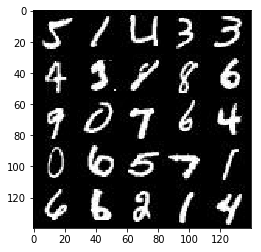


### CelebA
The [CelebFaces Attributes Dataset (CelebA)](http://mmlab.ie.cuhk.edu.hk/projects/CelebA.html) dataset contains over 200,000 celebrity images with annotations.  Since you're going to be generating faces, you won't need the annotations.  You can view the first number of examples by changing `show_n_images`.


```python
show_n_images = 9

"""
DON'T MODIFY ANYTHING IN THIS CELL
"""
mnist_images = helper.get_batch(glob(os.path.join(data_dir, 'img_align_celeba/*.jpg'))[:show_n_images], 28, 28, 'RGB')

pyplot.imshow(helper.images_square_grid(mnist_images, 'RGB'))
```


    <matplotlib.image.AxesImage at 0x7fb7a00afda0>


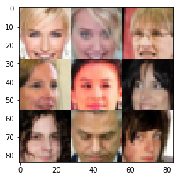


## Preprocess the Data
Since the project's main focus is on building the GANs, we'll preprocess the data for you.  The values of the MNIST and CelebA dataset will be in the range of -0.5 to 0.5 of 28x28 dimensional images.  The CelebA images will be cropped to remove parts of the image that don't include a face, then resized down to 28x28.

The MNIST images are black and white images with a single [color channel](https://en.wikipedia.org/wiki/Channel_(digital_image%29) while the CelebA images have [3 color channels (RGB color channel)](https://en.wikipedia.org/wiki/Channel_(digital_image%29#RGB_Images).
## Build the Neural Network
You'll build the components necessary to build a GANs by implementing the following functions below:
- `model_inputs`
- `discriminator`
- `generator`
- `model_loss`
- `model_opt`
- `train`

### Check the Version of TensorFlow and Access to GPU
This will check to make sure you have the correct version of TensorFlow and access to a GPU


```python
"""
DON'T MODIFY ANYTHING IN THIS CELL
"""
from distutils.version import LooseVersion
import warnings
import tensorflow as tf

# Check TensorFlow Version
assert LooseVersion(tf.__version__) >= LooseVersion('1.0'), 'Please use TensorFlow version 1.0 or newer.  You are using {}'.format(tf.__version__)
print('TensorFlow Version: {}'.format(tf.__version__))

# Check for a GPU
if not tf.test.gpu_device_name():
    warnings.warn('No GPU found. Please use a GPU to train your neural network.')
else:
    print('Default GPU Device: {}'.format(tf.test.gpu_device_name()))
```

    TensorFlow Version: 1.12.0


    /home/kenneth/miniconda3/envs/GAN/lib/python3.6/site-packages/ipykernel_launcher.py:14: UserWarning: No GPU found. Please use a GPU to train your neural network.
      


### Input
Implement the `model_inputs` function to create TF Placeholders for the Neural Network. It should create the following placeholders:
- Real input images placeholder with rank 4 using `image_width`, `image_height`, and `image_channels`.
- Z input placeholder with rank 2 using `z_dim`.
- Learning rate placeholder with rank 0.

Return the placeholders in the following the tuple (tensor of real input images, tensor of z data)


```python
import problem_unittests as tests

def model_inputs(image_width, image_height, image_channels, z_dim):
    inputs_real = tf.placeholder(tf.float32, (None, image_width,image_height,image_channels), name='input_real')
    inputs_z = tf.placeholder(tf.float32, (None, z_dim), name='input_z')
    learning_rate = tf.placeholder(tf.float32, None, name='learning_rate')
    return inputs_real, inputs_z, learning_rate


"""
DON'T MODIFY ANYTHING IN THIS CELL THAT IS BELOW THIS LINE
"""
tests.test_model_inputs(model_inputs)
```

    Tests Passed


### Discriminator
Implement `discriminator` to create a discriminator neural network that discriminates on `images`.  This function should be able to reuse the variables in the neural network.  Use [`tf.variable_scope`](https://www.tensorflow.org/api_docs/python/tf/variable_scope) with a scope name of "discriminator" to allow the variables to be reused.  The function should return a tuple of (tensor output of the discriminator, tensor logits of the discriminator).


```python
def discriminator(images, reuse=False):
    """
    Create the discriminator network
    :param images: Tensor of input image(s)
    :param reuse: Boolean if the weights should be reused
    :return: Tuple of (tensor output of the discriminator, tensor logits of the discriminator)
    """
    # TODO: Implement Function
    with tf.variable_scope('discriminator', reuse=reuse):
        # Input layer is 28x28x3
        x1 = tf.layers.conv2d(images, 64, 5, strides=2, padding='same',kernel_initializer=tf.contrib.layers.xavier_initializer_conv2d())
        relu1 = tf.maximum(0.15 * x1, x1)
        # 14x14x64
        drop_out1 = tf.nn.dropout(relu1, 0.8)
        x2 = tf.layers.conv2d(drop_out1, 128, 5, strides=2, padding='same')
        bn2 = tf.layers.batch_normalization(x2, training=True)
        relu2 = tf.maximum(0.15 * bn2, bn2)
        # 7x7x128
        drop_out2 = tf.nn.dropout(relu2, 0.8)
        x3 = tf.layers.conv2d(drop_out2, 128, 5, strides=1, padding='same')
        bn3 = tf.layers.batch_normalization(x3, training=True)
        relu3 = tf.maximum(0.15 * bn3, bn3)
        # 7x7x256
        # Flatten it
        flat = tf.reshape(relu3, (-1, 7*7*256))
        logits = tf.layers.dense(flat, 1)
        out = tf.sigmoid(logits)
        
        return out, logits
    #return None, None


"""
DON'T MODIFY ANYTHING IN THIS CELL THAT IS BELOW THIS LINE
"""
tests.test_discriminator(discriminator, tf)
```
    Tests Passed


### Generator
Implement `generator` to generate an image using `z`. This function should be able to reuse the variables in the neural network.  Use [`tf.variable_scope`](https://www.tensorflow.org/api_docs/python/tf/variable_scope) with a scope name of "generator" to allow the variables to be reused. The function should return the generated 28 x 28 x `out_channel_dim` images.


```python
def generator(z, out_channel_dim, is_train=True):
    """
    Create the generator network
    :param z: Input z
    :param out_channel_dim: The number of channels in the output image
    :param is_train: Boolean if generator is being used for training
    :return: The tensor output of the generator
    """
    # TODO: Implement Function
    with tf.variable_scope('generator',reuse=not is_train):
        # First fully connected layer
        x1 = tf.layers.dense(z, 7*7*1024,kernel_initializer=tf.contrib.layers.xavier_initializer_conv2d())
        #print(z)
        # Reshape it to start the convolutional stack
        x1 = tf.reshape(x1, (-1, 7, 7, 1024))
        x1 = tf.layers.batch_normalization(x1, training=is_train)
        x1 = tf.maximum(0.15 * x1, x1)
        # 4x4x512 now
        #print(x1)
        x2 = tf.layers.conv2d_transpose(x1, 512, 5, strides=2, padding='same')
        x2 = tf.layers.batch_normalization(x2, training=is_train)
        x2 = tf.maximum(0.15 * x2, x2)
        x2 = tf.nn.dropout(x2, 0.8)
        # 8x8x256 now
        x3 = tf.layers.conv2d_transpose(x2, 256, 5, strides=2, padding='same')
        x3 = tf.layers.batch_normalization(x3, training=is_train)
        x3 = tf.maximum(0.15 * x3, x3)
        x3 = tf.nn.dropout(x3, 0.8)
        x4 = tf.layers.conv2d_transpose(x3, 128, 5, strides=1, padding='same')
        x4 = tf.layers.batch_normalization(x4, training=is_train)
        x4 = tf.maximum(0.15 * x4, x4)
        x4 = tf.nn.dropout(x4, 0.8)
        # 16x16x128 now
        #x4 = tf.layers.conv2d_transpose(x3, 128, 5, strides=2, padding='same')
        # Output layer
        logits = tf.layers.conv2d_transpose(x4, out_channel_dim, 5, strides=1, padding='same')
        # 32x32x3 now
        out = tf.tanh(logits)
        
        return out
    #return None


"""
DON'T MODIFY ANYTHING IN THIS CELL THAT IS BELOW THIS LINE
"""
tests.test_generator(generator, tf)
```

    Tests Passed


### Loss
Implement `model_loss` to build the GANs for training and calculate the loss.  The function should return a tuple of (discriminator loss, generator loss).  Use the following functions you implemented:
- `discriminator(images, reuse=False)`
- `generator(z, out_channel_dim, is_train=True)`


```python
def model_loss(input_real, input_z, out_channel_dim):
    """
    Get the loss for the discriminator and generator
    :param input_real: Images from the real dataset
    :param input_z: Z input
    :param out_channel_dim: The number of channels in the output image
    :return: A tuple of (discriminator loss, generator loss)
    """
    # TODO: Implement Function
    g_model = generator(input_z, out_channel_dim)
    d_model_real, d_logits_real = discriminator(input_real)
    d_model_fake, d_logits_fake = discriminator(g_model, reuse=True)

    d_loss_real = tf.reduce_mean(
        tf.nn.sigmoid_cross_entropy_with_logits(logits=d_logits_real, labels=tf.ones_like(d_model_real)*(1-0.1)))
    d_loss_fake = tf.reduce_mean(
        tf.nn.sigmoid_cross_entropy_with_logits(logits=d_logits_fake, labels=tf.zeros_like(d_model_fake)))
    g_loss = tf.reduce_mean(
        tf.nn.sigmoid_cross_entropy_with_logits(logits=d_logits_fake, labels=tf.ones_like(d_model_fake)))

    d_loss = d_loss_real + d_loss_fake

    return d_loss, g_loss
    #return None, None


"""
DON'T MODIFY ANYTHING IN THIS CELL THAT IS BELOW THIS LINE
"""
tests.test_model_loss(model_loss)
```

    Tests Passed


### Optimization
Implement `model_opt` to create the optimization operations for the GANs. Use [`tf.trainable_variables`](https://www.tensorflow.org/api_docs/python/tf/trainable_variables) to get all the trainable variables.  Filter the variables with names that are in the discriminator and generator scope names.  The function should return a tuple of (discriminator training operation, generator training operation).


```python
def model_opt(d_loss, g_loss, learning_rate, beta1):
    """
    Get optimization operations
    :param d_loss: Discriminator loss Tensor
    :param g_loss: Generator loss Tensor
    :param learning_rate: Learning Rate Placeholder
    :param beta1: The exponential decay rate for the 1st moment in the optimizer
    :return: A tuple of (discriminator training operation, generator training operation)
    """
    # TODO: Implement Function
    t_vars = tf.trainable_variables()
    d_vars = [var for var in t_vars if var.name.startswith('discriminator')]
    g_vars = [var for var in t_vars if var.name.startswith('generator')]

    # Optimize
    with tf.control_dependencies(tf.get_collection(tf.GraphKeys.UPDATE_OPS)):
        d_train_opt = tf.train.AdamOptimizer(learning_rate, beta1=beta1).minimize(d_loss, var_list=d_vars)
        g_train_opt = tf.train.AdamOptimizer(learning_rate, beta1=beta1).minimize(g_loss, var_list=g_vars)

    return d_train_opt, g_train_opt
    #return None, None


"""
DON'T MODIFY ANYTHING IN THIS CELL THAT IS BELOW THIS LINE
"""
tests.test_model_opt(model_opt, tf)
```

    Tests Passed


## Neural Network Training
### Show Output
Use this function to show the current output of the generator during training. It will help you determine how well the GANs is training.


```python
"""
DON'T MODIFY ANYTHING IN THIS CELL
"""
import numpy as np

def show_generator_output(sess, n_images, input_z, out_channel_dim, image_mode):
    """
    Show example output for the generator
    :param sess: TensorFlow session
    :param n_images: Number of Images to display
    :param input_z: Input Z Tensor
    :param out_channel_dim: The number of channels in the output image
    :param image_mode: The mode to use for images ("RGB" or "L")
    """
    cmap = None if image_mode == 'RGB' else 'gray'
    z_dim = input_z.get_shape().as_list()[-1]
    example_z = np.random.uniform(-1, 1, size=[n_images, z_dim])

    samples = sess.run(
        generator(input_z, out_channel_dim, False),
        feed_dict={input_z: example_z})

    images_grid = helper.images_square_grid(samples, image_mode)
    pyplot.imshow(images_grid, cmap=cmap)
    pyplot.show()
```

### Train
Implement `train` to build and train the GANs.  Use the following functions you implemented:
- `model_inputs(image_width, image_height, image_channels, z_dim)`
- `model_loss(input_real, input_z, out_channel_dim)`
- `model_opt(d_loss, g_loss, learning_rate, beta1)`

Use the `show_generator_output` to show `generator` output while you train. Running `show_generator_output` for every batch will drastically increase training time and increase the size of the notebook.  It's recommended to print the `generator` output every 100 batches.


```python
def train(epoch_count, batch_size, z_dim, learning_rate, beta1, get_batches, data_shape, data_image_mode):
    """
    Train the GAN
    :param epoch_count: Number of epochs
    :param batch_size: Batch Size
    :param z_dim: Z dimension
    :param learning_rate: Learning Rate
    :param beta1: The exponential decay rate for the 1st moment in the optimizer
    :param get_batches: Function to get batches
    :param data_shape: Shape of the data
    :param data_image_mode: The image mode to use for images ("RGB" or "L")
    """
    #saver = tf.train.Saver()
    inputs_real, inputs_z, learning_r = model_inputs(data_shape[1],data_shape[2],data_shape[3],z_dim)
    d_loss, g_loss = model_loss(inputs_real,inputs_z,data_shape[3])
    d_train_opt, g_train_opt = model_opt(d_loss, g_loss, learning_r, beta1)
    sample_z = np.random.uniform(-1, 1, size=(72, z_dim))
    print_every = 5 #Print every 5 batches
    show_every = 100
    samples, losses = [], []
    steps = 0
    with tf.Session() as sess:
        sess.run(tf.global_variables_initializer())
        for epoch_i in range(epoch_count):
            for batch_images in get_batches(batch_size):
                # TODO: Train Model
                steps += 1
                batch_z = np.random.uniform(-1, 1, size=(batch_size, z_dim))
                #print(batch_images)
                # Run optimizers
                _ = sess.run(d_train_opt, feed_dict={inputs_real: batch_images*2, inputs_z: batch_z,learning_r: learning_rate})
                _ = sess.run(g_train_opt, feed_dict={inputs_z: batch_z, inputs_real: batch_images*2,learning_r: learning_rate})
                _ = sess.run(g_train_opt, feed_dict={inputs_z: batch_z, inputs_real: batch_images*2,learning_r: learning_rate})
                if steps % print_every == 0:
                    # At the end of each epoch, get the losses and print them out
                    train_loss_d = d_loss.eval({inputs_z: batch_z, inputs_real: batch_images*2})
                    train_loss_g = g_loss.eval({inputs_z: batch_z})

                    print("Epoch {}/{}...".format(epoch_i+1, epoch_count),
                          "Discriminator Loss: {:.4f}...".format(train_loss_d),
                          "Generator Loss: {:.4f}".format(train_loss_g))
                    # Save losses to view after training
                    losses.append((train_loss_d, train_loss_g))

                if steps % show_every == 0:
                    show_generator_output(sess, 25, inputs_z, data_shape[3], data_image_mode)
       
    return losses, samples
```

### MNIST
Test your GANs architecture on MNIST.  After 2 epochs, the GANs should be able to generate images that look like handwritten digits.  Make sure the loss of the generator is lower than the loss of the discriminator or close to 0.


```python
batch_size = 32
z_dim = 200
learning_rate = 0.0005
beta1 = 0.4


"""
DON'T MODIFY ANYTHING IN THIS CELL THAT IS BELOW THIS LINE
"""
epochs = 2

mnist_dataset = helper.Dataset('mnist', glob(os.path.join(data_dir, 'mnist/*.jpg')))
with tf.Graph().as_default():
    train(epochs, batch_size, z_dim, learning_rate, beta1, mnist_dataset.get_batches,
          mnist_dataset.shape, mnist_dataset.image_mode)
```

    Epoch 1/2... Discriminator Loss: 0.8336... Generator Loss: 1.0806
    Epoch 1/2... Discriminator Loss: 1.2254... Generator Loss: 2.5555
    Epoch 1/2... Discriminator Loss: 0.8667... Generator Loss: 1.4135
    Epoch 1/2... Discriminator Loss: 4.0744... Generator Loss: 3.3294
    Epoch 1/2... Discriminator Loss: 2.5561... Generator Loss: 0.8450
    Epoch 1/2... Discriminator Loss: 3.0973... Generator Loss: 0.1392
    Epoch 1/2... Discriminator Loss: 3.4643... Generator Loss: 0.0909
    Epoch 1/2... Discriminator Loss: 3.0172... Generator Loss: 0.2288
    Epoch 1/2... Discriminator Loss: 2.3408... Generator Loss: 0.2574
    Epoch 1/2... Discriminator Loss: 3.4349... Generator Loss: 0.0627
    Epoch 1/2... Discriminator Loss: 3.3231... Generator Loss: 0.0813
    Epoch 1/2... Discriminator Loss: 2.5218... Generator Loss: 0.1951
    Epoch 1/2... Discriminator Loss: 2.2379... Generator Loss: 0.3329
    Epoch 1/2... Discriminator Loss: 2.8859... Generator Loss: 0.1500
    Epoch 1/2... Discriminator Loss: 2.2354... Generator Loss: 0.2509
    Epoch 1/2... Discriminator Loss: 2.3253... Generator Loss: 0.2341
    Epoch 1/2... Discriminator Loss: 2.1446... Generator Loss: 0.2931
    Epoch 1/2... Discriminator Loss: 2.2522... Generator Loss: 0.2449
    Epoch 1/2... Discriminator Loss: 2.5186... Generator Loss: 0.2989
    Epoch 1/2... Discriminator Loss: 2.6052... Generator Loss: 0.3947


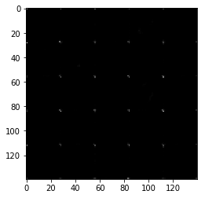


    Epoch 1/2... Discriminator Loss: 3.5549... Generator Loss: 0.0655
    Epoch 1/2... Discriminator Loss: 2.3631... Generator Loss: 0.2316
    Epoch 1/2... Discriminator Loss: 2.6600... Generator Loss: 0.2916
    Epoch 1/2... Discriminator Loss: 2.0612... Generator Loss: 0.4500
    Epoch 1/2... Discriminator Loss: 2.6640... Generator Loss: 0.1364
    Epoch 1/2... Discriminator Loss: 2.2366... Generator Loss: 0.4405
    Epoch 1/2... Discriminator Loss: 2.0460... Generator Loss: 0.3447
    Epoch 1/2... Discriminator Loss: 2.2283... Generator Loss: 0.9706
    Epoch 1/2... Discriminator Loss: 1.5961... Generator Loss: 0.7249
    Epoch 1/2... Discriminator Loss: 1.8360... Generator Loss: 0.4070
    Epoch 1/2... Discriminator Loss: 2.2117... Generator Loss: 0.2330
    Epoch 1/2... Discriminator Loss: 1.7774... Generator Loss: 0.8643
    Epoch 1/2... Discriminator Loss: 2.0495... Generator Loss: 0.3473
    Epoch 1/2... Discriminator Loss: 1.9062... Generator Loss: 0.3021
    Epoch 1/2... Discriminator Loss: 2.1428... Generator Loss: 0.2719
    Epoch 1/2... Discriminator Loss: 2.2051... Generator Loss: 0.2918
    Epoch 1/2... Discriminator Loss: 1.7948... Generator Loss: 0.4850
    Epoch 1/2... Discriminator Loss: 2.0407... Generator Loss: 0.2704
    Epoch 1/2... Discriminator Loss: 1.8772... Generator Loss: 0.5031
    Epoch 1/2... Discriminator Loss: 2.0256... Generator Loss: 0.6236


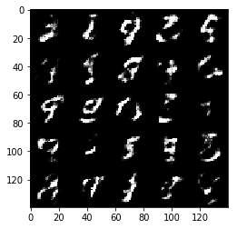


    Epoch 1/2... Discriminator Loss: 2.1153... Generator Loss: 0.2747
    Epoch 1/2... Discriminator Loss: 1.9985... Generator Loss: 0.2759
    Epoch 1/2... Discriminator Loss: 1.9384... Generator Loss: 0.4058
    Epoch 1/2... Discriminator Loss: 1.8373... Generator Loss: 0.4577
    Epoch 1/2... Discriminator Loss: 1.9480... Generator Loss: 0.5918
    Epoch 1/2... Discriminator Loss: 1.9659... Generator Loss: 0.2815
    Epoch 1/2... Discriminator Loss: 2.2326... Generator Loss: 0.2210
    Epoch 1/2... Discriminator Loss: 1.5678... Generator Loss: 0.3998
    Epoch 1/2... Discriminator Loss: 1.9914... Generator Loss: 0.3942


### CelebA
Run your GANs on CelebA.  It will take around 20 minutes on the average GPU to run one epoch.  You can run the whole epoch or stop when it starts to generate realistic faces.


```python
batch_size = 32
z_dim = 200
learning_rate = 0.0002
beta1 = 0.4


"""
DON'T MODIFY ANYTHING IN THIS CELL THAT IS BELOW THIS LINE
"""
epochs = 4

celeba_dataset = helper.Dataset('celeba', glob(os.path.join(data_dir, 'img_align_celeba/*.jpg')))
with tf.Graph().as_default():
    train(epochs, batch_size, z_dim, learning_rate, beta1, celeba_dataset.get_batches,
          celeba_dataset.shape, celeba_dataset.image_mode)
```


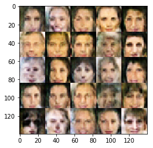


    Epoch 1/4... Discriminator Loss: 1.4313... Generator Loss: 0.7209
    Epoch 1/4... Discriminator Loss: 1.4966... Generator Loss: 0.6298
    Epoch 1/4... Discriminator Loss: 1.4659... Generator Loss: 0.6500
    Epoch 1/4... Discriminator Loss: 1.4990... Generator Loss: 0.7833
    Epoch 1/4... Discriminator Loss: 1.4573... Generator Loss: 0.6553
    Epoch 1/4... Discriminator Loss: 1.5387... Generator Loss: 0.6363
    Epoch 2/4... Discriminator Loss: 1.5652... Generator Loss: 0.5985
    Epoch 2/4... Discriminator Loss: 1.5284... Generator Loss: 0.5638
    Epoch 2/4... Discriminator Loss: 1.5049... Generator Loss: 0.7380
    Epoch 2/4... Discriminator Loss: 1.4335... Generator Loss: 0.7379
    Epoch 2/4... Discriminator Loss: 1.5281... Generator Loss: 0.6555
    Epoch 2/4... Discriminator Loss: 1.4719... Generator Loss: 0.6625
    Epoch 2/4... Discriminator Loss: 1.4766... Generator Loss: 0.7378
    Epoch 2/4... Discriminator Loss: 1.5192... Generator Loss: 0.6845
    Epoch 2/4... Discriminator Loss: 1.4252... Generator Loss: 0.7134
    Epoch 2/4... Discriminator Loss: 1.5092... Generator Loss: 0.7023
    Epoch 2/4... Discriminator Loss: 1.6754... Generator Loss: 0.6168
    Epoch 2/4... Discriminator Loss: 1.5467... Generator Loss: 0.7936
    Epoch 2/4... Discriminator Loss: 1.4253... Generator Loss: 0.7599
    Epoch 2/4... Discriminator Loss: 1.4665... Generator Loss: 0.7348


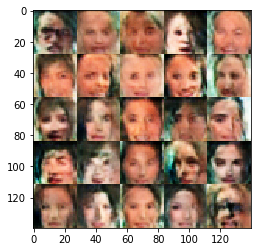


    Epoch 2/4... Discriminator Loss: 1.5578... Generator Loss: 0.7465
    Epoch 2/4... Discriminator Loss: 1.4813... Generator Loss: 0.7565
    Epoch 2/4... Discriminator Loss: 1.4337... Generator Loss: 0.6819
    Epoch 2/4... Discriminator Loss: 1.4764... Generator Loss: 0.7696
    Epoch 2/4... Discriminator Loss: 1.6033... Generator Loss: 0.5337
    Epoch 2/4... Discriminator Loss: 1.5493... Generator Loss: 0.6298
    Epoch 2/4... Discriminator Loss: 1.5267... Generator Loss: 0.6976
    Epoch 2/4... Discriminator Loss: 1.4517... Generator Loss: 0.7174
    Epoch 2/4... Discriminator Loss: 1.4766... Generator Loss: 0.6381
    Epoch 2/4... Discriminator Loss: 1.5224... Generator Loss: 0.6563
    Epoch 2/4... Discriminator Loss: 1.3829... Generator Loss: 0.7189
    Epoch 2/4... Discriminator Loss: 1.4576... Generator Loss: 0.7011
    Epoch 2/4... Discriminator Loss: 1.4214... Generator Loss: 0.6756
    Epoch 2/4... Discriminator Loss: 1.5037... Generator Loss: 0.6567
    Epoch 2/4... Discriminator Loss: 1.3993... Generator Loss: 0.7951
    Epoch 2/4... Discriminator Loss: 1.4342... Generator Loss: 0.6984
    Epoch 2/4... Discriminator Loss: 1.4960... Generator Loss: 0.8734
    Epoch 2/4... Discriminator Loss: 1.5356... Generator Loss: 0.7360
    Epoch 2/4... Discriminator Loss: 1.5304... Generator Loss: 0.5692
    Epoch 2/4... Discriminator Loss: 1.4195... Generator Loss: 0.7875


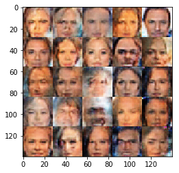


    Epoch 2/4... Discriminator Loss: 1.4468... Generator Loss: 0.7496
    Epoch 2/4... Discriminator Loss: 1.4504... Generator Loss: 0.6293
    Epoch 2/4... Discriminator Loss: 1.4326... Generator Loss: 0.6399
    Epoch 2/4... Discriminator Loss: 1.5007... Generator Loss: 0.7366
    Epoch 2/4... Discriminator Loss: 1.5163... Generator Loss: 0.7172
    Epoch 2/4... Discriminator Loss: 1.4872... Generator Loss: 0.5470
    Epoch 2/4... Discriminator Loss: 1.5507... Generator Loss: 0.6671
    Epoch 2/4... Discriminator Loss: 1.5306... Generator Loss: 0.6437
    Epoch 2/4... Discriminator Loss: 1.4659... Generator Loss: 0.7511
    Epoch 2/4... Discriminator Loss: 1.4995... Generator Loss: 0.6122
    Epoch 2/4... Discriminator Loss: 1.4582... Generator Loss: 0.5837
    Epoch 2/4... Discriminator Loss: 1.5151... Generator Loss: 0.5706
    Epoch 2/4... Discriminator Loss: 1.5318... Generator Loss: 0.6148
    Epoch 2/4... Discriminator Loss: 1.5083... Generator Loss: 0.7312
    Epoch 2/4... Discriminator Loss: 1.5139... Generator Loss: 0.6322
    Epoch 2/4... Discriminator Loss: 1.5631... Generator Loss: 0.6052
    Epoch 2/4... Discriminator Loss: 1.5675... Generator Loss: 0.6501
    Epoch 2/4... Discriminator Loss: 1.5378... Generator Loss: 0.5721
    Epoch 2/4... Discriminator Loss: 1.4682... Generator Loss: 0.6688
    Epoch 2/4... Discriminator Loss: 1.5376... Generator Loss: 0.5928


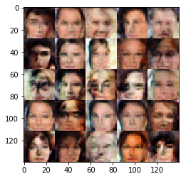


    Epoch 2/4... Discriminator Loss: 1.4979... Generator Loss: 0.7066
    Epoch 2/4... Discriminator Loss: 1.4746... Generator Loss: 0.6105
    Epoch 2/4... Discriminator Loss: 1.5921... Generator Loss: 0.5581
    Epoch 2/4... Discriminator Loss: 1.4735... Generator Loss: 0.6022
    Epoch 2/4... Discriminator Loss: 1.4573... Generator Loss: 0.6791
    Epoch 2/4... Discriminator Loss: 1.4963... Generator Loss: 0.6023
    Epoch 2/4... Discriminator Loss: 1.5222... Generator Loss: 0.6404
    Epoch 2/4... Discriminator Loss: 1.4069... Generator Loss: 0.6621
    Epoch 2/4... Discriminator Loss: 1.6939... Generator Loss: 0.5024
    Epoch 2/4... Discriminator Loss: 1.5363... Generator Loss: 0.6791
    Epoch 2/4... Discriminator Loss: 1.5087... Generator Loss: 0.6486
    Epoch 2/4... Discriminator Loss: 1.4467... Generator Loss: 0.7246
    Epoch 2/4... Discriminator Loss: 1.4931... Generator Loss: 0.7299
    Epoch 2/4... Discriminator Loss: 1.4227... Generator Loss: 0.6464
    Epoch 2/4... Discriminator Loss: 1.5202... Generator Loss: 0.5539
    Epoch 2/4... Discriminator Loss: 1.5195... Generator Loss: 0.5937
    Epoch 2/4... Discriminator Loss: 1.4470... Generator Loss: 0.6633
    Epoch 2/4... Discriminator Loss: 1.4547... Generator Loss: 0.7584
    Epoch 2/4... Discriminator Loss: 1.4952... Generator Loss: 0.6590
    Epoch 2/4... Discriminator Loss: 1.6206... Generator Loss: 0.5887


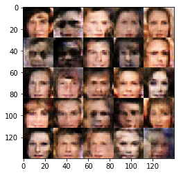


    Epoch 2/4... Discriminator Loss: 1.4848... Generator Loss: 0.6488
    Epoch 2/4... Discriminator Loss: 1.4296... Generator Loss: 0.6575
    Epoch 2/4... Discriminator Loss: 1.4872... Generator Loss: 0.7467
    Epoch 2/4... Discriminator Loss: 1.4437... Generator Loss: 0.7519
    Epoch 2/4... Discriminator Loss: 1.4784... Generator Loss: 0.6903
    Epoch 2/4... Discriminator Loss: 1.5372... Generator Loss: 0.6137
    Epoch 2/4... Discriminator Loss: 1.4902... Generator Loss: 0.6713
    Epoch 2/4... Discriminator Loss: 1.4752... Generator Loss: 0.7047
    Epoch 2/4... Discriminator Loss: 1.4806... Generator Loss: 0.6383
    Epoch 2/4... Discriminator Loss: 1.4988... Generator Loss: 0.6842
    Epoch 2/4... Discriminator Loss: 1.4480... Generator Loss: 0.6973
    Epoch 2/4... Discriminator Loss: 1.4526... Generator Loss: 0.7044
    Epoch 2/4... Discriminator Loss: 1.4306... Generator Loss: 0.7512
    Epoch 2/4... Discriminator Loss: 1.5018... Generator Loss: 0.6381
    Epoch 2/4... Discriminator Loss: 1.4750... Generator Loss: 0.6474
    Epoch 2/4... Discriminator Loss: 1.4470... Generator Loss: 0.7712
    Epoch 2/4... Discriminator Loss: 1.4885... Generator Loss: 0.6418
    Epoch 2/4... Discriminator Loss: 1.4983... Generator Loss: 0.5951
    Epoch 2/4... Discriminator Loss: 1.5467... Generator Loss: 0.5444
    Epoch 2/4... Discriminator Loss: 1.5525... Generator Loss: 0.5237


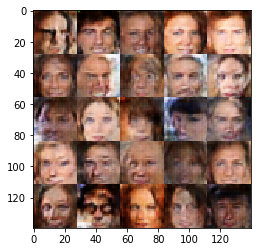


    Epoch 2/4... Discriminator Loss: 1.4842... Generator Loss: 0.7453
    Epoch 2/4... Discriminator Loss: 1.4279... Generator Loss: 0.8124
    Epoch 2/4... Discriminator Loss: 1.5222... Generator Loss: 0.6254
    Epoch 2/4... Discriminator Loss: 1.4989... Generator Loss: 0.7051
    Epoch 2/4... Discriminator Loss: 1.3954... Generator Loss: 0.8148
    Epoch 2/4... Discriminator Loss: 1.3863... Generator Loss: 0.7379
    Epoch 2/4... Discriminator Loss: 1.6320... Generator Loss: 0.5664
    Epoch 2/4... Discriminator Loss: 1.5312... Generator Loss: 0.5524
    Epoch 2/4... Discriminator Loss: 1.5846... Generator Loss: 0.6984
    Epoch 2/4... Discriminator Loss: 1.4684... Generator Loss: 0.7521
    Epoch 2/4... Discriminator Loss: 1.4636... Generator Loss: 0.7360
    Epoch 2/4... Discriminator Loss: 1.4460... Generator Loss: 0.6323
    Epoch 2/4... Discriminator Loss: 1.5458... Generator Loss: 0.5987
    Epoch 2/4... Discriminator Loss: 1.4330... Generator Loss: 0.6782
    Epoch 2/4... Discriminator Loss: 1.4356... Generator Loss: 0.7334
    Epoch 2/4... Discriminator Loss: 1.4831... Generator Loss: 0.8619
    Epoch 2/4... Discriminator Loss: 1.5153... Generator Loss: 0.7254
    Epoch 2/4... Discriminator Loss: 1.4080... Generator Loss: 0.7107
    Epoch 2/4... Discriminator Loss: 1.4405... Generator Loss: 0.6989
    Epoch 2/4... Discriminator Loss: 1.5460... Generator Loss: 0.6149


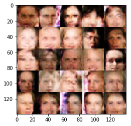


    Epoch 2/4... Discriminator Loss: 1.4209... Generator Loss: 0.6496
    Epoch 2/4... Discriminator Loss: 1.3759... Generator Loss: 0.6742
    Epoch 2/4... Discriminator Loss: 1.5218... Generator Loss: 0.6480
    Epoch 2/4... Discriminator Loss: 1.4468... Generator Loss: 0.7147
    Epoch 2/4... Discriminator Loss: 1.4236... Generator Loss: 0.7328
    Epoch 2/4... Discriminator Loss: 1.4922... Generator Loss: 0.8032
    Epoch 2/4... Discriminator Loss: 1.3969... Generator Loss: 0.7663
    Epoch 2/4... Discriminator Loss: 1.5065... Generator Loss: 0.6518
    Epoch 2/4... Discriminator Loss: 1.5159... Generator Loss: 0.7346
    Epoch 2/4... Discriminator Loss: 1.4648... Generator Loss: 0.8201
    Epoch 2/4... Discriminator Loss: 1.5442... Generator Loss: 0.6908
    Epoch 2/4... Discriminator Loss: 1.4580... Generator Loss: 0.7285
    Epoch 2/4... Discriminator Loss: 1.4755... Generator Loss: 0.6207
    Epoch 2/4... Discriminator Loss: 1.5987... Generator Loss: 0.5025
    Epoch 2/4... Discriminator Loss: 1.5537... Generator Loss: 0.5590
    Epoch 2/4... Discriminator Loss: 1.5643... Generator Loss: 0.6655
    Epoch 2/4... Discriminator Loss: 1.4707... Generator Loss: 0.6921
    Epoch 2/4... Discriminator Loss: 1.4903... Generator Loss: 0.6184
    Epoch 2/4... Discriminator Loss: 1.5740... Generator Loss: 0.6035
    Epoch 2/4... Discriminator Loss: 1.5762... Generator Loss: 0.6468


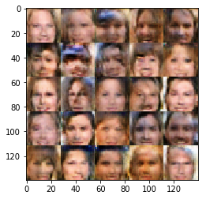


    Epoch 2/4... Discriminator Loss: 1.4667... Generator Loss: 0.7014
    Epoch 2/4... Discriminator Loss: 1.4130... Generator Loss: 0.7595
    Epoch 2/4... Discriminator Loss: 1.3754... Generator Loss: 0.7896
    Epoch 2/4... Discriminator Loss: 1.4919... Generator Loss: 0.6754
    Epoch 2/4... Discriminator Loss: 1.5020... Generator Loss: 0.7130
    Epoch 2/4... Discriminator Loss: 1.5180... Generator Loss: 0.5619
    Epoch 2/4... Discriminator Loss: 1.4862... Generator Loss: 0.6523
    Epoch 2/4... Discriminator Loss: 1.5346... Generator Loss: 0.6470
    Epoch 2/4... Discriminator Loss: 1.5096... Generator Loss: 0.6292
    Epoch 2/4... Discriminator Loss: 1.4476... Generator Loss: 0.7239
    Epoch 2/4... Discriminator Loss: 1.4545... Generator Loss: 0.7283
    Epoch 2/4... Discriminator Loss: 1.4778... Generator Loss: 0.7289
    Epoch 2/4... Discriminator Loss: 1.5196... Generator Loss: 0.6818
    Epoch 2/4... Discriminator Loss: 1.5838... Generator Loss: 0.5579
    Epoch 2/4... Discriminator Loss: 1.4257... Generator Loss: 0.6876
    Epoch 2/4... Discriminator Loss: 1.5079... Generator Loss: 0.7172
    Epoch 2/4... Discriminator Loss: 1.5004... Generator Loss: 0.6334
    Epoch 2/4... Discriminator Loss: 1.5554... Generator Loss: 0.7301
    Epoch 2/4... Discriminator Loss: 1.5633... Generator Loss: 0.6611
    Epoch 2/4... Discriminator Loss: 1.4444... Generator Loss: 0.6975


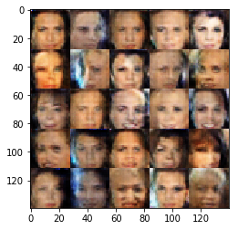


    Epoch 2/4... Discriminator Loss: 1.3952... Generator Loss: 0.7602
    Epoch 2/4... Discriminator Loss: 1.5666... Generator Loss: 0.5554
    Epoch 2/4... Discriminator Loss: 1.4611... Generator Loss: 0.6045
    Epoch 2/4... Discriminator Loss: 1.4269... Generator Loss: 0.7472
    Epoch 2/4... Discriminator Loss: 1.5266... Generator Loss: 0.6287
    Epoch 2/4... Discriminator Loss: 1.5425... Generator Loss: 0.6448
    Epoch 2/4... Discriminator Loss: 1.4934... Generator Loss: 0.7103
    Epoch 2/4... Discriminator Loss: 1.4960... Generator Loss: 0.6376
    Epoch 2/4... Discriminator Loss: 1.4109... Generator Loss: 0.7637
    Epoch 2/4... Discriminator Loss: 1.4852... Generator Loss: 0.6863
    Epoch 2/4... Discriminator Loss: 1.4298... Generator Loss: 0.7425
    Epoch 2/4... Discriminator Loss: 1.4235... Generator Loss: 0.7560
    Epoch 2/4... Discriminator Loss: 1.4903... Generator Loss: 0.8026
    Epoch 2/4... Discriminator Loss: 1.4294... Generator Loss: 0.6927
    Epoch 2/4... Discriminator Loss: 1.5095... Generator Loss: 0.6195
    Epoch 2/4... Discriminator Loss: 1.5752... Generator Loss: 0.6936
    Epoch 2/4... Discriminator Loss: 1.5016... Generator Loss: 0.7255
    Epoch 2/4... Discriminator Loss: 1.4491... Generator Loss: 0.7274
    Epoch 2/4... Discriminator Loss: 1.4776... Generator Loss: 0.7095
    Epoch 2/4... Discriminator Loss: 1.5092... Generator Loss: 0.6302


    Epoch 2/4... Discriminator Loss: 1.4784... Generator Loss: 0.8087
    Epoch 2/4... Discriminator Loss: 1.4548... Generator Loss: 0.7139
    Epoch 2/4... Discriminator Loss: 1.4467... Generator Loss: 0.7963
    Epoch 2/4... Discriminator Loss: 1.4441... Generator Loss: 0.6669
    Epoch 2/4... Discriminator Loss: 1.4726... Generator Loss: 0.7924
    Epoch 2/4... Discriminator Loss: 1.5581... Generator Loss: 0.5645
    Epoch 2/4... Discriminator Loss: 1.4749... Generator Loss: 0.6980
    Epoch 2/4... Discriminator Loss: 1.4765... Generator Loss: 0.6884
    Epoch 2/4... Discriminator Loss: 1.4605... Generator Loss: 0.7935
    Epoch 2/4... Discriminator Loss: 1.5203... Generator Loss: 0.6366
    Epoch 2/4... Discriminator Loss: 1.4721... Generator Loss: 0.6172
    Epoch 2/4... Discriminator Loss: 1.4585... Generator Loss: 0.7887
    Epoch 2/4... Discriminator Loss: 1.4847... Generator Loss: 0.5829
    Epoch 2/4... Discriminator Loss: 1.4343... Generator Loss: 0.6359
    Epoch 2/4... Discriminator Loss: 1.4298... Generator Loss: 0.7679
    Epoch 2/4... Discriminator Loss: 1.4921... Generator Loss: 0.7304
    Epoch 2/4... Discriminator Loss: 1.4257... Generator Loss: 0.6161
    Epoch 2/4... Discriminator Loss: 1.4963... Generator Loss: 0.7085
    Epoch 2/4... Discriminator Loss: 1.4442... Generator Loss: 0.7725
    Epoch 2/4... Discriminator Loss: 1.4082... Generator Loss: 0.7730


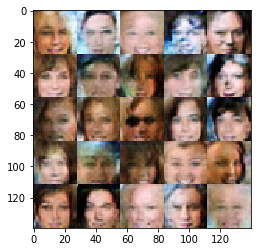


    Epoch 2/4... Discriminator Loss: 1.3856... Generator Loss: 0.6958
    Epoch 2/4... Discriminator Loss: 1.4640... Generator Loss: 0.7353
    Epoch 2/4... Discriminator Loss: 1.4722... Generator Loss: 0.6692
    Epoch 2/4... Discriminator Loss: 1.4600... Generator Loss: 0.7091
    Epoch 2/4... Discriminator Loss: 1.4716... Generator Loss: 0.6855
    Epoch 2/4... Discriminator Loss: 1.5526... Generator Loss: 0.6300
    Epoch 2/4... Discriminator Loss: 1.4528... Generator Loss: 0.6911
    Epoch 2/4... Discriminator Loss: 1.4301... Generator Loss: 0.6252
    Epoch 2/4... Discriminator Loss: 1.4240... Generator Loss: 0.7561
    Epoch 2/4... Discriminator Loss: 1.4281... Generator Loss: 0.7599
    Epoch 2/4... Discriminator Loss: 1.4080... Generator Loss: 0.7186
    Epoch 2/4... Discriminator Loss: 1.5131... Generator Loss: 0.7690
    Epoch 2/4... Discriminator Loss: 1.5156... Generator Loss: 0.5923
    Epoch 2/4... Discriminator Loss: 1.5428... Generator Loss: 0.6234
    Epoch 2/4... Discriminator Loss: 1.5245... Generator Loss: 0.5983
    Epoch 2/4... Discriminator Loss: 1.5378... Generator Loss: 0.6709
    Epoch 2/4... Discriminator Loss: 1.5454... Generator Loss: 0.6325
    Epoch 2/4... Discriminator Loss: 1.5437... Generator Loss: 0.6720
    Epoch 2/4... Discriminator Loss: 1.4545... Generator Loss: 0.7089
    Epoch 2/4... Discriminator Loss: 1.5052... Generator Loss: 0.6646


    Epoch 2/4... Discriminator Loss: 1.4657... Generator Loss: 0.8227
    Epoch 2/4... Discriminator Loss: 1.5234... Generator Loss: 0.5801
    Epoch 2/4... Discriminator Loss: 1.4476... Generator Loss: 0.7460
    Epoch 2/4... Discriminator Loss: 1.5626... Generator Loss: 0.6089
    Epoch 2/4... Discriminator Loss: 1.4657... Generator Loss: 0.6709
    Epoch 2/4... Discriminator Loss: 1.4804... Generator Loss: 0.6101
    Epoch 2/4... Discriminator Loss: 1.5115... Generator Loss: 0.6123
    Epoch 2/4... Discriminator Loss: 1.3687... Generator Loss: 0.7349
    Epoch 2/4... Discriminator Loss: 1.4817... Generator Loss: 0.6995
    Epoch 2/4... Discriminator Loss: 1.5006... Generator Loss: 0.6972
    Epoch 2/4... Discriminator Loss: 1.4673... Generator Loss: 0.6830
    Epoch 2/4... Discriminator Loss: 1.4180... Generator Loss: 0.7000
    Epoch 2/4... Discriminator Loss: 1.5222... Generator Loss: 0.6044
    Epoch 2/4... Discriminator Loss: 1.4467... Generator Loss: 0.6681
    Epoch 2/4... Discriminator Loss: 1.4375... Generator Loss: 0.8198
    Epoch 2/4... Discriminator Loss: 1.5219... Generator Loss: 0.8130
    Epoch 2/4... Discriminator Loss: 1.4719... Generator Loss: 0.6656
    Epoch 2/4... Discriminator Loss: 1.6360... Generator Loss: 0.5589
    Epoch 2/4... Discriminator Loss: 1.5335... Generator Loss: 0.6153
    Epoch 2/4... Discriminator Loss: 1.4149... Generator Loss: 0.7144


    Epoch 2/4... Discriminator Loss: 1.4512... Generator Loss: 0.7630
    Epoch 2/4... Discriminator Loss: 1.4798... Generator Loss: 0.6841
    Epoch 2/4... Discriminator Loss: 1.5241... Generator Loss: 0.6593
    Epoch 2/4... Discriminator Loss: 1.4898... Generator Loss: 0.7408
    Epoch 2/4... Discriminator Loss: 1.4721... Generator Loss: 0.7486
    Epoch 2/4... Discriminator Loss: 1.4527... Generator Loss: 0.6017
    Epoch 2/4... Discriminator Loss: 1.3889... Generator Loss: 0.8033
    Epoch 2/4... Discriminator Loss: 1.4445... Generator Loss: 0.6821
    Epoch 2/4... Discriminator Loss: 1.4443... Generator Loss: 0.7265
    Epoch 2/4... Discriminator Loss: 1.4614... Generator Loss: 0.7427
    Epoch 2/4... Discriminator Loss: 1.4344... Generator Loss: 0.7121
    Epoch 2/4... Discriminator Loss: 1.5230... Generator Loss: 0.6270
    Epoch 2/4... Discriminator Loss: 1.4949... Generator Loss: 0.8145
    Epoch 2/4... Discriminator Loss: 1.5331... Generator Loss: 0.7418
    Epoch 2/4... Discriminator Loss: 1.4904... Generator Loss: 0.6309
    Epoch 2/4... Discriminator Loss: 1.5096... Generator Loss: 0.6468
    Epoch 2/4... Discriminator Loss: 1.4458... Generator Loss: 0.6461
    Epoch 2/4... Discriminator Loss: 1.5368... Generator Loss: 0.7305
    Epoch 2/4... Discriminator Loss: 1.5406... Generator Loss: 0.6911
    Epoch 2/4... Discriminator Loss: 1.5025... Generator Loss: 0.6394


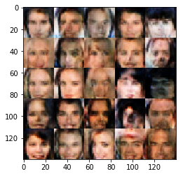


    Epoch 2/4... Discriminator Loss: 1.4933... Generator Loss: 0.6896
    Epoch 2/4... Discriminator Loss: 1.4510... Generator Loss: 0.7029
    Epoch 2/4... Discriminator Loss: 1.4565... Generator Loss: 0.8194
    Epoch 2/4... Discriminator Loss: 1.4544... Generator Loss: 0.7325
    Epoch 2/4... Discriminator Loss: 1.4526... Generator Loss: 0.7494
    Epoch 2/4... Discriminator Loss: 1.4097... Generator Loss: 0.7294
    Epoch 2/4... Discriminator Loss: 1.4798... Generator Loss: 0.6892
    Epoch 2/4... Discriminator Loss: 1.4241... Generator Loss: 0.7477
    Epoch 2/4... Discriminator Loss: 1.4326... Generator Loss: 0.6117
    Epoch 2/4... Discriminator Loss: 1.4567... Generator Loss: 0.7013
    Epoch 2/4... Discriminator Loss: 1.4867... Generator Loss: 0.7920
    Epoch 2/4... Discriminator Loss: 1.4258... Generator Loss: 0.6598
    Epoch 2/4... Discriminator Loss: 1.4443... Generator Loss: 0.7176
    Epoch 2/4... Discriminator Loss: 1.3581... Generator Loss: 0.8228
    Epoch 2/4... Discriminator Loss: 1.4771... Generator Loss: 0.6027
    Epoch 2/4... Discriminator Loss: 1.4759... Generator Loss: 0.6783
    Epoch 2/4... Discriminator Loss: 1.4059... Generator Loss: 0.6880
    Epoch 2/4... Discriminator Loss: 1.6115... Generator Loss: 0.5198
    Epoch 2/4... Discriminator Loss: 1.4649... Generator Loss: 0.7325
    Epoch 2/4... Discriminator Loss: 1.4291... Generator Loss: 0.8182


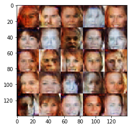


    Epoch 2/4... Discriminator Loss: 1.4310... Generator Loss: 0.6986
    Epoch 2/4... Discriminator Loss: 1.4835... Generator Loss: 0.7172
    Epoch 2/4... Discriminator Loss: 1.4092... Generator Loss: 0.8032
    Epoch 2/4... Discriminator Loss: 1.4044... Generator Loss: 0.6910
    Epoch 2/4... Discriminator Loss: 1.4270... Generator Loss: 0.7912
    Epoch 2/4... Discriminator Loss: 1.4760... Generator Loss: 0.5559
    Epoch 2/4... Discriminator Loss: 1.4742... Generator Loss: 0.7327
    Epoch 2/4... Discriminator Loss: 1.4357... Generator Loss: 0.6628
    Epoch 2/4... Discriminator Loss: 1.4898... Generator Loss: 0.7312
    Epoch 2/4... Discriminator Loss: 1.4540... Generator Loss: 0.7489
    Epoch 2/4... Discriminator Loss: 1.4854... Generator Loss: 0.7348
    Epoch 2/4... Discriminator Loss: 1.3962... Generator Loss: 0.7289
    Epoch 2/4... Discriminator Loss: 1.3971... Generator Loss: 0.8200
    Epoch 2/4... Discriminator Loss: 1.4517... Generator Loss: 0.6984
    Epoch 2/4... Discriminator Loss: 1.4949... Generator Loss: 0.7121
    Epoch 2/4... Discriminator Loss: 1.4381... Generator Loss: 0.6624
    Epoch 2/4... Discriminator Loss: 1.3787... Generator Loss: 0.7371
    Epoch 2/4... Discriminator Loss: 1.4823... Generator Loss: 0.5946
    Epoch 2/4... Discriminator Loss: 1.4326... Generator Loss: 0.6793
    Epoch 2/4... Discriminator Loss: 1.4544... Generator Loss: 0.7452


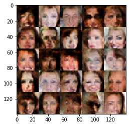


    Epoch 2/4... Discriminator Loss: 1.4617... Generator Loss: 0.7026
    Epoch 2/4... Discriminator Loss: 1.4992... Generator Loss: 0.6701
    Epoch 2/4... Discriminator Loss: 1.4584... Generator Loss: 0.8211
    Epoch 2/4... Discriminator Loss: 1.4338... Generator Loss: 0.7644
    Epoch 2/4... Discriminator Loss: 1.4981... Generator Loss: 0.6979
    Epoch 2/4... Discriminator Loss: 1.4648... Generator Loss: 0.7961
    Epoch 2/4... Discriminator Loss: 1.5078... Generator Loss: 0.6361
    Epoch 2/4... Discriminator Loss: 1.5324... Generator Loss: 0.6519
    Epoch 2/4... Discriminator Loss: 1.4371... Generator Loss: 0.6299
    Epoch 2/4... Discriminator Loss: 1.4881... Generator Loss: 0.6724
    Epoch 2/4... Discriminator Loss: 1.5294... Generator Loss: 0.6662
    Epoch 2/4... Discriminator Loss: 1.4268... Generator Loss: 0.7455
    Epoch 2/4... Discriminator Loss: 1.4433... Generator Loss: 0.8417
    Epoch 2/4... Discriminator Loss: 1.4271... Generator Loss: 0.6145
    Epoch 2/4... Discriminator Loss: 1.4230... Generator Loss: 0.7305
    Epoch 2/4... Discriminator Loss: 1.3344... Generator Loss: 0.6953
    Epoch 2/4... Discriminator Loss: 1.5254... Generator Loss: 0.7633
    Epoch 2/4... Discriminator Loss: 1.4581... Generator Loss: 0.6478
    Epoch 2/4... Discriminator Loss: 1.5045... Generator Loss: 0.7470
    Epoch 2/4... Discriminator Loss: 1.4879... Generator Loss: 1.0279


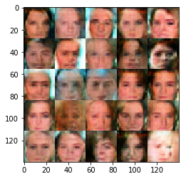


    Epoch 2/4... Discriminator Loss: 1.4255... Generator Loss: 0.6298
    Epoch 2/4... Discriminator Loss: 1.4303... Generator Loss: 0.7725
    Epoch 2/4... Discriminator Loss: 1.4939... Generator Loss: 0.7281
    Epoch 2/4... Discriminator Loss: 1.4137... Generator Loss: 0.6773
    Epoch 2/4... Discriminator Loss: 1.4580... Generator Loss: 0.7510
    Epoch 2/4... Discriminator Loss: 1.4345... Generator Loss: 0.7897
    Epoch 2/4... Discriminator Loss: 1.4939... Generator Loss: 0.6931
    Epoch 2/4... Discriminator Loss: 1.4027... Generator Loss: 0.7531
    Epoch 2/4... Discriminator Loss: 1.4733... Generator Loss: 0.6801
    Epoch 2/4... Discriminator Loss: 1.4638... Generator Loss: 0.6893
    Epoch 2/4... Discriminator Loss: 1.4885... Generator Loss: 0.6406
    Epoch 2/4... Discriminator Loss: 1.4501... Generator Loss: 0.7704
    Epoch 2/4... Discriminator Loss: 1.5338... Generator Loss: 0.6060
    Epoch 2/4... Discriminator Loss: 1.4469... Generator Loss: 0.7024
    Epoch 2/4... Discriminator Loss: 1.5068... Generator Loss: 0.7811
    Epoch 2/4... Discriminator Loss: 1.4259... Generator Loss: 0.6993
    Epoch 2/4... Discriminator Loss: 1.4589... Generator Loss: 0.7097
    Epoch 2/4... Discriminator Loss: 1.5350... Generator Loss: 0.5113
    Epoch 2/4... Discriminator Loss: 1.5303... Generator Loss: 0.6594
    Epoch 2/4... Discriminator Loss: 1.5767... Generator Loss: 0.6442


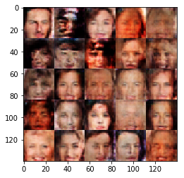


    Epoch 2/4... Discriminator Loss: 1.4450... Generator Loss: 0.6691
    Epoch 2/4... Discriminator Loss: 1.3868... Generator Loss: 0.7995
    Epoch 2/4... Discriminator Loss: 1.4706... Generator Loss: 0.6864
    Epoch 2/4... Discriminator Loss: 1.4158... Generator Loss: 0.6581
    Epoch 2/4... Discriminator Loss: 1.4592... Generator Loss: 0.6962
    Epoch 2/4... Discriminator Loss: 1.4253... Generator Loss: 0.8072
    Epoch 2/4... Discriminator Loss: 1.4992... Generator Loss: 0.7678
    Epoch 2/4... Discriminator Loss: 1.4621... Generator Loss: 0.7304
    Epoch 2/4... Discriminator Loss: 1.4769... Generator Loss: 0.8237
    Epoch 2/4... Discriminator Loss: 1.4678... Generator Loss: 0.7667
    Epoch 2/4... Discriminator Loss: 1.4382... Generator Loss: 0.7656
    Epoch 2/4... Discriminator Loss: 1.4676... Generator Loss: 0.6365
    Epoch 2/4... Discriminator Loss: 1.4388... Generator Loss: 0.7486
    Epoch 2/4... Discriminator Loss: 1.4586... Generator Loss: 0.7137
    Epoch 2/4... Discriminator Loss: 1.4084... Generator Loss: 0.7653
    Epoch 2/4... Discriminator Loss: 1.4996... Generator Loss: 0.7708
    Epoch 2/4... Discriminator Loss: 1.4717... Generator Loss: 0.6791
    Epoch 2/4... Discriminator Loss: 1.4803... Generator Loss: 0.5315
    Epoch 2/4... Discriminator Loss: 1.5161... Generator Loss: 0.6733
    Epoch 2/4... Discriminator Loss: 1.4727... Generator Loss: 0.7080


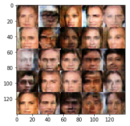


    Epoch 2/4... Discriminator Loss: 1.4322... Generator Loss: 0.6960
    Epoch 2/4... Discriminator Loss: 1.4201... Generator Loss: 0.7231
    Epoch 2/4... Discriminator Loss: 1.5169... Generator Loss: 0.6827
    Epoch 2/4... Discriminator Loss: 1.5234... Generator Loss: 0.6873
    Epoch 2/4... Discriminator Loss: 1.5025... Generator Loss: 0.5727
    Epoch 2/4... Discriminator Loss: 1.4608... Generator Loss: 0.6672
    Epoch 2/4... Discriminator Loss: 1.4837... Generator Loss: 0.7419
    Epoch 2/4... Discriminator Loss: 1.4452... Generator Loss: 0.5983
    Epoch 2/4... Discriminator Loss: 1.4843... Generator Loss: 0.6770
    Epoch 2/4... Discriminator Loss: 1.5418... Generator Loss: 0.6364
    Epoch 2/4... Discriminator Loss: 1.4895... Generator Loss: 0.6962
    Epoch 2/4... Discriminator Loss: 1.4557... Generator Loss: 0.7409
    Epoch 2/4... Discriminator Loss: 1.5164... Generator Loss: 0.5780
    Epoch 2/4... Discriminator Loss: 1.4483... Generator Loss: 0.7239
    Epoch 2/4... Discriminator Loss: 1.4894... Generator Loss: 0.6578
    Epoch 2/4... Discriminator Loss: 1.4606... Generator Loss: 0.6545
    Epoch 2/4... Discriminator Loss: 1.4761... Generator Loss: 0.6022
    Epoch 2/4... Discriminator Loss: 1.3896... Generator Loss: 0.7346
    Epoch 2/4... Discriminator Loss: 1.4608... Generator Loss: 0.6404
    Epoch 2/4... Discriminator Loss: 1.4480... Generator Loss: 0.7844


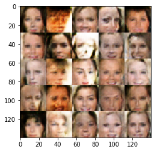


    Epoch 2/4... Discriminator Loss: 1.5524... Generator Loss: 0.5734
    Epoch 2/4... Discriminator Loss: 1.4650... Generator Loss: 0.7708
    Epoch 2/4... Discriminator Loss: 1.4525... Generator Loss: 0.6777
    Epoch 2/4... Discriminator Loss: 1.5974... Generator Loss: 0.5415
    Epoch 2/4... Discriminator Loss: 1.4256... Generator Loss: 0.6968
    Epoch 2/4... Discriminator Loss: 1.4052... Generator Loss: 0.7055
    Epoch 2/4... Discriminator Loss: 1.4755... Generator Loss: 0.7381
    Epoch 2/4... Discriminator Loss: 1.5148... Generator Loss: 0.7360
    Epoch 2/4... Discriminator Loss: 1.5272... Generator Loss: 0.7053
    Epoch 2/4... Discriminator Loss: 1.4594... Generator Loss: 0.8371
    Epoch 2/4... Discriminator Loss: 1.4406... Generator Loss: 0.7188
    Epoch 2/4... Discriminator Loss: 1.4046... Generator Loss: 0.6363
    Epoch 2/4... Discriminator Loss: 1.4341... Generator Loss: 0.6818
    Epoch 2/4... Discriminator Loss: 1.4311... Generator Loss: 0.7365
    Epoch 2/4... Discriminator Loss: 1.4125... Generator Loss: 0.8210
    Epoch 2/4... Discriminator Loss: 1.4889... Generator Loss: 0.6762
    Epoch 2/4... Discriminator Loss: 1.4419... Generator Loss: 0.7250
    Epoch 2/4... Discriminator Loss: 1.5586... Generator Loss: 0.5706
    Epoch 2/4... Discriminator Loss: 1.4023... Generator Loss: 0.7321
    Epoch 2/4... Discriminator Loss: 1.4778... Generator Loss: 0.6732


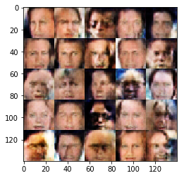


    Epoch 2/4... Discriminator Loss: 1.4494... Generator Loss: 0.7723
    Epoch 2/4... Discriminator Loss: 1.4652... Generator Loss: 0.6435
    Epoch 2/4... Discriminator Loss: 1.5102... Generator Loss: 0.6171
    Epoch 2/4... Discriminator Loss: 1.4264... Generator Loss: 0.7482
    Epoch 2/4... Discriminator Loss: 1.4101... Generator Loss: 0.7569
    Epoch 2/4... Discriminator Loss: 1.5040... Generator Loss: 0.6397
    Epoch 2/4... Discriminator Loss: 1.6108... Generator Loss: 0.5495
    Epoch 2/4... Discriminator Loss: 1.4531... Generator Loss: 0.6774
    Epoch 2/4... Discriminator Loss: 1.3771... Generator Loss: 0.7632
    Epoch 2/4... Discriminator Loss: 1.4462... Generator Loss: 0.7160
    Epoch 2/4... Discriminator Loss: 1.3983... Generator Loss: 0.7852
    Epoch 2/4... Discriminator Loss: 1.5237... Generator Loss: 0.6430
    Epoch 2/4... Discriminator Loss: 1.3947... Generator Loss: 0.7333
    Epoch 2/4... Discriminator Loss: 1.4268... Generator Loss: 0.6613
    Epoch 2/4... Discriminator Loss: 1.4142... Generator Loss: 0.7160
    Epoch 2/4... Discriminator Loss: 1.4480... Generator Loss: 0.7237
    Epoch 2/4... Discriminator Loss: 1.4788... Generator Loss: 0.6643
    Epoch 2/4... Discriminator Loss: 1.4703... Generator Loss: 0.7061
    Epoch 2/4... Discriminator Loss: 1.4088... Generator Loss: 0.7421
    Epoch 2/4... Discriminator Loss: 1.4377... Generator Loss: 0.7448


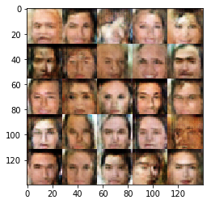


    Epoch 2/4... Discriminator Loss: 1.4632... Generator Loss: 0.6371
    Epoch 2/4... Discriminator Loss: 1.4334... Generator Loss: 0.7451
    Epoch 2/4... Discriminator Loss: 1.4744... Generator Loss: 0.5493
    Epoch 2/4... Discriminator Loss: 1.5227... Generator Loss: 0.5915
    Epoch 2/4... Discriminator Loss: 1.5232... Generator Loss: 0.6503
    Epoch 2/4... Discriminator Loss: 1.4075... Generator Loss: 0.5765
    Epoch 2/4... Discriminator Loss: 1.4854... Generator Loss: 0.6979
    Epoch 2/4... Discriminator Loss: 1.4225... Generator Loss: 0.8826
    Epoch 2/4... Discriminator Loss: 1.4903... Generator Loss: 0.7887
    Epoch 2/4... Discriminator Loss: 1.5045... Generator Loss: 0.6563
    Epoch 2/4... Discriminator Loss: 1.4815... Generator Loss: 0.7225
    Epoch 2/4... Discriminator Loss: 1.4999... Generator Loss: 0.5562
    Epoch 2/4... Discriminator Loss: 1.5285... Generator Loss: 0.8561
    Epoch 2/4... Discriminator Loss: 1.4943... Generator Loss: 0.6897
    Epoch 2/4... Discriminator Loss: 1.4322... Generator Loss: 0.6849
    Epoch 2/4... Discriminator Loss: 1.4319... Generator Loss: 0.7084
    Epoch 2/4... Discriminator Loss: 1.4239... Generator Loss: 0.7976
    Epoch 2/4... Discriminator Loss: 1.4844... Generator Loss: 0.6567
    Epoch 2/4... Discriminator Loss: 1.4391... Generator Loss: 0.6333
    Epoch 2/4... Discriminator Loss: 1.5082... Generator Loss: 0.6280


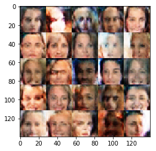


    Epoch 2/4... Discriminator Loss: 1.4757... Generator Loss: 0.6928
    Epoch 2/4... Discriminator Loss: 1.5155... Generator Loss: 0.6850
    Epoch 2/4... Discriminator Loss: 1.5301... Generator Loss: 0.6681
    Epoch 2/4... Discriminator Loss: 1.3977... Generator Loss: 0.7741
    Epoch 2/4... Discriminator Loss: 1.5027... Generator Loss: 0.7513
    Epoch 2/4... Discriminator Loss: 1.4264... Generator Loss: 0.8916
    Epoch 2/4... Discriminator Loss: 1.4090... Generator Loss: 0.6966
    Epoch 2/4... Discriminator Loss: 1.4459... Generator Loss: 0.7351
    Epoch 2/4... Discriminator Loss: 1.3885... Generator Loss: 0.7322
    Epoch 2/4... Discriminator Loss: 1.4370... Generator Loss: 0.8223
    Epoch 2/4... Discriminator Loss: 1.6497... Generator Loss: 0.5105
    Epoch 2/4... Discriminator Loss: 1.3616... Generator Loss: 0.7176
    Epoch 2/4... Discriminator Loss: 1.5068... Generator Loss: 0.6361
    Epoch 2/4... Discriminator Loss: 1.4352... Generator Loss: 0.7601
    Epoch 2/4... Discriminator Loss: 1.4110... Generator Loss: 0.7459
    Epoch 2/4... Discriminator Loss: 1.4008... Generator Loss: 0.8975
    Epoch 2/4... Discriminator Loss: 1.4514... Generator Loss: 0.7456
    Epoch 2/4... Discriminator Loss: 1.4838... Generator Loss: 0.6286
    Epoch 2/4... Discriminator Loss: 1.4867... Generator Loss: 0.6626
    Epoch 2/4... Discriminator Loss: 1.5053... Generator Loss: 0.5646


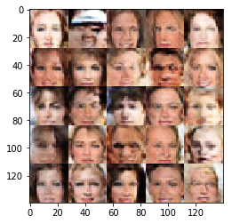


    Epoch 2/4... Discriminator Loss: 1.4098... Generator Loss: 0.7495
    Epoch 2/4... Discriminator Loss: 1.5064... Generator Loss: 0.6284
    Epoch 2/4... Discriminator Loss: 1.4762... Generator Loss: 0.6696
    Epoch 2/4... Discriminator Loss: 1.4334... Generator Loss: 0.7269
    Epoch 2/4... Discriminator Loss: 1.4144... Generator Loss: 0.7128
    Epoch 2/4... Discriminator Loss: 1.5114... Generator Loss: 0.5817
    Epoch 2/4... Discriminator Loss: 1.4780... Generator Loss: 0.6324
    Epoch 2/4... Discriminator Loss: 1.4991... Generator Loss: 0.6472
    Epoch 2/4... Discriminator Loss: 1.4218... Generator Loss: 0.8050
    Epoch 2/4... Discriminator Loss: 1.4766... Generator Loss: 0.7465
    Epoch 2/4... Discriminator Loss: 1.4591... Generator Loss: 0.7171
    Epoch 2/4... Discriminator Loss: 1.4159... Generator Loss: 0.7499
    Epoch 2/4... Discriminator Loss: 1.4774... Generator Loss: 0.6943
    Epoch 2/4... Discriminator Loss: 1.4534... Generator Loss: 0.6792
    Epoch 2/4... Discriminator Loss: 1.4429... Generator Loss: 0.6416
    Epoch 2/4... Discriminator Loss: 1.4281... Generator Loss: 0.7180
    Epoch 2/4... Discriminator Loss: 1.4584... Generator Loss: 0.8138
    Epoch 2/4... Discriminator Loss: 1.4513... Generator Loss: 0.7836
    Epoch 2/4... Discriminator Loss: 1.4148... Generator Loss: 0.8782
    Epoch 2/4... Discriminator Loss: 1.4187... Generator Loss: 0.6991


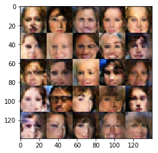


    Epoch 2/4... Discriminator Loss: 1.4606... Generator Loss: 0.5999
    Epoch 2/4... Discriminator Loss: 1.4018... Generator Loss: 0.7080
    Epoch 2/4... Discriminator Loss: 1.4421... Generator Loss: 0.7332
    Epoch 2/4... Discriminator Loss: 1.4489... Generator Loss: 0.7771
    Epoch 2/4... Discriminator Loss: 1.4734... Generator Loss: 0.6312
    Epoch 2/4... Discriminator Loss: 1.4001... Generator Loss: 0.7942
    Epoch 2/4... Discriminator Loss: 1.4019... Generator Loss: 0.7195
    Epoch 2/4... Discriminator Loss: 1.3951... Generator Loss: 0.7827
    Epoch 2/4... Discriminator Loss: 1.4691... Generator Loss: 0.6593
    Epoch 2/4... Discriminator Loss: 1.5672... Generator Loss: 0.6717
    Epoch 2/4... Discriminator Loss: 1.4848... Generator Loss: 0.7279
    Epoch 2/4... Discriminator Loss: 1.4303... Generator Loss: 0.7290
    Epoch 2/4... Discriminator Loss: 1.4095... Generator Loss: 0.8113
    Epoch 2/4... Discriminator Loss: 1.3860... Generator Loss: 0.7308
    Epoch 2/4... Discriminator Loss: 1.4090... Generator Loss: 0.7738
    Epoch 2/4... Discriminator Loss: 1.4423... Generator Loss: 0.6696
    Epoch 2/4... Discriminator Loss: 1.4586... Generator Loss: 0.7125
    Epoch 2/4... Discriminator Loss: 1.4510... Generator Loss: 0.6152
    Epoch 2/4... Discriminator Loss: 1.3501... Generator Loss: 0.6998
    Epoch 2/4... Discriminator Loss: 1.4068... Generator Loss: 0.7742


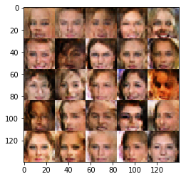


    Epoch 2/4... Discriminator Loss: 1.5023... Generator Loss: 0.6905
    Epoch 2/4... Discriminator Loss: 1.4598... Generator Loss: 0.7506
    Epoch 2/4... Discriminator Loss: 1.4490... Generator Loss: 0.7139
    Epoch 2/4... Discriminator Loss: 1.3852... Generator Loss: 0.6682
    Epoch 2/4... Discriminator Loss: 1.4685... Generator Loss: 0.8250
    Epoch 2/4... Discriminator Loss: 1.5604... Generator Loss: 0.5996
    Epoch 2/4... Discriminator Loss: 1.4984... Generator Loss: 0.6791
    Epoch 2/4... Discriminator Loss: 1.5050... Generator Loss: 0.7287
    Epoch 2/4... Discriminator Loss: 1.4935... Generator Loss: 0.6919
    Epoch 2/4... Discriminator Loss: 1.4538... Generator Loss: 0.6860
    Epoch 2/4... Discriminator Loss: 1.4279... Generator Loss: 0.7649
    Epoch 2/4... Discriminator Loss: 1.4549... Generator Loss: 0.7264
    Epoch 2/4... Discriminator Loss: 1.4820... Generator Loss: 0.5900
    Epoch 2/4... Discriminator Loss: 1.4390... Generator Loss: 0.6438
    Epoch 2/4... Discriminator Loss: 1.3448... Generator Loss: 0.8416
    Epoch 2/4... Discriminator Loss: 1.4534... Generator Loss: 0.6276
    Epoch 2/4... Discriminator Loss: 1.4765... Generator Loss: 0.6120
    Epoch 2/4... Discriminator Loss: 1.3995... Generator Loss: 0.7869
    Epoch 2/4... Discriminator Loss: 1.4644... Generator Loss: 0.7419
    Epoch 2/4... Discriminator Loss: 1.4423... Generator Loss: 0.7534


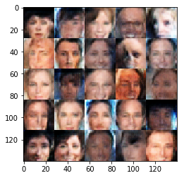


    Epoch 2/4... Discriminator Loss: 1.5174... Generator Loss: 0.6352
    Epoch 2/4... Discriminator Loss: 1.4236... Generator Loss: 0.7399
    Epoch 2/4... Discriminator Loss: 1.3821... Generator Loss: 0.7925
    Epoch 2/4... Discriminator Loss: 1.4822... Generator Loss: 0.6578
    Epoch 2/4... Discriminator Loss: 1.4031... Generator Loss: 0.7433
    Epoch 2/4... Discriminator Loss: 1.4500... Generator Loss: 0.6708
    Epoch 2/4... Discriminator Loss: 1.4851... Generator Loss: 0.7455
    Epoch 2/4... Discriminator Loss: 1.6020... Generator Loss: 0.5401
    Epoch 2/4... Discriminator Loss: 1.4269... Generator Loss: 0.8289
    Epoch 2/4... Discriminator Loss: 1.5188... Generator Loss: 0.5950
    Epoch 2/4... Discriminator Loss: 1.4634... Generator Loss: 0.6888
    Epoch 2/4... Discriminator Loss: 1.4665... Generator Loss: 0.6798
    Epoch 2/4... Discriminator Loss: 1.4889... Generator Loss: 0.7849
    Epoch 2/4... Discriminator Loss: 1.4806... Generator Loss: 0.6141
    Epoch 2/4... Discriminator Loss: 1.4703... Generator Loss: 0.6438
    Epoch 2/4... Discriminator Loss: 1.4948... Generator Loss: 0.6812
    Epoch 2/4... Discriminator Loss: 1.5617... Generator Loss: 0.5230
    Epoch 2/4... Discriminator Loss: 1.4174... Generator Loss: 0.6841
    Epoch 2/4... Discriminator Loss: 1.5450... Generator Loss: 0.5256
    Epoch 2/4... Discriminator Loss: 1.4575... Generator Loss: 0.5757


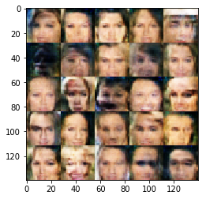


    Epoch 2/4... Discriminator Loss: 1.4940... Generator Loss: 0.5834
    Epoch 2/4... Discriminator Loss: 1.5490... Generator Loss: 0.6185
    Epoch 2/4... Discriminator Loss: 1.3887... Generator Loss: 0.7646
    Epoch 2/4... Discriminator Loss: 1.4658... Generator Loss: 0.7152
    Epoch 2/4... Discriminator Loss: 1.4993... Generator Loss: 0.6737
    Epoch 2/4... Discriminator Loss: 1.4563... Generator Loss: 0.7418
    Epoch 2/4... Discriminator Loss: 1.4430... Generator Loss: 0.7679
    Epoch 2/4... Discriminator Loss: 1.4692... Generator Loss: 0.7371
    Epoch 2/4... Discriminator Loss: 1.4266... Generator Loss: 0.7058
    Epoch 2/4... Discriminator Loss: 1.4535... Generator Loss: 0.6342
    Epoch 2/4... Discriminator Loss: 1.3653... Generator Loss: 0.7953
    Epoch 2/4... Discriminator Loss: 1.4386... Generator Loss: 0.6953
    Epoch 2/4... Discriminator Loss: 1.4644... Generator Loss: 0.7246
    Epoch 2/4... Discriminator Loss: 1.4703... Generator Loss: 0.6037
    Epoch 2/4... Discriminator Loss: 1.4667... Generator Loss: 0.7596
    Epoch 2/4... Discriminator Loss: 1.5106... Generator Loss: 0.6186
    Epoch 2/4... Discriminator Loss: 1.4301... Generator Loss: 0.6814
    Epoch 2/4... Discriminator Loss: 1.4490... Generator Loss: 0.7536
    Epoch 2/4... Discriminator Loss: 1.3954... Generator Loss: 0.8906
    Epoch 2/4... Discriminator Loss: 1.4489... Generator Loss: 0.6656


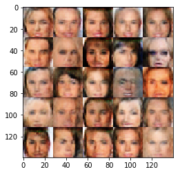


    Epoch 2/4... Discriminator Loss: 1.4702... Generator Loss: 0.7358
    Epoch 2/4... Discriminator Loss: 1.4402... Generator Loss: 0.6671
    Epoch 2/4... Discriminator Loss: 1.4946... Generator Loss: 0.7402
    Epoch 2/4... Discriminator Loss: 1.5133... Generator Loss: 0.7120
    Epoch 2/4... Discriminator Loss: 1.4047... Generator Loss: 0.7202
    Epoch 2/4... Discriminator Loss: 1.4222... Generator Loss: 0.7315
    Epoch 2/4... Discriminator Loss: 1.4556... Generator Loss: 0.7565
    Epoch 2/4... Discriminator Loss: 1.3912... Generator Loss: 0.7870
    Epoch 2/4... Discriminator Loss: 1.4463... Generator Loss: 0.6766
    Epoch 2/4... Discriminator Loss: 1.4562... Generator Loss: 0.6608
    Epoch 2/4... Discriminator Loss: 1.4719... Generator Loss: 0.8555
    Epoch 2/4... Discriminator Loss: 1.4478... Generator Loss: 0.7177
    Epoch 2/4... Discriminator Loss: 1.3980... Generator Loss: 0.7050
    Epoch 2/4... Discriminator Loss: 1.5138... Generator Loss: 0.7747
    Epoch 2/4... Discriminator Loss: 1.4177... Generator Loss: 0.6484
    Epoch 2/4... Discriminator Loss: 1.5070... Generator Loss: 0.6863
    Epoch 2/4... Discriminator Loss: 1.4189... Generator Loss: 0.6889
    Epoch 2/4... Discriminator Loss: 1.4045... Generator Loss: 0.7454
    Epoch 2/4... Discriminator Loss: 1.4471... Generator Loss: 0.7567
    Epoch 2/4... Discriminator Loss: 1.4349... Generator Loss: 0.7458


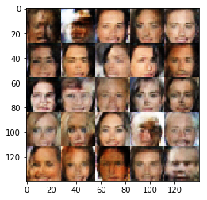


    Epoch 2/4... Discriminator Loss: 1.4347... Generator Loss: 0.6788
    Epoch 2/4... Discriminator Loss: 1.4145... Generator Loss: 0.6648
    Epoch 2/4... Discriminator Loss: 1.4566... Generator Loss: 0.7996
    Epoch 2/4... Discriminator Loss: 1.4157... Generator Loss: 0.7073
    Epoch 2/4... Discriminator Loss: 1.4576... Generator Loss: 0.7991
    Epoch 2/4... Discriminator Loss: 1.5007... Generator Loss: 0.6442
    Epoch 2/4... Discriminator Loss: 1.4226... Generator Loss: 0.7020
    Epoch 2/4... Discriminator Loss: 1.4530... Generator Loss: 0.7879
    Epoch 2/4... Discriminator Loss: 1.4234... Generator Loss: 0.7660
    Epoch 2/4... Discriminator Loss: 1.4611... Generator Loss: 0.7339
    Epoch 2/4... Discriminator Loss: 1.4405... Generator Loss: 0.8253
    Epoch 2/4... Discriminator Loss: 1.4919... Generator Loss: 0.5645
    Epoch 2/4... Discriminator Loss: 1.5340... Generator Loss: 0.6243
    Epoch 2/4... Discriminator Loss: 1.3880... Generator Loss: 0.7709
    Epoch 2/4... Discriminator Loss: 1.4336... Generator Loss: 0.8513
    Epoch 2/4... Discriminator Loss: 1.4458... Generator Loss: 0.6757
    Epoch 2/4... Discriminator Loss: 1.4538... Generator Loss: 0.7881
    Epoch 2/4... Discriminator Loss: 1.3936... Generator Loss: 0.8151
    Epoch 2/4... Discriminator Loss: 1.4257... Generator Loss: 0.7319
    Epoch 2/4... Discriminator Loss: 1.4455... Generator Loss: 0.6569


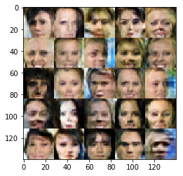


    Epoch 2/4... Discriminator Loss: 1.4690... Generator Loss: 0.7059
    Epoch 2/4... Discriminator Loss: 1.3872... Generator Loss: 0.7285
    Epoch 2/4... Discriminator Loss: 1.4698... Generator Loss: 0.7692
    Epoch 2/4... Discriminator Loss: 1.4356... Generator Loss: 0.7205
    Epoch 2/4... Discriminator Loss: 1.4882... Generator Loss: 0.6594
    Epoch 2/4... Discriminator Loss: 1.4958... Generator Loss: 0.6711
    Epoch 2/4... Discriminator Loss: 1.4127... Generator Loss: 0.7552
    Epoch 2/4... Discriminator Loss: 1.4459... Generator Loss: 0.7871
    Epoch 2/4... Discriminator Loss: 1.4577... Generator Loss: 0.5979
    Epoch 2/4... Discriminator Loss: 1.3500... Generator Loss: 0.7193
    Epoch 2/4... Discriminator Loss: 1.4267... Generator Loss: 0.7376
    Epoch 2/4... Discriminator Loss: 1.3645... Generator Loss: 0.6644
    Epoch 2/4... Discriminator Loss: 1.4811... Generator Loss: 0.6922
    Epoch 2/4... Discriminator Loss: 1.4367... Generator Loss: 0.7446
    Epoch 2/4... Discriminator Loss: 1.5641... Generator Loss: 0.6044
    Epoch 2/4... Discriminator Loss: 1.4448... Generator Loss: 0.7124
    Epoch 2/4... Discriminator Loss: 1.3866... Generator Loss: 0.7573
    Epoch 2/4... Discriminator Loss: 1.5307... Generator Loss: 0.5850
    Epoch 2/4... Discriminator Loss: 1.4116... Generator Loss: 0.7406
    Epoch 2/4... Discriminator Loss: 1.3824... Generator Loss: 0.7908


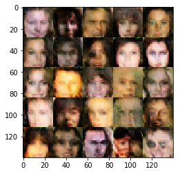


    Epoch 2/4... Discriminator Loss: 1.4412... Generator Loss: 0.7100
    Epoch 2/4... Discriminator Loss: 1.4243... Generator Loss: 0.7394
    Epoch 2/4... Discriminator Loss: 1.5258... Generator Loss: 0.6257
    Epoch 2/4... Discriminator Loss: 1.4336... Generator Loss: 0.7620
    Epoch 2/4... Discriminator Loss: 1.4547... Generator Loss: 0.6731
    Epoch 2/4... Discriminator Loss: 1.4464... Generator Loss: 0.7548
    Epoch 2/4... Discriminator Loss: 1.4930... Generator Loss: 0.5985
    Epoch 2/4... Discriminator Loss: 1.4240... Generator Loss: 0.6948
    Epoch 2/4... Discriminator Loss: 1.3978... Generator Loss: 0.7725
    Epoch 2/4... Discriminator Loss: 1.4106... Generator Loss: 0.7464
    Epoch 2/4... Discriminator Loss: 1.4422... Generator Loss: 0.6993
    Epoch 2/4... Discriminator Loss: 1.4636... Generator Loss: 0.8194
    Epoch 2/4... Discriminator Loss: 1.5149... Generator Loss: 0.5650
    Epoch 2/4... Discriminator Loss: 1.4566... Generator Loss: 0.7454
    Epoch 2/4... Discriminator Loss: 1.4690... Generator Loss: 0.6380
    Epoch 2/4... Discriminator Loss: 1.4413... Generator Loss: 0.6655
    Epoch 2/4... Discriminator Loss: 1.4076... Generator Loss: 0.7574
    Epoch 2/4... Discriminator Loss: 1.4962... Generator Loss: 0.6007
    Epoch 2/4... Discriminator Loss: 1.4691... Generator Loss: 0.7314
    Epoch 2/4... Discriminator Loss: 1.4877... Generator Loss: 0.6652


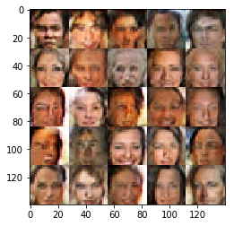


    Epoch 2/4... Discriminator Loss: 1.4102... Generator Loss: 0.7985
    Epoch 2/4... Discriminator Loss: 1.4183... Generator Loss: 0.7100
    Epoch 2/4... Discriminator Loss: 1.4610... Generator Loss: 0.7469
    Epoch 2/4... Discriminator Loss: 1.3484... Generator Loss: 0.7890
    Epoch 2/4... Discriminator Loss: 1.4448... Generator Loss: 0.6199
    Epoch 2/4... Discriminator Loss: 1.4459... Generator Loss: 0.7828
    Epoch 2/4... Discriminator Loss: 1.4681... Generator Loss: 0.6578
    Epoch 2/4... Discriminator Loss: 1.4317... Generator Loss: 0.7085
    Epoch 2/4... Discriminator Loss: 1.4095... Generator Loss: 0.8228
    Epoch 2/4... Discriminator Loss: 1.3934... Generator Loss: 0.6797
    Epoch 2/4... Discriminator Loss: 1.4515... Generator Loss: 0.7260
    Epoch 2/4... Discriminator Loss: 1.4737... Generator Loss: 0.7422
    Epoch 2/4... Discriminator Loss: 1.4506... Generator Loss: 0.7134
    Epoch 2/4... Discriminator Loss: 1.5080... Generator Loss: 0.6398
    Epoch 2/4... Discriminator Loss: 1.4191... Generator Loss: 0.7651
    Epoch 2/4... Discriminator Loss: 1.4888... Generator Loss: 0.6304
    Epoch 2/4... Discriminator Loss: 1.4564... Generator Loss: 0.7237
    Epoch 2/4... Discriminator Loss: 1.4580... Generator Loss: 0.7194
    Epoch 2/4... Discriminator Loss: 1.4717... Generator Loss: 0.6736
    Epoch 2/4... Discriminator Loss: 1.4333... Generator Loss: 0.7759


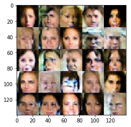


    Epoch 2/4... Discriminator Loss: 1.4635... Generator Loss: 0.7590
    Epoch 2/4... Discriminator Loss: 1.3606... Generator Loss: 0.7813
    Epoch 2/4... Discriminator Loss: 1.3921... Generator Loss: 0.6753
    Epoch 2/4... Discriminator Loss: 1.4632... Generator Loss: 0.6573
    Epoch 2/4... Discriminator Loss: 1.3918... Generator Loss: 0.8663
    Epoch 2/4... Discriminator Loss: 1.4661... Generator Loss: 0.6409
    Epoch 2/4... Discriminator Loss: 1.5223... Generator Loss: 0.5268
    Epoch 2/4... Discriminator Loss: 1.4194... Generator Loss: 0.7524
    Epoch 2/4... Discriminator Loss: 1.4280... Generator Loss: 0.7506
    Epoch 2/4... Discriminator Loss: 1.3947... Generator Loss: 0.7753
    Epoch 2/4... Discriminator Loss: 1.4121... Generator Loss: 0.7413
    Epoch 2/4... Discriminator Loss: 1.4631... Generator Loss: 0.7609
    Epoch 2/4... Discriminator Loss: 1.3995... Generator Loss: 0.7884
    Epoch 2/4... Discriminator Loss: 1.4166... Generator Loss: 0.7427
    Epoch 2/4... Discriminator Loss: 1.4833... Generator Loss: 0.7088
    Epoch 2/4... Discriminator Loss: 1.4433... Generator Loss: 0.7087
    Epoch 2/4... Discriminator Loss: 1.4464... Generator Loss: 0.6412
    Epoch 2/4... Discriminator Loss: 1.4637... Generator Loss: 0.7576
    Epoch 2/4... Discriminator Loss: 1.4315... Generator Loss: 0.7695
    Epoch 2/4... Discriminator Loss: 1.3931... Generator Loss: 0.7549


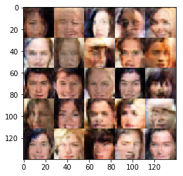


    Epoch 2/4... Discriminator Loss: 1.4733... Generator Loss: 0.6734
    Epoch 2/4... Discriminator Loss: 1.5370... Generator Loss: 0.6791
    Epoch 2/4... Discriminator Loss: 1.4462... Generator Loss: 0.7144
    Epoch 2/4... Discriminator Loss: 1.4071... Generator Loss: 0.7117
    Epoch 2/4... Discriminator Loss: 1.4037... Generator Loss: 0.7420
    Epoch 2/4... Discriminator Loss: 1.4371... Generator Loss: 0.6824
    Epoch 2/4... Discriminator Loss: 1.4423... Generator Loss: 0.7418
    Epoch 2/4... Discriminator Loss: 1.4122... Generator Loss: 0.6974
    Epoch 2/4... Discriminator Loss: 1.4966... Generator Loss: 0.7120
    Epoch 2/4... Discriminator Loss: 1.4221... Generator Loss: 0.8159
    Epoch 2/4... Discriminator Loss: 1.4977... Generator Loss: 0.6716
    Epoch 2/4... Discriminator Loss: 1.4402... Generator Loss: 0.6245
    Epoch 2/4... Discriminator Loss: 1.4353... Generator Loss: 0.8291
    Epoch 2/4... Discriminator Loss: 1.5368... Generator Loss: 0.6156
    Epoch 2/4... Discriminator Loss: 1.4348... Generator Loss: 0.7927
    Epoch 2/4... Discriminator Loss: 1.3516... Generator Loss: 0.6966
    Epoch 2/4... Discriminator Loss: 1.4083... Generator Loss: 0.7131
    Epoch 2/4... Discriminator Loss: 1.4719... Generator Loss: 0.7564
    Epoch 2/4... Discriminator Loss: 1.4779... Generator Loss: 0.6308
    Epoch 2/4... Discriminator Loss: 1.4990... Generator Loss: 0.7017


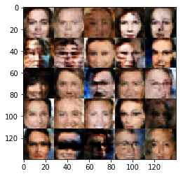


    Epoch 2/4... Discriminator Loss: 1.4549... Generator Loss: 0.7079
    Epoch 2/4... Discriminator Loss: 1.4344... Generator Loss: 0.7411
    Epoch 2/4... Discriminator Loss: 1.4585... Generator Loss: 0.6800
    Epoch 2/4... Discriminator Loss: 1.3908... Generator Loss: 0.7720
    Epoch 2/4... Discriminator Loss: 1.4215... Generator Loss: 0.6973
    Epoch 2/4... Discriminator Loss: 1.4517... Generator Loss: 0.7391
    Epoch 2/4... Discriminator Loss: 1.3497... Generator Loss: 0.6709
    Epoch 2/4... Discriminator Loss: 1.4877... Generator Loss: 0.7152
    Epoch 2/4... Discriminator Loss: 1.4265... Generator Loss: 0.7517
    Epoch 2/4... Discriminator Loss: 1.5423... Generator Loss: 0.7130
    Epoch 2/4... Discriminator Loss: 1.3953... Generator Loss: 0.7021
    Epoch 2/4... Discriminator Loss: 1.4415... Generator Loss: 0.6424
    Epoch 2/4... Discriminator Loss: 1.4699... Generator Loss: 0.6999
    Epoch 2/4... Discriminator Loss: 1.4788... Generator Loss: 0.7153
    Epoch 2/4... Discriminator Loss: 1.4394... Generator Loss: 0.7179
    Epoch 2/4... Discriminator Loss: 1.4263... Generator Loss: 0.7074
    Epoch 2/4... Discriminator Loss: 1.3820... Generator Loss: 0.7967
    Epoch 2/4... Discriminator Loss: 1.4569... Generator Loss: 0.7002
    Epoch 2/4... Discriminator Loss: 1.4947... Generator Loss: 0.6351
    Epoch 2/4... Discriminator Loss: 1.3421... Generator Loss: 0.7999


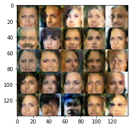


    Epoch 2/4... Discriminator Loss: 1.3680... Generator Loss: 0.7767
    Epoch 2/4... Discriminator Loss: 1.4226... Generator Loss: 0.7555
    Epoch 2/4... Discriminator Loss: 1.4777... Generator Loss: 0.6688
    Epoch 2/4... Discriminator Loss: 1.4026... Generator Loss: 0.7490
    Epoch 2/4... Discriminator Loss: 1.4394... Generator Loss: 0.6334
    Epoch 2/4... Discriminator Loss: 1.4329... Generator Loss: 0.7000
    Epoch 2/4... Discriminator Loss: 1.4325... Generator Loss: 0.8117
    Epoch 2/4... Discriminator Loss: 1.4102... Generator Loss: 0.6059
    Epoch 2/4... Discriminator Loss: 1.4526... Generator Loss: 0.7400
    Epoch 2/4... Discriminator Loss: 1.5305... Generator Loss: 0.6240
    Epoch 2/4... Discriminator Loss: 1.3982... Generator Loss: 0.7604
    Epoch 2/4... Discriminator Loss: 1.4188... Generator Loss: 0.7850
    Epoch 2/4... Discriminator Loss: 1.3664... Generator Loss: 0.7094
    Epoch 2/4... Discriminator Loss: 1.4047... Generator Loss: 0.7161
    Epoch 2/4... Discriminator Loss: 1.4775... Generator Loss: 0.7580
    Epoch 2/4... Discriminator Loss: 1.4796... Generator Loss: 0.7394
    Epoch 2/4... Discriminator Loss: 1.3967... Generator Loss: 0.7783
    Epoch 2/4... Discriminator Loss: 1.4586... Generator Loss: 0.6882
    Epoch 2/4... Discriminator Loss: 1.4496... Generator Loss: 0.8491
    Epoch 2/4... Discriminator Loss: 1.4107... Generator Loss: 0.7229


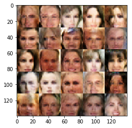


    Epoch 2/4... Discriminator Loss: 1.3939... Generator Loss: 0.7776
    Epoch 2/4... Discriminator Loss: 1.4068... Generator Loss: 0.6745
    Epoch 2/4... Discriminator Loss: 1.3916... Generator Loss: 0.7780
    Epoch 2/4... Discriminator Loss: 1.3849... Generator Loss: 0.7023
    Epoch 2/4... Discriminator Loss: 1.4174... Generator Loss: 0.7974
    Epoch 2/4... Discriminator Loss: 1.3627... Generator Loss: 0.8145
    Epoch 2/4... Discriminator Loss: 1.4760... Generator Loss: 0.6927
    Epoch 2/4... Discriminator Loss: 1.4192... Generator Loss: 0.7381
    Epoch 2/4... Discriminator Loss: 1.3828... Generator Loss: 0.7538
    Epoch 2/4... Discriminator Loss: 1.4787... Generator Loss: 0.6660
    Epoch 2/4... Discriminator Loss: 1.4104... Generator Loss: 0.8636
    Epoch 2/4... Discriminator Loss: 1.4345... Generator Loss: 0.6763
    Epoch 2/4... Discriminator Loss: 1.4640... Generator Loss: 0.6589
    Epoch 2/4... Discriminator Loss: 1.4478... Generator Loss: 0.7692
    Epoch 2/4... Discriminator Loss: 1.4383... Generator Loss: 0.7978
    Epoch 2/4... Discriminator Loss: 1.4640... Generator Loss: 0.7060
    Epoch 2/4... Discriminator Loss: 1.4419... Generator Loss: 0.7837
    Epoch 2/4... Discriminator Loss: 1.3696... Generator Loss: 0.7108
    Epoch 2/4... Discriminator Loss: 1.4291... Generator Loss: 0.7829
    Epoch 2/4... Discriminator Loss: 1.4386... Generator Loss: 0.6656


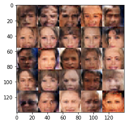


    Epoch 2/4... Discriminator Loss: 1.4320... Generator Loss: 0.7870
    Epoch 2/4... Discriminator Loss: 1.4371... Generator Loss: 0.6724
    Epoch 2/4... Discriminator Loss: 1.4826... Generator Loss: 0.6340
    Epoch 2/4... Discriminator Loss: 1.4374... Generator Loss: 0.7724
    Epoch 2/4... Discriminator Loss: 1.4449... Generator Loss: 0.7707
    Epoch 2/4... Discriminator Loss: 1.3905... Generator Loss: 0.7730
    Epoch 2/4... Discriminator Loss: 1.3876... Generator Loss: 0.6993
    Epoch 2/4... Discriminator Loss: 1.5007... Generator Loss: 0.5739
    Epoch 2/4... Discriminator Loss: 1.3730... Generator Loss: 0.8753
    Epoch 2/4... Discriminator Loss: 1.5151... Generator Loss: 0.6122
    Epoch 2/4... Discriminator Loss: 1.4175... Generator Loss: 0.7539
    Epoch 2/4... Discriminator Loss: 1.3895... Generator Loss: 0.7986
    Epoch 2/4... Discriminator Loss: 1.4547... Generator Loss: 0.7102
    Epoch 2/4... Discriminator Loss: 1.4489... Generator Loss: 0.6914
    Epoch 2/4... Discriminator Loss: 1.4700... Generator Loss: 0.6771
    Epoch 2/4... Discriminator Loss: 1.4143... Generator Loss: 0.7672
    Epoch 2/4... Discriminator Loss: 1.5314... Generator Loss: 0.6523
    Epoch 2/4... Discriminator Loss: 1.3944... Generator Loss: 0.7032
    Epoch 2/4... Discriminator Loss: 1.4064... Generator Loss: 0.7622
    Epoch 2/4... Discriminator Loss: 1.4469... Generator Loss: 0.6813


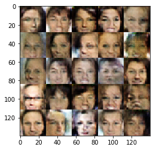


    Epoch 2/4... Discriminator Loss: 1.3832... Generator Loss: 0.7580
    Epoch 2/4... Discriminator Loss: 1.4273... Generator Loss: 0.7388
    Epoch 2/4... Discriminator Loss: 1.4192... Generator Loss: 0.6059
    Epoch 2/4... Discriminator Loss: 1.4729... Generator Loss: 0.7925
    Epoch 2/4... Discriminator Loss: 1.4196... Generator Loss: 0.7061
    Epoch 2/4... Discriminator Loss: 1.4502... Generator Loss: 0.7025
    Epoch 2/4... Discriminator Loss: 1.4144... Generator Loss: 0.6792
    Epoch 2/4... Discriminator Loss: 1.4880... Generator Loss: 0.7127
    Epoch 2/4... Discriminator Loss: 1.4148... Generator Loss: 0.7257
    Epoch 2/4... Discriminator Loss: 1.3767... Generator Loss: 0.7791
    Epoch 2/4... Discriminator Loss: 1.4414... Generator Loss: 0.7385
    Epoch 2/4... Discriminator Loss: 1.4521... Generator Loss: 0.6727
    Epoch 2/4... Discriminator Loss: 1.3855... Generator Loss: 0.7901
    Epoch 2/4... Discriminator Loss: 1.4337... Generator Loss: 0.6946
    Epoch 2/4... Discriminator Loss: 1.3670... Generator Loss: 0.8571
    Epoch 2/4... Discriminator Loss: 1.4534... Generator Loss: 0.6731
    Epoch 2/4... Discriminator Loss: 1.4382... Generator Loss: 0.7269
    Epoch 2/4... Discriminator Loss: 1.3942... Generator Loss: 0.8101
    Epoch 2/4... Discriminator Loss: 1.4327... Generator Loss: 0.7579
    Epoch 2/4... Discriminator Loss: 1.3929... Generator Loss: 0.7487


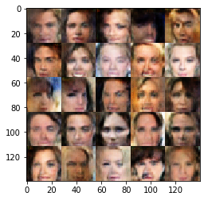


    Epoch 2/4... Discriminator Loss: 1.4708... Generator Loss: 0.6401
    Epoch 2/4... Discriminator Loss: 1.4630... Generator Loss: 0.8140
    Epoch 2/4... Discriminator Loss: 1.4221... Generator Loss: 0.7479
    Epoch 2/4... Discriminator Loss: 1.4134... Generator Loss: 0.7179
    Epoch 2/4... Discriminator Loss: 1.4612... Generator Loss: 0.6442
    Epoch 2/4... Discriminator Loss: 1.3976... Generator Loss: 0.7423
    Epoch 2/4... Discriminator Loss: 1.4539... Generator Loss: 0.6840
    Epoch 2/4... Discriminator Loss: 1.4445... Generator Loss: 0.7597
    Epoch 2/4... Discriminator Loss: 1.4003... Generator Loss: 0.7771
    Epoch 2/4... Discriminator Loss: 1.4258... Generator Loss: 0.6117
    Epoch 2/4... Discriminator Loss: 1.3885... Generator Loss: 0.7818
    Epoch 2/4... Discriminator Loss: 1.4845... Generator Loss: 0.6774
    Epoch 2/4... Discriminator Loss: 1.3747... Generator Loss: 0.7639
    Epoch 2/4... Discriminator Loss: 1.4208... Generator Loss: 0.6188
    Epoch 2/4... Discriminator Loss: 1.5087... Generator Loss: 0.7379
    Epoch 2/4... Discriminator Loss: 1.4238... Generator Loss: 0.7878
    Epoch 2/4... Discriminator Loss: 1.3857... Generator Loss: 0.7536
    Epoch 2/4... Discriminator Loss: 1.4899... Generator Loss: 0.6299
    Epoch 2/4... Discriminator Loss: 1.3886... Generator Loss: 0.8190
    Epoch 2/4... Discriminator Loss: 1.4229... Generator Loss: 0.7861


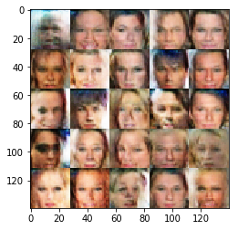


    Epoch 2/4... Discriminator Loss: 1.5062... Generator Loss: 0.6956
    Epoch 2/4... Discriminator Loss: 1.4493... Generator Loss: 0.6577
    Epoch 2/4... Discriminator Loss: 1.3925... Generator Loss: 0.7600
    Epoch 2/4... Discriminator Loss: 1.4540... Generator Loss: 0.5979
    Epoch 2/4... Discriminator Loss: 1.4603... Generator Loss: 0.7094
    Epoch 2/4... Discriminator Loss: 1.4470... Generator Loss: 0.7477
    Epoch 2/4... Discriminator Loss: 1.4639... Generator Loss: 0.6721
    Epoch 2/4... Discriminator Loss: 1.3747... Generator Loss: 0.7895
    Epoch 2/4... Discriminator Loss: 1.4072... Generator Loss: 0.7542
    Epoch 2/4... Discriminator Loss: 1.4473... Generator Loss: 0.7739
    Epoch 2/4... Discriminator Loss: 1.5138... Generator Loss: 0.7570
    Epoch 2/4... Discriminator Loss: 1.4266... Generator Loss: 0.7387
    Epoch 2/4... Discriminator Loss: 1.3910... Generator Loss: 0.7470
    Epoch 2/4... Discriminator Loss: 1.4875... Generator Loss: 0.7641
    Epoch 2/4... Discriminator Loss: 1.4256... Generator Loss: 0.7539
    Epoch 2/4... Discriminator Loss: 1.4067... Generator Loss: 0.8025
    Epoch 2/4... Discriminator Loss: 1.4545... Generator Loss: 0.7066
    Epoch 2/4... Discriminator Loss: 1.3662... Generator Loss: 0.8124
    Epoch 2/4... Discriminator Loss: 1.5113... Generator Loss: 0.6898
    Epoch 2/4... Discriminator Loss: 1.4505... Generator Loss: 0.6359


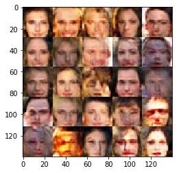


    Epoch 2/4... Discriminator Loss: 1.4755... Generator Loss: 0.6991
    Epoch 2/4... Discriminator Loss: 1.5212... Generator Loss: 0.6143
    Epoch 2/4... Discriminator Loss: 1.3944... Generator Loss: 0.7124
    Epoch 2/4... Discriminator Loss: 1.4524... Generator Loss: 0.7395
    Epoch 2/4... Discriminator Loss: 1.4072... Generator Loss: 0.7305
    Epoch 2/4... Discriminator Loss: 1.4357... Generator Loss: 0.6188
    Epoch 2/4... Discriminator Loss: 1.4393... Generator Loss: 0.7690
    Epoch 2/4... Discriminator Loss: 1.4169... Generator Loss: 0.7266
    Epoch 2/4... Discriminator Loss: 1.4507... Generator Loss: 0.7229
    Epoch 2/4... Discriminator Loss: 1.4423... Generator Loss: 0.7716
    Epoch 2/4... Discriminator Loss: 1.4701... Generator Loss: 0.6783
    Epoch 2/4... Discriminator Loss: 1.4353... Generator Loss: 0.7269
    Epoch 2/4... Discriminator Loss: 1.4821... Generator Loss: 0.6878
    Epoch 2/4... Discriminator Loss: 1.3986... Generator Loss: 0.7862
    Epoch 2/4... Discriminator Loss: 1.4373... Generator Loss: 0.7357
    Epoch 2/4... Discriminator Loss: 1.4221... Generator Loss: 0.7816
    Epoch 2/4... Discriminator Loss: 1.4499... Generator Loss: 0.6015
    Epoch 2/4... Discriminator Loss: 1.4373... Generator Loss: 0.7904
    Epoch 2/4... Discriminator Loss: 1.4920... Generator Loss: 0.5529
    Epoch 2/4... Discriminator Loss: 1.4490... Generator Loss: 0.8044


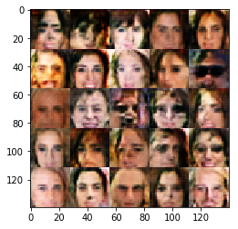


    Epoch 2/4... Discriminator Loss: 1.4446... Generator Loss: 0.7880
    Epoch 2/4... Discriminator Loss: 1.4936... Generator Loss: 0.6731
    Epoch 2/4... Discriminator Loss: 1.4209... Generator Loss: 0.8150
    Epoch 2/4... Discriminator Loss: 1.4828... Generator Loss: 0.7338
    Epoch 2/4... Discriminator Loss: 1.5278... Generator Loss: 0.6582
    Epoch 2/4... Discriminator Loss: 1.4092... Generator Loss: 0.7472
    Epoch 2/4... Discriminator Loss: 1.4544... Generator Loss: 0.7107
    Epoch 2/4... Discriminator Loss: 1.3794... Generator Loss: 0.7737
    Epoch 2/4... Discriminator Loss: 1.3594... Generator Loss: 0.5818
    Epoch 2/4... Discriminator Loss: 1.4515... Generator Loss: 0.7009
    Epoch 2/4... Discriminator Loss: 1.5229... Generator Loss: 0.6095
    Epoch 2/4... Discriminator Loss: 1.4406... Generator Loss: 0.7345
    Epoch 2/4... Discriminator Loss: 1.4579... Generator Loss: 0.6042
    Epoch 2/4... Discriminator Loss: 1.3899... Generator Loss: 0.6756
    Epoch 2/4... Discriminator Loss: 1.3940... Generator Loss: 0.8714
    Epoch 2/4... Discriminator Loss: 1.4634... Generator Loss: 0.6152
    Epoch 2/4... Discriminator Loss: 1.4960... Generator Loss: 0.5957
    Epoch 2/4... Discriminator Loss: 1.4313... Generator Loss: 0.8341
    Epoch 2/4... Discriminator Loss: 1.4654... Generator Loss: 0.7084
    Epoch 2/4... Discriminator Loss: 1.4397... Generator Loss: 0.7131


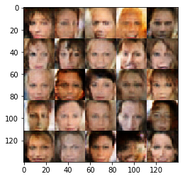


    Epoch 2/4... Discriminator Loss: 1.4106... Generator Loss: 0.7952
    Epoch 2/4... Discriminator Loss: 1.4705... Generator Loss: 0.6783
    Epoch 2/4... Discriminator Loss: 1.4196... Generator Loss: 0.7143
    Epoch 2/4... Discriminator Loss: 1.4331... Generator Loss: 0.7676
    Epoch 2/4... Discriminator Loss: 1.4510... Generator Loss: 0.6504
    Epoch 2/4... Discriminator Loss: 1.3783... Generator Loss: 0.7235
    Epoch 2/4... Discriminator Loss: 1.4764... Generator Loss: 0.7181
    Epoch 2/4... Discriminator Loss: 1.4523... Generator Loss: 0.7587
    Epoch 2/4... Discriminator Loss: 1.4442... Generator Loss: 0.7113
    Epoch 2/4... Discriminator Loss: 1.3854... Generator Loss: 0.7627
    Epoch 2/4... Discriminator Loss: 1.3958... Generator Loss: 0.7435
    Epoch 2/4... Discriminator Loss: 1.4680... Generator Loss: 0.6078
    Epoch 2/4... Discriminator Loss: 1.4380... Generator Loss: 0.7118
    Epoch 2/4... Discriminator Loss: 1.3954... Generator Loss: 0.8794
    Epoch 2/4... Discriminator Loss: 1.4494... Generator Loss: 0.7872
    Epoch 2/4... Discriminator Loss: 1.4108... Generator Loss: 0.6909
    Epoch 2/4... Discriminator Loss: 1.4502... Generator Loss: 0.6595
    Epoch 2/4... Discriminator Loss: 1.4540... Generator Loss: 0.6962
    Epoch 2/4... Discriminator Loss: 1.4022... Generator Loss: 0.8223
    Epoch 2/4... Discriminator Loss: 1.4113... Generator Loss: 0.8123


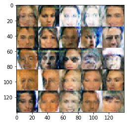


    Epoch 2/4... Discriminator Loss: 1.4254... Generator Loss: 0.6864
    Epoch 2/4... Discriminator Loss: 1.3672... Generator Loss: 0.7816
    Epoch 2/4... Discriminator Loss: 1.3666... Generator Loss: 0.8095
    Epoch 2/4... Discriminator Loss: 1.3685... Generator Loss: 0.7047
    Epoch 2/4... Discriminator Loss: 1.3773... Generator Loss: 0.7780
    Epoch 2/4... Discriminator Loss: 1.4014... Generator Loss: 0.7421
    Epoch 2/4... Discriminator Loss: 1.3188... Generator Loss: 0.7522
    Epoch 2/4... Discriminator Loss: 1.3778... Generator Loss: 0.8067
    Epoch 2/4... Discriminator Loss: 1.3964... Generator Loss: 0.8126
    Epoch 2/4... Discriminator Loss: 1.3414... Generator Loss: 0.6704
    Epoch 2/4... Discriminator Loss: 1.4226... Generator Loss: 0.7726
    Epoch 2/4... Discriminator Loss: 1.4900... Generator Loss: 0.6667
    Epoch 2/4... Discriminator Loss: 1.4093... Generator Loss: 0.7622
    Epoch 2/4... Discriminator Loss: 1.4345... Generator Loss: 0.7072
    Epoch 2/4... Discriminator Loss: 1.3901... Generator Loss: 0.7126
    Epoch 2/4... Discriminator Loss: 1.4119... Generator Loss: 0.7137
    Epoch 2/4... Discriminator Loss: 1.4051... Generator Loss: 0.6839
    Epoch 2/4... Discriminator Loss: 1.3940... Generator Loss: 0.7778
    Epoch 2/4... Discriminator Loss: 1.4701... Generator Loss: 0.7286
    Epoch 2/4... Discriminator Loss: 1.4285... Generator Loss: 0.7044


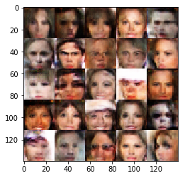


    Epoch 2/4... Discriminator Loss: 1.4753... Generator Loss: 0.6476
    Epoch 2/4... Discriminator Loss: 1.4858... Generator Loss: 0.6719
    Epoch 2/4... Discriminator Loss: 1.3788... Generator Loss: 0.7670
    Epoch 2/4... Discriminator Loss: 1.4213... Generator Loss: 0.6929
    Epoch 2/4... Discriminator Loss: 1.3959... Generator Loss: 0.7658
    Epoch 2/4... Discriminator Loss: 1.4195... Generator Loss: 0.8034
    Epoch 2/4... Discriminator Loss: 1.3743... Generator Loss: 0.7527
    Epoch 2/4... Discriminator Loss: 1.3483... Generator Loss: 0.8026
    Epoch 2/4... Discriminator Loss: 1.4175... Generator Loss: 0.7377
    Epoch 2/4... Discriminator Loss: 1.4453... Generator Loss: 0.7687
    Epoch 2/4... Discriminator Loss: 1.4781... Generator Loss: 0.7226
    Epoch 2/4... Discriminator Loss: 1.5336... Generator Loss: 0.6496
    Epoch 2/4... Discriminator Loss: 1.4011... Generator Loss: 0.7750
    Epoch 2/4... Discriminator Loss: 1.4650... Generator Loss: 0.6563
    Epoch 2/4... Discriminator Loss: 1.4450... Generator Loss: 0.6529
    Epoch 2/4... Discriminator Loss: 1.4376... Generator Loss: 0.8131
    Epoch 2/4... Discriminator Loss: 1.4808... Generator Loss: 0.6881
    Epoch 2/4... Discriminator Loss: 1.3838... Generator Loss: 0.7259
    Epoch 2/4... Discriminator Loss: 1.4511... Generator Loss: 0.7579
    Epoch 2/4... Discriminator Loss: 1.3587... Generator Loss: 0.7376


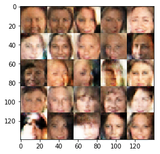


    Epoch 2/4... Discriminator Loss: 1.3988... Generator Loss: 0.7135
    Epoch 2/4... Discriminator Loss: 1.4612... Generator Loss: 0.6840
    Epoch 2/4... Discriminator Loss: 1.4140... Generator Loss: 0.8018
    Epoch 2/4... Discriminator Loss: 1.5317... Generator Loss: 0.6322
    Epoch 2/4... Discriminator Loss: 1.3651... Generator Loss: 0.7637
    Epoch 2/4... Discriminator Loss: 1.5165... Generator Loss: 0.6263


### Submitting This Project
When submitting this project, make sure to run all the cells before saving the notebook. Save the notebook file as "dlnd_face_generation.ipynb" and save it as a HTML file under "File" -> "Download as". Include the "helper.py" and "problem_unittests.py" files in your submission.
