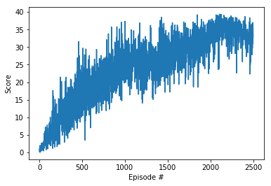

[//]: # (Image References)

[image1]: https://user-images.githubusercontent.com/10624937/43851024-320ba930-9aff-11e8-8493-ee547c6af349.gif "Trained Agent"
[image2]: https://user-images.githubusercontent.com/10624937/43851646-d899bf20-9b00-11e8-858c-29b5c2c94ccc.png "Crawler"


# Continuous Control

### Introduction

For this project, you will work with the [Reacher](https://github.com/Unity-Technologies/ml-agents/blob/master/docs/Learning-Environment-Examples.md#reacher) environment.

![Trained Agent][image1]

In this environment, a double-jointed arm can move to target locations. A reward of +0.1 is provided for each step that the agent's hand is in the goal location. Thus, the goal of your agent is to maintain its position at the target location for as many time steps as possible.

The observation space consists of 33 variables corresponding to position, rotation, velocity, and angular velocities of the arm. Each action is a vector with four numbers, corresponding to torque applicable to two joints. Every entry in the action vector should be a number between -1 and 1.

### Distributed Training

For this project, we will provide you with two separate versions of the Unity environment:
- The first version contains a single agent.
- The second version contains 20 identical agents, each with its own copy of the environment.  

The second version is useful for algorithms like [PPO](https://arxiv.org/pdf/1707.06347.pdf), [A3C](https://arxiv.org/pdf/1602.01783.pdf), and [D4PG](https://openreview.net/pdf?id=SyZipzbCb) that use multiple (non-interacting, parallel) copies of the same agent to distribute the task of gathering experience.  

### Solving the Environment

Note that your project submission need only solve one of the two versions of the environment. 

#### Option 1: Solve the First Version

The task is episodic, and in order to solve the environment,  your agent must get an average score of +30 over 100 consecutive episodes.

#### Option 2: Solve the Second Version

The barrier for solving the second version of the environment is slightly different, to take into account the presence of many agents.  In particular, your agents must get an average score of +30 (over 100 consecutive episodes, and over all agents).  Specifically,
- After each episode, we add up the rewards that each agent received (without discounting), to get a score for each agent.  This yields 20 (potentially different) scores.  We then take the average of these 20 scores. 
- This yields an **average score** for each episode (where the average is over all 20 agents).

The environment is considered solved, when the average (over 100 episodes) of those average scores is at least +30. 

### Getting Started

1. Download the environment from one of the links below.  You need only select the environment that matches your operating system:

    - **_Version 1: One (1) Agent_**
        - Linux: [click here](https://s3-us-west-1.amazonaws.com/udacity-drlnd/P2/Reacher/one_agent/Reacher_Linux.zip)
        - Mac OSX: [click here](https://s3-us-west-1.amazonaws.com/udacity-drlnd/P2/Reacher/one_agent/Reacher.app.zip)
        - Windows (32-bit): [click here](https://s3-us-west-1.amazonaws.com/udacity-drlnd/P2/Reacher/one_agent/Reacher_Windows_x86.zip)
        - Windows (64-bit): [click here](https://s3-us-west-1.amazonaws.com/udacity-drlnd/P2/Reacher/one_agent/Reacher_Windows_x86_64.zip)

    - **_Version 2: Twenty (20) Agents_**
        - Linux: [click here](https://s3-us-west-1.amazonaws.com/udacity-drlnd/P2/Reacher/Reacher_Linux.zip)
        - Mac OSX: [click here](https://s3-us-west-1.amazonaws.com/udacity-drlnd/P2/Reacher/Reacher.app.zip)
        - Windows (32-bit): [click here](https://s3-us-west-1.amazonaws.com/udacity-drlnd/P2/Reacher/Reacher_Windows_x86.zip)
        - Windows (64-bit): [click here](https://s3-us-west-1.amazonaws.com/udacity-drlnd/P2/Reacher/Reacher_Windows_x86_64.zip)
    
    (_For Windows users_) Check out [this link](https://support.microsoft.com/en-us/help/827218/how-to-determine-whether-a-computer-is-running-a-32-bit-version-or-64) if you need help with determining if your computer is running a 32-bit version or 64-bit version of the Windows operating system.

    (_For AWS_) If you'd like to train the agent on AWS (and have not [enabled a virtual screen](https://github.com/Unity-Technologies/ml-agents/blob/master/docs/Training-on-Amazon-Web-Service.md)), then please use [this link](https://s3-us-west-1.amazonaws.com/udacity-drlnd/P2/Reacher/one_agent/Reacher_Linux_NoVis.zip) (version 1) or [this link](https://s3-us-west-1.amazonaws.com/udacity-drlnd/P2/Reacher/Reacher_Linux_NoVis.zip) (version 2) to obtain the "headless" version of the environment.  You will **not** be able to watch the agent without enabling a virtual screen, but you will be able to train the agent.  (_To watch the agent, you should follow the instructions to [enable a virtual screen](https://github.com/Unity-Technologies/ml-agents/blob/master/docs/Training-on-Amazon-Web-Service.md), and then download the environment for the **Linux** operating system above._)

2. Place the file in the DRLND GitHub repository, in the `p2_continuous-control/` folder, and unzip (or decompress) the file. 

### Instructions

Follow the instructions in `Continuous_Control.ipynb` to get started with training your own agent!  


# My Own Implementation

---

### 1. Start the Environment

We begin by importing the necessary packages.  If the code cell below returns an error, please revisit the project instructions to double-check that you have installed [Unity ML-Agents](https://github.com/Unity-Technologies/ml-agents/blob/master/docs/Installation.md) and [NumPy](http://www.numpy.org/).


```python
from unityagents import UnityEnvironment
import numpy as np
```

Next, we will start the environment!  **_Before running the code cell below_**, change the `file_name` parameter to match the location of the Unity environment that you downloaded.

- **Mac**: `"path/to/Reacher.app"`
- **Windows** (x86): `"path/to/Reacher_Windows_x86/Reacher.exe"`
- **Windows** (x86_64): `"path/to/Reacher_Windows_x86_64/Reacher.exe"`
- **Linux** (x86): `"path/to/Reacher_Linux/Reacher.x86"`
- **Linux** (x86_64): `"path/to/Reacher_Linux/Reacher.x86_64"`
- **Linux** (x86, headless): `"path/to/Reacher_Linux_NoVis/Reacher.x86"`
- **Linux** (x86_64, headless): `"path/to/Reacher_Linux_NoVis/Reacher.x86_64"`

For instance, if you are using a Mac, then you downloaded `Reacher.app`.  If this file is in the same folder as the notebook, then the line below should appear as follows:
```
env = UnityEnvironment(file_name="Reacher.app")
```


```python
env = UnityEnvironment(file_name='Reacher_Windows_x86_64/Reacher.exe')
```

    INFO:unityagents:
    'Academy' started successfully!
    Unity Academy name: Academy
            Number of Brains: 1
            Number of External Brains : 1
            Lesson number : 0
            Reset Parameters :
    		goal_speed -> 1.0
    		goal_size -> 5.0
    Unity brain name: ReacherBrain
            Number of Visual Observations (per agent): 0
            Vector Observation space type: continuous
            Vector Observation space size (per agent): 33
            Number of stacked Vector Observation: 1
            Vector Action space type: continuous
            Vector Action space size (per agent): 4
            Vector Action descriptions: , , , 
    

Environments contain **_brains_** which are responsible for deciding the actions of their associated agents. Here we check for the first brain available, and set it as the default brain we will be controlling from Python.


```python
# get the default brain
brain_name = env.brain_names[0]
brain = env.brains[brain_name]
```

### 2. Examine the State and Action Spaces

In this environment, a double-jointed arm can move to target locations. A reward of `+0.1` is provided for each step that the agent's hand is in the goal location. Thus, the goal of your agent is to maintain its position at the target location for as many time steps as possible.

The observation space consists of `33` variables corresponding to position, rotation, velocity, and angular velocities of the arm.  Each action is a vector with four numbers, corresponding to torque applicable to two joints.  Every entry in the action vector must be a number between `-1` and `1`.

Run the code cell below to print some information about the environment.


```python
# reset the environment
env_info = env.reset(train_mode=True)[brain_name]

# number of agents
num_agents = len(env_info.agents)
print('Number of agents:', num_agents)

# size of each action
action_size = brain.vector_action_space_size
print('Size of each action:', action_size)

# examine the state space 
states = env_info.vector_observations
state_size = states.shape[1]
print('There are {} agents. Each observes a state with length: {}'.format(states.shape[0], state_size))
print('The state for the first agent looks like:', states[0])
```

    Number of agents: 1
    Size of each action: 4
    There are 1 agents. Each observes a state with length: 33
    The state for the first agent looks like: [ 0.00000000e+00 -4.00000000e+00  0.00000000e+00  1.00000000e+00
     -0.00000000e+00 -0.00000000e+00 -4.37113883e-08  0.00000000e+00
      0.00000000e+00  0.00000000e+00  0.00000000e+00  0.00000000e+00
      0.00000000e+00  0.00000000e+00 -1.00000000e+01  0.00000000e+00
      1.00000000e+00 -0.00000000e+00 -0.00000000e+00 -4.37113883e-08
      0.00000000e+00  0.00000000e+00  0.00000000e+00  0.00000000e+00
      0.00000000e+00  0.00000000e+00  5.75471878e+00 -1.00000000e+00
      5.55726671e+00  0.00000000e+00  1.00000000e+00  0.00000000e+00
     -1.68164849e-01]
    

### 3. Take Random Actions in the Environment

In the next code cell, you will learn how to use the Python API to control the agent and receive feedback from the environment.

Once this cell is executed, you will watch the agent's performance, if it selects an action at random with each time step.  A window should pop up that allows you to observe the agent, as it moves through the environment.  

Of course, as part of the project, you'll have to change the code so that the agent is able to use its experience to gradually choose better actions when interacting with the environment!


```python
env_info = env.reset(train_mode=False)[brain_name]     # reset the environment    
states = env_info.vector_observations                  # get the current state (for each agent)
scores = np.zeros(num_agents)                          # initialize the score (for each agent)
while True:
    actions = np.random.randn(num_agents, action_size) # select an action (for each agent)
    actions = np.clip(actions, -1, 1)                  # all actions between -1 and 1
    
    env_info = env.step(actions)[brain_name]           # send all actions to tne environment
    next_states = env_info.vector_observations         # get next state (for each agent)
    
    rewards = env_info.rewards                         # get reward (for each agent)
    dones = env_info.local_done                        # see if episode finished
    scores += env_info.rewards                         # update the score (for each agent)
    states = next_states                               # roll over states to next time step
    if np.any(dones):                                  # exit loop if episode finished
        break
print('Total score (averaged over agents) this episode: {}'.format(np.mean(scores)))
```
    
When finished, you can close the environment.


```python
env.close()
```

### 4. DDPG Algorithm

I decided to conquer this task with a populat Actor-Critic Method known as DDPG. Below is my own implementation of the algorithm. I display the last 100 episodes of my training and the score obtained by my agent at each episode during the training.

```python
env_info = env.reset(train_mode=True)[brain_name]
```


```python
import random
import torch
import numpy as np
from collections import deque
import matplotlib.pyplot as plt
%matplotlib inline
from ddpg_agent import Agent
agent = Agent(state_size=state_size, action_size=action_size, random_seed=2)
def ddpg(n_episodes=2500, max_t=10000, print_every=100):
    scores_deque = deque(maxlen=print_every)
    scores = []
    for i_episode in range(1, n_episodes+1):
        score = np.zeros(num_agents)
        env_info = env.reset(train_mode=True)[brain_name]  
        states = env_info.vector_observations
        agent.reset()
        for t in range(max_t):
            action = agent.act(states)
            env_info = env.step(action)[brain_name]
            next_states = env_info.vector_observations
            rewards = env_info.rewards
            score += rewards
            dones = env_info.local_done
            agent.step(states, action, rewards, next_states, dones)
            states = next_states
            if np.any(dones):
                break
        scores_deque.append(score)
        print(scores_deque)
        scores.append(score)
        print('\rEpisode {}\tAverage Score: {:.2f}'.format(i_episode, np.mean(scores_deque)), end="")
        torch.save(agent.actor_local.state_dict(), 'checkpoint_actor.pth')
        torch.save(agent.critic_local.state_dict(), 'checkpoint_critic.pth')
        if i_episode % print_every == 0:
            print('\rEpisode {}\tAverage Score: {:.2f}'.format(i_episode, np.mean(scores_deque)))
    return scores

scores = ddpg()

fig = plt.figure()
ax = fig.add_subplot(111)
plt.plot(np.arange(1, len(scores)+1), scores)
plt.ylabel('Score')
plt.xlabel('Episode #')
plt.show()
```

    Episode 2400	Average Score: 34.36
    Episode 2401	Average Score: 34.34
    Episode 2402	Average Score: 34.35
    Episode 2403	Average Score: 34.30
    Episode 2404	Average Score: 34.33
    Episode 2405	Average Score: 34.44
    Episode 2406	Average Score: 34.43
    Episode 2407	Average Score: 34.42
    Episode 2408	Average Score: 34.45
    Episode 2409	Average Score: 34.39
    Episode 2410	Average Score: 34.37
    Episode 2411	Average Score: 34.30
    Episode 2412	Average Score: 34.23
    Episode 2413	Average Score: 34.24
    Episode 2414	Average Score: 34.22
    Episode 2415	Average Score: 34.19
    Episode 2416	Average Score: 34.19
    Episode 2417	Average Score: 34.18
    Episode 2418	Average Score: 34.10
    Episode 2419	Average Score: 34.06
    Episode 2420	Average Score: 34.06
    Episode 2421	Average Score: 33.99
    Episode 2422	Average Score: 33.94
    Episode 2423	Average Score: 33.93
    Episode 2424	Average Score: 33.94
    Episode 2425	Average Score: 33.95
    Episode 2426	Average Score: 33.98
    Episode 2427	Average Score: 33.96
    Episode 2428	Average Score: 33.89
    Episode 2429	Average Score: 33.85
    Episode 2430	Average Score: 33.86
    Episode 2431	Average Score: 33.82
    Episode 2432	Average Score: 33.79
    Episode 2433	Average Score: 33.77
    Episode 2434	Average Score: 33.74
    Episode 2435	Average Score: 33.71
    Episode 2436	Average Score: 33.71
    Episode 2437	Average Score: 33.73
    Episode 2438	Average Score: 33.71
    Episode 2439	Average Score: 33.67
    Episode 2440	Average Score: 33.60
    Episode 2441	Average Score: 33.59
    Episode 2442	Average Score: 33.58
    Episode 2443	Average Score: 33.54
    Episode 2444	Average Score: 33.49
    Episode 2445	Average Score: 33.45
    Episode 2446	Average Score: 33.44
    Episode 2447	Average Score: 33.41
    Episode 2448	Average Score: 33.36
    Episode 2449	Average Score: 33.32
    Episode 2450	Average Score: 33.30
    Episode 2451	Average Score: 33.28
    Episode 2452	Average Score: 33.28
    Episode 2453	Average Score: 33.26
    Episode 2454	Average Score: 33.31
    Episode 2455	Average Score: 33.33
    Episode 2456	Average Score: 33.32
    Episode 2457	Average Score: 33.33
    Episode 2458	Average Score: 33.38
    Episode 2459	Average Score: 33.38
    Episode 2460	Average Score: 33.41
    Episode 2461	Average Score: 33.33
    Episode 2462	Average Score: 33.34
    Episode 2463	Average Score: 33.33
    Episode 2464	Average Score: 33.34
    Episode 2465	Average Score: 33.31
    Episode 2466	Average Score: 33.31
    Episode 2467	Average Score: 33.20
    Episode 2468	Average Score: 33.20
    Episode 2469	Average Score: 33.21
    Episode 2470	Average Score: 33.18
    Episode 2471	Average Score: 33.12
    Episode 2472	Average Score: 33.10
    Episode 2473	Average Score: 33.09
    Episode 2474	Average Score: 33.09
    Episode 2475	Average Score: 33.15
    Episode 2476	Average Score: 33.11
    Episode 2477	Average Score: 33.13
    Episode 2478	Average Score: 33.09
    Episode 2479	Average Score: 33.11
    Episode 2480	Average Score: 33.12
    Episode 2481	Average Score: 33.10
    Episode 2482	Average Score: 33.09
    Episode 2483	Average Score: 33.12
    Episode 2484	Average Score: 33.15
    Episode 2485	Average Score: 33.09
    Episode 2486	Average Score: 33.07
    Episode 2487	Average Score: 33.05
    Episode 2488	Average Score: 33.06
    Episode 2489	Average Score: 32.98
    Episode 2490	Average Score: 32.99
    Episode 2491	Average Score: 32.97
    Episode 2492	Average Score: 32.91
    Episode 2493	Average Score: 32.89
    Episode 2494	Average Score: 32.87
    Episode 2495	Average Score: 32.82
    Episode 2496	Average Score: 32.83
    Episode 2497	Average Score: 32.85
    Episode 2498	Average Score: 32.86
    Episode 2499	Average Score: 32.87
    Episode 2500	Average Score: 32.87
    




Now it is time to test my trained agent interacting with the environment. You can make use of my trained weights to visualize the agent interacting in the 3D Unity environment accessing the file 'checkpoint_actor.pth' and 'checkpoint_critic.pth'.

```python
import torch
from ddpg_agent import Agent
agent = Agent(state_size, action_size, random_seed=2)
agent.actor_local.load_state_dict(torch.load('checkpoint_actor.pth'))
agent.critic_local.load_state_dict(torch.load('checkpoint_critic.pth'))
scores = np.zeros(num_agents)
env_info = env.reset(train_mode=False)[brain_name]
state = env_info.vector_observations
while True:
    action = agent.act(state)
    env_info = env.step(action)[brain_name]
    next_state = env_info.vector_observations
    reward = env_info.rewards
    done = env_info.local_done
    scores += env_info.rewards
    state = next_state
    if np.any(done):
        break 

print('Total score (averaged over agents) this episode: {}'.format(np.mean(scores)))
```

    Total score (averaged over agents) this episode: 34.73999922350049
    


```python

```

You can also check my YouTube videoof my agent interacting with the environment if you prefer.

Click the following image to watch my **YouTube video**:

[](https://www.youtube.com/watch?v=2kn2DfUKhD4 "")
