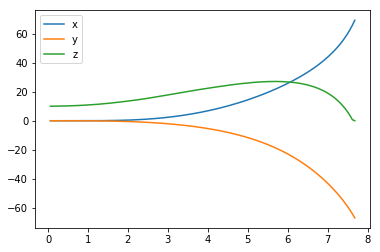
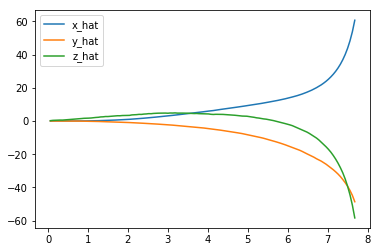
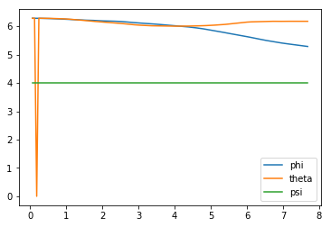
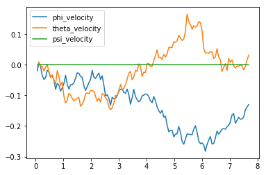
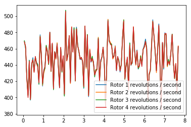
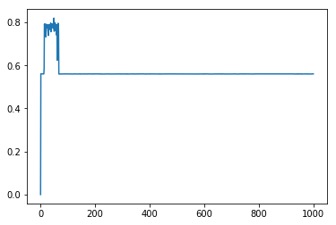

# Project: Train a Quadcopter How to Fly

Design an agent to fly a quadcopter, and then train it using a reinforcement learning algorithm of your choice! 

Try to apply the techniques you have learnt, but also feel free to come up with innovative ideas and test them.

## Instructions

Take a look at the files in the directory to better understand the structure of the project. 

- `task.py`: Define your task (environment) in this file.
- `agents/`: Folder containing reinforcement learning agents.
    - `policy_search.py`: A sample agent has been provided here.
    - `agent.py`: Develop your agent here.
- `physics_sim.py`: This file contains the simulator for the quadcopter.  **DO NOT MODIFY THIS FILE**.

For this project, you will define your own task in `task.py`.  Although we have provided a example task to get you started, you are encouraged to change it.  Later in this notebook, you will learn more about how to amend this file.

You will also design a reinforcement learning agent in `agent.py` to complete your chosen task.  

You are welcome to create any additional files to help you to organize your code.  For instance, you may find it useful to define a `model.py` file defining any needed neural network architectures.

## Controlling the Quadcopter

We provide a sample agent in the code cell below to show you how to use the sim to control the quadcopter.  This agent is even simpler than the sample agent that you'll examine (in `agents/policy_search.py`) later in this notebook!

The agent controls the quadcopter by setting the revolutions per second on each of its four rotors.  The provided agent in the `Basic_Agent` class below always selects a random action for each of the four rotors.  These four speeds are returned by the `act` method as a list of four floating-point numbers.  

For this project, the agent that you will implement in `agents/agent.py` will have a far more intelligent method for selecting actions!


```python
import random

class Basic_Agent():
    def __init__(self, task):
        self.task = task
    
    def act(self):
        new_thrust = random.gauss(450., 25.)
        return [new_thrust + random.gauss(0., 1.) for x in range(4)]
```

Run the code cell below to have the agent select actions to control the quadcopter.  

Feel free to change the provided values of `runtime`, `init_pose`, `init_velocities`, and `init_angle_velocities` below to change the starting conditions of the quadcopter.

The `labels` list below annotates statistics that are saved while running the simulation.  All of this information is saved in a text file `data.txt` and stored in the dictionary `results`.  


```python
%load_ext autoreload
%autoreload 2

import csv
import numpy as np
from task import Task

# Modify the values below to give the quadcopter a different starting position.
runtime = 10.                                     # time limit of the episode
init_pose = np.array([0., 0., 10., 0., 0., 4.])  # initial pose
init_velocities = np.array([0., 0., 0.])         # initial velocities
init_angle_velocities = np.array([0., 0., 0.])   # initial angle velocities
file_output = 'data.txt'                         # file name for saved results

# Setup
task = Task(init_pose, init_velocities, init_angle_velocities, runtime)
agent = Basic_Agent(task)
done = False
labels = ['time', 'x', 'y', 'z', 'phi', 'theta', 'psi', 'x_velocity',
          'y_velocity', 'z_velocity', 'phi_velocity', 'theta_velocity',
          'psi_velocity', 'rotor_speed1', 'rotor_speed2', 'rotor_speed3', 'rotor_speed4']
results = {x : [] for x in labels}

# Run the simulation, and save the results.
with open(file_output, 'w') as csvfile:
    writer = csv.writer(csvfile)
    writer.writerow(labels)
    while True:
        rotor_speeds = agent.act()
        _, _, done = task.step(rotor_speeds)
        to_write = [task.sim.time] + list(task.sim.pose) + list(task.sim.v) + list(task.sim.angular_v) + list(rotor_speeds)
        for ii in range(len(labels)):
            results[labels[ii]].append(to_write[ii])
        writer.writerow(to_write)
        if done:
            break
```

    The autoreload extension is already loaded. To reload it, use:
      %reload_ext autoreload
    

Run the code cell below to visualize how the position of the quadcopter evolved during the simulation.


```python
import matplotlib.pyplot as plt
%matplotlib inline

plt.plot(results['time'], results['x'], label='x')
plt.plot(results['time'], results['y'], label='y')
plt.plot(results['time'], results['z'], label='z')
plt.legend()
_ = plt.ylim()
```





The next code cell visualizes the velocity of the quadcopter.


```python
plt.plot(results['time'], results['x_velocity'], label='x_hat')
plt.plot(results['time'], results['y_velocity'], label='y_hat')
plt.plot(results['time'], results['z_velocity'], label='z_hat')
plt.legend()
_ = plt.ylim()
```





Next, you can plot the Euler angles (the rotation of the quadcopter over the $x$-, $y$-, and $z$-axes),


```python
plt.plot(results['time'], results['phi'], label='phi')
plt.plot(results['time'], results['theta'], label='theta')
plt.plot(results['time'], results['psi'], label='psi')
plt.legend()
_ = plt.ylim()
```





before plotting the velocities (in radians per second) corresponding to each of the Euler angles.


```python
plt.plot(results['time'], results['phi_velocity'], label='phi_velocity')
plt.plot(results['time'], results['theta_velocity'], label='theta_velocity')
plt.plot(results['time'], results['psi_velocity'], label='psi_velocity')
plt.legend()
_ = plt.ylim()
```





Finally, you can use the code cell below to print the agent's choice of actions.  


```python
plt.plot(results['time'], results['rotor_speed1'], label='Rotor 1 revolutions / second')
plt.plot(results['time'], results['rotor_speed2'], label='Rotor 2 revolutions / second')
plt.plot(results['time'], results['rotor_speed3'], label='Rotor 3 revolutions / second')
plt.plot(results['time'], results['rotor_speed4'], label='Rotor 4 revolutions / second')
plt.legend()
_ = plt.ylim()
```





When specifying a task, you will derive the environment state from the simulator.  Run the code cell below to print the values of the following variables at the end of the simulation:
- `task.sim.pose` (the position of the quadcopter in ($x,y,z$) dimensions and the Euler angles),
- `task.sim.v` (the velocity of the quadcopter in ($x,y,z$) dimensions), and
- `task.sim.angular_v` (radians/second for each of the three Euler angles).


```python
# the pose, velocity, and angular velocity of the quadcopter at the end of the episode
print(task.sim.pose)
print(task.sim.v)
print(task.sim.angular_v)
```

    [ 69.27132741 -66.97697587   0.           5.28708504   6.17506783   4.        ]
    [ 60.70042743 -48.63863183 -58.39179543]
    [-0.12994726  0.03219731  0.        ]
    

In the sample task in `task.py`, we use the 6-dimensional pose of the quadcopter to construct the state of the environment at each timestep.  However, when amending the task for your purposes, you are welcome to expand the size of the state vector by including the velocity information.  You can use any combination of the pose, velocity, and angular velocity - feel free to tinker here, and construct the state to suit your task.

## The Task

A sample task has been provided for you in `task.py`.  Open this file in a new window now. 

The `__init__()` method is used to initialize several variables that are needed to specify the task.  
- The simulator is initialized as an instance of the `PhysicsSim` class (from `physics_sim.py`).  
- Inspired by the methodology in the original DDPG paper, we make use of action repeats.  For each timestep of the agent, we step the simulation `action_repeats` timesteps.  If you are not familiar with action repeats, please read the **Results** section in [the DDPG paper](https://arxiv.org/abs/1509.02971).
- We set the number of elements in the state vector.  For the sample task, we only work with the 6-dimensional pose information.  To set the size of the state (`state_size`), we must take action repeats into account.  
- The environment will always have a 4-dimensional action space, with one entry for each rotor (`action_size=4`). You can set the minimum (`action_low`) and maximum (`action_high`) values of each entry here.
- The sample task in this provided file is for the agent to reach a target position.  We specify that target position as a variable.

The `reset()` method resets the simulator.  The agent should call this method every time the episode ends.  You can see an example of this in the code cell below.

The `step()` method is perhaps the most important.  It accepts the agent's choice of action `rotor_speeds`, which is used to prepare the next state to pass on to the agent.  Then, the reward is computed from `get_reward()`.  The episode is considered done if the time limit has been exceeded, or the quadcopter has travelled outside of the bounds of the simulation.

In the next section, you will learn how to test the performance of an agent on this task.

## The Agent

The sample agent given in `agents/policy_search.py` uses a very simplistic linear policy to directly compute the action vector as a dot product of the state vector and a matrix of weights. Then, it randomly perturbs the parameters by adding some Gaussian noise, to produce a different policy. Based on the average reward obtained in each episode (`score`), it keeps track of the best set of parameters found so far, how the score is changing, and accordingly tweaks a scaling factor to widen or tighten the noise.

Run the code cell below to see how the agent performs on the sample task.


```python
import sys
import pandas as pd
from agents.policy_search import PolicySearch_Agent
from task import Task

num_episodes = 1000
target_pos = np.array([0., 0.,58.])
task = Task(target_pos=target_pos)
agent = PolicySearch_Agent(task) 

for i_episode in range(1, num_episodes+1):
    state = agent.reset_episode() # start a new episode
    while True:
        action = agent.act(state) 
        next_state, reward, done = task.step(action)
        agent.step(reward, done)
        state = next_state
        if done:
            print("\rEpisode = {:4d}, score = {:7.3f} (best = {:7.3f}), noise_scale = {}".format(
                i_episode, agent.score, agent.best_score, agent.noise_scale), end="")  # [debug]
            break
    sys.stdout.flush()
```

    Episode = 1000, score =   0.607 (best =   0.617), noise_scale = 3.25

This agent should perform very poorly on this task.  And that's where you come in!

## Define the Task, Design the Agent, and Train Your Agent!

Amend `task.py` to specify a task of your choosing.  If you're unsure what kind of task to specify, you may like to teach your quadcopter to takeoff, hover in place, land softly, or reach a target pose.  

After specifying your task, use the sample agent in `agents/policy_search.py` as a template to define your own agent in `agents/agent.py`.  You can borrow whatever you need from the sample agent, including ideas on how you might modularize your code (using helper methods like `act()`, `learn()`, `reset_episode()`, etc.).

Note that it is **highly unlikely** that the first agent and task that you specify will learn well.  You will likely have to tweak various hyperparameters and the reward function for your task until you arrive at reasonably good behavior.

As you develop your agent, it's important to keep an eye on how it's performing. Use the code above as inspiration to build in a mechanism to log/save the total rewards obtained in each episode to file.  If the episode rewards are gradually increasing, this is an indication that your agent is learning.


```python
import sys
import pandas as pd
from agents.agent import DDPG
from task import Task

num_episodes = 1000
init_pose = np.array([0., 0., 1.,0.,0.,0.])
#init_velocities = np.array([0., 0., 500.])
target_pos = np.array([0., 0., 58.])
graph = np.zeros((1001))
task = Task(init_pose=init_pose,target_pos=target_pos,init_velocities=init_velocities)
agent = DDPG(task) 
reward_total = 0
counter = 0
best_score = -5

for i_episode in range(1, num_episodes+1):
    state = agent.reset_episode() # start a new episode
    while True:
        action = agent.act(state) 
        next_state, reward, done = task.step(action)
        agent.step(action,reward,next_state, done)
        state = next_state
        reward_total=reward_total + reward
        counter = counter + 1
        if reward>=0.98:
            print("Height: ")
            print(next_state[2])
        if done:
            print("\rEpisode = {:4d}, score = (best = {:7.3f}), reward = ".format(
                i_episode, best_score), end="")  # [debug]
            reward_total = reward_total/counter
            print(reward_total)
            if reward_total>best_score:
                best_score = reward_total
            if reward_total!=-5:
                graph[i_episode] = reward_total
            reward_total = 0
            counter = 0
            
            break
    sys.stdout.flush()
```

    <Actor.Actor object at 0x7f048d01c5f8>
    Episode =    1, score = (best =  -5.000), reward = 0.560537343411
    Episode =    2, score = (best =   0.561), reward = 0.5605428863
    Episode =    3, score = (best =   0.561), reward = 0.56053623985
    Episode =    4, score = (best =   0.561), reward = 0.560524015865
    Episode =    5, score = (best =   0.561), reward = 0.560535341568
    Episode =    6, score = (best =   0.561), reward = 0.560538567398
    Episode =    7, score = (best =   0.561), reward = 0.560538540918
    Episode =    8, score = (best =   0.561), reward = 0.560536147658
    Episode =    9, score = (best =   0.561), reward = 0.56053403651
    Episode =   10, score = (best =   0.561), reward = 0.560468835143
    Episode =   11, score = (best =   0.561), reward = 0.559698091994
    Episode =   12, score = (best =   0.561), reward = 0.560840430888
    Episode =   13, score = (best =   0.561), reward = 0.585547117821
    Height: 
    56.5795819428
    Height: 
    57.4564307228
    Height: 
    58.3224396469
    Episode =   14, score = (best =   0.586), reward = 0.79075525745
    Height: 
    56.6479302846
    Height: 
    57.553635622
    Height: 
    58.4586345456
    Episode =   15, score = (best =   0.791), reward = 0.783393900293
    Height: 
    57.083552565
    Height: 
    57.7652929791
    Height: 
    58.4308115267
    Height: 
    59.0800885585
    Episode =   16, score = (best =   0.791), reward = 0.79231699078
    Height: 
    56.5081108908
    Height: 
    57.490468661
    Height: 
    58.4644896733
    Episode =   17, score = (best =   0.792), reward = 0.786005170907
    Episode =   18, score = (best =   0.792), reward = 0.776381824035
    Episode =   19, score = (best =   0.792), reward = 0.732275580852
    Episode =   20, score = (best =   0.792), reward = 0.767474367991
    Height: 
    56.807719791
    Height: 
    57.3605201652
    Height: 
    57.9289078125
    Height: 
    58.5157149925
    Episode =   21, score = (best =   0.792), reward = 0.791031350181
    Height: 
    56.3383004492
    Height: 
    57.3995244036
    Height: 
    58.4629242612
    Episode =   22, score = (best =   0.792), reward = 0.783486045873
    Height: 
    57.1213533156
    Height: 
    58.1898665042
    Episode =   23, score = (best =   0.792), reward = 0.783113140668
    Episode =   24, score = (best =   0.792), reward = 0.776043939155
    Height: 
    56.9394682241
    Height: 
    57.8440231506
    Height: 
    58.7456998459
    Episode =   25, score = (best =   0.792), reward = 0.785566580418
    Height: 
    57.0069378758
    Height: 
    57.8595224223
    Height: 
    58.700577551
    Episode =   26, score = (best =   0.792), reward = 0.786560806275
    Episode =   27, score = (best =   0.792), reward = 0.762961645966
    Episode =   28, score = (best =   0.792), reward = 0.738394876831
    Height: 
    56.5788798656
    Height: 
    57.6113702423
    Height: 
    58.6442662263
    Episode =   29, score = (best =   0.792), reward = 0.788190924386
    Episode =   30, score = (best =   0.792), reward = 0.767519325704
    Height: 
    56.4383968793
    Height: 
    57.466602409
    Height: 
    58.4956015936
    Episode =   31, score = (best =   0.792), reward = 0.784186018075
    Height: 
    57.2832111775
    Height: 
    58.3587772746
    Episode =   32, score = (best =   0.792), reward = 0.786998038569
    Height: 
    56.6668890105
    Height: 
    57.652238542
    Height: 
    58.63688446
    Episode =   33, score = (best =   0.792), reward = 0.788649376027
    Height: 
    56.4493648674
    Height: 
    57.3954394727
    Height: 
    58.3477173006
    Episode =   34, score = (best =   0.792), reward = 0.787514234296
    Height: 
    57.1299646281
    Height: 
    58.1687818272
    Episode =   35, score = (best =   0.792), reward = 0.783726308976
    Episode =   36, score = (best =   0.792), reward = 0.764271072557
    Height: 
    56.8036617708
    Height: 
    57.4586294616
    Height: 
    58.0915964312
    Height: 
    58.7018893608
    Episode =   37, score = (best =   0.792), reward = 0.79631152704
    Episode =   38, score = (best =   0.796), reward = 0.755974330752
    Episode =   39, score = (best =   0.796), reward = 0.766488273017
    Height: 
    56.5676904712
    Height: 
    57.4661902432
    Height: 
    58.3566153957
    Episode =   40, score = (best =   0.796), reward = 0.790003064968
    Height: 
    56.8714544095
    Height: 
    57.4520842769
    Height: 
    58.0248762431
    Height: 
    58.5904737312
    Episode =   41, score = (best =   0.796), reward = 0.792171138842
    Height: 
    57.254706864
    Height: 
    58.273817174
    Episode =   42, score = (best =   0.796), reward = 0.783844356561
    Height: 
    56.4013039665
    Height: 
    57.2496628229
    Height: 
    58.0872278787
    Height: 
    58.9139088462
    Episode =   43, score = (best =   0.796), reward = 0.791166991643
    Height: 
    56.7242022685
    Height: 
    57.6915064747
    Height: 
    58.6459720097
    Episode =   44, score = (best =   0.796), reward = 0.790355950503
    Height: 
    56.3381680424
    Height: 
    57.3826330176
    Height: 
    58.4323323963
    Episode =   45, score = (best =   0.796), reward = 0.783508866889
    Episode =   46, score = (best =   0.796), reward = 0.771670549779
    Height: 
    56.5567061773
    Height: 
    57.590392773
    Height: 
    58.6239657479
    Episode =   47, score = (best =   0.796), reward = 0.784273447349
    Height: 
    57.1430559565
    Height: 
    58.1241073733
    Episode =   48, score = (best =   0.796), reward = 0.785472744368
    Height: 
    56.8916837511
    Height: 
    57.2439105277
    Height: 
    57.5643760252
    Height: 
    57.8524412342
    Height: 
    58.1075179065
    Height: 
    58.3290748287
    Height: 
    58.5166276282
    Episode =   49, score = (best =   0.796), reward = 0.819493527086
    Episode =   50, score = (best =   0.819), reward = 0.758093329488
    Height: 
    56.4352891663
    Height: 
    57.4248660492
    Height: 
    58.4051034702
    Episode =   51, score = (best =   0.819), reward = 0.785997468252
    Height: 
    57.2785874967
    Height: 
    58.2272738802
    Episode =   52, score = (best =   0.819), reward = 0.785379640168
    Height: 
    56.515094416
    Height: 
    57.1597997485
    Height: 
    57.779123472
    Height: 
    58.3719744131
    Height: 
    58.9372493556
    Episode =   53, score = (best =   0.819), reward = 0.797634673731
    Height: 
    56.6249993864
    Height: 
    57.6067732441
    Height: 
    58.5863707422
    Episode =   54, score = (best =   0.819), reward = 0.788658176728
    Episode =   55, score = (best =   0.819), reward = 0.762315894904
    Height: 
    57.2305364488
    Height: 
    58.290157205
    Episode =   56, score = (best =   0.819), reward = 0.78389359359
    Height: 
    56.3337971661
    Height: 
    57.3517575993
    Height: 
    58.360558433
    Episode =   57, score = (best =   0.819), reward = 0.789415720492
    Episode =   58, score = (best =   0.819), reward = 0.747672309143
    Episode =   59, score = (best =   0.819), reward = 0.740269676659
    Height: 
    56.4791186378
    Height: 
    57.4170706254
    Height: 
    58.3652754822
    Episode =   60, score = (best =   0.819), reward = 0.788042631445
    Episode =   61, score = (best =   0.819), reward = 0.623977467967
    Height: 
    56.8855559145
    Height: 
    57.8995303638
    Height: 
    58.9176200063
    Episode =   62, score = (best =   0.819), reward = 0.784429336165
    Episode =   63, score = (best =   0.819), reward = 0.747687170368
    Height: 
    56.5995628929
    Height: 
    57.185632987
    Height: 
    57.7459505553
    Height: 
    58.2795166071
    Height: 
    58.7853574755
    Episode =   64, score = (best =   0.819), reward = 0.795738631872
    Height: 
    56.9761073871
    Height: 
    57.6864815695
    Height: 
    58.3929454255
    Height: 
    59.0962883087
    Episode =   65, score = (best =   0.819), reward = 0.793275976424
    Episode =   66, score = (best =   0.819), reward = 0.754572622836
    Episode =   67, score = (best =   0.819), reward = 0.559770829395
    Episode =   68, score = (best =   0.819), reward = 0.560240764601
    Episode =   69, score = (best =   0.819), reward = 0.559760995406
    Episode =   70, score = (best =   0.819), reward = 0.559783763259
    Episode =   71, score = (best =   0.819), reward = 0.560234972281
    Episode =   72, score = (best =   0.819), reward = 0.559802451092
    Episode =   73, score = (best =   0.819), reward = 0.560264056133
    Episode =   74, score = (best =   0.819), reward = 0.560240633652
    Episode =   75, score = (best =   0.819), reward = 0.560273943076
    Episode =   76, score = (best =   0.819), reward = 0.560269735352
    Episode =   77, score = (best =   0.819), reward = 0.560217424033
    Episode =   78, score = (best =   0.819), reward = 0.559794043258
    Episode =   79, score = (best =   0.819), reward = 0.559751619982
    Episode =   80, score = (best =   0.819), reward = 0.560231027527
    Episode =   81, score = (best =   0.819), reward = 0.560212622724
    Episode =   82, score = (best =   0.819), reward = 0.55976200674
    Episode =   83, score = (best =   0.819), reward = 0.560257851788
    Episode =   84, score = (best =   0.819), reward = 0.560251258274
    Episode =   85, score = (best =   0.819), reward = 0.560253598689
    Episode =   86, score = (best =   0.819), reward = 0.560259576873
    Episode =   87, score = (best =   0.819), reward = 0.560237151271
    Episode =   88, score = (best =   0.819), reward = 0.560202542213
    Episode =   89, score = (best =   0.819), reward = 0.560251595944
    Episode =   90, score = (best =   0.819), reward = 0.56022363327
    Episode =   91, score = (best =   0.819), reward = 0.55977712009
    Episode =   92, score = (best =   0.819), reward = 0.559813383016
    Episode =   93, score = (best =   0.819), reward = 0.560199663593
    Episode =   94, score = (best =   0.819), reward = 0.560263777776
    Episode =   95, score = (best =   0.819), reward = 0.56024565968
    Episode =   96, score = (best =   0.819), reward = 0.559806773139
    Episode =   97, score = (best =   0.819), reward = 0.560221642741
    Episode =   98, score = (best =   0.819), reward = 0.560239789531
    Episode =   99, score = (best =   0.819), reward = 0.560242570977
    Episode =  100, score = (best =   0.819), reward = 0.560249188821
    Episode =  101, score = (best =   0.819), reward = 0.560228778037
    Episode =  102, score = (best =   0.819), reward = 0.559760490675
    Episode =  103, score = (best =   0.819), reward = 0.560218204674
    Episode =  104, score = (best =   0.819), reward = 0.56016873656
    Episode =  105, score = (best =   0.819), reward = 0.560235483424
    Episode =  106, score = (best =   0.819), reward = 0.560243915197
    Episode =  107, score = (best =   0.819), reward = 0.559773671905
    Episode =  108, score = (best =   0.819), reward = 0.559835292996
    Episode =  109, score = (best =   0.819), reward = 0.559760588648
    Episode =  110, score = (best =   0.819), reward = 0.559872723701
    Episode =  111, score = (best =   0.819), reward = 0.560275700622
    Episode =  112, score = (best =   0.819), reward = 0.559808935988
    Episode =  113, score = (best =   0.819), reward = 0.55978912669
    Episode =  114, score = (best =   0.819), reward = 0.559777442905
    Episode =  115, score = (best =   0.819), reward = 0.559761704401
    Episode =  116, score = (best =   0.819), reward = 0.559789014697
    Episode =  117, score = (best =   0.819), reward = 0.559767897832
    Episode =  118, score = (best =   0.819), reward = 0.55977341935
    Episode =  119, score = (best =   0.819), reward = 0.560265520553
    Episode =  120, score = (best =   0.819), reward = 0.559791716514
    Episode =  121, score = (best =   0.819), reward = 0.559755520522
    Episode =  122, score = (best =   0.819), reward = 0.560237564689
    Episode =  123, score = (best =   0.819), reward = 0.560263480242
    Episode =  124, score = (best =   0.819), reward = 0.559782391071
    Episode =  125, score = (best =   0.819), reward = 0.560225588936
    Episode =  126, score = (best =   0.819), reward = 0.560234342836
    Episode =  127, score = (best =   0.819), reward = 0.560203272903
    Episode =  128, score = (best =   0.819), reward = 0.559752560242
    Episode =  129, score = (best =   0.819), reward = 0.560249395106
    Episode =  130, score = (best =   0.819), reward = 0.560218462242
    Episode =  131, score = (best =   0.819), reward = 0.559756286553
    Episode =  132, score = (best =   0.819), reward = 0.559797374905
    Episode =  133, score = (best =   0.819), reward = 0.560256373069
    Episode =  134, score = (best =   0.819), reward = 0.559745048036
    Episode =  135, score = (best =   0.819), reward = 0.560247089437
    Episode =  136, score = (best =   0.819), reward = 0.560260572522
    Episode =  137, score = (best =   0.819), reward = 0.560218178826
    Episode =  138, score = (best =   0.819), reward = 0.559802624398
    Episode =  139, score = (best =   0.819), reward = 0.559753095048
    Episode =  140, score = (best =   0.819), reward = 0.560260641175
    Episode =  141, score = (best =   0.819), reward = 0.560268476798
    Episode =  142, score = (best =   0.819), reward = 0.560219144403
    Episode =  143, score = (best =   0.819), reward = 0.560213143903
    Episode =  144, score = (best =   0.819), reward = 0.559761097059
    Episode =  145, score = (best =   0.819), reward = 0.560245854423
    Episode =  146, score = (best =   0.819), reward = 0.559815642733
    Episode =  147, score = (best =   0.819), reward = 0.560245242981
    Episode =  148, score = (best =   0.819), reward = 0.560231233542
    Episode =  149, score = (best =   0.819), reward = 0.559760670674
    Episode =  150, score = (best =   0.819), reward = 0.559805055398
    Episode =  151, score = (best =   0.819), reward = 0.560273119755
    Episode =  152, score = (best =   0.819), reward = 0.559758094729
    Episode =  153, score = (best =   0.819), reward = 0.5597523557
    Episode =  154, score = (best =   0.819), reward = 0.559794976903
    Episode =  155, score = (best =   0.819), reward = 0.559750586636
    Episode =  156, score = (best =   0.819), reward = 0.560215135979
    Episode =  157, score = (best =   0.819), reward = 0.559750150557
    Episode =  158, score = (best =   0.819), reward = 0.560245181408
    Episode =  159, score = (best =   0.819), reward = 0.560257242956
    Episode =  160, score = (best =   0.819), reward = 0.56018113786
    Episode =  161, score = (best =   0.819), reward = 0.559766665018
    Episode =  162, score = (best =   0.819), reward = 0.559809636513
    Episode =  163, score = (best =   0.819), reward = 0.560262890561
    Episode =  164, score = (best =   0.819), reward = 0.560186317569
    Episode =  165, score = (best =   0.819), reward = 0.55975574507
    Episode =  166, score = (best =   0.819), reward = 0.55980741417
    Episode =  167, score = (best =   0.819), reward = 0.560199961071
    Episode =  168, score = (best =   0.819), reward = 0.559762633977
    Episode =  169, score = (best =   0.819), reward = 0.559775785938
    Episode =  170, score = (best =   0.819), reward = 0.559789544437
    Episode =  171, score = (best =   0.819), reward = 0.559759453051
    Episode =  172, score = (best =   0.819), reward = 0.560273233761
    Episode =  173, score = (best =   0.819), reward = 0.560236988356
    Episode =  174, score = (best =   0.819), reward = 0.559762708268
    Episode =  175, score = (best =   0.819), reward = 0.559790318754
    Episode =  176, score = (best =   0.819), reward = 0.559773439228
    Episode =  177, score = (best =   0.819), reward = 0.559794187764
    Episode =  178, score = (best =   0.819), reward = 0.559756900405
    Episode =  179, score = (best =   0.819), reward = 0.560257988802
    Episode =  180, score = (best =   0.819), reward = 0.560221198992
    Episode =  181, score = (best =   0.819), reward = 0.560240969669
    Episode =  182, score = (best =   0.819), reward = 0.559798774942
    Episode =  183, score = (best =   0.819), reward = 0.559779640641
    Episode =  184, score = (best =   0.819), reward = 0.559795592853
    Episode =  185, score = (best =   0.819), reward = 0.560187398978
    Episode =  186, score = (best =   0.819), reward = 0.560263176771
    Episode =  187, score = (best =   0.819), reward = 0.560250107126
    Episode =  188, score = (best =   0.819), reward = 0.559763303914
    Episode =  189, score = (best =   0.819), reward = 0.559759430955
    Episode =  190, score = (best =   0.819), reward = 0.559765109469
    Episode =  191, score = (best =   0.819), reward = 0.560252236946
    Episode =  192, score = (best =   0.819), reward = 0.560244386914
    Episode =  193, score = (best =   0.819), reward = 0.559773856097
    Episode =  194, score = (best =   0.819), reward = 0.560253305263
    Episode =  195, score = (best =   0.819), reward = 0.559860151826
    Episode =  196, score = (best =   0.819), reward = 0.560261146797
    Episode =  197, score = (best =   0.819), reward = 0.560231448215
    Episode =  198, score = (best =   0.819), reward = 0.56020520116
    Episode =  199, score = (best =   0.819), reward = 0.560227822359
    Episode =  200, score = (best =   0.819), reward = 0.560174883759
    Episode =  201, score = (best =   0.819), reward = 0.559761036188
    Episode =  202, score = (best =   0.819), reward = 0.56022436799
    Episode =  203, score = (best =   0.819), reward = 0.559788004596
    Episode =  204, score = (best =   0.819), reward = 0.559787434657
    Episode =  205, score = (best =   0.819), reward = 0.559770989849
    Episode =  206, score = (best =   0.819), reward = 0.55979259157
    Episode =  207, score = (best =   0.819), reward = 0.560110351322
    Episode =  208, score = (best =   0.819), reward = 0.560216710525
    Episode =  209, score = (best =   0.819), reward = 0.559750017854
    Episode =  210, score = (best =   0.819), reward = 0.559753074008
    Episode =  211, score = (best =   0.819), reward = 0.560209924809
    Episode =  212, score = (best =   0.819), reward = 0.560197412535
    Episode =  213, score = (best =   0.819), reward = 0.560259686486
    Episode =  214, score = (best =   0.819), reward = 0.560257010044
    Episode =  215, score = (best =   0.819), reward = 0.559791317614
    Episode =  216, score = (best =   0.819), reward = 0.560253256434
    Episode =  217, score = (best =   0.819), reward = 0.560240468122
    Episode =  218, score = (best =   0.819), reward = 0.560245926786
    Episode =  219, score = (best =   0.819), reward = 0.560210523438
    Episode =  220, score = (best =   0.819), reward = 0.560268310083
    Episode =  221, score = (best =   0.819), reward = 0.559765454133
    Episode =  222, score = (best =   0.819), reward = 0.560257693998
    Episode =  223, score = (best =   0.819), reward = 0.559749267581
    Episode =  224, score = (best =   0.819), reward = 0.559790257166
    Episode =  225, score = (best =   0.819), reward = 0.560251842387
    Episode =  226, score = (best =   0.819), reward = 0.559819341592
    Episode =  227, score = (best =   0.819), reward = 0.559760868847
    Episode =  228, score = (best =   0.819), reward = 0.560266751272
    Episode =  229, score = (best =   0.819), reward = 0.55984860252
    Episode =  230, score = (best =   0.819), reward = 0.560256482612
    Episode =  231, score = (best =   0.819), reward = 0.560264598882
    Episode =  232, score = (best =   0.819), reward = 0.560229766931
    Episode =  233, score = (best =   0.819), reward = 0.56024415737
    Episode =  234, score = (best =   0.819), reward = 0.559766908598
    Episode =  235, score = (best =   0.819), reward = 0.559763534301
    Episode =  236, score = (best =   0.819), reward = 0.559786611272
    Episode =  237, score = (best =   0.819), reward = 0.559809938
    Episode =  238, score = (best =   0.819), reward = 0.560251729081
    Episode =  239, score = (best =   0.819), reward = 0.560220109093
    Episode =  240, score = (best =   0.819), reward = 0.560189129957
    Episode =  241, score = (best =   0.819), reward = 0.560246133574
    Episode =  242, score = (best =   0.819), reward = 0.559777354932
    Episode =  243, score = (best =   0.819), reward = 0.559772998244
    Episode =  244, score = (best =   0.819), reward = 0.560214942747
    Episode =  245, score = (best =   0.819), reward = 0.559752861952
    Episode =  246, score = (best =   0.819), reward = 0.559778003441
    Episode =  247, score = (best =   0.819), reward = 0.559774831855
    Episode =  248, score = (best =   0.819), reward = 0.559842275881
    Episode =  249, score = (best =   0.819), reward = 0.559851784586
    Episode =  250, score = (best =   0.819), reward = 0.560268806443
    Episode =  251, score = (best =   0.819), reward = 0.560209011722
    Episode =  252, score = (best =   0.819), reward = 0.560236649643
    Episode =  253, score = (best =   0.819), reward = 0.559813471989
    Episode =  254, score = (best =   0.819), reward = 0.559796686661
    Episode =  255, score = (best =   0.819), reward = 0.559827603704
    Episode =  256, score = (best =   0.819), reward = 0.560250157037
    Episode =  257, score = (best =   0.819), reward = 0.559772089554
    Episode =  258, score = (best =   0.819), reward = 0.559787691258
    Episode =  259, score = (best =   0.819), reward = 0.560209989036
    Episode =  260, score = (best =   0.819), reward = 0.559780549461
    Episode =  261, score = (best =   0.819), reward = 0.560251001062
    Episode =  262, score = (best =   0.819), reward = 0.560226967059
    Episode =  263, score = (best =   0.819), reward = 0.560271208851
    Episode =  264, score = (best =   0.819), reward = 0.560270070486
    Episode =  265, score = (best =   0.819), reward = 0.560272016614
    Episode =  266, score = (best =   0.819), reward = 0.559769163979
    Episode =  267, score = (best =   0.819), reward = 0.560197103127
    Episode =  268, score = (best =   0.819), reward = 0.560189041545
    Episode =  269, score = (best =   0.819), reward = 0.560255196047
    Episode =  270, score = (best =   0.819), reward = 0.559793313302
    Episode =  271, score = (best =   0.819), reward = 0.559761824222
    Episode =  272, score = (best =   0.819), reward = 0.560234547253
    Episode =  273, score = (best =   0.819), reward = 0.559864023094
    Episode =  274, score = (best =   0.819), reward = 0.560216065742
    Episode =  275, score = (best =   0.819), reward = 0.559762392693
    Episode =  276, score = (best =   0.819), reward = 0.560257120415
    Episode =  277, score = (best =   0.819), reward = 0.560222510572
    Episode =  278, score = (best =   0.819), reward = 0.56020004203
    Episode =  279, score = (best =   0.819), reward = 0.560273667901
    Episode =  280, score = (best =   0.819), reward = 0.559863191167
    Episode =  281, score = (best =   0.819), reward = 0.560273511777
    Episode =  282, score = (best =   0.819), reward = 0.560256334589
    Episode =  283, score = (best =   0.819), reward = 0.560269592284
    Episode =  284, score = (best =   0.819), reward = 0.560248934899
    Episode =  285, score = (best =   0.819), reward = 0.559766982785
    Episode =  286, score = (best =   0.819), reward = 0.560261950468
    Episode =  287, score = (best =   0.819), reward = 0.559783693747
    Episode =  288, score = (best =   0.819), reward = 0.560257060019
    Episode =  289, score = (best =   0.819), reward = 0.560194339628
    Episode =  290, score = (best =   0.819), reward = 0.560210493396
    Episode =  291, score = (best =   0.819), reward = 0.559812158305
    Episode =  292, score = (best =   0.819), reward = 0.560271485527
    Episode =  293, score = (best =   0.819), reward = 0.56025708522
    Episode =  294, score = (best =   0.819), reward = 0.559776411371
    Episode =  295, score = (best =   0.819), reward = 0.559754000322
    Episode =  296, score = (best =   0.819), reward = 0.560270439472
    Episode =  297, score = (best =   0.819), reward = 0.559748400643
    Episode =  298, score = (best =   0.819), reward = 0.559802387776
    Episode =  299, score = (best =   0.819), reward = 0.560271837806
    Episode =  300, score = (best =   0.819), reward = 0.560264294692
    Episode =  301, score = (best =   0.819), reward = 0.560230276855
    Episode =  302, score = (best =   0.819), reward = 0.560273282146
    Episode =  303, score = (best =   0.819), reward = 0.560248096402
    Episode =  304, score = (best =   0.819), reward = 0.560228976039
    Episode =  305, score = (best =   0.819), reward = 0.56024822062
    Episode =  306, score = (best =   0.819), reward = 0.559808411758
    Episode =  307, score = (best =   0.819), reward = 0.560242836062
    Episode =  308, score = (best =   0.819), reward = 0.55982281344
    Episode =  309, score = (best =   0.819), reward = 0.560273573088
    Episode =  310, score = (best =   0.819), reward = 0.559798771791
    Episode =  311, score = (best =   0.819), reward = 0.560259921219
    Episode =  312, score = (best =   0.819), reward = 0.560233434931
    Episode =  313, score = (best =   0.819), reward = 0.559774203973
    Episode =  314, score = (best =   0.819), reward = 0.559780981705
    Episode =  315, score = (best =   0.819), reward = 0.559752781953
    Episode =  316, score = (best =   0.819), reward = 0.560259153475
    Episode =  317, score = (best =   0.819), reward = 0.559752999584
    Episode =  318, score = (best =   0.819), reward = 0.560241710805
    Episode =  319, score = (best =   0.819), reward = 0.559796266515
    Episode =  320, score = (best =   0.819), reward = 0.560246412311
    Episode =  321, score = (best =   0.819), reward = 0.559757131704
    Episode =  322, score = (best =   0.819), reward = 0.559746807918
    Episode =  323, score = (best =   0.819), reward = 0.559782533108
    Episode =  324, score = (best =   0.819), reward = 0.559757905022
    Episode =  325, score = (best =   0.819), reward = 0.559782852232
    Episode =  326, score = (best =   0.819), reward = 0.560223112791
    Episode =  327, score = (best =   0.819), reward = 0.559799824451
    Episode =  328, score = (best =   0.819), reward = 0.560197268759
    Episode =  329, score = (best =   0.819), reward = 0.560271338225
    Episode =  330, score = (best =   0.819), reward = 0.560225400141
    Episode =  331, score = (best =   0.819), reward = 0.559767882519
    Episode =  332, score = (best =   0.819), reward = 0.559830105567
    Episode =  333, score = (best =   0.819), reward = 0.560204998329
    Episode =  334, score = (best =   0.819), reward = 0.560235080311
    Episode =  335, score = (best =   0.819), reward = 0.559763253429
    Episode =  336, score = (best =   0.819), reward = 0.559855563947
    Episode =  337, score = (best =   0.819), reward = 0.560205488073
    Episode =  338, score = (best =   0.819), reward = 0.560213704698
    Episode =  339, score = (best =   0.819), reward = 0.560240495979
    Episode =  340, score = (best =   0.819), reward = 0.560252050669
    Episode =  341, score = (best =   0.819), reward = 0.559772951144
    Episode =  342, score = (best =   0.819), reward = 0.56023913256
    Episode =  343, score = (best =   0.819), reward = 0.560254381437
    Episode =  344, score = (best =   0.819), reward = 0.559806366749
    Episode =  345, score = (best =   0.819), reward = 0.559851500113
    Episode =  346, score = (best =   0.819), reward = 0.560239043004
    Episode =  347, score = (best =   0.819), reward = 0.559832098361
    Episode =  348, score = (best =   0.819), reward = 0.560229428121
    Episode =  349, score = (best =   0.819), reward = 0.560266561333
    Episode =  350, score = (best =   0.819), reward = 0.559750258993
    Episode =  351, score = (best =   0.819), reward = 0.559752325041
    Episode =  352, score = (best =   0.819), reward = 0.559776462912
    Episode =  353, score = (best =   0.819), reward = 0.560266931325
    Episode =  354, score = (best =   0.819), reward = 0.559786532849
    Episode =  355, score = (best =   0.819), reward = 0.559750247626
    Episode =  356, score = (best =   0.819), reward = 0.559749858052
    Episode =  357, score = (best =   0.819), reward = 0.560215359832
    Episode =  358, score = (best =   0.819), reward = 0.559762612101
    Episode =  359, score = (best =   0.819), reward = 0.560243074433
    Episode =  360, score = (best =   0.819), reward = 0.560220328753
    Episode =  361, score = (best =   0.819), reward = 0.560268446131
    Episode =  362, score = (best =   0.819), reward = 0.559774403172
    Episode =  363, score = (best =   0.819), reward = 0.559785761124
    Episode =  364, score = (best =   0.819), reward = 0.560240676618
    Episode =  365, score = (best =   0.819), reward = 0.55980399327
    Episode =  366, score = (best =   0.819), reward = 0.560231071198
    Episode =  367, score = (best =   0.819), reward = 0.560165979247
    Episode =  368, score = (best =   0.819), reward = 0.560158262263
    Episode =  369, score = (best =   0.819), reward = 0.560192687229
    Episode =  370, score = (best =   0.819), reward = 0.559751535006
    Episode =  371, score = (best =   0.819), reward = 0.559762034602
    Episode =  372, score = (best =   0.819), reward = 0.56026285796
    Episode =  373, score = (best =   0.819), reward = 0.559806932724
    Episode =  374, score = (best =   0.819), reward = 0.560220562257
    Episode =  375, score = (best =   0.819), reward = 0.56024016179
    Episode =  376, score = (best =   0.819), reward = 0.560162886423
    Episode =  377, score = (best =   0.819), reward = 0.559817744047
    Episode =  378, score = (best =   0.819), reward = 0.560240119177
    Episode =  379, score = (best =   0.819), reward = 0.560272298546
    Episode =  380, score = (best =   0.819), reward = 0.560178534049
    Episode =  381, score = (best =   0.819), reward = 0.560197032024
    Episode =  382, score = (best =   0.819), reward = 0.559793020186
    Episode =  383, score = (best =   0.819), reward = 0.559786426156
    Episode =  384, score = (best =   0.819), reward = 0.559789449147
    Episode =  385, score = (best =   0.819), reward = 0.56026060406
    Episode =  386, score = (best =   0.819), reward = 0.559750964083
    Episode =  387, score = (best =   0.819), reward = 0.559791864353
    Episode =  388, score = (best =   0.819), reward = 0.55977850557
    Episode =  389, score = (best =   0.819), reward = 0.560229986871
    Episode =  390, score = (best =   0.819), reward = 0.560241767726
    Episode =  391, score = (best =   0.819), reward = 0.559780802414
    Episode =  392, score = (best =   0.819), reward = 0.559771340922
    Episode =  393, score = (best =   0.819), reward = 0.560210575214
    Episode =  394, score = (best =   0.819), reward = 0.559776363696
    Episode =  395, score = (best =   0.819), reward = 0.560218140906
    Episode =  396, score = (best =   0.819), reward = 0.559776764464
    Episode =  397, score = (best =   0.819), reward = 0.559868986934
    Episode =  398, score = (best =   0.819), reward = 0.560255251842
    Episode =  399, score = (best =   0.819), reward = 0.559785657943
    Episode =  400, score = (best =   0.819), reward = 0.560211516035
    Episode =  401, score = (best =   0.819), reward = 0.559760419576
    Episode =  402, score = (best =   0.819), reward = 0.559766867248
    Episode =  403, score = (best =   0.819), reward = 0.560221766927
    Episode =  404, score = (best =   0.819), reward = 0.560249471897
    Episode =  405, score = (best =   0.819), reward = 0.560234251906
    Episode =  406, score = (best =   0.819), reward = 0.560263032355
    Episode =  407, score = (best =   0.819), reward = 0.560230882264
    Episode =  408, score = (best =   0.819), reward = 0.560223083208
    Episode =  409, score = (best =   0.819), reward = 0.560241689458
    Episode =  410, score = (best =   0.819), reward = 0.560238588918
    Episode =  411, score = (best =   0.819), reward = 0.559782887649
    Episode =  412, score = (best =   0.819), reward = 0.560267605576
    Episode =  413, score = (best =   0.819), reward = 0.559779830761
    Episode =  414, score = (best =   0.819), reward = 0.559760835775
    Episode =  415, score = (best =   0.819), reward = 0.55975764468
    Episode =  416, score = (best =   0.819), reward = 0.560238463397
    Episode =  417, score = (best =   0.819), reward = 0.559749340728
    Episode =  418, score = (best =   0.819), reward = 0.559752349299
    Episode =  419, score = (best =   0.819), reward = 0.559788849239
    Episode =  420, score = (best =   0.819), reward = 0.56025344965
    Episode =  421, score = (best =   0.819), reward = 0.559754188298
    Episode =  422, score = (best =   0.819), reward = 0.559776781536
    Episode =  423, score = (best =   0.819), reward = 0.560216086086
    Episode =  424, score = (best =   0.819), reward = 0.56019554246
    Episode =  425, score = (best =   0.819), reward = 0.559811348261
    Episode =  426, score = (best =   0.819), reward = 0.56024207443
    Episode =  427, score = (best =   0.819), reward = 0.559805074741
    Episode =  428, score = (best =   0.819), reward = 0.559814668949
    Episode =  429, score = (best =   0.819), reward = 0.560245491047
    Episode =  430, score = (best =   0.819), reward = 0.560263179743
    Episode =  431, score = (best =   0.819), reward = 0.560221850664
    Episode =  432, score = (best =   0.819), reward = 0.56021440326
    Episode =  433, score = (best =   0.819), reward = 0.560254954359
    Episode =  434, score = (best =   0.819), reward = 0.559788719672
    Episode =  435, score = (best =   0.819), reward = 0.560246440243
    Episode =  436, score = (best =   0.819), reward = 0.559779924754
    Episode =  437, score = (best =   0.819), reward = 0.560224327991
    Episode =  438, score = (best =   0.819), reward = 0.559814429417
    Episode =  439, score = (best =   0.819), reward = 0.560205516853
    Episode =  440, score = (best =   0.819), reward = 0.559776262709
    Episode =  441, score = (best =   0.819), reward = 0.560215174174
    Episode =  442, score = (best =   0.819), reward = 0.560251956522
    Episode =  443, score = (best =   0.819), reward = 0.559777012963
    Episode =  444, score = (best =   0.819), reward = 0.559805386537
    Episode =  445, score = (best =   0.819), reward = 0.560271636014
    Episode =  446, score = (best =   0.819), reward = 0.560223142125
    Episode =  447, score = (best =   0.819), reward = 0.559762297298
    Episode =  448, score = (best =   0.819), reward = 0.560234878421
    Episode =  449, score = (best =   0.819), reward = 0.559762123322
    Episode =  450, score = (best =   0.819), reward = 0.559754723487
    Episode =  451, score = (best =   0.819), reward = 0.560211144728
    Episode =  452, score = (best =   0.819), reward = 0.560239111878
    Episode =  453, score = (best =   0.819), reward = 0.56015536932
    Episode =  454, score = (best =   0.819), reward = 0.560249913751
    Episode =  455, score = (best =   0.819), reward = 0.560238414748
    Episode =  456, score = (best =   0.819), reward = 0.560265913233
    Episode =  457, score = (best =   0.819), reward = 0.560254740606
    Episode =  458, score = (best =   0.819), reward = 0.559793164805
    Episode =  459, score = (best =   0.819), reward = 0.560271856465
    Episode =  460, score = (best =   0.819), reward = 0.559797345912
    Episode =  461, score = (best =   0.819), reward = 0.559772265942
    Episode =  462, score = (best =   0.819), reward = 0.560204595592
    Episode =  463, score = (best =   0.819), reward = 0.560220204286
    Episode =  464, score = (best =   0.819), reward = 0.560216665896
    Episode =  465, score = (best =   0.819), reward = 0.560272396723
    Episode =  466, score = (best =   0.819), reward = 0.560268660089
    Episode =  467, score = (best =   0.819), reward = 0.56023469198
    Episode =  468, score = (best =   0.819), reward = 0.559836859507
    Episode =  469, score = (best =   0.819), reward = 0.559783517421
    Episode =  470, score = (best =   0.819), reward = 0.55981953576
    Episode =  471, score = (best =   0.819), reward = 0.560240866069
    Episode =  472, score = (best =   0.819), reward = 0.559839847994
    Episode =  473, score = (best =   0.819), reward = 0.559768915507
    Episode =  474, score = (best =   0.819), reward = 0.560258425627
    Episode =  475, score = (best =   0.819), reward = 0.55978974269
    Episode =  476, score = (best =   0.819), reward = 0.559779588241
    Episode =  477, score = (best =   0.819), reward = 0.559791124327
    Episode =  478, score = (best =   0.819), reward = 0.559774886529
    Episode =  479, score = (best =   0.819), reward = 0.55975360969
    Episode =  480, score = (best =   0.819), reward = 0.559776773076
    Episode =  481, score = (best =   0.819), reward = 0.560272596251
    Episode =  482, score = (best =   0.819), reward = 0.560218448053
    Episode =  483, score = (best =   0.819), reward = 0.559790920051
    Episode =  484, score = (best =   0.819), reward = 0.559749141849
    Episode =  485, score = (best =   0.819), reward = 0.559747507363
    Episode =  486, score = (best =   0.819), reward = 0.560244048373
    Episode =  487, score = (best =   0.819), reward = 0.560242722175
    Episode =  488, score = (best =   0.819), reward = 0.560268818463
    Episode =  489, score = (best =   0.819), reward = 0.560223498097
    Episode =  490, score = (best =   0.819), reward = 0.56025845683
    Episode =  491, score = (best =   0.819), reward = 0.560232045963
    Episode =  492, score = (best =   0.819), reward = 0.55977653894
    Episode =  493, score = (best =   0.819), reward = 0.559786576231
    Episode =  494, score = (best =   0.819), reward = 0.559793761442
    Episode =  495, score = (best =   0.819), reward = 0.559797798271
    Episode =  496, score = (best =   0.819), reward = 0.559779597974
    Episode =  497, score = (best =   0.819), reward = 0.559789824246
    Episode =  498, score = (best =   0.819), reward = 0.559761983593
    Episode =  499, score = (best =   0.819), reward = 0.559783621027
    Episode =  500, score = (best =   0.819), reward = 0.560222989467
    Episode =  501, score = (best =   0.819), reward = 0.560227951021
    Episode =  502, score = (best =   0.819), reward = 0.559790081248
    Episode =  503, score = (best =   0.819), reward = 0.559816456425
    Episode =  504, score = (best =   0.819), reward = 0.559803662125
    Episode =  505, score = (best =   0.819), reward = 0.559761883615
    Episode =  506, score = (best =   0.819), reward = 0.559755692391
    Episode =  507, score = (best =   0.819), reward = 0.559750135838
    Episode =  508, score = (best =   0.819), reward = 0.560266769775
    Episode =  509, score = (best =   0.819), reward = 0.560243970609
    Episode =  510, score = (best =   0.819), reward = 0.559875544948
    Episode =  511, score = (best =   0.819), reward = 0.559795711516
    Episode =  512, score = (best =   0.819), reward = 0.560240904596
    Episode =  513, score = (best =   0.819), reward = 0.560242180335
    Episode =  514, score = (best =   0.819), reward = 0.560253280852
    Episode =  515, score = (best =   0.819), reward = 0.560254547846
    Episode =  516, score = (best =   0.819), reward = 0.559767842298
    Episode =  517, score = (best =   0.819), reward = 0.559758295005
    Episode =  518, score = (best =   0.819), reward = 0.559766829376
    Episode =  519, score = (best =   0.819), reward = 0.560257003589
    Episode =  520, score = (best =   0.819), reward = 0.560264865423
    Episode =  521, score = (best =   0.819), reward = 0.560251188328
    Episode =  522, score = (best =   0.819), reward = 0.560237874835
    Episode =  523, score = (best =   0.819), reward = 0.5602601943
    Episode =  524, score = (best =   0.819), reward = 0.55975217684
    Episode =  525, score = (best =   0.819), reward = 0.560226672986
    Episode =  526, score = (best =   0.819), reward = 0.560243625817
    Episode =  527, score = (best =   0.819), reward = 0.560251979994
    Episode =  528, score = (best =   0.819), reward = 0.559748346472
    Episode =  529, score = (best =   0.819), reward = 0.560168095603
    Episode =  530, score = (best =   0.819), reward = 0.559803932881
    Episode =  531, score = (best =   0.819), reward = 0.559755634199
    Episode =  532, score = (best =   0.819), reward = 0.560253098885
    Episode =  533, score = (best =   0.819), reward = 0.559755188468
    Episode =  534, score = (best =   0.819), reward = 0.559789222526
    Episode =  535, score = (best =   0.819), reward = 0.560253764394
    Episode =  536, score = (best =   0.819), reward = 0.560248219903
    Episode =  537, score = (best =   0.819), reward = 0.560205542429
    Episode =  538, score = (best =   0.819), reward = 0.55979192726
    Episode =  539, score = (best =   0.819), reward = 0.559779735526
    Episode =  540, score = (best =   0.819), reward = 0.560218367372
    Episode =  541, score = (best =   0.819), reward = 0.560268790006
    Episode =  542, score = (best =   0.819), reward = 0.560266152763
    Episode =  543, score = (best =   0.819), reward = 0.559763050918
    Episode =  544, score = (best =   0.819), reward = 0.560255023365
    Episode =  545, score = (best =   0.819), reward = 0.560205636015
    Episode =  546, score = (best =   0.819), reward = 0.559776137096
    Episode =  547, score = (best =   0.819), reward = 0.560204926955
    Episode =  548, score = (best =   0.819), reward = 0.559756032841
    Episode =  549, score = (best =   0.819), reward = 0.560219528863
    Episode =  550, score = (best =   0.819), reward = 0.559801930387
    Episode =  551, score = (best =   0.819), reward = 0.560176536563
    Episode =  552, score = (best =   0.819), reward = 0.560274738555
    Episode =  553, score = (best =   0.819), reward = 0.560213578717
    Episode =  554, score = (best =   0.819), reward = 0.559803378685
    Episode =  555, score = (best =   0.819), reward = 0.559756681634
    Episode =  556, score = (best =   0.819), reward = 0.559765320204
    Episode =  557, score = (best =   0.819), reward = 0.560246289047
    Episode =  558, score = (best =   0.819), reward = 0.559756280009
    Episode =  559, score = (best =   0.819), reward = 0.560246123477
    Episode =  560, score = (best =   0.819), reward = 0.559750378263
    Episode =  561, score = (best =   0.819), reward = 0.560269612523
    Episode =  562, score = (best =   0.819), reward = 0.559792578212
    Episode =  563, score = (best =   0.819), reward = 0.56026446878
    Episode =  564, score = (best =   0.819), reward = 0.56025611526
    Episode =  565, score = (best =   0.819), reward = 0.560266762794
    Episode =  566, score = (best =   0.819), reward = 0.560130687194
    Episode =  567, score = (best =   0.819), reward = 0.560224049137
    Episode =  568, score = (best =   0.819), reward = 0.56020554745
    Episode =  569, score = (best =   0.819), reward = 0.560231192011
    Episode =  570, score = (best =   0.819), reward = 0.559827971924
    Episode =  571, score = (best =   0.819), reward = 0.560255959499
    Episode =  572, score = (best =   0.819), reward = 0.559770664427
    Episode =  573, score = (best =   0.819), reward = 0.56022388638
    Episode =  574, score = (best =   0.819), reward = 0.559753465842
    Episode =  575, score = (best =   0.819), reward = 0.560247882395
    Episode =  576, score = (best =   0.819), reward = 0.560234026736
    Episode =  577, score = (best =   0.819), reward = 0.559757372679
    Episode =  578, score = (best =   0.819), reward = 0.56024876155
    Episode =  579, score = (best =   0.819), reward = 0.560227314682
    Episode =  580, score = (best =   0.819), reward = 0.560240989975
    Episode =  581, score = (best =   0.819), reward = 0.559788843292
    Episode =  582, score = (best =   0.819), reward = 0.560271214977
    Episode =  583, score = (best =   0.819), reward = 0.560220655431
    Episode =  584, score = (best =   0.819), reward = 0.55979123157
    Episode =  585, score = (best =   0.819), reward = 0.559788248467
    Episode =  586, score = (best =   0.819), reward = 0.55976512454
    Episode =  587, score = (best =   0.819), reward = 0.560212661455
    Episode =  588, score = (best =   0.819), reward = 0.559797742628
    Episode =  589, score = (best =   0.819), reward = 0.559748480662
    Episode =  590, score = (best =   0.819), reward = 0.56021723043
    Episode =  591, score = (best =   0.819), reward = 0.560167186371
    Episode =  592, score = (best =   0.819), reward = 0.559750432634
    Episode =  593, score = (best =   0.819), reward = 0.55974962193
    Episode =  594, score = (best =   0.819), reward = 0.559840245145
    Episode =  595, score = (best =   0.819), reward = 0.560261112077
    Episode =  596, score = (best =   0.819), reward = 0.560246786128
    Episode =  597, score = (best =   0.819), reward = 0.559763537622
    Episode =  598, score = (best =   0.819), reward = 0.56020759269
    Episode =  599, score = (best =   0.819), reward = 0.559747643357
    Episode =  600, score = (best =   0.819), reward = 0.559752435477
    Episode =  601, score = (best =   0.819), reward = 0.560191906175
    Episode =  602, score = (best =   0.819), reward = 0.559760935825
    Episode =  603, score = (best =   0.819), reward = 0.560259942461
    Episode =  604, score = (best =   0.819), reward = 0.560212366386
    Episode =  605, score = (best =   0.819), reward = 0.560269263517
    Episode =  606, score = (best =   0.819), reward = 0.559768855467
    Episode =  607, score = (best =   0.819), reward = 0.559780859797
    Episode =  608, score = (best =   0.819), reward = 0.559762257389
    Episode =  609, score = (best =   0.819), reward = 0.559798370657
    Episode =  610, score = (best =   0.819), reward = 0.560216407289
    Episode =  611, score = (best =   0.819), reward = 0.560256778297
    Episode =  612, score = (best =   0.819), reward = 0.560222416493
    Episode =  613, score = (best =   0.819), reward = 0.560266610591
    Episode =  614, score = (best =   0.819), reward = 0.559790459291
    Episode =  615, score = (best =   0.819), reward = 0.559767335699
    Episode =  616, score = (best =   0.819), reward = 0.559796490182
    Episode =  617, score = (best =   0.819), reward = 0.559773534443
    Episode =  618, score = (best =   0.819), reward = 0.559788952011
    Episode =  619, score = (best =   0.819), reward = 0.559786768668
    Episode =  620, score = (best =   0.819), reward = 0.559752596615
    Episode =  621, score = (best =   0.819), reward = 0.559755094173
    Episode =  622, score = (best =   0.819), reward = 0.55975763797
    Episode =  623, score = (best =   0.819), reward = 0.559770705616
    Episode =  624, score = (best =   0.819), reward = 0.560192512445
    Episode =  625, score = (best =   0.819), reward = 0.560239355612
    Episode =  626, score = (best =   0.819), reward = 0.560252083601
    Episode =  627, score = (best =   0.819), reward = 0.560270361133
    Episode =  628, score = (best =   0.819), reward = 0.560241550873
    Episode =  629, score = (best =   0.819), reward = 0.559759036419
    Episode =  630, score = (best =   0.819), reward = 0.559783680985
    Episode =  631, score = (best =   0.819), reward = 0.55976420114
    Episode =  632, score = (best =   0.819), reward = 0.559765884894
    Episode =  633, score = (best =   0.819), reward = 0.559770462212
    Episode =  634, score = (best =   0.819), reward = 0.559758090364
    Episode =  635, score = (best =   0.819), reward = 0.559783432562
    Episode =  636, score = (best =   0.819), reward = 0.559787529534
    Episode =  637, score = (best =   0.819), reward = 0.560239151578
    Episode =  638, score = (best =   0.819), reward = 0.560189600339
    Episode =  639, score = (best =   0.819), reward = 0.559847402556
    Episode =  640, score = (best =   0.819), reward = 0.56024650425
    Episode =  641, score = (best =   0.819), reward = 0.559789296797
    Episode =  642, score = (best =   0.819), reward = 0.560216904139
    Episode =  643, score = (best =   0.819), reward = 0.560173063277
    Episode =  644, score = (best =   0.819), reward = 0.559779022552
    Episode =  645, score = (best =   0.819), reward = 0.560242589166
    Episode =  646, score = (best =   0.819), reward = 0.559751341494
    Episode =  647, score = (best =   0.819), reward = 0.560161113895
    Episode =  648, score = (best =   0.819), reward = 0.559797507811
    Episode =  649, score = (best =   0.819), reward = 0.560254194344
    Episode =  650, score = (best =   0.819), reward = 0.559763972958
    Episode =  651, score = (best =   0.819), reward = 0.55975306817
    Episode =  652, score = (best =   0.819), reward = 0.560255058871
    Episode =  653, score = (best =   0.819), reward = 0.560256604972
    Episode =  654, score = (best =   0.819), reward = 0.559810201158
    Episode =  655, score = (best =   0.819), reward = 0.560264256783
    Episode =  656, score = (best =   0.819), reward = 0.560221887047
    Episode =  657, score = (best =   0.819), reward = 0.560268000192
    Episode =  658, score = (best =   0.819), reward = 0.560253982128
    Episode =  659, score = (best =   0.819), reward = 0.560234307719
    Episode =  660, score = (best =   0.819), reward = 0.560211442913
    Episode =  661, score = (best =   0.819), reward = 0.559763616503
    Episode =  662, score = (best =   0.819), reward = 0.560220121232
    Episode =  663, score = (best =   0.819), reward = 0.559781696511
    Episode =  664, score = (best =   0.819), reward = 0.560233031379
    Episode =  665, score = (best =   0.819), reward = 0.559795721484
    Episode =  666, score = (best =   0.819), reward = 0.560255458741
    Episode =  667, score = (best =   0.819), reward = 0.560257980714
    Episode =  668, score = (best =   0.819), reward = 0.560214477522
    Episode =  669, score = (best =   0.819), reward = 0.560262736099
    Episode =  670, score = (best =   0.819), reward = 0.560211369858
    Episode =  671, score = (best =   0.819), reward = 0.560256357792
    Episode =  672, score = (best =   0.819), reward = 0.559793581266
    Episode =  673, score = (best =   0.819), reward = 0.559749718278
    Episode =  674, score = (best =   0.819), reward = 0.560230205303
    Episode =  675, score = (best =   0.819), reward = 0.559798715046
    Episode =  676, score = (best =   0.819), reward = 0.560263385177
    Episode =  677, score = (best =   0.819), reward = 0.559851534211
    Episode =  678, score = (best =   0.819), reward = 0.559766339282
    Episode =  679, score = (best =   0.819), reward = 0.560213205441
    Episode =  680, score = (best =   0.819), reward = 0.560213359652
    Episode =  681, score = (best =   0.819), reward = 0.559802343732
    Episode =  682, score = (best =   0.819), reward = 0.559754132224
    Episode =  683, score = (best =   0.819), reward = 0.559769732453
    Episode =  684, score = (best =   0.819), reward = 0.559770938341
    Episode =  685, score = (best =   0.819), reward = 0.559774220706
    Episode =  686, score = (best =   0.819), reward = 0.560226329775
    Episode =  687, score = (best =   0.819), reward = 0.56023888647
    Episode =  688, score = (best =   0.819), reward = 0.560192795032
    Episode =  689, score = (best =   0.819), reward = 0.560250836479
    Episode =  690, score = (best =   0.819), reward = 0.56023037006
    Episode =  691, score = (best =   0.819), reward = 0.560075245548
    Episode =  692, score = (best =   0.819), reward = 0.560237443275
    Episode =  693, score = (best =   0.819), reward = 0.560248978774
    Episode =  694, score = (best =   0.819), reward = 0.560186089852
    Episode =  695, score = (best =   0.819), reward = 0.560192130131
    Episode =  696, score = (best =   0.819), reward = 0.559750218114
    Episode =  697, score = (best =   0.819), reward = 0.560221689912
    Episode =  698, score = (best =   0.819), reward = 0.560257719982
    Episode =  699, score = (best =   0.819), reward = 0.559759208008
    Episode =  700, score = (best =   0.819), reward = 0.559775164672
    Episode =  701, score = (best =   0.819), reward = 0.55976698883
    Episode =  702, score = (best =   0.819), reward = 0.559792809095
    Episode =  703, score = (best =   0.819), reward = 0.560240606119
    Episode =  704, score = (best =   0.819), reward = 0.559770478245
    Episode =  705, score = (best =   0.819), reward = 0.560255646679
    Episode =  706, score = (best =   0.819), reward = 0.560236895289
    Episode =  707, score = (best =   0.819), reward = 0.560228327316
    Episode =  708, score = (best =   0.819), reward = 0.559828228521
    Episode =  709, score = (best =   0.819), reward = 0.559756729935
    Episode =  710, score = (best =   0.819), reward = 0.560205739342
    Episode =  711, score = (best =   0.819), reward = 0.559788791683
    Episode =  712, score = (best =   0.819), reward = 0.559793698399
    Episode =  713, score = (best =   0.819), reward = 0.559831031817
    Episode =  714, score = (best =   0.819), reward = 0.560218557004
    Episode =  715, score = (best =   0.819), reward = 0.560245146445
    Episode =  716, score = (best =   0.819), reward = 0.559854542302
    Episode =  717, score = (best =   0.819), reward = 0.560193216248
    Episode =  718, score = (best =   0.819), reward = 0.559752898394
    Episode =  719, score = (best =   0.819), reward = 0.55981729762
    Episode =  720, score = (best =   0.819), reward = 0.560243124333
    Episode =  721, score = (best =   0.819), reward = 0.56022879119
    Episode =  722, score = (best =   0.819), reward = 0.5597466438
    Episode =  723, score = (best =   0.819), reward = 0.559751371504
    Episode =  724, score = (best =   0.819), reward = 0.560249049108
    Episode =  725, score = (best =   0.819), reward = 0.559791459911
    Episode =  726, score = (best =   0.819), reward = 0.559792187115
    Episode =  727, score = (best =   0.819), reward = 0.559779045937
    Episode =  728, score = (best =   0.819), reward = 0.560259806845
    Episode =  729, score = (best =   0.819), reward = 0.559800794813
    Episode =  730, score = (best =   0.819), reward = 0.559753781983
    Episode =  731, score = (best =   0.819), reward = 0.560266718114
    Episode =  732, score = (best =   0.819), reward = 0.560215157313
    Episode =  733, score = (best =   0.819), reward = 0.560255351079
    Episode =  734, score = (best =   0.819), reward = 0.560254329872
    Episode =  735, score = (best =   0.819), reward = 0.5601717378
    Episode =  736, score = (best =   0.819), reward = 0.560275738216
    Episode =  737, score = (best =   0.819), reward = 0.559842247266
    Episode =  738, score = (best =   0.819), reward = 0.560198926101
    Episode =  739, score = (best =   0.819), reward = 0.560273951688
    Episode =  740, score = (best =   0.819), reward = 0.560268606349
    Episode =  741, score = (best =   0.819), reward = 0.560228971899
    Episode =  742, score = (best =   0.819), reward = 0.559772684011
    Episode =  743, score = (best =   0.819), reward = 0.560200074012
    Episode =  744, score = (best =   0.819), reward = 0.55981983401
    Episode =  745, score = (best =   0.819), reward = 0.560244616966
    Episode =  746, score = (best =   0.819), reward = 0.560255921067
    Episode =  747, score = (best =   0.819), reward = 0.559770791624
    Episode =  748, score = (best =   0.819), reward = 0.559748990927
    Episode =  749, score = (best =   0.819), reward = 0.56023922154
    Episode =  750, score = (best =   0.819), reward = 0.560221614194
    Episode =  751, score = (best =   0.819), reward = 0.56024891605
    Episode =  752, score = (best =   0.819), reward = 0.56021367531
    Episode =  753, score = (best =   0.819), reward = 0.560244023866
    Episode =  754, score = (best =   0.819), reward = 0.560190500488
    Episode =  755, score = (best =   0.819), reward = 0.560206419863
    Episode =  756, score = (best =   0.819), reward = 0.559779622052
    Episode =  757, score = (best =   0.819), reward = 0.559789392278
    Episode =  758, score = (best =   0.819), reward = 0.560256864114
    Episode =  759, score = (best =   0.819), reward = 0.560230046873
    Episode =  760, score = (best =   0.819), reward = 0.560246820435
    Episode =  761, score = (best =   0.819), reward = 0.559779905256
    Episode =  762, score = (best =   0.819), reward = 0.559838573515
    Episode =  763, score = (best =   0.819), reward = 0.560245822632
    Episode =  764, score = (best =   0.819), reward = 0.560223033953
    Episode =  765, score = (best =   0.819), reward = 0.560225807129
    Episode =  766, score = (best =   0.819), reward = 0.55975348387
    Episode =  767, score = (best =   0.819), reward = 0.559767759871
    Episode =  768, score = (best =   0.819), reward = 0.560267368869
    Episode =  769, score = (best =   0.819), reward = 0.559766540744
    Episode =  770, score = (best =   0.819), reward = 0.560161947005
    Episode =  771, score = (best =   0.819), reward = 0.560257574694
    Episode =  772, score = (best =   0.819), reward = 0.560255069888
    Episode =  773, score = (best =   0.819), reward = 0.560242344351
    Episode =  774, score = (best =   0.819), reward = 0.560175767231
    Episode =  775, score = (best =   0.819), reward = 0.55979783824
    Episode =  776, score = (best =   0.819), reward = 0.559778730193
    Episode =  777, score = (best =   0.819), reward = 0.559805667472
    Episode =  778, score = (best =   0.819), reward = 0.559758727927
    Episode =  779, score = (best =   0.819), reward = 0.559745933544
    Episode =  780, score = (best =   0.819), reward = 0.559807750001
    Episode =  781, score = (best =   0.819), reward = 0.559748441531
    Episode =  782, score = (best =   0.819), reward = 0.559771923271
    Episode =  783, score = (best =   0.819), reward = 0.559751291451
    Episode =  784, score = (best =   0.819), reward = 0.559763297707
    Episode =  785, score = (best =   0.819), reward = 0.56026215036
    Episode =  786, score = (best =   0.819), reward = 0.560258802654
    Episode =  787, score = (best =   0.819), reward = 0.560151807699
    Episode =  788, score = (best =   0.819), reward = 0.559803371685
    Episode =  789, score = (best =   0.819), reward = 0.560266229473
    Episode =  790, score = (best =   0.819), reward = 0.560270846781
    Episode =  791, score = (best =   0.819), reward = 0.559809283495
    Episode =  792, score = (best =   0.819), reward = 0.560163759478
    Episode =  793, score = (best =   0.819), reward = 0.560237376872
    Episode =  794, score = (best =   0.819), reward = 0.559778977615
    Episode =  795, score = (best =   0.819), reward = 0.559779534539
    Episode =  796, score = (best =   0.819), reward = 0.559781722243
    Episode =  797, score = (best =   0.819), reward = 0.560169382515
    Episode =  798, score = (best =   0.819), reward = 0.559779138753
    Episode =  799, score = (best =   0.819), reward = 0.559757560704
    Episode =  800, score = (best =   0.819), reward = 0.559808594056
    Episode =  801, score = (best =   0.819), reward = 0.559760177928
    Episode =  802, score = (best =   0.819), reward = 0.560257200058
    Episode =  803, score = (best =   0.819), reward = 0.559767195288
    Episode =  804, score = (best =   0.819), reward = 0.56022885186
    Episode =  805, score = (best =   0.819), reward = 0.559815105572
    Episode =  806, score = (best =   0.819), reward = 0.559799887778
    Episode =  807, score = (best =   0.819), reward = 0.559758820768
    Episode =  808, score = (best =   0.819), reward = 0.559757839805
    Episode =  809, score = (best =   0.819), reward = 0.560237464515
    Episode =  810, score = (best =   0.819), reward = 0.56022675485
    Episode =  811, score = (best =   0.819), reward = 0.560227393105
    Episode =  812, score = (best =   0.819), reward = 0.559826764767
    Episode =  813, score = (best =   0.819), reward = 0.559802020731
    Episode =  814, score = (best =   0.819), reward = 0.560194537218
    Episode =  815, score = (best =   0.819), reward = 0.559821782515
    Episode =  816, score = (best =   0.819), reward = 0.56026686789
    Episode =  817, score = (best =   0.819), reward = 0.560227102985
    Episode =  818, score = (best =   0.819), reward = 0.559752842672
    Episode =  819, score = (best =   0.819), reward = 0.56026344339
    Episode =  820, score = (best =   0.819), reward = 0.560273392721
    Episode =  821, score = (best =   0.819), reward = 0.560274449428
    Episode =  822, score = (best =   0.819), reward = 0.559752265083
    Episode =  823, score = (best =   0.819), reward = 0.559813385089
    Episode =  824, score = (best =   0.819), reward = 0.56021409773
    Episode =  825, score = (best =   0.819), reward = 0.559750940703
    Episode =  826, score = (best =   0.819), reward = 0.560165419264
    Episode =  827, score = (best =   0.819), reward = 0.559749558197
    Episode =  828, score = (best =   0.819), reward = 0.560260176208
    Episode =  829, score = (best =   0.819), reward = 0.560264327243
    Episode =  830, score = (best =   0.819), reward = 0.560263359996
    Episode =  831, score = (best =   0.819), reward = 0.560221420088
    Episode =  832, score = (best =   0.819), reward = 0.560172233104
    Episode =  833, score = (best =   0.819), reward = 0.559773776455
    Episode =  834, score = (best =   0.819), reward = 0.560256784952
    Episode =  835, score = (best =   0.819), reward = 0.559750896098
    Episode =  836, score = (best =   0.819), reward = 0.560172090451
    Episode =  837, score = (best =   0.819), reward = 0.560231418968
    Episode =  838, score = (best =   0.819), reward = 0.56021253978
    Episode =  839, score = (best =   0.819), reward = 0.559784031262
    Episode =  840, score = (best =   0.819), reward = 0.559755781584
    Episode =  841, score = (best =   0.819), reward = 0.559810335553
    Episode =  842, score = (best =   0.819), reward = 0.560209929754
    Episode =  843, score = (best =   0.819), reward = 0.560204029914
    Episode =  844, score = (best =   0.819), reward = 0.559754538721
    Episode =  845, score = (best =   0.819), reward = 0.559796597626
    Episode =  846, score = (best =   0.819), reward = 0.559754173208
    Episode =  847, score = (best =   0.819), reward = 0.559809123893
    Episode =  848, score = (best =   0.819), reward = 0.560259015031
    Episode =  849, score = (best =   0.819), reward = 0.559900118642
    Episode =  850, score = (best =   0.819), reward = 0.560254101442
    Episode =  851, score = (best =   0.819), reward = 0.559843600856
    Episode =  852, score = (best =   0.819), reward = 0.559760821262
    Episode =  853, score = (best =   0.819), reward = 0.560244836234
    Episode =  854, score = (best =   0.819), reward = 0.560270448872
    Episode =  855, score = (best =   0.819), reward = 0.560203873374
    Episode =  856, score = (best =   0.819), reward = 0.55980407174
    Episode =  857, score = (best =   0.819), reward = 0.560271948816
    Episode =  858, score = (best =   0.819), reward = 0.560267908414
    Episode =  859, score = (best =   0.819), reward = 0.560268128294
    Episode =  860, score = (best =   0.819), reward = 0.559766159632
    Episode =  861, score = (best =   0.819), reward = 0.559768445671
    Episode =  862, score = (best =   0.819), reward = 0.560261138978
    Episode =  863, score = (best =   0.819), reward = 0.55977134096
    Episode =  864, score = (best =   0.819), reward = 0.560254750132
    Episode =  865, score = (best =   0.819), reward = 0.559779741091
    Episode =  866, score = (best =   0.819), reward = 0.55977444758
    Episode =  867, score = (best =   0.819), reward = 0.560270887351
    Episode =  868, score = (best =   0.819), reward = 0.55981536549
    Episode =  869, score = (best =   0.819), reward = 0.560247834181
    Episode =  870, score = (best =   0.819), reward = 0.559776147618
    Episode =  871, score = (best =   0.819), reward = 0.559774361793
    Episode =  872, score = (best =   0.819), reward = 0.560225994514
    Episode =  873, score = (best =   0.819), reward = 0.559761850815
    Episode =  874, score = (best =   0.819), reward = 0.560169832535
    Episode =  875, score = (best =   0.819), reward = 0.559760453623
    Episode =  876, score = (best =   0.819), reward = 0.5602636555
    Episode =  877, score = (best =   0.819), reward = 0.560133359096
    Episode =  878, score = (best =   0.819), reward = 0.559771864169
    Episode =  879, score = (best =   0.819), reward = 0.560196594494
    Episode =  880, score = (best =   0.819), reward = 0.560228050323
    Episode =  881, score = (best =   0.819), reward = 0.559753670531
    Episode =  882, score = (best =   0.819), reward = 0.559764373721
    Episode =  883, score = (best =   0.819), reward = 0.560272799652
    Episode =  884, score = (best =   0.819), reward = 0.560237711307
    Episode =  885, score = (best =   0.819), reward = 0.559779362328
    Episode =  886, score = (best =   0.819), reward = 0.559769706121
    Episode =  887, score = (best =   0.819), reward = 0.559838367684
    Episode =  888, score = (best =   0.819), reward = 0.560194188284
    Episode =  889, score = (best =   0.819), reward = 0.560266770857
    Episode =  890, score = (best =   0.819), reward = 0.560233599215
    Episode =  891, score = (best =   0.819), reward = 0.560171297264
    Episode =  892, score = (best =   0.819), reward = 0.559756710284
    Episode =  893, score = (best =   0.819), reward = 0.560236638468
    Episode =  894, score = (best =   0.819), reward = 0.560266399611
    Episode =  895, score = (best =   0.819), reward = 0.559762729198
    Episode =  896, score = (best =   0.819), reward = 0.55974825445
    Episode =  897, score = (best =   0.819), reward = 0.559755968851
    Episode =  898, score = (best =   0.819), reward = 0.56022721328
    Episode =  899, score = (best =   0.819), reward = 0.559879434062
    Episode =  900, score = (best =   0.819), reward = 0.559803427425
    Episode =  901, score = (best =   0.819), reward = 0.560157471011
    Episode =  902, score = (best =   0.819), reward = 0.560271155615
    Episode =  903, score = (best =   0.819), reward = 0.560203230657
    Episode =  904, score = (best =   0.819), reward = 0.559792116744
    Episode =  905, score = (best =   0.819), reward = 0.560259743737
    Episode =  906, score = (best =   0.819), reward = 0.559760973692
    Episode =  907, score = (best =   0.819), reward = 0.560268497953
    Episode =  908, score = (best =   0.819), reward = 0.560205824102
    Episode =  909, score = (best =   0.819), reward = 0.559779470314
    Episode =  910, score = (best =   0.819), reward = 0.56020508955
    Episode =  911, score = (best =   0.819), reward = 0.560189871271
    Episode =  912, score = (best =   0.819), reward = 0.559784636626
    Episode =  913, score = (best =   0.819), reward = 0.560266037332
    Episode =  914, score = (best =   0.819), reward = 0.559863045808
    Episode =  915, score = (best =   0.819), reward = 0.560234564861
    Episode =  916, score = (best =   0.819), reward = 0.55980084282
    Episode =  917, score = (best =   0.819), reward = 0.559807942506
    Episode =  918, score = (best =   0.819), reward = 0.560172808763
    Episode =  919, score = (best =   0.819), reward = 0.559837811854
    Episode =  920, score = (best =   0.819), reward = 0.560255333479
    Episode =  921, score = (best =   0.819), reward = 0.56024739031
    Episode =  922, score = (best =   0.819), reward = 0.56018879115
    Episode =  923, score = (best =   0.819), reward = 0.559812605688
    Episode =  924, score = (best =   0.819), reward = 0.559802929004
    Episode =  925, score = (best =   0.819), reward = 0.560207810369
    Episode =  926, score = (best =   0.819), reward = 0.559776693059
    Episode =  927, score = (best =   0.819), reward = 0.559783365153
    Episode =  928, score = (best =   0.819), reward = 0.560213590877
    Episode =  929, score = (best =   0.819), reward = 0.56025854617
    Episode =  930, score = (best =   0.819), reward = 0.560158521892
    Episode =  931, score = (best =   0.819), reward = 0.559753660576
    Episode =  932, score = (best =   0.819), reward = 0.559780820424
    Episode =  933, score = (best =   0.819), reward = 0.559762013847
    Episode =  934, score = (best =   0.819), reward = 0.559847062988
    Episode =  935, score = (best =   0.819), reward = 0.55978518741
    Episode =  936, score = (best =   0.819), reward = 0.560270974701
    Episode =  937, score = (best =   0.819), reward = 0.559786361023
    Episode =  938, score = (best =   0.819), reward = 0.560178766349
    Episode =  939, score = (best =   0.819), reward = 0.560266132669
    Episode =  940, score = (best =   0.819), reward = 0.559754979014
    Episode =  941, score = (best =   0.819), reward = 0.560221935449
    Episode =  942, score = (best =   0.819), reward = 0.560258527305
    Episode =  943, score = (best =   0.819), reward = 0.559752390253
    Episode =  944, score = (best =   0.819), reward = 0.560235850876
    Episode =  945, score = (best =   0.819), reward = 0.55983579318
    Episode =  946, score = (best =   0.819), reward = 0.560259273518
    Episode =  947, score = (best =   0.819), reward = 0.559771155923
    Episode =  948, score = (best =   0.819), reward = 0.560263614196
    Episode =  949, score = (best =   0.819), reward = 0.560260681108
    Episode =  950, score = (best =   0.819), reward = 0.559806826911
    Episode =  951, score = (best =   0.819), reward = 0.559798099832
    Episode =  952, score = (best =   0.819), reward = 0.56024357051
    Episode =  953, score = (best =   0.819), reward = 0.559778731487
    Episode =  954, score = (best =   0.819), reward = 0.560243345027
    Episode =  955, score = (best =   0.819), reward = 0.559799724344
    Episode =  956, score = (best =   0.819), reward = 0.56022024701
    Episode =  957, score = (best =   0.819), reward = 0.559769490928
    Episode =  958, score = (best =   0.819), reward = 0.560265707366
    Episode =  959, score = (best =   0.819), reward = 0.55979238234
    Episode =  960, score = (best =   0.819), reward = 0.559820670791
    Episode =  961, score = (best =   0.819), reward = 0.559784851752
    Episode =  962, score = (best =   0.819), reward = 0.560201010404
    Episode =  963, score = (best =   0.819), reward = 0.559752488968
    Episode =  964, score = (best =   0.819), reward = 0.560235877144
    Episode =  965, score = (best =   0.819), reward = 0.560248253104
    Episode =  966, score = (best =   0.819), reward = 0.560241776072
    Episode =  967, score = (best =   0.819), reward = 0.560214320622
    Episode =  968, score = (best =   0.819), reward = 0.559811965276
    Episode =  969, score = (best =   0.819), reward = 0.560263145334
    Episode =  970, score = (best =   0.819), reward = 0.560211145846
    Episode =  971, score = (best =   0.819), reward = 0.560246279561
    Episode =  972, score = (best =   0.819), reward = 0.559796987539
    Episode =  973, score = (best =   0.819), reward = 0.560211564892
    Episode =  974, score = (best =   0.819), reward = 0.559801397731
    Episode =  975, score = (best =   0.819), reward = 0.560263833481
    Episode =  976, score = (best =   0.819), reward = 0.560251128268
    Episode =  977, score = (best =   0.819), reward = 0.55976667642
    Episode =  978, score = (best =   0.819), reward = 0.56017941138
    Episode =  979, score = (best =   0.819), reward = 0.56019954057
    Episode =  980, score = (best =   0.819), reward = 0.560265127468
    Episode =  981, score = (best =   0.819), reward = 0.559755891889
    Episode =  982, score = (best =   0.819), reward = 0.560269155401
    Episode =  983, score = (best =   0.819), reward = 0.559776743402
    Episode =  984, score = (best =   0.819), reward = 0.559777148844
    Episode =  985, score = (best =   0.819), reward = 0.559795183508
    Episode =  986, score = (best =   0.819), reward = 0.560262738029
    Episode =  987, score = (best =   0.819), reward = 0.560244978243
    Episode =  988, score = (best =   0.819), reward = 0.560201686021
    Episode =  989, score = (best =   0.819), reward = 0.560208384187
    Episode =  990, score = (best =   0.819), reward = 0.559753541383
    Episode =  991, score = (best =   0.819), reward = 0.56024732454
    Episode =  992, score = (best =   0.819), reward = 0.560196471529
    Episode =  993, score = (best =   0.819), reward = 0.559749160023
    Episode =  994, score = (best =   0.819), reward = 0.559762080346
    Episode =  995, score = (best =   0.819), reward = 0.559757298974
    Episode =  996, score = (best =   0.819), reward = 0.560226108856
    Episode =  997, score = (best =   0.819), reward = 0.560265559294
    Episode =  998, score = (best =   0.819), reward = 0.559778560437
    Episode =  999, score = (best =   0.819), reward = 0.560250171995
    Episode = 1000, score = (best =   0.819), reward = 0.560265840167
    

## Plot the Rewards

Once you are satisfied with your performance, plot the episode rewards, either from a single run, or averaged over multiple runs. 


```python
## TODO: Plot the rewards.
plt.plot(graph)
```


    [<matplotlib.lines.Line2D at 0x7f048a2e85c0>]





## Reflections

**Question 1**: Describe the task that you specified in `task.py`.  How did you design the reward function?

**Answer**: I designed the reward function to return a total reward between -1 and 2 if it reached the position on the Z axis over the 3 iterations. If it reached more than 98.7% the target position in the Z axis, I awarded 0.3333333333 more for that iteration to be marked as reached.

**Question 2**: Discuss your agent briefly, using the following questions as a guide:

- What learning algorithm(s) did you try? What worked best for you?
- What was your final choice of hyperparameters (such as $\alpha$, $\gamma$, $\epsilon$, etc.)?
- What neural network architecture did you use (if any)? Specify layers, sizes, activation functions, etc.

**Answer**: 
- I really just tried the actor critic method since it is suitable for this project, given the continuous inputs and continuous outputs for the task. 
- I tried many different combinations of theta and sigma to make my exploration better with a little bit of more noise. At last what worked best for me was theta=0.2 and sigma=0.4.
- For the Actor I used the following structure:
    - 32 nodes in the first layer with RelU activation function
    - 64 nodes in the second layer with RelU activation function and L2 Regularization
    - Dropout layer of 40% to prevent overfitting
    - 128 nodes in the second layer with RelU activation function and L2 Regularization
    - Dropout layer of 40% to prevent overfitting
    - 256 nodes in the second layer with RelU activation function and L2 Regularization
- For the Critic I used the following structure:
    - 32 nodes in the first layer with RelU activation function
    - 64 nodes in the second layer with RelU activation function and L2 Regularization
    - Dropout layer of 40% to prevent overfitting
    - 128 nodes in the second layer with RelU activation function and L2 Regularization
    - Dropout layer of 40% to prevent overfitting
    - 256 nodes in the second layer with RelU activation function and L2 Regularization
    - Dropout layer of 40% to prevent overfitting

**Question 3**: Using the episode rewards plot, discuss how the agent learned over time.

- Was it an easy task to learn or hard?
- Was there a gradual learning curve, or an aha moment?
- How good was the final performance of the agent? (e.g. mean rewards over the last 10 episodes)

**Answer**: 
- It was an easy task to learn because the reward reached a very high point at first but stayed at local minima later.
- There was a sudden learning curve after the first episodes and fell after some episodes.
- The last 10 episodes were really bad, I'm thinking that it has to do with the learning rate or replay buffer.

**Question 4**: Briefly summarize your experience working on this project. You can use the following prompts for ideas.

- What was the hardest part of the project? (e.g. getting started, plotting, specifying the task, etc.)
- Did you find anything interesting in how the quadcopter or your agent behaved?

**Answer**:
- I think the hardest part of the project was where to start. I was really amazed at how everything I learned in this course was necessary to finish this project.
- It is really interesting to me that if I use a lower value for the learning rate it seems to stay at a local minima. I noticed this when I used 0.001 and 0.0001. I finished using a learning rate of 0.001 which works good but stays at local minima after achieving a high reward.
- My agent also started working better when I increased the replay buffer batch size. I learned that from the video in this chapter and it really explains it quite well.
- For me this was the most challenging project I worked on in my life, I'm glad Udacity makes us complete this project because it makes us review everything that we've learned in order to complete it.
- I would recommend developing the actor critic method a little more since this was difficult for me to understand. Siraj has a really good video on YouTube explaining it and it made everything more clear to me.


```python

```
