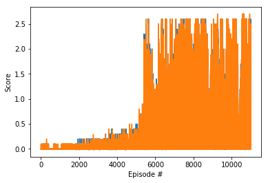

[//]: # (Image References)

[image1]: https://user-images.githubusercontent.com/10624937/42135623-e770e354-7d12-11e8-998d-29fc74429ca2.gif "Trained Agent"
[image2]: https://user-images.githubusercontent.com/10624937/42135622-e55fb586-7d12-11e8-8a54-3c31da15a90a.gif "Soccer"


# Project 3: Collaboration and Competition

### Introduction

For this project, you will work with the [Tennis](https://github.com/Unity-Technologies/ml-agents/blob/master/docs/Learning-Environment-Examples.md#tennis) environment.

![Trained Agent][image1]

In this environment, two agents control rackets to bounce a ball over a net. If an agent hits the ball over the net, it receives a reward of +0.1.  If an agent lets a ball hit the ground or hits the ball out of bounds, it receives a reward of -0.01.  Thus, the goal of each agent is to keep the ball in play.

The observation space consists of 8 variables corresponding to the position and velocity of the ball and racket. Each agent receives its own, local observation.  Two continuous actions are available, corresponding to movement toward (or away from) the net, and jumping. 

The task is episodic, and in order to solve the environment, your agents must get an average score of +0.5 (over 100 consecutive episodes, after taking the maximum over both agents). Specifically,

- After each episode, we add up the rewards that each agent received (without discounting), to get a score for each agent. This yields 2 (potentially different) scores. We then take the maximum of these 2 scores.
- This yields a single **score** for each episode.

The environment is considered solved, when the average (over 100 episodes) of those **scores** is at least +0.5.

### Getting Started

1. Download the environment from one of the links below.  You need only select the environment that matches your operating system:
    - Linux: [click here](https://s3-us-west-1.amazonaws.com/udacity-drlnd/P3/Tennis/Tennis_Linux.zip)
    - Mac OSX: [click here](https://s3-us-west-1.amazonaws.com/udacity-drlnd/P3/Tennis/Tennis.app.zip)
    - Windows (32-bit): [click here](https://s3-us-west-1.amazonaws.com/udacity-drlnd/P3/Tennis/Tennis_Windows_x86.zip)
    - Windows (64-bit): [click here](https://s3-us-west-1.amazonaws.com/udacity-drlnd/P3/Tennis/Tennis_Windows_x86_64.zip)
    
    (_For Windows users_) Check out [this link](https://support.microsoft.com/en-us/help/827218/how-to-determine-whether-a-computer-is-running-a-32-bit-version-or-64) if you need help with determining if your computer is running a 32-bit version or 64-bit version of the Windows operating system.

    (_For AWS_) If you'd like to train the agent on AWS (and have not [enabled a virtual screen](https://github.com/Unity-Technologies/ml-agents/blob/master/docs/Training-on-Amazon-Web-Service.md)), then please use [this link](https://s3-us-west-1.amazonaws.com/udacity-drlnd/P3/Tennis/Tennis_Linux_NoVis.zip) to obtain the "headless" version of the environment.  You will **not** be able to watch the agent without enabling a virtual screen, but you will be able to train the agent.  (_To watch the agent, you should follow the instructions to [enable a virtual screen](https://github.com/Unity-Technologies/ml-agents/blob/master/docs/Training-on-Amazon-Web-Service.md), and then download the environment for the **Linux** operating system above._)

2. Place the file in the `p3_collab-compet/` folder, and unzip (or decompress) the file. 

3. Follow the instructions on the file `Tennis.ipynb`.

# My Own Implementation


# Collaboration and Competition

---

In this notebook, you will learn how to use the Unity ML-Agents environment for the third project of the [Deep Reinforcement Learning Nanodegree](https://www.udacity.com/course/deep-reinforcement-learning-nanodegree--nd893) program.

### 1. Start the Environment

We begin by importing the necessary packages.  If the code cell below returns an error, please revisit the project instructions to double-check that you have installed [Unity ML-Agents](https://github.com/Unity-Technologies/ml-agents/blob/master/docs/Installation.md) and [NumPy](http://www.numpy.org/).


```python
from unityagents import UnityEnvironment
import numpy as np
```

Next, we will start the environment!  **_Before running the code cell below_**, change the `file_name` parameter to match the location of the Unity environment that you downloaded.

- **Mac**: `"path/to/Tennis.app"`
- **Windows** (x86): `"path/to/Tennis_Windows_x86/Tennis.exe"`
- **Windows** (x86_64): `"path/to/Tennis_Windows_x86_64/Tennis.exe"`
- **Linux** (x86): `"path/to/Tennis_Linux/Tennis.x86"`
- **Linux** (x86_64): `"path/to/Tennis_Linux/Tennis.x86_64"`
- **Linux** (x86, headless): `"path/to/Tennis_Linux_NoVis/Tennis.x86"`
- **Linux** (x86_64, headless): `"path/to/Tennis_Linux_NoVis/Tennis.x86_64"`

For instance, if you are using a Mac, then you downloaded `Tennis.app`.  If this file is in the same folder as the notebook, then the line below should appear as follows:
```
env = UnityEnvironment(file_name="Tennis.app")
```


```python
env = UnityEnvironment(file_name="Tennis.exe")
```

    INFO:unityagents:
    'Academy' started successfully!
    Unity Academy name: Academy
            Number of Brains: 1
            Number of External Brains : 1
            Lesson number : 0
            Reset Parameters :
    		
    Unity brain name: TennisBrain
            Number of Visual Observations (per agent): 0
            Vector Observation space type: continuous
            Vector Observation space size (per agent): 8
            Number of stacked Vector Observation: 3
            Vector Action space type: continuous
            Vector Action space size (per agent): 2
            Vector Action descriptions: , 
    

Environments contain **_brains_** which are responsible for deciding the actions of their associated agents. Here we check for the first brain available, and set it as the default brain we will be controlling from Python.


```python
# get the default brain
brain_name = env.brain_names[0]
brain = env.brains[brain_name]
```

### 2. Examine the State and Action Spaces

In this environment, two agents control rackets to bounce a ball over a net. If an agent hits the ball over the net, it receives a reward of +0.1.  If an agent lets a ball hit the ground or hits the ball out of bounds, it receives a reward of -0.01.  Thus, the goal of each agent is to keep the ball in play.

The observation space consists of 8 variables corresponding to the position and velocity of the ball and racket. Two continuous actions are available, corresponding to movement toward (or away from) the net, and jumping. 

Run the code cell below to print some information about the environment.


```python
# reset the environment
env_info = env.reset(train_mode=True)[brain_name]

# number of agents 
num_agents = len(env_info.agents)
print('Number of agents:', num_agents)

# size of each action
action_size = brain.vector_action_space_size
print('Size of each action:', action_size)

# examine the state space 
states = env_info.vector_observations
state_size = states.shape[1]
print('There are {} agents. Each observes a state with length: {}'.format(states.shape[0], state_size))
print('The state for the first agent looks like:', states[0])
```

    Number of agents: 2
    Size of each action: 2
    There are 2 agents. Each observes a state with length: 24
    The state for the first agent looks like: [ 0.          0.          0.          0.          0.          0.
      0.          0.          0.          0.          0.          0.
      0.          0.          0.          0.         -6.65278625 -1.5
     -0.          0.          6.83172083  6.         -0.          0.        ]
    

### 3. Take Random Actions in the Environment

In the next code cell, you will learn how to use the Python API to control the agents and receive feedback from the environment.

Once this cell is executed, you will watch the agents' performance, if they select actions at random with each time step.  A window should pop up that allows you to observe the agents.

Of course, as part of the project, you'll have to change the code so that the agents are able to use their experiences to gradually choose better actions when interacting with the environment!


```python
for i in range(1, 600):                                      # play game for 5 episodes
    env_info = env.reset(train_mode=False)[brain_name]     # reset the environment    
    states = env_info.vector_observations                  # get the current state (for each agent)
    scores = np.zeros(num_agents)                          # initialize the score (for each agent)
    while True:
        actions = np.random.randn(num_agents, action_size) # select an action (for each agent)
        actions = np.clip(actions, -1, 1)                  # all actions between -1 and 1
        print(actions)
        actions[1][0] = -1
        env_info = env.step(actions)[brain_name]           # send all actions to tne environment
        next_states = env_info.vector_observations         # get next state (for each agent)
        rewards = env_info.rewards                         # get reward (for each agent)
        dones = env_info.local_done                        # see if episode finished
        scores += env_info.rewards                         # update the score (for each agent)
        states = next_states                               # roll over states to next time step
        if np.any(dones):                                  # exit loop if episode finished
            break
    print('Score (max over agents) from episode {}: {}'.format(i, np.max(scores)))
```

    
    

When finished, you can close the environment.


```python
env.close()
```

### 4. It's Your Turn!

Now it's your turn to train your own agent to solve the environment!  When training the environment, set `train_mode=True`, so that the line for resetting the environment looks like the following:
```python
env_info = env.reset(train_mode=True)[brain_name]
```


```python
import random
import torch
import numpy as np
from collections import deque
import matplotlib.pyplot as plt
%matplotlib inline
from maddpg_agent import Agent
agents = Agent(state_size=state_size, action_size=action_size, random_seed=2)
def ddpg(n_episodes=11000, max_t=10000, print_every=100):
    scores_deque = deque(maxlen=print_every)
    scores = []
    for i_episode in range(1, n_episodes+1):
        score = np.zeros(num_agents)
        env_info = env.reset(train_mode=True)[brain_name]
        states = env_info.vector_observations
        agents.reset()
        x=0
        for t in range(max_t):
            action = agents.act(states)
            env_info = env.step(action)[brain_name]
            next_states = env_info.vector_observations
            rewards = env_info.rewards
            score += rewards
            dones = env_info.local_done
            agents.step(states, action, rewards, next_states, dones)
            states = next_states
            if np.any(dones):
                break
        scores_deque.append(np.max(score))
        scores.append(score)
        if i_episode%print_every==0:
            print('\rEpisode {}\tAverage Score: {:.2f}'.format(i_episode, np.mean(scores_deque)), end="")
        torch.save(agents.actor_local1.state_dict(), 'checkpoint_actor1.pth')
        torch.save(agents.critic_local1.state_dict(), 'checkpoint_critic1.pth')
        torch.save(agents.actor_local2.state_dict(), 'checkpoint_actor2.pth')
        torch.save(agents.critic_local2.state_dict(), 'checkpoint_critic2.pth')
        if i_episode % print_every == 0:
            print('\rEpisode {}\tAverage Score: {:.2f}'.format(i_episode, np.mean(scores_deque)))
    return scores

scores = ddpg()

fig = plt.figure()
ax = fig.add_subplot(111)
plt.plot(np.arange(1, len(scores)+1), scores)
plt.ylabel('Score')
plt.xlabel('Episode #')
plt.show()
```

    Episode 100	Average Score: 0.01
    Episode 200	Average Score: 0.01
    Episode 300	Average Score: 0.01
    Episode 400	Average Score: 0.01
    Episode 500	Average Score: 0.00
    Episode 600	Average Score: 0.00
    Episode 700	Average Score: 0.01
    Episode 800	Average Score: 0.01
    Episode 900	Average Score: 0.01
    Episode 1000	Average Score: 0.00
    Episode 1100	Average Score: 0.01
    Episode 1200	Average Score: 0.02
    Episode 1300	Average Score: 0.02
    Episode 1400	Average Score: 0.02
    Episode 1500	Average Score: 0.03
    Episode 1600	Average Score: 0.03
    Episode 1700	Average Score: 0.04
    Episode 1800	Average Score: 0.04
    Episode 1900	Average Score: 0.05
    Episode 2000	Average Score: 0.05
    Episode 2100	Average Score: 0.05
    Episode 2200	Average Score: 0.06
    Episode 2300	Average Score: 0.05
    Episode 2400	Average Score: 0.05
    Episode 2500	Average Score: 0.06
    Episode 2600	Average Score: 0.06
    Episode 2700	Average Score: 0.06
    Episode 2800	Average Score: 0.04
    Episode 2900	Average Score: 0.05
    Episode 3000	Average Score: 0.05
    Episode 3100	Average Score: 0.05
    Episode 3200	Average Score: 0.04
    Episode 3300	Average Score: 0.06
    Episode 3400	Average Score: 0.06
    Episode 3500	Average Score: 0.06
    Episode 3600	Average Score: 0.05
    Episode 3700	Average Score: 0.06
    Episode 3800	Average Score: 0.09
    Episode 3900	Average Score: 0.07
    Episode 4000	Average Score: 0.07
    Episode 4100	Average Score: 0.08
    Episode 4200	Average Score: 0.08
    Episode 4300	Average Score: 0.09
    Episode 4400	Average Score: 0.09
    Episode 4500	Average Score: 0.10
    Episode 4600	Average Score: 0.09
    Episode 4700	Average Score: 0.11
    Episode 4800	Average Score: 0.11
    Episode 4900	Average Score: 0.11
    Episode 5000	Average Score: 0.13
    Episode 5100	Average Score: 0.12
    Episode 5200	Average Score: 0.16
    Episode 5300	Average Score: 0.18
    Episode 5400	Average Score: 0.22
    Episode 5500	Average Score: 0.30
    Episode 5600	Average Score: 0.39
    Episode 5700	Average Score: 0.44
    Episode 5800	Average Score: 0.36
    Episode 5900	Average Score: 0.38
    Episode 6000	Average Score: 0.36
    Episode 6100	Average Score: 0.32
    Episode 6200	Average Score: 0.42
    Episode 6300	Average Score: 0.32
    Episode 6400	Average Score: 0.45
    Episode 6500	Average Score: 0.51
    Episode 6600	Average Score: 0.54
    Episode 6700	Average Score: 0.50
    Episode 6800	Average Score: 0.47
    Episode 6900	Average Score: 0.52
    Episode 7000	Average Score: 0.42
    Episode 7100	Average Score: 0.43
    Episode 7200	Average Score: 0.49
    Episode 7300	Average Score: 0.60
    Episode 7400	Average Score: 0.67
    Episode 7500	Average Score: 0.78
    Episode 7600	Average Score: 0.69
    Episode 7700	Average Score: 0.72
    Episode 7800	Average Score: 0.59
    Episode 7900	Average Score: 0.67
    Episode 8000	Average Score: 0.61
    Episode 8100	Average Score: 0.60
    Episode 8200	Average Score: 0.77
    Episode 8300	Average Score: 0.70
    Episode 8400	Average Score: 0.58
    Episode 8500	Average Score: 0.79
    Episode 8600	Average Score: 0.79
    Episode 8700	Average Score: 0.66
    Episode 8800	Average Score: 0.48
    Episode 8900	Average Score: 0.41
    Episode 9000	Average Score: 0.49
    Episode 9100	Average Score: 0.52
    Episode 9200	Average Score: 0.59
    Episode 9300	Average Score: 0.63
    Episode 9400	Average Score: 0.59
    Episode 9500	Average Score: 0.63
    Episode 9600	Average Score: 0.41
    Episode 9700	Average Score: 0.42
    Episode 9800	Average Score: 0.68
    Episode 9900	Average Score: 0.58
    Episode 10000	Average Score: 0.58
    Episode 10100	Average Score: 0.66
    Episode 10200	Average Score: 0.62
    Episode 10300	Average Score: 0.52
    Episode 10400	Average Score: 0.36
    Episode 10500	Average Score: 0.40
    Episode 10600	Average Score: 0.76
    Episode 10700	Average Score: 1.01
    Episode 10800	Average Score: 0.80
    Episode 10900	Average Score: 0.62
    Episode 11000	Average Score: 0.70
    





```python
import torch
from maddpg_agent import Agent
agents = Agent(state_size, action_size, random_seed=2)
agents.actor_local1.load_state_dict(torch.load('checkpoint_actor1.pth'))
agents.critic_local1.load_state_dict(torch.load('checkpoint_critic1.pth'))
agents.actor_local2.load_state_dict(torch.load('checkpoint_actor2.pth'))
agents.critic_local2.load_state_dict(torch.load('checkpoint_critic2.pth'))
for i in range(1, 20):
    scores = np.zeros(num_agents)
    env_info = env.reset(train_mode=False)[brain_name]
    state = env_info.vector_observations
    while True:
        action = agents.act(state)
        env_info = env.step(action)[brain_name]
        next_state = env_info.vector_observations
        reward = env_info.rewards
        done = env_info.local_done
        scores += env_info.rewards
        state = next_state
        if np.any(done):
            break 

    print('Total score (averaged over agents) this episode: {}'.format(np.mean(scores)))
```

    Total score (averaged over agents) this episode: 0.4950000075623393
    Total score (averaged over agents) this episode: 1.145000017248094
    Total score (averaged over agents) this episode: -0.004999999888241291
    Total score (averaged over agents) this episode: 0.7450000112876296
    Total score (averaged over agents) this episode: 0.1450000023469329
    Total score (averaged over agents) this episode: 0.09500000160187483
    Total score (averaged over agents) this episode: 0.245000003837049
    Total score (averaged over agents) this episode: 0.9950000150129199
    Total score (averaged over agents) this episode: 0.7450000112876296
    Total score (averaged over agents) this episode: 0.29500000458210707
    Total score (averaged over agents) this episode: 0.44500000681728125
    Total score (averaged over agents) this episode: 0.6450000097975135
    Total score (averaged over agents) this episode: 0.09500000160187483
    Total score (averaged over agents) this episode: 2.1950000328943133
    Total score (averaged over agents) this episode: 0.09500000160187483
    Total score (averaged over agents) this episode: 0.8950000135228038
    Total score (averaged over agents) this episode: 2.600000038743019
    Total score (averaged over agents) this episode: 2.5450000381097198
    Total score (averaged over agents) this episode: 0.04500000085681677
    


```python

```


```python

```


```python

```

You can also check out my YouTube video of my agents interacting in the environment with my trained weights if you prefer.

Click the following image to watch my **YouTube video**:

[](https://www.youtube.com/watch?v=FeU6pLBfB3k "")
