# Face Generation
In this project, you'll use generative adversarial networks to generate new images of faces.
### Get the Data
You'll be using two datasets in this project:
- MNIST
- CelebA

Since the celebA dataset is complex and you're doing GANs in a project for the first time, we want you to test your neural network on MNIST before CelebA.  Running the GANs on MNIST will allow you to see how well your model trains sooner.

If you're using [FloydHub](https://www.floydhub.com/), set `data_dir` to "/input" and use the [FloydHub data ID](http://docs.floydhub.com/home/using_datasets/) "R5KrjnANiKVhLWAkpXhNBe".


```python
data_dir = './data'

# FloydHub - Use with data ID "R5KrjnANiKVhLWAkpXhNBe"
#data_dir = '/input'


"""
DON'T MODIFY ANYTHING IN THIS CELL
"""
import helper

helper.download_extract('mnist', data_dir)
helper.download_extract('celeba', data_dir)
```

    Found mnist Data
    Found celeba Data


## Explore the Data
### MNIST
As you're aware, the [MNIST](http://yann.lecun.com/exdb/mnist/) dataset contains images of handwritten digits. You can view the first number of examples by changing `show_n_images`. 


```python
show_n_images = 25

"""
DON'T MODIFY ANYTHING IN THIS CELL
"""
%matplotlib inline
import os
from glob import glob
from matplotlib import pyplot

mnist_images = helper.get_batch(glob(os.path.join(data_dir, 'mnist/*.jpg'))[:show_n_images], 28, 28, 'L')
pyplot.imshow(helper.images_square_grid(mnist_images, 'L'), cmap='gray')
```


    <matplotlib.image.AxesImage at 0x7fb7cbfd57f0>


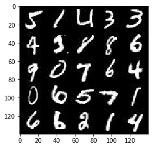


### CelebA
The [CelebFaces Attributes Dataset (CelebA)](http://mmlab.ie.cuhk.edu.hk/projects/CelebA.html) dataset contains over 200,000 celebrity images with annotations.  Since you're going to be generating faces, you won't need the annotations.  You can view the first number of examples by changing `show_n_images`.


```python
show_n_images = 9

"""
DON'T MODIFY ANYTHING IN THIS CELL
"""
mnist_images = helper.get_batch(glob(os.path.join(data_dir, 'img_align_celeba/*.jpg'))[:show_n_images], 28, 28, 'RGB')

pyplot.imshow(helper.images_square_grid(mnist_images, 'RGB'))
```


    <matplotlib.image.AxesImage at 0x7fb7a00afda0>


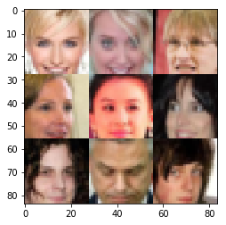


## Preprocess the Data
Since the project's main focus is on building the GANs, we'll preprocess the data for you.  The values of the MNIST and CelebA dataset will be in the range of -0.5 to 0.5 of 28x28 dimensional images.  The CelebA images will be cropped to remove parts of the image that don't include a face, then resized down to 28x28.

The MNIST images are black and white images with a single [color channel](https://en.wikipedia.org/wiki/Channel_(digital_image%29) while the CelebA images have [3 color channels (RGB color channel)](https://en.wikipedia.org/wiki/Channel_(digital_image%29#RGB_Images).
## Build the Neural Network
You'll build the components necessary to build a GANs by implementing the following functions below:
- `model_inputs`
- `discriminator`
- `generator`
- `model_loss`
- `model_opt`
- `train`

### Check the Version of TensorFlow and Access to GPU
This will check to make sure you have the correct version of TensorFlow and access to a GPU


```python
"""
DON'T MODIFY ANYTHING IN THIS CELL
"""
from distutils.version import LooseVersion
import warnings
import tensorflow as tf

# Check TensorFlow Version
assert LooseVersion(tf.__version__) >= LooseVersion('1.0'), 'Please use TensorFlow version 1.0 or newer.  You are using {}'.format(tf.__version__)
print('TensorFlow Version: {}'.format(tf.__version__))

# Check for a GPU
if not tf.test.gpu_device_name():
    warnings.warn('No GPU found. Please use a GPU to train your neural network.')
else:
    print('Default GPU Device: {}'.format(tf.test.gpu_device_name()))
```

    TensorFlow Version: 1.12.0


    /home/kenneth/miniconda3/envs/GAN/lib/python3.6/site-packages/ipykernel_launcher.py:14: UserWarning: No GPU found. Please use a GPU to train your neural network.
      


### Input
Implement the `model_inputs` function to create TF Placeholders for the Neural Network. It should create the following placeholders:
- Real input images placeholder with rank 4 using `image_width`, `image_height`, and `image_channels`.
- Z input placeholder with rank 2 using `z_dim`.
- Learning rate placeholder with rank 0.

Return the placeholders in the following the tuple (tensor of real input images, tensor of z data)


```python
import problem_unittests as tests

def model_inputs(image_width, image_height, image_channels, z_dim):
    inputs_real = tf.placeholder(tf.float32, (None, image_width,image_height,image_channels), name='input_real')
    inputs_z = tf.placeholder(tf.float32, (None, z_dim), name='input_z')
    learning_rate = tf.placeholder(tf.float32, None, name='learning_rate')
    return inputs_real, inputs_z, learning_rate


"""
DON'T MODIFY ANYTHING IN THIS CELL THAT IS BELOW THIS LINE
"""
tests.test_model_inputs(model_inputs)
```

    Tests Passed


### Discriminator
Implement `discriminator` to create a discriminator neural network that discriminates on `images`.  This function should be able to reuse the variables in the neural network.  Use [`tf.variable_scope`](https://www.tensorflow.org/api_docs/python/tf/variable_scope) with a scope name of "discriminator" to allow the variables to be reused.  The function should return a tuple of (tensor output of the discriminator, tensor logits of the discriminator).


```python
def discriminator(images, reuse=False):
    """
    Create the discriminator network
    :param images: Tensor of input image(s)
    :param reuse: Boolean if the weights should be reused
    :return: Tuple of (tensor output of the discriminator, tensor logits of the discriminator)
    """
    # TODO: Implement Function
    with tf.variable_scope('discriminator', reuse=reuse):
        # Input layer is 28x28x3
        x1 = tf.layers.conv2d(images, 64, 5, strides=2, padding='same',kernel_initializer=tf.contrib.layers.xavier_initializer_conv2d())
        relu1 = tf.maximum(0.15 * x1, x1)
        # 14x14x64
        drop_out1 = tf.nn.dropout(relu1, 0.8)
        x2 = tf.layers.conv2d(drop_out1, 128, 5, strides=2, padding='same')
        bn2 = tf.layers.batch_normalization(x2, training=True)
        relu2 = tf.maximum(0.15 * bn2, bn2)
        # 7x7x128
        drop_out2 = tf.nn.dropout(relu2, 0.8)
        x3 = tf.layers.conv2d(drop_out2, 128, 5, strides=1, padding='same')
        bn3 = tf.layers.batch_normalization(x3, training=True)
        relu3 = tf.maximum(0.15 * bn3, bn3)
        # 7x7x256
        # Flatten it
        flat = tf.reshape(relu3, (-1, 7*7*256))
        logits = tf.layers.dense(flat, 1)
        out = tf.sigmoid(logits)
        
        return out, logits
    #return None, None


"""
DON'T MODIFY ANYTHING IN THIS CELL THAT IS BELOW THIS LINE
"""
tests.test_discriminator(discriminator, tf)
```

    ERROR:tensorflow:==================================
    Object was never used (type <class 'tensorflow.python.framework.ops.Operation'>):
    <tf.Operation 'assert_rank_2/Assert/Assert' type=Assert>
    If you want to mark it as used call its "mark_used()" method.
    It was originally created here:
      File "/home/kenneth/miniconda3/envs/GAN/lib/python3.6/site-packages/IPython/core/interactiveshell.py", line 3287, in run_code
        return outflag  File "<ipython-input-5-d727d1caa076>", line 13, in <module>
        tests.test_model_inputs(model_inputs)  File "/home/kenneth/Artificial-Intelligence/Generative Adversarial Network - Face Generation/problem_unittests.py", line 14, in func_wrapper
        return result  File "/home/kenneth/Artificial-Intelligence/Generative Adversarial Network - Face Generation/problem_unittests.py", line 68, in test_model_inputs
        _check_input(learn_rate, [], 'Learning Rate')  File "/home/kenneth/Artificial-Intelligence/Generative Adversarial Network - Face Generation/problem_unittests.py", line 38, in _check_input
        '{} has bad name.  Found name {}'.format(display_name, tensor.name)  File "/home/kenneth/Artificial-Intelligence/Generative Adversarial Network - Face Generation/problem_unittests.py", line 27, in _assert_tensor_shape
        '{} has wrong shape.  Found {}'.format(display_name, tensor_shape)  File "/home/kenneth/miniconda3/envs/GAN/lib/python3.6/site-packages/tensorflow/python/ops/check_ops.py", line 827, in assert_rank
        return assert_op  File "/home/kenneth/miniconda3/envs/GAN/lib/python3.6/site-packages/tensorflow/python/ops/check_ops.py", line 765, in _assert_rank_condition
        return control_flow_ops.Assert(condition, data, summarize=summarize)  File "/home/kenneth/miniconda3/envs/GAN/lib/python3.6/site-packages/tensorflow/python/util/tf_should_use.py", line 189, in wrapped
        return _add_should_use_warning(fn(*args, **kwargs))
    ==================================
    Tests Passed


### Generator
Implement `generator` to generate an image using `z`. This function should be able to reuse the variables in the neural network.  Use [`tf.variable_scope`](https://www.tensorflow.org/api_docs/python/tf/variable_scope) with a scope name of "generator" to allow the variables to be reused. The function should return the generated 28 x 28 x `out_channel_dim` images.


```python
def generator(z, out_channel_dim, is_train=True):
    """
    Create the generator network
    :param z: Input z
    :param out_channel_dim: The number of channels in the output image
    :param is_train: Boolean if generator is being used for training
    :return: The tensor output of the generator
    """
    # TODO: Implement Function
    with tf.variable_scope('generator',reuse=not is_train):
        # First fully connected layer
        x1 = tf.layers.dense(z, 7*7*1024,kernel_initializer=tf.contrib.layers.xavier_initializer_conv2d())
        #print(z)
        # Reshape it to start the convolutional stack
        x1 = tf.reshape(x1, (-1, 7, 7, 1024))
        x1 = tf.layers.batch_normalization(x1, training=is_train)
        x1 = tf.maximum(0.15 * x1, x1)
        # 4x4x512 now
        #print(x1)
        x2 = tf.layers.conv2d_transpose(x1, 512, 5, strides=2, padding='same')
        x2 = tf.layers.batch_normalization(x2, training=is_train)
        x2 = tf.maximum(0.15 * x2, x2)
        x2 = tf.nn.dropout(x2, 0.8)
        # 8x8x256 now
        x3 = tf.layers.conv2d_transpose(x2, 256, 5, strides=2, padding='same')
        x3 = tf.layers.batch_normalization(x3, training=is_train)
        x3 = tf.maximum(0.15 * x3, x3)
        x3 = tf.nn.dropout(x3, 0.8)
        x4 = tf.layers.conv2d_transpose(x3, 128, 5, strides=1, padding='same')
        x4 = tf.layers.batch_normalization(x4, training=is_train)
        x4 = tf.maximum(0.15 * x4, x4)
        x4 = tf.nn.dropout(x4, 0.8)
        # 16x16x128 now
        #x4 = tf.layers.conv2d_transpose(x3, 128, 5, strides=2, padding='same')
        # Output layer
        logits = tf.layers.conv2d_transpose(x4, out_channel_dim, 5, strides=1, padding='same')
        # 32x32x3 now
        out = tf.tanh(logits)
        
        return out
    #return None


"""
DON'T MODIFY ANYTHING IN THIS CELL THAT IS BELOW THIS LINE
"""
tests.test_generator(generator, tf)
```

    Tests Passed


### Loss
Implement `model_loss` to build the GANs for training and calculate the loss.  The function should return a tuple of (discriminator loss, generator loss).  Use the following functions you implemented:
- `discriminator(images, reuse=False)`
- `generator(z, out_channel_dim, is_train=True)`


```python
def model_loss(input_real, input_z, out_channel_dim):
    """
    Get the loss for the discriminator and generator
    :param input_real: Images from the real dataset
    :param input_z: Z input
    :param out_channel_dim: The number of channels in the output image
    :return: A tuple of (discriminator loss, generator loss)
    """
    # TODO: Implement Function
    g_model = generator(input_z, out_channel_dim)
    d_model_real, d_logits_real = discriminator(input_real)
    d_model_fake, d_logits_fake = discriminator(g_model, reuse=True)

    d_loss_real = tf.reduce_mean(
        tf.nn.sigmoid_cross_entropy_with_logits(logits=d_logits_real, labels=tf.ones_like(d_model_real)*(1-0.1)))
    d_loss_fake = tf.reduce_mean(
        tf.nn.sigmoid_cross_entropy_with_logits(logits=d_logits_fake, labels=tf.zeros_like(d_model_fake)))
    g_loss = tf.reduce_mean(
        tf.nn.sigmoid_cross_entropy_with_logits(logits=d_logits_fake, labels=tf.ones_like(d_model_fake)))

    d_loss = d_loss_real + d_loss_fake

    return d_loss, g_loss
    #return None, None


"""
DON'T MODIFY ANYTHING IN THIS CELL THAT IS BELOW THIS LINE
"""
tests.test_model_loss(model_loss)
```

    Tests Passed


### Optimization
Implement `model_opt` to create the optimization operations for the GANs. Use [`tf.trainable_variables`](https://www.tensorflow.org/api_docs/python/tf/trainable_variables) to get all the trainable variables.  Filter the variables with names that are in the discriminator and generator scope names.  The function should return a tuple of (discriminator training operation, generator training operation).


```python
def model_opt(d_loss, g_loss, learning_rate, beta1):
    """
    Get optimization operations
    :param d_loss: Discriminator loss Tensor
    :param g_loss: Generator loss Tensor
    :param learning_rate: Learning Rate Placeholder
    :param beta1: The exponential decay rate for the 1st moment in the optimizer
    :return: A tuple of (discriminator training operation, generator training operation)
    """
    # TODO: Implement Function
    t_vars = tf.trainable_variables()
    d_vars = [var for var in t_vars if var.name.startswith('discriminator')]
    g_vars = [var for var in t_vars if var.name.startswith('generator')]

    # Optimize
    with tf.control_dependencies(tf.get_collection(tf.GraphKeys.UPDATE_OPS)):
        d_train_opt = tf.train.AdamOptimizer(learning_rate, beta1=beta1).minimize(d_loss, var_list=d_vars)
        g_train_opt = tf.train.AdamOptimizer(learning_rate, beta1=beta1).minimize(g_loss, var_list=g_vars)

    return d_train_opt, g_train_opt
    #return None, None


"""
DON'T MODIFY ANYTHING IN THIS CELL THAT IS BELOW THIS LINE
"""
tests.test_model_opt(model_opt, tf)
```

    Tests Passed


## Neural Network Training
### Show Output
Use this function to show the current output of the generator during training. It will help you determine how well the GANs is training.


```python
"""
DON'T MODIFY ANYTHING IN THIS CELL
"""
import numpy as np

def show_generator_output(sess, n_images, input_z, out_channel_dim, image_mode):
    """
    Show example output for the generator
    :param sess: TensorFlow session
    :param n_images: Number of Images to display
    :param input_z: Input Z Tensor
    :param out_channel_dim: The number of channels in the output image
    :param image_mode: The mode to use for images ("RGB" or "L")
    """
    cmap = None if image_mode == 'RGB' else 'gray'
    z_dim = input_z.get_shape().as_list()[-1]
    example_z = np.random.uniform(-1, 1, size=[n_images, z_dim])

    samples = sess.run(
        generator(input_z, out_channel_dim, False),
        feed_dict={input_z: example_z})

    images_grid = helper.images_square_grid(samples, image_mode)
    pyplot.imshow(images_grid, cmap=cmap)
    pyplot.show()
```

### Train
Implement `train` to build and train the GANs.  Use the following functions you implemented:
- `model_inputs(image_width, image_height, image_channels, z_dim)`
- `model_loss(input_real, input_z, out_channel_dim)`
- `model_opt(d_loss, g_loss, learning_rate, beta1)`

Use the `show_generator_output` to show `generator` output while you train. Running `show_generator_output` for every batch will drastically increase training time and increase the size of the notebook.  It's recommended to print the `generator` output every 100 batches.


```python
def train(epoch_count, batch_size, z_dim, learning_rate, beta1, get_batches, data_shape, data_image_mode):
    """
    Train the GAN
    :param epoch_count: Number of epochs
    :param batch_size: Batch Size
    :param z_dim: Z dimension
    :param learning_rate: Learning Rate
    :param beta1: The exponential decay rate for the 1st moment in the optimizer
    :param get_batches: Function to get batches
    :param data_shape: Shape of the data
    :param data_image_mode: The image mode to use for images ("RGB" or "L")
    """
    #saver = tf.train.Saver()
    inputs_real, inputs_z, learning_r = model_inputs(data_shape[1],data_shape[2],data_shape[3],z_dim)
    d_loss, g_loss = model_loss(inputs_real,inputs_z,data_shape[3])
    d_train_opt, g_train_opt = model_opt(d_loss, g_loss, learning_r, beta1)
    sample_z = np.random.uniform(-1, 1, size=(72, z_dim))
    print_every = 5 #Print every 5 batches
    show_every = 100
    samples, losses = [], []
    steps = 0
    with tf.Session() as sess:
        sess.run(tf.global_variables_initializer())
        for epoch_i in range(epoch_count):
            for batch_images in get_batches(batch_size):
                # TODO: Train Model
                steps += 1
                batch_z = np.random.uniform(-1, 1, size=(batch_size, z_dim))
                #print(batch_images)
                # Run optimizers
                _ = sess.run(d_train_opt, feed_dict={inputs_real: batch_images*2, inputs_z: batch_z,learning_r: learning_rate})
                _ = sess.run(g_train_opt, feed_dict={inputs_z: batch_z, inputs_real: batch_images*2,learning_r: learning_rate})
                _ = sess.run(g_train_opt, feed_dict={inputs_z: batch_z, inputs_real: batch_images*2,learning_r: learning_rate})
                if steps % print_every == 0:
                    # At the end of each epoch, get the losses and print them out
                    train_loss_d = d_loss.eval({inputs_z: batch_z, inputs_real: batch_images*2})
                    train_loss_g = g_loss.eval({inputs_z: batch_z})

                    print("Epoch {}/{}...".format(epoch_i+1, epoch_count),
                          "Discriminator Loss: {:.4f}...".format(train_loss_d),
                          "Generator Loss: {:.4f}".format(train_loss_g))
                    # Save losses to view after training
                    losses.append((train_loss_d, train_loss_g))

                if steps % show_every == 0:
                    show_generator_output(sess, 25, inputs_z, data_shape[3], data_image_mode)
       
    return losses, samples
```

### MNIST
Test your GANs architecture on MNIST.  After 2 epochs, the GANs should be able to generate images that look like handwritten digits.  Make sure the loss of the generator is lower than the loss of the discriminator or close to 0.


```python
batch_size = 32
z_dim = 200
learning_rate = 0.0005
beta1 = 0.4


"""
DON'T MODIFY ANYTHING IN THIS CELL THAT IS BELOW THIS LINE
"""
epochs = 2

mnist_dataset = helper.Dataset('mnist', glob(os.path.join(data_dir, 'mnist/*.jpg')))
with tf.Graph().as_default():
    train(epochs, batch_size, z_dim, learning_rate, beta1, mnist_dataset.get_batches,
          mnist_dataset.shape, mnist_dataset.image_mode)
```

    Epoch 1/2... Discriminator Loss: 0.8336... Generator Loss: 1.0806
    Epoch 1/2... Discriminator Loss: 1.2254... Generator Loss: 2.5555
    Epoch 1/2... Discriminator Loss: 0.8667... Generator Loss: 1.4135
    Epoch 1/2... Discriminator Loss: 4.0744... Generator Loss: 3.3294
    Epoch 1/2... Discriminator Loss: 2.5561... Generator Loss: 0.8450
    Epoch 1/2... Discriminator Loss: 3.0973... Generator Loss: 0.1392
    Epoch 1/2... Discriminator Loss: 3.4643... Generator Loss: 0.0909
    Epoch 1/2... Discriminator Loss: 3.0172... Generator Loss: 0.2288
    Epoch 1/2... Discriminator Loss: 2.3408... Generator Loss: 0.2574
    Epoch 1/2... Discriminator Loss: 3.4349... Generator Loss: 0.0627
    Epoch 1/2... Discriminator Loss: 3.3231... Generator Loss: 0.0813
    Epoch 1/2... Discriminator Loss: 2.5218... Generator Loss: 0.1951
    Epoch 1/2... Discriminator Loss: 2.2379... Generator Loss: 0.3329
    Epoch 1/2... Discriminator Loss: 2.8859... Generator Loss: 0.1500
    Epoch 1/2... Discriminator Loss: 2.2354... Generator Loss: 0.2509
    Epoch 1/2... Discriminator Loss: 2.3253... Generator Loss: 0.2341
    Epoch 1/2... Discriminator Loss: 2.1446... Generator Loss: 0.2931
    Epoch 1/2... Discriminator Loss: 2.2522... Generator Loss: 0.2449
    Epoch 1/2... Discriminator Loss: 2.5186... Generator Loss: 0.2989
    Epoch 1/2... Discriminator Loss: 2.6052... Generator Loss: 0.3947


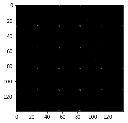


    Epoch 1/2... Discriminator Loss: 3.5549... Generator Loss: 0.0655
    Epoch 1/2... Discriminator Loss: 2.3631... Generator Loss: 0.2316
    Epoch 1/2... Discriminator Loss: 2.6600... Generator Loss: 0.2916
    Epoch 1/2... Discriminator Loss: 2.0612... Generator Loss: 0.4500
    Epoch 1/2... Discriminator Loss: 2.6640... Generator Loss: 0.1364
    Epoch 1/2... Discriminator Loss: 2.2366... Generator Loss: 0.4405
    Epoch 1/2... Discriminator Loss: 2.0460... Generator Loss: 0.3447
    Epoch 1/2... Discriminator Loss: 2.2283... Generator Loss: 0.9706
    Epoch 1/2... Discriminator Loss: 1.5961... Generator Loss: 0.7249
    Epoch 1/2... Discriminator Loss: 1.8360... Generator Loss: 0.4070
    Epoch 1/2... Discriminator Loss: 2.2117... Generator Loss: 0.2330
    Epoch 1/2... Discriminator Loss: 1.7774... Generator Loss: 0.8643
    Epoch 1/2... Discriminator Loss: 2.0495... Generator Loss: 0.3473
    Epoch 1/2... Discriminator Loss: 1.9062... Generator Loss: 0.3021
    Epoch 1/2... Discriminator Loss: 2.1428... Generator Loss: 0.2719
    Epoch 1/2... Discriminator Loss: 2.2051... Generator Loss: 0.2918
    Epoch 1/2... Discriminator Loss: 1.7948... Generator Loss: 0.4850
    Epoch 1/2... Discriminator Loss: 2.0407... Generator Loss: 0.2704
    Epoch 1/2... Discriminator Loss: 1.8772... Generator Loss: 0.5031
    Epoch 1/2... Discriminator Loss: 2.0256... Generator Loss: 0.6236


    Epoch 1/2... Discriminator Loss: 2.1153... Generator Loss: 0.2747
    Epoch 1/2... Discriminator Loss: 1.9985... Generator Loss: 0.2759
    Epoch 1/2... Discriminator Loss: 1.9384... Generator Loss: 0.4058
    Epoch 1/2... Discriminator Loss: 1.8373... Generator Loss: 0.4577
    Epoch 1/2... Discriminator Loss: 1.9480... Generator Loss: 0.5918
    Epoch 1/2... Discriminator Loss: 1.9659... Generator Loss: 0.2815
    Epoch 1/2... Discriminator Loss: 2.2326... Generator Loss: 0.2210
    Epoch 1/2... Discriminator Loss: 1.5678... Generator Loss: 0.3998
    Epoch 1/2... Discriminator Loss: 1.9914... Generator Loss: 0.3942


    ---------------------------------------------------------------------------

    KeyboardInterrupt                         Traceback (most recent call last)

    <ipython-input-12-9f06424ad316> in <module>
         13 with tf.Graph().as_default():
         14     train(epochs, batch_size, z_dim, learning_rate, beta1, mnist_dataset.get_batches,
    ---> 15           mnist_dataset.shape, mnist_dataset.image_mode)
    

    <ipython-input-11-e90ff3b254c8> in train(epoch_count, batch_size, z_dim, learning_rate, beta1, get_batches, data_shape, data_image_mode)
         31                 _ = sess.run(d_train_opt, feed_dict={inputs_real: batch_images*2, inputs_z: batch_z,learning_r: learning_rate})
         32                 _ = sess.run(g_train_opt, feed_dict={inputs_z: batch_z, inputs_real: batch_images*2,learning_r: learning_rate})
    ---> 33                 _ = sess.run(g_train_opt, feed_dict={inputs_z: batch_z, inputs_real: batch_images*2,learning_r: learning_rate})
         34                 if steps % print_every == 0:
         35                     # At the end of each epoch, get the losses and print them out


    ~/miniconda3/envs/GAN/lib/python3.6/site-packages/tensorflow/python/client/session.py in run(self, fetches, feed_dict, options, run_metadata)
        927     try:
        928       result = self._run(None, fetches, feed_dict, options_ptr,
    --> 929                          run_metadata_ptr)
        930       if run_metadata:
        931         proto_data = tf_session.TF_GetBuffer(run_metadata_ptr)


    ~/miniconda3/envs/GAN/lib/python3.6/site-packages/tensorflow/python/client/session.py in _run(self, handle, fetches, feed_dict, options, run_metadata)
       1150     if final_fetches or final_targets or (handle and feed_dict_tensor):
       1151       results = self._do_run(handle, final_targets, final_fetches,
    -> 1152                              feed_dict_tensor, options, run_metadata)
       1153     else:
       1154       results = []


    ~/miniconda3/envs/GAN/lib/python3.6/site-packages/tensorflow/python/client/session.py in _do_run(self, handle, target_list, fetch_list, feed_dict, options, run_metadata)
       1326     if handle is None:
       1327       return self._do_call(_run_fn, feeds, fetches, targets, options,
    -> 1328                            run_metadata)
       1329     else:
       1330       return self._do_call(_prun_fn, handle, feeds, fetches)


    ~/miniconda3/envs/GAN/lib/python3.6/site-packages/tensorflow/python/client/session.py in _do_call(self, fn, *args)
       1332   def _do_call(self, fn, *args):
       1333     try:
    -> 1334       return fn(*args)
       1335     except errors.OpError as e:
       1336       message = compat.as_text(e.message)


    ~/miniconda3/envs/GAN/lib/python3.6/site-packages/tensorflow/python/client/session.py in _run_fn(feed_dict, fetch_list, target_list, options, run_metadata)
       1317       self._extend_graph()
       1318       return self._call_tf_sessionrun(
    -> 1319           options, feed_dict, fetch_list, target_list, run_metadata)
       1320 
       1321     def _prun_fn(handle, feed_dict, fetch_list):


    ~/miniconda3/envs/GAN/lib/python3.6/site-packages/tensorflow/python/client/session.py in _call_tf_sessionrun(self, options, feed_dict, fetch_list, target_list, run_metadata)
       1405     return tf_session.TF_SessionRun_wrapper(
       1406         self._session, options, feed_dict, fetch_list, target_list,
    -> 1407         run_metadata)
       1408 
       1409   def _call_tf_sessionprun(self, handle, feed_dict, fetch_list):


    KeyboardInterrupt: 


### CelebA
Run your GANs on CelebA.  It will take around 20 minutes on the average GPU to run one epoch.  You can run the whole epoch or stop when it starts to generate realistic faces.


```python
batch_size = 32
z_dim = 200
learning_rate = 0.0002
beta1 = 0.4


"""
DON'T MODIFY ANYTHING IN THIS CELL THAT IS BELOW THIS LINE
"""
epochs = 4

celeba_dataset = helper.Dataset('celeba', glob(os.path.join(data_dir, 'img_align_celeba/*.jpg')))
with tf.Graph().as_default():
    train(epochs, batch_size, z_dim, learning_rate, beta1, celeba_dataset.get_batches,
          celeba_dataset.shape, celeba_dataset.image_mode)
```

    Epoch 1/4... Discriminator Loss: 2.2504... Generator Loss: 0.2686
    Epoch 1/4... Discriminator Loss: 1.4158... Generator Loss: 0.7093
    Epoch 1/4... Discriminator Loss: 3.7489... Generator Loss: 0.0509
    Epoch 1/4... Discriminator Loss: 2.5501... Generator Loss: 0.1603
    Epoch 1/4... Discriminator Loss: 2.8301... Generator Loss: 0.1184
    Epoch 1/4... Discriminator Loss: 2.3900... Generator Loss: 0.2138
    Epoch 1/4... Discriminator Loss: 1.9573... Generator Loss: 0.2737
    Epoch 1/4... Discriminator Loss: 2.1495... Generator Loss: 0.2647
    Epoch 1/4... Discriminator Loss: 2.3244... Generator Loss: 0.2250
    Epoch 1/4... Discriminator Loss: 1.4267... Generator Loss: 0.5204
    Epoch 1/4... Discriminator Loss: 2.0597... Generator Loss: 1.0957
    Epoch 1/4... Discriminator Loss: 1.6550... Generator Loss: 0.3978
    Epoch 1/4... Discriminator Loss: 1.6889... Generator Loss: 0.3215
    Epoch 1/4... Discriminator Loss: 2.0883... Generator Loss: 0.2515
    Epoch 1/4... Discriminator Loss: 1.8613... Generator Loss: 0.2699
    Epoch 1/4... Discriminator Loss: 2.0658... Generator Loss: 0.2093
    Epoch 1/4... Discriminator Loss: 2.4396... Generator Loss: 0.1924
    Epoch 1/4... Discriminator Loss: 2.1744... Generator Loss: 0.1547
    Epoch 1/4... Discriminator Loss: 1.9437... Generator Loss: 1.0047
    Epoch 1/4... Discriminator Loss: 1.6879... Generator Loss: 0.7221


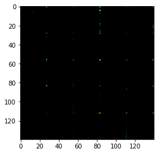


    Epoch 1/4... Discriminator Loss: 1.8644... Generator Loss: 0.6882
    Epoch 1/4... Discriminator Loss: 1.6503... Generator Loss: 0.6125
    Epoch 1/4... Discriminator Loss: 2.0340... Generator Loss: 0.4072
    Epoch 1/4... Discriminator Loss: 1.9490... Generator Loss: 0.2632
    Epoch 1/4... Discriminator Loss: 1.7908... Generator Loss: 0.4720
    Epoch 1/4... Discriminator Loss: 2.1007... Generator Loss: 0.3337
    Epoch 1/4... Discriminator Loss: 1.5864... Generator Loss: 0.5470
    Epoch 1/4... Discriminator Loss: 1.9166... Generator Loss: 0.3925
    Epoch 1/4... Discriminator Loss: 1.4572... Generator Loss: 0.4924
    Epoch 1/4... Discriminator Loss: 1.7576... Generator Loss: 0.5106
    Epoch 1/4... Discriminator Loss: 2.0332... Generator Loss: 0.3418
    Epoch 1/4... Discriminator Loss: 2.1082... Generator Loss: 0.3299
    Epoch 1/4... Discriminator Loss: 1.7390... Generator Loss: 0.5912
    Epoch 1/4... Discriminator Loss: 1.6070... Generator Loss: 0.6591
    Epoch 1/4... Discriminator Loss: 2.1274... Generator Loss: 0.2189
    Epoch 1/4... Discriminator Loss: 1.8253... Generator Loss: 0.7931
    Epoch 1/4... Discriminator Loss: 1.9054... Generator Loss: 0.3043
    Epoch 1/4... Discriminator Loss: 1.4723... Generator Loss: 0.6080
    Epoch 1/4... Discriminator Loss: 1.6943... Generator Loss: 0.5916
    Epoch 1/4... Discriminator Loss: 2.1273... Generator Loss: 0.2347


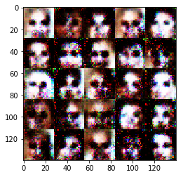


    Epoch 1/4... Discriminator Loss: 1.8413... Generator Loss: 0.3578
    Epoch 1/4... Discriminator Loss: 2.1718... Generator Loss: 0.7529
    Epoch 1/4... Discriminator Loss: 1.5065... Generator Loss: 0.7466
    Epoch 1/4... Discriminator Loss: 1.6589... Generator Loss: 0.5043
    Epoch 1/4... Discriminator Loss: 2.0035... Generator Loss: 0.3594
    Epoch 1/4... Discriminator Loss: 2.4304... Generator Loss: 1.0349
    Epoch 1/4... Discriminator Loss: 2.0567... Generator Loss: 0.9733
    Epoch 1/4... Discriminator Loss: 2.6107... Generator Loss: 0.2083
    Epoch 1/4... Discriminator Loss: 2.2506... Generator Loss: 0.4467
    Epoch 1/4... Discriminator Loss: 2.1480... Generator Loss: 0.3685
    Epoch 1/4... Discriminator Loss: 1.8058... Generator Loss: 0.7170
    Epoch 1/4... Discriminator Loss: 1.6250... Generator Loss: 0.6115
    Epoch 1/4... Discriminator Loss: 2.1234... Generator Loss: 0.4334
    Epoch 1/4... Discriminator Loss: 2.0127... Generator Loss: 0.2999
    Epoch 1/4... Discriminator Loss: 2.2803... Generator Loss: 0.3385
    Epoch 1/4... Discriminator Loss: 2.1577... Generator Loss: 0.4326
    Epoch 1/4... Discriminator Loss: 1.8228... Generator Loss: 0.6804
    Epoch 1/4... Discriminator Loss: 2.4462... Generator Loss: 0.1881
    Epoch 1/4... Discriminator Loss: 2.4086... Generator Loss: 0.5243
    Epoch 1/4... Discriminator Loss: 1.9700... Generator Loss: 0.3361


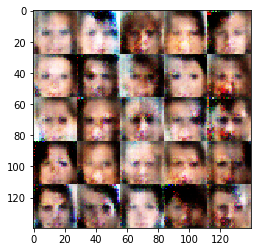


    Epoch 1/4... Discriminator Loss: 1.8666... Generator Loss: 0.6129
    Epoch 1/4... Discriminator Loss: 1.9815... Generator Loss: 0.2902
    Epoch 1/4... Discriminator Loss: 1.9385... Generator Loss: 0.4370
    Epoch 1/4... Discriminator Loss: 2.2516... Generator Loss: 0.6002
    Epoch 1/4... Discriminator Loss: 2.0150... Generator Loss: 0.4776
    Epoch 1/4... Discriminator Loss: 1.9849... Generator Loss: 0.4655
    Epoch 1/4... Discriminator Loss: 2.3263... Generator Loss: 0.3319
    Epoch 1/4... Discriminator Loss: 2.1566... Generator Loss: 0.3701
    Epoch 1/4... Discriminator Loss: 1.9518... Generator Loss: 0.4271
    Epoch 1/4... Discriminator Loss: 2.0249... Generator Loss: 0.2848
    Epoch 1/4... Discriminator Loss: 2.0935... Generator Loss: 0.3186
    Epoch 1/4... Discriminator Loss: 2.0650... Generator Loss: 0.2674
    Epoch 1/4... Discriminator Loss: 2.0335... Generator Loss: 0.4928
    Epoch 1/4... Discriminator Loss: 2.3150... Generator Loss: 0.2178
    Epoch 1/4... Discriminator Loss: 1.8897... Generator Loss: 0.4003
    Epoch 1/4... Discriminator Loss: 1.9316... Generator Loss: 0.3877
    Epoch 1/4... Discriminator Loss: 1.8669... Generator Loss: 0.4682
    Epoch 1/4... Discriminator Loss: 2.1358... Generator Loss: 0.2908
    Epoch 1/4... Discriminator Loss: 2.3268... Generator Loss: 0.2904
    Epoch 1/4... Discriminator Loss: 1.9178... Generator Loss: 0.5028


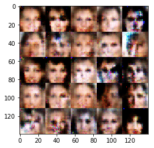


    Epoch 1/4... Discriminator Loss: 2.5126... Generator Loss: 0.2286
    Epoch 1/4... Discriminator Loss: 1.8904... Generator Loss: 0.3491
    Epoch 1/4... Discriminator Loss: 2.0142... Generator Loss: 0.4312
    Epoch 1/4... Discriminator Loss: 1.9992... Generator Loss: 0.4936
    Epoch 1/4... Discriminator Loss: 1.7817... Generator Loss: 0.4302
    Epoch 1/4... Discriminator Loss: 2.1485... Generator Loss: 0.2554
    Epoch 1/4... Discriminator Loss: 1.9588... Generator Loss: 0.3419
    Epoch 1/4... Discriminator Loss: 2.3201... Generator Loss: 0.4316
    Epoch 1/4... Discriminator Loss: 1.7974... Generator Loss: 0.5175
    Epoch 1/4... Discriminator Loss: 2.2415... Generator Loss: 0.3180
    Epoch 1/4... Discriminator Loss: 1.8158... Generator Loss: 0.6639
    Epoch 1/4... Discriminator Loss: 1.9103... Generator Loss: 0.3713
    Epoch 1/4... Discriminator Loss: 2.0676... Generator Loss: 0.3084
    Epoch 1/4... Discriminator Loss: 1.9670... Generator Loss: 0.3512
    Epoch 1/4... Discriminator Loss: 1.8206... Generator Loss: 0.5179
    Epoch 1/4... Discriminator Loss: 1.7893... Generator Loss: 0.4680
    Epoch 1/4... Discriminator Loss: 1.9977... Generator Loss: 0.3550
    Epoch 1/4... Discriminator Loss: 2.1733... Generator Loss: 0.2978
    Epoch 1/4... Discriminator Loss: 2.0055... Generator Loss: 0.3120
    Epoch 1/4... Discriminator Loss: 2.2749... Generator Loss: 0.3200


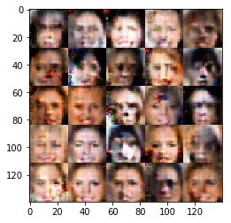


    Epoch 1/4... Discriminator Loss: 1.7404... Generator Loss: 0.3960
    Epoch 1/4... Discriminator Loss: 1.5707... Generator Loss: 0.7836
    Epoch 1/4... Discriminator Loss: 1.9575... Generator Loss: 0.3090
    Epoch 1/4... Discriminator Loss: 2.1588... Generator Loss: 0.3518
    Epoch 1/4... Discriminator Loss: 1.7397... Generator Loss: 0.4059
    Epoch 1/4... Discriminator Loss: 1.9794... Generator Loss: 0.3865
    Epoch 1/4... Discriminator Loss: 1.7340... Generator Loss: 0.5959
    Epoch 1/4... Discriminator Loss: 1.8667... Generator Loss: 0.3998
    Epoch 1/4... Discriminator Loss: 1.8994... Generator Loss: 0.3664
    Epoch 1/4... Discriminator Loss: 1.8448... Generator Loss: 0.4772
    Epoch 1/4... Discriminator Loss: 1.8053... Generator Loss: 0.4898
    Epoch 1/4... Discriminator Loss: 1.7466... Generator Loss: 0.5300
    Epoch 1/4... Discriminator Loss: 1.7274... Generator Loss: 0.6637
    Epoch 1/4... Discriminator Loss: 1.8784... Generator Loss: 0.6677
    Epoch 1/4... Discriminator Loss: 1.9910... Generator Loss: 0.3630
    Epoch 1/4... Discriminator Loss: 2.0359... Generator Loss: 0.6002
    Epoch 1/4... Discriminator Loss: 1.7000... Generator Loss: 0.5598
    Epoch 1/4... Discriminator Loss: 1.7865... Generator Loss: 0.5946
    Epoch 1/4... Discriminator Loss: 1.9528... Generator Loss: 0.3753
    Epoch 1/4... Discriminator Loss: 1.8367... Generator Loss: 0.5877


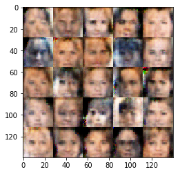


    Epoch 1/4... Discriminator Loss: 1.6289... Generator Loss: 0.6073
    Epoch 1/4... Discriminator Loss: 1.6584... Generator Loss: 0.5499
    Epoch 1/4... Discriminator Loss: 1.7331... Generator Loss: 0.4283
    Epoch 1/4... Discriminator Loss: 1.7695... Generator Loss: 0.4769
    Epoch 1/4... Discriminator Loss: 1.6646... Generator Loss: 0.6119
    Epoch 1/4... Discriminator Loss: 2.0175... Generator Loss: 0.3177
    Epoch 1/4... Discriminator Loss: 1.9407... Generator Loss: 0.7227
    Epoch 1/4... Discriminator Loss: 1.7565... Generator Loss: 0.5718
    Epoch 1/4... Discriminator Loss: 1.5789... Generator Loss: 0.4961
    Epoch 1/4... Discriminator Loss: 1.6004... Generator Loss: 0.5621
    Epoch 1/4... Discriminator Loss: 1.7137... Generator Loss: 0.6652
    Epoch 1/4... Discriminator Loss: 1.8016... Generator Loss: 0.5804
    Epoch 1/4... Discriminator Loss: 1.5381... Generator Loss: 0.5551
    Epoch 1/4... Discriminator Loss: 1.7958... Generator Loss: 0.4817
    Epoch 1/4... Discriminator Loss: 1.7834... Generator Loss: 0.4584
    Epoch 1/4... Discriminator Loss: 1.8133... Generator Loss: 0.4896
    Epoch 1/4... Discriminator Loss: 1.7302... Generator Loss: 0.6634
    Epoch 1/4... Discriminator Loss: 1.7015... Generator Loss: 0.4489
    Epoch 1/4... Discriminator Loss: 1.7363... Generator Loss: 0.4798
    Epoch 1/4... Discriminator Loss: 1.9851... Generator Loss: 0.3178


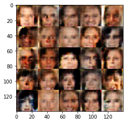


    Epoch 1/4... Discriminator Loss: 1.8970... Generator Loss: 0.4610
    Epoch 1/4... Discriminator Loss: 1.9159... Generator Loss: 0.4198
    Epoch 1/4... Discriminator Loss: 1.8293... Generator Loss: 0.4227
    Epoch 1/4... Discriminator Loss: 1.7156... Generator Loss: 0.4776
    Epoch 1/4... Discriminator Loss: 1.7535... Generator Loss: 0.5785
    Epoch 1/4... Discriminator Loss: 1.6435... Generator Loss: 0.5528
    Epoch 1/4... Discriminator Loss: 1.8000... Generator Loss: 0.3964
    Epoch 1/4... Discriminator Loss: 1.8818... Generator Loss: 0.5232
    Epoch 1/4... Discriminator Loss: 1.6756... Generator Loss: 0.5612
    Epoch 1/4... Discriminator Loss: 1.8793... Generator Loss: 0.4366
    Epoch 1/4... Discriminator Loss: 1.7688... Generator Loss: 0.5608
    Epoch 1/4... Discriminator Loss: 1.9772... Generator Loss: 0.4104
    Epoch 1/4... Discriminator Loss: 1.5922... Generator Loss: 0.4895
    Epoch 1/4... Discriminator Loss: 1.6851... Generator Loss: 0.5636
    Epoch 1/4... Discriminator Loss: 1.8275... Generator Loss: 0.5838
    Epoch 1/4... Discriminator Loss: 1.6858... Generator Loss: 0.5574
    Epoch 1/4... Discriminator Loss: 1.6334... Generator Loss: 0.5429
    Epoch 1/4... Discriminator Loss: 1.8231... Generator Loss: 0.4631
    Epoch 1/4... Discriminator Loss: 1.7379... Generator Loss: 0.5668
    Epoch 1/4... Discriminator Loss: 1.7800... Generator Loss: 0.3546


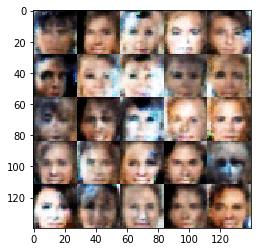


    Epoch 1/4... Discriminator Loss: 1.7048... Generator Loss: 0.5408
    Epoch 1/4... Discriminator Loss: 1.8666... Generator Loss: 0.4414
    Epoch 1/4... Discriminator Loss: 1.6228... Generator Loss: 0.4433
    Epoch 1/4... Discriminator Loss: 1.9349... Generator Loss: 0.3929
    Epoch 1/4... Discriminator Loss: 1.6459... Generator Loss: 0.4931
    Epoch 1/4... Discriminator Loss: 1.5486... Generator Loss: 0.5237
    Epoch 1/4... Discriminator Loss: 1.9597... Generator Loss: 0.4444
    Epoch 1/4... Discriminator Loss: 1.4858... Generator Loss: 0.5687
    Epoch 1/4... Discriminator Loss: 1.8104... Generator Loss: 0.6121
    Epoch 1/4... Discriminator Loss: 1.6340... Generator Loss: 0.5870
    Epoch 1/4... Discriminator Loss: 1.6612... Generator Loss: 0.5357
    Epoch 1/4... Discriminator Loss: 1.5913... Generator Loss: 0.5289
    Epoch 1/4... Discriminator Loss: 1.6769... Generator Loss: 0.4912
    Epoch 1/4... Discriminator Loss: 1.6715... Generator Loss: 0.5093
    Epoch 1/4... Discriminator Loss: 1.6451... Generator Loss: 0.5851
    Epoch 1/4... Discriminator Loss: 1.7989... Generator Loss: 0.4696
    Epoch 1/4... Discriminator Loss: 1.6712... Generator Loss: 0.5063
    Epoch 1/4... Discriminator Loss: 1.8913... Generator Loss: 0.4975
    Epoch 1/4... Discriminator Loss: 1.7518... Generator Loss: 0.4569
    Epoch 1/4... Discriminator Loss: 1.7757... Generator Loss: 0.5218


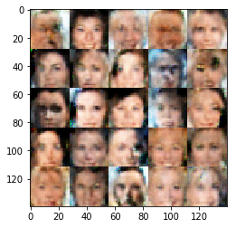


    Epoch 1/4... Discriminator Loss: 1.6992... Generator Loss: 0.5373
    Epoch 1/4... Discriminator Loss: 1.6136... Generator Loss: 0.5396
    Epoch 1/4... Discriminator Loss: 1.6853... Generator Loss: 0.5346
    Epoch 1/4... Discriminator Loss: 1.7297... Generator Loss: 0.6825
    Epoch 1/4... Discriminator Loss: 1.7001... Generator Loss: 0.4655
    Epoch 1/4... Discriminator Loss: 1.7581... Generator Loss: 0.6140
    Epoch 1/4... Discriminator Loss: 1.7645... Generator Loss: 0.5999
    Epoch 1/4... Discriminator Loss: 1.5534... Generator Loss: 0.6302
    Epoch 1/4... Discriminator Loss: 1.8597... Generator Loss: 0.4363
    Epoch 1/4... Discriminator Loss: 1.6578... Generator Loss: 0.5655
    Epoch 1/4... Discriminator Loss: 1.6240... Generator Loss: 0.5519
    Epoch 1/4... Discriminator Loss: 1.7564... Generator Loss: 0.4723
    Epoch 1/4... Discriminator Loss: 1.5175... Generator Loss: 0.6616
    Epoch 1/4... Discriminator Loss: 1.7136... Generator Loss: 0.5123
    Epoch 1/4... Discriminator Loss: 1.8092... Generator Loss: 0.4935
    Epoch 1/4... Discriminator Loss: 1.5861... Generator Loss: 0.6042
    Epoch 1/4... Discriminator Loss: 1.7358... Generator Loss: 0.4910
    Epoch 1/4... Discriminator Loss: 1.6687... Generator Loss: 0.6061
    Epoch 1/4... Discriminator Loss: 1.7460... Generator Loss: 0.5193
    Epoch 1/4... Discriminator Loss: 1.5514... Generator Loss: 0.6129


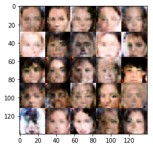


    Epoch 1/4... Discriminator Loss: 1.5940... Generator Loss: 0.6467
    Epoch 1/4... Discriminator Loss: 1.7620... Generator Loss: 0.4594
    Epoch 1/4... Discriminator Loss: 1.7342... Generator Loss: 0.5925
    Epoch 1/4... Discriminator Loss: 1.5563... Generator Loss: 0.5960
    Epoch 1/4... Discriminator Loss: 1.6004... Generator Loss: 0.6143
    Epoch 1/4... Discriminator Loss: 1.6733... Generator Loss: 0.4672
    Epoch 1/4... Discriminator Loss: 1.8883... Generator Loss: 0.4227
    Epoch 1/4... Discriminator Loss: 1.8522... Generator Loss: 0.4252
    Epoch 1/4... Discriminator Loss: 1.5978... Generator Loss: 0.5983
    Epoch 1/4... Discriminator Loss: 1.6411... Generator Loss: 0.5506
    Epoch 1/4... Discriminator Loss: 1.5908... Generator Loss: 0.6409
    Epoch 1/4... Discriminator Loss: 1.5881... Generator Loss: 0.5606
    Epoch 1/4... Discriminator Loss: 1.6568... Generator Loss: 0.4739
    Epoch 1/4... Discriminator Loss: 1.7478... Generator Loss: 0.5289
    Epoch 1/4... Discriminator Loss: 1.7292... Generator Loss: 0.5342
    Epoch 1/4... Discriminator Loss: 1.7916... Generator Loss: 0.4789
    Epoch 1/4... Discriminator Loss: 1.6893... Generator Loss: 0.5809
    Epoch 1/4... Discriminator Loss: 1.6782... Generator Loss: 0.5396
    Epoch 1/4... Discriminator Loss: 1.5615... Generator Loss: 0.5602
    Epoch 1/4... Discriminator Loss: 1.8280... Generator Loss: 0.5106


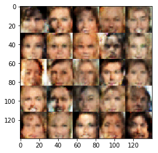


    Epoch 1/4... Discriminator Loss: 1.7094... Generator Loss: 0.5639
    Epoch 1/4... Discriminator Loss: 1.7718... Generator Loss: 0.4018
    Epoch 1/4... Discriminator Loss: 1.6278... Generator Loss: 0.6267
    Epoch 1/4... Discriminator Loss: 1.6192... Generator Loss: 0.5378
    Epoch 1/4... Discriminator Loss: 1.5858... Generator Loss: 0.6330
    Epoch 1/4... Discriminator Loss: 1.5665... Generator Loss: 0.5254
    Epoch 1/4... Discriminator Loss: 1.6984... Generator Loss: 0.5310
    Epoch 1/4... Discriminator Loss: 1.5918... Generator Loss: 0.6306
    Epoch 1/4... Discriminator Loss: 1.6105... Generator Loss: 0.5625
    Epoch 1/4... Discriminator Loss: 1.5857... Generator Loss: 0.5089
    Epoch 1/4... Discriminator Loss: 1.7509... Generator Loss: 0.5457
    Epoch 1/4... Discriminator Loss: 1.5551... Generator Loss: 0.6851
    Epoch 1/4... Discriminator Loss: 1.5998... Generator Loss: 0.4838
    Epoch 1/4... Discriminator Loss: 1.7031... Generator Loss: 0.5207
    Epoch 1/4... Discriminator Loss: 1.8860... Generator Loss: 0.4707
    Epoch 1/4... Discriminator Loss: 1.5196... Generator Loss: 0.5618
    Epoch 1/4... Discriminator Loss: 1.5687... Generator Loss: 0.6443
    Epoch 1/4... Discriminator Loss: 1.5936... Generator Loss: 0.6329
    Epoch 1/4... Discriminator Loss: 1.7228... Generator Loss: 0.6039
    Epoch 1/4... Discriminator Loss: 1.5525... Generator Loss: 0.6611


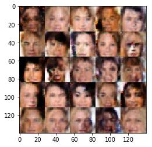


    Epoch 1/4... Discriminator Loss: 1.6025... Generator Loss: 0.7964
    Epoch 1/4... Discriminator Loss: 1.7565... Generator Loss: 0.5694
    Epoch 1/4... Discriminator Loss: 1.6365... Generator Loss: 0.5667
    Epoch 1/4... Discriminator Loss: 1.6004... Generator Loss: 0.5926
    Epoch 1/4... Discriminator Loss: 1.6132... Generator Loss: 0.5757
    Epoch 1/4... Discriminator Loss: 1.7970... Generator Loss: 0.5789
    Epoch 1/4... Discriminator Loss: 1.7660... Generator Loss: 0.4384
    Epoch 1/4... Discriminator Loss: 1.6604... Generator Loss: 0.6157
    Epoch 1/4... Discriminator Loss: 1.6318... Generator Loss: 0.5454
    Epoch 1/4... Discriminator Loss: 1.6850... Generator Loss: 0.4882
    Epoch 1/4... Discriminator Loss: 1.5943... Generator Loss: 0.6328
    Epoch 1/4... Discriminator Loss: 1.7105... Generator Loss: 0.5097
    Epoch 1/4... Discriminator Loss: 1.6715... Generator Loss: 0.5517
    Epoch 1/4... Discriminator Loss: 1.5498... Generator Loss: 0.6093
    Epoch 1/4... Discriminator Loss: 1.5750... Generator Loss: 0.6379
    Epoch 1/4... Discriminator Loss: 1.5754... Generator Loss: 0.5241
    Epoch 1/4... Discriminator Loss: 1.6615... Generator Loss: 0.5603
    Epoch 1/4... Discriminator Loss: 1.6016... Generator Loss: 0.6025
    Epoch 1/4... Discriminator Loss: 1.5653... Generator Loss: 0.6008
    Epoch 1/4... Discriminator Loss: 1.5441... Generator Loss: 0.4993


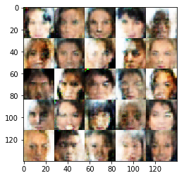


    Epoch 1/4... Discriminator Loss: 1.5505... Generator Loss: 0.6967
    Epoch 1/4... Discriminator Loss: 1.7471... Generator Loss: 0.5387
    Epoch 1/4... Discriminator Loss: 1.5587... Generator Loss: 0.6277
    Epoch 1/4... Discriminator Loss: 1.6217... Generator Loss: 0.5631
    Epoch 1/4... Discriminator Loss: 1.5679... Generator Loss: 0.6250
    Epoch 1/4... Discriminator Loss: 1.4744... Generator Loss: 0.6315
    Epoch 1/4... Discriminator Loss: 1.6370... Generator Loss: 0.6246
    Epoch 1/4... Discriminator Loss: 1.6086... Generator Loss: 0.5885
    Epoch 1/4... Discriminator Loss: 1.6126... Generator Loss: 0.6292
    Epoch 1/4... Discriminator Loss: 1.6468... Generator Loss: 0.6132
    Epoch 1/4... Discriminator Loss: 1.5356... Generator Loss: 0.5693
    Epoch 1/4... Discriminator Loss: 1.5784... Generator Loss: 0.6201
    Epoch 1/4... Discriminator Loss: 1.6976... Generator Loss: 0.4723
    Epoch 1/4... Discriminator Loss: 1.6182... Generator Loss: 0.5487
    Epoch 1/4... Discriminator Loss: 1.7590... Generator Loss: 0.5130
    Epoch 1/4... Discriminator Loss: 1.8797... Generator Loss: 0.4514
    Epoch 1/4... Discriminator Loss: 1.6910... Generator Loss: 0.5676
    Epoch 1/4... Discriminator Loss: 1.6221... Generator Loss: 0.6077
    Epoch 1/4... Discriminator Loss: 1.6867... Generator Loss: 0.6134
    Epoch 1/4... Discriminator Loss: 1.7867... Generator Loss: 0.5400


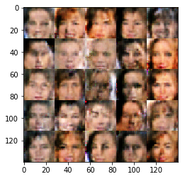


    Epoch 1/4... Discriminator Loss: 1.5993... Generator Loss: 0.5169
    Epoch 1/4... Discriminator Loss: 1.5571... Generator Loss: 0.5952
    Epoch 1/4... Discriminator Loss: 1.7014... Generator Loss: 0.5260
    Epoch 1/4... Discriminator Loss: 1.6218... Generator Loss: 0.5512
    Epoch 1/4... Discriminator Loss: 1.4900... Generator Loss: 0.5657
    Epoch 1/4... Discriminator Loss: 1.4921... Generator Loss: 0.5865
    Epoch 1/4... Discriminator Loss: 1.7221... Generator Loss: 0.5296
    Epoch 1/4... Discriminator Loss: 1.6328... Generator Loss: 0.5972
    Epoch 1/4... Discriminator Loss: 1.5468... Generator Loss: 0.7030
    Epoch 1/4... Discriminator Loss: 1.6120... Generator Loss: 0.5465
    Epoch 1/4... Discriminator Loss: 1.6775... Generator Loss: 0.6316
    Epoch 1/4... Discriminator Loss: 1.6031... Generator Loss: 0.6486
    Epoch 1/4... Discriminator Loss: 1.7035... Generator Loss: 0.5600
    Epoch 1/4... Discriminator Loss: 1.5417... Generator Loss: 0.5936
    Epoch 1/4... Discriminator Loss: 1.5281... Generator Loss: 0.6139
    Epoch 1/4... Discriminator Loss: 1.6433... Generator Loss: 0.5059
    Epoch 1/4... Discriminator Loss: 1.6092... Generator Loss: 0.5131
    Epoch 1/4... Discriminator Loss: 1.7358... Generator Loss: 0.5307
    Epoch 1/4... Discriminator Loss: 1.7038... Generator Loss: 0.5359
    Epoch 1/4... Discriminator Loss: 1.5147... Generator Loss: 0.6120


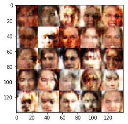


    Epoch 1/4... Discriminator Loss: 1.7145... Generator Loss: 0.5757
    Epoch 1/4... Discriminator Loss: 1.6145... Generator Loss: 0.6502
    Epoch 1/4... Discriminator Loss: 1.6029... Generator Loss: 0.5500
    Epoch 1/4... Discriminator Loss: 1.6163... Generator Loss: 0.5593
    Epoch 1/4... Discriminator Loss: 1.4750... Generator Loss: 0.6180
    Epoch 1/4... Discriminator Loss: 1.7025... Generator Loss: 0.5495
    Epoch 1/4... Discriminator Loss: 1.5201... Generator Loss: 0.5662
    Epoch 1/4... Discriminator Loss: 1.5721... Generator Loss: 0.5594
    Epoch 1/4... Discriminator Loss: 1.5721... Generator Loss: 0.6623
    Epoch 1/4... Discriminator Loss: 1.5322... Generator Loss: 0.5915
    Epoch 1/4... Discriminator Loss: 1.4343... Generator Loss: 0.5833
    Epoch 1/4... Discriminator Loss: 1.4886... Generator Loss: 0.7109
    Epoch 1/4... Discriminator Loss: 1.7573... Generator Loss: 0.5397
    Epoch 1/4... Discriminator Loss: 1.5408... Generator Loss: 0.6713
    Epoch 1/4... Discriminator Loss: 1.5840... Generator Loss: 0.5817
    Epoch 1/4... Discriminator Loss: 1.7042... Generator Loss: 0.5031
    Epoch 1/4... Discriminator Loss: 1.5590... Generator Loss: 0.5490
    Epoch 1/4... Discriminator Loss: 1.6217... Generator Loss: 0.4969
    Epoch 1/4... Discriminator Loss: 1.5652... Generator Loss: 0.6699
    Epoch 1/4... Discriminator Loss: 1.6616... Generator Loss: 0.5649


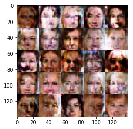


    Epoch 1/4... Discriminator Loss: 1.6641... Generator Loss: 0.5189
    Epoch 1/4... Discriminator Loss: 1.5675... Generator Loss: 0.6292
    Epoch 1/4... Discriminator Loss: 1.6086... Generator Loss: 0.6054
    Epoch 1/4... Discriminator Loss: 1.6280... Generator Loss: 0.5844
    Epoch 1/4... Discriminator Loss: 1.5830... Generator Loss: 0.5879
    Epoch 1/4... Discriminator Loss: 1.7307... Generator Loss: 0.6215
    Epoch 1/4... Discriminator Loss: 1.7551... Generator Loss: 0.5253
    Epoch 1/4... Discriminator Loss: 1.6930... Generator Loss: 0.5821
    Epoch 1/4... Discriminator Loss: 1.4879... Generator Loss: 0.6231
    Epoch 1/4... Discriminator Loss: 1.6594... Generator Loss: 0.5272
    Epoch 1/4... Discriminator Loss: 1.5958... Generator Loss: 0.6230
    Epoch 1/4... Discriminator Loss: 1.5393... Generator Loss: 0.6317
    Epoch 1/4... Discriminator Loss: 1.5842... Generator Loss: 0.5069
    Epoch 1/4... Discriminator Loss: 1.7064... Generator Loss: 0.6455
    Epoch 1/4... Discriminator Loss: 1.5934... Generator Loss: 0.5672
    Epoch 1/4... Discriminator Loss: 1.6103... Generator Loss: 0.5801
    Epoch 1/4... Discriminator Loss: 1.6419... Generator Loss: 0.6314
    Epoch 1/4... Discriminator Loss: 1.5517... Generator Loss: 0.5738
    Epoch 1/4... Discriminator Loss: 1.5650... Generator Loss: 0.5384
    Epoch 1/4... Discriminator Loss: 1.5807... Generator Loss: 0.6868


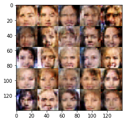


    Epoch 1/4... Discriminator Loss: 1.5984... Generator Loss: 0.5226
    Epoch 1/4... Discriminator Loss: 1.5995... Generator Loss: 0.5207
    Epoch 1/4... Discriminator Loss: 1.5970... Generator Loss: 0.5694
    Epoch 1/4... Discriminator Loss: 1.5520... Generator Loss: 0.6676
    Epoch 1/4... Discriminator Loss: 1.6541... Generator Loss: 0.5504
    Epoch 1/4... Discriminator Loss: 1.8078... Generator Loss: 0.5092
    Epoch 1/4... Discriminator Loss: 1.6891... Generator Loss: 0.5805
    Epoch 1/4... Discriminator Loss: 1.7069... Generator Loss: 0.5387
    Epoch 1/4... Discriminator Loss: 1.5414... Generator Loss: 0.6003
    Epoch 1/4... Discriminator Loss: 1.6827... Generator Loss: 0.5470
    Epoch 1/4... Discriminator Loss: 1.5491... Generator Loss: 0.6013
    Epoch 1/4... Discriminator Loss: 1.4704... Generator Loss: 0.7149
    Epoch 1/4... Discriminator Loss: 1.6812... Generator Loss: 0.5263
    Epoch 1/4... Discriminator Loss: 1.6471... Generator Loss: 0.6614
    Epoch 1/4... Discriminator Loss: 1.4541... Generator Loss: 0.6463
    Epoch 1/4... Discriminator Loss: 1.6869... Generator Loss: 0.5158
    Epoch 1/4... Discriminator Loss: 1.5904... Generator Loss: 0.5421
    Epoch 1/4... Discriminator Loss: 1.7208... Generator Loss: 0.5715
    Epoch 1/4... Discriminator Loss: 1.5547... Generator Loss: 0.5807
    Epoch 1/4... Discriminator Loss: 1.5160... Generator Loss: 0.6277


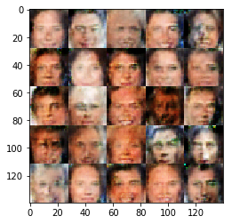


    Epoch 1/4... Discriminator Loss: 1.5897... Generator Loss: 0.5933
    Epoch 1/4... Discriminator Loss: 1.5555... Generator Loss: 0.6271
    Epoch 1/4... Discriminator Loss: 1.7170... Generator Loss: 0.5913
    Epoch 1/4... Discriminator Loss: 1.5297... Generator Loss: 0.6505
    Epoch 1/4... Discriminator Loss: 1.5999... Generator Loss: 0.6141
    Epoch 1/4... Discriminator Loss: 1.6611... Generator Loss: 0.6562
    Epoch 1/4... Discriminator Loss: 1.5591... Generator Loss: 0.6197
    Epoch 1/4... Discriminator Loss: 1.5309... Generator Loss: 0.6157
    Epoch 1/4... Discriminator Loss: 1.6246... Generator Loss: 0.6674
    Epoch 1/4... Discriminator Loss: 1.5425... Generator Loss: 0.6649
    Epoch 1/4... Discriminator Loss: 1.5248... Generator Loss: 0.7072
    Epoch 1/4... Discriminator Loss: 1.4805... Generator Loss: 0.5601
    Epoch 1/4... Discriminator Loss: 1.6037... Generator Loss: 0.5543
    Epoch 1/4... Discriminator Loss: 1.7053... Generator Loss: 0.5141
    Epoch 1/4... Discriminator Loss: 1.6946... Generator Loss: 0.5778
    Epoch 1/4... Discriminator Loss: 1.7289... Generator Loss: 0.5396
    Epoch 1/4... Discriminator Loss: 1.5246... Generator Loss: 0.5833
    Epoch 1/4... Discriminator Loss: 1.7739... Generator Loss: 0.5049
    Epoch 1/4... Discriminator Loss: 1.5606... Generator Loss: 0.6146
    Epoch 1/4... Discriminator Loss: 1.5801... Generator Loss: 0.6236


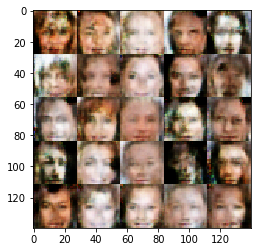


    Epoch 1/4... Discriminator Loss: 1.8160... Generator Loss: 0.5194
    Epoch 1/4... Discriminator Loss: 1.7127... Generator Loss: 0.5571
    Epoch 1/4... Discriminator Loss: 1.6200... Generator Loss: 0.5561
    Epoch 1/4... Discriminator Loss: 1.6040... Generator Loss: 0.6160
    Epoch 1/4... Discriminator Loss: 1.5968... Generator Loss: 0.6862
    Epoch 1/4... Discriminator Loss: 1.5355... Generator Loss: 0.6026
    Epoch 1/4... Discriminator Loss: 1.5381... Generator Loss: 0.6068
    Epoch 1/4... Discriminator Loss: 1.6470... Generator Loss: 0.5183
    Epoch 1/4... Discriminator Loss: 1.5907... Generator Loss: 0.5817
    Epoch 1/4... Discriminator Loss: 1.5377... Generator Loss: 0.6291
    Epoch 1/4... Discriminator Loss: 1.6792... Generator Loss: 0.5656
    Epoch 1/4... Discriminator Loss: 1.5898... Generator Loss: 0.6433
    Epoch 1/4... Discriminator Loss: 1.4721... Generator Loss: 0.6426
    Epoch 1/4... Discriminator Loss: 1.6347... Generator Loss: 0.5631
    Epoch 1/4... Discriminator Loss: 1.4553... Generator Loss: 0.6199
    Epoch 1/4... Discriminator Loss: 1.7768... Generator Loss: 0.6003
    Epoch 1/4... Discriminator Loss: 1.7683... Generator Loss: 0.5493
    Epoch 1/4... Discriminator Loss: 1.6803... Generator Loss: 0.4993
    Epoch 1/4... Discriminator Loss: 1.5235... Generator Loss: 0.6577
    Epoch 1/4... Discriminator Loss: 1.4851... Generator Loss: 0.6643


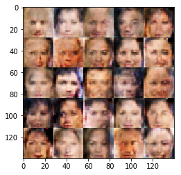


    Epoch 1/4... Discriminator Loss: 1.5470... Generator Loss: 0.6771
    Epoch 1/4... Discriminator Loss: 1.6052... Generator Loss: 0.5594
    Epoch 1/4... Discriminator Loss: 1.4641... Generator Loss: 0.6261
    Epoch 1/4... Discriminator Loss: 1.6304... Generator Loss: 0.5367
    Epoch 1/4... Discriminator Loss: 1.6413... Generator Loss: 0.6121
    Epoch 1/4... Discriminator Loss: 1.4956... Generator Loss: 0.7111
    Epoch 1/4... Discriminator Loss: 1.5717... Generator Loss: 0.6134
    Epoch 1/4... Discriminator Loss: 1.5534... Generator Loss: 0.6852
    Epoch 1/4... Discriminator Loss: 1.4592... Generator Loss: 0.5829
    Epoch 1/4... Discriminator Loss: 1.7025... Generator Loss: 0.5464
    Epoch 1/4... Discriminator Loss: 1.6041... Generator Loss: 0.6371
    Epoch 1/4... Discriminator Loss: 1.6998... Generator Loss: 0.6043
    Epoch 1/4... Discriminator Loss: 1.5774... Generator Loss: 0.6031
    Epoch 1/4... Discriminator Loss: 1.4794... Generator Loss: 0.6264
    Epoch 1/4... Discriminator Loss: 1.5372... Generator Loss: 0.6475
    Epoch 1/4... Discriminator Loss: 1.5249... Generator Loss: 0.6071
    Epoch 1/4... Discriminator Loss: 1.5641... Generator Loss: 0.5922
    Epoch 1/4... Discriminator Loss: 1.5937... Generator Loss: 0.5768
    Epoch 1/4... Discriminator Loss: 1.6354... Generator Loss: 0.6736
    Epoch 1/4... Discriminator Loss: 1.5863... Generator Loss: 0.6121


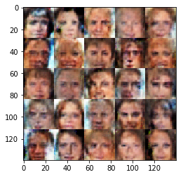


    Epoch 1/4... Discriminator Loss: 1.5649... Generator Loss: 0.5605
    Epoch 1/4... Discriminator Loss: 1.7174... Generator Loss: 0.5229
    Epoch 1/4... Discriminator Loss: 1.6207... Generator Loss: 0.5426
    Epoch 1/4... Discriminator Loss: 1.8389... Generator Loss: 0.4247
    Epoch 1/4... Discriminator Loss: 1.7515... Generator Loss: 0.5057
    Epoch 1/4... Discriminator Loss: 1.5623... Generator Loss: 0.5159
    Epoch 1/4... Discriminator Loss: 1.5653... Generator Loss: 0.6458
    Epoch 1/4... Discriminator Loss: 1.7258... Generator Loss: 0.6249
    Epoch 1/4... Discriminator Loss: 1.6038... Generator Loss: 0.5596
    Epoch 1/4... Discriminator Loss: 1.6566... Generator Loss: 0.5873
    Epoch 1/4... Discriminator Loss: 1.5127... Generator Loss: 0.6201
    Epoch 1/4... Discriminator Loss: 1.5238... Generator Loss: 0.7079
    Epoch 1/4... Discriminator Loss: 1.6087... Generator Loss: 0.6556
    Epoch 1/4... Discriminator Loss: 1.6115... Generator Loss: 0.5101
    Epoch 1/4... Discriminator Loss: 1.5698... Generator Loss: 0.5634
    Epoch 1/4... Discriminator Loss: 1.7292... Generator Loss: 0.5639
    Epoch 1/4... Discriminator Loss: 1.5923... Generator Loss: 0.6215
    Epoch 1/4... Discriminator Loss: 1.7472... Generator Loss: 0.5030
    Epoch 1/4... Discriminator Loss: 1.5851... Generator Loss: 0.7069
    Epoch 1/4... Discriminator Loss: 1.4984... Generator Loss: 0.6445


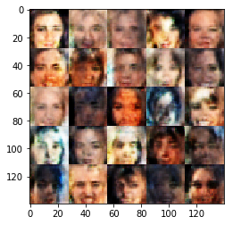


    Epoch 1/4... Discriminator Loss: 1.6242... Generator Loss: 0.6272
    Epoch 1/4... Discriminator Loss: 1.7060... Generator Loss: 0.5258
    Epoch 1/4... Discriminator Loss: 1.5695... Generator Loss: 0.6333
    Epoch 1/4... Discriminator Loss: 1.5999... Generator Loss: 0.6299
    Epoch 1/4... Discriminator Loss: 1.5511... Generator Loss: 0.7194
    Epoch 1/4... Discriminator Loss: 1.5499... Generator Loss: 0.7172
    Epoch 1/4... Discriminator Loss: 1.7526... Generator Loss: 0.5707
    Epoch 1/4... Discriminator Loss: 1.6342... Generator Loss: 0.6219
    Epoch 1/4... Discriminator Loss: 1.5418... Generator Loss: 0.5751
    Epoch 1/4... Discriminator Loss: 1.5419... Generator Loss: 0.6347
    Epoch 1/4... Discriminator Loss: 1.5129... Generator Loss: 0.6216
    Epoch 1/4... Discriminator Loss: 1.6213... Generator Loss: 0.4951
    Epoch 1/4... Discriminator Loss: 1.6811... Generator Loss: 0.5138
    Epoch 1/4... Discriminator Loss: 1.5812... Generator Loss: 0.5930
    Epoch 1/4... Discriminator Loss: 1.5493... Generator Loss: 0.7662
    Epoch 1/4... Discriminator Loss: 1.6289... Generator Loss: 0.6069
    Epoch 1/4... Discriminator Loss: 1.6286... Generator Loss: 0.6045
    Epoch 1/4... Discriminator Loss: 1.6013... Generator Loss: 0.5419
    Epoch 1/4... Discriminator Loss: 1.5842... Generator Loss: 0.6137
    Epoch 1/4... Discriminator Loss: 1.6187... Generator Loss: 0.5317


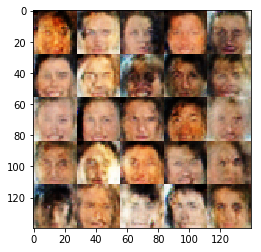


    Epoch 1/4... Discriminator Loss: 1.5679... Generator Loss: 0.4813
    Epoch 1/4... Discriminator Loss: 1.5380... Generator Loss: 0.6402
    Epoch 1/4... Discriminator Loss: 1.4623... Generator Loss: 0.6174
    Epoch 1/4... Discriminator Loss: 1.5786... Generator Loss: 0.6340
    Epoch 1/4... Discriminator Loss: 1.5827... Generator Loss: 0.6246
    Epoch 1/4... Discriminator Loss: 1.5440... Generator Loss: 0.7338
    Epoch 1/4... Discriminator Loss: 1.5737... Generator Loss: 0.6317
    Epoch 1/4... Discriminator Loss: 1.5300... Generator Loss: 0.5944
    Epoch 1/4... Discriminator Loss: 1.5892... Generator Loss: 0.6353
    Epoch 1/4... Discriminator Loss: 1.5826... Generator Loss: 0.5986
    Epoch 1/4... Discriminator Loss: 1.5863... Generator Loss: 0.5807
    Epoch 1/4... Discriminator Loss: 1.5337... Generator Loss: 0.5992
    Epoch 1/4... Discriminator Loss: 1.5515... Generator Loss: 0.6559
    Epoch 1/4... Discriminator Loss: 1.5760... Generator Loss: 0.5898
    Epoch 1/4... Discriminator Loss: 1.5914... Generator Loss: 0.6287
    Epoch 1/4... Discriminator Loss: 1.6321... Generator Loss: 0.5769
    Epoch 1/4... Discriminator Loss: 1.5548... Generator Loss: 0.6211
    Epoch 1/4... Discriminator Loss: 1.5785... Generator Loss: 0.5578
    Epoch 1/4... Discriminator Loss: 1.6364... Generator Loss: 0.5685
    Epoch 1/4... Discriminator Loss: 1.5969... Generator Loss: 0.5735


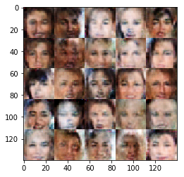


    Epoch 1/4... Discriminator Loss: 1.6022... Generator Loss: 0.5722
    Epoch 1/4... Discriminator Loss: 1.6036... Generator Loss: 0.5549
    Epoch 1/4... Discriminator Loss: 1.5811... Generator Loss: 0.5300
    Epoch 1/4... Discriminator Loss: 1.4948... Generator Loss: 0.6485
    Epoch 1/4... Discriminator Loss: 1.6412... Generator Loss: 0.6019
    Epoch 1/4... Discriminator Loss: 1.6402... Generator Loss: 0.6454
    Epoch 1/4... Discriminator Loss: 1.7301... Generator Loss: 0.4992
    Epoch 1/4... Discriminator Loss: 1.5575... Generator Loss: 0.6548
    Epoch 1/4... Discriminator Loss: 1.5537... Generator Loss: 0.6174
    Epoch 1/4... Discriminator Loss: 1.5441... Generator Loss: 0.7122
    Epoch 1/4... Discriminator Loss: 1.7009... Generator Loss: 0.5717
    Epoch 1/4... Discriminator Loss: 1.6409... Generator Loss: 0.6332
    Epoch 1/4... Discriminator Loss: 1.5555... Generator Loss: 0.6820
    Epoch 1/4... Discriminator Loss: 1.6460... Generator Loss: 0.5157
    Epoch 1/4... Discriminator Loss: 1.6391... Generator Loss: 0.5236
    Epoch 1/4... Discriminator Loss: 1.5137... Generator Loss: 0.6441
    Epoch 1/4... Discriminator Loss: 1.5094... Generator Loss: 0.5577
    Epoch 1/4... Discriminator Loss: 1.7226... Generator Loss: 0.6244
    Epoch 1/4... Discriminator Loss: 1.6030... Generator Loss: 0.5901
    Epoch 1/4... Discriminator Loss: 1.4984... Generator Loss: 0.5912


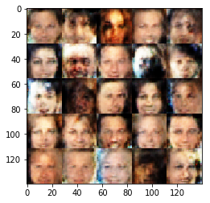


    Epoch 1/4... Discriminator Loss: 1.8268... Generator Loss: 0.5450
    Epoch 1/4... Discriminator Loss: 1.7680... Generator Loss: 0.4831
    Epoch 1/4... Discriminator Loss: 1.7521... Generator Loss: 0.5372
    Epoch 1/4... Discriminator Loss: 1.7062... Generator Loss: 0.5725
    Epoch 1/4... Discriminator Loss: 1.5577... Generator Loss: 0.5963
    Epoch 1/4... Discriminator Loss: 1.6196... Generator Loss: 0.5658
    Epoch 1/4... Discriminator Loss: 1.4963... Generator Loss: 0.5964
    Epoch 1/4... Discriminator Loss: 1.5693... Generator Loss: 0.6172
    Epoch 1/4... Discriminator Loss: 1.6706... Generator Loss: 0.5338
    Epoch 1/4... Discriminator Loss: 1.5717... Generator Loss: 0.6503
    Epoch 1/4... Discriminator Loss: 1.6288... Generator Loss: 0.6145
    Epoch 1/4... Discriminator Loss: 1.5201... Generator Loss: 0.5517
    Epoch 1/4... Discriminator Loss: 1.6959... Generator Loss: 0.5206
    Epoch 1/4... Discriminator Loss: 1.5818... Generator Loss: 0.6102
    Epoch 1/4... Discriminator Loss: 1.7158... Generator Loss: 0.6227
    Epoch 1/4... Discriminator Loss: 1.6746... Generator Loss: 0.5183
    Epoch 1/4... Discriminator Loss: 1.5953... Generator Loss: 0.6534
    Epoch 1/4... Discriminator Loss: 1.6074... Generator Loss: 0.5422
    Epoch 1/4... Discriminator Loss: 1.5896... Generator Loss: 0.6151
    Epoch 1/4... Discriminator Loss: 1.7108... Generator Loss: 0.5041


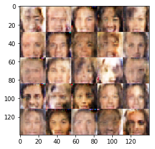


    Epoch 1/4... Discriminator Loss: 1.7028... Generator Loss: 0.4724
    Epoch 1/4... Discriminator Loss: 1.7292... Generator Loss: 0.5189
    Epoch 1/4... Discriminator Loss: 1.8154... Generator Loss: 0.4798
    Epoch 1/4... Discriminator Loss: 1.6524... Generator Loss: 0.5602
    Epoch 1/4... Discriminator Loss: 1.6193... Generator Loss: 0.4884
    Epoch 1/4... Discriminator Loss: 1.6597... Generator Loss: 0.5228
    Epoch 1/4... Discriminator Loss: 1.5301... Generator Loss: 0.6718
    Epoch 1/4... Discriminator Loss: 1.6048... Generator Loss: 0.5906
    Epoch 1/4... Discriminator Loss: 1.5701... Generator Loss: 0.7729
    Epoch 1/4... Discriminator Loss: 1.5570... Generator Loss: 0.6977
    Epoch 1/4... Discriminator Loss: 1.6631... Generator Loss: 0.6301
    Epoch 1/4... Discriminator Loss: 1.6223... Generator Loss: 0.6869
    Epoch 1/4... Discriminator Loss: 1.6627... Generator Loss: 0.6360
    Epoch 1/4... Discriminator Loss: 1.5448... Generator Loss: 0.6547
    Epoch 1/4... Discriminator Loss: 1.6702... Generator Loss: 0.4729
    Epoch 1/4... Discriminator Loss: 1.6967... Generator Loss: 0.4541
    Epoch 1/4... Discriminator Loss: 1.6182... Generator Loss: 0.6144
    Epoch 1/4... Discriminator Loss: 1.5605... Generator Loss: 0.6080
    Epoch 1/4... Discriminator Loss: 1.5137... Generator Loss: 0.5284
    Epoch 1/4... Discriminator Loss: 1.6986... Generator Loss: 0.5351


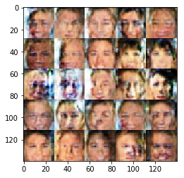


    Epoch 1/4... Discriminator Loss: 1.7724... Generator Loss: 0.4735
    Epoch 1/4... Discriminator Loss: 1.7635... Generator Loss: 0.5505
    Epoch 1/4... Discriminator Loss: 1.5769... Generator Loss: 0.5607
    Epoch 1/4... Discriminator Loss: 1.6691... Generator Loss: 0.5520
    Epoch 1/4... Discriminator Loss: 1.5079... Generator Loss: 0.5566
    Epoch 1/4... Discriminator Loss: 1.5954... Generator Loss: 0.6179
    Epoch 1/4... Discriminator Loss: 1.6805... Generator Loss: 0.5388
    Epoch 1/4... Discriminator Loss: 1.6224... Generator Loss: 0.6631
    Epoch 1/4... Discriminator Loss: 1.4632... Generator Loss: 0.6683
    Epoch 1/4... Discriminator Loss: 1.4899... Generator Loss: 0.6307
    Epoch 1/4... Discriminator Loss: 1.5330... Generator Loss: 0.6022
    Epoch 1/4... Discriminator Loss: 1.6152... Generator Loss: 0.5170
    Epoch 1/4... Discriminator Loss: 1.5864... Generator Loss: 0.5538
    Epoch 1/4... Discriminator Loss: 1.5290... Generator Loss: 0.5637
    Epoch 1/4... Discriminator Loss: 1.6847... Generator Loss: 0.5678
    Epoch 1/4... Discriminator Loss: 1.6807... Generator Loss: 0.5499
    Epoch 1/4... Discriminator Loss: 1.7103... Generator Loss: 0.4840
    Epoch 1/4... Discriminator Loss: 1.6751... Generator Loss: 0.5024
    Epoch 1/4... Discriminator Loss: 1.6176... Generator Loss: 0.6346
    Epoch 1/4... Discriminator Loss: 1.5196... Generator Loss: 0.7035


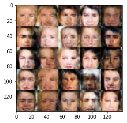


    Epoch 1/4... Discriminator Loss: 1.5773... Generator Loss: 0.6302
    Epoch 1/4... Discriminator Loss: 1.5487... Generator Loss: 0.5715
    Epoch 1/4... Discriminator Loss: 1.5468... Generator Loss: 0.7042
    Epoch 1/4... Discriminator Loss: 1.6928... Generator Loss: 0.5333
    Epoch 1/4... Discriminator Loss: 1.6196... Generator Loss: 0.6067
    Epoch 1/4... Discriminator Loss: 1.6918... Generator Loss: 0.5613
    Epoch 1/4... Discriminator Loss: 1.6117... Generator Loss: 0.6106
    Epoch 1/4... Discriminator Loss: 1.6313... Generator Loss: 0.5209
    Epoch 1/4... Discriminator Loss: 1.6034... Generator Loss: 0.5875
    Epoch 1/4... Discriminator Loss: 1.5703... Generator Loss: 0.5952
    Epoch 1/4... Discriminator Loss: 1.5717... Generator Loss: 0.5546
    Epoch 1/4... Discriminator Loss: 1.6217... Generator Loss: 0.5745
    Epoch 1/4... Discriminator Loss: 1.5454... Generator Loss: 0.5980
    Epoch 1/4... Discriminator Loss: 1.6294... Generator Loss: 0.6806
    Epoch 1/4... Discriminator Loss: 1.5243... Generator Loss: 0.6315
    Epoch 1/4... Discriminator Loss: 1.5950... Generator Loss: 0.6771
    Epoch 1/4... Discriminator Loss: 1.5855... Generator Loss: 0.6353
    Epoch 1/4... Discriminator Loss: 1.4860... Generator Loss: 0.6607
    Epoch 1/4... Discriminator Loss: 1.4963... Generator Loss: 0.7053
    Epoch 1/4... Discriminator Loss: 1.5509... Generator Loss: 0.6761


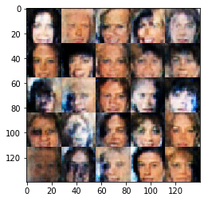


    Epoch 1/4... Discriminator Loss: 1.6447... Generator Loss: 0.5816
    Epoch 1/4... Discriminator Loss: 1.5176... Generator Loss: 0.5898
    Epoch 1/4... Discriminator Loss: 1.6925... Generator Loss: 0.7068
    Epoch 1/4... Discriminator Loss: 1.5267... Generator Loss: 0.6108
    Epoch 1/4... Discriminator Loss: 1.6980... Generator Loss: 0.5373
    Epoch 1/4... Discriminator Loss: 1.7287... Generator Loss: 0.5776
    Epoch 1/4... Discriminator Loss: 1.6509... Generator Loss: 0.4820
    Epoch 1/4... Discriminator Loss: 1.6212... Generator Loss: 0.5564
    Epoch 1/4... Discriminator Loss: 1.6279... Generator Loss: 0.5295
    Epoch 1/4... Discriminator Loss: 1.5641... Generator Loss: 0.6188
    Epoch 1/4... Discriminator Loss: 1.5583... Generator Loss: 0.5949
    Epoch 1/4... Discriminator Loss: 1.5493... Generator Loss: 0.6387
    Epoch 1/4... Discriminator Loss: 1.5025... Generator Loss: 0.6026
    Epoch 1/4... Discriminator Loss: 1.5256... Generator Loss: 0.6356
    Epoch 1/4... Discriminator Loss: 1.4565... Generator Loss: 0.6243
    Epoch 1/4... Discriminator Loss: 1.6346... Generator Loss: 0.5053
    Epoch 1/4... Discriminator Loss: 1.6005... Generator Loss: 0.5857
    Epoch 1/4... Discriminator Loss: 1.6481... Generator Loss: 0.6159
    Epoch 1/4... Discriminator Loss: 1.4490... Generator Loss: 0.6384
    Epoch 1/4... Discriminator Loss: 1.5614... Generator Loss: 0.5260


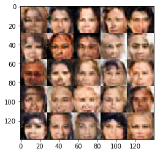


    Epoch 1/4... Discriminator Loss: 1.7079... Generator Loss: 0.4921
    Epoch 1/4... Discriminator Loss: 1.6076... Generator Loss: 0.6572
    Epoch 1/4... Discriminator Loss: 1.6463... Generator Loss: 0.6018
    Epoch 1/4... Discriminator Loss: 1.5841... Generator Loss: 0.7144
    Epoch 1/4... Discriminator Loss: 1.5371... Generator Loss: 0.6043
    Epoch 1/4... Discriminator Loss: 1.5688... Generator Loss: 0.6134
    Epoch 1/4... Discriminator Loss: 1.5372... Generator Loss: 0.5729
    Epoch 1/4... Discriminator Loss: 1.5048... Generator Loss: 0.5849
    Epoch 1/4... Discriminator Loss: 1.6134... Generator Loss: 0.6563
    Epoch 1/4... Discriminator Loss: 1.5838... Generator Loss: 0.5558
    Epoch 1/4... Discriminator Loss: 1.4723... Generator Loss: 0.6578
    Epoch 1/4... Discriminator Loss: 1.5088... Generator Loss: 0.6748
    Epoch 1/4... Discriminator Loss: 1.5802... Generator Loss: 0.5749
    Epoch 1/4... Discriminator Loss: 1.5517... Generator Loss: 0.6393
    Epoch 1/4... Discriminator Loss: 1.5589... Generator Loss: 0.5558
    Epoch 1/4... Discriminator Loss: 1.5849... Generator Loss: 0.6425
    Epoch 1/4... Discriminator Loss: 1.5706... Generator Loss: 0.7033
    Epoch 1/4... Discriminator Loss: 1.5493... Generator Loss: 0.5420
    Epoch 1/4... Discriminator Loss: 1.6666... Generator Loss: 0.6320
    Epoch 1/4... Discriminator Loss: 1.5463... Generator Loss: 0.5370


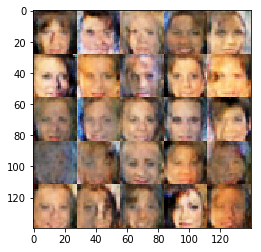


    Epoch 1/4... Discriminator Loss: 1.6379... Generator Loss: 0.6521
    Epoch 1/4... Discriminator Loss: 1.5236... Generator Loss: 0.6624
    Epoch 1/4... Discriminator Loss: 1.7175... Generator Loss: 0.5018
    Epoch 1/4... Discriminator Loss: 1.6032... Generator Loss: 0.6142
    Epoch 1/4... Discriminator Loss: 1.6289... Generator Loss: 0.6413
    Epoch 1/4... Discriminator Loss: 1.5686... Generator Loss: 0.6551
    Epoch 1/4... Discriminator Loss: 1.4877... Generator Loss: 0.5503
    Epoch 1/4... Discriminator Loss: 1.6821... Generator Loss: 0.5381
    Epoch 1/4... Discriminator Loss: 1.4815... Generator Loss: 0.6600
    Epoch 1/4... Discriminator Loss: 1.5023... Generator Loss: 0.6774
    Epoch 1/4... Discriminator Loss: 1.5956... Generator Loss: 0.6797
    Epoch 1/4... Discriminator Loss: 1.6524... Generator Loss: 0.6040
    Epoch 1/4... Discriminator Loss: 1.6602... Generator Loss: 0.5791
    Epoch 1/4... Discriminator Loss: 1.5172... Generator Loss: 0.6121
    Epoch 1/4... Discriminator Loss: 1.6217... Generator Loss: 0.5451
    Epoch 1/4... Discriminator Loss: 1.6552... Generator Loss: 0.6419
    Epoch 1/4... Discriminator Loss: 1.6597... Generator Loss: 0.5707
    Epoch 1/4... Discriminator Loss: 1.5993... Generator Loss: 0.5906
    Epoch 1/4... Discriminator Loss: 1.5777... Generator Loss: 0.5617
    Epoch 1/4... Discriminator Loss: 1.5229... Generator Loss: 0.8055


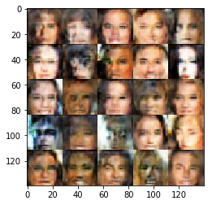


    Epoch 1/4... Discriminator Loss: 1.4802... Generator Loss: 0.6071
    Epoch 1/4... Discriminator Loss: 1.6051... Generator Loss: 0.5899
    Epoch 1/4... Discriminator Loss: 1.7449... Generator Loss: 0.5143
    Epoch 1/4... Discriminator Loss: 1.5749... Generator Loss: 0.5531
    Epoch 1/4... Discriminator Loss: 1.5341... Generator Loss: 0.6688
    Epoch 1/4... Discriminator Loss: 1.5761... Generator Loss: 0.5682
    Epoch 1/4... Discriminator Loss: 1.5751... Generator Loss: 0.6310
    Epoch 1/4... Discriminator Loss: 1.7706... Generator Loss: 0.6116
    Epoch 1/4... Discriminator Loss: 1.5730... Generator Loss: 0.6661
    Epoch 1/4... Discriminator Loss: 1.6003... Generator Loss: 0.5917
    Epoch 1/4... Discriminator Loss: 1.6001... Generator Loss: 0.6676
    Epoch 1/4... Discriminator Loss: 1.5087... Generator Loss: 0.6454
    Epoch 1/4... Discriminator Loss: 1.6927... Generator Loss: 0.5634
    Epoch 1/4... Discriminator Loss: 1.6139... Generator Loss: 0.5188
    Epoch 1/4... Discriminator Loss: 1.5122... Generator Loss: 0.7251
    Epoch 1/4... Discriminator Loss: 1.6849... Generator Loss: 0.5325
    Epoch 1/4... Discriminator Loss: 1.6129... Generator Loss: 0.5852
    Epoch 1/4... Discriminator Loss: 1.6072... Generator Loss: 0.5533
    Epoch 1/4... Discriminator Loss: 1.6213... Generator Loss: 0.5315
    Epoch 1/4... Discriminator Loss: 1.6569... Generator Loss: 0.5281


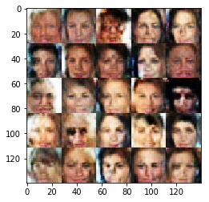


    Epoch 1/4... Discriminator Loss: 1.6500... Generator Loss: 0.6861
    Epoch 1/4... Discriminator Loss: 1.5868... Generator Loss: 0.5751
    Epoch 1/4... Discriminator Loss: 1.5963... Generator Loss: 0.6143
    Epoch 1/4... Discriminator Loss: 1.5641... Generator Loss: 0.5996
    Epoch 1/4... Discriminator Loss: 1.5669... Generator Loss: 0.6654
    Epoch 1/4... Discriminator Loss: 1.6077... Generator Loss: 0.6841
    Epoch 1/4... Discriminator Loss: 1.5307... Generator Loss: 0.5873
    Epoch 1/4... Discriminator Loss: 1.5088... Generator Loss: 0.5473
    Epoch 1/4... Discriminator Loss: 1.4556... Generator Loss: 0.6359
    Epoch 1/4... Discriminator Loss: 1.5629... Generator Loss: 0.6663
    Epoch 1/4... Discriminator Loss: 1.5728... Generator Loss: 0.6636
    Epoch 1/4... Discriminator Loss: 1.6760... Generator Loss: 0.5084
    Epoch 1/4... Discriminator Loss: 1.4875... Generator Loss: 0.6327
    Epoch 1/4... Discriminator Loss: 1.5305... Generator Loss: 0.6559
    Epoch 1/4... Discriminator Loss: 1.5558... Generator Loss: 0.6638
    Epoch 1/4... Discriminator Loss: 1.5218... Generator Loss: 0.7031
    Epoch 1/4... Discriminator Loss: 1.4971... Generator Loss: 0.6910
    Epoch 1/4... Discriminator Loss: 1.5634... Generator Loss: 0.6790
    Epoch 1/4... Discriminator Loss: 1.5517... Generator Loss: 0.5489
    Epoch 1/4... Discriminator Loss: 1.5463... Generator Loss: 0.6293


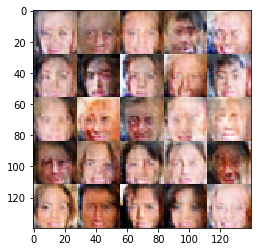


    Epoch 1/4... Discriminator Loss: 1.5535... Generator Loss: 0.6571
    Epoch 1/4... Discriminator Loss: 1.6126... Generator Loss: 0.5701
    Epoch 1/4... Discriminator Loss: 1.5884... Generator Loss: 0.5314
    Epoch 1/4... Discriminator Loss: 1.7016... Generator Loss: 0.5223
    Epoch 1/4... Discriminator Loss: 1.5439... Generator Loss: 0.6098
    Epoch 1/4... Discriminator Loss: 1.4989... Generator Loss: 0.6614
    Epoch 1/4... Discriminator Loss: 1.4519... Generator Loss: 0.6999
    Epoch 1/4... Discriminator Loss: 1.6320... Generator Loss: 0.5687
    Epoch 1/4... Discriminator Loss: 1.5215... Generator Loss: 0.5511
    Epoch 1/4... Discriminator Loss: 1.5172... Generator Loss: 0.6903
    Epoch 1/4... Discriminator Loss: 1.6765... Generator Loss: 0.5934
    Epoch 1/4... Discriminator Loss: 1.4562... Generator Loss: 0.7061
    Epoch 1/4... Discriminator Loss: 1.5167... Generator Loss: 0.6565
    Epoch 1/4... Discriminator Loss: 1.5123... Generator Loss: 0.6919
    Epoch 1/4... Discriminator Loss: 1.6217... Generator Loss: 0.5813
    Epoch 1/4... Discriminator Loss: 1.6703... Generator Loss: 0.5313
    Epoch 1/4... Discriminator Loss: 1.5218... Generator Loss: 0.6989
    Epoch 1/4... Discriminator Loss: 1.5518... Generator Loss: 0.6398
    Epoch 1/4... Discriminator Loss: 1.5677... Generator Loss: 0.6331
    Epoch 1/4... Discriminator Loss: 1.5501... Generator Loss: 0.6176


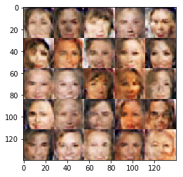


    Epoch 1/4... Discriminator Loss: 1.6536... Generator Loss: 0.5146
    Epoch 1/4... Discriminator Loss: 1.6437... Generator Loss: 0.6684
    Epoch 1/4... Discriminator Loss: 1.5959... Generator Loss: 0.6689
    Epoch 1/4... Discriminator Loss: 1.5755... Generator Loss: 0.5772
    Epoch 1/4... Discriminator Loss: 1.6158... Generator Loss: 0.5843
    Epoch 1/4... Discriminator Loss: 1.6723... Generator Loss: 0.5696
    Epoch 1/4... Discriminator Loss: 1.5015... Generator Loss: 0.6580
    Epoch 1/4... Discriminator Loss: 1.6289... Generator Loss: 0.5774
    Epoch 1/4... Discriminator Loss: 1.4939... Generator Loss: 0.7167
    Epoch 1/4... Discriminator Loss: 1.7286... Generator Loss: 0.5456
    Epoch 1/4... Discriminator Loss: 1.5976... Generator Loss: 0.5537
    Epoch 1/4... Discriminator Loss: 1.6049... Generator Loss: 0.5614
    Epoch 1/4... Discriminator Loss: 1.5530... Generator Loss: 0.6060
    Epoch 1/4... Discriminator Loss: 1.5346... Generator Loss: 0.5703
    Epoch 1/4... Discriminator Loss: 1.5596... Generator Loss: 0.5521
    Epoch 1/4... Discriminator Loss: 1.5167... Generator Loss: 0.6647
    Epoch 1/4... Discriminator Loss: 1.5143... Generator Loss: 0.6266
    Epoch 1/4... Discriminator Loss: 1.5517... Generator Loss: 0.5708
    Epoch 1/4... Discriminator Loss: 1.5107... Generator Loss: 0.6951
    Epoch 1/4... Discriminator Loss: 1.6067... Generator Loss: 0.4957


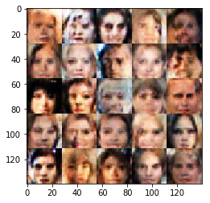


    Epoch 1/4... Discriminator Loss: 1.6161... Generator Loss: 0.6032
    Epoch 1/4... Discriminator Loss: 1.5055... Generator Loss: 0.7127
    Epoch 1/4... Discriminator Loss: 1.5917... Generator Loss: 0.6648
    Epoch 1/4... Discriminator Loss: 1.6525... Generator Loss: 0.5712
    Epoch 1/4... Discriminator Loss: 1.5488... Generator Loss: 0.6101
    Epoch 1/4... Discriminator Loss: 1.5578... Generator Loss: 0.6706
    Epoch 1/4... Discriminator Loss: 1.5055... Generator Loss: 0.6120
    Epoch 1/4... Discriminator Loss: 1.5262... Generator Loss: 0.6382
    Epoch 1/4... Discriminator Loss: 1.5962... Generator Loss: 0.6081
    Epoch 1/4... Discriminator Loss: 1.5631... Generator Loss: 0.6173
    Epoch 1/4... Discriminator Loss: 1.4571... Generator Loss: 0.7327
    Epoch 1/4... Discriminator Loss: 1.5728... Generator Loss: 0.6537
    Epoch 1/4... Discriminator Loss: 1.5546... Generator Loss: 0.5812
    Epoch 1/4... Discriminator Loss: 1.5098... Generator Loss: 0.7601
    Epoch 1/4... Discriminator Loss: 1.5099... Generator Loss: 0.5895
    Epoch 1/4... Discriminator Loss: 1.5200... Generator Loss: 0.5471
    Epoch 1/4... Discriminator Loss: 1.4695... Generator Loss: 0.7296
    Epoch 1/4... Discriminator Loss: 1.6249... Generator Loss: 0.5223
    Epoch 1/4... Discriminator Loss: 1.5677... Generator Loss: 0.6665
    Epoch 1/4... Discriminator Loss: 1.5087... Generator Loss: 0.6487


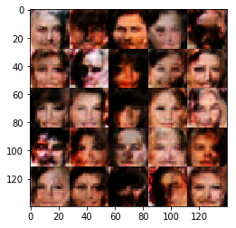


    Epoch 1/4... Discriminator Loss: 1.6214... Generator Loss: 0.5687
    Epoch 1/4... Discriminator Loss: 1.4770... Generator Loss: 0.7440
    Epoch 1/4... Discriminator Loss: 1.5002... Generator Loss: 0.6400
    Epoch 1/4... Discriminator Loss: 1.5785... Generator Loss: 0.6388
    Epoch 1/4... Discriminator Loss: 1.4652... Generator Loss: 0.6723
    Epoch 1/4... Discriminator Loss: 1.5122... Generator Loss: 0.7916
    Epoch 1/4... Discriminator Loss: 1.5154... Generator Loss: 0.6691
    Epoch 1/4... Discriminator Loss: 1.6361... Generator Loss: 0.5802
    Epoch 1/4... Discriminator Loss: 1.5276... Generator Loss: 0.6902
    Epoch 1/4... Discriminator Loss: 1.4580... Generator Loss: 0.6524
    Epoch 1/4... Discriminator Loss: 1.4961... Generator Loss: 0.6944
    Epoch 1/4... Discriminator Loss: 1.5369... Generator Loss: 0.7474
    Epoch 1/4... Discriminator Loss: 1.6433... Generator Loss: 0.5753
    Epoch 1/4... Discriminator Loss: 1.5124... Generator Loss: 0.6722
    Epoch 1/4... Discriminator Loss: 1.6229... Generator Loss: 0.6268
    Epoch 1/4... Discriminator Loss: 1.5017... Generator Loss: 0.6025
    Epoch 1/4... Discriminator Loss: 1.4977... Generator Loss: 0.6634
    Epoch 1/4... Discriminator Loss: 1.6001... Generator Loss: 0.5844
    Epoch 1/4... Discriminator Loss: 1.5634... Generator Loss: 0.5727
    Epoch 1/4... Discriminator Loss: 1.5985... Generator Loss: 0.5310


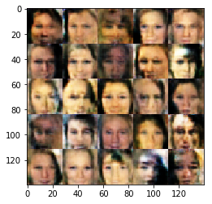


    Epoch 1/4... Discriminator Loss: 1.5222... Generator Loss: 0.6152
    Epoch 1/4... Discriminator Loss: 1.7335... Generator Loss: 0.4755
    Epoch 1/4... Discriminator Loss: 1.7818... Generator Loss: 0.5149
    Epoch 1/4... Discriminator Loss: 1.5452... Generator Loss: 0.5894
    Epoch 1/4... Discriminator Loss: 1.4795... Generator Loss: 0.6197
    Epoch 1/4... Discriminator Loss: 1.5527... Generator Loss: 0.7424
    Epoch 1/4... Discriminator Loss: 1.4820... Generator Loss: 0.8406
    Epoch 1/4... Discriminator Loss: 1.4819... Generator Loss: 0.5518
    Epoch 1/4... Discriminator Loss: 1.5211... Generator Loss: 0.6757
    Epoch 1/4... Discriminator Loss: 1.6428... Generator Loss: 0.5491
    Epoch 1/4... Discriminator Loss: 1.5296... Generator Loss: 0.7204
    Epoch 1/4... Discriminator Loss: 1.5379... Generator Loss: 0.7099
    Epoch 1/4... Discriminator Loss: 1.5176... Generator Loss: 0.6201
    Epoch 1/4... Discriminator Loss: 1.5589... Generator Loss: 0.6508
    Epoch 1/4... Discriminator Loss: 1.5286... Generator Loss: 0.5600
    Epoch 1/4... Discriminator Loss: 1.5823... Generator Loss: 0.5674
    Epoch 1/4... Discriminator Loss: 1.5114... Generator Loss: 0.6333
    Epoch 1/4... Discriminator Loss: 1.5856... Generator Loss: 0.6321
    Epoch 1/4... Discriminator Loss: 1.6024... Generator Loss: 0.6232
    Epoch 1/4... Discriminator Loss: 1.5389... Generator Loss: 0.6405


    Epoch 1/4... Discriminator Loss: 1.6228... Generator Loss: 0.5489
    Epoch 1/4... Discriminator Loss: 1.5575... Generator Loss: 0.7316
    Epoch 1/4... Discriminator Loss: 1.6413... Generator Loss: 0.5913
    Epoch 1/4... Discriminator Loss: 1.6151... Generator Loss: 0.5792
    Epoch 1/4... Discriminator Loss: 1.4536... Generator Loss: 0.7076
    Epoch 1/4... Discriminator Loss: 1.4882... Generator Loss: 0.6379
    Epoch 1/4... Discriminator Loss: 1.4674... Generator Loss: 0.6542
    Epoch 1/4... Discriminator Loss: 1.5274... Generator Loss: 0.6094
    Epoch 1/4... Discriminator Loss: 1.5775... Generator Loss: 0.6251
    Epoch 1/4... Discriminator Loss: 1.6026... Generator Loss: 0.6815
    Epoch 1/4... Discriminator Loss: 1.4391... Generator Loss: 0.7390
    Epoch 1/4... Discriminator Loss: 1.5257... Generator Loss: 0.5853
    Epoch 1/4... Discriminator Loss: 1.5461... Generator Loss: 0.5959
    Epoch 1/4... Discriminator Loss: 1.4897... Generator Loss: 0.6455
    Epoch 1/4... Discriminator Loss: 1.5884... Generator Loss: 0.6310
    Epoch 1/4... Discriminator Loss: 1.6002... Generator Loss: 0.6187
    Epoch 1/4... Discriminator Loss: 1.6184... Generator Loss: 0.5407
    Epoch 1/4... Discriminator Loss: 1.6205... Generator Loss: 0.5395
    Epoch 1/4... Discriminator Loss: 1.6452... Generator Loss: 0.5687
    Epoch 1/4... Discriminator Loss: 1.5483... Generator Loss: 0.6532


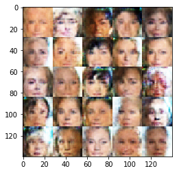


    Epoch 1/4... Discriminator Loss: 1.7257... Generator Loss: 0.6014
    Epoch 1/4... Discriminator Loss: 1.5269... Generator Loss: 0.7400
    Epoch 1/4... Discriminator Loss: 1.4874... Generator Loss: 0.7142
    Epoch 1/4... Discriminator Loss: 1.4831... Generator Loss: 0.6793
    Epoch 1/4... Discriminator Loss: 1.4871... Generator Loss: 0.6694
    Epoch 1/4... Discriminator Loss: 1.5147... Generator Loss: 0.7143
    Epoch 1/4... Discriminator Loss: 1.5846... Generator Loss: 0.5881
    Epoch 1/4... Discriminator Loss: 1.5615... Generator Loss: 0.5678
    Epoch 1/4... Discriminator Loss: 1.4883... Generator Loss: 0.6152
    Epoch 1/4... Discriminator Loss: 1.5122... Generator Loss: 0.6266
    Epoch 1/4... Discriminator Loss: 1.4831... Generator Loss: 0.6678
    Epoch 1/4... Discriminator Loss: 1.5916... Generator Loss: 0.6250
    Epoch 1/4... Discriminator Loss: 1.4975... Generator Loss: 0.7340
    Epoch 1/4... Discriminator Loss: 1.4849... Generator Loss: 0.6609
    Epoch 1/4... Discriminator Loss: 1.5259... Generator Loss: 0.6935
    Epoch 1/4... Discriminator Loss: 1.5715... Generator Loss: 0.7103
    Epoch 1/4... Discriminator Loss: 1.6407... Generator Loss: 0.5357
    Epoch 1/4... Discriminator Loss: 1.5935... Generator Loss: 0.6562
    Epoch 1/4... Discriminator Loss: 1.5164... Generator Loss: 0.6810
    Epoch 1/4... Discriminator Loss: 1.5304... Generator Loss: 0.5816


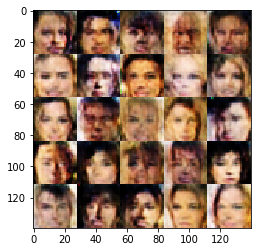


    Epoch 1/4... Discriminator Loss: 1.5399... Generator Loss: 0.5230
    Epoch 1/4... Discriminator Loss: 1.5859... Generator Loss: 0.5816
    Epoch 1/4... Discriminator Loss: 1.6637... Generator Loss: 0.5075
    Epoch 1/4... Discriminator Loss: 1.6812... Generator Loss: 0.5202
    Epoch 1/4... Discriminator Loss: 1.5647... Generator Loss: 0.6101
    Epoch 1/4... Discriminator Loss: 1.5616... Generator Loss: 0.5941
    Epoch 1/4... Discriminator Loss: 1.5297... Generator Loss: 0.6369
    Epoch 1/4... Discriminator Loss: 1.4985... Generator Loss: 0.6573
    Epoch 1/4... Discriminator Loss: 1.5074... Generator Loss: 0.6375
    Epoch 1/4... Discriminator Loss: 1.4997... Generator Loss: 0.5349
    Epoch 1/4... Discriminator Loss: 1.5823... Generator Loss: 0.5217
    Epoch 1/4... Discriminator Loss: 1.4439... Generator Loss: 0.7237
    Epoch 1/4... Discriminator Loss: 1.5464... Generator Loss: 0.5668
    Epoch 1/4... Discriminator Loss: 1.4878... Generator Loss: 0.6856
    Epoch 1/4... Discriminator Loss: 1.5344... Generator Loss: 0.6028
    Epoch 1/4... Discriminator Loss: 1.4532... Generator Loss: 0.7172
    Epoch 1/4... Discriminator Loss: 1.6045... Generator Loss: 0.6061
    Epoch 1/4... Discriminator Loss: 1.5364... Generator Loss: 0.6180
    Epoch 1/4... Discriminator Loss: 1.5341... Generator Loss: 0.6719
    Epoch 1/4... Discriminator Loss: 1.6089... Generator Loss: 0.7372


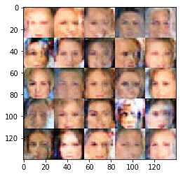


    Epoch 1/4... Discriminator Loss: 1.5178... Generator Loss: 0.6056
    Epoch 1/4... Discriminator Loss: 1.5383... Generator Loss: 0.7276
    Epoch 1/4... Discriminator Loss: 1.5178... Generator Loss: 0.6523
    Epoch 1/4... Discriminator Loss: 1.6219... Generator Loss: 0.6619
    Epoch 1/4... Discriminator Loss: 1.4778... Generator Loss: 0.7365
    Epoch 1/4... Discriminator Loss: 1.5797... Generator Loss: 0.6864
    Epoch 1/4... Discriminator Loss: 1.5913... Generator Loss: 0.5998
    Epoch 1/4... Discriminator Loss: 1.5260... Generator Loss: 0.5728
    Epoch 1/4... Discriminator Loss: 1.6308... Generator Loss: 0.5965
    Epoch 1/4... Discriminator Loss: 1.5429... Generator Loss: 0.7065
    Epoch 1/4... Discriminator Loss: 1.4524... Generator Loss: 0.5772
    Epoch 1/4... Discriminator Loss: 1.4559... Generator Loss: 0.7858
    Epoch 1/4... Discriminator Loss: 1.5212... Generator Loss: 0.7018
    Epoch 1/4... Discriminator Loss: 1.5465... Generator Loss: 0.6632
    Epoch 1/4... Discriminator Loss: 1.5979... Generator Loss: 0.5811
    Epoch 1/4... Discriminator Loss: 1.5523... Generator Loss: 0.6059
    Epoch 1/4... Discriminator Loss: 1.6211... Generator Loss: 0.5599
    Epoch 1/4... Discriminator Loss: 1.5275... Generator Loss: 0.6801
    Epoch 1/4... Discriminator Loss: 1.4532... Generator Loss: 0.6997
    Epoch 1/4... Discriminator Loss: 1.5391... Generator Loss: 0.6863


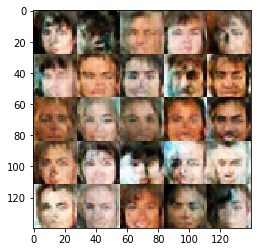


    Epoch 1/4... Discriminator Loss: 1.6011... Generator Loss: 0.7019
    Epoch 1/4... Discriminator Loss: 1.5129... Generator Loss: 0.7012
    Epoch 1/4... Discriminator Loss: 1.6280... Generator Loss: 0.6498
    Epoch 1/4... Discriminator Loss: 1.5784... Generator Loss: 0.6701
    Epoch 1/4... Discriminator Loss: 1.4790... Generator Loss: 0.7035
    Epoch 1/4... Discriminator Loss: 1.5701... Generator Loss: 0.6384
    Epoch 1/4... Discriminator Loss: 1.5878... Generator Loss: 0.7193
    Epoch 1/4... Discriminator Loss: 1.6376... Generator Loss: 0.5803
    Epoch 1/4... Discriminator Loss: 1.6313... Generator Loss: 0.6647
    Epoch 1/4... Discriminator Loss: 1.4575... Generator Loss: 0.7903
    Epoch 1/4... Discriminator Loss: 1.4513... Generator Loss: 0.7067
    Epoch 1/4... Discriminator Loss: 1.6487... Generator Loss: 0.5579
    Epoch 1/4... Discriminator Loss: 1.5715... Generator Loss: 0.7020
    Epoch 1/4... Discriminator Loss: 1.4803... Generator Loss: 0.7080
    Epoch 1/4... Discriminator Loss: 1.5520... Generator Loss: 0.6085
    Epoch 1/4... Discriminator Loss: 1.4785... Generator Loss: 0.7966
    Epoch 1/4... Discriminator Loss: 1.5562... Generator Loss: 0.6427
    Epoch 1/4... Discriminator Loss: 1.4962... Generator Loss: 0.6484
    Epoch 1/4... Discriminator Loss: 1.5378... Generator Loss: 0.6737
    Epoch 1/4... Discriminator Loss: 1.5639... Generator Loss: 0.6131


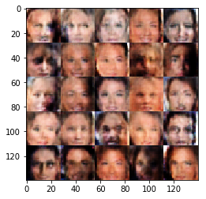


    Epoch 1/4... Discriminator Loss: 1.5745... Generator Loss: 0.5960
    Epoch 1/4... Discriminator Loss: 1.5057... Generator Loss: 0.6590
    Epoch 1/4... Discriminator Loss: 1.5387... Generator Loss: 0.6492
    Epoch 1/4... Discriminator Loss: 1.5394... Generator Loss: 0.6359
    Epoch 1/4... Discriminator Loss: 1.5651... Generator Loss: 0.6108
    Epoch 1/4... Discriminator Loss: 1.5590... Generator Loss: 0.6417
    Epoch 1/4... Discriminator Loss: 1.5717... Generator Loss: 0.6187
    Epoch 1/4... Discriminator Loss: 1.5685... Generator Loss: 0.5371
    Epoch 1/4... Discriminator Loss: 1.4592... Generator Loss: 0.6552
    Epoch 1/4... Discriminator Loss: 1.5923... Generator Loss: 0.5850
    Epoch 1/4... Discriminator Loss: 1.4223... Generator Loss: 0.7915
    Epoch 1/4... Discriminator Loss: 1.5691... Generator Loss: 0.5740
    Epoch 1/4... Discriminator Loss: 1.5963... Generator Loss: 0.6708
    Epoch 1/4... Discriminator Loss: 1.4681... Generator Loss: 0.8084
    Epoch 1/4... Discriminator Loss: 1.4436... Generator Loss: 0.6465
    Epoch 1/4... Discriminator Loss: 1.4868... Generator Loss: 0.6818
    Epoch 1/4... Discriminator Loss: 1.6582... Generator Loss: 0.5162
    Epoch 1/4... Discriminator Loss: 1.5478... Generator Loss: 0.6155
    Epoch 1/4... Discriminator Loss: 1.4888... Generator Loss: 0.6484
    Epoch 1/4... Discriminator Loss: 1.6039... Generator Loss: 0.5375


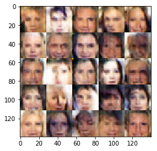


    Epoch 1/4... Discriminator Loss: 1.6280... Generator Loss: 0.6654
    Epoch 1/4... Discriminator Loss: 1.5826... Generator Loss: 0.4890
    Epoch 1/4... Discriminator Loss: 1.4361... Generator Loss: 0.6485
    Epoch 1/4... Discriminator Loss: 1.4921... Generator Loss: 0.6093
    Epoch 1/4... Discriminator Loss: 1.6805... Generator Loss: 0.6017
    Epoch 1/4... Discriminator Loss: 1.6019... Generator Loss: 0.7127
    Epoch 1/4... Discriminator Loss: 1.4499... Generator Loss: 0.7337
    Epoch 1/4... Discriminator Loss: 1.5109... Generator Loss: 0.6617
    Epoch 1/4... Discriminator Loss: 1.4606... Generator Loss: 0.6505
    Epoch 1/4... Discriminator Loss: 1.6162... Generator Loss: 0.5497
    Epoch 1/4... Discriminator Loss: 1.5707... Generator Loss: 0.7007
    Epoch 1/4... Discriminator Loss: 1.6872... Generator Loss: 0.6320
    Epoch 1/4... Discriminator Loss: 1.6500... Generator Loss: 0.6088
    Epoch 1/4... Discriminator Loss: 1.4715... Generator Loss: 0.6553
    Epoch 1/4... Discriminator Loss: 1.4984... Generator Loss: 0.6123
    Epoch 1/4... Discriminator Loss: 1.5080... Generator Loss: 0.6048
    Epoch 1/4... Discriminator Loss: 1.6693... Generator Loss: 0.5821
    Epoch 1/4... Discriminator Loss: 1.5187... Generator Loss: 0.5638
    Epoch 1/4... Discriminator Loss: 1.5007... Generator Loss: 0.7066
    Epoch 1/4... Discriminator Loss: 1.5065... Generator Loss: 0.6346


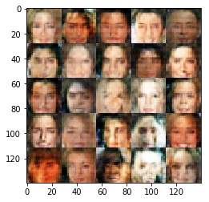


    Epoch 1/4... Discriminator Loss: 1.6605... Generator Loss: 0.4985
    Epoch 1/4... Discriminator Loss: 1.4880... Generator Loss: 0.6876
    Epoch 1/4... Discriminator Loss: 1.4604... Generator Loss: 0.6674
    Epoch 1/4... Discriminator Loss: 1.5694... Generator Loss: 0.5944
    Epoch 1/4... Discriminator Loss: 1.5253... Generator Loss: 0.6354
    Epoch 1/4... Discriminator Loss: 1.5613... Generator Loss: 0.6043
    Epoch 1/4... Discriminator Loss: 1.4850... Generator Loss: 0.7007
    Epoch 1/4... Discriminator Loss: 1.5236... Generator Loss: 0.8291
    Epoch 1/4... Discriminator Loss: 1.4454... Generator Loss: 0.7396
    Epoch 1/4... Discriminator Loss: 1.5601... Generator Loss: 0.5707
    Epoch 1/4... Discriminator Loss: 1.4887... Generator Loss: 0.6903
    Epoch 1/4... Discriminator Loss: 1.5103... Generator Loss: 0.6510
    Epoch 1/4... Discriminator Loss: 1.5323... Generator Loss: 0.7173
    Epoch 1/4... Discriminator Loss: 1.5801... Generator Loss: 0.6299
    Epoch 1/4... Discriminator Loss: 1.4892... Generator Loss: 0.6320
    Epoch 1/4... Discriminator Loss: 1.5487... Generator Loss: 0.5884
    Epoch 1/4... Discriminator Loss: 1.5493... Generator Loss: 0.5536
    Epoch 1/4... Discriminator Loss: 1.4680... Generator Loss: 0.7042
    Epoch 1/4... Discriminator Loss: 1.4940... Generator Loss: 0.5998
    Epoch 1/4... Discriminator Loss: 1.5546... Generator Loss: 0.6386


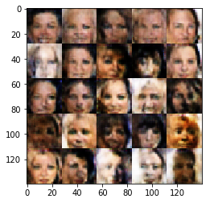


    Epoch 1/4... Discriminator Loss: 1.4817... Generator Loss: 0.7251
    Epoch 1/4... Discriminator Loss: 1.5006... Generator Loss: 0.7554
    Epoch 1/4... Discriminator Loss: 1.4560... Generator Loss: 0.7578
    Epoch 1/4... Discriminator Loss: 1.5108... Generator Loss: 0.6389
    Epoch 1/4... Discriminator Loss: 1.6033... Generator Loss: 0.5642
    Epoch 1/4... Discriminator Loss: 1.4206... Generator Loss: 0.6718
    Epoch 1/4... Discriminator Loss: 1.5774... Generator Loss: 0.6510
    Epoch 1/4... Discriminator Loss: 1.5973... Generator Loss: 0.6788
    Epoch 1/4... Discriminator Loss: 1.5091... Generator Loss: 0.6838
    Epoch 1/4... Discriminator Loss: 1.5106... Generator Loss: 0.7656
    Epoch 1/4... Discriminator Loss: 1.4687... Generator Loss: 0.7832
    Epoch 1/4... Discriminator Loss: 1.4340... Generator Loss: 0.7042
    Epoch 1/4... Discriminator Loss: 1.4719... Generator Loss: 0.7012
    Epoch 1/4... Discriminator Loss: 1.4890... Generator Loss: 0.6280
    Epoch 1/4... Discriminator Loss: 1.5220... Generator Loss: 0.6814
    Epoch 1/4... Discriminator Loss: 1.5296... Generator Loss: 0.6043
    Epoch 1/4... Discriminator Loss: 1.5203... Generator Loss: 0.6498
    Epoch 1/4... Discriminator Loss: 1.4860... Generator Loss: 0.6758
    Epoch 1/4... Discriminator Loss: 1.5345... Generator Loss: 0.6526
    Epoch 1/4... Discriminator Loss: 1.4622... Generator Loss: 0.7201


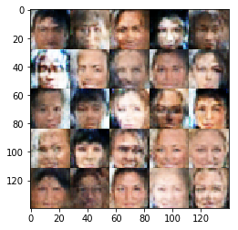


    Epoch 1/4... Discriminator Loss: 1.5197... Generator Loss: 0.6897
    Epoch 1/4... Discriminator Loss: 1.5068... Generator Loss: 0.6783
    Epoch 1/4... Discriminator Loss: 1.5111... Generator Loss: 0.6293
    Epoch 1/4... Discriminator Loss: 1.5467... Generator Loss: 0.5178
    Epoch 1/4... Discriminator Loss: 1.6144... Generator Loss: 0.5064
    Epoch 1/4... Discriminator Loss: 1.5463... Generator Loss: 0.6534
    Epoch 1/4... Discriminator Loss: 1.4744... Generator Loss: 0.7692
    Epoch 1/4... Discriminator Loss: 1.4939... Generator Loss: 0.7384
    Epoch 1/4... Discriminator Loss: 1.4606... Generator Loss: 0.6867
    Epoch 1/4... Discriminator Loss: 1.4751... Generator Loss: 0.6663
    Epoch 1/4... Discriminator Loss: 1.4400... Generator Loss: 0.6735
    Epoch 1/4... Discriminator Loss: 1.4647... Generator Loss: 0.7446
    Epoch 1/4... Discriminator Loss: 1.5204... Generator Loss: 0.7006
    Epoch 1/4... Discriminator Loss: 1.4880... Generator Loss: 0.7106
    Epoch 1/4... Discriminator Loss: 1.4819... Generator Loss: 0.6978
    Epoch 1/4... Discriminator Loss: 1.4033... Generator Loss: 0.7219
    Epoch 1/4... Discriminator Loss: 1.4519... Generator Loss: 0.6986
    Epoch 1/4... Discriminator Loss: 1.4476... Generator Loss: 0.8150
    Epoch 1/4... Discriminator Loss: 1.5246... Generator Loss: 0.6891
    Epoch 1/4... Discriminator Loss: 1.5028... Generator Loss: 0.6749


    Epoch 1/4... Discriminator Loss: 1.6002... Generator Loss: 0.5758
    Epoch 1/4... Discriminator Loss: 1.5401... Generator Loss: 0.6598
    Epoch 1/4... Discriminator Loss: 1.4751... Generator Loss: 0.7147
    Epoch 1/4... Discriminator Loss: 1.5575... Generator Loss: 0.6053
    Epoch 1/4... Discriminator Loss: 1.5575... Generator Loss: 0.6751
    Epoch 1/4... Discriminator Loss: 1.4277... Generator Loss: 0.6761
    Epoch 1/4... Discriminator Loss: 1.4703... Generator Loss: 0.7819
    Epoch 1/4... Discriminator Loss: 1.5753... Generator Loss: 0.7425
    Epoch 1/4... Discriminator Loss: 1.5154... Generator Loss: 0.6231
    Epoch 1/4... Discriminator Loss: 1.5361... Generator Loss: 0.6223
    Epoch 1/4... Discriminator Loss: 1.5473... Generator Loss: 0.5804
    Epoch 1/4... Discriminator Loss: 1.5148... Generator Loss: 0.6503
    Epoch 1/4... Discriminator Loss: 1.4611... Generator Loss: 0.6935
    Epoch 1/4... Discriminator Loss: 1.5694... Generator Loss: 0.6355
    Epoch 1/4... Discriminator Loss: 1.6075... Generator Loss: 0.6126
    Epoch 1/4... Discriminator Loss: 1.5829... Generator Loss: 0.6150
    Epoch 1/4... Discriminator Loss: 1.4580... Generator Loss: 0.6888
    Epoch 1/4... Discriminator Loss: 1.5243... Generator Loss: 0.6510
    Epoch 1/4... Discriminator Loss: 1.6261... Generator Loss: 0.6377
    Epoch 1/4... Discriminator Loss: 1.5052... Generator Loss: 0.7446


    Epoch 1/4... Discriminator Loss: 1.4975... Generator Loss: 0.7590
    Epoch 1/4... Discriminator Loss: 1.4484... Generator Loss: 0.6409
    Epoch 1/4... Discriminator Loss: 1.4468... Generator Loss: 0.6365
    Epoch 1/4... Discriminator Loss: 1.5179... Generator Loss: 0.6567
    Epoch 1/4... Discriminator Loss: 1.5249... Generator Loss: 0.5689
    Epoch 1/4... Discriminator Loss: 1.5406... Generator Loss: 0.6307
    Epoch 1/4... Discriminator Loss: 1.5940... Generator Loss: 0.5771
    Epoch 1/4... Discriminator Loss: 1.5096... Generator Loss: 0.6763
    Epoch 1/4... Discriminator Loss: 1.4910... Generator Loss: 0.7352
    Epoch 1/4... Discriminator Loss: 1.4631... Generator Loss: 0.6526
    Epoch 1/4... Discriminator Loss: 1.4973... Generator Loss: 0.7675
    Epoch 1/4... Discriminator Loss: 1.5924... Generator Loss: 0.5755
    Epoch 1/4... Discriminator Loss: 1.4981... Generator Loss: 0.6742
    Epoch 1/4... Discriminator Loss: 1.4776... Generator Loss: 0.6886
    Epoch 1/4... Discriminator Loss: 1.4650... Generator Loss: 0.7063
    Epoch 1/4... Discriminator Loss: 1.5671... Generator Loss: 0.5209
    Epoch 1/4... Discriminator Loss: 1.5976... Generator Loss: 0.6111
    Epoch 1/4... Discriminator Loss: 1.4629... Generator Loss: 0.6563
    Epoch 1/4... Discriminator Loss: 1.5390... Generator Loss: 0.6602
    Epoch 1/4... Discriminator Loss: 1.4584... Generator Loss: 0.7479


    Epoch 1/4... Discriminator Loss: 1.4190... Generator Loss: 0.7975
    Epoch 1/4... Discriminator Loss: 1.5726... Generator Loss: 0.6149
    Epoch 1/4... Discriminator Loss: 1.5101... Generator Loss: 0.7000
    Epoch 1/4... Discriminator Loss: 1.4121... Generator Loss: 0.6967
    Epoch 1/4... Discriminator Loss: 1.6411... Generator Loss: 0.6573
    Epoch 1/4... Discriminator Loss: 1.5456... Generator Loss: 0.6123
    Epoch 1/4... Discriminator Loss: 1.5378... Generator Loss: 0.6558
    Epoch 1/4... Discriminator Loss: 1.4330... Generator Loss: 0.7889
    Epoch 1/4... Discriminator Loss: 1.4536... Generator Loss: 0.7108
    Epoch 1/4... Discriminator Loss: 1.6222... Generator Loss: 0.5400
    Epoch 1/4... Discriminator Loss: 1.5199... Generator Loss: 0.6067
    Epoch 1/4... Discriminator Loss: 1.4727... Generator Loss: 0.7232
    Epoch 1/4... Discriminator Loss: 1.5155... Generator Loss: 0.6153
    Epoch 1/4... Discriminator Loss: 1.3977... Generator Loss: 0.7135
    Epoch 1/4... Discriminator Loss: 1.5286... Generator Loss: 0.6551
    Epoch 1/4... Discriminator Loss: 1.4672... Generator Loss: 0.6737
    Epoch 1/4... Discriminator Loss: 1.4738... Generator Loss: 0.6160
    Epoch 1/4... Discriminator Loss: 1.5334... Generator Loss: 0.5966
    Epoch 1/4... Discriminator Loss: 1.4572... Generator Loss: 0.7048
    Epoch 1/4... Discriminator Loss: 1.5347... Generator Loss: 0.5988


    Epoch 1/4... Discriminator Loss: 1.4873... Generator Loss: 0.6807
    Epoch 1/4... Discriminator Loss: 1.4919... Generator Loss: 0.6491
    Epoch 1/4... Discriminator Loss: 1.5615... Generator Loss: 0.5671
    Epoch 1/4... Discriminator Loss: 1.5396... Generator Loss: 0.7845
    Epoch 1/4... Discriminator Loss: 1.5660... Generator Loss: 0.6356
    Epoch 1/4... Discriminator Loss: 1.4773... Generator Loss: 0.6043
    Epoch 1/4... Discriminator Loss: 1.4409... Generator Loss: 0.6524
    Epoch 1/4... Discriminator Loss: 1.4852... Generator Loss: 0.5931
    Epoch 1/4... Discriminator Loss: 1.4044... Generator Loss: 0.7582
    Epoch 1/4... Discriminator Loss: 1.4787... Generator Loss: 0.6344
    Epoch 1/4... Discriminator Loss: 1.4465... Generator Loss: 0.7029
    Epoch 1/4... Discriminator Loss: 1.4351... Generator Loss: 0.7002
    Epoch 1/4... Discriminator Loss: 1.4338... Generator Loss: 0.7634
    Epoch 1/4... Discriminator Loss: 1.4807... Generator Loss: 0.7029
    Epoch 1/4... Discriminator Loss: 1.5372... Generator Loss: 0.6251
    Epoch 1/4... Discriminator Loss: 1.5018... Generator Loss: 0.7345
    Epoch 1/4... Discriminator Loss: 1.4719... Generator Loss: 0.7565
    Epoch 1/4... Discriminator Loss: 1.4678... Generator Loss: 0.6885
    Epoch 1/4... Discriminator Loss: 1.5293... Generator Loss: 0.6544
    Epoch 1/4... Discriminator Loss: 1.6827... Generator Loss: 0.4681


    Epoch 1/4... Discriminator Loss: 1.5230... Generator Loss: 0.6212
    Epoch 1/4... Discriminator Loss: 1.5593... Generator Loss: 0.7406
    Epoch 1/4... Discriminator Loss: 1.4633... Generator Loss: 0.7366
    Epoch 1/4... Discriminator Loss: 1.5250... Generator Loss: 0.7380
    Epoch 1/4... Discriminator Loss: 1.4277... Generator Loss: 0.7408
    Epoch 1/4... Discriminator Loss: 1.5346... Generator Loss: 0.6281
    Epoch 1/4... Discriminator Loss: 1.4763... Generator Loss: 0.5920
    Epoch 1/4... Discriminator Loss: 1.5531... Generator Loss: 0.6157
    Epoch 1/4... Discriminator Loss: 1.4603... Generator Loss: 0.8031
    Epoch 1/4... Discriminator Loss: 1.4994... Generator Loss: 0.6406
    Epoch 1/4... Discriminator Loss: 1.4458... Generator Loss: 0.6649
    Epoch 1/4... Discriminator Loss: 1.6112... Generator Loss: 0.6070
    Epoch 1/4... Discriminator Loss: 1.5217... Generator Loss: 0.5216
    Epoch 1/4... Discriminator Loss: 1.5012... Generator Loss: 0.6388
    Epoch 1/4... Discriminator Loss: 1.7692... Generator Loss: 0.4441
    Epoch 1/4... Discriminator Loss: 1.5000... Generator Loss: 0.7238
    Epoch 1/4... Discriminator Loss: 1.5118... Generator Loss: 0.7325
    Epoch 1/4... Discriminator Loss: 1.6035... Generator Loss: 0.6469
    Epoch 1/4... Discriminator Loss: 1.4818... Generator Loss: 0.6866
    Epoch 1/4... Discriminator Loss: 1.5097... Generator Loss: 0.6521


    Epoch 1/4... Discriminator Loss: 1.5886... Generator Loss: 0.6495
    Epoch 1/4... Discriminator Loss: 1.4105... Generator Loss: 0.7594
    Epoch 1/4... Discriminator Loss: 1.4361... Generator Loss: 0.7495
    Epoch 1/4... Discriminator Loss: 1.4662... Generator Loss: 0.6704
    Epoch 1/4... Discriminator Loss: 1.4865... Generator Loss: 0.6281
    Epoch 1/4... Discriminator Loss: 1.4834... Generator Loss: 0.6926
    Epoch 1/4... Discriminator Loss: 1.4841... Generator Loss: 0.6930
    Epoch 1/4... Discriminator Loss: 1.4552... Generator Loss: 0.7073
    Epoch 1/4... Discriminator Loss: 1.5049... Generator Loss: 0.6312
    Epoch 1/4... Discriminator Loss: 1.5281... Generator Loss: 0.5857
    Epoch 1/4... Discriminator Loss: 1.5389... Generator Loss: 0.5413
    Epoch 1/4... Discriminator Loss: 1.4264... Generator Loss: 0.7762
    Epoch 1/4... Discriminator Loss: 1.4389... Generator Loss: 0.6949
    Epoch 1/4... Discriminator Loss: 1.4761... Generator Loss: 0.6298
    Epoch 1/4... Discriminator Loss: 1.4034... Generator Loss: 0.7497
    Epoch 1/4... Discriminator Loss: 1.4921... Generator Loss: 0.6495
    Epoch 1/4... Discriminator Loss: 1.6174... Generator Loss: 0.7004
    Epoch 1/4... Discriminator Loss: 1.4629... Generator Loss: 0.8358
    Epoch 1/4... Discriminator Loss: 1.3836... Generator Loss: 0.7456
    Epoch 1/4... Discriminator Loss: 1.4859... Generator Loss: 0.6231


    Epoch 1/4... Discriminator Loss: 1.5971... Generator Loss: 0.5293
    Epoch 1/4... Discriminator Loss: 1.5205... Generator Loss: 0.5882
    Epoch 1/4... Discriminator Loss: 1.4518... Generator Loss: 0.6181
    Epoch 1/4... Discriminator Loss: 1.5393... Generator Loss: 0.6789
    Epoch 1/4... Discriminator Loss: 1.5089... Generator Loss: 0.6525
    Epoch 1/4... Discriminator Loss: 1.4903... Generator Loss: 0.6905
    Epoch 1/4... Discriminator Loss: 1.4601... Generator Loss: 0.7475
    Epoch 1/4... Discriminator Loss: 1.5925... Generator Loss: 0.6760
    Epoch 1/4... Discriminator Loss: 1.5348... Generator Loss: 0.6884
    Epoch 1/4... Discriminator Loss: 1.4106... Generator Loss: 0.7041
    Epoch 1/4... Discriminator Loss: 1.4915... Generator Loss: 0.6466
    Epoch 1/4... Discriminator Loss: 1.4552... Generator Loss: 0.6926
    Epoch 1/4... Discriminator Loss: 1.5018... Generator Loss: 0.6736
    Epoch 1/4... Discriminator Loss: 1.5201... Generator Loss: 0.5632
    Epoch 1/4... Discriminator Loss: 1.4676... Generator Loss: 0.6840
    Epoch 1/4... Discriminator Loss: 1.4778... Generator Loss: 0.6615
    Epoch 1/4... Discriminator Loss: 1.5964... Generator Loss: 0.6252
    Epoch 1/4... Discriminator Loss: 1.4638... Generator Loss: 0.7544
    Epoch 1/4... Discriminator Loss: 1.4898... Generator Loss: 0.6886
    Epoch 1/4... Discriminator Loss: 1.5165... Generator Loss: 0.7051


    Epoch 1/4... Discriminator Loss: 1.4771... Generator Loss: 0.6812
    Epoch 1/4... Discriminator Loss: 1.5770... Generator Loss: 0.7335
    Epoch 1/4... Discriminator Loss: 1.5366... Generator Loss: 0.7531
    Epoch 1/4... Discriminator Loss: 1.5057... Generator Loss: 0.6741
    Epoch 1/4... Discriminator Loss: 1.4737... Generator Loss: 0.7852
    Epoch 1/4... Discriminator Loss: 1.4442... Generator Loss: 0.6905
    Epoch 1/4... Discriminator Loss: 1.4578... Generator Loss: 0.7344
    Epoch 1/4... Discriminator Loss: 1.5216... Generator Loss: 0.6426
    Epoch 1/4... Discriminator Loss: 1.4426... Generator Loss: 0.6900
    Epoch 1/4... Discriminator Loss: 1.4685... Generator Loss: 0.6245
    Epoch 1/4... Discriminator Loss: 1.7173... Generator Loss: 0.4715
    Epoch 1/4... Discriminator Loss: 1.5216... Generator Loss: 0.6003
    Epoch 1/4... Discriminator Loss: 1.4386... Generator Loss: 0.8339
    Epoch 1/4... Discriminator Loss: 1.4836... Generator Loss: 0.7756
    Epoch 1/4... Discriminator Loss: 1.5935... Generator Loss: 0.5696
    Epoch 1/4... Discriminator Loss: 1.5107... Generator Loss: 0.6953
    Epoch 1/4... Discriminator Loss: 1.4628... Generator Loss: 0.6604
    Epoch 1/4... Discriminator Loss: 1.4966... Generator Loss: 0.6562
    Epoch 1/4... Discriminator Loss: 1.6879... Generator Loss: 0.5151
    Epoch 1/4... Discriminator Loss: 1.4700... Generator Loss: 0.6223


    Epoch 1/4... Discriminator Loss: 1.4839... Generator Loss: 0.7538
    Epoch 1/4... Discriminator Loss: 1.5405... Generator Loss: 0.7795
    Epoch 1/4... Discriminator Loss: 1.4885... Generator Loss: 0.6421
    Epoch 1/4... Discriminator Loss: 1.4242... Generator Loss: 0.7629
    Epoch 1/4... Discriminator Loss: 1.4834... Generator Loss: 0.6838
    Epoch 1/4... Discriminator Loss: 1.5143... Generator Loss: 0.5730
    Epoch 1/4... Discriminator Loss: 1.4466... Generator Loss: 0.6919
    Epoch 1/4... Discriminator Loss: 1.4713... Generator Loss: 0.6086
    Epoch 1/4... Discriminator Loss: 1.4614... Generator Loss: 0.5926
    Epoch 1/4... Discriminator Loss: 1.4243... Generator Loss: 0.6840
    Epoch 1/4... Discriminator Loss: 1.5320... Generator Loss: 0.6273
    Epoch 1/4... Discriminator Loss: 1.4659... Generator Loss: 0.7023
    Epoch 1/4... Discriminator Loss: 1.4495... Generator Loss: 0.6898
    Epoch 1/4... Discriminator Loss: 1.4908... Generator Loss: 0.7009
    Epoch 1/4... Discriminator Loss: 1.4975... Generator Loss: 0.6698
    Epoch 1/4... Discriminator Loss: 1.5369... Generator Loss: 0.5623
    Epoch 1/4... Discriminator Loss: 1.4956... Generator Loss: 0.6133
    Epoch 1/4... Discriminator Loss: 1.5823... Generator Loss: 0.6055
    Epoch 1/4... Discriminator Loss: 1.5409... Generator Loss: 0.6612
    Epoch 1/4... Discriminator Loss: 1.4883... Generator Loss: 0.7014


    Epoch 1/4... Discriminator Loss: 1.4985... Generator Loss: 0.6425
    Epoch 1/4... Discriminator Loss: 1.4452... Generator Loss: 0.6358
    Epoch 1/4... Discriminator Loss: 1.4172... Generator Loss: 0.8002
    Epoch 1/4... Discriminator Loss: 1.4663... Generator Loss: 0.7489
    Epoch 1/4... Discriminator Loss: 1.4743... Generator Loss: 0.6269
    Epoch 1/4... Discriminator Loss: 1.4722... Generator Loss: 0.6457
    Epoch 1/4... Discriminator Loss: 1.5432... Generator Loss: 0.6709
    Epoch 1/4... Discriminator Loss: 1.6246... Generator Loss: 0.6158
    Epoch 1/4... Discriminator Loss: 1.5124... Generator Loss: 0.6694
    Epoch 1/4... Discriminator Loss: 1.4569... Generator Loss: 0.7282
    Epoch 1/4... Discriminator Loss: 1.5974... Generator Loss: 0.5754
    Epoch 1/4... Discriminator Loss: 1.6808... Generator Loss: 0.5225
    Epoch 1/4... Discriminator Loss: 1.6439... Generator Loss: 0.5324
    Epoch 1/4... Discriminator Loss: 1.4819... Generator Loss: 0.7184
    Epoch 1/4... Discriminator Loss: 1.4418... Generator Loss: 0.7493
    Epoch 1/4... Discriminator Loss: 1.4483... Generator Loss: 0.7469
    Epoch 1/4... Discriminator Loss: 1.5130... Generator Loss: 0.5579
    Epoch 1/4... Discriminator Loss: 1.5719... Generator Loss: 0.6368
    Epoch 1/4... Discriminator Loss: 1.5482... Generator Loss: 0.6041
    Epoch 1/4... Discriminator Loss: 1.5316... Generator Loss: 0.6514


    Epoch 1/4... Discriminator Loss: 1.4191... Generator Loss: 0.7319
    Epoch 1/4... Discriminator Loss: 1.4024... Generator Loss: 0.8922
    Epoch 1/4... Discriminator Loss: 1.5508... Generator Loss: 0.6413
    Epoch 1/4... Discriminator Loss: 1.4959... Generator Loss: 0.7419
    Epoch 1/4... Discriminator Loss: 1.4747... Generator Loss: 0.7156
    Epoch 1/4... Discriminator Loss: 1.5257... Generator Loss: 0.7182
    Epoch 1/4... Discriminator Loss: 1.5137... Generator Loss: 0.7874
    Epoch 1/4... Discriminator Loss: 1.5213... Generator Loss: 0.7304
    Epoch 1/4... Discriminator Loss: 1.5154... Generator Loss: 0.6826
    Epoch 1/4... Discriminator Loss: 1.5207... Generator Loss: 0.6426
    Epoch 1/4... Discriminator Loss: 1.4920... Generator Loss: 0.7380
    Epoch 1/4... Discriminator Loss: 1.5206... Generator Loss: 0.5712
    Epoch 1/4... Discriminator Loss: 1.5545... Generator Loss: 0.5845
    Epoch 1/4... Discriminator Loss: 1.5800... Generator Loss: 0.6651
    Epoch 1/4... Discriminator Loss: 1.4769... Generator Loss: 0.7811
    Epoch 1/4... Discriminator Loss: 1.4391... Generator Loss: 0.6626
    Epoch 1/4... Discriminator Loss: 1.5979... Generator Loss: 0.5695
    Epoch 1/4... Discriminator Loss: 1.4570... Generator Loss: 0.6344
    Epoch 1/4... Discriminator Loss: 1.4337... Generator Loss: 0.6258
    Epoch 1/4... Discriminator Loss: 1.5248... Generator Loss: 0.6973


    Epoch 1/4... Discriminator Loss: 1.5496... Generator Loss: 0.6301
    Epoch 1/4... Discriminator Loss: 1.4729... Generator Loss: 0.6291
    Epoch 1/4... Discriminator Loss: 1.4612... Generator Loss: 0.6777
    Epoch 1/4... Discriminator Loss: 1.5048... Generator Loss: 0.6992
    Epoch 1/4... Discriminator Loss: 1.4745... Generator Loss: 0.7469
    Epoch 1/4... Discriminator Loss: 1.6243... Generator Loss: 0.5243
    Epoch 1/4... Discriminator Loss: 1.5074... Generator Loss: 0.6202
    Epoch 1/4... Discriminator Loss: 1.5396... Generator Loss: 0.5916
    Epoch 1/4... Discriminator Loss: 1.4936... Generator Loss: 0.5985
    Epoch 1/4... Discriminator Loss: 1.5725... Generator Loss: 0.5675
    Epoch 1/4... Discriminator Loss: 1.5069... Generator Loss: 0.6359
    Epoch 1/4... Discriminator Loss: 1.4517... Generator Loss: 0.6976
    Epoch 1/4... Discriminator Loss: 1.4619... Generator Loss: 0.6891
    Epoch 1/4... Discriminator Loss: 1.5359... Generator Loss: 0.6143
    Epoch 1/4... Discriminator Loss: 1.5280... Generator Loss: 0.6012
    Epoch 1/4... Discriminator Loss: 1.4234... Generator Loss: 0.7139
    Epoch 1/4... Discriminator Loss: 1.4631... Generator Loss: 0.7091
    Epoch 1/4... Discriminator Loss: 1.5407... Generator Loss: 0.6605
    Epoch 1/4... Discriminator Loss: 1.5063... Generator Loss: 0.6058
    Epoch 1/4... Discriminator Loss: 1.4444... Generator Loss: 0.6286


    Epoch 1/4... Discriminator Loss: 1.6430... Generator Loss: 0.4670
    Epoch 1/4... Discriminator Loss: 1.5212... Generator Loss: 0.5592
    Epoch 1/4... Discriminator Loss: 1.4941... Generator Loss: 0.6275
    Epoch 1/4... Discriminator Loss: 1.4963... Generator Loss: 0.6255
    Epoch 1/4... Discriminator Loss: 1.4432... Generator Loss: 0.6760
    Epoch 1/4... Discriminator Loss: 1.5579... Generator Loss: 0.6207
    Epoch 1/4... Discriminator Loss: 1.5193... Generator Loss: 0.7671
    Epoch 1/4... Discriminator Loss: 1.3842... Generator Loss: 0.7372
    Epoch 1/4... Discriminator Loss: 1.4288... Generator Loss: 0.7527
    Epoch 1/4... Discriminator Loss: 1.5634... Generator Loss: 0.5367
    Epoch 1/4... Discriminator Loss: 1.5343... Generator Loss: 0.6310
    Epoch 1/4... Discriminator Loss: 1.4989... Generator Loss: 0.6817
    Epoch 1/4... Discriminator Loss: 1.5136... Generator Loss: 0.7429
    Epoch 1/4... Discriminator Loss: 1.4452... Generator Loss: 0.6979
    Epoch 1/4... Discriminator Loss: 1.4684... Generator Loss: 0.6539
    Epoch 1/4... Discriminator Loss: 1.5482... Generator Loss: 0.6318
    Epoch 1/4... Discriminator Loss: 1.4591... Generator Loss: 0.7547
    Epoch 1/4... Discriminator Loss: 1.4605... Generator Loss: 0.7563
    Epoch 1/4... Discriminator Loss: 1.5349... Generator Loss: 0.6307
    Epoch 1/4... Discriminator Loss: 1.5983... Generator Loss: 0.7405


    Epoch 1/4... Discriminator Loss: 1.4955... Generator Loss: 0.7011
    Epoch 1/4... Discriminator Loss: 1.5210... Generator Loss: 0.6800
    Epoch 1/4... Discriminator Loss: 1.4884... Generator Loss: 0.6916
    Epoch 1/4... Discriminator Loss: 1.4844... Generator Loss: 0.7340
    Epoch 1/4... Discriminator Loss: 1.4002... Generator Loss: 0.7486
    Epoch 1/4... Discriminator Loss: 1.5069... Generator Loss: 0.7362
    Epoch 1/4... Discriminator Loss: 1.4602... Generator Loss: 0.6989
    Epoch 1/4... Discriminator Loss: 1.4887... Generator Loss: 0.7008
    Epoch 1/4... Discriminator Loss: 1.5227... Generator Loss: 0.6612
    Epoch 1/4... Discriminator Loss: 1.5319... Generator Loss: 0.7165
    Epoch 1/4... Discriminator Loss: 1.4752... Generator Loss: 0.6438
    Epoch 1/4... Discriminator Loss: 1.5007... Generator Loss: 0.6942
    Epoch 1/4... Discriminator Loss: 1.4170... Generator Loss: 0.7818
    Epoch 1/4... Discriminator Loss: 1.4970... Generator Loss: 0.7099
    Epoch 1/4... Discriminator Loss: 1.4147... Generator Loss: 0.7436
    Epoch 1/4... Discriminator Loss: 1.4504... Generator Loss: 0.6879
    Epoch 1/4... Discriminator Loss: 1.5804... Generator Loss: 0.6402
    Epoch 1/4... Discriminator Loss: 1.5446... Generator Loss: 0.6845
    Epoch 1/4... Discriminator Loss: 1.5256... Generator Loss: 0.6995
    Epoch 1/4... Discriminator Loss: 1.5265... Generator Loss: 0.5467


    Epoch 1/4... Discriminator Loss: 1.4313... Generator Loss: 0.7209
    Epoch 1/4... Discriminator Loss: 1.4966... Generator Loss: 0.6298
    Epoch 1/4... Discriminator Loss: 1.4659... Generator Loss: 0.6500
    Epoch 1/4... Discriminator Loss: 1.4990... Generator Loss: 0.7833
    Epoch 1/4... Discriminator Loss: 1.4573... Generator Loss: 0.6553
    Epoch 1/4... Discriminator Loss: 1.5387... Generator Loss: 0.6363
    Epoch 2/4... Discriminator Loss: 1.5652... Generator Loss: 0.5985
    Epoch 2/4... Discriminator Loss: 1.5284... Generator Loss: 0.5638
    Epoch 2/4... Discriminator Loss: 1.5049... Generator Loss: 0.7380
    Epoch 2/4... Discriminator Loss: 1.4335... Generator Loss: 0.7379
    Epoch 2/4... Discriminator Loss: 1.5281... Generator Loss: 0.6555
    Epoch 2/4... Discriminator Loss: 1.4719... Generator Loss: 0.6625
    Epoch 2/4... Discriminator Loss: 1.4766... Generator Loss: 0.7378
    Epoch 2/4... Discriminator Loss: 1.5192... Generator Loss: 0.6845
    Epoch 2/4... Discriminator Loss: 1.4252... Generator Loss: 0.7134
    Epoch 2/4... Discriminator Loss: 1.5092... Generator Loss: 0.7023
    Epoch 2/4... Discriminator Loss: 1.6754... Generator Loss: 0.6168
    Epoch 2/4... Discriminator Loss: 1.5467... Generator Loss: 0.7936
    Epoch 2/4... Discriminator Loss: 1.4253... Generator Loss: 0.7599
    Epoch 2/4... Discriminator Loss: 1.4665... Generator Loss: 0.7348


    Epoch 2/4... Discriminator Loss: 1.5578... Generator Loss: 0.7465
    Epoch 2/4... Discriminator Loss: 1.4813... Generator Loss: 0.7565
    Epoch 2/4... Discriminator Loss: 1.4337... Generator Loss: 0.6819
    Epoch 2/4... Discriminator Loss: 1.4764... Generator Loss: 0.7696
    Epoch 2/4... Discriminator Loss: 1.6033... Generator Loss: 0.5337
    Epoch 2/4... Discriminator Loss: 1.5493... Generator Loss: 0.6298
    Epoch 2/4... Discriminator Loss: 1.5267... Generator Loss: 0.6976
    Epoch 2/4... Discriminator Loss: 1.4517... Generator Loss: 0.7174
    Epoch 2/4... Discriminator Loss: 1.4766... Generator Loss: 0.6381
    Epoch 2/4... Discriminator Loss: 1.5224... Generator Loss: 0.6563
    Epoch 2/4... Discriminator Loss: 1.3829... Generator Loss: 0.7189
    Epoch 2/4... Discriminator Loss: 1.4576... Generator Loss: 0.7011
    Epoch 2/4... Discriminator Loss: 1.4214... Generator Loss: 0.6756
    Epoch 2/4... Discriminator Loss: 1.5037... Generator Loss: 0.6567
    Epoch 2/4... Discriminator Loss: 1.3993... Generator Loss: 0.7951
    Epoch 2/4... Discriminator Loss: 1.4342... Generator Loss: 0.6984
    Epoch 2/4... Discriminator Loss: 1.4960... Generator Loss: 0.8734
    Epoch 2/4... Discriminator Loss: 1.5356... Generator Loss: 0.7360
    Epoch 2/4... Discriminator Loss: 1.5304... Generator Loss: 0.5692
    Epoch 2/4... Discriminator Loss: 1.4195... Generator Loss: 0.7875


    Epoch 2/4... Discriminator Loss: 1.4468... Generator Loss: 0.7496
    Epoch 2/4... Discriminator Loss: 1.4504... Generator Loss: 0.6293
    Epoch 2/4... Discriminator Loss: 1.4326... Generator Loss: 0.6399
    Epoch 2/4... Discriminator Loss: 1.5007... Generator Loss: 0.7366
    Epoch 2/4... Discriminator Loss: 1.5163... Generator Loss: 0.7172
    Epoch 2/4... Discriminator Loss: 1.4872... Generator Loss: 0.5470
    Epoch 2/4... Discriminator Loss: 1.5507... Generator Loss: 0.6671
    Epoch 2/4... Discriminator Loss: 1.5306... Generator Loss: 0.6437
    Epoch 2/4... Discriminator Loss: 1.4659... Generator Loss: 0.7511
    Epoch 2/4... Discriminator Loss: 1.4995... Generator Loss: 0.6122
    Epoch 2/4... Discriminator Loss: 1.4582... Generator Loss: 0.5837
    Epoch 2/4... Discriminator Loss: 1.5151... Generator Loss: 0.5706
    Epoch 2/4... Discriminator Loss: 1.5318... Generator Loss: 0.6148
    Epoch 2/4... Discriminator Loss: 1.5083... Generator Loss: 0.7312
    Epoch 2/4... Discriminator Loss: 1.5139... Generator Loss: 0.6322
    Epoch 2/4... Discriminator Loss: 1.5631... Generator Loss: 0.6052
    Epoch 2/4... Discriminator Loss: 1.5675... Generator Loss: 0.6501
    Epoch 2/4... Discriminator Loss: 1.5378... Generator Loss: 0.5721
    Epoch 2/4... Discriminator Loss: 1.4682... Generator Loss: 0.6688
    Epoch 2/4... Discriminator Loss: 1.5376... Generator Loss: 0.5928


    Epoch 2/4... Discriminator Loss: 1.4979... Generator Loss: 0.7066
    Epoch 2/4... Discriminator Loss: 1.4746... Generator Loss: 0.6105
    Epoch 2/4... Discriminator Loss: 1.5921... Generator Loss: 0.5581
    Epoch 2/4... Discriminator Loss: 1.4735... Generator Loss: 0.6022
    Epoch 2/4... Discriminator Loss: 1.4573... Generator Loss: 0.6791
    Epoch 2/4... Discriminator Loss: 1.4963... Generator Loss: 0.6023
    Epoch 2/4... Discriminator Loss: 1.5222... Generator Loss: 0.6404
    Epoch 2/4... Discriminator Loss: 1.4069... Generator Loss: 0.6621
    Epoch 2/4... Discriminator Loss: 1.6939... Generator Loss: 0.5024
    Epoch 2/4... Discriminator Loss: 1.5363... Generator Loss: 0.6791
    Epoch 2/4... Discriminator Loss: 1.5087... Generator Loss: 0.6486
    Epoch 2/4... Discriminator Loss: 1.4467... Generator Loss: 0.7246
    Epoch 2/4... Discriminator Loss: 1.4931... Generator Loss: 0.7299
    Epoch 2/4... Discriminator Loss: 1.4227... Generator Loss: 0.6464
    Epoch 2/4... Discriminator Loss: 1.5202... Generator Loss: 0.5539
    Epoch 2/4... Discriminator Loss: 1.5195... Generator Loss: 0.5937
    Epoch 2/4... Discriminator Loss: 1.4470... Generator Loss: 0.6633
    Epoch 2/4... Discriminator Loss: 1.4547... Generator Loss: 0.7584
    Epoch 2/4... Discriminator Loss: 1.4952... Generator Loss: 0.6590
    Epoch 2/4... Discriminator Loss: 1.6206... Generator Loss: 0.5887


    Epoch 2/4... Discriminator Loss: 1.4848... Generator Loss: 0.6488
    Epoch 2/4... Discriminator Loss: 1.4296... Generator Loss: 0.6575
    Epoch 2/4... Discriminator Loss: 1.4872... Generator Loss: 0.7467
    Epoch 2/4... Discriminator Loss: 1.4437... Generator Loss: 0.7519
    Epoch 2/4... Discriminator Loss: 1.4784... Generator Loss: 0.6903
    Epoch 2/4... Discriminator Loss: 1.5372... Generator Loss: 0.6137
    Epoch 2/4... Discriminator Loss: 1.4902... Generator Loss: 0.6713
    Epoch 2/4... Discriminator Loss: 1.4752... Generator Loss: 0.7047
    Epoch 2/4... Discriminator Loss: 1.4806... Generator Loss: 0.6383
    Epoch 2/4... Discriminator Loss: 1.4988... Generator Loss: 0.6842
    Epoch 2/4... Discriminator Loss: 1.4480... Generator Loss: 0.6973
    Epoch 2/4... Discriminator Loss: 1.4526... Generator Loss: 0.7044
    Epoch 2/4... Discriminator Loss: 1.4306... Generator Loss: 0.7512
    Epoch 2/4... Discriminator Loss: 1.5018... Generator Loss: 0.6381
    Epoch 2/4... Discriminator Loss: 1.4750... Generator Loss: 0.6474
    Epoch 2/4... Discriminator Loss: 1.4470... Generator Loss: 0.7712
    Epoch 2/4... Discriminator Loss: 1.4885... Generator Loss: 0.6418
    Epoch 2/4... Discriminator Loss: 1.4983... Generator Loss: 0.5951
    Epoch 2/4... Discriminator Loss: 1.5467... Generator Loss: 0.5444
    Epoch 2/4... Discriminator Loss: 1.5525... Generator Loss: 0.5237


    Epoch 2/4... Discriminator Loss: 1.4842... Generator Loss: 0.7453
    Epoch 2/4... Discriminator Loss: 1.4279... Generator Loss: 0.8124
    Epoch 2/4... Discriminator Loss: 1.5222... Generator Loss: 0.6254
    Epoch 2/4... Discriminator Loss: 1.4989... Generator Loss: 0.7051
    Epoch 2/4... Discriminator Loss: 1.3954... Generator Loss: 0.8148
    Epoch 2/4... Discriminator Loss: 1.3863... Generator Loss: 0.7379
    Epoch 2/4... Discriminator Loss: 1.6320... Generator Loss: 0.5664
    Epoch 2/4... Discriminator Loss: 1.5312... Generator Loss: 0.5524
    Epoch 2/4... Discriminator Loss: 1.5846... Generator Loss: 0.6984
    Epoch 2/4... Discriminator Loss: 1.4684... Generator Loss: 0.7521
    Epoch 2/4... Discriminator Loss: 1.4636... Generator Loss: 0.7360
    Epoch 2/4... Discriminator Loss: 1.4460... Generator Loss: 0.6323
    Epoch 2/4... Discriminator Loss: 1.5458... Generator Loss: 0.5987
    Epoch 2/4... Discriminator Loss: 1.4330... Generator Loss: 0.6782
    Epoch 2/4... Discriminator Loss: 1.4356... Generator Loss: 0.7334
    Epoch 2/4... Discriminator Loss: 1.4831... Generator Loss: 0.8619
    Epoch 2/4... Discriminator Loss: 1.5153... Generator Loss: 0.7254
    Epoch 2/4... Discriminator Loss: 1.4080... Generator Loss: 0.7107
    Epoch 2/4... Discriminator Loss: 1.4405... Generator Loss: 0.6989
    Epoch 2/4... Discriminator Loss: 1.5460... Generator Loss: 0.6149


    Epoch 2/4... Discriminator Loss: 1.4209... Generator Loss: 0.6496
    Epoch 2/4... Discriminator Loss: 1.3759... Generator Loss: 0.6742
    Epoch 2/4... Discriminator Loss: 1.5218... Generator Loss: 0.6480
    Epoch 2/4... Discriminator Loss: 1.4468... Generator Loss: 0.7147
    Epoch 2/4... Discriminator Loss: 1.4236... Generator Loss: 0.7328
    Epoch 2/4... Discriminator Loss: 1.4922... Generator Loss: 0.8032
    Epoch 2/4... Discriminator Loss: 1.3969... Generator Loss: 0.7663
    Epoch 2/4... Discriminator Loss: 1.5065... Generator Loss: 0.6518
    Epoch 2/4... Discriminator Loss: 1.5159... Generator Loss: 0.7346
    Epoch 2/4... Discriminator Loss: 1.4648... Generator Loss: 0.8201
    Epoch 2/4... Discriminator Loss: 1.5442... Generator Loss: 0.6908
    Epoch 2/4... Discriminator Loss: 1.4580... Generator Loss: 0.7285
    Epoch 2/4... Discriminator Loss: 1.4755... Generator Loss: 0.6207
    Epoch 2/4... Discriminator Loss: 1.5987... Generator Loss: 0.5025
    Epoch 2/4... Discriminator Loss: 1.5537... Generator Loss: 0.5590
    Epoch 2/4... Discriminator Loss: 1.5643... Generator Loss: 0.6655
    Epoch 2/4... Discriminator Loss: 1.4707... Generator Loss: 0.6921
    Epoch 2/4... Discriminator Loss: 1.4903... Generator Loss: 0.6184
    Epoch 2/4... Discriminator Loss: 1.5740... Generator Loss: 0.6035
    Epoch 2/4... Discriminator Loss: 1.5762... Generator Loss: 0.6468


    Epoch 2/4... Discriminator Loss: 1.4667... Generator Loss: 0.7014
    Epoch 2/4... Discriminator Loss: 1.4130... Generator Loss: 0.7595
    Epoch 2/4... Discriminator Loss: 1.3754... Generator Loss: 0.7896
    Epoch 2/4... Discriminator Loss: 1.4919... Generator Loss: 0.6754
    Epoch 2/4... Discriminator Loss: 1.5020... Generator Loss: 0.7130
    Epoch 2/4... Discriminator Loss: 1.5180... Generator Loss: 0.5619
    Epoch 2/4... Discriminator Loss: 1.4862... Generator Loss: 0.6523
    Epoch 2/4... Discriminator Loss: 1.5346... Generator Loss: 0.6470
    Epoch 2/4... Discriminator Loss: 1.5096... Generator Loss: 0.6292
    Epoch 2/4... Discriminator Loss: 1.4476... Generator Loss: 0.7239
    Epoch 2/4... Discriminator Loss: 1.4545... Generator Loss: 0.7283
    Epoch 2/4... Discriminator Loss: 1.4778... Generator Loss: 0.7289
    Epoch 2/4... Discriminator Loss: 1.5196... Generator Loss: 0.6818
    Epoch 2/4... Discriminator Loss: 1.5838... Generator Loss: 0.5579
    Epoch 2/4... Discriminator Loss: 1.4257... Generator Loss: 0.6876
    Epoch 2/4... Discriminator Loss: 1.5079... Generator Loss: 0.7172
    Epoch 2/4... Discriminator Loss: 1.5004... Generator Loss: 0.6334
    Epoch 2/4... Discriminator Loss: 1.5554... Generator Loss: 0.7301
    Epoch 2/4... Discriminator Loss: 1.5633... Generator Loss: 0.6611
    Epoch 2/4... Discriminator Loss: 1.4444... Generator Loss: 0.6975


    Epoch 2/4... Discriminator Loss: 1.3952... Generator Loss: 0.7602
    Epoch 2/4... Discriminator Loss: 1.5666... Generator Loss: 0.5554
    Epoch 2/4... Discriminator Loss: 1.4611... Generator Loss: 0.6045
    Epoch 2/4... Discriminator Loss: 1.4269... Generator Loss: 0.7472
    Epoch 2/4... Discriminator Loss: 1.5266... Generator Loss: 0.6287
    Epoch 2/4... Discriminator Loss: 1.5425... Generator Loss: 0.6448
    Epoch 2/4... Discriminator Loss: 1.4934... Generator Loss: 0.7103
    Epoch 2/4... Discriminator Loss: 1.4960... Generator Loss: 0.6376
    Epoch 2/4... Discriminator Loss: 1.4109... Generator Loss: 0.7637
    Epoch 2/4... Discriminator Loss: 1.4852... Generator Loss: 0.6863
    Epoch 2/4... Discriminator Loss: 1.4298... Generator Loss: 0.7425
    Epoch 2/4... Discriminator Loss: 1.4235... Generator Loss: 0.7560
    Epoch 2/4... Discriminator Loss: 1.4903... Generator Loss: 0.8026
    Epoch 2/4... Discriminator Loss: 1.4294... Generator Loss: 0.6927
    Epoch 2/4... Discriminator Loss: 1.5095... Generator Loss: 0.6195
    Epoch 2/4... Discriminator Loss: 1.5752... Generator Loss: 0.6936
    Epoch 2/4... Discriminator Loss: 1.5016... Generator Loss: 0.7255
    Epoch 2/4... Discriminator Loss: 1.4491... Generator Loss: 0.7274
    Epoch 2/4... Discriminator Loss: 1.4776... Generator Loss: 0.7095
    Epoch 2/4... Discriminator Loss: 1.5092... Generator Loss: 0.6302


    Epoch 2/4... Discriminator Loss: 1.4784... Generator Loss: 0.8087
    Epoch 2/4... Discriminator Loss: 1.4548... Generator Loss: 0.7139
    Epoch 2/4... Discriminator Loss: 1.4467... Generator Loss: 0.7963
    Epoch 2/4... Discriminator Loss: 1.4441... Generator Loss: 0.6669
    Epoch 2/4... Discriminator Loss: 1.4726... Generator Loss: 0.7924
    Epoch 2/4... Discriminator Loss: 1.5581... Generator Loss: 0.5645
    Epoch 2/4... Discriminator Loss: 1.4749... Generator Loss: 0.6980
    Epoch 2/4... Discriminator Loss: 1.4765... Generator Loss: 0.6884
    Epoch 2/4... Discriminator Loss: 1.4605... Generator Loss: 0.7935
    Epoch 2/4... Discriminator Loss: 1.5203... Generator Loss: 0.6366
    Epoch 2/4... Discriminator Loss: 1.4721... Generator Loss: 0.6172
    Epoch 2/4... Discriminator Loss: 1.4585... Generator Loss: 0.7887
    Epoch 2/4... Discriminator Loss: 1.4847... Generator Loss: 0.5829
    Epoch 2/4... Discriminator Loss: 1.4343... Generator Loss: 0.6359
    Epoch 2/4... Discriminator Loss: 1.4298... Generator Loss: 0.7679
    Epoch 2/4... Discriminator Loss: 1.4921... Generator Loss: 0.7304
    Epoch 2/4... Discriminator Loss: 1.4257... Generator Loss: 0.6161
    Epoch 2/4... Discriminator Loss: 1.4963... Generator Loss: 0.7085
    Epoch 2/4... Discriminator Loss: 1.4442... Generator Loss: 0.7725
    Epoch 2/4... Discriminator Loss: 1.4082... Generator Loss: 0.7730


    Epoch 2/4... Discriminator Loss: 1.3856... Generator Loss: 0.6958
    Epoch 2/4... Discriminator Loss: 1.4640... Generator Loss: 0.7353
    Epoch 2/4... Discriminator Loss: 1.4722... Generator Loss: 0.6692
    Epoch 2/4... Discriminator Loss: 1.4600... Generator Loss: 0.7091
    Epoch 2/4... Discriminator Loss: 1.4716... Generator Loss: 0.6855
    Epoch 2/4... Discriminator Loss: 1.5526... Generator Loss: 0.6300
    Epoch 2/4... Discriminator Loss: 1.4528... Generator Loss: 0.6911
    Epoch 2/4... Discriminator Loss: 1.4301... Generator Loss: 0.6252
    Epoch 2/4... Discriminator Loss: 1.4240... Generator Loss: 0.7561
    Epoch 2/4... Discriminator Loss: 1.4281... Generator Loss: 0.7599
    Epoch 2/4... Discriminator Loss: 1.4080... Generator Loss: 0.7186
    Epoch 2/4... Discriminator Loss: 1.5131... Generator Loss: 0.7690
    Epoch 2/4... Discriminator Loss: 1.5156... Generator Loss: 0.5923
    Epoch 2/4... Discriminator Loss: 1.5428... Generator Loss: 0.6234
    Epoch 2/4... Discriminator Loss: 1.5245... Generator Loss: 0.5983
    Epoch 2/4... Discriminator Loss: 1.5378... Generator Loss: 0.6709
    Epoch 2/4... Discriminator Loss: 1.5454... Generator Loss: 0.6325
    Epoch 2/4... Discriminator Loss: 1.5437... Generator Loss: 0.6720
    Epoch 2/4... Discriminator Loss: 1.4545... Generator Loss: 0.7089
    Epoch 2/4... Discriminator Loss: 1.5052... Generator Loss: 0.6646


    Epoch 2/4... Discriminator Loss: 1.4657... Generator Loss: 0.8227
    Epoch 2/4... Discriminator Loss: 1.5234... Generator Loss: 0.5801
    Epoch 2/4... Discriminator Loss: 1.4476... Generator Loss: 0.7460
    Epoch 2/4... Discriminator Loss: 1.5626... Generator Loss: 0.6089
    Epoch 2/4... Discriminator Loss: 1.4657... Generator Loss: 0.6709
    Epoch 2/4... Discriminator Loss: 1.4804... Generator Loss: 0.6101
    Epoch 2/4... Discriminator Loss: 1.5115... Generator Loss: 0.6123
    Epoch 2/4... Discriminator Loss: 1.3687... Generator Loss: 0.7349
    Epoch 2/4... Discriminator Loss: 1.4817... Generator Loss: 0.6995
    Epoch 2/4... Discriminator Loss: 1.5006... Generator Loss: 0.6972
    Epoch 2/4... Discriminator Loss: 1.4673... Generator Loss: 0.6830
    Epoch 2/4... Discriminator Loss: 1.4180... Generator Loss: 0.7000
    Epoch 2/4... Discriminator Loss: 1.5222... Generator Loss: 0.6044
    Epoch 2/4... Discriminator Loss: 1.4467... Generator Loss: 0.6681
    Epoch 2/4... Discriminator Loss: 1.4375... Generator Loss: 0.8198
    Epoch 2/4... Discriminator Loss: 1.5219... Generator Loss: 0.8130
    Epoch 2/4... Discriminator Loss: 1.4719... Generator Loss: 0.6656
    Epoch 2/4... Discriminator Loss: 1.6360... Generator Loss: 0.5589
    Epoch 2/4... Discriminator Loss: 1.5335... Generator Loss: 0.6153
    Epoch 2/4... Discriminator Loss: 1.4149... Generator Loss: 0.7144


    Epoch 2/4... Discriminator Loss: 1.4512... Generator Loss: 0.7630
    Epoch 2/4... Discriminator Loss: 1.4798... Generator Loss: 0.6841
    Epoch 2/4... Discriminator Loss: 1.5241... Generator Loss: 0.6593
    Epoch 2/4... Discriminator Loss: 1.4898... Generator Loss: 0.7408
    Epoch 2/4... Discriminator Loss: 1.4721... Generator Loss: 0.7486
    Epoch 2/4... Discriminator Loss: 1.4527... Generator Loss: 0.6017
    Epoch 2/4... Discriminator Loss: 1.3889... Generator Loss: 0.8033
    Epoch 2/4... Discriminator Loss: 1.4445... Generator Loss: 0.6821
    Epoch 2/4... Discriminator Loss: 1.4443... Generator Loss: 0.7265
    Epoch 2/4... Discriminator Loss: 1.4614... Generator Loss: 0.7427
    Epoch 2/4... Discriminator Loss: 1.4344... Generator Loss: 0.7121
    Epoch 2/4... Discriminator Loss: 1.5230... Generator Loss: 0.6270
    Epoch 2/4... Discriminator Loss: 1.4949... Generator Loss: 0.8145
    Epoch 2/4... Discriminator Loss: 1.5331... Generator Loss: 0.7418
    Epoch 2/4... Discriminator Loss: 1.4904... Generator Loss: 0.6309
    Epoch 2/4... Discriminator Loss: 1.5096... Generator Loss: 0.6468
    Epoch 2/4... Discriminator Loss: 1.4458... Generator Loss: 0.6461
    Epoch 2/4... Discriminator Loss: 1.5368... Generator Loss: 0.7305
    Epoch 2/4... Discriminator Loss: 1.5406... Generator Loss: 0.6911
    Epoch 2/4... Discriminator Loss: 1.5025... Generator Loss: 0.6394


    Epoch 2/4... Discriminator Loss: 1.4933... Generator Loss: 0.6896
    Epoch 2/4... Discriminator Loss: 1.4510... Generator Loss: 0.7029
    Epoch 2/4... Discriminator Loss: 1.4565... Generator Loss: 0.8194
    Epoch 2/4... Discriminator Loss: 1.4544... Generator Loss: 0.7325
    Epoch 2/4... Discriminator Loss: 1.4526... Generator Loss: 0.7494
    Epoch 2/4... Discriminator Loss: 1.4097... Generator Loss: 0.7294
    Epoch 2/4... Discriminator Loss: 1.4798... Generator Loss: 0.6892
    Epoch 2/4... Discriminator Loss: 1.4241... Generator Loss: 0.7477
    Epoch 2/4... Discriminator Loss: 1.4326... Generator Loss: 0.6117
    Epoch 2/4... Discriminator Loss: 1.4567... Generator Loss: 0.7013
    Epoch 2/4... Discriminator Loss: 1.4867... Generator Loss: 0.7920
    Epoch 2/4... Discriminator Loss: 1.4258... Generator Loss: 0.6598
    Epoch 2/4... Discriminator Loss: 1.4443... Generator Loss: 0.7176
    Epoch 2/4... Discriminator Loss: 1.3581... Generator Loss: 0.8228
    Epoch 2/4... Discriminator Loss: 1.4771... Generator Loss: 0.6027
    Epoch 2/4... Discriminator Loss: 1.4759... Generator Loss: 0.6783
    Epoch 2/4... Discriminator Loss: 1.4059... Generator Loss: 0.6880
    Epoch 2/4... Discriminator Loss: 1.6115... Generator Loss: 0.5198
    Epoch 2/4... Discriminator Loss: 1.4649... Generator Loss: 0.7325
    Epoch 2/4... Discriminator Loss: 1.4291... Generator Loss: 0.8182


    Epoch 2/4... Discriminator Loss: 1.4310... Generator Loss: 0.6986
    Epoch 2/4... Discriminator Loss: 1.4835... Generator Loss: 0.7172
    Epoch 2/4... Discriminator Loss: 1.4092... Generator Loss: 0.8032
    Epoch 2/4... Discriminator Loss: 1.4044... Generator Loss: 0.6910
    Epoch 2/4... Discriminator Loss: 1.4270... Generator Loss: 0.7912
    Epoch 2/4... Discriminator Loss: 1.4760... Generator Loss: 0.5559
    Epoch 2/4... Discriminator Loss: 1.4742... Generator Loss: 0.7327
    Epoch 2/4... Discriminator Loss: 1.4357... Generator Loss: 0.6628
    Epoch 2/4... Discriminator Loss: 1.4898... Generator Loss: 0.7312
    Epoch 2/4... Discriminator Loss: 1.4540... Generator Loss: 0.7489
    Epoch 2/4... Discriminator Loss: 1.4854... Generator Loss: 0.7348
    Epoch 2/4... Discriminator Loss: 1.3962... Generator Loss: 0.7289
    Epoch 2/4... Discriminator Loss: 1.3971... Generator Loss: 0.8200
    Epoch 2/4... Discriminator Loss: 1.4517... Generator Loss: 0.6984
    Epoch 2/4... Discriminator Loss: 1.4949... Generator Loss: 0.7121
    Epoch 2/4... Discriminator Loss: 1.4381... Generator Loss: 0.6624
    Epoch 2/4... Discriminator Loss: 1.3787... Generator Loss: 0.7371
    Epoch 2/4... Discriminator Loss: 1.4823... Generator Loss: 0.5946
    Epoch 2/4... Discriminator Loss: 1.4326... Generator Loss: 0.6793
    Epoch 2/4... Discriminator Loss: 1.4544... Generator Loss: 0.7452


    Epoch 2/4... Discriminator Loss: 1.4617... Generator Loss: 0.7026
    Epoch 2/4... Discriminator Loss: 1.4992... Generator Loss: 0.6701
    Epoch 2/4... Discriminator Loss: 1.4584... Generator Loss: 0.8211
    Epoch 2/4... Discriminator Loss: 1.4338... Generator Loss: 0.7644
    Epoch 2/4... Discriminator Loss: 1.4981... Generator Loss: 0.6979
    Epoch 2/4... Discriminator Loss: 1.4648... Generator Loss: 0.7961
    Epoch 2/4... Discriminator Loss: 1.5078... Generator Loss: 0.6361
    Epoch 2/4... Discriminator Loss: 1.5324... Generator Loss: 0.6519
    Epoch 2/4... Discriminator Loss: 1.4371... Generator Loss: 0.6299
    Epoch 2/4... Discriminator Loss: 1.4881... Generator Loss: 0.6724
    Epoch 2/4... Discriminator Loss: 1.5294... Generator Loss: 0.6662
    Epoch 2/4... Discriminator Loss: 1.4268... Generator Loss: 0.7455
    Epoch 2/4... Discriminator Loss: 1.4433... Generator Loss: 0.8417
    Epoch 2/4... Discriminator Loss: 1.4271... Generator Loss: 0.6145
    Epoch 2/4... Discriminator Loss: 1.4230... Generator Loss: 0.7305
    Epoch 2/4... Discriminator Loss: 1.3344... Generator Loss: 0.6953
    Epoch 2/4... Discriminator Loss: 1.5254... Generator Loss: 0.7633
    Epoch 2/4... Discriminator Loss: 1.4581... Generator Loss: 0.6478
    Epoch 2/4... Discriminator Loss: 1.5045... Generator Loss: 0.7470
    Epoch 2/4... Discriminator Loss: 1.4879... Generator Loss: 1.0279


    Epoch 2/4... Discriminator Loss: 1.4255... Generator Loss: 0.6298
    Epoch 2/4... Discriminator Loss: 1.4303... Generator Loss: 0.7725
    Epoch 2/4... Discriminator Loss: 1.4939... Generator Loss: 0.7281
    Epoch 2/4... Discriminator Loss: 1.4137... Generator Loss: 0.6773
    Epoch 2/4... Discriminator Loss: 1.4580... Generator Loss: 0.7510
    Epoch 2/4... Discriminator Loss: 1.4345... Generator Loss: 0.7897
    Epoch 2/4... Discriminator Loss: 1.4939... Generator Loss: 0.6931
    Epoch 2/4... Discriminator Loss: 1.4027... Generator Loss: 0.7531
    Epoch 2/4... Discriminator Loss: 1.4733... Generator Loss: 0.6801
    Epoch 2/4... Discriminator Loss: 1.4638... Generator Loss: 0.6893
    Epoch 2/4... Discriminator Loss: 1.4885... Generator Loss: 0.6406
    Epoch 2/4... Discriminator Loss: 1.4501... Generator Loss: 0.7704
    Epoch 2/4... Discriminator Loss: 1.5338... Generator Loss: 0.6060
    Epoch 2/4... Discriminator Loss: 1.4469... Generator Loss: 0.7024
    Epoch 2/4... Discriminator Loss: 1.5068... Generator Loss: 0.7811
    Epoch 2/4... Discriminator Loss: 1.4259... Generator Loss: 0.6993
    Epoch 2/4... Discriminator Loss: 1.4589... Generator Loss: 0.7097
    Epoch 2/4... Discriminator Loss: 1.5350... Generator Loss: 0.5113
    Epoch 2/4... Discriminator Loss: 1.5303... Generator Loss: 0.6594
    Epoch 2/4... Discriminator Loss: 1.5767... Generator Loss: 0.6442


    Epoch 2/4... Discriminator Loss: 1.4450... Generator Loss: 0.6691
    Epoch 2/4... Discriminator Loss: 1.3868... Generator Loss: 0.7995
    Epoch 2/4... Discriminator Loss: 1.4706... Generator Loss: 0.6864
    Epoch 2/4... Discriminator Loss: 1.4158... Generator Loss: 0.6581
    Epoch 2/4... Discriminator Loss: 1.4592... Generator Loss: 0.6962
    Epoch 2/4... Discriminator Loss: 1.4253... Generator Loss: 0.8072
    Epoch 2/4... Discriminator Loss: 1.4992... Generator Loss: 0.7678
    Epoch 2/4... Discriminator Loss: 1.4621... Generator Loss: 0.7304
    Epoch 2/4... Discriminator Loss: 1.4769... Generator Loss: 0.8237
    Epoch 2/4... Discriminator Loss: 1.4678... Generator Loss: 0.7667
    Epoch 2/4... Discriminator Loss: 1.4382... Generator Loss: 0.7656
    Epoch 2/4... Discriminator Loss: 1.4676... Generator Loss: 0.6365
    Epoch 2/4... Discriminator Loss: 1.4388... Generator Loss: 0.7486
    Epoch 2/4... Discriminator Loss: 1.4586... Generator Loss: 0.7137
    Epoch 2/4... Discriminator Loss: 1.4084... Generator Loss: 0.7653
    Epoch 2/4... Discriminator Loss: 1.4996... Generator Loss: 0.7708
    Epoch 2/4... Discriminator Loss: 1.4717... Generator Loss: 0.6791
    Epoch 2/4... Discriminator Loss: 1.4803... Generator Loss: 0.5315
    Epoch 2/4... Discriminator Loss: 1.5161... Generator Loss: 0.6733
    Epoch 2/4... Discriminator Loss: 1.4727... Generator Loss: 0.7080


    Epoch 2/4... Discriminator Loss: 1.4322... Generator Loss: 0.6960
    Epoch 2/4... Discriminator Loss: 1.4201... Generator Loss: 0.7231
    Epoch 2/4... Discriminator Loss: 1.5169... Generator Loss: 0.6827
    Epoch 2/4... Discriminator Loss: 1.5234... Generator Loss: 0.6873
    Epoch 2/4... Discriminator Loss: 1.5025... Generator Loss: 0.5727
    Epoch 2/4... Discriminator Loss: 1.4608... Generator Loss: 0.6672
    Epoch 2/4... Discriminator Loss: 1.4837... Generator Loss: 0.7419
    Epoch 2/4... Discriminator Loss: 1.4452... Generator Loss: 0.5983
    Epoch 2/4... Discriminator Loss: 1.4843... Generator Loss: 0.6770
    Epoch 2/4... Discriminator Loss: 1.5418... Generator Loss: 0.6364
    Epoch 2/4... Discriminator Loss: 1.4895... Generator Loss: 0.6962
    Epoch 2/4... Discriminator Loss: 1.4557... Generator Loss: 0.7409
    Epoch 2/4... Discriminator Loss: 1.5164... Generator Loss: 0.5780
    Epoch 2/4... Discriminator Loss: 1.4483... Generator Loss: 0.7239
    Epoch 2/4... Discriminator Loss: 1.4894... Generator Loss: 0.6578
    Epoch 2/4... Discriminator Loss: 1.4606... Generator Loss: 0.6545
    Epoch 2/4... Discriminator Loss: 1.4761... Generator Loss: 0.6022
    Epoch 2/4... Discriminator Loss: 1.3896... Generator Loss: 0.7346
    Epoch 2/4... Discriminator Loss: 1.4608... Generator Loss: 0.6404
    Epoch 2/4... Discriminator Loss: 1.4480... Generator Loss: 0.7844


    Epoch 2/4... Discriminator Loss: 1.5524... Generator Loss: 0.5734
    Epoch 2/4... Discriminator Loss: 1.4650... Generator Loss: 0.7708
    Epoch 2/4... Discriminator Loss: 1.4525... Generator Loss: 0.6777
    Epoch 2/4... Discriminator Loss: 1.5974... Generator Loss: 0.5415
    Epoch 2/4... Discriminator Loss: 1.4256... Generator Loss: 0.6968
    Epoch 2/4... Discriminator Loss: 1.4052... Generator Loss: 0.7055
    Epoch 2/4... Discriminator Loss: 1.4755... Generator Loss: 0.7381
    Epoch 2/4... Discriminator Loss: 1.5148... Generator Loss: 0.7360
    Epoch 2/4... Discriminator Loss: 1.5272... Generator Loss: 0.7053
    Epoch 2/4... Discriminator Loss: 1.4594... Generator Loss: 0.8371
    Epoch 2/4... Discriminator Loss: 1.4406... Generator Loss: 0.7188
    Epoch 2/4... Discriminator Loss: 1.4046... Generator Loss: 0.6363
    Epoch 2/4... Discriminator Loss: 1.4341... Generator Loss: 0.6818
    Epoch 2/4... Discriminator Loss: 1.4311... Generator Loss: 0.7365
    Epoch 2/4... Discriminator Loss: 1.4125... Generator Loss: 0.8210
    Epoch 2/4... Discriminator Loss: 1.4889... Generator Loss: 0.6762
    Epoch 2/4... Discriminator Loss: 1.4419... Generator Loss: 0.7250
    Epoch 2/4... Discriminator Loss: 1.5586... Generator Loss: 0.5706
    Epoch 2/4... Discriminator Loss: 1.4023... Generator Loss: 0.7321
    Epoch 2/4... Discriminator Loss: 1.4778... Generator Loss: 0.6732


    Epoch 2/4... Discriminator Loss: 1.4494... Generator Loss: 0.7723
    Epoch 2/4... Discriminator Loss: 1.4652... Generator Loss: 0.6435
    Epoch 2/4... Discriminator Loss: 1.5102... Generator Loss: 0.6171
    Epoch 2/4... Discriminator Loss: 1.4264... Generator Loss: 0.7482
    Epoch 2/4... Discriminator Loss: 1.4101... Generator Loss: 0.7569
    Epoch 2/4... Discriminator Loss: 1.5040... Generator Loss: 0.6397
    Epoch 2/4... Discriminator Loss: 1.6108... Generator Loss: 0.5495
    Epoch 2/4... Discriminator Loss: 1.4531... Generator Loss: 0.6774
    Epoch 2/4... Discriminator Loss: 1.3771... Generator Loss: 0.7632
    Epoch 2/4... Discriminator Loss: 1.4462... Generator Loss: 0.7160
    Epoch 2/4... Discriminator Loss: 1.3983... Generator Loss: 0.7852
    Epoch 2/4... Discriminator Loss: 1.5237... Generator Loss: 0.6430
    Epoch 2/4... Discriminator Loss: 1.3947... Generator Loss: 0.7333
    Epoch 2/4... Discriminator Loss: 1.4268... Generator Loss: 0.6613
    Epoch 2/4... Discriminator Loss: 1.4142... Generator Loss: 0.7160
    Epoch 2/4... Discriminator Loss: 1.4480... Generator Loss: 0.7237
    Epoch 2/4... Discriminator Loss: 1.4788... Generator Loss: 0.6643
    Epoch 2/4... Discriminator Loss: 1.4703... Generator Loss: 0.7061
    Epoch 2/4... Discriminator Loss: 1.4088... Generator Loss: 0.7421
    Epoch 2/4... Discriminator Loss: 1.4377... Generator Loss: 0.7448


    Epoch 2/4... Discriminator Loss: 1.4632... Generator Loss: 0.6371
    Epoch 2/4... Discriminator Loss: 1.4334... Generator Loss: 0.7451
    Epoch 2/4... Discriminator Loss: 1.4744... Generator Loss: 0.5493
    Epoch 2/4... Discriminator Loss: 1.5227... Generator Loss: 0.5915
    Epoch 2/4... Discriminator Loss: 1.5232... Generator Loss: 0.6503
    Epoch 2/4... Discriminator Loss: 1.4075... Generator Loss: 0.5765
    Epoch 2/4... Discriminator Loss: 1.4854... Generator Loss: 0.6979
    Epoch 2/4... Discriminator Loss: 1.4225... Generator Loss: 0.8826
    Epoch 2/4... Discriminator Loss: 1.4903... Generator Loss: 0.7887
    Epoch 2/4... Discriminator Loss: 1.5045... Generator Loss: 0.6563
    Epoch 2/4... Discriminator Loss: 1.4815... Generator Loss: 0.7225
    Epoch 2/4... Discriminator Loss: 1.4999... Generator Loss: 0.5562
    Epoch 2/4... Discriminator Loss: 1.5285... Generator Loss: 0.8561
    Epoch 2/4... Discriminator Loss: 1.4943... Generator Loss: 0.6897
    Epoch 2/4... Discriminator Loss: 1.4322... Generator Loss: 0.6849
    Epoch 2/4... Discriminator Loss: 1.4319... Generator Loss: 0.7084
    Epoch 2/4... Discriminator Loss: 1.4239... Generator Loss: 0.7976
    Epoch 2/4... Discriminator Loss: 1.4844... Generator Loss: 0.6567
    Epoch 2/4... Discriminator Loss: 1.4391... Generator Loss: 0.6333
    Epoch 2/4... Discriminator Loss: 1.5082... Generator Loss: 0.6280


    Epoch 2/4... Discriminator Loss: 1.4757... Generator Loss: 0.6928
    Epoch 2/4... Discriminator Loss: 1.5155... Generator Loss: 0.6850
    Epoch 2/4... Discriminator Loss: 1.5301... Generator Loss: 0.6681
    Epoch 2/4... Discriminator Loss: 1.3977... Generator Loss: 0.7741
    Epoch 2/4... Discriminator Loss: 1.5027... Generator Loss: 0.7513
    Epoch 2/4... Discriminator Loss: 1.4264... Generator Loss: 0.8916
    Epoch 2/4... Discriminator Loss: 1.4090... Generator Loss: 0.6966
    Epoch 2/4... Discriminator Loss: 1.4459... Generator Loss: 0.7351
    Epoch 2/4... Discriminator Loss: 1.3885... Generator Loss: 0.7322
    Epoch 2/4... Discriminator Loss: 1.4370... Generator Loss: 0.8223
    Epoch 2/4... Discriminator Loss: 1.6497... Generator Loss: 0.5105
    Epoch 2/4... Discriminator Loss: 1.3616... Generator Loss: 0.7176
    Epoch 2/4... Discriminator Loss: 1.5068... Generator Loss: 0.6361
    Epoch 2/4... Discriminator Loss: 1.4352... Generator Loss: 0.7601
    Epoch 2/4... Discriminator Loss: 1.4110... Generator Loss: 0.7459
    Epoch 2/4... Discriminator Loss: 1.4008... Generator Loss: 0.8975
    Epoch 2/4... Discriminator Loss: 1.4514... Generator Loss: 0.7456
    Epoch 2/4... Discriminator Loss: 1.4838... Generator Loss: 0.6286
    Epoch 2/4... Discriminator Loss: 1.4867... Generator Loss: 0.6626
    Epoch 2/4... Discriminator Loss: 1.5053... Generator Loss: 0.5646


    Epoch 2/4... Discriminator Loss: 1.4098... Generator Loss: 0.7495
    Epoch 2/4... Discriminator Loss: 1.5064... Generator Loss: 0.6284
    Epoch 2/4... Discriminator Loss: 1.4762... Generator Loss: 0.6696
    Epoch 2/4... Discriminator Loss: 1.4334... Generator Loss: 0.7269
    Epoch 2/4... Discriminator Loss: 1.4144... Generator Loss: 0.7128
    Epoch 2/4... Discriminator Loss: 1.5114... Generator Loss: 0.5817
    Epoch 2/4... Discriminator Loss: 1.4780... Generator Loss: 0.6324
    Epoch 2/4... Discriminator Loss: 1.4991... Generator Loss: 0.6472
    Epoch 2/4... Discriminator Loss: 1.4218... Generator Loss: 0.8050
    Epoch 2/4... Discriminator Loss: 1.4766... Generator Loss: 0.7465
    Epoch 2/4... Discriminator Loss: 1.4591... Generator Loss: 0.7171
    Epoch 2/4... Discriminator Loss: 1.4159... Generator Loss: 0.7499
    Epoch 2/4... Discriminator Loss: 1.4774... Generator Loss: 0.6943
    Epoch 2/4... Discriminator Loss: 1.4534... Generator Loss: 0.6792
    Epoch 2/4... Discriminator Loss: 1.4429... Generator Loss: 0.6416
    Epoch 2/4... Discriminator Loss: 1.4281... Generator Loss: 0.7180
    Epoch 2/4... Discriminator Loss: 1.4584... Generator Loss: 0.8138
    Epoch 2/4... Discriminator Loss: 1.4513... Generator Loss: 0.7836
    Epoch 2/4... Discriminator Loss: 1.4148... Generator Loss: 0.8782
    Epoch 2/4... Discriminator Loss: 1.4187... Generator Loss: 0.6991


    Epoch 2/4... Discriminator Loss: 1.4606... Generator Loss: 0.5999
    Epoch 2/4... Discriminator Loss: 1.4018... Generator Loss: 0.7080
    Epoch 2/4... Discriminator Loss: 1.4421... Generator Loss: 0.7332
    Epoch 2/4... Discriminator Loss: 1.4489... Generator Loss: 0.7771
    Epoch 2/4... Discriminator Loss: 1.4734... Generator Loss: 0.6312
    Epoch 2/4... Discriminator Loss: 1.4001... Generator Loss: 0.7942
    Epoch 2/4... Discriminator Loss: 1.4019... Generator Loss: 0.7195
    Epoch 2/4... Discriminator Loss: 1.3951... Generator Loss: 0.7827
    Epoch 2/4... Discriminator Loss: 1.4691... Generator Loss: 0.6593
    Epoch 2/4... Discriminator Loss: 1.5672... Generator Loss: 0.6717
    Epoch 2/4... Discriminator Loss: 1.4848... Generator Loss: 0.7279
    Epoch 2/4... Discriminator Loss: 1.4303... Generator Loss: 0.7290
    Epoch 2/4... Discriminator Loss: 1.4095... Generator Loss: 0.8113
    Epoch 2/4... Discriminator Loss: 1.3860... Generator Loss: 0.7308
    Epoch 2/4... Discriminator Loss: 1.4090... Generator Loss: 0.7738
    Epoch 2/4... Discriminator Loss: 1.4423... Generator Loss: 0.6696
    Epoch 2/4... Discriminator Loss: 1.4586... Generator Loss: 0.7125
    Epoch 2/4... Discriminator Loss: 1.4510... Generator Loss: 0.6152
    Epoch 2/4... Discriminator Loss: 1.3501... Generator Loss: 0.6998
    Epoch 2/4... Discriminator Loss: 1.4068... Generator Loss: 0.7742


    Epoch 2/4... Discriminator Loss: 1.5023... Generator Loss: 0.6905
    Epoch 2/4... Discriminator Loss: 1.4598... Generator Loss: 0.7506
    Epoch 2/4... Discriminator Loss: 1.4490... Generator Loss: 0.7139
    Epoch 2/4... Discriminator Loss: 1.3852... Generator Loss: 0.6682
    Epoch 2/4... Discriminator Loss: 1.4685... Generator Loss: 0.8250
    Epoch 2/4... Discriminator Loss: 1.5604... Generator Loss: 0.5996
    Epoch 2/4... Discriminator Loss: 1.4984... Generator Loss: 0.6791
    Epoch 2/4... Discriminator Loss: 1.5050... Generator Loss: 0.7287
    Epoch 2/4... Discriminator Loss: 1.4935... Generator Loss: 0.6919
    Epoch 2/4... Discriminator Loss: 1.4538... Generator Loss: 0.6860
    Epoch 2/4... Discriminator Loss: 1.4279... Generator Loss: 0.7649
    Epoch 2/4... Discriminator Loss: 1.4549... Generator Loss: 0.7264
    Epoch 2/4... Discriminator Loss: 1.4820... Generator Loss: 0.5900
    Epoch 2/4... Discriminator Loss: 1.4390... Generator Loss: 0.6438
    Epoch 2/4... Discriminator Loss: 1.3448... Generator Loss: 0.8416
    Epoch 2/4... Discriminator Loss: 1.4534... Generator Loss: 0.6276
    Epoch 2/4... Discriminator Loss: 1.4765... Generator Loss: 0.6120
    Epoch 2/4... Discriminator Loss: 1.3995... Generator Loss: 0.7869
    Epoch 2/4... Discriminator Loss: 1.4644... Generator Loss: 0.7419
    Epoch 2/4... Discriminator Loss: 1.4423... Generator Loss: 0.7534


    Epoch 2/4... Discriminator Loss: 1.5174... Generator Loss: 0.6352
    Epoch 2/4... Discriminator Loss: 1.4236... Generator Loss: 0.7399
    Epoch 2/4... Discriminator Loss: 1.3821... Generator Loss: 0.7925
    Epoch 2/4... Discriminator Loss: 1.4822... Generator Loss: 0.6578
    Epoch 2/4... Discriminator Loss: 1.4031... Generator Loss: 0.7433
    Epoch 2/4... Discriminator Loss: 1.4500... Generator Loss: 0.6708
    Epoch 2/4... Discriminator Loss: 1.4851... Generator Loss: 0.7455
    Epoch 2/4... Discriminator Loss: 1.6020... Generator Loss: 0.5401
    Epoch 2/4... Discriminator Loss: 1.4269... Generator Loss: 0.8289
    Epoch 2/4... Discriminator Loss: 1.5188... Generator Loss: 0.5950
    Epoch 2/4... Discriminator Loss: 1.4634... Generator Loss: 0.6888
    Epoch 2/4... Discriminator Loss: 1.4665... Generator Loss: 0.6798
    Epoch 2/4... Discriminator Loss: 1.4889... Generator Loss: 0.7849
    Epoch 2/4... Discriminator Loss: 1.4806... Generator Loss: 0.6141
    Epoch 2/4... Discriminator Loss: 1.4703... Generator Loss: 0.6438
    Epoch 2/4... Discriminator Loss: 1.4948... Generator Loss: 0.6812
    Epoch 2/4... Discriminator Loss: 1.5617... Generator Loss: 0.5230
    Epoch 2/4... Discriminator Loss: 1.4174... Generator Loss: 0.6841
    Epoch 2/4... Discriminator Loss: 1.5450... Generator Loss: 0.5256
    Epoch 2/4... Discriminator Loss: 1.4575... Generator Loss: 0.5757


    Epoch 2/4... Discriminator Loss: 1.4940... Generator Loss: 0.5834
    Epoch 2/4... Discriminator Loss: 1.5490... Generator Loss: 0.6185
    Epoch 2/4... Discriminator Loss: 1.3887... Generator Loss: 0.7646
    Epoch 2/4... Discriminator Loss: 1.4658... Generator Loss: 0.7152
    Epoch 2/4... Discriminator Loss: 1.4993... Generator Loss: 0.6737
    Epoch 2/4... Discriminator Loss: 1.4563... Generator Loss: 0.7418
    Epoch 2/4... Discriminator Loss: 1.4430... Generator Loss: 0.7679
    Epoch 2/4... Discriminator Loss: 1.4692... Generator Loss: 0.7371
    Epoch 2/4... Discriminator Loss: 1.4266... Generator Loss: 0.7058
    Epoch 2/4... Discriminator Loss: 1.4535... Generator Loss: 0.6342
    Epoch 2/4... Discriminator Loss: 1.3653... Generator Loss: 0.7953
    Epoch 2/4... Discriminator Loss: 1.4386... Generator Loss: 0.6953
    Epoch 2/4... Discriminator Loss: 1.4644... Generator Loss: 0.7246
    Epoch 2/4... Discriminator Loss: 1.4703... Generator Loss: 0.6037
    Epoch 2/4... Discriminator Loss: 1.4667... Generator Loss: 0.7596
    Epoch 2/4... Discriminator Loss: 1.5106... Generator Loss: 0.6186
    Epoch 2/4... Discriminator Loss: 1.4301... Generator Loss: 0.6814
    Epoch 2/4... Discriminator Loss: 1.4490... Generator Loss: 0.7536
    Epoch 2/4... Discriminator Loss: 1.3954... Generator Loss: 0.8906
    Epoch 2/4... Discriminator Loss: 1.4489... Generator Loss: 0.6656


    Epoch 2/4... Discriminator Loss: 1.4702... Generator Loss: 0.7358
    Epoch 2/4... Discriminator Loss: 1.4402... Generator Loss: 0.6671
    Epoch 2/4... Discriminator Loss: 1.4946... Generator Loss: 0.7402
    Epoch 2/4... Discriminator Loss: 1.5133... Generator Loss: 0.7120
    Epoch 2/4... Discriminator Loss: 1.4047... Generator Loss: 0.7202
    Epoch 2/4... Discriminator Loss: 1.4222... Generator Loss: 0.7315
    Epoch 2/4... Discriminator Loss: 1.4556... Generator Loss: 0.7565
    Epoch 2/4... Discriminator Loss: 1.3912... Generator Loss: 0.7870
    Epoch 2/4... Discriminator Loss: 1.4463... Generator Loss: 0.6766
    Epoch 2/4... Discriminator Loss: 1.4562... Generator Loss: 0.6608
    Epoch 2/4... Discriminator Loss: 1.4719... Generator Loss: 0.8555
    Epoch 2/4... Discriminator Loss: 1.4478... Generator Loss: 0.7177
    Epoch 2/4... Discriminator Loss: 1.3980... Generator Loss: 0.7050
    Epoch 2/4... Discriminator Loss: 1.5138... Generator Loss: 0.7747
    Epoch 2/4... Discriminator Loss: 1.4177... Generator Loss: 0.6484
    Epoch 2/4... Discriminator Loss: 1.5070... Generator Loss: 0.6863
    Epoch 2/4... Discriminator Loss: 1.4189... Generator Loss: 0.6889
    Epoch 2/4... Discriminator Loss: 1.4045... Generator Loss: 0.7454
    Epoch 2/4... Discriminator Loss: 1.4471... Generator Loss: 0.7567
    Epoch 2/4... Discriminator Loss: 1.4349... Generator Loss: 0.7458


    Epoch 2/4... Discriminator Loss: 1.4347... Generator Loss: 0.6788
    Epoch 2/4... Discriminator Loss: 1.4145... Generator Loss: 0.6648
    Epoch 2/4... Discriminator Loss: 1.4566... Generator Loss: 0.7996
    Epoch 2/4... Discriminator Loss: 1.4157... Generator Loss: 0.7073
    Epoch 2/4... Discriminator Loss: 1.4576... Generator Loss: 0.7991
    Epoch 2/4... Discriminator Loss: 1.5007... Generator Loss: 0.6442
    Epoch 2/4... Discriminator Loss: 1.4226... Generator Loss: 0.7020
    Epoch 2/4... Discriminator Loss: 1.4530... Generator Loss: 0.7879
    Epoch 2/4... Discriminator Loss: 1.4234... Generator Loss: 0.7660
    Epoch 2/4... Discriminator Loss: 1.4611... Generator Loss: 0.7339
    Epoch 2/4... Discriminator Loss: 1.4405... Generator Loss: 0.8253
    Epoch 2/4... Discriminator Loss: 1.4919... Generator Loss: 0.5645
    Epoch 2/4... Discriminator Loss: 1.5340... Generator Loss: 0.6243
    Epoch 2/4... Discriminator Loss: 1.3880... Generator Loss: 0.7709
    Epoch 2/4... Discriminator Loss: 1.4336... Generator Loss: 0.8513
    Epoch 2/4... Discriminator Loss: 1.4458... Generator Loss: 0.6757
    Epoch 2/4... Discriminator Loss: 1.4538... Generator Loss: 0.7881
    Epoch 2/4... Discriminator Loss: 1.3936... Generator Loss: 0.8151
    Epoch 2/4... Discriminator Loss: 1.4257... Generator Loss: 0.7319
    Epoch 2/4... Discriminator Loss: 1.4455... Generator Loss: 0.6569


    Epoch 2/4... Discriminator Loss: 1.4690... Generator Loss: 0.7059
    Epoch 2/4... Discriminator Loss: 1.3872... Generator Loss: 0.7285
    Epoch 2/4... Discriminator Loss: 1.4698... Generator Loss: 0.7692
    Epoch 2/4... Discriminator Loss: 1.4356... Generator Loss: 0.7205
    Epoch 2/4... Discriminator Loss: 1.4882... Generator Loss: 0.6594
    Epoch 2/4... Discriminator Loss: 1.4958... Generator Loss: 0.6711
    Epoch 2/4... Discriminator Loss: 1.4127... Generator Loss: 0.7552
    Epoch 2/4... Discriminator Loss: 1.4459... Generator Loss: 0.7871
    Epoch 2/4... Discriminator Loss: 1.4577... Generator Loss: 0.5979
    Epoch 2/4... Discriminator Loss: 1.3500... Generator Loss: 0.7193
    Epoch 2/4... Discriminator Loss: 1.4267... Generator Loss: 0.7376
    Epoch 2/4... Discriminator Loss: 1.3645... Generator Loss: 0.6644
    Epoch 2/4... Discriminator Loss: 1.4811... Generator Loss: 0.6922
    Epoch 2/4... Discriminator Loss: 1.4367... Generator Loss: 0.7446
    Epoch 2/4... Discriminator Loss: 1.5641... Generator Loss: 0.6044
    Epoch 2/4... Discriminator Loss: 1.4448... Generator Loss: 0.7124
    Epoch 2/4... Discriminator Loss: 1.3866... Generator Loss: 0.7573
    Epoch 2/4... Discriminator Loss: 1.5307... Generator Loss: 0.5850
    Epoch 2/4... Discriminator Loss: 1.4116... Generator Loss: 0.7406
    Epoch 2/4... Discriminator Loss: 1.3824... Generator Loss: 0.7908


    Epoch 2/4... Discriminator Loss: 1.4412... Generator Loss: 0.7100
    Epoch 2/4... Discriminator Loss: 1.4243... Generator Loss: 0.7394
    Epoch 2/4... Discriminator Loss: 1.5258... Generator Loss: 0.6257
    Epoch 2/4... Discriminator Loss: 1.4336... Generator Loss: 0.7620
    Epoch 2/4... Discriminator Loss: 1.4547... Generator Loss: 0.6731
    Epoch 2/4... Discriminator Loss: 1.4464... Generator Loss: 0.7548
    Epoch 2/4... Discriminator Loss: 1.4930... Generator Loss: 0.5985
    Epoch 2/4... Discriminator Loss: 1.4240... Generator Loss: 0.6948
    Epoch 2/4... Discriminator Loss: 1.3978... Generator Loss: 0.7725
    Epoch 2/4... Discriminator Loss: 1.4106... Generator Loss: 0.7464
    Epoch 2/4... Discriminator Loss: 1.4422... Generator Loss: 0.6993
    Epoch 2/4... Discriminator Loss: 1.4636... Generator Loss: 0.8194
    Epoch 2/4... Discriminator Loss: 1.5149... Generator Loss: 0.5650
    Epoch 2/4... Discriminator Loss: 1.4566... Generator Loss: 0.7454
    Epoch 2/4... Discriminator Loss: 1.4690... Generator Loss: 0.6380
    Epoch 2/4... Discriminator Loss: 1.4413... Generator Loss: 0.6655
    Epoch 2/4... Discriminator Loss: 1.4076... Generator Loss: 0.7574
    Epoch 2/4... Discriminator Loss: 1.4962... Generator Loss: 0.6007
    Epoch 2/4... Discriminator Loss: 1.4691... Generator Loss: 0.7314
    Epoch 2/4... Discriminator Loss: 1.4877... Generator Loss: 0.6652


    Epoch 2/4... Discriminator Loss: 1.4102... Generator Loss: 0.7985
    Epoch 2/4... Discriminator Loss: 1.4183... Generator Loss: 0.7100
    Epoch 2/4... Discriminator Loss: 1.4610... Generator Loss: 0.7469
    Epoch 2/4... Discriminator Loss: 1.3484... Generator Loss: 0.7890
    Epoch 2/4... Discriminator Loss: 1.4448... Generator Loss: 0.6199
    Epoch 2/4... Discriminator Loss: 1.4459... Generator Loss: 0.7828
    Epoch 2/4... Discriminator Loss: 1.4681... Generator Loss: 0.6578
    Epoch 2/4... Discriminator Loss: 1.4317... Generator Loss: 0.7085
    Epoch 2/4... Discriminator Loss: 1.4095... Generator Loss: 0.8228
    Epoch 2/4... Discriminator Loss: 1.3934... Generator Loss: 0.6797
    Epoch 2/4... Discriminator Loss: 1.4515... Generator Loss: 0.7260
    Epoch 2/4... Discriminator Loss: 1.4737... Generator Loss: 0.7422
    Epoch 2/4... Discriminator Loss: 1.4506... Generator Loss: 0.7134
    Epoch 2/4... Discriminator Loss: 1.5080... Generator Loss: 0.6398
    Epoch 2/4... Discriminator Loss: 1.4191... Generator Loss: 0.7651
    Epoch 2/4... Discriminator Loss: 1.4888... Generator Loss: 0.6304
    Epoch 2/4... Discriminator Loss: 1.4564... Generator Loss: 0.7237
    Epoch 2/4... Discriminator Loss: 1.4580... Generator Loss: 0.7194
    Epoch 2/4... Discriminator Loss: 1.4717... Generator Loss: 0.6736
    Epoch 2/4... Discriminator Loss: 1.4333... Generator Loss: 0.7759


    Epoch 2/4... Discriminator Loss: 1.4635... Generator Loss: 0.7590
    Epoch 2/4... Discriminator Loss: 1.3606... Generator Loss: 0.7813
    Epoch 2/4... Discriminator Loss: 1.3921... Generator Loss: 0.6753
    Epoch 2/4... Discriminator Loss: 1.4632... Generator Loss: 0.6573
    Epoch 2/4... Discriminator Loss: 1.3918... Generator Loss: 0.8663
    Epoch 2/4... Discriminator Loss: 1.4661... Generator Loss: 0.6409
    Epoch 2/4... Discriminator Loss: 1.5223... Generator Loss: 0.5268
    Epoch 2/4... Discriminator Loss: 1.4194... Generator Loss: 0.7524
    Epoch 2/4... Discriminator Loss: 1.4280... Generator Loss: 0.7506
    Epoch 2/4... Discriminator Loss: 1.3947... Generator Loss: 0.7753
    Epoch 2/4... Discriminator Loss: 1.4121... Generator Loss: 0.7413
    Epoch 2/4... Discriminator Loss: 1.4631... Generator Loss: 0.7609
    Epoch 2/4... Discriminator Loss: 1.3995... Generator Loss: 0.7884
    Epoch 2/4... Discriminator Loss: 1.4166... Generator Loss: 0.7427
    Epoch 2/4... Discriminator Loss: 1.4833... Generator Loss: 0.7088
    Epoch 2/4... Discriminator Loss: 1.4433... Generator Loss: 0.7087
    Epoch 2/4... Discriminator Loss: 1.4464... Generator Loss: 0.6412
    Epoch 2/4... Discriminator Loss: 1.4637... Generator Loss: 0.7576
    Epoch 2/4... Discriminator Loss: 1.4315... Generator Loss: 0.7695
    Epoch 2/4... Discriminator Loss: 1.3931... Generator Loss: 0.7549


    Epoch 2/4... Discriminator Loss: 1.4733... Generator Loss: 0.6734
    Epoch 2/4... Discriminator Loss: 1.5370... Generator Loss: 0.6791
    Epoch 2/4... Discriminator Loss: 1.4462... Generator Loss: 0.7144
    Epoch 2/4... Discriminator Loss: 1.4071... Generator Loss: 0.7117
    Epoch 2/4... Discriminator Loss: 1.4037... Generator Loss: 0.7420
    Epoch 2/4... Discriminator Loss: 1.4371... Generator Loss: 0.6824
    Epoch 2/4... Discriminator Loss: 1.4423... Generator Loss: 0.7418
    Epoch 2/4... Discriminator Loss: 1.4122... Generator Loss: 0.6974
    Epoch 2/4... Discriminator Loss: 1.4966... Generator Loss: 0.7120
    Epoch 2/4... Discriminator Loss: 1.4221... Generator Loss: 0.8159
    Epoch 2/4... Discriminator Loss: 1.4977... Generator Loss: 0.6716
    Epoch 2/4... Discriminator Loss: 1.4402... Generator Loss: 0.6245
    Epoch 2/4... Discriminator Loss: 1.4353... Generator Loss: 0.8291
    Epoch 2/4... Discriminator Loss: 1.5368... Generator Loss: 0.6156
    Epoch 2/4... Discriminator Loss: 1.4348... Generator Loss: 0.7927
    Epoch 2/4... Discriminator Loss: 1.3516... Generator Loss: 0.6966
    Epoch 2/4... Discriminator Loss: 1.4083... Generator Loss: 0.7131
    Epoch 2/4... Discriminator Loss: 1.4719... Generator Loss: 0.7564
    Epoch 2/4... Discriminator Loss: 1.4779... Generator Loss: 0.6308
    Epoch 2/4... Discriminator Loss: 1.4990... Generator Loss: 0.7017


    Epoch 2/4... Discriminator Loss: 1.4549... Generator Loss: 0.7079
    Epoch 2/4... Discriminator Loss: 1.4344... Generator Loss: 0.7411
    Epoch 2/4... Discriminator Loss: 1.4585... Generator Loss: 0.6800
    Epoch 2/4... Discriminator Loss: 1.3908... Generator Loss: 0.7720
    Epoch 2/4... Discriminator Loss: 1.4215... Generator Loss: 0.6973
    Epoch 2/4... Discriminator Loss: 1.4517... Generator Loss: 0.7391
    Epoch 2/4... Discriminator Loss: 1.3497... Generator Loss: 0.6709
    Epoch 2/4... Discriminator Loss: 1.4877... Generator Loss: 0.7152
    Epoch 2/4... Discriminator Loss: 1.4265... Generator Loss: 0.7517
    Epoch 2/4... Discriminator Loss: 1.5423... Generator Loss: 0.7130
    Epoch 2/4... Discriminator Loss: 1.3953... Generator Loss: 0.7021
    Epoch 2/4... Discriminator Loss: 1.4415... Generator Loss: 0.6424
    Epoch 2/4... Discriminator Loss: 1.4699... Generator Loss: 0.6999
    Epoch 2/4... Discriminator Loss: 1.4788... Generator Loss: 0.7153
    Epoch 2/4... Discriminator Loss: 1.4394... Generator Loss: 0.7179
    Epoch 2/4... Discriminator Loss: 1.4263... Generator Loss: 0.7074
    Epoch 2/4... Discriminator Loss: 1.3820... Generator Loss: 0.7967
    Epoch 2/4... Discriminator Loss: 1.4569... Generator Loss: 0.7002
    Epoch 2/4... Discriminator Loss: 1.4947... Generator Loss: 0.6351
    Epoch 2/4... Discriminator Loss: 1.3421... Generator Loss: 0.7999


    Epoch 2/4... Discriminator Loss: 1.3680... Generator Loss: 0.7767
    Epoch 2/4... Discriminator Loss: 1.4226... Generator Loss: 0.7555
    Epoch 2/4... Discriminator Loss: 1.4777... Generator Loss: 0.6688
    Epoch 2/4... Discriminator Loss: 1.4026... Generator Loss: 0.7490
    Epoch 2/4... Discriminator Loss: 1.4394... Generator Loss: 0.6334
    Epoch 2/4... Discriminator Loss: 1.4329... Generator Loss: 0.7000
    Epoch 2/4... Discriminator Loss: 1.4325... Generator Loss: 0.8117
    Epoch 2/4... Discriminator Loss: 1.4102... Generator Loss: 0.6059
    Epoch 2/4... Discriminator Loss: 1.4526... Generator Loss: 0.7400
    Epoch 2/4... Discriminator Loss: 1.5305... Generator Loss: 0.6240
    Epoch 2/4... Discriminator Loss: 1.3982... Generator Loss: 0.7604
    Epoch 2/4... Discriminator Loss: 1.4188... Generator Loss: 0.7850
    Epoch 2/4... Discriminator Loss: 1.3664... Generator Loss: 0.7094
    Epoch 2/4... Discriminator Loss: 1.4047... Generator Loss: 0.7161
    Epoch 2/4... Discriminator Loss: 1.4775... Generator Loss: 0.7580
    Epoch 2/4... Discriminator Loss: 1.4796... Generator Loss: 0.7394
    Epoch 2/4... Discriminator Loss: 1.3967... Generator Loss: 0.7783
    Epoch 2/4... Discriminator Loss: 1.4586... Generator Loss: 0.6882
    Epoch 2/4... Discriminator Loss: 1.4496... Generator Loss: 0.8491
    Epoch 2/4... Discriminator Loss: 1.4107... Generator Loss: 0.7229


    Epoch 2/4... Discriminator Loss: 1.3939... Generator Loss: 0.7776
    Epoch 2/4... Discriminator Loss: 1.4068... Generator Loss: 0.6745
    Epoch 2/4... Discriminator Loss: 1.3916... Generator Loss: 0.7780
    Epoch 2/4... Discriminator Loss: 1.3849... Generator Loss: 0.7023
    Epoch 2/4... Discriminator Loss: 1.4174... Generator Loss: 0.7974
    Epoch 2/4... Discriminator Loss: 1.3627... Generator Loss: 0.8145
    Epoch 2/4... Discriminator Loss: 1.4760... Generator Loss: 0.6927
    Epoch 2/4... Discriminator Loss: 1.4192... Generator Loss: 0.7381
    Epoch 2/4... Discriminator Loss: 1.3828... Generator Loss: 0.7538
    Epoch 2/4... Discriminator Loss: 1.4787... Generator Loss: 0.6660
    Epoch 2/4... Discriminator Loss: 1.4104... Generator Loss: 0.8636
    Epoch 2/4... Discriminator Loss: 1.4345... Generator Loss: 0.6763
    Epoch 2/4... Discriminator Loss: 1.4640... Generator Loss: 0.6589
    Epoch 2/4... Discriminator Loss: 1.4478... Generator Loss: 0.7692
    Epoch 2/4... Discriminator Loss: 1.4383... Generator Loss: 0.7978
    Epoch 2/4... Discriminator Loss: 1.4640... Generator Loss: 0.7060
    Epoch 2/4... Discriminator Loss: 1.4419... Generator Loss: 0.7837
    Epoch 2/4... Discriminator Loss: 1.3696... Generator Loss: 0.7108
    Epoch 2/4... Discriminator Loss: 1.4291... Generator Loss: 0.7829
    Epoch 2/4... Discriminator Loss: 1.4386... Generator Loss: 0.6656


    Epoch 2/4... Discriminator Loss: 1.4320... Generator Loss: 0.7870
    Epoch 2/4... Discriminator Loss: 1.4371... Generator Loss: 0.6724
    Epoch 2/4... Discriminator Loss: 1.4826... Generator Loss: 0.6340
    Epoch 2/4... Discriminator Loss: 1.4374... Generator Loss: 0.7724
    Epoch 2/4... Discriminator Loss: 1.4449... Generator Loss: 0.7707
    Epoch 2/4... Discriminator Loss: 1.3905... Generator Loss: 0.7730
    Epoch 2/4... Discriminator Loss: 1.3876... Generator Loss: 0.6993
    Epoch 2/4... Discriminator Loss: 1.5007... Generator Loss: 0.5739
    Epoch 2/4... Discriminator Loss: 1.3730... Generator Loss: 0.8753
    Epoch 2/4... Discriminator Loss: 1.5151... Generator Loss: 0.6122
    Epoch 2/4... Discriminator Loss: 1.4175... Generator Loss: 0.7539
    Epoch 2/4... Discriminator Loss: 1.3895... Generator Loss: 0.7986
    Epoch 2/4... Discriminator Loss: 1.4547... Generator Loss: 0.7102
    Epoch 2/4... Discriminator Loss: 1.4489... Generator Loss: 0.6914
    Epoch 2/4... Discriminator Loss: 1.4700... Generator Loss: 0.6771
    Epoch 2/4... Discriminator Loss: 1.4143... Generator Loss: 0.7672
    Epoch 2/4... Discriminator Loss: 1.5314... Generator Loss: 0.6523
    Epoch 2/4... Discriminator Loss: 1.3944... Generator Loss: 0.7032
    Epoch 2/4... Discriminator Loss: 1.4064... Generator Loss: 0.7622
    Epoch 2/4... Discriminator Loss: 1.4469... Generator Loss: 0.6813


    Epoch 2/4... Discriminator Loss: 1.3832... Generator Loss: 0.7580
    Epoch 2/4... Discriminator Loss: 1.4273... Generator Loss: 0.7388
    Epoch 2/4... Discriminator Loss: 1.4192... Generator Loss: 0.6059
    Epoch 2/4... Discriminator Loss: 1.4729... Generator Loss: 0.7925
    Epoch 2/4... Discriminator Loss: 1.4196... Generator Loss: 0.7061
    Epoch 2/4... Discriminator Loss: 1.4502... Generator Loss: 0.7025
    Epoch 2/4... Discriminator Loss: 1.4144... Generator Loss: 0.6792
    Epoch 2/4... Discriminator Loss: 1.4880... Generator Loss: 0.7127
    Epoch 2/4... Discriminator Loss: 1.4148... Generator Loss: 0.7257
    Epoch 2/4... Discriminator Loss: 1.3767... Generator Loss: 0.7791
    Epoch 2/4... Discriminator Loss: 1.4414... Generator Loss: 0.7385
    Epoch 2/4... Discriminator Loss: 1.4521... Generator Loss: 0.6727
    Epoch 2/4... Discriminator Loss: 1.3855... Generator Loss: 0.7901
    Epoch 2/4... Discriminator Loss: 1.4337... Generator Loss: 0.6946
    Epoch 2/4... Discriminator Loss: 1.3670... Generator Loss: 0.8571
    Epoch 2/4... Discriminator Loss: 1.4534... Generator Loss: 0.6731
    Epoch 2/4... Discriminator Loss: 1.4382... Generator Loss: 0.7269
    Epoch 2/4... Discriminator Loss: 1.3942... Generator Loss: 0.8101
    Epoch 2/4... Discriminator Loss: 1.4327... Generator Loss: 0.7579
    Epoch 2/4... Discriminator Loss: 1.3929... Generator Loss: 0.7487


    Epoch 2/4... Discriminator Loss: 1.4708... Generator Loss: 0.6401
    Epoch 2/4... Discriminator Loss: 1.4630... Generator Loss: 0.8140
    Epoch 2/4... Discriminator Loss: 1.4221... Generator Loss: 0.7479
    Epoch 2/4... Discriminator Loss: 1.4134... Generator Loss: 0.7179
    Epoch 2/4... Discriminator Loss: 1.4612... Generator Loss: 0.6442
    Epoch 2/4... Discriminator Loss: 1.3976... Generator Loss: 0.7423
    Epoch 2/4... Discriminator Loss: 1.4539... Generator Loss: 0.6840
    Epoch 2/4... Discriminator Loss: 1.4445... Generator Loss: 0.7597
    Epoch 2/4... Discriminator Loss: 1.4003... Generator Loss: 0.7771
    Epoch 2/4... Discriminator Loss: 1.4258... Generator Loss: 0.6117
    Epoch 2/4... Discriminator Loss: 1.3885... Generator Loss: 0.7818
    Epoch 2/4... Discriminator Loss: 1.4845... Generator Loss: 0.6774
    Epoch 2/4... Discriminator Loss: 1.3747... Generator Loss: 0.7639
    Epoch 2/4... Discriminator Loss: 1.4208... Generator Loss: 0.6188
    Epoch 2/4... Discriminator Loss: 1.5087... Generator Loss: 0.7379
    Epoch 2/4... Discriminator Loss: 1.4238... Generator Loss: 0.7878
    Epoch 2/4... Discriminator Loss: 1.3857... Generator Loss: 0.7536
    Epoch 2/4... Discriminator Loss: 1.4899... Generator Loss: 0.6299
    Epoch 2/4... Discriminator Loss: 1.3886... Generator Loss: 0.8190
    Epoch 2/4... Discriminator Loss: 1.4229... Generator Loss: 0.7861


    Epoch 2/4... Discriminator Loss: 1.5062... Generator Loss: 0.6956
    Epoch 2/4... Discriminator Loss: 1.4493... Generator Loss: 0.6577
    Epoch 2/4... Discriminator Loss: 1.3925... Generator Loss: 0.7600
    Epoch 2/4... Discriminator Loss: 1.4540... Generator Loss: 0.5979
    Epoch 2/4... Discriminator Loss: 1.4603... Generator Loss: 0.7094
    Epoch 2/4... Discriminator Loss: 1.4470... Generator Loss: 0.7477
    Epoch 2/4... Discriminator Loss: 1.4639... Generator Loss: 0.6721
    Epoch 2/4... Discriminator Loss: 1.3747... Generator Loss: 0.7895
    Epoch 2/4... Discriminator Loss: 1.4072... Generator Loss: 0.7542
    Epoch 2/4... Discriminator Loss: 1.4473... Generator Loss: 0.7739
    Epoch 2/4... Discriminator Loss: 1.5138... Generator Loss: 0.7570
    Epoch 2/4... Discriminator Loss: 1.4266... Generator Loss: 0.7387
    Epoch 2/4... Discriminator Loss: 1.3910... Generator Loss: 0.7470
    Epoch 2/4... Discriminator Loss: 1.4875... Generator Loss: 0.7641
    Epoch 2/4... Discriminator Loss: 1.4256... Generator Loss: 0.7539
    Epoch 2/4... Discriminator Loss: 1.4067... Generator Loss: 0.8025
    Epoch 2/4... Discriminator Loss: 1.4545... Generator Loss: 0.7066
    Epoch 2/4... Discriminator Loss: 1.3662... Generator Loss: 0.8124
    Epoch 2/4... Discriminator Loss: 1.5113... Generator Loss: 0.6898
    Epoch 2/4... Discriminator Loss: 1.4505... Generator Loss: 0.6359


    Epoch 2/4... Discriminator Loss: 1.4755... Generator Loss: 0.6991
    Epoch 2/4... Discriminator Loss: 1.5212... Generator Loss: 0.6143
    Epoch 2/4... Discriminator Loss: 1.3944... Generator Loss: 0.7124
    Epoch 2/4... Discriminator Loss: 1.4524... Generator Loss: 0.7395
    Epoch 2/4... Discriminator Loss: 1.4072... Generator Loss: 0.7305
    Epoch 2/4... Discriminator Loss: 1.4357... Generator Loss: 0.6188
    Epoch 2/4... Discriminator Loss: 1.4393... Generator Loss: 0.7690
    Epoch 2/4... Discriminator Loss: 1.4169... Generator Loss: 0.7266
    Epoch 2/4... Discriminator Loss: 1.4507... Generator Loss: 0.7229
    Epoch 2/4... Discriminator Loss: 1.4423... Generator Loss: 0.7716
    Epoch 2/4... Discriminator Loss: 1.4701... Generator Loss: 0.6783
    Epoch 2/4... Discriminator Loss: 1.4353... Generator Loss: 0.7269
    Epoch 2/4... Discriminator Loss: 1.4821... Generator Loss: 0.6878
    Epoch 2/4... Discriminator Loss: 1.3986... Generator Loss: 0.7862
    Epoch 2/4... Discriminator Loss: 1.4373... Generator Loss: 0.7357
    Epoch 2/4... Discriminator Loss: 1.4221... Generator Loss: 0.7816
    Epoch 2/4... Discriminator Loss: 1.4499... Generator Loss: 0.6015
    Epoch 2/4... Discriminator Loss: 1.4373... Generator Loss: 0.7904
    Epoch 2/4... Discriminator Loss: 1.4920... Generator Loss: 0.5529
    Epoch 2/4... Discriminator Loss: 1.4490... Generator Loss: 0.8044


    Epoch 2/4... Discriminator Loss: 1.4446... Generator Loss: 0.7880
    Epoch 2/4... Discriminator Loss: 1.4936... Generator Loss: 0.6731
    Epoch 2/4... Discriminator Loss: 1.4209... Generator Loss: 0.8150
    Epoch 2/4... Discriminator Loss: 1.4828... Generator Loss: 0.7338
    Epoch 2/4... Discriminator Loss: 1.5278... Generator Loss: 0.6582
    Epoch 2/4... Discriminator Loss: 1.4092... Generator Loss: 0.7472
    Epoch 2/4... Discriminator Loss: 1.4544... Generator Loss: 0.7107
    Epoch 2/4... Discriminator Loss: 1.3794... Generator Loss: 0.7737
    Epoch 2/4... Discriminator Loss: 1.3594... Generator Loss: 0.5818
    Epoch 2/4... Discriminator Loss: 1.4515... Generator Loss: 0.7009
    Epoch 2/4... Discriminator Loss: 1.5229... Generator Loss: 0.6095
    Epoch 2/4... Discriminator Loss: 1.4406... Generator Loss: 0.7345
    Epoch 2/4... Discriminator Loss: 1.4579... Generator Loss: 0.6042
    Epoch 2/4... Discriminator Loss: 1.3899... Generator Loss: 0.6756
    Epoch 2/4... Discriminator Loss: 1.3940... Generator Loss: 0.8714
    Epoch 2/4... Discriminator Loss: 1.4634... Generator Loss: 0.6152
    Epoch 2/4... Discriminator Loss: 1.4960... Generator Loss: 0.5957
    Epoch 2/4... Discriminator Loss: 1.4313... Generator Loss: 0.8341
    Epoch 2/4... Discriminator Loss: 1.4654... Generator Loss: 0.7084
    Epoch 2/4... Discriminator Loss: 1.4397... Generator Loss: 0.7131


    Epoch 2/4... Discriminator Loss: 1.4106... Generator Loss: 0.7952
    Epoch 2/4... Discriminator Loss: 1.4705... Generator Loss: 0.6783
    Epoch 2/4... Discriminator Loss: 1.4196... Generator Loss: 0.7143
    Epoch 2/4... Discriminator Loss: 1.4331... Generator Loss: 0.7676
    Epoch 2/4... Discriminator Loss: 1.4510... Generator Loss: 0.6504
    Epoch 2/4... Discriminator Loss: 1.3783... Generator Loss: 0.7235
    Epoch 2/4... Discriminator Loss: 1.4764... Generator Loss: 0.7181
    Epoch 2/4... Discriminator Loss: 1.4523... Generator Loss: 0.7587
    Epoch 2/4... Discriminator Loss: 1.4442... Generator Loss: 0.7113
    Epoch 2/4... Discriminator Loss: 1.3854... Generator Loss: 0.7627
    Epoch 2/4... Discriminator Loss: 1.3958... Generator Loss: 0.7435
    Epoch 2/4... Discriminator Loss: 1.4680... Generator Loss: 0.6078
    Epoch 2/4... Discriminator Loss: 1.4380... Generator Loss: 0.7118
    Epoch 2/4... Discriminator Loss: 1.3954... Generator Loss: 0.8794
    Epoch 2/4... Discriminator Loss: 1.4494... Generator Loss: 0.7872
    Epoch 2/4... Discriminator Loss: 1.4108... Generator Loss: 0.6909
    Epoch 2/4... Discriminator Loss: 1.4502... Generator Loss: 0.6595
    Epoch 2/4... Discriminator Loss: 1.4540... Generator Loss: 0.6962
    Epoch 2/4... Discriminator Loss: 1.4022... Generator Loss: 0.8223
    Epoch 2/4... Discriminator Loss: 1.4113... Generator Loss: 0.8123


    Epoch 2/4... Discriminator Loss: 1.4254... Generator Loss: 0.6864
    Epoch 2/4... Discriminator Loss: 1.3672... Generator Loss: 0.7816
    Epoch 2/4... Discriminator Loss: 1.3666... Generator Loss: 0.8095
    Epoch 2/4... Discriminator Loss: 1.3685... Generator Loss: 0.7047
    Epoch 2/4... Discriminator Loss: 1.3773... Generator Loss: 0.7780
    Epoch 2/4... Discriminator Loss: 1.4014... Generator Loss: 0.7421
    Epoch 2/4... Discriminator Loss: 1.3188... Generator Loss: 0.7522
    Epoch 2/4... Discriminator Loss: 1.3778... Generator Loss: 0.8067
    Epoch 2/4... Discriminator Loss: 1.3964... Generator Loss: 0.8126
    Epoch 2/4... Discriminator Loss: 1.3414... Generator Loss: 0.6704
    Epoch 2/4... Discriminator Loss: 1.4226... Generator Loss: 0.7726
    Epoch 2/4... Discriminator Loss: 1.4900... Generator Loss: 0.6667
    Epoch 2/4... Discriminator Loss: 1.4093... Generator Loss: 0.7622
    Epoch 2/4... Discriminator Loss: 1.4345... Generator Loss: 0.7072
    Epoch 2/4... Discriminator Loss: 1.3901... Generator Loss: 0.7126
    Epoch 2/4... Discriminator Loss: 1.4119... Generator Loss: 0.7137
    Epoch 2/4... Discriminator Loss: 1.4051... Generator Loss: 0.6839
    Epoch 2/4... Discriminator Loss: 1.3940... Generator Loss: 0.7778
    Epoch 2/4... Discriminator Loss: 1.4701... Generator Loss: 0.7286
    Epoch 2/4... Discriminator Loss: 1.4285... Generator Loss: 0.7044


    Epoch 2/4... Discriminator Loss: 1.4753... Generator Loss: 0.6476
    Epoch 2/4... Discriminator Loss: 1.4858... Generator Loss: 0.6719
    Epoch 2/4... Discriminator Loss: 1.3788... Generator Loss: 0.7670
    Epoch 2/4... Discriminator Loss: 1.4213... Generator Loss: 0.6929
    Epoch 2/4... Discriminator Loss: 1.3959... Generator Loss: 0.7658
    Epoch 2/4... Discriminator Loss: 1.4195... Generator Loss: 0.8034
    Epoch 2/4... Discriminator Loss: 1.3743... Generator Loss: 0.7527
    Epoch 2/4... Discriminator Loss: 1.3483... Generator Loss: 0.8026
    Epoch 2/4... Discriminator Loss: 1.4175... Generator Loss: 0.7377
    Epoch 2/4... Discriminator Loss: 1.4453... Generator Loss: 0.7687
    Epoch 2/4... Discriminator Loss: 1.4781... Generator Loss: 0.7226
    Epoch 2/4... Discriminator Loss: 1.5336... Generator Loss: 0.6496
    Epoch 2/4... Discriminator Loss: 1.4011... Generator Loss: 0.7750
    Epoch 2/4... Discriminator Loss: 1.4650... Generator Loss: 0.6563
    Epoch 2/4... Discriminator Loss: 1.4450... Generator Loss: 0.6529
    Epoch 2/4... Discriminator Loss: 1.4376... Generator Loss: 0.8131
    Epoch 2/4... Discriminator Loss: 1.4808... Generator Loss: 0.6881
    Epoch 2/4... Discriminator Loss: 1.3838... Generator Loss: 0.7259
    Epoch 2/4... Discriminator Loss: 1.4511... Generator Loss: 0.7579
    Epoch 2/4... Discriminator Loss: 1.3587... Generator Loss: 0.7376


    Epoch 2/4... Discriminator Loss: 1.3988... Generator Loss: 0.7135
    Epoch 2/4... Discriminator Loss: 1.4612... Generator Loss: 0.6840
    Epoch 2/4... Discriminator Loss: 1.4140... Generator Loss: 0.8018
    Epoch 2/4... Discriminator Loss: 1.5317... Generator Loss: 0.6322
    Epoch 2/4... Discriminator Loss: 1.3651... Generator Loss: 0.7637
    Epoch 2/4... Discriminator Loss: 1.5165... Generator Loss: 0.6263


### Submitting This Project
When submitting this project, make sure to run all the cells before saving the notebook. Save the notebook file as "dlnd_face_generation.ipynb" and save it as a HTML file under "File" -> "Download as". Include the "helper.py" and "problem_unittests.py" files in your submission.
